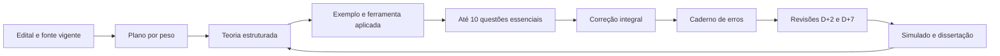

# Método de Preparação para Administrador - CRA-PR 2026

## Finalidade

Este documento transforma o ciclo geral do projeto em uma rotina executável para o cargo de Administrador. O material deve ensinar, aplicar, corrigir e revisar; não basta acumular resumos ou questões.

## Ciclo central

O ciclo só avança quando o candidato consegue explicar a regra, diferenciar conceitos próximos e aplicar o conhecimento a uma situação.

## Rotina diária de 6h líquidas

| Bloco | Tempo | Atividade | Produto |
|---|---:|---|---|
| 1 | 1h30 | teoria do tema principal | conceitos, finalidade, elementos e contrastes |
| 2 | 1h20 | exemplos, ferramentas, casos e fonte oficial | aplicação, limites e passos de uso |
| 3 | 55min | 6 a 10 questões essenciais e correção integral | respostas justificadas e lacunas identificadas |
| 4 | 35min | revisão fixa de disciplina de maior peso | recuperação ativa e itens do saldo do banco |
| 5 | 40min | Português ou dissertação | domínio linguístico e produção textual |
| 6 | 1h | recuperação ativa, fechamento e caderno de erros | causa, regra correta e próxima revisão |
| **Total** | **6h** | | |

Pausas não entram nas 6 horas. Os tempos são a configuração adotada na Semana 1; semanas futuras podem redistribuí-los sem ultrapassar 6 horas nem retirar a correção integral. No sábado, a dissertação completa pode receber cinco minutos do Bloco 6, como ocorre no Dia 6 da Semana 1.

## Bloco 1 - compreender

Para cada conceito ou modelo de Administração, responder:

1. o que é e qual problema procura resolver;
2. quais são seus elementos ou etapas;
3. em que contexto se aplica;
4. quais são vantagens e limitações;
5. com qual conceito costuma ser confundido;
6. qual exemplo organizacional demonstra seu uso;
7. qual tópico literal do edital o sustenta.

O estudo não começa por uma lista de nomes de autores. A teoria deve mostrar a lógica de cada abordagem e depois associar contribuições, críticas e contexto histórico.

## Bloco 2 - aplicar e confirmar

Usar a seguinte ordem:

1. edital e norma oficial, quando o tópico for normativo;
2. documento técnico do órgão competente;
3. bibliografia consolidada para teorias e modelos;
4. caso didático criado para aplicação.

Etiquetar as anotações:

- `[EDITAL]`: limite ou formulação cobrada;
- `[NORMA]`: regra jurídica confirmada em fonte oficial;
- `[MODELO]`: construção teórica da Administração;
- `[TÉCNICA]`: ferramenta, método ou procedimento;
- `[CASO]`: situação criada para treino;
- `[ALERTA]`: revogação, alteração, prazo encerrado ou limite de aplicação.

Em ferramentas como SWOT, GUT e 5W2H, o candidato deve saber finalidade, entradas, sequência, saída e erro de uso. Em casos, precisa justificar por que a ferramenta escolhida é mais adequada que as alternativas.

## Bloco 3 - resolver e corrigir

A primeira passagem tem **seis questões como núcleo executável e no máximo dez Essenciais por dia**. A lista de dez é uma fila ordenada: só avance além da sexta se ainda houver tempo para corrigir integralmente A-D; o saldo abre o D+2.

1. resolver sem consulta;
2. registrar alternativa, confiança e tempo;
3. conferir o gabarito;
4. explicar A, B, C e D;
5. voltar à seção exata da teoria;
6. classificar a causa do erro ou da insegurança;
7. refazer o item sem olhar a resposta;
8. agendar D+2 e D+7 quando necessário.

Categorias de erro:

- desconhecimento;
- confusão entre conceitos;
- inversão de etapa, competência ou finalidade;
- aplicação inadequada da ferramenta;
- norma desatualizada ou relação normativa ignorada;
- interpretação do enunciado;
- desatenção a comando negativo;
- cálculo ou procedimento;
- gestão de tempo.

Acerto por palpite ou com justificativa errada entra no caderno como insegurança.

## Banco de questões e jornada real

Para compatibilidade com o projeto, uma semana completa pode conter:

- 300 questões principais, 50 por dia;
- 120 questões extras de revisão fixa, 20 por dia;
- comentários completos para todos os itens;
- super simulado suplementar de 60 questões.

Esse volume é um **banco adaptativo**, não a tarefa da primeira passagem. A distribuição é:

| Momento | Uso do banco |
|---|---|
| D0 | seis essenciais como núcleo; até 10, com correção integral |
| D+2 | saldo não resolvido da fila D0, em ordem, com correção integral; erro grave ou acerto inseguro só entra se restar tempo |
| Aprofundamento | questões difíceis dos tópicos já compreendidos |
| D+7 | fila de reabertura, erros e conjunto misto cumulativo |
| Ciclo seguinte | reparo, manutenção e simulado |

É melhor corrigir de 6 a 10 itens de verdade do que responder 50 superficialmente.

O bloco D+2 tem **35 minutos**. Ele não soma o saldo de até quatro Essenciais a uma lista adicional de cinco reaberturas. Execute o saldo da fila D0 na ordem e pare quando não houver tempo para correção A-D; qualquer remanescente, assim como a lista de reabertura, segue para D+7. Em dia com Base Zero no mesmo bloco, preserve o contato curto previsto no roteiro e reduza a quantidade de itens, nunca a qualidade da correção.

## Revisão espaçada

Cada tema recebe quatro contatos mínimos:

| Momento | Ação |
|---|---|
| D0 | resumo oral de 2 minutos, checklist e caderno de erros |
| D+2 | recuperação sem consulta e saldo da fila D0, até o limite real de 35 minutos |
| D+7 | fila de reabertura, questões mistas, mapa comparativo e erros refeitos |
| D+21 | mini simulado cumulativo e comparação do desempenho |

Erro grave ou repetido pode retornar antes de D+2. O agendamento conta da data de estudo, não da criação do arquivo. Quando um dia de descanso impedir o intervalo exato, registre a data prevista e a data efetiva e use o próximo bloco disponível, sem criar uma sessão extra oculta.

## Caderno de erros de Administração

| Campo | Conteúdo |
|---|---|
| Disciplina e assunto | classificação precisa |
| Questão/caso | número e comando resumido |
| Minha resposta | alternativa, cálculo ou decisão |
| Causa | categoria do método |
| Regra correta | explicação curta com palavras próprias |
| Fonte | norma, documento técnico ou seção da teoria |
| Contraste | conceito ou etapa confundida |
| Aplicação | exemplo novo que comprova o entendimento |
| Recuperação | pergunta curta para responder sem consulta |
| Agenda | D+2, D+7, D+21 e resultado |

`Desatenção` só é diagnóstico válido quando o registro identifica a palavra, o comando ou a etapa ignorada.

## Método da dissertação

### Critérios oficiais

Para Administrador, a dissertação:

- versa sobre tema de conhecimento geral;
- vale 20 pontos;
- exige 20 a 30 linhas, conforme o item 5.2.9.1, alínea `a`;
- exige mínimo de 12 pontos;
- é manuscrita e sem consulta;
- integra o tempo total de 4 horas.

Distribuição oficial da correção:

| Critério | Pontos |
|---|---:|
| Conhecimento e compreensão do conteúdo | 4 |
| Desenvolvimento da argumentação, objetividade e informatividade | 4 |
| Coerência e progressão textual | 3 |
| Estruturação sintática | 2 |
| Morfossintaxe | 3 |
| Acentuação, ortografia, translineação, maiúsculas/minúsculas e pontuação | 4 |
| **Total** | **20** |

### Estrutura funcional

Dentro de 20 a 30 linhas:

1. introdução com recorte do tema e tese;
2. primeiro desenvolvimento com argumento, explicação e exemplo pertinente;
3. segundo desenvolvimento com argumento complementar, consequência ou contraponto;
4. conclusão coerente com a tese, sem inserir assunto novo.

Não inventar dados, citações ou estatísticas. Repertório só entra quando puder ser explicado e ligado ao argumento.

### Progressão semanal

| Dia | Treino |
|---|---|
| Segunda | interpretar o tema, delimitar e formular tese |
| Terça | escrever um parágrafo com tópico frasal, explicação, exemplo e fechamento |
| Quarta | treinar coesão referencial e sequencial em duas sequências argumentativas |
| Quinta | construir contraponto, concessão e reafirmação da tese |
| Sexta | produzir introdução e conclusão coerentes entre si |
| Sábado | produzir texto completo manuscrito e cronometrado |

Na Semana 1, o texto completo serve como diagnóstico. Da Semana 2 à 7, produzir pelo menos um texto integral por semana. Na Semana 8, os dois simulados reproduzem objetiva e dissertação em 4 horas. Na Semana 9, fazer apenas reparo leve.

### Autocorreção

Aplicar os mesmos 20 pontos oficiais. Além da nota, registrar:

- linhas utilizadas;
- tempo de planejamento, redação e revisão;
- tese em uma frase;
- argumento menos desenvolvido;
- repetição vocabular ou falha sintática recorrente;
- trecho que será reescrito.

## Estudo de normas

Para cada ato:

1. confirmar a versão na fonte oficial;
2. identificar objeto, destinatários e competências;
3. separar regra, requisito, exceção, prazo e consequência;
4. mapear alteração e revogação;
5. transformar dispositivos centrais em perguntas;
6. aplicar a um caso curto;
7. registrar o corte do edital.

Alertas obrigatórios:

- RN nº 671/2025 revoga a nº 640/2024;
- RN nº 670/2025 altera a nº 649/2024;
- RN nº 627/2023 altera a nº 626/2023, cujo PERC encerrou adesões em 22/12/2023;
- RN nº 651/2024 substitui o antigo regimento da RN nº 263/2001;
- RN nº 680/2025 revoga a nº 633/2023; as INs nº 9 a 14/2026 servem ao controle operacional atual, mas só integram o conteúdo cobrável depois da conferência individual de publicação e entrada em vigor no corte do item 5.3.6 do edital.

## Diagnóstico semanal

| Indicador | Registro |
|---|---|
| Horas líquidas planejadas/realizadas | X/36h |
| Essenciais resolvidas/corrigidas/refeitas | X/X/X |
| Questões do saldo usadas em revisão | X |
| Acerto por disciplina e tamanho da amostra | percentual + N |
| Acertos com baixa confiança | X |
| Erros repetidos | lista curta |
| Revisões D+2 e D+7 vencidas | X |
| Nota/linhas/tempo da dissertação | X/20; X linhas; X min |
| Principal reparo | uma ação concreta |

Percentual sem tamanho e dificuldade da amostra não demonstra domínio.

## Regra de avanço

Antes de iniciar conteúdo pesado:

1. corrigir as questões essenciais;
2. atualizar o caderno de erros;
3. cumprir a revisão D+2 vencida;
4. conferir fontes normativas usadas;
5. reprogramar toda pendência com data;
6. preservar o limite de carga da primeira passagem.

Semana com produção ainda incompleta permanece `Em produção`; falha eliminatória não sanada exige `Revisão obrigatória`. Depois do aceite de produção, o status é `Material aprovado para execução` até que o candidato conclua estudo, correções, revisões e dissertação e o aceite operacional seja registrado. Produção pronta e estudo executado são aceites diferentes.
