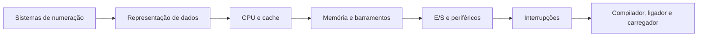
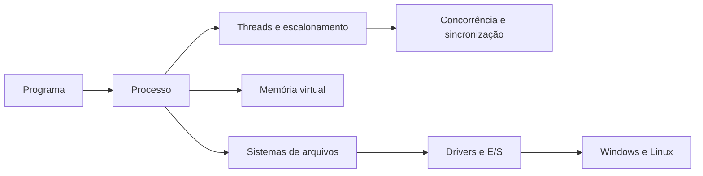
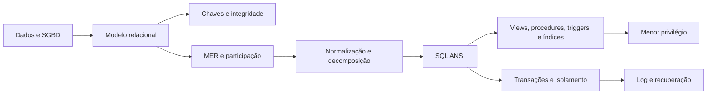
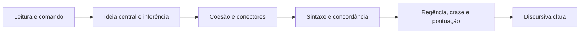
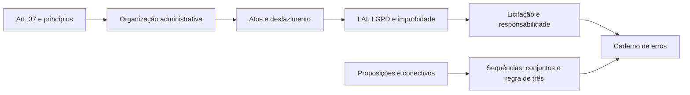

# Apostila de Estudo - Semana 1

## CRA-PR 2026 - Analista de Sistemas

**Versão 1.2**

Material de estudo direcionado para a primeira semana de preparação, com foco em construção de base forte, revisão diária de matérias de alto peso e aderência ao edital oficial vigente.

---

## Versão do edital utilizada

- **Nome do concurso:** Concurso Público do Conselho Regional de Administração do Paraná - CRA-PR.
- **Cargo:** Analista de Sistemas.
- **Banca:** Instituto Consulplan.
- **Versão do edital:** Edital de Concurso Público nº 1/2026, consolidado no arquivo oficial identificado como **conforme Retificação I**.
- **Data da retificação:** **Ponto pendente de confirmação.** O PDF oficial consolidado usado como base informa "conforme Retificação I", mas a data do ato isolado de retificação não foi localizada no próprio PDF consolidado consultado.
- **Arquivo oficial usado:** `../edital/edital_cra_pr_2026_analista_sistemas_retificacao_1.pdf`.
- **Link oficial consultado:** https://cdnsite.institutoconsulplan.org.br/concursos/1330/b2c07c473c9749fea22728da3c964c06.pdf
- **Observação sobre o Código de Ética:** o edital oficial consolidado conforme Retificação I cita a **Resolução Normativa CFA nº 671/2025** como Código de Ética dos profissionais da Administração. A página oficial do CFA da RN CFA nº 671/2025 informa expressamente que ela revogou a RN CFA nº 640/2024. Portanto, nesta apostila a RN CFA nº 671/2025 será usada apenas porque está indicada no edital vigente e há fonte oficial do CFA comprovando a revogação da RN CFA nº 640/2024.
- **Observação sobre o Regimento Interno do CRA-PR:** a RN CFA nº 651/2024 será citada apenas como norma oficial que aprova o Regimento do Conselho Regional de Administração do Paraná, conforme fonte oficial do CFA.

---

## Mapa de Pontuação e Prioridade

A prova objetiva para Analista de Sistemas tem 50 questões, todas com valor de 2 pontos, totalizando 100 pontos. A distribuição por disciplina define a estratégia de estudo: primeiro entram as matérias que concentram mais pontos e que têm maior impacto direto na classificação.

| Disciplina | Questões | Pontos | Prioridade |
|---|---:|---:|---|
| Conhecimentos do Cargo | 15 | 30 | Muito alta |
| Legislação CRA-PR/CFA | 10 | 20 | Muito alta |
| Língua Portuguesa | 10 | 20 | Muito alta |
| Administração Pública e Legislação Correlata | 5 | 10 | Média |
| Raciocínio Lógico-Matemático | 5 | 10 | Média |
| Informática | 5 | 10 | Baixa nesta primeira etapa |

Conhecimentos do Cargo, Legislação CRA-PR/CFA e Língua Portuguesa somam **35 questões**, ou seja, **70 pontos da objetiva**. Por isso, a Semana 1 prioriza base técnica, legislação específica e Português, mantendo revisões curtas diárias de Administração Pública, interpretação e discursiva.

O objetivo prático é evitar dois erros comuns de preparação: estudar apenas TI e perder pontos previsíveis em legislação/Português, ou estudar apenas teoria geral e deixar fraca a matéria de maior peso, que é Conhecimentos do Cargo.

---

## Como usar esta apostila

Esta apostila é a parte de estudo teórico da Semana 1. A apostila de questões será separada e seguirá exatamente a mesma divisão por dias.

Use o material assim:

1. Leia o objetivo e o motivo de cobrança do dia.
2. Estude a teoria com atenção ativa.
3. Refaça os exemplos resolvidos sem olhar a resolução.
4. Marque as pegadinhas e os erros comuns.
5. Preencha o checklist.
6. Registre no caderno de erros tudo que você errou, confundiu ou demorou para responder.

### Rotina diária fixa de 6h líquidas

Cada dia terá um tema principal, mas todos os dias também terão revisão curta de matérias de alto peso.

| Bloco | Tempo líquido | Atividade |
|---|---:|---|
| Bloco 1 | 2h | Tema principal do dia |
| Bloco 2 | 1h30 | Tema principal do dia |
| Bloco 3 | 1h | Tema principal do dia com exemplos e prática guiada |
| Bloco 4 | 40min | Revisão rápida de Legislação CRA/CFA, Administração Pública, Raciocínio Lógico-Matemático ou Informática |
| Bloco 5 | 30min | Português, interpretação ou discursiva |
| Bloco 6 | 20min | Caderno de erros e revisão ativa |

Pausas sugeridas, fora das 6h líquidas: 10min após o Bloco 1, 15min após o Bloco 2, 10min após o Bloco 3 e 5min antes do caderno de erros.

### Como executar cada bloco do dia

A lógica de estudo não vale apenas para os Blocos 1, 2 e 3. Os Blocos 4, 5 e 6 também devem seguir um passo a passo claro, para que a revisão fixa, o treino de Português/discursiva e o caderno de erros não virem apenas leitura solta.

| Bloco | Função | Passo a passo obrigatório |
|---|---|---|
| Bloco 1 | Abrir o tema principal | **Teoria explicada de forma didática**; leitura ativa; marcação dos conceitos centrais; anotação das diferenças entre conceitos parecidos. |
| Bloco 2 | Aprofundar o tema principal | **Teoria explicada de forma didática**; exemplos resolvidos; aplicação em situações de prova; identificação de pegadinhas da Consulplan. |
| Bloco 3 | Praticar o tema principal | **Teoria explicada de forma didática** nos pontos que ainda ficaram fracos; exercícios guiados; questões principais; correção imediata dos erros. |
| Bloco 4 | Revisão fixa do dia | **Teoria explicada de forma didática** do assunto revisado; leitura curta da norma ou conceito; 10 a 20 questões extras; registro das confusões mais prováveis. |
| Bloco 5 | Português, interpretação ou discursiva | **Teoria explicada de forma didática** do ponto linguístico; leitura de trecho curto; reescrita ou análise gramatical; treino de parágrafo quando houver discursiva. |
| Bloco 6 | Caderno de erros e revisão ativa | **Teoria explicada de forma didática** apenas do erro cometido; transformar erro em regra curta; criar flashcard, mapa mental ou alerta de pegadinha; definir o que volta no dia seguinte. |

Em todos os blocos, a pergunta final deve ser: "eu sei explicar isso sem olhar?". Se a resposta for não, o ponto entra no caderno de erros.

---

## Mapa da Semana 1

| Dia | Tema principal | Revisão curta | Foco de prova |
|---|---|---|---|
| Dia 1 | Arquitetura e organização de computadores | Legislação CRA/CFA | Conhecimentos do Cargo |
| Dia 2 | Sistemas operacionais | Administração Pública | Conhecimentos do Cargo |
| Dia 3 | Banco de dados base e SQL | Legislação CRA/CFA | Conhecimentos do Cargo |
| Dia 4 | Legislação CRA-PR/CFA | Administração Pública | Legislação específica |
| Dia 5 | Português e discursiva | Legislação CRA/CFA | Português e discursiva |
| Dia 6 | Administração Pública, RLM e revisão | Legislação CRA/CFA | Revisão e consolidação |

---

# Dia 1 - Arquitetura e Organização de Computadores

## Objetivo do dia

Construir base sólida em arquitetura e organização de computadores, especialmente sistemas de numeração, representação de dados, aritmética computacional, organização de CPU/memória, interrupções, endereçamento e tradução de programas.

Ao final do dia, você deve conseguir:

- converter números entre decimal, binário e hexadecimal;
- entender como dados são representados internamente;
- diferenciar CPU, memória, barramentos, registradores, cache e dispositivos de entrada/saída;
- explicar interrupções e endereçamento;
- diferenciar compilador, ligador e interpretador.

## Por que esse assunto importa para a prova

O edital de Analista de Sistemas abre Conhecimentos do Cargo com arquitetura e organização de computadores. Isso indica que a banca considera o tema base para os demais assuntos técnicos. Mesmo quando a questão parece de sistemas operacionais, redes ou banco de dados, ela frequentemente depende de noções de memória, processamento, representação de dados e execução de instruções.

Esse tema também é bom para ganhar pontos porque muitas questões têm resposta objetiva: conversões, conceitos e diferenças entre componentes. A dificuldade está nas pegadinhas de nomenclatura.

## Como a Consulplan costuma cobrar esse conteúdo

A Consulplan costuma cobrar esse tema de quatro formas:

- conversão simples entre bases numéricas, principalmente hexadecimal e decimal;
- identificação de componentes de arquitetura, como CPU, memória, cache e barramentos;
- distinção entre conceitos próximos, por exemplo compilador, interpretador e ligador;
- aplicação em cenário prático, como escolha de memória, análise de desempenho ou funcionamento de periféricos.

A banca gosta de alternativas com afirmações quase corretas, trocando uma palavra essencial: volátil por permanente, compilação por interpretação, memória principal por memória secundária, endereço físico por endereço lógico.

## Cronograma de 6h líquidas com pausas sugeridas

| Bloco | Tempo | Atividade |
|---|---:|---|
| 1 | 2h | Sistemas de numeração, representação de dados e aritmética computacional |
| Pausa | 10min | Descanso |
| 2 | 1h30 | CPU, memória, barramentos, cache, periféricos e interrupções |
| Pausa | 15min | Descanso |
| 3 | 1h | Endereçamento, compiladores, ligadores e interpretadores + exemplos |
| Pausa | 10min | Descanso |
| 4 | 40min | Revisão rápida de Legislação CRA/CFA: Lei 4.769/1965, finalidade do Sistema CFA/CRA |
| Pausa | 5min | Descanso |
| 5 | 30min | Português: interpretação de enunciados técnicos e identificação de comando da questão |
| 6 | 20min | Caderno de erros: conversões, siglas e conceitos confundidos |

## Conteúdo dos blocos de revisão e consolidação

### Bloco 4 — Legislação CRA/CFA (40min)

**O que estudar:** a Lei nº 4.769/1965 é a base da profissão e do Sistema CFA/CRAs; o Decreto nº 61.934/1967 regulamenta o exercício. O CFA atua na coordenação e normatização nacional; o CRA atua na jurisdição regional, com registro e fiscalização. O diploma comprova formação, mas não substitui o registro quando ele é exigido para o exercício regular.

**Regra de decisão:** em caso prático, identifique primeiro quem é o sujeito (CFA, CRA, profissional ou pessoa jurídica), depois a competência territorial e por fim a norma-base. Não confunda a Lei que estrutura o sistema com o Código de Ética, que disciplina condutas.

**Exemplo:** se uma questão afirmar que o CRA-PR deixa de seguir norma geral do CFA por possuir autonomia administrativa, a alternativa é incorreta: autonomia não rompe a integração ao Sistema CFA/CRAs.

**Pegadinha:** trocar registro por diploma, CRA por CFA ou fiscalização por mera atividade consultiva.

### Bloco 5 — Português aplicado a enunciados técnicos (30min)

**O que estudar:** antes de ler alternativas, sublinhe o comando: “correta”, “incorreta”, “exceto”, “infere-se” ou “equivale”. Ideia central é a afirmação que organiza o texto; inferência é conclusão autorizada pelas informações, não opinião externa. Conectores preservam relações: “porque” indica causa, “embora” concessão e “portanto” conclusão.

**Regra de decisão:** alternativa tecnicamente familiar pode estar errada se responder ao comando oposto ou trocar a relação lógica do texto. Termos absolutos como “sempre”, “nunca” e “elimina qualquer” exigem prova textual ou técnica forte.

**Exemplo:** de “cache pode reduzir a latência média”, não se infere que cache elimina toda demora de memória; “pode” não é “sempre”.

**Pegadinha:** escolher informação verdadeira que não responde à pergunta, especialmente em itens negativos.

### Bloco 6 — Caderno de erros (20min)

Registre cada erro em quatro campos: **conceito confundido**, **regra correta**, **contraexemplo** e **sinal de prova**. Neste dia, priorize conversão binário/hexadecimal, bit × byte, cache × RAM, interrupção × polling e compilador × ligador × carregador.

**Exemplo de registro:** “Confundi hexadecimal com decimal. Regra: cada dígito hexadecimal vale quatro bits. Contraexemplo: `FF` é 255 decimal. Sinal: alternativa mistura bases ou usa peso decimal em número hexadecimal.”

## Teoria explicada de forma didática

### 1. Sistemas de numeração

Computadores trabalham internamente com sinais binários. Por isso, a base 2 é central em computação. Em provas, você precisa dominar principalmente:

- **Decimal:** base 10, usa os dígitos 0 a 9.
- **Binário:** base 2, usa os dígitos 0 e 1.
- **Hexadecimal:** base 16, usa 0 a 9 e A a F.

Cada posição de um número tem peso. No decimal, os pesos são potências de 10. No binário, potências de 2. No hexadecimal, potências de 16.

Exemplo: o número binário `1011` vale:

`1 x 2^3 + 0 x 2^2 + 1 x 2^1 + 1 x 2^0 = 8 + 0 + 2 + 1 = 11`.

No hexadecimal, `1F` vale:

`1 x 16^1 + F x 16^0 = 16 + 15 = 31`.

### Como funciona na prática

Hexadecimal é muito usado porque representa binários longos de forma curta. Cada dígito hexadecimal corresponde exatamente a 4 bits.

Exemplo:

- `1111` em binário = `F` em hexadecimal.
- `1010` em binário = `A` em hexadecimal.
- `1111 0000` em binário = `F0` em hexadecimal.

Isso aparece em endereços de memória, máscaras, dumps, cores em HTML/CSS, identificadores e configurações de baixo nível.

### Exemplos resolvidos - sistemas de numeração

**Exemplo 1:** converter `101101` de binário para decimal.

Pesos:

- `1 x 2^5 = 32`
- `0 x 2^4 = 0`
- `1 x 2^3 = 8`
- `1 x 2^2 = 4`
- `0 x 2^1 = 0`
- `1 x 2^0 = 1`

Resultado: `32 + 8 + 4 + 1 = 45`.

**Exemplo 2:** converter `2A` de hexadecimal para decimal.

`A` vale 10.

`2A = 2 x 16^1 + 10 x 16^0 = 32 + 10 = 42`.

**Exemplo 3:** converter `1110 0111` para hexadecimal.

Separe em grupos de 4 bits:

- `1110 = E`
- `0111 = 7`

Resultado: `E7`.

### Conversão hexadecimal para decimal

Para converter hexadecimal para decimal, multiplique cada dígito pela potência de 16 correspondente à sua posição. A leitura é da direita para a esquerda:

- posição mais à direita: `16^0`;
- segunda posição da direita para a esquerda: `16^1`;
- terceira posição: `16^2`;
- e assim por diante.

Lembre a tabela básica:

| Hexadecimal | Decimal |
|---|---:|
| A | 10 |
| B | 11 |
| C | 12 |
| D | 13 |
| E | 14 |
| F | 15 |

**Exemplo 4:** converter `B7` para decimal.

`B` vale 11 e `7` vale 7.

`B7 = 11 x 16^1 + 7 x 16^0 = 176 + 7 = 183`.

**Exemplo 5:** converter `3F` para decimal.

`F` vale 15.

`3F = 3 x 16^1 + 15 x 16^0 = 48 + 15 = 63`.

### 2. Representação de dados

Dados precisam ser codificados para serem processados. Os principais conceitos:

- **Bit:** menor unidade de informação, valor 0 ou 1.
- **Byte:** conjunto de 8 bits.
- **Word/palavra:** unidade natural de processamento de uma arquitetura, como 32 ou 64 bits.
- **Inteiros:** podem ser sem sinal ou com sinal.
- **Caracteres:** representados por códigos, como ASCII ou Unicode.
- **Ponto flutuante:** usado para números reais aproximados.

Uma pegadinha comum é achar que todo número real é representado exatamente. Em computação, ponto flutuante é aproximação. Isso pode gerar pequenos erros de arredondamento.

### Como funciona na prática

Quando um sistema grava a letra `A`, ele não guarda "a letra" como objeto abstrato. Ele guarda um código numérico. Em ASCII, `A` corresponde a 65 em decimal, que é `01000001` em binário.

Quando um sistema trabalha com inteiros com sinal, precisa reservar uma forma de indicar valores negativos. A técnica mais comum é o complemento de dois.

### Exemplos resolvidos - representação de dados

**Exemplo 1:** quantos valores distintos podem ser representados com 8 bits?

Cada bit tem 2 possibilidades. Com 8 bits:

`2^8 = 256`.

Se for inteiro sem sinal, o intervalo costuma ser de 0 a 255.

**Exemplo 2:** por que 1 byte pode representar 256 valores, e não 255?

Porque a contagem inclui o zero. Com 8 bits, temos 256 combinações possíveis. Se a menor combinação é 0, a maior é 255.

**Exemplo 3:** qual é a diferença entre ASCII e Unicode?

ASCII é uma codificação menor, historicamente voltada a caracteres básicos. Unicode é um padrão mais amplo para representar caracteres de vários idiomas, símbolos e acentos.

### 3. CPU, memória, barramentos e cache

A CPU executa instruções. Para isso, usa registradores, unidade de controle, unidade lógica e aritmética e comunicação com memória.

Componentes essenciais:

- **Unidade de controle:** coordena a busca, decodificação e execução das instruções.
- **ULA/ALU:** realiza operações aritméticas e lógicas.
- **Registradores:** pequenas áreas de armazenamento dentro da CPU, extremamente rápidas.
- **Memória RAM:** memória principal, volátil, usada durante a execução dos programas.
- **Memória ROM:** memória não volátil, usada para armazenar instruções permanentes ou de inicialização.
- **Firmware:** software gravado em memória não volátil, próximo ao hardware, usado para inicializar ou controlar dispositivos.
- **Cache:** memória muito rápida entre CPU e RAM.
- **Barramentos:** caminhos de comunicação para dados, endereços e controle.
- **Armazenamento secundário:** SSD, HD e mídias persistentes.

#### ROM vs RAM

RAM e ROM aparecem em questões porque ambas são "memórias", mas têm funções diferentes.

| Memória | Característica | Uso típico | Pegadinha |
|---|---|---|---|
| RAM | Volátil, leitura e escrita, rápida | Programas e dados em execução | Achar que guarda arquivos permanentemente |
| ROM | Não volátil, tende a preservar conteúdo | Rotinas de inicialização e firmware | Achar que funciona como memória principal comum |

A **RAM** perde seu conteúdo quando falta energia. Ela serve como área de trabalho do sistema em execução. A **ROM** tende a preservar o conteúdo e costuma armazenar instruções de inicialização ou componentes de firmware.

#### Registradores

Registradores são as áreas de armazenamento mais rápidas usadas diretamente pela CPU. Eles ficam dentro do processador e armazenam temporariamente operandos, endereços e resultados usados diretamente pela CPU.

Exemplos comuns de registradores:

- **contador de programa/PC:** indica a próxima instrução a ser buscada;
- **registrador de instrução/IR:** guarda a instrução em execução;
- **acumulador ou registradores gerais:** guardam operandos e resultados intermediários;
- **registradores de endereço:** ajudam a localizar dados na memória;
- **registradores de estado/flags:** indicam resultados de operações, como zero, sinal, carry ou overflow.

A pegadinha é comparar registrador com RAM ou SSD. Registrador é muito menor, muito mais rápido e fica dentro da CPU. RAM é memória principal. SSD/HD são armazenamento persistente.

#### Pipeline de CPU

Pipeline é uma técnica em que a CPU sobrepõe etapas de execução de instruções. Em vez de esperar uma instrução passar por todas as etapas para só então iniciar a próxima, a CPU pode buscar uma instrução enquanto decodifica outra e executa uma terceira.

Modelo simplificado:

1. **Busca:** obter a instrução na memória.
2. **Decodificação:** identificar qual operação será feita.
3. **Execução:** realizar a operação.
4. **Acesso à memória:** ler ou escrever dados, se necessário.
5. **Escrita de resultado:** gravar o resultado no registrador ou destino.

Pipeline melhora a **vazão** do processador, isto é, a quantidade de instruções concluídas por unidade de tempo. Ele não significa, necessariamente, que uma instrução individual terá menor latência.

#### Throughput vs latência

| Conceito | Ideia | Exemplo |
|---|---|---|
| Latência | Tempo para uma operação individual terminar | Tempo de uma instrução específica do início ao fim |
| Throughput/vazão | Quantidade de operações concluídas por unidade de tempo | Instruções concluídas por ciclo ou por segundo |

Na prova, a frase "pipeline sempre reduz o tempo de cada instrução" deve acender alerta. Pipeline tende a aumentar o throughput, mas uma instrução individual ainda passa por etapas e pode sofrer atrasos por dependências, desvios e conflitos de recursos.

#### Cache, localidade e políticas de escrita

Cache melhora desempenho porque explora o princípio da localidade:

- **Localidade temporal:** se um dado foi acessado agora, há boa chance de ser acessado novamente em breve.
- **Localidade espacial:** se um endereço foi acessado, endereços próximos tendem a ser acessados em breve.

Exemplo de localidade temporal: repetir várias vezes uma variável dentro de um laço.  
Exemplo de localidade espacial: percorrer um vetor sequencialmente.

Políticas de escrita mais cobradas:

| Política | Como funciona | Vantagem | Risco/atenção |
|---|---|---|---|
| Write-through | Escreve no cache e na memória principal imediatamente | Memória principal fica mais atualizada | Pode gerar mais tráfego de memória |
| Write-back | Escreve primeiro no cache e atualiza a memória depois | Reduz escritas na memória principal | Exige controle de consistência, como bit de sujeira/dirty bit |

Cache não substitui ULA, registradores, RAM ou SSD. Ela reduz tempo médio de acesso, mas quem executa operações aritméticas e lógicas é a ULA.

### Como funciona na prática

Quando você abre um programa:

1. O programa está armazenado no SSD/HD.
2. O sistema operacional carrega partes do programa para a RAM.
3. A CPU busca instruções na memória.
4. A CPU decodifica e executa essas instruções.
5. Dados frequentemente usados podem ficar em cache.

Quanto mais próximo da CPU, mais rápida e cara tende a ser a memória. A hierarquia típica é:

registradores > cache > RAM > SSD > HD.

### Exemplos resolvidos - CPU e memória

**Exemplo 1:** se uma questão afirma que a RAM armazena permanentemente os arquivos do usuário, a afirmação está correta?

Não. A RAM é volátil. Ela mantém dados em uso enquanto há energia e execução. Armazenamento permanente é função de SSD, HD ou outro meio persistente.

**Exemplo 2:** por que cache melhora desempenho?

Porque reduz o tempo médio de acesso a dados e instruções frequentemente usados. A CPU é muito mais rápida que a RAM; se toda busca dependesse diretamente da RAM, a CPU ficaria esperando com mais frequência.

**Exemplo 3:** barramento de endereços e barramento de dados são iguais?

Não. O barramento de endereços indica onde acessar. O barramento de dados transporta o conteúdo lido ou escrito.

**Exemplo 4:** pipeline sempre diminui a latência de cada instrução?

Não. Pipeline tende a melhorar a vazão, permitindo que várias instruções estejam em etapas diferentes. A latência de uma instrução individual não necessariamente diminui.

**Exemplo 5:** qual é a diferença entre write-through e write-back?

No write-through, a escrita vai para cache e memória principal imediatamente. No write-back, a escrita fica inicialmente no cache e a memória é atualizada depois, reduzindo tráfego, mas exigindo controle de consistência.

### 4. Interrupções, periféricos e entrada/saída

Interrupção é um mecanismo pelo qual um evento sinaliza à CPU que precisa de atenção. Pode vir de hardware ou software.

Exemplos:

- teclado pressionado;
- chegada de pacote de rede;
- conclusão de operação de disco;
- erro de divisão por zero;
- chamada de sistema.

Sem interrupções, a CPU teria que consultar repetidamente cada dispositivo para saber se algo aconteceu. Isso desperdiçaria processamento.

#### Polling vs interrupções

No **polling**, a CPU pergunta repetidamente ao dispositivo se ele precisa de atendimento. É simples, mas pode desperdiçar processamento quando nada acontece.

Na **interrupção**, o dispositivo ou controlador sinaliza quando precisa de atenção. A CPU não precisa ficar perguntando continuamente; ela pode executar outras tarefas e ser avisada quando houver evento.

| Técnica | Como funciona | Ponto forte | Pegadinha |
|---|---|---|---|
| Polling | CPU consulta repetidamente o dispositivo | Simples de implementar | Pode desperdiçar CPU |
| Interrupção | Dispositivo avisa a CPU quando precisa | Resposta eficiente a eventos | Não significa erro; pode ser evento normal |

#### DMA

DMA significa **Direct Memory Access**, ou acesso direto à memória. É uma técnica em que um controlador transfere dados entre dispositivo de E/S e memória principal com menor intervenção da CPU.

Sem DMA, a CPU teria que participar mais ativamente da transferência de cada bloco de dados. Com DMA, a CPU configura a operação, o controlador realiza a transferência e a CPU é avisada ao final, normalmente por interrupção.

Isso é importante em operações de disco, rede e outros dispositivos que movimentam grande volume de dados.

### Como funciona na prática

Quando uma tecla é pressionada, o teclado gera um evento. O controlador de interrupção avisa a CPU. A CPU pausa temporariamente o fluxo atual, salva o contexto necessário, executa uma rotina de tratamento da interrupção e depois retorna ao que estava fazendo.

### Exemplos resolvidos - interrupções e E/S

**Exemplo 1:** interrupção sempre indica erro?

Não. Pode indicar eventos normais, como entrada de dados, término de E/S ou temporizador do sistema.

**Exemplo 2:** por que interrupções são importantes para sistemas operacionais multitarefa?

Porque permitem alternância de execução, resposta a eventos e gerenciamento eficiente de dispositivos. O temporizador, por exemplo, ajuda o SO a interromper um processo e dar tempo de CPU a outro.

**Exemplo 3:** polling e interrupção resolvem o mesmo problema do mesmo jeito?

Não. Ambos lidam com eventos de dispositivos, mas polling consulta repetidamente; interrupção sinaliza quando há evento.

**Exemplo 4:** DMA elimina a CPU do sistema?

Não. DMA reduz a intervenção da CPU na transferência de dados, mas a CPU ainda configura a operação, coordena o sistema e trata a conclusão quando necessário.

### 5. Endereçamento

Endereçamento é o modo como a arquitetura localiza dados e instruções. Em termos simples, a CPU precisa saber onde buscar operandos e onde gravar resultados.

Conceitos importantes:

- **Endereço de memória:** posição usada para localizar dado ou instrução.
- **Endereço lógico/virtual:** endereço visto pelo programa.
- **Endereço físico:** endereço real na memória principal.
- **Modos de endereçamento:** formas de indicar operandos, como imediato, direto, indireto, por registrador.

| Modo        | Onde está o valor?                         | Exemplo               | Ideia                    |
| ----------- | ------------------------------------------ | --------------------- | ------------------------ |
| Imediato    | Na própria instrução                       | `MOV R1, 10`          | Use o valor 10           |
| Direto      | Em um endereço de memória                  | `LOAD R1, [1000]`     | Busque na gaveta 1000    |
| Indireto    | Em um endereço apontado por outro endereço | `LOAD R1, [[1000]]`   | Vá onde o bilhete mandar |
| Registrador | Dentro da CPU                              | `ADD R1, R2`          | Use valores já na CPU    |
| Indexado    | Base + deslocamento                        | `LOAD R1, [BASE + i]` | Acessar arrays/listas    |


### Como funciona na prática

Em sistemas com memória virtual, o programa trabalha com endereços virtuais. O sistema operacional e a unidade de gerenciamento de memória fazem a tradução para endereços físicos. Isso permite isolamento entre processos e melhor gestão da memória.

### Exemplos resolvidos - endereçamento

**Exemplo 1:** no modo imediato, o operando está onde?

Está na própria instrução. Exemplo conceitual: `MOV A, 5` move o valor imediato 5 para o registrador A.

**Exemplo 2:** por que endereço virtual não é a mesma coisa que endereço físico?

Porque o endereço virtual é a visão do processo; o físico corresponde à posição real na RAM. A tradução permite proteção, paginação e isolamento.

### 6. Compiladores, montadores, ligadores e carregadores

Esses conceitos aparecem muito em provas porque são parecidos.

- **Compilador:** traduz código-fonte de alto nível para código de máquina, código objeto ou código intermediário antes da execução.
- **Interpretador:** lê e executa comandos durante a execução.
- **Assembler/montador:** traduz linguagem de montagem para código de máquina.
- **Linker/ligador:** combina módulos compilados e bibliotecas, resolvendo referências externas para gerar o executável.
- **Loader/carregador:** coloca o executável na memória, prepara o ambiente de execução e inicia o programa.

### Como funciona na prática

Em C, é comum haver compilação de vários arquivos `.c` para arquivos objeto. O linker junta esses objetos e bibliotecas para gerar um executável. Depois, quando o usuário ou o sistema operacional inicia o programa, o loader carrega esse executável na memória.

Em Python, normalmente há interpretação/execução por uma máquina virtual, embora existam etapas internas de bytecode. Para concurso, o contraste clássico é: compilador traduz previamente; interpretador executa instrução a instrução ou unidade a unidade.

Fluxo simplificado:

1. Código-fonte em linguagem de alto nível é compilado.
2. Código assembly, quando houver, pode ser traduzido pelo assembler.
3. Arquivos objeto e bibliotecas são combinados pelo linker.
4. O executável é carregado na memória pelo loader.
5. A CPU executa instruções usando registradores, cache, RAM e barramentos.

### Exemplos resolvidos - tradução de programas

**Exemplo 1:** se um programa tem dois módulos compilados separadamente e um chama função do outro, quem resolve essa ligação?

O ligador/linker. Ele resolve referências externas entre módulos e bibliotecas.

**Exemplo 2:** qual é a diferença central entre compilador e interpretador?

O compilador traduz o programa antes da execução; o interpretador executa o código durante a execução, realizando a tradução/execução de forma incremental.

**Exemplo 3:** quem coloca o executável na memória para execução?

O loader/carregador. O linker gera o executável; o loader carrega esse executável na memória e prepara sua execução.

**Exemplo 4:** assembler e linker fazem a mesma coisa?

Não. O assembler traduz linguagem de montagem para código de máquina. O linker liga módulos e bibliotecas, resolvendo referências para formar o executável.

## Pegadinhas comuns da banca

- Dizer que RAM é memória permanente.
- Confundir ROM com RAM ou firmware com aplicativo comum.
- Confundir cache com memória secundária.
- Dizer que cache substitui a ULA.
- Dizer que pipeline sempre reduz a latência de cada instrução.
- Confundir throughput com latência.
- Afirmar que todo número real é representado exatamente.
- Trocar compilador por ligador.
- Trocar linker por loader.
- Dizer que interrupção é sempre erro.
- Confundir polling com interrupção.
- Achar que DMA elimina a CPU, quando na verdade reduz sua intervenção em transferências de E/S.
- Confundir endereço lógico com endereço físico.
- Esquecer que hexadecimal usa A=10, B=11, C=12, D=13, E=14, F=15.

## O que memorizar

| Conceito | Memorização objetiva |
|---|---|
| 1 byte | 8 bits |
| 8 bits | 256 combinações |
| Hexadecimal | 1 dígito = 4 bits |
| B7 hexadecimal | 11 x 16 + 7 = 183 |
| RAM | memória principal, volátil |
| ROM | memória não volátil, usada em rotinas permanentes/firmware |
| Firmware | software gravado próximo ao hardware |
| Cache | memória rápida entre CPU e RAM |
| Localidade temporal | reutilização de dado acessado recentemente |
| Localidade espacial | acesso provável a endereços próximos |
| Write-through | escreve no cache e na memória principal |
| Write-back | escreve no cache e atualiza a memória depois |
| ULA | operações aritméticas e lógicas |
| Unidade de controle | coordena execução de instruções |
| Registradores | armazenam temporariamente operandos, endereços e resultados usados diretamente pela CPU |
| Pipeline | sobrepõe etapas para melhorar vazão |
| DMA | transferência de E/S com menor intervenção da CPU |
| Polling | CPU consulta repetidamente o dispositivo |
| Linker | liga módulos e bibliotecas |
| Loader | carrega programa na memória |
| Assembler | traduz linguagem de montagem para código de máquina |
| Interrupção | mecanismo de atenção da CPU a evento |

## Erros comuns

| Erro | Correção |
|---|---|
| Achar que 8 bits representam 255 valores | Representam 256 valores; 0 a 255 sem sinal |
| Dizer que HD/SSD é memória principal | É armazenamento secundário |
| Tratar Unicode como sinônimo de ASCII | Unicode é mais amplo |
| Confundir barramento de dados com barramento de endereços | Um transporta conteúdo; outro indica localização |
| Dizer que compilador executa o programa | Compilador traduz; execução é outro processo |
| Usar "registrador" como sinônimo de memória RAM | Registrador fica dentro da CPU e é muito mais rápido |
| Achar que pipeline sempre acelera uma instrução isolada | Pipeline melhora principalmente throughput |
| Dizer que polling é mais eficiente em qualquer cenário | Polling pode desperdiçar CPU perguntando repetidamente |
| Dizer que write-back e write-through são iguais | Uma política atualiza memória imediatamente; a outra posterga |

## Mini revisão do dia

Arquitetura de computadores é a base física e lógica que permite a execução de programas. A CPU executa instruções usando registradores, ULA e unidade de controle. A memória segue uma hierarquia de velocidade e custo: registradores, cache, RAM e armazenamento secundário. RAM é volátil; ROM tende a preservar conteúdo e pode armazenar firmware. Cache explora localidade temporal e espacial. Pipeline melhora vazão, mas não garante menor latência individual. Interrupções evitam que a CPU precise ficar consultando dispositivos a todo momento; polling faz essa consulta repetida; DMA reduz intervenção da CPU em transferências de E/S. Compiladores, assemblers, linkers, loaders e interpretadores atuam em etapas diferentes da transformação do código em execução.

## Checklist de domínio

- [ ] Sei converter binário para decimal.
- [ ] Sei converter hexadecimal para decimal.
- [ ] Sei converter `B7` hexadecimal para decimal: `11 x 16 + 7 = 183`.
- [ ] Sei agrupar binário em quartetos para obter hexadecimal.
- [ ] Diferencio bit, byte, palavra e caractere.
- [ ] Sei explicar CPU, ULA, registradores, RAM, ROM, firmware, cache e barramentos.
- [ ] Diferencio latência e throughput.
- [ ] Sei explicar localidade temporal e localidade espacial.
- [ ] Diferencio write-back e write-through.
- [ ] Sei o que é interrupção e por que ela existe.
- [ ] Diferencio polling, interrupção e DMA.
- [ ] Diferencio endereço lógico/virtual e físico.
- [ ] Diferencio compilador, interpretador, assembler, linker e loader.

## Tarefa para o caderno de erros

Crie uma página chamada **Arquitetura - Erros e Confusões** e registre:

- bases numéricas que você confundiu;
- conceitos trocados, como RAM/ROM, RAM/SSD, cache/RAM, cache/ULA, compilador/linker, linker/loader;
- fórmulas simples: `2^n`, 1 byte = 8 bits, 1 hexadecimal = 4 bits;
- uma tabela com A=10, B=11, C=12, D=13, E=14, F=15.

## 5 perguntas de fixação

1. Por que o hexadecimal é útil para representar dados binários?
2. Qual é a diferença entre RAM, cache e armazenamento secundário?
3. O que acontece, em linhas gerais, quando uma interrupção é gerada?
4. Qual é a diferença entre endereço lógico/virtual e endereço físico?
5. Qual é o papel do assembler, do linker e do loader?

## Assuntos que serão cobrados na Apostila de Questões

Sistemas de numeração, conversão hexadecimal para decimal, representação de dados, CPU, registradores, RAM, ROM, firmware, cache, localidade temporal e espacial, políticas write-back/write-through, barramentos, pipeline, throughput, latência, polling, interrupções, DMA, dispositivos de E/S, endereçamento, assembler, linker, loader, compiladores e interpretadores.

## Tabela de revisão rápida do Dia 1

| Conceito | Definição curta | Pegadinha comum | Exemplo |
|---|---|---|---|
| RAM | Memória principal volátil usada por programas em execução | Dizer que guarda arquivos permanentemente | Dados de um programa aberto ficam na RAM durante a execução |
| ROM | Memória não volátil, voltada a conteúdo permanente ou inicialização | Tratar como RAM comum de trabalho | Rotina básica de inicialização |
| Firmware | Software gravado próximo ao hardware | Confundir com aplicativo do usuário | Código de controle de dispositivo |
| Registradores | Armazenam temporariamente operandos, endereços e resultados usados diretamente pela CPU | Confundir com RAM ou cache | PC indica próxima instrução |
| ULA | Executa operações aritméticas e lógicas | Dizer que cache executa operações | Soma, comparação, AND lógico |
| Cache | Memória rápida entre CPU e RAM | Dizer que substitui ULA ou SSD | Dado acessado repetidamente fica em cache |
| Localidade temporal | Reuso provável de dado acessado recentemente | Confundir com proximidade de endereço | Variável usada várias vezes em um laço |
| Localidade espacial | Acesso provável a endereços próximos | Confundir com reuso do mesmo dado | Percorrer vetor posição por posição |
| Write-through | Escrita no cache e na memória principal | Achar que posterga atualização da memória | Alteração refletida imediatamente na RAM |
| Write-back | Escrita no cache e atualização posterior da memória | Achar que memória principal fica atualizada imediatamente | Linha de cache marcada como dirty |
| Pipeline | Sobreposição de etapas da CPU | Dizer que sempre reduz latência individual | Buscar uma instrução enquanto outra executa |
| Throughput | Quantidade concluída por unidade de tempo | Confundir com tempo individual | Mais instruções concluídas por ciclo |
| Latência | Tempo de uma operação individual | Confundir com vazão total | Tempo de uma instrução do início ao fim |
| Polling | CPU consulta repetidamente o dispositivo | Dizer que sempre é mais eficiente | Perguntar ao dispositivo se há dado disponível |
| Interrupção | Evento sinaliza à CPU que precisa de atenção | Dizer que sempre é erro | Teclado, timer, pacote de rede |
| DMA | Transferência entre dispositivo e memória com menor intervenção da CPU | Dizer que elimina a CPU | Controlador move bloco de disco para RAM |
| Assembler | Traduz assembly para código de máquina | Confundir com linker | Montar instruções assembly |
| Linker | Liga módulos e bibliotecas | Confundir com loader | Resolver função externa entre arquivos objeto |
| Loader | Carrega executável na memória | Confundir com linker | Iniciar execução de um programa |
| Hexadecimal | Base 16, A=10 até F=15 | Esquecer valor de B ou F | `B7 = 11 x 16 + 7 = 183` |

## Pegadinhas do Dia 1

- Cache não substitui ULA: cache acelera acesso a dados; ULA executa operações aritméticas e lógicas.
- Pipeline melhora vazão, não necessariamente a latência individual de cada instrução.
- Linker liga módulos e bibliotecas; loader carrega o executável em memória.
- DMA reduz intervenção da CPU em transferências de E/S, mas não elimina a CPU do sistema.
- Polling desperdiça CPU quando fica perguntando repetidamente se o dispositivo tem evento.
- RAM é volátil; ROM tende a preservar conteúdo e pode armazenar rotinas permanentes ou firmware.
- `B7` hexadecimal = `11 x 16 + 7 = 183`.

---


## Revisão fixa do Dia 1

**Foco:** Legislação CRA/CFA e Português. Recupere Lei nº 4.769/1965, Decreto nº 61.934/1967, distinção CFA × CRA, registro e deveres; em Português, leitura de comando, conectores e inferência. **Base:** teoria do Dia 4 e Dia 5. **Pegadinha:** tratar diploma como registro ou trocar conclusão por causa.


## Mapa de conexões do Dia 1



**Leitura ativa:** dado precisa ser representado antes de ser processado; cache não é memória secundária; interrupção não é polling. **Pegadinhas:** bit × byte; cache × RAM; compilador × interpretador.

# Dia 2 - Sistemas Operacionais

## Objetivo do dia

Entender o papel do sistema operacional como gerenciador de recursos, com foco em processos, memória, memória virtual, paginação, segmentação, sistema de arquivos, dispositivos, concorrência, sincronização, deadlock e aspectos práticos de Windows/Linux.

## Por que esse assunto importa para a prova

Sistemas operacionais aparecem no edital como um bloco próprio dentro de Conhecimentos do Cargo. É um tema de alta probabilidade porque se relaciona diretamente às atribuições do Analista de Sistemas no CRA-PR: suporte a usuários, servidores de aplicação e banco de dados, backup, rede, estações de trabalho, segurança e sistemas de terceiros.

Além disso, a Consulplan costuma cobrar tanto conceito puro quanto aplicação prática, como comandos, comportamento de processos, memória virtual e administração básica de Windows/Linux.

## Como a Consulplan costuma cobrar esse conteúdo

O padrão mais comum é:

- "assinale a afirmativa correta" sobre funções do SO;
- V/F sobre memória, processos ou arquivos;
- cenário prático com falha de desempenho, deadlock ou consumo de memória;
- comparação entre Windows e Linux;
- alternativas que confundem processo, programa e thread.

## Cronograma de 6h líquidas com pausas sugeridas

| Bloco | Tempo | Atividade |
|---|---:|---|
| 1 | 2h | Conceitos de SO, processos, threads e escalonamento |
| Pausa | 10min | Descanso |
| 2 | 1h30 | Memória, memória virtual, paginação e segmentação |
| Pausa | 15min | Descanso |
| 3 | 1h | Arquivos, dispositivos, concorrência, sincronização e deadlock |
| Pausa | 10min | Descanso |
| 4 | 40min | Revisão rápida de Administração Pública: administração direta, indireta e autarquia |
| Pausa | 5min | Descanso |
| 5 | 30min | Português: leitura de enunciados com "exceto", "incorreta" e "não se aplica" |
| 6 | 20min | Caderno de erros: mapa processo x thread x programa |

## Conteúdo dos blocos de revisão e consolidação

### Bloco 4 — Administração Pública (40min)

Administração Direta reúne entes e órgãos; Administração Indireta reúne entidades com personalidade própria, como autarquias. Conselho profissional é autarquia: não é empresa privada nem órgão da Administração Direta. **Exemplo:** criar setor dentro de ministério é desconcentração; criar autarquia por lei é descentralização. **Pegadinha:** órgão não possui personalidade, entidade possui.

### Bloco 5 — Leitura de comando negativo (30min)

Em “exceto”, “incorreta” ou “não se aplica”, marque primeiro o comando e só depois avalie as alternativas. Uma alternativa verdadeira pode ser a resposta quando a pergunta pede a incorreta. **Exemplo:** se três opções descrevem processo e uma descreve programa passivo, a última atende ao comando sobre processo. **Pegadinha:** responder a questão como se ela pedisse a correta.

### Bloco 6 — Caderno de erros (20min)

Use a matriz: **programa** é código passivo; **processo** é instância com recursos; **thread** é fluxo de execução. Registre também pronto × bloqueado e concorrência × paralelismo. Para cada confusão, escreva um caso de E/S que deixe a thread bloqueada.

## Teoria explicada de forma didática

### 1. Conceito e funções do sistema operacional

Sistema operacional é o software básico que intermedeia usuário, aplicações e hardware.

Principais funções:

- gerenciar processos;
- gerenciar memória;
- gerenciar arquivos;
- controlar dispositivos de entrada e saída;
- prover interface de usuário;
- controlar segurança, usuários e permissões;
- oferecer chamadas de sistema para programas.

Sem sistema operacional, cada programa teria que lidar diretamente com hardware, disco, teclado, vídeo, memória, rede e permissões. Isso seria inseguro, ineficiente e impraticável.

### Como funciona na prática

Quando você salva um arquivo em uma pasta, não é o editor de texto que grava diretamente no hardware. Ele pede ao sistema operacional, por meio de serviços do sistema, que realize a operação. O SO verifica permissões, localiza o sistema de arquivos e aciona drivers de dispositivo.

### Exemplos resolvidos - conceito de SO

**Exemplo 1:** navegador, editor de texto e antivírus são sistemas operacionais?

Não. São aplicativos ou utilitários. Sistema operacional é a camada que permite sua execução e gerencia recursos.

**Exemplo 2:** o SO gerencia apenas hardware?

Não. Ele gerencia hardware e recursos lógicos, como processos, memória, arquivos, permissões, usuários e comunicação entre processos.

### 2. Processos, threads e escalonamento

Um **programa** é um conjunto de instruções armazenado. Um **processo** é um programa em execução, com contexto próprio: código, dados, pilha, registradores, espaço de endereçamento e recursos associados.

Uma **thread** é uma linha de execução dentro de um processo. Várias threads podem compartilhar recursos do mesmo processo.

O **escalonador** decide qual processo ou thread usará a CPU em determinado momento.

Conceitos importantes:

- **pronto:** processo apto a executar, aguardando CPU;
- **executando:** processo usando CPU;
- **bloqueado/esperando:** processo aguarda evento, como E/S;
- **preemptivo:** o SO pode interromper um processo;
- **não preemptivo:** o processo executa até terminar ou bloquear voluntariamente.

### Como funciona na prática

Em um computador com vários programas abertos, a CPU alterna rapidamente entre tarefas. Parece que tudo roda ao mesmo tempo. Essa impressão é criada por escalonamento, interrupções de temporizador e gerenciamento de processos.

### Exemplos resolvidos - processos

**Exemplo 1:** um processo bloqueado está usando CPU?

Em regra, não. Ele aguarda algum evento, como leitura de disco, pacote de rede ou liberação de recurso.

**Exemplo 2:** escalonamento preemptivo permite que o SO retire a CPU de um processo antes de ele terminar?

Sim. Esse é o ponto central da preempção. O SO pode interromper a execução e passar a CPU para outro processo.

**Exemplo 3:** processo e programa são sinônimos?

Não. Programa é passivo, armazenado. Processo é ativo, em execução.

### 3. Gerenciamento de memória, memória virtual, paginação e segmentação

A memória principal é limitada. O sistema operacional precisa dividir, proteger e controlar a memória usada pelos processos.

**Memória virtual** é uma técnica que dá a cada processo a impressão de ter um espaço de memória próprio e contínuo. Ela permite:

- isolamento entre processos;
- execução de programas maiores que a RAM disponível;
- uso de disco como apoio;
- proteção de áreas de memória.

**Paginação** divide a memória em blocos de tamanho fixo:

- páginas: blocos do espaço virtual;
- molduras/frames: blocos da memória física.

**Segmentação** divide a memória em segmentos lógicos de tamanho variável, como código, dados e pilha.

### Como funciona na prática

Se há pouca RAM, o SO pode mover páginas menos usadas para disco. Isso permite continuar executando, mas se o uso de disco for intenso, o sistema fica lento. Esse fenômeno pode aparecer como degradação de desempenho por paginação excessiva.

### Exemplos resolvidos - memória

**Exemplo 1:** memória virtual é a mesma coisa que memória RAM?

Não. Memória virtual é uma abstração criada pelo sistema operacional. RAM é memória física principal.

**Exemplo 2:** paginação usa blocos de tamanho fixo ou variável?

Fixo. Essa é uma diferença clássica em relação à segmentação, que usa segmentos de tamanho variável.

**Exemplo 3:** por que a memória virtual melhora segurança?

Porque cada processo trabalha em seu próprio espaço de endereçamento. Um processo não deve acessar livremente a memória de outro.

### 4. Sistemas de arquivos

Sistema de arquivos organiza dados em unidades como arquivos e diretórios. Ele controla nomes, permissões, metadados, localização física e estrutura de armazenamento.

Conceitos cobrados:

- arquivo;
- diretório/pasta;
- caminho absoluto e relativo;
- permissões;
- metadados;
- journaling;
- fragmentação;
- sistemas como NTFS, ext4, FAT32.

### Como funciona na prática

Quando você salva um relatório, o SO registra nome, localização, tamanho, datas, permissões e blocos ocupados no disco. Sistemas com journaling mantêm registros auxiliares para ajudar na recuperação em caso de falha.

### Exemplos resolvidos - arquivos

**Exemplo 1:** caminho absoluto e caminho relativo são iguais?

Não. Caminho absoluto parte da raiz ou unidade, como `C:\Dados\relatorio.pdf` ou `/home/user/relatorio.pdf`. Caminho relativo depende do diretório atual.

**Exemplo 2:** journaling substitui backup?

Não. Journaling ajuda na consistência do sistema de arquivos após falha. Backup permite recuperar dados perdidos, corrompidos ou apagados.

### 5. Dispositivos e drivers

Dispositivos de entrada e saída são controlados por drivers. Driver é software que permite ao sistema operacional se comunicar com hardware específico.

Exemplos:

- impressora;
- placa de rede;
- disco;
- teclado;
- webcam.

### Como funciona na prática

Quando um usuário imprime documento, o aplicativo envia a solicitação ao SO. O SO usa o subsistema de impressão e o driver da impressora para transformar dados em comandos compatíveis com o dispositivo.

### Exemplos resolvidos - dispositivos

**Exemplo 1:** um driver é hardware?

Não. Driver é software de controle de hardware.

**Exemplo 2:** se uma placa de rede não funciona por falta de driver, o problema é necessariamente físico?

Não. Pode ser problema de software, configuração, compatibilidade ou driver ausente/incorreto.

### 6. Concorrência, sincronização e deadlock

Concorrência ocorre quando múltiplos processos ou threads disputam recursos ou executam de forma intercalada.

Problemas típicos:

- condição de corrida;
- acesso simultâneo a recurso compartilhado;
- inconsistência de dados;
- deadlock.

**Sincronização** usa mecanismos para coordenar acesso:

- semáforos;
- mutex;
- monitores;
- locks.

**Deadlock** ocorre quando processos ficam presos esperando recursos uns dos outros.

Condições clássicas de deadlock:

1. exclusão mútua;
2. posse e espera;
3. não preempção;
4. espera circular.

### Como funciona na prática

Imagine dois processos:

- Processo A segura o arquivo 1 e espera o arquivo 2.
- Processo B segura o arquivo 2 e espera o arquivo 1.

Se nenhum liberar o recurso, ambos ficam bloqueados. Isso é espera circular.

### Exemplos resolvidos - concorrência

**Exemplo 1:** condição de corrida ocorre quando o resultado depende da ordem de execução?

Sim. Se duas threads alteram o mesmo dado sem sincronização, a ordem pode gerar resultado incorreto.

**Exemplo 2:** deadlock é apenas lentidão?

Não. É bloqueio permanente ou indefinido por dependência circular de recursos.

**Exemplo 3:** mutex serve para quê?

Serve para garantir exclusão mútua no acesso a recurso compartilhado.

### 7. Windows e Linux

O edital exige aspectos práticos e teóricos de Windows/Linux.

Pontos essenciais:

- Windows usa tradicionalmente unidades como `C:\`.
- Linux organiza tudo a partir da raiz `/`.
- Linux é fortemente orientado a permissões por usuário, grupo e outros.
- Windows usa NTFS como sistema comum moderno.
- Linux usa ext4, XFS, Btrfs e outros.
- Ambos suportam multitarefa, usuários, rede, serviços, logs e permissões.

Comandos úteis para prova:

- Linux: `ls`, `cd`, `pwd`, `cp`, `mv`, `rm`, `chmod`, `chown`, `ps`, `top`, `kill`, `grep`, `systemctl`.
- Windows: Gerenciador de Tarefas, PowerShell, Serviços, Event Viewer, permissões NTFS.

### Exemplos resolvidos - Windows/Linux

**Exemplo 1:** em Linux, `/home/ana/documentos` é caminho absoluto?

Sim, porque começa na raiz `/`.

**Exemplo 2:** `chmod` altera proprietário do arquivo?

Não. `chmod` altera permissões. Para proprietário, usa-se `chown`.

## Pegadinhas comuns da banca

- Confundir programa com processo.
- Afirmar que processo bloqueado está usando CPU.
- Dizer que paginação usa blocos variáveis.
- Dizer que segmentação usa blocos fixos.
- Confundir deadlock com simples lentidão.
- Afirmar que driver é componente físico.
- Tratar journaling como backup.
- Confundir permissões Linux: usuário, grupo e outros.

## O que memorizar

| Conceito | Memorização objetiva |
|---|---|
| Processo | programa em execução |
| Thread | linha de execução dentro do processo |
| Preempção | SO pode retirar CPU do processo |
| Paginação | blocos fixos |
| Segmentação | blocos lógicos variáveis |
| Deadlock | espera circular por recursos |
| Mutex | exclusão mútua |
| Driver | software de controle de hardware |
| Journaling | consistência do sistema de arquivos |

## Erros comuns

| Erro | Correção |
|---|---|
| Processo = programa | Processo é programa em execução |
| Memória virtual = RAM | Memória virtual é abstração; RAM é física |
| Deadlock = qualquer travamento | Deadlock exige espera por recursos |
| `chmod` troca dono | `chmod` muda permissões; `chown` muda dono |
| Journaling recupera qualquer arquivo apagado | Backup é que recupera dados perdidos |

## Mini revisão do dia

O sistema operacional é o gerenciador central de recursos. Ele controla processos, memória, arquivos, dispositivos e segurança. Processos competem por CPU e recursos; memória virtual abstrai e protege a memória; sistemas de arquivos organizam dados; drivers permitem comunicação com hardware; concorrência exige sincronização; deadlocks ocorrem quando há espera circular.

## Checklist de domínio

- [ ] Sei explicar o que é sistema operacional.
- [ ] Diferencio programa, processo e thread.
- [ ] Entendo estados de processo.
- [ ] Sei o que é escalonamento preemptivo.
- [ ] Diferencio paginação e segmentação.
- [ ] Entendo memória virtual.
- [ ] Sei explicar sistema de arquivos e journaling.
- [ ] Sei reconhecer deadlock.
- [ ] Diferencio `chmod` e `chown`.

## Tarefa para o caderno de erros

Crie três quadros:

1. **Processos:** programa, processo, thread, escalonamento.
2. **Memória:** RAM, memória virtual, paginação, segmentação.
3. **Concorrência:** mutex, semáforo, condição de corrida, deadlock.

Em cada quadro, escreva um exemplo com suas palavras.

## 5 perguntas de fixação

1. Qual é a diferença entre programa, processo e thread?
2. Por que a memória virtual melhora isolamento entre processos?
3. Como paginação e segmentação se diferenciam?
4. Quais são as quatro condições clássicas para ocorrência de deadlock?
5. Por que journaling não substitui uma política de backup?

## Assuntos que serão cobrados na Apostila de Questões

Conceitos de SO, processos, threads, escalonamento, memória, memória virtual, paginação, segmentação, sistema de arquivos, dispositivos, concorrência, sincronização, deadlock, Windows e Linux.

## Reforço de alinhamento com as questões - Dia 2

As questões do Dia 2 cobram bastante diferença fina entre conceitos parecidos. Para responder com segurança, não basta decorar nomes: é preciso entender o papel prático de cada mecanismo do sistema operacional.

### Kernel, chamadas de sistema e isolamento

O **kernel** é o núcleo do sistema operacional. Ele controla acesso à CPU, memória, disco, rede, dispositivos e permissões. Programas comuns não devem acessar hardware diretamente; eles pedem serviços ao kernel por meio de **chamadas de sistema**.

Exemplo simples: quando um editor salva um arquivo, ele não grava diretamente no disco. Ele solicita ao SO uma operação de escrita. O SO verifica permissões, sistema de arquivos, buffers e dispositivo.

A pegadinha é achar que chamada de sistema é uma função comum de biblioteca. Bibliotecas podem facilitar a chamada, mas a operação protegida passa pelo kernel.

### CPU-bound, I/O-bound, quantum e starvation

Processos **CPU-bound** usam intensamente processamento. Processos **I/O-bound** passam muito tempo esperando entrada/saída, como disco, rede ou teclado.

| Tipo de processo | Característica | Exemplo |
|---|---|---|
| CPU-bound | consome muito tempo de CPU | compressão, cálculo, criptografia |
| I/O-bound | espera muito por E/S | leitura de arquivos, requisições de rede |

No escalonamento **Round Robin**, cada processo recebe uma fatia de tempo, chamada **quantum**. Se o quantum é muito curto, há muitas trocas de contexto. Se é muito longo, a resposta do sistema pode piorar.

**Starvation** ocorre quando um processo fica esperando indefinidamente por CPU ou recurso, geralmente por política de prioridade mal ajustada.

### Memória virtual, page fault, swap e thrashing

Memória virtual é uma abstração: cada processo enxerga um espaço próprio de endereçamento. A paginação divide esse espaço em páginas e mapeia páginas para molduras na RAM.

**Page fault** ocorre quando o processo acessa uma página que não está carregada na memória física naquele momento. Isso não é necessariamente erro fatal; pode ser parte normal da memória virtual. O problema é quando page faults ficam excessivos.

**Swap** é área em disco usada como apoio quando a RAM está pressionada. Como disco/SSD é mais lento que RAM, uso excessivo de swap degrada desempenho. Quando o sistema passa mais tempo trocando páginas do que executando trabalho útil, fala-se em **thrashing**.

### Sistemas de arquivos, journaling, caminhos e backup

Sistema de arquivos organiza nomes, diretórios, permissões, metadados e blocos no armazenamento.

- **Caminho absoluto:** começa na raiz ou unidade, como `/var/log/syslog` ou `C:\Users\Ana\arquivo.txt`.
- **Caminho relativo:** depende do diretório atual, como `docs/edital.pdf`.
- **Journaling:** registra operações para recuperar consistência estrutural após falha.
- **Backup:** cópia de segurança para recuperar dados perdidos, corrompidos ou apagados.

Journaling não substitui backup. Ele ajuda o sistema de arquivos a voltar a um estado consistente, mas não garante recuperação de um documento excluído pelo usuário.

### Permissões, autenticação, autorização e serviços

**Autenticação** responde: "quem é você?".  
**Autorização** responde: "o que você pode fazer?".

No Linux, permissões costumam ser lidas como usuário, grupo e outros. Exemplo: `chmod 640 arquivo` significa:

- dono: leitura e escrita;
- grupo: leitura;
- outros: sem permissão.

No Windows, permissões NTFS podem ser aplicadas a usuários e grupos com regras como leitura, gravação, modificação e controle total.

Serviços em segundo plano são programas que executam sem interação direta contínua do usuário. No Linux moderno, `systemd` é comum para iniciar, parar e verificar serviços, por exemplo com `systemctl status nome-do-servico`.

### Concorrência, região crítica, locks e deadlock

Concorrência ocorre quando múltiplos fluxos de execução disputam recursos. **Região crítica** é o trecho que acessa dado compartilhado. Para proteger esse trecho, usam-se mecanismos como mutex, semáforo e locks.

Deadlock exige quatro condições clássicas:

1. exclusão mútua;
2. posse e espera;
3. não preempção;
4. espera circular.

Se uma questão descreve apenas lentidão, fila grande ou erro de programa, não conclua automaticamente deadlock. Procure a espera circular por recursos.

## Tabela de revisão rápida do Dia 2

| Conceito | Definição curta | Pegadinha comum | Exemplo |
|---|---|---|---|
| Kernel | núcleo do SO, controla recursos protegidos | Confundir com aplicativo comum | Gerencia memória e chamadas de sistema |
| Chamada de sistema | pedido de serviço ao kernel | Tratar como função comum sem privilégio | `open`, `read`, `write` conceituais |
| Processo | programa em execução com contexto próprio | Confundir com arquivo executável parado | Navegador aberto em execução |
| Thread | fluxo de execução dentro de processo | Achar que tem sempre memória isolada total | Aba ou tarefa interna do programa |
| CPU-bound | usa muita CPU | Confundir com espera de disco | Criptografia pesada |
| I/O-bound | espera E/S com frequência | Confundir com alto uso de CPU | Leitura de rede |
| Quantum | fatia de tempo no escalonamento | Achar que é prioridade fixa | Round Robin |
| Starvation | espera indefinida por recurso/CPU | Confundir com deadlock sempre | Baixa prioridade nunca executa |
| Page fault | página acessada não está na RAM | Tratar sempre como falha fatal | SO carrega página do disco |
| Swap | área em disco usada como apoio à RAM | Achar que é tão rápida quanto cache | Sistema lento por excesso de swap |
| Thrashing | troca excessiva de páginas | Confundir com uso normal de memória virtual | Disco ativo e pouca execução útil |
| Journaling | registro para consistência do sistema de arquivos | Confundir com backup | Recuperar estrutura após queda |
| Backup | cópia para recuperação de dados | Achar que journaling resolve perda de arquivo | Restaurar arquivo apagado |
| Driver | software que permite comunicação com dispositivo | Confundir com firmware ou aplicativo | Driver de impressora |
| Spooling | fila intermediária de E/S | Confundir com driver | Fila de impressão |
| Autenticação | verifica identidade | Confundir com autorização | Login e senha |
| Autorização | verifica permissão | Confundir com autenticação | Acesso negado a pasta |
| `chmod` | altera permissões Linux | Confundir com `chown` | `chmod 640 arquivo` |
| `chown` | altera dono/grupo | Confundir com permissões numéricas | `chown usuario arquivo` |
| Deadlock | espera circular por recursos | Chamar qualquer travamento de deadlock | Processo A espera B; B espera A |

## Pegadinhas do Dia 2

- Processo não é só o arquivo do programa; processo é programa em execução.
- Thread compartilha recursos do processo, mas tem fluxo de execução próprio.
- Page fault pode ser evento normal da memória virtual; não é sempre erro fatal.
- Swap ajuda quando falta RAM, mas é muito mais lento que RAM e cache.
- Journaling melhora consistência do sistema de arquivos, mas não substitui backup.
- `chmod` muda permissões; `chown` muda proprietário.
- Autenticação identifica o usuário; autorização define o que ele pode acessar.
- Deadlock exige espera circular; lentidão ou fila grande não bastam.
- Starvation é espera indefinida, mas não necessariamente espera circular.
- Driver permite comunicação com hardware; spooling organiza fila de E/S.

---


## Revisão fixa do Dia 2

**Foco:** Administração Pública e Português. Recupere princípios do art. 37, organização administrativa, atos, LAI/LGPD e leitura de quantificadores. **Base:** teoria do Dia 6 e Dia 5. **Pegadinha:** eficiência não afasta legalidade; “pode” não equivale a “deve”.


## Mapa de conexões do Dia 2



**Leitura ativa:** processo reúne recursos e thread executa; pronto aguarda CPU, bloqueado aguarda evento. **Pegadinhas:** concorrência × paralelismo; paginação × segmentação; journaling × backup.

# Dia 3 - Banco de Dados Base e SQL

## Objetivo do dia

Construir uma base forte em SGBD, modelo relacional, modelagem, normalização e SQL ANSI e aplicá-la a consultas, objetos programáveis, transações, segurança, backup e recuperação. O estudante deve chegar às questões somente depois de estudar a regra, o exemplo e a pegadinha correspondente.

## Por que esse assunto importa para a prova

Banco de dados é um dos temas mais relevantes para Analista de Sistemas. O edital inclui conceitos, princípios, administração de dados, independência de dados, arquitetura, modelo relacional, álgebra relacional, modelagem, normalização, MER, mapeamento MER-relacional, SQL ANSI, Transact-SQL, SGBD, transações, segurança, procedures, views, triggers e índices.

Na prática do cargo, o edital de atribuições menciona relatórios gerenciais, dados qualificados, integração entre sistemas, banco de dados do tipo de/para, servidores de aplicação e banco de dados. Ou seja, o conteúdo não é decorativo: tem relação direta com o trabalho.

## Como a Consulplan costuma cobrar esse conteúdo

A Consulplan costuma usar:

- comandos SQL curtos;
- tabelas com campos simples;
- identificação de DDL, DML, DQL e DCL;
- chaves primárias e estrangeiras;
- normalização até 3FN;
- relacionamento 1:1, 1:N e N:N;
- cenários de órgão público com cadastro, processo, servidor, pagamento, contrato ou usuário.

Pegadinhas frequentes: usar `WHERE` depois de `GROUP BY` no lugar errado, confundir `DELETE` com `DROP`, achar que chave estrangeira precisa ser única, trocar entidade por atributo.

## Orientação de execução

O Dia 3 é uma **unidade temática distribuída em sessões**, e não uma tarefa para ser concluída de uma vez. A sequência de leitura é obrigatória: Bloco 1, Bloco 2, Bloco 3, Bloco 4, Bloco 5, Bloco 6, revisão, questões e correção. Não antecipe o banco de questões para “testar” assunto ainda não estudado.

Use um SGBD local apenas se já estiver disponível. Os exemplos também podem ser resolvidos no papel: identifique entrada, transformação e saída esperada. Marque uma regra como dominada somente quando conseguir explicá-la e produzir um exemplo próprio.

## Primeira passagem em três sessões reais

O Dia 3 termina após **três sessões de 2h30 a 3h líquidas**. O restante do banco pertence ao calendário de revisão, e não a novas sessões do mesmo dia.

| Sessão | Tempo líquido | Entrega e ponto de parada |
|---|---:|---|
| A — fundamentos e SQL | 2h50 | até 2h35 para abertura, Bloco 1 e Bloco 2, itens 7–14; 15min de recuperação; encerrar após views, procedures e triggers |
| B — aprofundamento e aplicação | 2h50 | até 2h35 para Bloco 2, itens 15–23, Bloco 3 e Bloco 4; 15min para conferir as entregas e encerrar após concluir o Bloco 4 e preparar teoricamente as Extras 3.1–3.15 |
| C — fechamento e amostra Essencial | 2h50 | 65min para Blocos 5 e 6, mini revisão e checklist; 45min para P1–P8 + E1–E2; 60min para correção integral e caderno de erros |

Pausas de 5 a 15 minutos ficam fora do tempo líquido. A Sessão C termina depois da correção integral da amostra fixa de 10 Essenciais: P1–P8 + E1–E2. As outras 10 Essenciais — P9–P15 + E3–E5 — abrem obrigatoriamente D+2 e devem ser corrigidas antes de qualquer questão de Aprofundamento. Não crie Sessões D, E ou F para “zerar” o banco.

## Bloco 1 — Teoria principal: fundamentos, modelo relacional e SQL

Este bloco constrói o vocabulário e as regras fundamentais antes de qualquer cobrança. Leia na ordem e execute os exemplos no papel ou em um SGBD de testes. Os aprofundamentos que exigem combinar mais de uma regra aparecem no Bloco 2, ainda antes da revisão e das questões.

<a id="s1-d3-conceitos-sgbd"></a>
### 1. Conceitos e arquitetura de banco de dados

Banco de dados é uma coleção organizada de dados relacionados, mantida para atender necessidades de informação.

SGBD é o software que gerencia o banco de dados. Exemplos:

- PostgreSQL;
- MySQL;
- SQL Server;
- Oracle.

Funções do SGBD:

- armazenar dados;
- consultar dados;
- controlar concorrência;
- garantir integridade;
- controlar segurança;
- recuperar dados após falhas;
- gerenciar transações.

A arquitetura de banco costuma ser explicada em níveis:

- **nível externo:** visão dos usuários e aplicações;
- **nível conceitual:** estrutura lógica global dos dados;
- **nível interno:** forma física de armazenamento.

**Independência de dados** é a capacidade de alterar um nível sem afetar diretamente os demais. Por exemplo, alterar a forma física de armazenamento sem mudar a aplicação.

### Como funciona na prática

Um sistema do CRA-PR pode ter tabelas de profissionais, pessoas jurídicas, pagamentos, processos e fiscalizações. Usuários diferentes veem partes diferentes desses dados. O setor financeiro pode ver pagamentos; fiscalização pode ver autos; atendimento pode ver cadastro. O SGBD controla essas visões, acessos e consistência.

### Exemplos resolvidos - conceitos

**Exemplo 1:** banco de dados e SGBD são a mesma coisa?

Não. Banco de dados é o conjunto de dados. SGBD é o sistema que gerencia esses dados.

**Exemplo 2:** independência física de dados significa o quê?

Significa poder alterar aspectos físicos de armazenamento, como índices ou organização em disco, sem alterar a visão lógica usada pela aplicação.

<a id="s1-d3-modelo-relacional-chaves"></a>
### 2. Modelo relacional, tabelas e chaves

O modelo relacional organiza dados em relações, normalmente implementadas como tabelas.

Conceitos essenciais:

- **relação/tabela:** conjunto de linhas e colunas;
- **tupla/linha/registro:** ocorrência de dados;
- **atributo/coluna/campo:** característica armazenada;
- **domínio:** conjunto de valores válidos para um atributo;
- **chave primária:** identifica unicamente uma linha;
- **chave estrangeira:** referência à chave de outra tabela;
- **integridade de entidade:** chave primária não deve ser nula;
- **integridade referencial:** chave estrangeira deve apontar para registro existente ou aceitar nulo, conforme regra.

### Como funciona na prática

Tabela `Profissional`:

| id_profissional | nome | registro_cra |
|---:|---|---|
| 1 | Ana Lima | PR-100 |
| 2 | Bruno Souza | PR-101 |

Tabela `Anuidade`:

| id_anuidade | id_profissional | ano | valor |
|---:|---:|---:|---:|
| 10 | 1 | 2026 | 500 |
| 11 | 2 | 2026 | 500 |

`id_profissional` é chave primária em `Profissional` e chave estrangeira em `Anuidade`.

### Exemplos resolvidos - modelo relacional

**Exemplo 1:** uma chave estrangeira precisa ser única?

Não necessariamente. Em relacionamento 1:N, vários registros da tabela filha podem apontar para o mesmo registro da tabela pai.

**Exemplo 2:** uma chave primária pode ser nula?

Não. Pela integridade de entidade, chave primária identifica unicamente cada registro e não deve ser nula.

<a id="s1-d3-mer-mapeamento"></a>
### 3. Modelo Entidade-Relacionamento e mapeamento relacional

O MER representa entidades, atributos e relacionamentos.

- **Entidade:** algo relevante para o sistema. Ex.: Profissional, Empresa, Processo.
- **Atributo:** característica da entidade. Ex.: nome, CPF, registro.
- **Relacionamento:** associação entre entidades. Ex.: Profissional paga Anuidade.

Cardinalidades comuns:

- **1:1:** uma ocorrência se relaciona com uma ocorrência.
- **1:N:** uma ocorrência se relaciona com várias.
- **N:N:** várias ocorrências se relacionam com várias.

No mapeamento para o modelo relacional:

- entidade vira tabela;
- atributo vira coluna;
- relacionamento 1:N normalmente vira chave estrangeira no lado N;
- relacionamento N:N vira tabela associativa.

### Como funciona na prática

Se um profissional pode participar de vários cursos e um curso pode ter vários profissionais, temos N:N. O mapeamento cria:

- `Profissional`;
- `Curso`;
- `InscricaoCurso`, com chaves estrangeiras para as duas tabelas.

### Exemplos resolvidos - MER

**Exemplo 1:** `Profissional` e `Anuidade`, em que um profissional tem várias anuidades. Onde fica a chave estrangeira?

Na tabela `Anuidade`, que é o lado N do relacionamento. Ela guarda `id_profissional`.

**Exemplo 2:** relacionamento N:N entre `Usuario` e `Perfil`. Como mapear?

Criando tabela associativa, por exemplo `UsuarioPerfil(id_usuario, id_perfil)`. Essa tabela pode ter chave primária composta.

<a id="s1-d3-normalizacao-base"></a>
### 4. Normalização

Normalização organiza tabelas para reduzir redundância e evitar anomalias.

Principais formas normais:

- **1FN:** atributos atômicos, sem grupos repetidos.
- **2FN:** está em 1FN e atributos não chave dependem da chave inteira, especialmente quando a chave é composta.
- **3FN:** está em 2FN e não há dependência transitiva de atributo não chave para outro atributo não chave.

Anomalias:

- **inserção:** não consigo inserir dado sem outro dado desnecessário;
- **atualização:** preciso alterar o mesmo dado em vários lugares;
- **exclusão:** ao excluir uma linha, perco informação que deveria permanecer.

### Como funciona na prática

Tabela ruim:

| id_pedido | id_cliente | nome_cliente | cidade_cliente | produto |
|---:|---:|---|---|---|
| 1 | 10 | Ana | Curitiba | Teclado |
| 2 | 10 | Ana | Curitiba | Mouse |

O nome e a cidade da cliente se repetem. Se Ana mudar de cidade, será preciso atualizar várias linhas. Melhor separar `Cliente` e `Pedido`.

### Exemplos resolvidos - normalização

**Exemplo 1:** uma tabela com coluna `telefones` contendo "9999-1111, 9999-2222" viola qual ideia?

Viola a 1FN, porque o atributo não é atômico. Há múltiplos valores no mesmo campo.

**Exemplo 2:** em uma tabela `Matricula(id_aluno, id_disciplina, nome_aluno, nome_disciplina)`, com chave composta `(id_aluno, id_disciplina)`, há problema de 2FN?

Sim. `nome_aluno` depende só de `id_aluno`; `nome_disciplina` depende só de `id_disciplina`. Atributos não chave dependem de parte da chave composta.

**Exemplo 3:** tabela `Funcionario(id_func, id_departamento, nome_departamento)` tem dependência transitiva?

Sim, se `nome_departamento` depende de `id_departamento`, e `id_departamento` depende do funcionário. Melhor separar tabela `Departamento`.

<a id="s1-d3-sql-base"></a>
### 5. SQL ANSI básico

SQL é linguagem declarativa para definir, consultar e manipular dados.

Grupos principais:

- **DDL:** define estrutura. Ex.: `CREATE`, `ALTER`, `DROP`.
- **DML:** manipula dados. Ex.: `INSERT`, `UPDATE`, `DELETE`.
- **DQL:** consulta dados. Ex.: `SELECT`.
- **DCL:** controle de acesso. Ex.: `GRANT`, `REVOKE`.
- **TCL:** transações. Ex.: `COMMIT`, `ROLLBACK`.

Comandos essenciais:

```sql
SELECT nome FROM profissional WHERE uf = 'PR';
```

```sql
INSERT INTO profissional (nome, uf) VALUES ('Ana', 'PR');
```

```sql
UPDATE profissional SET uf = 'SC' WHERE id_profissional = 1;
```

```sql
DELETE FROM profissional WHERE id_profissional = 1;
```

### Como funciona na prática

SQL deve ser lido como uma solicitação ao SGBD. Você declara o que quer, e o SGBD decide como executar.

Ordem lógica simplificada do `SELECT`:

1. `FROM`
2. `WHERE`
3. `GROUP BY`
4. `HAVING`
5. `SELECT`
6. `ORDER BY`

Isso ajuda a evitar pegadinhas.

### Exemplos resolvidos - SQL

**Exemplo 1:** selecionar nomes de profissionais ativos.

Tabela `profissional(id, nome, situacao)`.

```sql
SELECT nome
FROM profissional
WHERE situacao = 'ATIVO';
```

**Exemplo 2:** contar profissionais por situação.

```sql
SELECT situacao, COUNT(*) AS total
FROM profissional
GROUP BY situacao;
```

**Exemplo 3:** diferença entre `DELETE` e `DROP`.

`DELETE` remove linhas de uma tabela. `DROP` remove o objeto tabela. Logo:

```sql
DELETE FROM profissional WHERE id = 10;
```

remove um registro.

```sql
DROP TABLE profissional;
```

remove a tabela inteira.

<a id="s1-d3-transacoes-acid"></a>
### 6. Noções iniciais de transação e integridade

Transação é uma unidade lógica de trabalho. Em banco de dados, é comum estudar ACID:

- **Atomicidade:** tudo ocorre ou nada ocorre.
- **Consistência:** banco sai de um estado válido para outro.
- **Isolamento:** transações concorrentes não devem interferir indevidamente.
- **Durabilidade:** após commit, alterações persistem.

### Como funciona na prática

Em um pagamento:

1. registrar pagamento;
2. baixar dívida;
3. atualizar saldo.

Se a etapa 2 falhar, não faz sentido manter só a etapa 1. A transação deve ser confirmada integralmente ou desfeita.

### Exemplos resolvidos - transações

**Exemplo 1:** `ROLLBACK` serve para quê?

Desfaz alterações de uma transação ainda não confirmada.

**Exemplo 2:** `COMMIT` garante o quê?

Confirma a transação, tornando as alterações persistentes conforme regras do SGBD.

## Bloco 2 — Aprofundamento e integração das regras

Os tópicos deste bloco combinam regras que aparecem juntas nas questões difíceis. Cada seção apresenta conceito, funcionamento, exemplo, pegadinha e aplicação de prova. Só avance quando conseguir prever o resultado do exemplo sem consultar a explicação.

<a id="s1-d3-sql-consultas"></a>
### 7. Consultas, ordem lógica, ordenação e limitação

**Conceito.** Uma consulta declarativa descreve o resultado desejado. Para raciocinar, use a ordem lógica simplificada `FROM` → `WHERE` → `GROUP BY` → `HAVING` → `SELECT` → `DISTINCT` → `ORDER BY` → limitação. A ordem escrita não é a ordem mental de avaliação.

**Funcionamento.** `WHERE` elimina linhas; `SELECT` projeta colunas; `ORDER BY` apenas ordena o resultado. Sem `ORDER BY`, não existe garantia de quais linhas virão primeiro. Para retornar as três maiores anuidades com desempate estável:

```sql
SELECT id_anuidade, valor
FROM anuidade
ORDER BY valor DESC, id_anuidade ASC
FETCH FIRST 3 ROWS ONLY;
```

`FETCH FIRST n ROWS ONLY` limita o resultado após a ordenação. `OFFSET n ROWS` descarta as primeiras `n` linhas; não significa “retorne as primeiras n”. Alguns SGBDs oferecem `LIMIT`, mas a prova pode preferir a sintaxe indicada no enunciado.

**Pegadinha de prova.** Limitar sem ordenar não produz “os maiores”; usar `OFFSET 3` descarta três linhas; ordenar só por `valor` deixa empates sem ordem determinística.

**Aplicação.** Em uma alternativa, identifique filtro, chave de ordenação, direção `ASC/DESC`, desempate e só então a limitação.

<a id="s1-d3-agregacoes"></a>
<a id="s1-d3-group-by-having"></a>
### 8. Agregações, `GROUP BY`, `HAVING` e contagens

**Conceito.** `GROUP BY` muda a granularidade: várias linhas formam um grupo. `COUNT`, `SUM`, `AVG`, `MIN` e `MAX` produzem uma medida por grupo. `WHERE` filtra linhas antes do agrupamento; `HAVING` filtra grupos depois da agregação.

```sql
SELECT ano, COUNT(*) AS quantidade
FROM anuidade
GROUP BY ano
HAVING COUNT(*) > 20
ORDER BY quantidade DESC;
```

**Funcionamento.** Uma expressão não agregada projetada deve, em regra, integrar o `GROUP BY` ou ser funcionalmente determinada pelo agrupamento conforme a regra aceita pelo SGBD. Se há vários `id_lancamento` por `setor`, a consulta abaixo não pode escolher um ID individual para representar o grupo:

```sql
SELECT setor, id_lancamento, SUM(valor)
FROM lancamento
GROUP BY setor;
```

`COUNT(*)` conta linhas. `COUNT(email)` conta apenas valores não `NULL` de `email`. Após um `LEFT JOIN`, `COUNT(*)` conta inclusive a linha esquerda preservada sem par; `COUNT(chave_da_direita)` retorna zero se a chave direita é não nula apenas em linhas correspondentes.

**Pegadinha de prova.** “Mais de 20” exige `> 20`, não `>= 20`. “Quantidade de lançamentos” pede `COUNT`; “valor total” pede `SUM(valor)`.

**Aplicação.** Escreva em português a granularidade antes de escolher as cláusulas: “uma linha por ano, contendo a quantidade de anuidades”.

<a id="s1-d3-null-distinct"></a>
### 9. `NULL`, lógica de três valores e `DISTINCT`

**Conceito.** `NULL` representa valor ausente, desconhecido ou não aplicável. Não é zero, string vazia nem o texto `NULL`. Comparações comuns como `email = NULL` e `email <> NULL` não produzem verdadeiro; use `IS NULL` ou `IS NOT NULL`.

```sql
SELECT nome
FROM profissional
WHERE email IS NULL;
```

`COALESCE(email, '') = ''` é diferente: seleciona tanto `NULL` quanto string vazia. Portanto, só é equivalente a `IS NULL` se o domínio impedir string vazia ou se o enunciado pedir explicitamente as duas situações.

**Funcionamento de `DISTINCT`.** A eliminação considera o conjunto completo de colunas projetadas. Para `(PR,A)`, `(PR,A)`, `(PR,I)`, `(NULL,A)`, `(NULL,A)`, a projeção `DISTINCT uf, situacao` retorna três combinações. Na eliminação de duplicatas, as duas ocorrências do mesmo par com `NULL` não geram duas linhas.

**Pegadinha de prova.** `DISTINCT` não atua apenas na primeira coluna; `COUNT(coluna)` ignora `NULL`; string vazia continua sendo um valor.

**Aplicação.** Quando a questão disser “sem e-mail”, procure se ela exige SQL `NULL`, campo vazio ou ambos antes de escolher o predicado.

<a id="s1-d3-joins"></a>
### 10. Junções, lado preservado e diferença entre `ON` e `WHERE`

**Conceito.** `INNER JOIN` conserva pares correspondentes. `LEFT JOIN` conserva todas as linhas da esquerda e preenche as colunas da direita com `NULL` quando não existe par.

```sql
SELECT p.nome, a.ano
FROM profissional p
LEFT JOIN anuidade a
  ON a.id_profissional = p.id;
```

**Funcionamento.** Em junção externa, um filtro da tabela opcional no `ON` restringe quais linhas podem corresponder, sem eliminar a linha esquerda. O mesmo filtro no `WHERE` é avaliado depois da junção e pode rejeitar o `NULL` criado, neutralizando a preservação:

```sql
-- mantém todos os setores e conta somente profissionais ativos
SELECT s.id, COUNT(p.id)
FROM setor s
LEFT JOIN profissional p
  ON p.id_setor = s.id
 AND p.ativo = 1
GROUP BY s.id;
```

Se `p.ativo = 1` fosse colocado no `WHERE`, setores sem profissional ativo seriam eliminados. A coluna `p.id` deve ser chave não nula para que `COUNT(p.id)` conte apenas correspondências.

**Pegadinha de prova.** Mover qualquer predicado entre `ON` e `WHERE` não é neutro em outer joins. Outra armadilha é usar `COUNT(*)` e obter um para o setor sem par.

**Aplicação.** Marque primeiro qual conjunto deve sobreviver sem correspondência; coloque-o à esquerda e simule uma linha sem par até o `WHERE` e a contagem.

<a id="s1-d3-algebra-relacional"></a>
### 11. Álgebra relacional: seleção e projeção

**Conceito.** Álgebra relacional descreve operações sobre relações. A seleção `σ` mantém tuplas que satisfazem um predicado; a projeção `π` escolhe atributos. Seleção reduz linhas; projeção reduz colunas.

**Funcionamento e exemplo.** Leia de dentro para fora:

```text
π_nome(σ_uf = 'PR' ∧ situacao = 'ATIVO'(Profissional))
```

Primeiro `σ` conserva profissionais do Paraná e ativos; depois `π_nome` retorna apenas seus nomes. O SQL equivalente é:

```sql
SELECT nome
FROM profissional
WHERE uf = 'PR' AND situacao = 'ATIVO';
```

**Pegadinha de prova.** `σ` não ordena nem agrupa; `π` não conta. A expressão não contém operação que não esteja escrita.

**Aplicação.** Circule o operador externo, resolva a expressão interna e anote separadamente “linhas” e “colunas”.

<a id="s1-d3-restricoes-integridade"></a>
### 12. Restrições, valores padrão e integridade referencial

**Conceito.** Cada restrição traduz uma regra diferente:

| Restrição | Regra |
|---|---|
| `PRIMARY KEY` | identifica uma linha; unicidade e não nulidade |
| `FOREIGN KEY` | exige referência válida ou `NULL`, se permitido |
| `UNIQUE` | impede repetição dos valores abrangidos |
| `NOT NULL` | torna o preenchimento obrigatório |
| `CHECK` | exige que uma condição seja verdadeira ou aceita conforme a semântica do SGBD |
| `DEFAULT` | fornece valor quando a coluna é omitida; não valida todo valor informado |

```sql
CREATE TABLE profissional (
  id INTEGER GENERATED ALWAYS AS IDENTITY PRIMARY KEY,
  numero_registro VARCHAR(20) NOT NULL UNIQUE,
  situacao CHAR(1) NOT NULL DEFAULT 'A',
  valor_anuidade DECIMAL(10,2) CHECK (valor_anuidade >= 0)
);
```

**Funcionamento.** `CHECK (valor_anuidade >= 0)` rejeita negativos; `DEFAULT 0` apenas preencheria uma omissão. Uma coluna `UNIQUE` sem `NOT NULL` não se torna chave primária. O tratamento de várias ocorrências de `NULL` em unicidade deve ser conferido no SGBD; em prova portátil, não presuma que `UNIQUE` impõe `NOT NULL`.

**Ações referenciais.** Uma FK pode impedir a exclusão da linha-pai (`RESTRICT`/`NO ACTION`), propagar a exclusão (`CASCADE`) ou adotar outra ação prevista. Cascata não é automática. Leia a configuração antes de afirmar o efeito.

**Pegadinha de prova.** `NOT NULL` não impede negativo; `UNIQUE` não torna a coluna obrigatória; `DEFAULT` não é acionado quando se informa `NULL` explicitamente.

**Aplicação.** Traduza cada requisito em uma restrição separada: obrigatório, único, domínio permitido e referência válida.

<a id="s1-d3-comandos-alteracao"></a>
### 13. `INSERT`, `UPDATE`, `DELETE`, `TRUNCATE` e `DROP`

**Conceito.** `INSERT`, `UPDATE` e `DELETE` manipulam linhas. `TRUNCATE` esvazia a tabela sem predicado e preserva o objeto. `DROP` remove o objeto do esquema.

**Identidade, omissão e `NULL`.** Com a definição anterior, a inserção usa identidade e padrão quando as colunas são omitidas:

```sql
INSERT INTO profissional (numero_registro)
VALUES ('PR-100'), ('PR-101');
```

Informar `situacao = NULL` não aciona o `DEFAULT` e viola `NOT NULL`. Em `UPDATE` ou `DELETE`, a ausência de `WHERE` amplia o alvo para todas as linhas permitidas:

```sql
UPDATE profissional SET situacao = 'I';
```

**Transação e portabilidade.** Um `DELETE` dentro de transação ainda não confirmada pode ser desfeito por `ROLLBACK`. Comportamento transacional de `TRUNCATE`, quantidade de log, reinício de identidade e restrições com FKs variam entre SGBDs; memorize o núcleo e não transforme detalhe de produto em regra universal.

**Pegadinha de prova.** `DELETE` não remove a definição; `TRUNCATE` não aceita `WHERE`; `DROP TABLE` não preserva a tabela.

**Aplicação.** Pergunte em ordem: o alvo é linha ou objeto? há predicado? houve `COMMIT`? existe FK que restringe a operação?

<a id="s1-d3-objetos-programaveis"></a>
### 14. Views, procedures e triggers

**View — conceito e funcionamento.** Uma view comum apresenta o resultado de uma consulta como relação lógica; não é obrigatoriamente uma cópia física. Sua atualizabilidade depende da definição e do SGBD. Uma view materializada, quando disponível, armazena resultado e exige política de atualização.

```sql
CREATE VIEW vw_profissionais_ativos AS
SELECT id, nome
FROM profissional
WHERE situacao = 'A';
```

**Procedure — conceito e funcionamento.** Uma stored procedure é chamada explicitamente, pode receber parâmetros e encapsular validações e vários comandos. Exemplo conceitual: `registrar_pagamento(id, valor)` valida o valor, insere o pagamento e baixa o débito na mesma unidade de trabalho.

**Trigger — conceito e funcionamento.** Uma trigger é disparada automaticamente por evento como `INSERT` ou `UPDATE`. Em auditoria de `UPDATE`, pseudorregistros equivalentes a `OLD` e `NEW` — com nomes e disponibilidade dependentes do SGBD — permitem registrar valor anterior e novo.

**Pegadinhas de prova.** Trigger não é chamada voluntariamente pela aplicação; view não intercepta toda alteração; índice não guarda histórico. Procedure e trigger não são sinônimos.

**Aplicação.** Identifique quem inicia a execução: consulta do usuário → view; chamada explícita → procedure; evento na tabela → trigger.

<a id="s1-d3-trigger-transacional"></a>
### 15. Trigger, transação, rollback e auditoria

**Conceito.** Salvo mecanismo autônomo específico e explicitamente informado, o efeito da trigger participa da mesma transação do comando que a disparou. `AFTER INSERT` significa depois do evento de inserção dentro do processamento transacional; não significa “depois do commit”.

**Funcionamento.** Se um `INSERT` dispara auditoria e a transação principal sofre `ROLLBACK`, tanto a linha inserida quanto o registro de auditoria normalmente são desfeitos. Se a trigger falha, pode provocar falha do comando ou da transação conforme o SGBD.

**Exemplo.** Uma trigger de `UPDATE` grava `OLD.situacao`, `NEW.situacao`, usuário e instante. Antes de adotá-la, avalie recursão, volume de escrita, retenção e se a própria tabela de auditoria dispara outra trigger.

**Pegadinha de prova.** “Automática” não significa “autônoma” nem “sempre persistente”.

**Aplicação.** Localize a fronteira da transação e aplique `COMMIT` ou `ROLLBACK` a todos os efeitos dentro dela.

<a id="s1-d3-indices"></a>
### 16. Índices e custo de manutenção

**Conceito.** Índice é estrutura de acesso auxiliar. Pode reduzir leituras quando o predicado, a ordenação ou a junção são compatíveis com sua chave e quando o otimizador estima benefício.

```sql
CREATE INDEX ix_processo_numero ON processo(numero_processo);
```

**Funcionamento.** O índice ocupa espaço e deve ser mantido em `INSERT`, `UPDATE` e `DELETE`. Índice comum não garante unicidade; isso requer restrição ou índice `UNIQUE`. Baixa seletividade, função sobre a coluna ou filtro em outra coluna podem levar o otimizador a preferir varredura.

**Pegadinha de prova.** Índice não acelera toda consulta, não elimina toda varredura e não é gratuito para escritas.

**Aplicação.** Relacione coluna indexada, predicado e custo de escrita antes de escolher uma afirmação absoluta.

<a id="s1-d3-metadados-catalogo"></a>
### 17. Metadados, catálogo e independência física

**Conceito.** Metadados descrevem objetos: tabelas, colunas, tipos, padrões, restrições, views e índices. O catálogo ou dicionário de dados mantém essas descrições para o SGBD e para consultas administrativas.

**Funcionamento.** Consultar tipos e constraints antes de `ALTER TABLE` é consultar metadados, não o log transacional nem dados de negócio. Reorganizar índices e partições no nível interno sem alterar tabelas e consultas exemplifica independência física.

**Exemplo.** O DBA troca a organização do índice de `numero_processo`; a aplicação continua executando o mesmo `SELECT` sobre o esquema lógico.

**Pegadinha de prova.** Catálogo não é backup; log não é catálogo; índice não altera automaticamente a visão externa.

**Aplicação.** Pergunte se a informação é o fato de negócio ou a descrição da estrutura que armazena o fato.

<a id="s1-d3-normalizacao-decomposicao"></a>
### 18. Dependências, decomposição e preservação da informação

**Conceito.** Normalizar não é dividir colunas arbitrariamente. A decomposição deve representar os mesmos fatos, permitir recomposição sem linhas espúrias e, quando possível, preservar dependências relevantes.

**Funcionamento.** Em `Servidor(id_servidor, nome, id_departamento, nome_departamento)`, se `id_servidor → id_departamento` e `id_departamento → nome_departamento`, há dependência transitiva. A decomposição coerente é:

```text
Servidor(id_servidor, nome, id_departamento FK)
Departamento(id_departamento PK, nome_departamento)
```

A junção pela FK recompõe a associação. Declarar `nome_departamento UNIQUE` na tabela original não elimina a dependência e ainda impediria vários servidores no mesmo departamento.

**Pegadinha de prova.** Toda decomposição não é automaticamente sem perda; descartar a chave de ligação perde informação; uma chave simples não possui dependência parcial a remover pela 2FN.

**Aplicação.** Escreva as dependências com setas, coloque cada atributo junto de seu determinante e confira a chave usada para recompor.

<a id="s1-d3-participacao-temporalidade"></a>
### 19. Participação, cardinalidade e vínculos temporais

**Conceito.** Cardinalidade máxima indica “um ou muitos”; participação mínima indica se a ocorrência pode faltar. Em 1:N, a FK fica no lado N. `NOT NULL` torna obrigatória a participação da linha filha; a inexistência de linha filha mantém opcional a participação do pai.

**Exemplo 1:N.** Um profissional pode não ter anuidade ou ter várias; cada anuidade pertence exatamente a um profissional; não se repete o exercício para o mesmo profissional:

```sql
CREATE TABLE anuidade (
  id_anuidade INTEGER PRIMARY KEY,
  profissional_id INTEGER NOT NULL REFERENCES profissional(id),
  exercicio INTEGER NOT NULL,
  UNIQUE (profissional_id, exercicio)
);
```

**Exemplo N:N temporal.** Se profissionais e pessoas jurídicas podem ter vários vínculos ao longo do tempo, a associativa guarda as duas FKs, início, fim e situação. Os atributos pertencem ao vínculo, não a apenas uma das entidades.

**Pegadinha de prova.** Modelar só o “responsável atual” perde histórico; FK anulável permitiria anuidade sem profissional; `UNIQUE(exercicio)` impediria que pessoas diferentes tivessem anuidade no mesmo ano.

**Aplicação.** Traduza separadamente máximo, mínimo, lado da FK, nulabilidade e combinação única.

<a id="s1-d3-isolamento"></a>
### 20. Isolamento e anomalias de concorrência

**Conceito.** Isolamento controla o que uma transação pode observar de outras transações concorrentes. A classificação ANSI tradicional diferencia níveis pela prevenção de anomalias.

| Nível | Leitura suja | Leitura não repetível | Fantasma |
|---|---|---|---|
| `READ UNCOMMITTED` | pode ocorrer | pode ocorrer | pode ocorrer |
| `READ COMMITTED` | impede | pode ocorrer | pode ocorrer |
| `REPEATABLE READ` | impede | impede | pode ocorrer na matriz ANSI; alguns SGBDs oferecem garantia mais forte |
| `SERIALIZABLE` | impede | impede | impede no modelo serializável |

- **leitura suja:** ler alteração ainda não confirmada;
- **não repetível:** reler a mesma linha e encontrar valor confirmado diferente;
- **fantasma:** repetir um predicado e encontrar conjunto diferente por inserção/remoção concorrente.

**Funcionamento.** Implementações podem oferecer garantias mais fortes ou usar MVCC e locks de formas diferentes. O nome do nível não elimina `COMMIT`, rollback ou controle de concorrência.

**Pegadinha de prova.** `READ COMMITTED` não congela a linha para toda a transação; `READ UNCOMMITTED` não impede leitura suja; isolamento não é atomicidade.

**Aplicação.** Descreva o que foi lido duas vezes e se a outra transação já confirmou antes de nomear a anomalia.

<a id="s1-d3-log-recuperacao"></a>
### 21. Log, redo, undo e recuperação após falha

**Conceito.** O log transacional registra informação suficiente para o mecanismo de recuperação distinguir efeitos confirmados e incompletos. `REDO` reaplica efeitos que deveriam ser duráveis; `UNDO` desfaz efeitos que não chegaram a confirmação.

**Funcionamento.** Se T1 recebeu confirmação de `COMMIT` e T2 alterou o mesmo cadastro sem confirmar antes da falha, a recuperação deve preservar T1 e desfazer T2. Isso combina durabilidade para a confirmada e atomicidade para a incompleta. O algoritmo exato depende do SGBD, mas a decisão conceitual não depende de “qual transação foi a mais recente”.

**Exemplo.** O pagamento e a baixa do débito formam uma transação. Se o servidor falha antes do commit, o log permite remover efeitos parciais; se o commit foi confirmado, o mecanismo deve conseguir recuperar os efeitos persistentes.

**Pegadinha de prova.** Log não torna toda alteração durável; registrar uma operação não equivale a confirmá-la. `ROLLBACK` não substitui backup histórico.

**Aplicação.** No instante da falha, rotule cada transação como `committed` ou `uncommitted`; associe a primeira a preservação/redo e a segunda a desfazimento/undo.

<a id="s1-d3-backup-consistente"></a>
### 22. Backup lógico consistente e restauração

**Conceito.** Backup lógico exporta objetos e dados em formato reconstruível. Consistência significa capturar um estado coerente entre tabelas, mesmo com escritas concorrentes.

**Funcionamento.** Use ferramenta do SGBD que ofereça snapshot consistente ou coordenação transacional. Exportar cada tabela em momentos independentes pode combinar um pagamento novo com um débito ainda antigo. Copiar arquivos físicos abertos sem método suportado também pode gerar estado irrecuperável.

**Exemplo.** Durante o backup, uma transação insere pagamento e baixa débito. O snapshot deve enxergar ambas as alterações confirmadas ou nenhuma delas, e não metade.

**Validação.** Um arquivo gerado não prova recuperabilidade: verifique integridade, restaure em ambiente controlado e execute testes de consistência e negócio.

**Pegadinha de prova.** Índice, réplica ou log isolado não substituem backup; disponibilidade da produção não dispensa restauração de teste.

**Aplicação.** Procure quatro elementos na alternativa: ferramenta suportada, ponto consistente, proteção do artefato e teste de restauração.

<a id="s1-d3-menor-privilegio"></a>
### 23. Segurança e menor privilégio com views

**Conceito.** Menor privilégio concede apenas dados e operações necessários. Projeção restringe colunas; seleção restringe linhas; privilégios restringem operações e objetos.

**Funcionamento e exemplo.** Para o usuário `relatorio` consultar apenas `id` e `nome` de ativos, crie a view filtrada e conceda acesso somente a ela:

```sql
CREATE VIEW vw_profissionais_ativos AS
SELECT id, nome
FROM profissional
WHERE situacao = 'A';

GRANT SELECT ON vw_profissionais_ativos TO relatorio;
```

O usuário não deve conservar `SELECT` sobre a tabela-base, pois isso permitiria contornar filtro e projeção. Conceder só colunas da tabela não restringe linhas inativas.

**Pegadinha de prova.** Filtro da aplicação não é barreira independente; view segura perde efeito se a tabela-base continua acessível; `GRANT` amplo contradiz menor privilégio.

**Aplicação.** Liste colunas, linhas, operações e objetos permitidos e elimine todo caminho alternativo que exceda um desses limites.

### Pegadinhas integradas do Bloco 2

- Confundir banco de dados com SGBD.
- Achar que chave estrangeira sempre é única.
- Dizer que chave primária pode ser nula.
- Confundir `DELETE`, `TRUNCATE` e `DROP`.
- Usar `WHERE` para filtrar grupos agregados, quando o correto é `HAVING`.
- Achar que normalização sempre melhora desempenho. Ela melhora organização e integridade, mas pode exigir joins.
- Dizer que SQL é linguagem procedural. SQL é predominantemente declarativa.

### O que memorizar

| Conceito | Memorização objetiva |
|---|---|
| SGBD | software que gerencia banco |
| Chave primária | identifica unicamente linha |
| Chave estrangeira | referencia outra tabela |
| 1FN | atributos atômicos |
| 2FN | depende da chave inteira |
| 3FN | sem dependência transitiva |
| DDL | `CREATE`, `ALTER`, `DROP` |
| DML | `INSERT`, `UPDATE`, `DELETE` |
| DQL | `SELECT` |
| DCL | `GRANT`, `REVOKE` |
| TCL | `COMMIT`, `ROLLBACK` |

### Erros comuns

| Erro | Correção |
|---|---|
| `DROP` apaga registros específicos | `DROP` remove objeto; `DELETE` remove linhas |
| `HAVING` filtra linhas antes de agrupar | `WHERE` filtra linhas; `HAVING` filtra grupos |
| N:N vira chave estrangeira simples | N:N vira tabela associativa |
| 1FN é sobre chave primária | 1FN é sobre atomicidade dos atributos |
| Normalização é só dividir tabelas | É aplicar dependências para reduzir redundância |

## Bloco 3 — Exemplos e prática guiada

<a id="s1-d3-pratica-guiada"></a>
### Caso integrado 1 — relatório por setor

Tabelas:

```text
Setor(id PK, nome)
Profissional(id PK, id_setor FK, situacao, email)
```

Objetivo: listar todos os setores, inclusive os sem profissional ativo, e contar os ativos.

```sql
SELECT s.id, s.nome, COUNT(p.id) AS ativos
FROM setor s
LEFT JOIN profissional p
  ON p.id_setor = s.id
 AND p.situacao = 'A'
GROUP BY s.id, s.nome
ORDER BY ativos DESC, s.id ASC;
```

Raciocínio guiado:

1. `Setor` fica à esquerda porque todos devem sobreviver.
2. O filtro de ativo fica no `ON` para limitar correspondências sem eliminar o setor.
3. `COUNT(p.id)` gera zero sem par; `COUNT(*)` geraria um.
4. Todas as colunas não agregadas projetadas integram o agrupamento.
5. O segundo critério de ordenação estabiliza empates.

### Caso integrado 2 — esquema com integridade

```sql
CREATE TABLE anuidade (
  id_anuidade INTEGER GENERATED ALWAYS AS IDENTITY PRIMARY KEY,
  profissional_id INTEGER NOT NULL REFERENCES profissional(id),
  exercicio INTEGER NOT NULL,
  valor DECIMAL(10,2) NOT NULL CHECK (valor >= 0),
  situacao CHAR(1) NOT NULL DEFAULT 'A',
  UNIQUE (profissional_id, exercicio)
);
```

Explique cada regra sem consultar:

- identidade preenche a chave quando omitida;
- FK não nula torna obrigatório o profissional para cada anuidade;
- `CHECK` rejeita valor negativo;
- `DEFAULT` atua na omissão, não em `NULL` explícito;
- unicidade composta impede repetição apenas do par profissional–exercício.

### Caso integrado 3 — trigger e recuperação

Uma transação atualiza a situação de um profissional. Uma trigger de auditoria registra valor anterior e novo. Antes do commit, o servidor falha.

Resposta guiada:

1. atualização e auditoria estão na mesma transação, salvo mecanismo autônomo informado;
2. ambas estão `uncommitted`;
3. a recuperação deve desfazer seus efeitos;
4. se o commit tivesse sido confirmado, a durabilidade exigiria preservá-los ou refazê-los pelo mecanismo de log.

### Caso integrado 4 — modelagem e decomposição

Modele a responsabilidade técnica histórica:

```text
Profissional(id PK, nome)
PessoaJuridica(id PK, razao_social)
ResponsabilidadeTecnica(
  profissional_id FK,
  pessoa_juridica_id FK,
  inicio,
  fim,
  situacao,
  PK ou UNIQUE adequado ao histórico
)
```

A associativa representa N:N e guarda atributos do vínculo. Não substitua o histórico por uma única FK de “responsável atual”.

### Cinco perguntas de fixação

1. Por que um filtro da tabela direita no `WHERE` pode neutralizar um `LEFT JOIN`?
2. Em que `COUNT(*)` difere de `COUNT(coluna)`?
3. O que ocorre com a auditoria de uma trigger quando a transação principal sofre rollback?
4. Como distinguir `DEFAULT` acionado por omissão de `NULL` explícito?
5. Em uma falha, por que uma transação confirmada deve sobreviver e uma incompleta deve ser desfeita?

**Entrega do Bloco 3:** resolva os quatro casos, produza um contraexemplo para cada pegadinha e só então avance aos Blocos 4 e 5.

### Mapa de conexões dos Blocos 1–3



**Leitura ativa:** a modelagem define fatos e vínculos; o mapeamento cria relações; a normalização reduz anomalias; SQL opera o modelo; transações, segurança e recuperação preservam o serviço sob concorrência e falhas.

<a id="s1-d3-b4"></a>
## Bloco 4 — Legislação CRA/CFA: base suficiente para as Extras 3.1–3.15 (40min)

Este bloco ensina apenas o núcleo confirmado nas fontes oficiais já relacionadas ao final da apostila. Ele não atribui artigo, prazo, rito detalhado ou sanção específica a norma cujo texto não tenha sido conferido.

### Como as fontes se encaixam

| Fonte confirmada | Função segura neste bloco | O que não presumir |
|---|---|---|
| Lei Federal nº 4.769/1965 | estrutura a profissão e o Sistema CFA/CRAs | procedimento detalhado não transcrito neste material |
| Decreto Federal nº 61.934/1967 | regulamenta a execução da lei | poder para contrariar ou ampliar livremente a lei |
| Regimento Interno do CRA-PR, aprovado pela RN CFA nº 651/2024 | organiza órgãos, funcionamento e competências internas do CRA-PR | competência nacional ou alteração do campo profissional definido em norma superior |
| Código de Ética aprovado pela RN CFA nº 671/2025 | disciplina deveres, condutas, infrações e sanções éticas de profissionais e pessoas jurídicas, observadas as especificidades | aplicação idêntica de toda sanção a pessoa física e pessoa jurídica |

**Controle de fonte:** o edital e suas retificações definem a referência cobrada. Uma postagem, um resumo ou a simples existência de norma numericamente posterior não substituem o edital. Se apenas o objeto ou a ementa de uma resolução estiver confirmado, é possível registrar esse objeto, mas não inventar artigo, prazo, requisito ou penalidade. A literalidade só deve ser aprofundada com o texto oficial correspondente.

### CFA, CRA, jurisdição e fiscalização

- **CFA:** atua no plano nacional, com coordenação, orientação e normatização geral do Sistema, dentro de suas competências.
- **CRA:** executa as atribuições regionais, registra, fiscaliza e apura situações em sua jurisdição conforme a legislação aplicável.
- **CRA-PR:** exerce sua atuação regional no Paraná. Registro ou formação não transformam sua jurisdição em nacional.
- **Fiscalização:** verifica a regularidade do exercício, a atividade efetivamente desenvolvida, o uso da condição profissional e a participação técnica. Seu propósito institucional é proteger a sociedade e a regularidade profissional, e não apenas conferir pagamento de anuidade.

**Regra de aplicação:** antes de resolver um caso, identifique quatro elementos: **quem** praticou a conduta, **qual** atividade foi exercida, **onde** ocorreu o fato e **qual fonte** disciplina o objeto. A denúncia não escolhe o órgão competente nem a sanção.

**Exemplo:** uma consultoria no Paraná divulga serviço típico da área de Administração e indica como responsável alguém que apenas cedeu o número de registro. O caminho correto é examinar a atividade da empresa, a regularidade aplicável, a participação técnica real e a competência do CRA da jurisdição. O contrato ou a existência de CNPJ não tornam irrelevante essa análise.

**Pegadinha:** atribuir ao CFA a fiscalização regional ordinária ou afirmar que qualquer CRA pode sancionar diretamente fato ocorrido no Paraná sem observar a distribuição institucional e territorial.

### Ética de pessoas físicas e jurídicas

O Código indicado no edital alcança profissionais e pessoas jurídicas, respeitadas as diferenças aplicáveis a cada sujeito. Entre os núcleos confirmados para estudo estão:

- zelo, honestidade, responsabilidade e independência técnica;
- sigilo profissional, ressalvada justa causa ou hipótese legal aplicável;
- uso regular do nome, do título e do registro;
- atuação técnica efetiva, sem assinatura de fachada ou validação de trabalho sem participação;
- colaboração com a fiscalização, sem perda do direito de defesa;
- atualização de endereço ou dado cadastral exigível;
- vedação a facilitar exercício por pessoa não habilitada e a dificultar a fiscalização;
- cuidado para não apresentar informação enganosa, promessa absoluta de resultado ou condição profissional inexistente.

Ao analisar divulgação de serviço ou pressão de cliente, não procure primeiro uma pena. Verifique se a conduta preserva honestidade, independência, informação correta e atuação técnica efetiva. Se o cliente exigir conclusão que o profissional não consegue sustentar, a resposta segura é recusar a validação e manter apenas a conclusão tecnicamente fundamentada.

**Pessoa jurídica não recebe automaticamente o mesmo tratamento sancionador da pessoa física.** No conteúdo confirmado da RN CFA nº 671/2025 usado nesta apostila, suspensão do exercício e cancelamento do registro profissional não são aplicados à pessoa jurídica. Isso não significa que ela esteja fora da disciplina ou da fiscalização; significa que o sujeito e a sanção precisam ser compatíveis com a fonte.

### Contraditório, defesa e decisão fundamentada

Fiscalizar não autoriza punir de imediato. Quando a atuação puder resultar em sanção, o roteiro seguro é:

1. verificar o órgão e a jurisdição competentes;
2. dar ciência dos fatos atribuídos ao interessado;
3. permitir contraditório e oportunidade de defesa;
4. examinar as provas e a norma aplicável;
5. produzir decisão fundamentada por autoridade competente;
6. aplicar somente consequência prevista e adequada ao sujeito e ao caso.

Prova documental, denúncia ou possibilidade de recurso posterior não dispensam defesa na apuração. Também não existe cancelamento ou cassação automática para toda irregularidade.

**Exemplo resolvido:** foi apresentada denúncia documentada contra profissional no Paraná. A resposta correta não é aplicar a sanção máxima imediatamente. O CRA competente deve apurar o fato em processo regular, permitir defesa e fundamentar a decisão conforme a fonte aplicável.

**Aplicação nas Extras 3.1–3.15:** separe sempre competência nacional de execução regional; fiscalização de disciplina ética; pessoa física de pessoa jurídica; norma confirmada de detalhe pendente; apuração regular de punição automática.

<a id="s1-d3-b5"></a>
## Bloco 5 — Português e interpretação aplicada: base para as Extras 3.16–3.20 (30min)

### Leitura do comando

Circule a palavra que define a tarefa: **correta**, **incorreta**, **exceto**, **mantém o sentido**, **de acordo com o texto** ou **infere-se**. Uma alternativa pode estar gramaticalmente bem escrita e ainda responder a comando diferente. Em texto técnico, preserve também a relação lógica: possibilidade não é certeza; condição não é causa; oposição não é conclusão.

### Os quatro porquês

| Forma | Uso | Exemplo |
|---|---|---|
| `por que` | pergunta direta/indireta ou equivalente a “por qual razão” | “Perguntou-se **por que** o acesso falhou.” |
| `porque` | resposta, causa ou explicação | “O acesso falhou **porque** faltou espaço.” |
| `por quê` | no fim da oração, antes de pausa | “O serviço parou **por quê**?” |
| `porquê` | substantivo, normalmente com determinante | “O relatório registrou **o porquê** da falha.” |

Modelo completo: “Perguntou-se **por que** o serviço falhou, explicou-se **porque** faltou espaço e registrou-se **o porquê** no chamado.”

### Regências básicas de prova

- aspirar **a** um cargo, no sentido de desejar;
- obedecer **a** uma regra ou **ao** edital;
- assistir **a** um julgamento, no sentido de ver;
- recorrer **de** uma decisão;
- chegar **a** um órgão ou **ao** local;
- informar **algo a alguém**: “informou o resultado **aos colegas**”;
- preferir **uma coisa a outra**, e não “preferir mais” nem “preferir do que”.

Exemplo correto: “O candidato aspirava **ao** cargo, obedeceu **ao** edital, recorreu **da** decisão e assistiu **ao** julgamento.”

### Conectores e preservação do sentido

- `mas`, `porém`, `contudo`, `entretanto`: oposição ou ressalva;
- `porque`, `visto que`: causa/explicação;
- `portanto`, `logo`, `por isso`: conclusão;
- `embora`, `ainda que`, `mesmo que`: concessão;
- `se`, `caso`, `desde que`: condição;
- `para que`, `a fim de que`: finalidade.

Exemplo: “O índice reduziu o custo das leituras; **entretanto**, elevou a manutenção das escritas. **Logo**, sua adoção deve considerar o padrão de uso.” A primeira ligação opõe benefícios e custos; a segunda conclui. Trocar `entretanto` por `porque` alteraria o sentido.

### Concordância nominal

Adjetivos e particípios usados como adjetivos concordam com o substantivo: “seguem **anexas as planilhas**”, “seguem **inclusos os pareceres**”. O adjetivo `quite` varia: “o servidor está quite”; “os servidores estão quites”.

### Tese em uma frase

Tese não é enumeração de palavras positivas; é uma posição que relaciona condições e consequência. Modelo: “A transformação digital amplia eficiência e acesso quando combina segurança, interoperabilidade, acessibilidade, canais alternativos e avaliação por indicadores.” A frase defende um avanço condicionado, sem afirmar que tecnologia resolve tudo automaticamente.

**Entrega do bloco:** resolva um exemplo de cada tópico — comando, porquês, regência, conectores e concordância — e escreva uma tese de uma frase. Corrija cada resposta citando a regra usada.

### Revisão fixa dos Blocos 4 e 5

**Foco:** Legislação CRA/CFA e Português. Revise competências do Sistema, registro, fiscalização, ética, comando, conectores, regência e concordância. **Base já estudada:** [Bloco 4 do Dia 3](#s1-d3-b4) e [Bloco 5 do Dia 3](#s1-d3-b5). **Pegadinha:** confundir competência nacional do CFA com execução regional do CRA ou trocar conclusão por causa.

<a id="s1-d3-b6"></a>
## Bloco 6 — Recuperação ativa e caderno de erros (20min)

Este bloco **não apresenta conceito novo e não possui banco próprio de Extras**. Recupere apenas o que já foi estudado nos Blocos 1–5 do Dia 3.

Sem consultar a teoria, escolha seis pontos: dois de banco de dados, dois do Bloco 4 e dois do Bloco 5. Para cada ponto, preencha:

| Campo | Registro obrigatório |
|---|---|
| Confusão | o que você trocou ou esqueceu |
| Regra recuperada | explicação em uma frase, com suas palavras |
| Contraexemplo | situação em que a regra não se aplica como você pensava |
| Fonte interna | título exato da seção estudada |
| Próxima ação | uma questão a refazer ou exemplo próprio a produzir |

**Entrega:** seis registros completos e uma lista dos dois pontos que deverão ser retomados no início do Dia 4. Se não conseguir formular a regra sem consulta, marque o item como “não retido”; não acrescente teoria nova ao bloco.

### Mapa de cobertura dos Blocos 4, 5 e 6 — Dia 3

| Faixa | Bloco | Matéria | Referência suficiente |
|---|---|---|---|
| Extras 3.1–3.15 | Bloco 4 | Legislação CFA/CRA | [`s1-d3-b4`](#s1-d3-b4) |
| Extras 3.16–3.20 | Bloco 5 | Língua Portuguesa e interpretação aplicada | [`s1-d3-b5`](#s1-d3-b5) |
| Sem faixa própria | Bloco 6 | Recuperação ativa | [`s1-d3-b6`](#s1-d3-b6); entrega prática, sem questões novas |

## Mini revisão do Dia 3

- SGBD gerencia dados, catálogo, segurança, concorrência, transações e recuperação.
- Modelo relacional usa relações, tuplas, atributos, domínios, chaves e restrições.
- MER define entidades, relacionamentos, cardinalidade e participação antes do mapeamento.
- Normalização usa dependências; decompor sem analisar chaves pode perder informação.
- `WHERE` filtra linhas; `HAVING` filtra grupos; `ORDER BY` ordena; `FETCH` limita.
- `LEFT JOIN` preserva a esquerda; filtro da direita no `WHERE` pode eliminar essa preservação.
- `NULL` exige `IS NULL`; `COALESCE(coluna, '') = ''` também alcança string vazia.
- View apresenta consulta; procedure é chamada; trigger reage a evento e normalmente integra a mesma transação.
- Índice favorece acessos compatíveis, mas ocupa espaço e aumenta manutenção de escrita.
- Em recuperação, transação confirmada deve sobreviver; transação incompleta deve ser desfeita.
- Backup só é confiável quando o ponto é consistente e a restauração foi testada.
- Menor privilégio exige remover acesso alternativo que contorne a view protegida.

## Checklist de domínio

- [ ] Diferencio banco de dados, SGBD, catálogo, log e backup.
- [ ] Explico níveis externo, conceitual e interno e independência física.
- [ ] Mapeio 1:N e N:N, incluindo participação mínima e atributos do vínculo.
- [ ] Reconheço 1FN, 2FN, 3FN e decomposição sem perda de informação.
- [ ] Leio seleção `σ` e projeção `π` de dentro para fora.
- [ ] Escrevo `SELECT`, `WHERE`, `GROUP BY`, `HAVING`, `ORDER BY` e `FETCH`.
- [ ] Diferencio `COUNT(*)`, `COUNT(coluna)` e `SUM(coluna)`.
- [ ] Simulo `INNER JOIN` e `LEFT JOIN`, inclusive filtro no `ON` e no `WHERE`.
- [ ] Diferencio `NULL`, string vazia e `DISTINCT` multicoluna.
- [ ] Associo PK, FK, `UNIQUE`, `NOT NULL`, `CHECK` e `DEFAULT` às regras corretas.
- [ ] Diferencio omissão de coluna, `NULL` explícito e valor gerado por identidade.
- [ ] Diferencio `DELETE`, `TRUNCATE` e `DROP` sem absolutizar detalhe de SGBD.
- [ ] Explico view, procedure, trigger e efeito de rollback sobre trigger não autônoma.
- [ ] Explico benefício e custo de um índice sem prometer aceleração universal.
- [ ] Reconheço leitura suja, não repetível e fantasma.
- [ ] Distingo transação confirmada de incompleta em redo/undo.
- [ ] Descrevo backup lógico consistente e teste de restauração.
- [ ] Aplico menor privilégio com view e sem acesso à tabela-base.
- [ ] Concluí as entregas dos Blocos 4, 5 e 6 sem acrescentar conteúdo novo ao Bloco 6.

## Roteiro do banco completo de 70 questões

O banco completo permanece disponível, mas não deve ser resolvido de uma vez. `P` identifica questão principal e `E`, questão extra.

| Uso | Faixa | Quantidade | Momento | Meta de execução |
|---|---|---:|---|---|
| Essenciais | P1–P15 + E1–E5 | 20 | Sessão C: P1–P8 + E1–E2; abertura de D+2: P9–P15 + E3–E5 | duas amostras fixas de 10; resolver e corrigir integralmente cada uma antes de avançar |
| Aprofundamento | P16–P30 + E6–E10 | 20 | somente depois de corrigir as 10 Essenciais que abrem D+2 | combinar regras e voltar às âncoras; se não couber em D+2, continuar em ciclo próprio antes de D+7 |
| Revisão | P31–P40 + E11–E15 | 15 | revisão D+7, em ciclo próprio | resolver sem consulta e retomar somente os pontos errados ou duvidosos |
| Simulado | P41–P50 + E16–E20 | 15 | simulado do ciclo seguinte | executar em tempo contínuo, sem consulta, e corrigir depois |

A ordem de D+2 é fixa: primeiro P9–P15 + E3–E5, com correção integral; somente depois começa o Aprofundamento. Não há obrigação de concluir as 20 questões de Aprofundamento no mesmo ciclo: o saldo segue em ciclo próprio antes de D+7. D+2, D+7 e o simulado são compromissos futuros explícitos e não prolongam o Dia 3. Reserve de 2h30 a 3h para cada ciclo, incluindo correção.

## Correção e fechamento

Para cada erro ou acerto por dúvida:

1. leia novamente o comando e identifique quantificador ou negação;
2. confira o gabarito;
3. explique por que cada alternativa A–D está certa ou errada;
4. abra a referência específica indicada na questão;
5. escreva `confusão | regra correta | contraexemplo | próxima revisão`;
6. refaça a questão nas revisões D+2 e D+7.

**Critério de encerramento:** a sessão termina quando os itens previstos foram corrigidos e os erros registrados. Quantidade resolvida sem correção não caracteriza conclusão.

**Critério de conclusão da primeira passagem do Dia 3:** três sessões encerradas, teoria percorrida na ordem, Blocos 4–6 executados e a amostra fixa P1–P8 + E1–E2 resolvida e corrigida integralmente. As outras 10 Essenciais abrem D+2 antes do Aprofundamento; as categorias globais permanecem 20 Essenciais, 20 de Aprofundamento, 15 de Revisão e 15 de Simulado.

# Dia 4 — Legislação CRA-PR/CFA

<a id="s1-d4-abertura"></a>
## Abertura, objetivo e orientação do dia

O objetivo é compreender a base legal da profissão, a distribuição de competências no Sistema CFA/CRAs, a organização do CRA-PR, o registro e a fiscalização, a responsabilidade técnica e os deveres éticos. Ao final, o estudante deve conseguir resolver casos práticos sem completar lacunas da norma por suposição.

Este dia é uma **unidade temática distribuída em sessões**. O banco tem 70 questões, mas elas não devem ser lidas, respondidas e corrigidas de uma só vez. Primeiro estude a teoria na ordem dos blocos; depois use as questões conforme a categoria operacional indicada.

### Regra de leitura

1. estude os Blocos 1 a 3 e faça a prática guiada;
2. recupere as matérias fixas dos Blocos 4 e 5;
3. execute o Bloco 6 sem consultar o texto;
4. faça a mini revisão e o checklist;
5. resolva apenas a faixa programada para a sessão;
6. corrija cada erro pela referência específica e conclua o caderno de erros.

## Primeira passagem em três sessões reais

Os tempos são líquidos; pausas ficam fora da contagem. O Dia 4 termina após a Sessão C. As revisões D+2, D+7 e o simulado pertencem a ciclos futuros.

| Sessão | Tempo estimado | Atividade e entrega |
|---|---:|---|
| A — base institucional, organização e ética | 2h50 | até 2h30 para Blocos 1 e 2; 20min para o mapa `fonte → órgão → competência` e o quadro `dever → infração → consequência` |
| B — normas e matérias fixas | 2h50 | até 2h35 para Bloco 3 e Blocos 4 e 5; 15min para conferir as entregas e encerrar após o parágrafo argumentativo completo |
| C — recuperação e amostra Essencial | 2h50 | 35min para Bloco 6, mini revisão e checklist; 60min para Principais 1–8 + Extras 4.1–4.2; 75min para correção integral e caderno de erros |

A Sessão C termina depois da correção integral da amostra fixa de 10 Essenciais: Principais 1–8 + Extras 4.1–4.2. As outras 10 Essenciais — Principais 9–15 + Extras 4.3–4.5 — abrem obrigatoriamente D+2 e devem ser corrigidas antes de qualquer questão de Aprofundamento. Não avance para outra faixa nem crie Sessões D–G apenas para “zerar” o banco.

<a id="s1-d4-b1"></a>
## Bloco 1 — Teoria principal: base legal e atuação do Sistema CFA/CRAs

<a id="s1-d4-lei-4769"></a>
### 1. Lei Federal nº 4.769/1965

A [Lei nº 4.769/1965](https://www.planalto.gov.br/ccivil_03/leis/l4769.htm) disciplina o exercício da profissão de Administrador e fornece a base legal do Conselho Federal de Administração e dos Conselhos Regionais. Ela estrutura a profissão, os campos de atividade, o registro e a fiscalização.

Para a prova, retenha quatro relações:

- **profissão regulamentada:** o exercício das atividades abrangidas submete-se às condições legais;
- **CFA:** atua nacionalmente na orientação, disciplina e uniformização do sistema;
- **CRA:** registra e fiscaliza na respectiva jurisdição;
- **lei e atos inferiores:** decreto e resolução detalham a execução, mas não podem dispensar requisito criado pela lei.

**Exemplo:** uma questão que atribua ao CRA-PR a edição de uma regra nacional vinculante para todos os regionais troca a função regional pela função uniformizadora do CFA.

**Pegadinha:** a antiguidade da lei não a torna inferior a resolução posterior. Cronologia não autoriza ato administrativo a contrariar lei.

<a id="s1-d4-decreto-61934"></a>
### 2. Decreto Federal nº 61.934/1967

O [Decreto nº 61.934/1967](https://www.planalto.gov.br/ccivil_03/decreto/antigos/d61934.htm) regulamenta a Lei nº 4.769/1965. A lei estabelece a base; o decreto organiza sua execução e detalha o funcionamento do sistema profissional.

| Norma | Função | Limite |
|---|---|---|
| Lei 4.769/1965 | cria a disciplina legal da profissão e do sistema | só pode ser modificada por norma de hierarquia adequada |
| Decreto 61.934/1967 | regulamenta a execução da lei | não pode contrariar nem dispensar comando legal |
| Resolução do CFA | disciplina matéria administrativa dentro da competência legal | não revoga lei nem decreto |

**Exemplo:** se uma interpretação de resolução dispensar condição expressa da lei, deve ser rejeitada; decreto e resolução são lidos dentro dos limites legais.

**Pegadinha:** “mais recente” não significa “hierarquicamente superior”.

<a id="s1-d4-cfa-cra"></a>
### 3. CFA × CRA: competência nacional e execução regional

| Entidade | Papel central | Exemplo de prova |
|---|---|---|
| CFA | orientação, disciplina, uniformização e normatização nacional | aprovar resolução aplicável ao sistema e decidir matéria de alcance nacional |
| CRA | registro, fiscalização e execução na respectiva jurisdição | fiscalizar pessoa física ou jurídica que atue no Paraná |

O CRA-PR não precisa aguardar provocação do CFA para exercer a fiscalização ordinária dentro de sua competência. Ao mesmo tempo, uma instrução regional não pode afastar unilateralmente norma nacional válida; eventual discordância deve seguir os canais institucionais.

**Exemplo:** notícia de exercício irregular em município paranaense é apurada regionalmente pelo CRA-PR, sem transformar o CFA em fiscal cotidiano de cada cidade.

**Pegadinha:** autonomia administrativa do CRA não significa soberania normativa perante o CFA.

<a id="s1-d4-registro-fiscalizacao-rt"></a>
### 4. Registro, fiscalização, pessoa física, pessoa jurídica e responsabilidade técnica

A análise começa pela **atividade efetivamente exercida**, e não apenas pelo nome empresarial, pelo CNPJ ou pela forma do contrato. Pessoa física ou jurídica que exerça ou explore atividade abrangida pela legislação profissional pode sujeitar-se ao registro e à fiscalização do CRA competente.

Para pessoa jurídica, separe duas verificações:

1. a regularidade registral da própria organização, quando exigível segundo sua atividade básica ou os serviços prestados;
2. a atuação efetiva do responsável técnico habilitado.

A indicação documental de responsável técnico não substitui orientação e supervisão reais. Emprestar nome ou número de registro, assinar trabalho alheio sem participação ou permitir que terceiro aparente habilitação são problemas próprios, mesmo quando o CNPJ da empresa está ativo.

**Exemplo:** uma consultoria que oferece habitualmente planejamento e organização administrativa não se torna imune à fiscalização apenas por possuir CNPJ. Também não basta indicar profissional que nunca acompanha o serviço.

**Pegadinha:** `empresa registrada` e `responsabilidade técnica efetiva` são controles relacionados, mas não equivalentes.

<a id="s1-d4-conselho-sindicato"></a>
### 5. Conselho profissional × sindicato

O conselho profissional é autarquia que exerce função pública de registro, orientação e fiscalização do exercício profissional. O sindicato representa interesses trabalhistas e coletivos da categoria. Um não é unidade administrativa do outro, e a filiação sindical não substitui registro profissional exigível.

**Exemplo:** negociação salarial pertence à representação sindical; exame de exercício irregular pertence ao conselho profissional competente.

**Pegadinha:** conselho não existe para maximizar arrecadação nem para representar exclusivamente o interesse econômico dos inscritos; sua atuação fiscalizatória decorre de finalidade pública.

<a id="s1-d4-b2"></a>
## Bloco 2 — Aprofundamento: organização do CRA-PR e ética profissional

<a id="s1-d4-regimento"></a>
### 6. Regimento Interno do CRA-PR — RN CFA nº 651/2024

A [RN CFA nº 651/2024](https://documentos.cfa.org.br/?a=show&c=documento&id=955) aprova o Regimento do Conselho Regional de Administração do Paraná.

O CRA-PR é autarquia dotada de personalidade jurídica de direito público, com autonomia técnica, administrativa e financeira, sede na capital e jurisdição em todo o Estado do Paraná. Suas finalidades incluem executar diretrizes do CFA, fiscalizar, manter registros, julgar infrações e impor penalidades dentro da competência legal.

Órgãos regimentais:

- Plenário;
- Diretoria Executiva;
- Ouvidoria;
- Comissões Permanentes, Especiais e Grupos de Trabalho;
- Órgãos de Representação.

O **Plenário** é o órgão colegiado de deliberação superior e primeira instância de julgamento no âmbito da jurisdição. Sede, unidade de atendimento e jurisdição não se confundem: atendimento descentralizado não cria novo conselho autônomo.

<a id="s1-d4-diretoria"></a>
#### Diretoria Executiva

A Diretoria Executiva é órgão de direção do Plenário. Entre suas funções estão cumprir as decisões aprovadas pelo Plenário, promover atos de administração e gestão, acompanhar os trabalhos técnicos e administrativos e deliberar sobre matérias de sua competência. Ela não substitui a competência deliberativa superior do Plenário nem edita norma nacional para todos os CRAs.

**Exemplo:** execução e gestão de uma deliberação pertencem à Diretoria dentro de sua competência; julgamento reservado ao Plenário não se transfere automaticamente.

**Pegadinha:** autonomia do CRA-PR não transforma sua jurisdição estadual em atuação nacional.

<a id="s1-d4-codigo-etica"></a>
### 7. Código de Ética — RN CFA nº 671/2025

A [RN CFA nº 671/2025](https://documentos.cfa.org.br/?a=show&c=documento&id=1038) aprova o Código de Ética e Disciplina dos Profissionais de Administração e das Pessoas Jurídicas e revoga a RN CFA nº 640/2024.

<a id="s1-d4-etica-abrangencia-deveres"></a>
#### Abrangência e deveres

O Código alcança pessoas físicas e jurídicas registradas, observadas as especificidades das pessoas jurídicas. Para o profissional, a incidência não se limita à atividade liberal: empregado, servidor ou empregado público não pode abdicar de dignidade, prerrogativas e independência quando exerce atividade profissional abrangida.

Deveres centrais:

- zelo, dedicação, responsabilidade e honestidade;
- defesa de interesses legítimos de quem recebe o serviço;
- sigilo sobre o que se conhece no exercício profissional lícito;
- independência técnica;
- aperfeiçoamento contínuo;
- preservação da reputação profissional e institucional;
- comunicação imediata de mudança de domicílio ou endereço, inclusive eletrônico, e de fatos necessários ao controle profissional.

O sigilo é regra, mas o próprio Código caracteriza como infração a violação **sem justa causa**. Não se deve transformar o dever em autorização para ocultar ilícito nem em proibição absoluta diante de dever legal legítimo.

**Exemplo:** ordem escrita de cliente não legitima omissão tecnicamente relevante em parecer. O profissional registra a limitação e preserva a integridade da conclusão.

<a id="s1-d4-etica-infracoes"></a>
#### Infrações recorrentes

Constituem exemplos de infração:

- assinar documento elaborado por terceiro sem orientação ou supervisão;
- assinar ou publicar trabalho técnico de que não participou;
- violar sigilo sem justa causa;
- obstar, omitir fato relevante ou dificultar fiscalização do CRA;
- permitir uso do nome ou registro onde não exerce atividade profissional;
- facilitar exercício por pessoa não habilitada ou impedida;
- deixar de atender requisição, intimação ou notificação válida do sistema;
- usar artifício enganoso para obter vantagem indevida.

Profissionais e pessoas jurídicas devem tratar representantes do sistema com respeito, fornecer informações e facilitar seu desempenho, sem prejuízo do direito de defesa e do devido processo.

**Exemplo:** empresa registrada que oculta documento pertinente e cria obstáculo deliberado não regulariza a conduta apenas por manter o cadastro ativo.

<a id="s1-d4-sancoes"></a>
#### Sanções, gradação e pessoa jurídica

O Código prevê advertência escrita e reservada, censura pública, suspensão do exercício profissional e cancelamento do registro profissional, além das multas disciplinadas pela própria norma. A sanção somente pode ser aplicada após o trânsito em julgado administrativo.

Na individualização, devem ser considerados o enquadramento da infração, o grau de culpa, as circunstâncias, a gravidade e eventuais atenuantes ou agravantes. Não se escolhe automaticamente a pena máxima pela mera existência do fato.

As sanções de **suspensão e cancelamento não se aplicam à pessoa jurídica**. Essa diferença impede copiar mecanicamente para a organização todas as consequências previstas para a pessoa física.

**Exemplo:** sem artigo, circunstâncias e elementos de individualização, é possível reconhecer possível infração, mas não inventar uma penalidade específica.

**Pegadinha:** responsabilização administrativa não depende de condenação criminal, mas exige processo e decisão administrativa definitiva para a aplicação da sanção.

<a id="s1-d4-b3"></a>
## Bloco 3 — Normas dirigidas, exemplos e prática guiada

O limite deste bloco é deliberado: **objeto, relação normativa, exemplo e pegadinha confirmados oficialmente**. Procedimentos, valores, prazos e requisitos não explicados continuam fora da base resolutiva.

<a id="s1-d4-lei-12514"></a>
### 8. Lei nº 12.514/2011 — contribuições e cobrança

A [Lei nº 12.514/2011](https://www.planalto.gov.br/ccivil_03/_ato2011-2014/2011/lei/l12514.htm) trata, entre outros pontos, de contribuições devidas aos conselhos profissionais e autoriza critérios relativos a isenção, recuperação e parcelamento de créditos.

**Exemplo:** questão que associe a lei aos campos privativos da Administração troca o tema de contribuições pela lei profissional.

**Pegadinha:** anuidade, multa disciplinar e honorário contratual têm fundamentos distintos.

<a id="s1-d4-rn-649-670"></a>
### 9. RN CFA nº 649/2024 e RN CFA nº 670/2025 — registro

A [RN CFA nº 649/2024](https://documentos.cfa.org.br/?a=show&c=documento&id=951) aprova o Regulamento de Registro do Sistema CFA/CRAs. A [RN CFA nº 670/2025](https://documentos.cfa.org.br/?a=show&c=documento&id=1033) altera esse regulamento e, especificamente, dá nova redação ao art. 11 sobre cursos de educação profissional técnica de nível médio considerados conexos à Administração.

**Exemplo:** para identificar a disciplina vigente, lê-se a RN 649 com a alteração expressa da RN 670.

**Pegadinha:** alteração de um artigo não significa revogação integral do regulamento nem autoriza concluir requisitos não estudados.

<a id="s1-d4-rn-546"></a>
### 10. RN CFA nº 546/2018 — isenção de débitos

A [RN CFA nº 546/2018](https://documentos.cfa.org.br/?a=show&c=documento&id=700) dispõe sobre concessão de isenção de débitos pelos Conselhos Regionais, relaciona-se à competência prevista na Lei nº 12.514/2011 e revogou a RN CFA nº 510/2017.

**Exemplo:** a norma deve ser associada a isenção de débitos, não a registro, ética ou eleição.

**Pegadinha:** conhecer o objeto não autoriza inventar hipótese concreta de isenção não ensinada.

<a id="s1-d4-rn-626"></a>
### 11. RN CFA nº 626/2023 — PERC

A [RN CFA nº 626/2023](https://documentos.cfa.org.br/?a=show&c=documento&id=803) dispõe sobre o Programa Especial de Recuperação de Créditos — PERC. Ela foi alterada pela RN CFA nº 627/2023, inclusive quanto a regras do parcelamento e à data de adesão.

O programa teve adesão temporal em 2023. Nesta semana, cobra-se apenas seu objeto e a relação com a norma alteradora; não se apresenta o PERC como programa permanentemente aberto.

**Exemplo:** `RN 626 → PERC` é associação segura.

**Pegadinha:** não transportar a antiga data de adesão para 2026 nem inferir desconto atual.

<a id="s1-d4-rn-589"></a>
### 12. RN CFA nº 589/2020 — fiscalização

A [RN CFA nº 589/2020](https://documentos.cfa.org.br/?a=show&c=documento&id=745) aprova o Regulamento de Fiscalização do Sistema CFA/CRAs e revogou as RNs CFA nº 446/2014 e nº 449/2014.

O regulamento disciplina a fiscalização pelos CRAs e o processo administrativo fiscal decorrente. A competência originária para aplicar sanção por infração à legislação profissional é do CRA onde ocorreu o fato punível, sem excluir outras consequências previstas em lei.

**Exemplo:** infração ocorrida no Paraná é tratada originariamente pelo CRA-PR dentro da jurisdição, segundo o processo aplicável.

**Pegadinha:** a função nacional do CFA não elimina a atuação fiscalizatória regional; também não se deve extrair dessa norma uma política de prioridade baseada em arrecadação ou risco que o texto estudado não estabeleça.

<a id="s1-d4-rn-680"></a>
### 13. RN CFA nº 680/2025 — eleições

A [RN CFA nº 680/2025](https://documentos.cfa.org.br/?a=show&c=documento&id=1058) aprova o Regulamento das Eleições do Sistema CFA/CRAs e revoga a RN CFA nº 633/2023.

**Exemplo:** associação `RN 680 → eleições do Sistema CFA/CRAs` é suficiente no nível desta semana.

**Pegadinha:** não confundir eleição com registro, fiscalização, ética ou regimento do CRA-PR.

<a id="s1-d4-mapa-rns"></a>
### 14. Mapa consolidado das resoluções

| Norma | Objeto seguro nesta semana | Relação confirmada |
|---|---|---|
| RN 546/2018 | isenção de débitos pelos CRAs | Lei 12.514/2011; revoga RN 510 |
| RN 589/2020 | Regulamento de Fiscalização | revoga RNs 446 e 449 |
| RN 626/2023 | PERC | alterada pela RN 627; adesão temporal em 2023 |
| RN 649/2024 | Regulamento de Registro | norma-base alterada pela RN 670 |
| RN 651/2024 | Regimento do CRA-PR | organiza o Regional |
| RN 670/2025 | alteração do art. 11 da RN 649 | não substitui integralmente a norma-base |
| RN 671/2025 | Código de Ética | revoga RN 640 |
| RN 680/2025 | Regulamento das Eleições | revoga RN 633 |

<a id="s1-d4-fontes-hierarquia"></a>
### 15. Proveniência, vigência e hierarquia

Use este protocolo antes de transformar uma afirmação em gabarito:

1. confirme número, data, ementa e texto no repositório oficial;
2. verifique alteração ou revogação expressa;
3. leia a norma-base junto com a alteradora;
4. respeite a hierarquia `lei → decreto regulamentar → resolução`;
5. identifique como **autoral** a questão criada para treino, ainda que imite o estilo da banca;
6. não complete prazo, sanção ou requisito por analogia com outro conselho.

**Exemplo:** duas apostilas não oficiais divergem sobre uma resolução. A versão não é escolhida pela data impressa no material; consulta-se o repositório oficial e a cadeia de alterações.

**Pegadinha:** semelhança de redação não prova que uma questão saiu de prova oficial.

<a id="s1-d4-pratica-guiada"></a>
### 16. Prática guiada

**Caso 1 — empresa e registro:** identifique `atividade → jurisdição → registro da PJ → atuação real do responsável técnico`.

**Caso 2 — assinatura técnica:** pergunte quem elaborou, orientou ou supervisionou. Autorização do terceiro não substitui participação profissional.

**Caso 3 — conflito normativo:** identifique a hierarquia. Resolução não afasta requisito legal; norma alteradora é lida com a norma-base.

**Caso 4 — ética de servidor:** o vínculo público não elimina dignidade e independência quando a atividade pertence ao campo profissional.

**Caso 5 — sanção:** primeiro enquadre a conduta; depois verifique sujeito, processo, circunstâncias e regra de gradação. Não comece escolhendo a penalidade máxima.

<a id="s1-d4-b4"></a>
## Bloco 4 — Administração Pública e RLM programado (40min)

Este bloco contém a teoria necessária para as Extras 4.1–4.10 e 4.16–4.20. Ele não depende do Dia 6.

#### LIMPE aplicado

| Princípio | Regra operacional | Exemplo de erro |
|---|---|---|
| Legalidade | a Administração atua dentro da competência e da norma | restringir direito sem base legal |
| Impessoalidade | a atuação se dirige ao interesse público, sem favorecimento ou promoção pessoal | publicidade oficial com nome, imagem ou slogan de autoridade |
| Moralidade | exige conduta leal, honesta e proba, não só aparência formal de legalidade | usar competência para perseguir ou beneficiar alguém |
| Publicidade | transparência é regra, ressalvados sigilo legal e proteção de dados | divulgar dado pessoal sem finalidade ou ocultar decisão sem fundamento |
| Eficiência | busca resultado e uso adequado de recursos, sempre dentro da lei | justificar ilegalidade porque a solução seria mais rápida |

**Aplicação:** uma campanha institucional deve informar o cidadão, e não promover a autoridade. A publicação do ato não corrige desvio de finalidade nem transforma promoção pessoal em transparência legítima.

#### Ato administrativo, poder de polícia e motivação

Os elementos básicos do ato são **competência, finalidade, forma, motivo e objeto**. Competência responde quem pode agir; finalidade aponta o interesse público; forma é o modo exigido; motivo são os fatos e fundamentos jurídicos; objeto é o efeito produzido.

Não confunda:

- **motivo:** pressuposto de fato e de direito da decisão;
- **motivação:** exposição objetiva desses pressupostos no processo ou no ato.

O **poder de polícia administrativa** permite condicionar ou limitar direitos e atividades nos termos da lei para proteger o interesse público. Não é autorização para criar restrição sem base normativa nem se reduz a sanção penal.

**Exemplo:** se a autoridade usa fiscalização formalmente possível para perseguir desafeto, pode haver violação de impessoalidade, moralidade e finalidade. Divulgar a decisão não elimina o vício.

#### Responsabilidade civil do Estado e nexo causal

No roteiro básico, procure **conduta estatal, dano e nexo causal**. Responsabilidade objetiva dispensa a vítima de provar culpa do agente na atuação comissiva típica, mas não dispensa dano nem nexo e não significa indenização automática.

- **omissão:** verifique se havia dever concreto e possibilidade de agir, se houve falha estatal, dano e nexo;
- **culpa exclusiva da vítima ou fato externo que rompa o nexo:** pode excluir a responsabilidade, conforme o caso;
- **culpa concorrente:** pode reduzir a indenização de acordo com a contribuição causal;
- **caso fortuito ou força maior:** só afastam a responsabilidade se efetivamente romperem o nexo analisado.

**Exemplo:** dano ocorrido em espaço público, sozinho, não basta. É preciso relacioná-lo a ação ou omissão juridicamente relevante do Estado. Se a vítima contribuiu em parte, a análise é de atenuação; se causou sozinha o evento e rompeu o nexo, pode haver exclusão.

<a id="s1-d4-contratacao-publica"></a>
#### Contratação pública: modalidade, fases e motivação objetiva

O objeto orienta a modalidade e o critério. Para esta faixa:

- **concurso:** seleção de trabalho técnico, científico ou artístico, com prêmio ou remuneração ao vencedor;
- **leilão:** alienação de bens;
- **pregão:** bens e serviços comuns;
- **concorrência:** hipóteses definidas pela Lei nº 14.133/2021 conforme objeto e regime aplicável.

Na **dispensa**, a competição seria possível, mas a lei autoriza contratar diretamente em hipótese específica. Na **inexigibilidade**, a competição é inviável, como pode ocorrer diante de exclusividade efetivamente comprovada. Nenhuma das duas permite escolha verbal ou sem instrução: continuam necessários processo, motivação, justificativa e controle.

Sequência geral: **fase preparatória → divulgação do edital → propostas/lances → julgamento → habilitação → recursos → homologação**. A ordem pode ter ajustes legalmente admitidos, mas não começa pela contratação e não deixa o planejamento para depois.

Motivação objetiva significa registrar necessidade, objeto, base legal, critério, justificativas e elementos técnicos verificáveis. Mesmo contratação direta exige processo, justificativa e controle; preferência pessoal não substitui motivação.

<a id="s1-d4-rlm-extras"></a>
#### Microtrilha de RLM para as Extras 4.16–4.20

1. **Proporcionalidade direta:** encontre a taxa unitária. Exemplo: 48 processos em 4 dias correspondem a 12 por dia; em 7 dias, 84.
2. **Três conjuntos:** `n(A união B união C) = n(A) + n(B) + n(C) - n(A interseção B) - n(A interseção C) - n(B interseção C) + n(A interseção B interseção C)`. Para achar “nenhum”, subtraia a união do total.
3. **Negação:** `não(P e Q) = não P ou não Q`; a negação de “todo A é B” é “algum A não é B”; a negação de “algum A é B” é “nenhum A é B”.
4. **PA:** `an = a1 + (n - 1)r` e `Sn = n(a1 + an)/2`. Primeiro calcule o total planejado; depois aplique o percentual restante.
5. **Probabilidade sem reposição:** o total diminui após cada retirada. Para “exatamente dois de um tipo e um de outro”, conte as combinações favoráveis e divida pelas combinações totais. Use `C(n,k) = n!/[k!(n-k)!]`; com `a` itens de um tipo e `b` de outro, escolher exatamente dois do primeiro e um do segundo produz `C(a,2) x C(b,1)` casos favoráveis em `C(a+b,3)` casos totais.
6. **Percentuais sucessivos:** cada taxa incide sobre a base indicada, não necessariamente sobre o total inicial. Se 40% de `T` são rejeitados, restam `0,60T`; se 25% dos restantes vão para complementação, esse grupo vale `0,25 x 0,60T = 0,15T`, e os aceitos valem `0,45T`. Se parte de um grupo muda de classificação, subtraia da origem e some ao destino antes de comparar os totais finais.

**Exemplo integrado de conjuntos:** em 60 candidatos, 35 estudam A, 30 estudam B, 20 estudam C, as interseções aos pares são 15, 12 e 10, e 5 estudam as três. A união é `35 + 30 + 20 - 15 - 12 - 10 + 5 = 53`; portanto, 7 não estudam nenhuma.

**Exemplo de probabilidade:** entre 5 acessos liberados e 2 bloqueados, escolher 2 sem reposição e obter um de cada tipo tem `5 x 2 = 10` pares favoráveis em `C(7,2) = 21` pares possíveis: `10/21`.

**Pegadinhas do bloco:** eficiência acima da lei; publicidade como promoção; dano sem nexo; culpa concorrente tratada como exclusiva; concurso confundido com concorrência; somar interseções duas vezes; negar conjunção mantendo `e`; manter denominador em retirada sem reposição.

<a id="s1-d4-b5"></a>
## Bloco 5 — Português e parágrafo argumentativo completo (30min)

#### Regras necessárias para as Extras 4.11–4.15

- oração adjetiva **restritiva**, sem vírgulas, delimita o antecedente: “Foram bloqueados os acessos **que estavam vencidos**” significa apenas os vencidos;
- oração adjetiva **explicativa**, entre vírgulas, acrescenta informação sobre todo o antecedente;
- há crase quando um termo exige preposição `a` e o seguinte admite artigo ou integra pronome iniciado por `a`: `referiu-se àquela irregularidade`, `encaminhou à chefia`;
- não há crase antes de verbo: `começou a revisar`;
- na indicação de hora determinada, ocorre crase: `a reunião terá início às 14 horas`;
- `embora`, `ainda que` e `mesmo que` indicam concessão;
- `para que` e `a fim de que` indicam finalidade;
- linguagem administrativa deve ser objetiva, formal e impessoal: prefira “Solicita-se o envio do relatório até 18 de julho de 2026, para instrução do processo” a pedidos vagos ou coloquiais.

#### Estrutura do parágrafo

Use quatro movimentos: **tópico frasal**, **explicação**, **exemplo** e **fechamento**.

**Modelo completo:**

> A ética profissional é indispensável à atuação dos conselhos porque preserva a confiança social e orienta decisões tecnicamente independentes. Quando um responsável se recusa a alterar relatório sem base ou protege informação sigilosa nos limites legais, ele impede que interesses particulares deformem a finalidade do serviço. Essa postura também fortalece a fiscalização, pois permite que os fatos sejam apurados com transparência, defesa e critérios objetivos. Assim, ética e competência técnica se complementam na proteção da sociedade.

**Comentário do modelo:**

- primeira frase: apresenta a tese;
- segunda: explica e concretiza com dois exemplos;
- terceira: mostra consequência institucional;
- quarta: conclui o raciocínio sem abrir assunto novo.

**Aplicação:** escreva outro parágrafo com a tese “A motivação objetiva melhora a legitimidade da contratação pública”. Use um exemplo, um conector de consequência e uma frase final. Revise crase, concordância e pontuação antes de entregar.

**Pegadinha:** enumerar normas ou palavras como “ética”, “transparência” e “eficiência” sem explicar a relação entre elas não constitui argumento.

<a id="s1-d4-b6"></a>
## Bloco 6 — Recuperação CFA x CRA e caderno de erros (20min)

Este bloco não acrescenta norma ou conceito. Sem consultar, construa duas colunas: **CFA** — coordenação e normatização nacional — e **CRA** — registro, fiscalização e execução regional dentro da jurisdição. Para cada erro, associe apenas uma das fontes já estudadas: Lei, Decreto, Regimento aprovado pela RN nº 651/2024 ou Código de Ética aprovado pela RN nº 671/2025.

**Entrega:** cinco casos classificados com `sujeito | conduta | território | órgão | fonte | motivo da classificação`. Depois confira o Bloco 4 do Dia 3 e marque em outra cor qualquer classificação corrigida. Não use resolução pendente para preencher lacuna.

### Mapa de cobertura dos Blocos 4, 5 e 6 — Dia 4

| Faixa | Bloco | Matéria | Referência suficiente |
|---|---|---|---|
| Extras 4.1–4.10 | Bloco 4 | Administração Pública | [`s1-d4-b4`](#s1-d4-b4), itens LIMPE, ato, responsabilidade e contratação |
| Extras 4.11–4.15 | Bloco 5 | Português e escrita administrativa | [`s1-d4-b5`](#s1-d4-b5) |
| Extras 4.16–4.20 | Bloco 4 | RLM programado | [`s1-d4-b4`](#s1-d4-b4), microtrilha de RLM |
| Sem faixa própria | Bloco 6 | Recuperação CFA x CRA | [`s1-d4-b6`](#s1-d4-b6); entrega prática, sem questões novas |

<a id="s1-d4-mini-revisao"></a>
## Mini revisão do dia

- Lei 4.769 estrutura; Decreto 61.934 regulamenta.
- CFA orienta e uniformiza nacionalmente; CRA registra e fiscaliza regionalmente.
- RN 651 aprova o Regimento do CRA-PR; RN 671 aprova o Código de Ética.
- Registro da pessoa jurídica e responsabilidade técnica efetiva não são sinônimos.
- RN 649/670 tratam do Regulamento de Registro; RN 589, de fiscalização; RN 680, de eleições.
- RN 546 trata de isenção de débitos; RN 626, do PERC temporal de 2023.
- Norma alteradora não revoga automaticamente toda a norma-base.
- Sanção exige enquadramento, processo e individualização; suspensão e cancelamento não se aplicam à pessoa jurídica.

## Checklist de domínio

- [ ] Distingo lei, decreto e resolução pela função e hierarquia.
- [ ] Explico CFA × CRA sem inverter competência nacional e regional.
- [ ] Separo registro da organização de atuação efetiva do responsável técnico.
- [ ] Identifico natureza, jurisdição, Plenário e Diretoria Executiva do CRA-PR.
- [ ] Reconheço abrangência, deveres, infrações e sanções da RN 671.
- [ ] Associo corretamente as oito resoluções do mapa consolidado.
- [ ] Diferencio conselho profissional e sindicato.
- [ ] Verifico proveniência, vigência, alteração e revogação em fonte oficial.
- [ ] Sei que o banco de 70 questões será distribuído em quatro usos.

<a id="s1-d4-roteiro-questoes"></a>
## Roteiro de resolução das 70 questões

| Uso | Questões | Quando resolver | Entrega |
|---|---|---|---|
| Essenciais | Principais 1–15 + Extras 4.1–4.5 | Sessão C: Principais 1–8 + Extras 4.1–4.2; abertura de D+2: Principais 9–15 + Extras 4.3–4.5 | duas amostras fixas de 10, cada uma com correção integral antes de avançar |
| Aprofundamento | Principais 16–30 + Extras 4.6–4.10 | somente depois de corrigir as 10 Essenciais que abrem D+2 | justificar a correta e descartar os distratores; se não couber em D+2, continuar em ciclo próprio antes de D+7 |
| Revisão | Principais 31–40 + Extras 4.11–4.15 | revisão D+7, em ciclo próprio | resolução sem consulta e releitura apenas do que gerou erro ou dúvida |
| Simulado | Principais 41–50 + Extras 4.16–4.20 | simulado do ciclo seguinte | tempo marcado, taxa de acerto, causas de erro e plano de retomada |

A ordem de D+2 é fixa: primeiro Principais 9–15 + Extras 4.3–4.5, com correção integral; somente depois começa o Aprofundamento. Não há obrigação de concluir as 20 questões de Aprofundamento no mesmo ciclo: o saldo segue em ciclo próprio antes de D+7. D+2, D+7 e o simulado não prolongam o Dia 4; reserve de 2h30 a 3h para cada ciclo futuro.

## Correção e fechamento

Para cada erro, registre:

| Questão | Regra decisiva | Motivo do erro | Fonte/âncora | Ação de recuperação | Data de retorno |
|---|---|---|---|---|---|
| exemplo | CFA × CRA | inverti competência | `s1-d4-cfa-cra` | explicar em voz alta e refazer | D+2 |

Feche cada sessão com três ações:

1. confira o comentário e abra a referência específica;
2. explique por que a correta é única e por que o distrator escolhido falha;
3. atualize o caderno de erros e programe a próxima categoria, sem iniciar outra faixa no mesmo impulso.

**Critério de conclusão da primeira passagem do Dia 4:** três sessões encerradas, teoria lida na ordem e a amostra fixa Principais 1–8 + Extras 4.1–4.2 resolvida e corrigida integralmente, com caderno de erros iniciado. As outras 10 Essenciais abrem D+2 antes do Aprofundamento; as categorias globais permanecem 20 Essenciais, 20 de Aprofundamento, 15 de Revisão e 15 de Simulado.
# Dia 5 - Língua Portuguesa e Discursiva

## Objetivo do dia

Fortalecer a base de Língua Portuguesa para a prova objetiva e iniciar treino de discursiva dissertativa, com foco em interpretação, semântica, sintaxe, concordância, regência, crase, pontuação e organização textual.

## Por que esse assunto importa para a prova

Língua Portuguesa vale 10 questões na objetiva. Além disso, a prova discursiva de Analista de Sistemas será uma dissertação de 20 pontos sobre tema de conhecimento geral. Ou seja, Português impacta duas etapas: objetiva e discursiva.

Interpretação também ajuda nas matérias técnicas, porque muitas questões da Consulplan exigem atenção ao comando: correta, incorreta, exceto, de acordo com o texto, infere-se, não se pode afirmar.

## Como a Consulplan costuma cobrar esse conteúdo

A Consulplan usa textos relativamente longos e cobra:

- ideia central;
- inferência;
- sentido de palavra no contexto;
- coesão e referência;
- pontuação;
- concordância;
- regência e crase;
- reescrita sem alteração de sentido;
- classificação sintática básica.

Na discursiva, a banca tende a avaliar abordagem do tema, organização, progressão, coesão, clareza e correção gramatical.

## Cronograma de 6h líquidas com pausas sugeridas

| Bloco | Tempo | Atividade |
|---|---:|---|
| 1 | 2h | Interpretação, semântica, coesão e reescrita |
| Pausa | 10min | Descanso |
| 2 | 1h30 | Sintaxe, concordância, regência, crase e pontuação |
| Pausa | 15min | Descanso |
| 3 | 1h | Discursiva: estrutura, tese, argumentos e parágrafo |
| Pausa | 10min | Descanso |
| 4 | 40min | Consolidação legal confirmada: Lei, Decreto, Regimento, Ética e aplicação em casos |
| Pausa | 5min | Descanso |
| 5 | 30min | Português/discursiva: modelo de introdução e desenvolvimento com revisão guiada |
| 6 | 20min | Recuperação ativa: vírgula, crase, concordância, conectivos e reescrita já estudados |

## Conteúdo dos blocos de revisão e consolidação

<a id="s1-d5-b4"></a>
### Bloco 4 — Legislação confirmada e aplicação em casos: base para as Extras 5.1–5.20 (40min)

As vinte Extras legais deste dia devem ser resolvidas somente com as fontes confirmadas abaixo. Resolução adicional marcada como pendente não serve de fundamento para resposta.

#### Hierarquia funcional das fontes

| Fonte | Conteúdo seguro | Limite |
|---|---|---|
| Lei nº 4.769/1965 | disciplina a profissão e estrutura o Sistema CFA/CRAs | ato inferior não pode ampliar livremente o campo definido em lei |
| Decreto nº 61.934/1967 | regulamenta e detalha a execução da lei | não revoga nem ocupa posição superior à lei |
| Regimento do CRA-PR, aprovado pela RN nº 651/2024 | organiza Plenário, Diretoria e demais órgãos, funcionamento, jurisdição e competências internas | não é Código de Ética nem cria competência nacional para o CRA-PR |
| Código de Ética da RN nº 671/2025 | deveres, direitos, infrações e sanções éticas de profissionais e pessoas jurídicas, com as especificidades cabíveis | não regula a estrutura interna do CRA-PR |
| Lei nº 12.514/2011 | contribuições devidas aos conselhos profissionais em linhas gerais | inadimplência não apaga diploma nem autoriza consequência inventada |

**Regra:** lei disciplina, decreto regulamenta e atos do Sistema complementam matérias dentro de sua competência. Norma interna não afasta lei federal; número mais recente não significa prevalência automática; vigência e objeto precisam ser conferidos na fonte oficial e no edital.

No Regimento confirmado, o **Plenário** é o órgão colegiado de deliberação superior, enquanto a **Diretoria Executiva** executa e administra dentro de suas competências. Também integram a organização Ouvidoria, Comissões, Grupos de Trabalho e Órgãos de Representação. Essa estrutura não deve ser confundida com dever ou infração do Código de Ética.

#### Registro, fiscalização e jurisdição

Para resolver caso de anúncio, prestação de serviço ou organização, pergunte:

1. a atividade está ligada ao campo profissional fiscalizado?
2. quem atua: pessoa física, pessoa jurídica ou ambas?
3. qual é a jurisdição do fato e da atividade?
4. há participação técnica efetiva ou apenas indicação formal?
5. qual fonte confirmada trata do objeto?

O CRA atua regionalmente na verificação da regularidade do exercício. O CFA coordena e normatiza nacionalmente dentro de suas atribuições; ele não substitui automaticamente a fiscalização cotidiana de cada Regional. Nem toda atividade empresarial se submete ao CRA: a natureza da atividade é decisiva. Em sentido inverso, CNPJ, contrato ou diploma não dispensam registro exigível nem regularizam retroativamente uso anterior indevido da condição profissional.

**Finalidade:** fiscalização profissional protege a sociedade e a regularidade do exercício; não depende necessariamente de dano patrimonial já consumado nem se limita a cobrar anuidade.

**Exemplo:** pessoa sem registro exigível anuncia serviço usando título profissional e só se registra depois. A fiscalização pode examinar a situação anterior; a regularização posterior não transforma automaticamente o passado em exercício regular.

#### Responsabilidade técnica e ética

Responsabilidade técnica exige atuação real, orientação e supervisão. Ceder nome ou registro, assinar trabalho alheio ou aceitar indicação sem participar da atividade são situações de risco. A pessoa jurídica não assume, sozinha, a responsabilidade técnica que exige profissional habilitado e identificado.

Núcleos éticos confirmados:

- zelo, honestidade, responsabilidade e aperfeiçoamento;
- independência técnica diante de pressão de cliente ou superior;
- sigilo profissional, salvo justa causa ou hipótese legal aplicável;
- urbanidade e colaboração regular com a fiscalização;
- uso correto do nome, do título e do registro;
- não facilitar exercício por pessoa não habilitada;
- não assinar documento sem orientação, supervisão ou participação;
- não dificultar a fiscalização;
- não usar informação enganosa ou promessa absoluta incompatível com atuação ética;
- comunicar dado cadastral cuja atualização seja exigida.

O Código alcança pessoas físicas e jurídicas com as especificidades de cada sujeito. Não conclua que todas as sanções se aplicam indistintamente: suspensão do exercício e cancelamento do registro profissional não se aplicam à pessoa jurídica segundo o conteúdo confirmado usado nesta apostila.

As espécies gerais confirmadas no Código incluem advertência escrita e reservada, censura pública, suspensão do exercício e cancelamento do registro profissional, além das regras de multa e gradação cabíveis. A lista não autoriza escolher pena por intuição: sujeito, previsão, processo e circunstâncias precisam ser examinados.

**Exemplo:** profissional pressionado a alterar laudo sem base deve preservar independência, registrar o fundamento técnico e não validar informação falsa. Sigilo não serve para acobertar irregularidade nem desaparece automaticamente quando termina o contrato.

#### Processo, sanção e controle de fonte

Use a sequência `sujeito → conduta → jurisdição → órgão competente → norma → processo → consequência possível`. A sanção:

- precisa ter base normativa;
- deve ser compatível com o sujeito;
- depende de apuração regular, ciência dos fatos, contraditório, defesa e decisão fundamentada;
- não é escolhida pelo denunciante;
- não se torna automática porque existe documento, dano ou infração aparente.

Resumo de curso é apoio, não fonte normativa final. Quando houver divergência sobre prazo, requisito, sanção ou vigência, consulte a publicação oficial. Se a apostila declarou uma resolução pendente, a resposta não pode depender de literalidade dessa resolução.

#### Roteiro de resolução das vinte Extras

1. Circule o sujeito e o território.
2. Nomeie o objeto: profissão, regulamentação, estrutura interna, ética ou contribuição.
3. Escolha a fonte pelo objeto, não pelo número da norma.
4. Elimine alternativas absolutas: “sempre”, “automaticamente”, “qualquer sanção”, “exclusivamente”.
5. Verifique se a alternativa troca CFA por CRA, lei por decreto, Regimento por Código ou formação por registro.
6. Em caso sancionador, exija processo, competência e fundamentação.

**Pegadinhas:** Regimento tratado como Código; decreto acima da lei; diploma confundido com registro; pessoa jurídica sempre fora da fiscalização; responsabilidade técnica de fachada; inadimplência tratada como cancelamento de diploma; sanção criada por proporcionalidade; resumo privado equiparado à publicação oficial.

<a id="s1-d5-b5"></a>
### Bloco 5 — Produção discursiva com modelo guiado (30min)

Produza uma introdução e um desenvolvimento usando a sequência `contexto → recorte → tese` e `argumento → explicação → exemplo → consequência`.

**Tema:** ética no uso de tecnologias pelo poder público.

**Introdução-modelo:**

> A digitalização pode ampliar o acesso do cidadão aos serviços públicos, mas também aumenta a responsabilidade do Estado sobre dados e decisões automatizadas. Nesse cenário, eficiência não pode ser separada de segurança, transparência e controle. Assim, o uso ético da tecnologia pública depende de governança capaz de proteger direitos sem impedir a inovação.

**Desenvolvimento-modelo:**

> Em primeiro lugar, a governança de dados reduz riscos de exposição indevida e de decisões sem fundamento verificável. Quando um órgão define finalidade, acesso, registro de operações e mecanismos de revisão, a tecnologia deixa de funcionar como caixa-preta e passa a apoiar uma atuação responsável. Desse modo, segurança e prestação de contas fortalecem, em vez de atrasar, a transformação digital.

**Leitura do modelo:** a introdução contextualiza, delimita e assume posição; o desenvolvimento enuncia argumento, explica, exemplifica e apresenta consequência. `Mas` marca oposição; `assim` e `desse modo` conduzem à conclusão. Não há vírgula entre sujeito e verbo.

**Entrega:** escreva os dois parágrafos sobre outro tema e sublinhe tese, argumento, exemplo e consequência. Faça uma revisão específica de conectores, crase, concordância e pontuação.

<a id="s1-d5-b6"></a>
### Bloco 6 — Recuperação de Português e caderno de erros (20min)

Este bloco não ensina regra nova e não possui faixa própria de Extras. Sem consulta, recupere as regras já estudadas no Dia 5:

1. não há crase antes de verbo;
2. `haver` com sentido de existir permanece no singular;
3. vírgula não separa sujeito de verbo nem verbo de complemento;
4. reescrita deve preservar sujeito, tempo verbal e relação lógica;
5. `embora` indica concessão, e `portanto`, conclusão;
6. adjetivo concorda com o substantivo a que se refere.

**Entrega:** corrija três frases do seu caderno e, para cada uma, registre `forma original | forma corrigida | regra recuperada | seção de origem`. Termine escrevendo, sem consulta, uma frase com concessão e outra com conclusão. Se a justificativa depender de regra não estudada, não a acrescente: marque-a para semana posterior.

### Mapa de cobertura dos Blocos 4, 5 e 6 — Dia 5

| Faixa | Bloco | Matéria | Referência suficiente |
|---|---|---|---|
| Extras 5.1–5.20 | Bloco 4 | Legislação CFA/CRA confirmada | [`s1-d5-b4`](#s1-d5-b4) |
| Sem faixa própria | Bloco 5 | Produção discursiva | [`s1-d5-b5`](#s1-d5-b5); entrega textual guiada |
| Sem faixa própria | Bloco 6 | Recuperação de Português | [`s1-d5-b6`](#s1-d5-b6); entrega prática, sem questões novas |

## Teoria explicada de forma didática

### 1. Interpretação de texto

Interpretação é identificar o que o texto diz, sugere ou permite concluir. Em concurso, você deve evitar respostas baseadas em opinião pessoal.

Tipos de cobrança:

- **ideia central:** assunto principal + posicionamento;
- **inferência:** conclusão autorizada pelo texto;
- **pressuposto:** informação assumida pelo enunciado;
- **sentido contextual:** significado da palavra no trecho;
- **coesão:** ligação entre partes do texto.

Regra prática: primeiro descubra o comando da questão; depois volte ao texto.

### Como funciona na prática

Se o texto diz "a tecnologia pode ampliar a eficiência, desde que acompanhada de governança", a ideia central não é "tecnologia sempre melhora tudo". A frase condiciona o benefício à governança. A banca costuma colocar alternativas absolutas para induzir erro.

### Exemplos resolvidos - interpretação

**Exemplo 1:** frase: "A digitalização de serviços públicos amplia o acesso, mas exige proteção de dados."

Ideia central: digitalização pode ampliar acesso, desde que acompanhada de cuidado com dados.

Alternativa errada típica: "A digitalização impede riscos relacionados a dados." Errada, porque o texto diz que exige proteção.

**Exemplo 2:** frase: "Nem toda inovação tecnológica representa melhoria administrativa."

Inferência correta: algumas inovações podem não gerar melhoria administrativa.

Pegadinha: transformar "nem toda" em "nenhuma".

### 2. Semântica e coesão

Semântica trata do sentido das palavras e expressões. Coesão trata da ligação textual.

Elementos frequentes:

- pronomes retomando termos anteriores;
- conjunções indicando oposição, causa, conclusão, condição;
- sinônimos contextuais;
- conectores argumentativos.

Conectores importantes:

- oposição: mas, porém, contudo, entretanto;
- causa: porque, pois, uma vez que;
- conclusão: portanto, logo, assim;
- condição: se, caso, desde que;
- concessão: embora, ainda que.

### Como funciona na prática

Em "O sistema é eficiente; contudo, exige manutenção constante", o conector "contudo" introduz oposição/ressalva. Se a alternativa disser conclusão, está errada.

### Exemplos resolvidos - semântica e coesão

**Exemplo 1:** "Portanto" indica causa ou conclusão?

Conclusão. Ex.: "Os dados estão inconsistentes; portanto, o relatório deve ser revisado."

**Exemplo 2:** em "A lei foi publicada, mas ainda depende de regulamentação", "mas" indica quê?

Oposição ou ressalva. A segunda parte limita a expectativa criada pela primeira.

### 3. Sintaxe, concordância e regência

Sintaxe estuda as relações entre termos da oração.

Termos essenciais:

- sujeito;
- predicado.

Termos integrantes:

- complemento verbal;
- complemento nominal;
- agente da passiva.

Termos acessórios:

- adjunto adnominal;
- adjunto adverbial;
- aposto.

Concordância verbal: verbo concorda com o sujeito.

Concordância nominal: nomes concordam em gênero e número conforme a estrutura.

Regência: relação de dependência entre verbo/nome e complemento, muitas vezes com preposição.

### Como funciona na prática

Em "Os relatórios foram enviados", o sujeito é "Os relatórios"; o verbo fica no plural.

Em "Assiste ao servidor o direito de defesa", o verbo "assistir" no sentido de caber/pertencer pede preposição, e o sujeito é "o direito de defesa".

### Exemplos resolvidos - sintaxe

**Exemplo 1:** "Faltam documentos no processo."

Sujeito: "documentos". Como está no plural, o verbo fica no plural: faltam.

**Exemplo 2:** "Havia muitos candidatos na sala."

O verbo haver no sentido de existir é impessoal e fica no singular. Não se escreve "haviam muitos candidatos" nesse sentido.

### 4. Crase

Crase é a fusão da preposição `a` com o artigo `a` ou com pronomes iniciados por `a`.

Regra prática:

- se há termo anterior exigindo preposição `a`;
- e termo posterior aceitando artigo feminino `a`;
- ocorre crase.

Exemplo: "Refiro-me à norma."

Quem se refere, refere-se **a** algo. "Norma" aceita artigo: a norma. Logo: à norma.

Não ocorre crase antes de verbo, palavra masculina ou pronomes pessoais.

### Como funciona na prática

No texto administrativo, crase aparece muito em expressões como:

- à Administração Pública;
- à norma;
- às informações;
- à medida que.

Mas não ocorre em:

- a partir de;
- a prazo;
- a ele;
- a cumprir.

### Exemplos resolvidos - crase

**Exemplo 1:** "O servidor encaminhou o relatório à diretoria."

Há crase. Quem encaminha, encaminha algo a alguém. Diretoria aceita artigo feminino.

**Exemplo 2:** "O candidato começou a estudar."

Não há crase antes de verbo. "Estudar" é verbo.

### 5. Pontuação

Pontuação organiza sentido. Em prova, a vírgula é a mais cobrada.

Usos importantes da vírgula:

- separar adjunto adverbial deslocado;
- isolar aposto;
- separar orações coordenadas;
- isolar oração explicativa;
- separar itens de enumeração.

Não se deve separar por vírgula:

- sujeito e verbo;
- verbo e complemento direto;
- nome e complemento nominal.

### Como funciona na prática

Errado: "Os candidatos, estudaram o edital."

Não se separa sujeito de verbo.

Certo: "Os candidatos estudaram o edital."

Com adjunto deslocado:

"Na primeira semana, os candidatos estudaram arquitetura."

### Exemplos resolvidos - pontuação

**Exemplo 1:** "O CRA-PR, autarquia profissional, fiscaliza o exercício da profissão."

As vírgulas isolam aposto explicativo.

**Exemplo 2:** "Embora o conteúdo seja extenso, a revisão diária reduz o esquecimento."

Vírgula separa oração subordinada adverbial deslocada.

### 6. Discursiva dissertativa

A prova discursiva para Analista de Sistemas será uma dissertação. O edital informa 20 pontos e tema de conhecimento geral.

Estrutura segura:

- **Introdução:** apresentação do tema + tese.
- **Desenvolvimento 1:** argumento 1 com explicação e exemplo.
- **Desenvolvimento 2:** argumento 2 com explicação e consequência.
- **Conclusão:** retomada da tese + proposta ou fechamento coerente.

Para 20 a 30 linhas, uma estrutura funcional é:

- introdução: 4 a 5 linhas;
- desenvolvimento 1: 7 a 8 linhas;
- desenvolvimento 2: 7 a 8 linhas;
- conclusão: 4 a 5 linhas.

### Rubrica de correção da discursiva

Esta tabela deve guiar seu treino. O edital informa que a dissertação vale 20 pontos e que há avaliação de aspectos macroestruturais e microestruturais. Como o padrão detalhado de resposta será publicado oportunamente pela banca, a rubrica abaixo funciona como guia de preparação, sem substituir o espelho oficial.

| Critério | O que a resposta precisa demonstrar | Como perder ponto |
|---|---|---|
| Abordagem do tema | Responder exatamente ao tema proposto, sem fugir do recorte | Fugir do tema, tratar só assunto lateral ou escrever texto genérico |
| Tese | Apresentar posição clara sobre o problema | Fazer introdução neutra, vaga ou apenas repetir o tema |
| Desenvolvimento argumentativo | Explicar argumentos com causa, consequência, exemplo ou contraste | Listar ideias sem explicar, usar frases soltas ou repetir a mesma ideia |
| Coesão | Usar conectores adequados e retomar ideias sem confusão | Saltar de uma ideia para outra sem ligação lógica |
| Estrutura textual | Ter introdução, desenvolvimento e conclusão proporcionais | Fazer parágrafo único, conclusão ausente ou desenvolvimento desorganizado |
| Gramática | Manter concordância, regência, crase e grafia adequadas | Acumular erros que prejudiquem clareza e formalidade |
| Pontuação | Usar vírgula, ponto e conectores para organizar o raciocínio | Separar sujeito e verbo, criar períodos longos demais ou pontuação ambígua |
| Conclusão | Retomar a tese e fechar o raciocínio com coerência | Apresentar ideia nova sem desenvolver ou terminar abruptamente |
| Erros que reduzem muito a nota | Demonstrar domínio mínimo do tema e da norma padrão | Fuga total ao tema, texto ilegível, desrespeito aos direitos humanos, cópia do enunciado, rasura excessiva, linguagem informal extrema |

### Como funciona na prática

Tema hipotético: "Os desafios da proteção de dados na prestação de serviços públicos digitais."

Tese possível: a proteção de dados é indispensável para que a digitalização gere eficiência sem comprometer direitos fundamentais.

Argumento 1: digitalização amplia acesso e agilidade.

Argumento 2: sem governança, pode haver exposição indevida, discriminação e perda de confiança.

Conclusão: o poder público deve combinar tecnologia, transparência, segurança e capacitação.

### Exemplos resolvidos - discursiva

**Exemplo 1:** introdução ruim e correção.

Ruim: "Hoje em dia todo mundo usa internet e isso é muito importante."

Problema: genérica e sem tese.

Melhor: "A expansão dos serviços públicos digitais pode ampliar o acesso do cidadão ao Estado, mas exige políticas efetivas de proteção de dados para preservar direitos e manter a confiança social."

**Exemplo 2:** argumento sem desenvolvimento e correção.

Fraco: "A tecnologia melhora o atendimento porque é mais rápida."

Melhor: "A tecnologia pode melhorar o atendimento público ao reduzir deslocamentos, filas e etapas manuais. Entretanto, esse ganho só se concretiza quando os sistemas são acessíveis, estáveis e integrados, evitando que a digitalização apenas transfira a burocracia do balcão físico para o ambiente virtual."

## Pegadinhas comuns da banca

- Alternativa que extrapola o texto.
- Troca de "alguns" por "todos".
- "Nem todo" interpretado como "nenhum".
- Separar sujeito e verbo por vírgula.
- Usar crase antes de verbo.
- Confundir "há" com "a" em indicação de tempo.
- Trocar relação de oposição por conclusão.
- Na discursiva, escrever texto expositivo sem tese.

## O que memorizar

| Tema | Memorização objetiva |
|---|---|
| Inferência | conclusão autorizada pelo texto |
| Ideia central | tema + posição principal |
| "Mas", "porém" | oposição/ressalva |
| "Portanto", "logo" | conclusão |
| Haver = existir | singular |
| Crase | preposição `a` + artigo `a` |
| Vírgula | não separa sujeito e verbo |
| Dissertação | tese + argumentos + conclusão |

## Erros comuns

| Erro | Correção |
|---|---|
| Responder por opinião pessoal | Responder pelo texto |
| Ignorar o comando "incorreta" | Circular o comando antes de ler alternativas |
| Usar crase antes de verbo | Não há crase antes de verbo |
| Separar sujeito e predicado | Não se separa sujeito e verbo por vírgula |
| Fazer redação sem tese | A introdução deve assumir posição clara |

## Mini revisão do dia

Português na Consulplan exige leitura atenta e domínio de relações de sentido. Interpretação depende do texto, não da opinião do candidato. Gramática deve ser estudada pela aplicação: concordância, regência, crase e pontuação. A discursiva exige tese clara, argumentos desenvolvidos e linguagem objetiva.

## Checklist de domínio

- [ ] Identifico ideia central.
- [ ] Diferencio inferência de extrapolação.
- [ ] Reconheço conectores de oposição, causa, conclusão e condição.
- [ ] Sei regra básica de crase.
- [ ] Não separo sujeito e verbo por vírgula.
- [ ] Sei usar estrutura de dissertação.
- [ ] Consigo escrever uma tese clara.
- [ ] Consigo desenvolver argumento com exemplo e consequência.

## Tarefa para o caderno de erros

Crie quatro listas:

- conectores que indicam oposição;
- conectores que indicam conclusão;
- casos em que há crase;
- casos em que não há crase.

Depois, escreva uma introdução para o tema: **"A importância da ética no uso de tecnologias pelo poder público."**

## 5 perguntas de fixação

1. Qual é a diferença entre ideia central, inferência e extrapolação?
2. Como identificar a relação de sentido expressa por conectores como "mas", "portanto" e "embora"?
3. Em quais situações a crase costuma aparecer em textos administrativos?
4. Por que não se deve separar sujeito e verbo por vírgula?
5. O que uma boa tese precisa deixar claro na introdução da discursiva?

## Assuntos que serão cobrados na Apostila de Questões

Interpretação de texto, inferência, semântica, coesão, classes de palavras, sintaxe, concordância, regência, crase, pontuação, reescrita e estrutura de dissertação.

## Reforço de alinhamento com as questões - Dia 5

As questões do Dia 5 cobram Português aplicado: pequenos textos, reescrita, conectores, pontuação, concordância, regência, crase e estratégia de leitura. O erro mais comum é resolver pela "frase bonita", e não pelo sentido exigido pelo texto.

### Ideia central, inferência e extrapolação

- **Ideia central:** o núcleo do texto; responde "sobre o que o texto fala e qual ponto principal defende".
- **Inferência:** conclusão autorizada pelo texto, mesmo que não esteja escrita literalmente.
- **Extrapolação:** conclusão que vai além do texto.

Exemplo: se o texto diz que a digitalização melhora o atendimento, mas exige segurança, é inferência dizer que eficiência e proteção de dados devem caminhar juntas. É extrapolação dizer que todo serviço presencial deve acabar imediatamente.

### Conectores e relações semânticas

| Relação | Conectores frequentes | Ideia |
|---|---|---|
| Oposição/adversidade | mas, porém, contudo, entretanto | quebra expectativa |
| Concessão | embora, ainda que, mesmo que | admite obstáculo sem impedir conclusão |
| Conclusão | portanto, logo, assim, por isso | resultado lógico |
| Causa | porque, visto que, uma vez que | motivo |
| Condição | se, caso, desde que | requisito |
| Adição | além disso, também, bem como | soma de ideias |

Pegadinha: "embora" não é conclusão; é concessão. "Portanto" não é oposição; é conclusão.

### Reescrita sem alteração de sentido

Para aceitar uma reescrita, confira:

1. o tempo verbal foi mantido?
2. o sujeito continua o mesmo?
3. a relação lógica entre as ideias foi preservada?
4. não entrou generalização como "sempre", "todos", "nunca"?
5. a regência e a concordância continuam corretas?

Exemplo:

Original: "Embora o sistema seja eficiente, ainda exige ajustes."  
Reescrita equivalente: "Ainda que o sistema seja eficiente, ainda exige ajustes."  
Reescrita não equivalente: "Como o sistema é eficiente, ainda exige ajustes." Aqui a concessão virou causa.

<a id="s1-d5-concordancia-regencia-crase-pontuacao"></a>
### Concordância, regência, crase e pontuação

Concordância: o verbo concorda com o sujeito. Cuidado com sujeito distante.

Exemplo correto: "Os relatórios do setor de fiscalização foram enviados."  
Núcleo do sujeito: "relatórios"; verbo no plural.

Regência: alguns nomes e verbos exigem preposição.

- obedecer **a** normas;
- visar **a** um objetivo, no sentido de pretender;
- acesso **a** informações;
- apto **a** exercer função.

Crase: ocorre quando há preposição `a` + artigo `a`. Não há crase antes de verbo, antes de masculino comum ou quando só há preposição sem artigo.

Pontuação: não se separa sujeito do verbo por vírgula. A vírgula pode isolar adjunto adverbial deslocado, aposto explicativo e oração subordinada deslocada.

### Discursiva: tese, desenvolvimento e conclusão

Na discursiva, a banca quer resposta organizada. Uma estrutura segura:

1. **Introdução:** apresenta tema e tese.
2. **Desenvolvimento 1:** primeiro argumento com explicação.
3. **Desenvolvimento 2:** segundo argumento com exemplo ou consequência.
4. **Conclusão:** retoma tese e fecha com proposta/encaminhamento coerente.

Evite texto meramente expositivo sem posição. Exemplo de tese: "A transformação digital no serviço público é positiva quando acompanhada de segurança da informação, capacitação e proteção de dados."

## Tabela de revisão rápida do Dia 5

| Conceito | Definição curta | Pegadinha comum | Exemplo |
|---|---|---|---|
| Ideia central | ponto principal do texto | Confundir detalhe com tese | texto defende segurança digital |
| Inferência | conclusão autorizada pelo texto | Extrapolar para além do texto | eficiência exige governança |
| Extrapolação | afirmação sem base textual | Marcar opinião pessoal | "todo atendimento presencial acabará" |
| Coesão referencial | retomada de termos | Perder referente de pronome | "isso", "tal medida" |
| Adversidade | oposição entre ideias | Confundir com conclusão | "mas", "porém" |
| Concessão | obstáculo que não impede fato | Confundir com causa | "embora" |
| Conclusão | resultado lógico | Confundir com oposição | "portanto" |
| Condição | requisito para ocorrência | Confundir com causa | "se", "caso" |
| Concordância verbal | verbo concorda com sujeito | Concordar com termo próximo | "Os dados foram enviados" |
| Regência verbal | verbo exige complemento/preposição | Omitir preposição exigida | "visar a um objetivo" |
| Regência nominal | nome exige preposição | Usar preposição inadequada | "acesso a dados" |
| Crase | preposição `a` + artigo `a` | Usar antes de verbo | "à fiscalização", mas "a fiscalizar" |
| Vírgula | organiza termos e orações | Separar sujeito e verbo | errado: "Os candidatos, estudaram" |
| Reescrita | preserva sentido e correção | Trocar relação lógica | concessão virar causa |
| Tese | posição central da discursiva | Fazer introdução sem ponto de vista | "é necessário equilibrar..." |
| Conclusão | fechamento coerente | Trazer argumento novo no fim | retomar tese e propor caminho |

## Pegadinhas do Dia 5

- Inferência precisa estar autorizada pelo texto; opinião pessoal não basta.
- "Embora" indica concessão, não causa nem conclusão.
- "Mas" e "porém" indicam oposição; "portanto" indica conclusão.
- Reescrita correta deve preservar sentido, tempo verbal e relação lógica.
- Não se separa sujeito e verbo por vírgula.
- Não há crase antes de verbo.
- "Há" indica tempo passado ou existência; "a" pode indicar tempo futuro/distância.
- "Onde" deve retomar lugar físico ou espaço concebido como lugar, não qualquer ideia abstrata.
- Concordância deve seguir o núcleo do sujeito, não o termo mais próximo.
- Na discursiva, introdução sem tese reduz força argumentativa.

---


## Revisão fixa do Dia 5

**Foco:** Legislação CRA/CFA e produção escrita. Retome hierarquia das fontes, CFA x CRA, jurisdição, fiscalização, responsabilidade técnica, ética, processo e controle de fonte. **Base já estudada:** [Bloco 4 do Dia 5](#s1-d5-b4) e [Bloco 5 do Dia 5](#s1-d5-b5). **Pegadinha:** aplicar sanção ou competência fora do sujeito e da norma adequados.

### Bloco recorrente do Dia 5 — Legislação CRA/CFA

As Extras 5.1–5.20 usam legislação confirmada como ferramenta de caso. A Lei nº 4.769/1965 estrutura profissão, CFA e CRAs; o Decreto nº 61.934/1967 regulamenta o exercício; o Regimento aprovado pela RN nº 651/2024 trata da estrutura e do funcionamento do CRA-PR; a RN nº 671/2025 disciplina ética e infrações; a Lei nº 12.514/2011 aparece somente no núcleo geral de contribuições ensinado. O CFA atua em âmbito nacional; o CRA fiscaliza e executa suas competências na jurisdição regional. Diploma não substitui registro quando ele é exigido; pessoa jurídica pode ser alcançada conforme a atividade; responsabilidade técnica exige atuação real, não assinatura de fachada.

Deveres éticos incluem zelo, sigilo nos limites legais, independência técnica e colaboração com fiscalização. Para resolver caso, identifique **sujeito**, **conduta**, **competência territorial** e **norma-base** antes de cogitar consequência. Sanção não é automática: exige previsão e processo regular.

### Bloco recorrente do Dia 5 — Processo e controle de fonte

As Extras finais continuam no mesmo Bloco 4 legal. Nenhuma delas pode depender de RN adicional pendente. Para resolver, identifique sujeito, objeto, território, fonte confirmada, órgão e processo; se a alternativa exige prazo, requisito ou sanção não ensinados, ela extrapola a base da semana.

| Extras | Núcleo decisivo | Erro recorrente |
|---|---|---|
| 5.1–5.5 | sistema normativo, registro e fiscalização | trocar CFA por CRA ou tratar PJ como sempre dispensada |
| 5.6–5.10 | responsabilidade técnica, ética e Regimento | confundir RN 651 com Código de Ética |
| 5.11–5.15 | lei, decreto, jurisdição e processo | aplicar sanção sem sujeito ou processo |
| 5.16–5.20 | aplicação legal, fonte oficial e limites da inferência | usar norma pendente ou consequência automática |


## Mapa de conexões do Dia 5



**Leitura ativa:** primeiro localize comando e tese; depois preserve relação lógica e norma. **Pegadinhas:** inferência × extrapolação; causa × concessão; vírgula entre sujeito e verbo.

# Dia 6 - Administração Pública, Raciocínio Lógico-Matemático e Revisão

## Objetivo do dia

Consolidar a primeira semana com Administração Pública, Raciocínio Lógico-Matemático e revisão ativa dos temas técnicos estudados nos dias 1 a 5.

## Por que esse assunto importa para a prova

Administração Pública e RLM valem 5 questões cada. Embora tenham menor peso individual que Conhecimentos do Cargo e Legislação, são matérias importantes para alcançar nota competitiva. Administração Pública também ajuda na discursiva e na compreensão institucional do CRA-PR. RLM melhora raciocínio e velocidade em questões de lógica, conjuntos, sequências e problemas matemáticos.

## Como a Consulplan costuma cobrar esse conteúdo

Em Administração Pública, a banca cobra conceitos do art. 37 da Constituição, organização administrativa, autarquias, atos administrativos, agentes públicos, licitação, improbidade, LAI e LGPD.

Em RLM, usa:

- sequências;
- proposições;
- negações;
- argumentos;
- conjuntos;
- regra de três;
- porcentagem;
- probabilidade simples;
- PA e PG.

## Cronograma de 6h líquidas com pausas sugeridas

| Bloco | Tempo | Atividade |
|---|---:|---|
| 1 | 2h | Administração Pública: princípios, organização administrativa e atos |
| Pausa | 10min | Descanso |
| 2 | 1h30 | RLM: proposições, sequências, conjuntos e regra de três |
| Pausa | 15min | Descanso |
| 3 | 1h | Revisão técnica: arquitetura, SO e banco de dados |
| Pausa | 10min | Descanso |
| 4 | 40min | Consolidação legal confirmada: Regimento, Ética, fiscalização, jurisdição e controle de fonte |
| Pausa | 5min | Descanso |
| 5 | 30min | Português/discursiva: plano preenchido de redação em 4 parágrafos |
| 6 | 20min | Retenção dos Dias 1–5: Extras 6.11–6.20 e entrega do Top 10 de erros |

## Conteúdo dos blocos de revisão e consolidação

<a id="s1-d6-b4"></a>
### Bloco 4 — Legislação consolidada: base para as Extras 6.1–6.10 (40min)

Este bloco fecha a revisão legal com quatro fontes confirmadas: Lei nº 4.769/1965, Decreto nº 61.934/1967, Regimento do CRA-PR aprovado pela RN nº 651/2024 e Código de Ética aprovado pela RN nº 671/2025. A Lei nº 12.514/2011 pode ser usada somente para o núcleo geral de contribuições já estudado. Resolução ainda pendente de consolidação **não é base de literalidade, prazo, requisito ou sanção**.

#### Classifique primeiro o objeto

| Objeto do caso | Fonte/núcleo de análise |
|---|---|
| campo profissional e estrutura legal do Sistema | Lei nº 4.769/1965 |
| execução e regulamentação da lei | Decreto nº 61.934/1967 |
| Plenário, Diretoria, órgãos, funcionamento e competência interna do CRA-PR | Regimento aprovado pela RN nº 651/2024 |
| sigilo, zelo, independência, infração e disciplina ética | Código da RN nº 671/2025 |
| anuidade e contribuição, apenas em linhas gerais | Lei nº 12.514/2011 |

Não trate registro, fiscalização, ética e Regimento como um único objeto. Um mesmo fato pode exigir mais de uma análise: a regularidade do exercício é verificada na fiscalização; a conduta do profissional ou da pessoa jurídica pode também ter repercussão ética; a competência do órgão interno é localizada no Regimento.

#### Pessoa física, pessoa jurídica e participação técnica

O Código alcança pessoas físicas e jurídicas, observadas suas especificidades. Isso impede duas conclusões extremas: pessoa jurídica não está automaticamente fora da disciplina, mas também não recebe toda sanção destinada ao profissional. Suspensão do exercício e cancelamento do registro profissional não são aplicados à pessoa jurídica no conteúdo confirmado usado nesta apostila.

Em caso envolvendo empresa, examine:

1. objeto real da atividade;
2. regularidade exigível segundo fonte oficial aplicável;
3. jurisdição do fato;
4. profissional indicado;
5. participação técnica efetiva, e não simples cessão de nome ou registro.

**Exemplo:** uma empresa apresenta CNPJ e indica responsável que não acompanha o serviço. O CNPJ não encerra a análise, e a indicação formal não prova atuação técnica. Devem ser examinados atividade, regularidade, jurisdição e participação real.

#### Sigilo, fiscalização e defesa

Sigilo profissional permanece como dever, ressalvada justa causa ou hipótese legal aplicável; o fim do contrato não autoriza divulgação automática. Da mesma forma, autonomia privada não permite impedir fiscalização competente.

Colaborar com a fiscalização significa fornecer informações pertinentes dentro da competência do Conselho. Isso não elimina contraditório ou defesa: eventual discordância deve ser apresentada pelos meios regulares, e consequência sancionadora depende de processo e fundamentação.

**Exemplo:** diante de diligência regular, ocultar todos os documentos sob alegação genérica de defesa é inadequado. O interessado deve atender ao que for pertinente e pode contestar exigência ou conclusão no procedimento próprio.

#### Competência e território

O CFA exerce coordenação e normatização nacional dentro de suas atribuições. O CRA atua regionalmente em registro, fiscalização e execução de suas competências. Antes de escolher o órgão, identifique onde ocorreu a atividade e qual Conselho Regional possui jurisdição. O primeiro registro, a origem da denúncia ou o simples fato de a atividade envolver Administração não conferem competência nacional concorrente a qualquer CRA.

#### Hierarquia e controle de fonte

O decreto regulamenta a lei dentro de seus limites. O Regimento organiza internamente o CRA-PR e não amplia por conta própria o campo profissional. Em material de estudo:

- afirme somente objeto, vigência e conteúdo confirmados;
- consulte o texto oficial antes de detalhar artigo, prazo, requisito ou sanção;
- não transplante regra de resolução semelhante;
- não escolha a norma apenas pelo número mais recente;
- registre como pendente aquilo que a fonte disponível ainda não permite afirmar.

**Roteiro para as Extras 6.1–6.10:** `sujeito → atividade/conduta → território → objeto normativo → fonte confirmada → órgão competente → processo`. Elimine alternativas que confundam Regimento com Ética, CFA com CRA, pessoa física com jurídica, indicação formal com atuação efetiva ou conteúdo confirmado com inferência.

<a id="s1-d6-b5"></a>
### Bloco 5 — Plano preenchido de redação (30min)

**Tema:** caminhos para uma transformação digital segura e inclusiva no serviço público.

| Parágrafo | Função | Plano preenchido |
|---|---|---|
| 1 — Introdução | contexto + recorte + tese | A digitalização amplia acesso e eficiência, mas só produz benefício público duradouro quando combina segurança, inclusão e governança. |
| 2 — Desenvolvimento 1 | argumento + explicação + exemplo | Integração e simplificação reduzem filas e retrabalho; serviço interoperável evita que o cidadão repita dados e etapas em diferentes órgãos. |
| 3 — Desenvolvimento 2 | argumento + contraste + consequência | Sem proteção de dados, acessibilidade e canal alternativo, o ganho tecnológico pode gerar exclusão e perda de confiança; segurança e capacitação devem acompanhar a implantação. |
| 4 — Conclusão | retomada + encaminhamento | O poder público deve planejar, medir resultados, proteger dados, capacitar equipes e manter atendimento acessível, para que inovação e direitos avancem juntos. |

**Modelo de encadeamento:**

- introdução: “Nesse contexto” → tese;
- desenvolvimento 1: “Em primeiro lugar” → benefício explicado;
- desenvolvimento 2: “Além disso” ou “Contudo” → risco e condição;
- conclusão: “Portanto” → encaminhamento coerente.

**Entrega:** transforme cada célula da última coluna em duas ou três frases e produza quatro parágrafos. Ao revisar, confirme: tese explícita, um exemplo por desenvolvimento, conectores coerentes, ausência de argumento novo na conclusão, concordância e pontuação.

**Pegadinha:** proposta genérica como “é preciso conscientizar” não fecha o raciocínio se não indicar quem deve agir, por qual meio e com qual finalidade.

<a id="s1-d6-b6"></a>
### Bloco 6 — Protocolo de retenção dos Dias 1–5 (20min)

O Bloco 6 não introduz teoria. As Extras 6.11–6.20 verificam retenção de assuntos já ensinados e devem apontar para suas seções de origem:

| Extras | Origem obrigatória na apostila | Conteúdo recuperado |
|---|---|---|
| 6.11 | Dia 1, “Cache, localidade e políticas de escrita” | localidade espacial e aproveitamento de blocos |
| 6.12 | Dia 1, “Pipeline de CPU” | distinção entre vazão, latência e efeito das paradas |
| 6.13 | Dia 2, “CPU-bound, I/O-bound, quantum e starvation” | Round Robin e quantum |
| 6.14 | Dia 2, “Memória virtual, page fault, swap e thrashing” | page fault e memória virtual |
| 6.15 | Dia 3, “GROUP BY, HAVING e agregações” | filtro de linhas e de grupos |
| 6.16 | Dia 3, “GROUP BY, HAVING e agregações” | contagem com valor nulo e total de linhas |
| 6.17 | Dia 4, “Regimento Interno do CRA-PR e RN CFA nº 651/2024” e “Código de Ética - RN CFA nº 671/2025” | estrutura interna e sigilo |
| 6.18 | Dia 5, “Concordância, regência, crase e pontuação” | norma-padrão e linguagem administrativa |
| 6.19 | Dia 4, Bloco 4, “Contratação pública: modalidade, fases e motivação objetiva” | contratação direta motivada |
| 6.20 | Dia 4, Bloco 4, “Microtrilha de RLM para as Extras 4.16–4.20” | percentuais sucessivos e comparação de grupos |

Para cada Extra:

1. responda sem consulta e registre o raciocínio, não apenas a letra;
2. atribua confiança `alta`, `média` ou `baixa`;
3. confira a seção de origem indicada na tabela;
4. se errar, escreva a regra recuperada e um contraexemplo;
5. resolva novamente após um intervalo curto.

**Entrega prática:** tabela com as dez Extras, resposta inicial, confiança, resultado, regra recuperada e data de nova tentativa. Seis ou mais acertos com confiança real encerram o bloco; abaixo disso, selecione os três erros de maior impacto para abrir a Semana 2.

### Mapa de cobertura dos Blocos 4, 5 e 6 — Dia 6

| Faixa | Bloco | Matéria | Referência suficiente |
|---|---|---|---|
| Extras 6.1–6.10 | Bloco 4 | Legislação CFA/CRA confirmada | [`s1-d6-b4`](#s1-d6-b4) |
| Sem faixa própria | Bloco 5 | Planejamento discursivo | [`s1-d6-b5`](#s1-d6-b5); entrega textual guiada |
| Extras 6.11–6.20 | Bloco 6 | Retenção integrada dos Dias 1–5 | [`s1-d6-b6`](#s1-d6-b6), com seção de origem por questão |

## Teoria explicada de forma didática

### 1. Princípios da Administração Pública

O art. 37 da Constituição Federal traz os princípios expressos:

- legalidade;
- impessoalidade;
- moralidade;
- publicidade;
- eficiência.

Macete: LIMPE.

**Legalidade:** a Administração só pode agir conforme a lei.

**Impessoalidade:** atuação voltada ao interesse público, sem favorecimento pessoal.

**Moralidade:** conduta ética, honesta, proba.

**Publicidade:** transparência dos atos, salvo sigilo legal.

**Eficiência:** busca de melhores resultados com qualidade e uso adequado de recursos.

### Como funciona na prática

Se um gestor público contrata sem observar regra legal, pode violar legalidade. Se direciona ato para favorecer amigo, viola impessoalidade e moralidade. Se oculta informação pública sem fundamento legal, viola publicidade. Se mantém processo desnecessariamente lento e mal organizado, pode violar eficiência.

### Exemplos resolvidos - princípios

**Exemplo 1:** nomear parente para cargo por favorecimento pessoal viola qual princípio?

Viola impessoalidade e moralidade. A depender do caso, pode também contrariar regras específicas de nepotismo.

**Exemplo 2:** negar informação pública sem hipótese legal de sigilo afronta qual princípio?

Publicidade, além de poder envolver a Lei de Acesso à Informação.

### 2. Organização administrativa e autarquias

A Administração Pública se divide em:

- **Administração Direta:** União, Estados, Distrito Federal e Municípios, com seus órgãos.
- **Administração Indireta:** entidades com personalidade jurídica própria, como autarquias, fundações públicas, empresas públicas e sociedades de economia mista.

Autarquias:

- pessoas jurídicas de direito público;
- criadas por lei;
- desempenham atividades típicas de Estado;
- têm autonomia administrativa e financeira;
- sujeitam-se a controle finalístico.

Conselhos profissionais, em regra, são tratados como autarquias corporativas ou especiais, com função de fiscalização profissional.

### Como funciona na prática

O CRA-PR é entidade que fiscaliza o exercício profissional no Paraná. Não é sindicato, associação privada ou empresa estatal. Atua em função pública de fiscalização profissional.

### Exemplos resolvidos - organização administrativa

**Exemplo 1:** autarquia integra Administração Direta?

Não. Autarquia integra Administração Indireta.

**Exemplo 2:** autarquia tem personalidade jurídica própria?

Sim. Esse é um ponto central da descentralização administrativa.

### 3. Atos administrativos

Atos administrativos são manifestações unilaterais da Administração Pública que produzem efeitos jurídicos.

Elementos clássicos:

- competência;
- finalidade;
- forma;
- motivo;
- objeto.

Atributos:

- presunção de legitimidade;
- autoexecutoriedade, quando cabível;
- imperatividade;
- tipicidade.

### Como funciona na prática

Quando uma autoridade aplica penalidade administrativa seguindo competência, finalidade pública, forma prevista, motivo existente e objeto lícito, pratica ato administrativo. Se falta competência, o ato pode ser inválido.

### Exemplos resolvidos - atos

**Exemplo 1:** competência pode ser presumida livremente?

Não. Competência decorre da lei ou norma aplicável. Agente público não escolhe livremente suas competências.

**Exemplo 2:** finalidade do ato administrativo pode ser interesse pessoal da autoridade?

Não. A finalidade deve ser pública.

### 4. LAI e LGPD

**LAI - Lei de Acesso à Informação:** concretiza publicidade e transparência. A regra é o acesso à informação pública; o sigilo é exceção e precisa ter fundamento legal.

**LGPD - Lei Geral de Proteção de Dados:** regula o tratamento de dados pessoais, inclusive pelo poder público. Exige finalidade, adequação, necessidade, segurança, transparência e responsabilização.

Publicidade e proteção de dados não são ideias incompatíveis. A Administração deve ser transparente, mas não pode divulgar dados pessoais sem base legal ou sem necessidade.

### Como funciona na prática

Um conselho profissional lida com dados pessoais de registrados, processos, pagamentos e fiscalização. Precisa dar transparência a atos públicos quando cabível, mas também proteger dados pessoais de profissionais, empresas e usuários.

### Exemplos resolvidos - LAI/LGPD

**Exemplo 1:** publicidade significa divulgar qualquer dado pessoal sem limite?

Não. Publicidade deve respeitar hipóteses legais de sigilo e proteção de dados pessoais.

**Exemplo 2:** LGPD impede todo tratamento de dados pelo poder público?

Não. Ela regula o tratamento, exigindo base legal, finalidade, necessidade e segurança.

### 5. Improbidade administrativa

Improbidade administrativa envolve condutas ilícitas praticadas contra a Administração Pública que violam deveres de honestidade, legalidade e lealdade institucional, conforme a legislação própria. Para fins de prova, o ponto central é reconhecer que improbidade não é qualquer erro administrativo: exige enquadramento legal e, nos termos atuais da Lei de Improbidade, atenção ao elemento subjetivo exigido.

Categorias clássicas de atos de improbidade:

- enriquecimento ilícito;
- lesão ao erário;
- violação aos princípios da Administração Pública.

Sanções possíveis, conforme o caso:

- perda dos bens ou valores acrescidos ilicitamente;
- ressarcimento ao erário;
- perda da função pública;
- suspensão dos direitos políticos;
- multa civil;
- proibição de contratar com o poder público ou receber benefícios.

### Como funciona na prática

Se um agente público usa o cargo para obter vantagem patrimonial indevida, o problema não é apenas disciplinar: pode configurar improbidade por enriquecimento ilícito. Se causa dano ao erário em conduta enquadrada na lei, pode haver improbidade por lesão ao erário. Se frustra a legalidade, impessoalidade ou publicidade com gravidade juridicamente relevante, pode haver violação a princípios.

### Exemplos resolvidos - improbidade

**Exemplo 1:** todo ato ilegal é automaticamente improbidade?

Não. A ilegalidade pode existir sem improbidade. Para improbidade, é necessário enquadramento na lei e presença dos requisitos exigidos, especialmente quanto ao elemento subjetivo.

**Exemplo 2:** favorecer empresa amiga em procedimento público pode envolver quais princípios?

Pode envolver impessoalidade, moralidade, legalidade e isonomia, além de possível repercussão em licitação e improbidade, conforme o caso.

### 6. Licitação pública

Licitação é o procedimento usado pela Administração para selecionar proposta apta à contratação, preservando isonomia, competitividade, planejamento, julgamento objetivo, transparência e interesse público.

#### Princípios

Além dos princípios gerais da Administração Pública, a Lei nº 14.133/2021 trabalha com princípios como:

- planejamento;
- transparência;
- segregação de funções;
- competitividade;
- julgamento objetivo;
- vinculação ao edital;
- desenvolvimento nacional sustentável;
- eficiência;
- economicidade.

#### Contratação direta

Contratação direta ocorre quando a Administração contrata sem licitação, nas hipóteses legais. As duas categorias mais cobradas são:

- **dispensa:** a competição seria possível em tese, mas a lei autoriza dispensar a licitação em situações específicas;
- **inexigibilidade:** a competição é inviável, por exemplo por exclusividade ou singularidade conforme hipóteses legais.

A pegadinha central é: dispensa não é sinônimo de inexigibilidade.

#### Modalidades

Modalidades da Lei nº 14.133/2021:

- pregão;
- concorrência;
- concurso;
- leilão;
- diálogo competitivo.

O pregão é usado para bens e serviços comuns. A concorrência é usada para contratações de maior complexidade, conforme o objeto e a lei. Concurso seleciona trabalho técnico, científico ou artístico. Leilão aliena bens. Diálogo competitivo é modalidade para contratações complexas em que a Administração dialoga com licitantes previamente selecionados para desenvolver alternativas.

#### Tipos ou critérios de julgamento

Critérios de julgamento incluem:

- menor preço;
- maior desconto;
- melhor técnica ou conteúdo artístico;
- técnica e preço;
- maior lance, no caso de leilão;
- maior retorno econômico.

#### Procedimento

Uma sequência geral do procedimento licitatório envolve:

1. fase preparatória;
2. divulgação do edital;
3. apresentação de propostas e lances, quando aplicável;
4. julgamento;
5. habilitação;
6. fase recursal;
7. homologação.

A ordem pode variar conforme a modalidade e o procedimento adotado, mas a lógica de planejamento, publicidade, julgamento e contratação deve ser preservada.

### Como funciona na prática

Se o CRA-PR precisa contratar solução de tecnologia, deve planejar a contratação, definir necessidade, estimar custos, avaliar riscos, elaborar documentos adequados e escolher o procedimento compatível com o objeto. Se o objeto for serviço comum, o pregão pode ser cabível. Se houver inviabilidade de competição comprovada, pode haver inexigibilidade. Se a hipótese legal autorizar contratação direta apesar de competição possível, pode haver dispensa.

### Exemplos resolvidos - licitação

**Exemplo 1:** dispensa e inexigibilidade são a mesma coisa?

Não. Na dispensa, a competição pode existir, mas a lei autoriza não licitar. Na inexigibilidade, a competição é inviável.

**Exemplo 2:** o edital vincula a Administração e os licitantes?

Sim. Pelo princípio da vinculação ao edital, as regras definidas no instrumento convocatório devem ser observadas, desde que compatíveis com a lei.

**Exemplo 3:** menor preço é sempre o único critério de julgamento?

Não. A lei prevê outros critérios, como técnica e preço, maior desconto, melhor técnica ou conteúdo artístico, maior lance e maior retorno econômico.

### 7. Responsabilidade civil do Estado

Responsabilidade civil do Estado é o dever de indenizar danos causados a terceiros por atuação estatal, quando presentes os requisitos jurídicos.

Pontos essenciais:

- **ato comissivo:** conduta positiva do Estado, uma ação. Em regra, aplica-se responsabilidade objetiva, com base no risco administrativo.
- **omissão:** ausência de atuação quando havia dever de agir. A depender do caso, a prova pode exigir análise de culpa do serviço, falha do serviço ou dever específico de proteção.
- **requisitos gerais:** conduta estatal, dano e nexo causal.
- **excludentes ou atenuantes:** culpa exclusiva da vítima, caso fortuito/força maior, fato exclusivo de terceiro, culpa concorrente da vítima.

Na responsabilidade objetiva, a vítima não precisa provar culpa do agente, mas precisa demonstrar dano e nexo causal entre a atuação estatal e o dano.

### Como funciona na prática

Se veículo oficial causa acidente durante serviço, há ato comissivo. A discussão costuma envolver dano e nexo causal, com possível responsabilidade objetiva do Estado. Se a alegação é falta de fiscalização ou ausência de serviço, a análise pode envolver omissão e falha do serviço.

### Exemplos resolvidos - responsabilidade civil

**Exemplo 1:** responsabilidade objetiva significa indenização automática?

Não. Ainda é necessário provar dano e nexo causal. Além disso, podem existir excludentes, como culpa exclusiva da vítima.

**Exemplo 2:** se a vítima contribuiu para o dano, o Estado fica sempre totalmente isento?

Não necessariamente. Culpa concorrente pode atenuar o valor da indenização, enquanto culpa exclusiva da vítima pode excluir a responsabilidade.

**Exemplo 3:** ato comissivo e omissão têm a mesma análise?

Nem sempre. Atos comissivos tendem a ser cobrados pela lógica objetiva do risco administrativo. Omissões podem exigir análise mais cuidadosa sobre dever de agir, falha do serviço e nexo causal.

### 8. Raciocínio lógico: proposições e conectivos

Proposição é uma frase declarativa que pode ser verdadeira ou falsa.

Conectivos:

- `e`: conjunção;
- `ou`: disjunção;
- `se... então`: condicional;
- `se e somente se`: bicondicional;
- `não`: negação.

Condicional `p -> q` só é falsa quando p é verdadeira e q é falsa.

### Como funciona na prática

Frase: "Se estudo legislação, aumento minha pontuação."

Ela não afirma que você estudou legislação. Afirma uma relação condicional entre estudar e aumentar pontuação.

### Exemplos resolvidos - lógica

**Exemplo 1:** negação de "Todos os candidatos estudam SQL".

Negação correta: "Algum candidato não estuda SQL."

Não é "Nenhum candidato estuda SQL".

**Exemplo 2:** condicional "Se é autarquia, integra a Administração Indireta." Quando é falsa?

Só quando a primeira parte é verdadeira e a segunda é falsa: é autarquia e não integra a Administração Indireta.

### 9. Sequências, conjuntos e regra de três

Sequências podem seguir soma, multiplicação, alternância, quadrados, cubos ou padrões mistos.

Conjuntos usam operações:

- união: elementos de A ou B;
- interseção: elementos comuns;
- diferença: elementos de A que não estão em B.

Regra de três resolve proporcionalidade.

### Como funciona na prática

Em prova, sequências exigem testar padrões. Não tente apenas uma fórmula; observe diferenças, razões e alternâncias.

Conjuntos aparecem em problemas com candidatos que estudam matérias diferentes.

Regra de três aparece em tempo, produtividade e porcentagem.

### Exemplos resolvidos - sequências e conjuntos

**Exemplo 1:** sequência `3, 6, 12, 24, ?`

Multiplica por 2. Próximo: 48.

**Exemplo 2:** sequência `2, 5, 10, 17, 26, ?`

Diferenças: 3, 5, 7, 9. Próxima diferença: 11. Próximo termo: 37.

**Exemplo 3:** Em uma turma, 30 estudam Português, 20 estudam SQL e 10 estudam ambos. Quantos estudam pelo menos uma das duas?

União: `30 + 20 - 10 = 40`.

**Exemplo 4:** Se 4 servidores analisam 80 processos em 5 dias, mantendo a produtividade, quantos processos 8 servidores analisam em 5 dias?

Dobrou o número de servidores e o tempo é igual. Processos dobram: 160.

## Pegadinhas comuns da banca

- Negar "todo" como "nenhum", quando o correto é "algum não".
- Achar que condicional só é verdadeira quando as duas partes são verdadeiras.
- Ignorar interseção em problema de conjuntos.
- Confundir Administração Direta e Indireta.
- Dizer que autarquia é pessoa jurídica de direito privado.
- Tratar publicidade como divulgação irrestrita.
- Confundir finalidade pública com vontade da autoridade.
- Tratar dispensa e inexigibilidade como sinônimos.
- Achar que responsabilidade objetiva dispensa prova de dano e nexo causal.
- Confundir culpa exclusiva da vítima com culpa concorrente.

## O que memorizar

| Tema | Memorização objetiva |
|---|---|
| LIMPE | legalidade, impessoalidade, moralidade, publicidade, eficiência |
| Autarquia | direito público, criada por lei, Administração Indireta |
| Ato administrativo | competência, finalidade, forma, motivo, objeto |
| LAI | acesso é regra; sigilo é exceção |
| LGPD | finalidade, necessidade, segurança, transparência |
| Improbidade | ilícito grave contra a Administração, conforme enquadramento legal |
| Dispensa | competição possível, mas lei autoriza contratar direto |
| Inexigibilidade | competição inviável |
| Responsabilidade objetiva | exige dano e nexo causal; não exige prova de culpa |
| Negação de todo | algum não |
| `p -> q` falsa | p verdadeira e q falsa |
| União de conjuntos | A + B - interseção |

## Erros comuns

| Erro | Correção |
|---|---|
| Autarquia pertence à Administração Direta | Pertence à Administração Indireta |
| Publicidade é absoluta | Pode haver sigilo legal e proteção de dados |
| Competência é escolha do agente | Competência decorre da norma |
| Dispensa = inexigibilidade | Dispensa tem competição possível; inexigibilidade tem competição inviável |
| Responsabilidade objetiva = indenização automática | Ainda exige dano e nexo causal |
| Negar "todos" com "nenhum" | Negação é "algum não" |
| Somar conjuntos sem tirar interseção | Use A + B - ambos |

## Mini revisão do dia

Administração Pública exige domínio de princípios, organização administrativa, autarquias, atos administrativos, transparência, proteção de dados, improbidade, licitação e responsabilidade civil do Estado. Em licitação, diferencie dispensa, inexigibilidade, modalidades e critérios de julgamento. Em responsabilidade civil, lembre que responsabilidade objetiva não elimina a necessidade de dano e nexo causal. RLM exige precisão lógica: proposições, negações, condicionais, conjuntos e padrões. A revisão da semana deve transformar erros em lista objetiva de pontos de memorização.

## Checklist de domínio

- [ ] Sei os princípios LIMPE.
- [ ] Diferencio Administração Direta e Indireta.
- [ ] Sei caracterizar autarquia.
- [ ] Sei os elementos do ato administrativo.
- [ ] Entendo a lógica geral da LAI e da LGPD.
- [ ] Diferencio ilegalidade comum e improbidade administrativa.
- [ ] Diferencio dispensa e inexigibilidade.
- [ ] Sei as modalidades gerais da Lei nº 14.133/2021.
- [ ] Sei os requisitos da responsabilidade civil do Estado.
- [ ] Diferencio ato comissivo e omissão.
- [ ] Sei negar proposições com "todo", "algum" e "nenhum".
- [ ] Sei quando a condicional é falsa.
- [ ] Resolvo união de conjuntos.
- [ ] Identifico padrões simples em sequências.
- [ ] Sei montar regra de três simples.

## Tarefa para o caderno de erros

Monte o **Top 10 erros da Semana 1**. Para cada erro, escreva:

- assunto;
- qual foi a confusão;
- explicação correta em até 3 linhas;
- um exemplo próprio;
- uma frase de memorização.

Depois, escolha os 3 erros mais graves e programe revisão para o início da Semana 2.

## 5 perguntas de fixação

1. Quais são os princípios expressos do art. 37 da Constituição Federal?
2. Por que uma autarquia integra a Administração Indireta?
3. Quais são os elementos do ato administrativo?
4. Qual é a negação correta de uma proposição iniciada por "todos"?
5. Em problemas de conjuntos, por que é preciso subtrair a interseção?

## Assuntos que serão cobrados na Apostila de Questões

Princípios da Administração Pública, Administração Direta e Indireta, autarquias, atos administrativos, LAI, LGPD, improbidade, licitações em noção inicial, proposições, conectivos, negações, argumentos, sequências, conjuntos, regra de três, porcentagem, PA/PG e revisão mista da Semana 1.

## Reforço de alinhamento com as questões - Dia 6

As questões do Dia 6 misturam Administração Pública e RLM. A dificuldade está em alternar raciocínio jurídico e cálculo sem perder precisão no comando da questão.

### Art. 37, Administração Indireta e conselhos profissionais

Os princípios do art. 37 devem ser aplicados em situações práticas:

- restrição indevida em edital pode violar impessoalidade, isonomia e competitividade;
- publicidade é regra, mas não autoriza expor dados pessoais sem finalidade;
- eficiência não autoriza descumprir legalidade;
- moralidade não é opinião pessoal: é padrão jurídico de conduta administrativa.

Administração Direta é formada por órgãos sem personalidade jurídica própria, como ministérios e secretarias. Administração Indireta é formada por entidades com personalidade própria, como autarquias, fundações públicas, empresas públicas e sociedades de economia mista.

Conselhos profissionais costumam aparecer como autarquias corporativas ou entidades de fiscalização profissional, pois exercem poder de polícia profissional, registro e fiscalização.

### Atos administrativos: elementos, atributos e desfazimento

Elementos clássicos:

| Elemento | Pergunta que responde |
|---|---|
| Competência | quem pode praticar o ato? |
| Finalidade | para qual interesse público? |
| Forma | como o ato deve ser exteriorizado? |
| Motivo | quais fatos e fundamentos justificam? |
| Objeto | qual efeito jurídico o ato produz? |

Pegadinha central: competência não é escolha pessoal do agente; decorre da lei. Finalidade pública não pode ser usada como fachada para punição pessoal ou favorecimento.

Diferenças importantes:

- **anulação:** desfaz ato ilegal;
- **revogação:** desfaz ato válido por conveniência e oportunidade;
- **ato vinculado:** lei reduz margem de escolha;
- **ato discricionário:** há escolha dentro da lei, nunca contra a lei.

### Licitação: modalidade, critério, contratação direta e procedimento

Em licitação, identifique primeiro o objeto.

- **Pregão:** bens e serviços comuns.
- **Concorrência:** contratações comuns de maior complexidade ou hipóteses legais.
- **Concurso:** trabalho técnico, científico ou artístico.
- **Leilão:** alienação de bens.
- **Diálogo competitivo:** contratações complexas em que a solução precisa ser construída por diálogo.

Critérios de julgamento:

- menor preço;
- maior desconto;
- melhor técnica ou conteúdo artístico;
- técnica e preço;
- maior lance, em leilão;
- maior retorno econômico, quando cabível.

Contratação direta:

- **Dispensa:** competição seria possível, mas a lei autoriza contratar diretamente.
- **Inexigibilidade:** competição é inviável.

Mesmo quando há contratação direta, deve existir processo, motivação, justificativa e controle. A banca costuma sugerir que contratação direta permite escolha livre sem formalidade; isso é erro.

### Improbidade e responsabilidade civil do Estado

Improbidade administrativa não é qualquer erro. Para prova, memorize: exige enquadramento legal, gravidade e elemento subjetivo quando exigido pela lei. Erro formal ou divergência técnica razoável não vira improbidade automaticamente.

Responsabilidade civil do Estado:

- em ato comissivo, regra geral cobrada: responsabilidade objetiva;
- requisitos: conduta estatal, dano e nexo causal;
- não exige prova de culpa do Estado perante a vítima, mas exige dano e nexo;
- em ação regressiva contra agente, apuram-se dolo ou culpa;
- culpa exclusiva da vítima pode excluir responsabilidade;
- culpa concorrente pode atenuar indenização;
- caso fortuito/força maior podem romper o nexo, conforme o caso.

Em omissão, procure dever específico de agir, possibilidade de atuação e nexo com o dano. Não trate toda omissão como indenização automática.

### RLM: lógica, conjuntos e cálculo

Negações essenciais:

| Proposição | Negação |
|---|---|
| Todo A é B | Algum A não é B |
| Algum A é B | Nenhum A é B |
| P e Q | não P ou não Q |
| P ou Q | não P e não Q |
| Se P, então Q | P e não Q |

Condicional `P -> Q` só é falsa quando P é verdadeira e Q é falsa.

Conjuntos:

`n(A união B) = n(A) + n(B) - n(A interseção B)`.

Se houver pessoas fora dos conjuntos, some esse grupo depois.

Porcentagem:

- aumento de 12%: multiplique por `1,12`;
- desconto de 15%: multiplique por `0,85`;
- para descobrir valor original após desconto, divida pelo fator final.

Regra de três composta: quando houver pessoas e tempo, calcule produtividade por pessoa-tempo para evitar inversão.

PA e PG:

- PA: `an = a1 + (n - 1)r`;
- soma da PA: `Sn = (a1 + an)n / 2`;
- PG: termos multiplicam pela razão;
- soma da PG finita: `Sn = a1(q^n - 1)/(q - 1)`, se `q` diferente de 1.

Probabilidade:

- com reposição: eventos tendem a manter denominador;
- sem reposição: denominador e numerador mudam após retirada;
- complemento: `P(não A) = 1 - P(A)`.

## Tabela de revisão rápida do Dia 6

| Conceito | Definição curta | Pegadinha comum | Exemplo |
|---|---|---|---|
| Legalidade | Administração age conforme a lei | Eficiência superar lei | edital precisa base legal |
| Impessoalidade | vedação a favorecimento pessoal | marca direcionada sem justificativa | especificação neutra |
| Publicidade | transparência como regra | divulgar dado pessoal sem limite | LAI com sigilo legal |
| Autarquia | entidade da Administração Indireta de direito público | chamar de órgão da Direta | conselho profissional |
| Órgão público | centro de competência sem personalidade própria | confundir com entidade | secretaria |
| Competência | poder legal para agir | transferir por acordo informal | autoridade competente |
| Finalidade | interesse público do ato | usar ato para perseguição | desvio de finalidade |
| Anulação | desfaz ato ilegal | confundir com conveniência | ato sem competência |
| Revogação | desfaz ato válido por mérito | usar para corrigir ilegalidade | ato inconveniente |
| Dispensa | competição possível, lei autoriza não licitar | tratar como inexigibilidade | hipótese legal de dispensa |
| Inexigibilidade | competição inviável | presumir em toda tecnologia | fornecedor exclusivo comprovado |
| Pregão | bens e serviços comuns | usar para trabalho artístico | suporte técnico comum |
| Diálogo competitivo | solução complexa definida por diálogo | confundir com credenciamento | contratação tecnológica complexa |
| Improbidade | ilícito qualificado contra Administração | qualquer erro vira improbidade | enriquecimento ilícito/dano/princípios |
| Responsabilidade objetiva | dano e nexo sem prova de culpa | indenização automática sem dano | colisão de veículo oficial |
| Culpa exclusiva | rompe nexo causal | confundir com concorrente | vítima causa sozinha o dano |
| Condicional | `P -> Q` | negar como `não P -> não Q` | negação: P e não Q |
| De Morgan | negação de conectivos | negar mantendo o mesmo conectivo | não(P e Q)=não P ou não Q |
| Inclusão-exclusão | união desconta interseção | somar duas vezes quem está em ambos | 18 + 12 - 7 |
| Porcentagem reversa | recupera valor original | somar taxa ao valor final | 3400/0,85 |
| PA | soma constante | usar n em vez de n-1 | 7, 11, 15... |
| PG | razão multiplicativa | confundir termo com soma | 3, 6, 12... |
| Probabilidade sem reposição | retirada altera total | manter denominador igual | 5/8 x 4/7 |

## Pegadinhas do Dia 6

- Eficiência não autoriza violar legalidade.
- Publicidade não é absoluta; dados pessoais e sigilo legal limitam divulgação.
- Autarquia é entidade da Administração Indireta; órgão público não tem personalidade própria.
- Competência decorre da norma, não de acordo informal entre servidores.
- Desvio de finalidade ocorre quando o ato aparenta legalidade, mas busca fim indevido.
- Dispensa e inexigibilidade não são sinônimos.
- Contratação direta não elimina processo, motivação e controle.
- Improbidade não é qualquer ilegalidade ou erro formal.
- Responsabilidade objetiva dispensa culpa, mas não dispensa dano e nexo causal.
- Na condicional, a negação de "se P então Q" é "P e não Q".
- A negação de "todo" é "algum não", não "nenhum".
- Em conjuntos, subtraia a interseção para não contar duas vezes.
- Em porcentagem reversa, divida pelo fator final; não some a taxa ao valor com desconto.
- Em PA, até o termo `n` há `n - 1` saltos.
- Em probabilidade sem reposição, o total muda depois da primeira retirada.

---

# Revisão Final da Semana 1

## Objetivo da revisão

Fechar a semana com clareza sobre o que já foi construído e o que ainda precisa de reforço. A Semana 1 não pretende esgotar todo o edital, mas criar uma base que sustentará as próximas semanas.

## Roteiro de revisão de 60 minutos, se houver tempo extra

| Tempo | Atividade |
|---:|---|
| 10min | Refaça 5 conversões de base numérica |
| 10min | Explique processo, thread, paginação e deadlock |
| 10min | Escreva 5 comandos SQL básicos |
| 10min | Revise CFA x CRA-PR e RN 671/2025 |
| 10min | Leia uma questão de Português e sublinhe o comando |
| 10min | Resolva 2 itens de lógica e atualize o caderno de erros |


## Revisão fixa do Dia 6

**Foco:** Legislação CRA/CFA e caderno de erros. Refaça erros dos Dias 1–5, identificando norma, conceito técnico e motivo do erro antes de consultar o gabarito. **Base:** síntese dos Dias 1–5. **Pegadinha:** decorar resposta sem registrar a regra que a torna correta.

### Bloco recorrente do Dia 6 — Legislação CRA/CFA

As Extras 6.1–6.10 consolidam apenas o núcleo do [Bloco 4 do Dia 6](#s1-d6-b4). Lei nº 4.769/1965 e Decreto nº 61.934/1967 estruturam e regulamentam a profissão; ética, sigilo, deveres e infrações pertencem à RN nº 671/2025; estrutura e competência interna do CRA-PR pertencem ao Regimento aprovado pela RN nº 651/2024. Requisito específico de registro não ensinado e RN adicional pendente ficam fora da base resolutiva.

Na fiscalização, colaboração não significa renúncia à defesa: o profissional ou entidade deve fornecer informações dentro da competência do Conselho e usar os meios regulares quando discordar. A jurisdição regional, o objeto da atividade e a participação técnica efetiva são dados decisivos.

### Bloco recorrente do Dia 6 — Revisão dos erros da Semana 1

As Extras 6.11–6.20 seguem o protocolo e as origens já definidos no [Bloco 6 do Dia 6](#s1-d6-b6): **(1)** indicar a seção de origem; **(2)** resolver sem consulta; **(3)** registrar confiança; **(4)** conferir a regra; **(5)** produzir contraexemplo e repetir o item errado. Esta seção não acrescenta teoria.

| Extras | Recuperação ativa | Pergunta de controle |
|---|---|---|
| 6.1–6.5 | ética, fiscalização, registro e jurisdição | qual norma trata do objeto do caso? |
| 6.6–6.10 | Lei, Decreto, Regimento e Código | quem atua e em qual território? |
| 6.11–6.12 | arquitetura do Dia 1 | qual princípio de localidade ou efeito do pipeline explica o caso? |
| 6.13–6.14 | sistemas operacionais do Dia 2 | qual regra de escalonamento ou memória virtual decide o caso? |
| 6.15–6.16 | banco de dados do Dia 3 | o filtro atua em linha, grupo, valor ou contagem total? |
| 6.17–6.20 | legislação, Português, Administração e RLM já estudados | qual seção dos Dias 3–5 contém a regra? |

## Pontos pendentes de confirmação

- Data oficial do ato isolado de Retificação I no site da banca, além da marcação existente no PDF consolidado "conforme Retificação I".
- O aprofundamento integral das RNs CFA nº 649/2024, 670/2025, 546/2018, 626/2023, 589/2020 e 680/2025 permanece pendente. No Dia 4, apenas seus objetos e relações oficialmente confirmados foram ensinados e podem fundamentar as questões correspondentes; procedimento, prazo, valor, requisito ou sanção não explicado continuam fora da base resolutiva.


## Mapa de conexões do Dia 6



**Leitura ativa:** legalidade limita eficiência; motivo não é motivação; regra lógica decide a conclusão. **Pegadinhas:** anulação × revogação; publicidade × promoção pessoal; negação de quantificadores.

## Entrega final da semana

Ao final da Semana 1, você deve ter:

- resumo de arquitetura;
- mapa de sistemas operacionais;
- quadro de SQL;
- tabela CFA x CRA-PR;
- introdução de redação;
- top 10 erros da semana;
- lista de tópicos fracos para revisar na Semana 2.

---

# Fontes utilizadas

## Edital oficial e retificação usada

- Instituto Consulplan. **Edital de Concurso Público CRA-PR nº 1/2026 - conforme Retificação I.** Arquivo local usado: `../edital/edital_cra_pr_2026_analista_sistemas_retificacao_1.pdf`.
- Link oficial do PDF consolidado: https://cdnsite.institutoconsulplan.org.br/concursos/1330/b2c07c473c9749fea22728da3c964c06.pdf
- Página divulgada pelo CRA-PR sobre o concurso: https://cra-pr.org.br/cra-pr-divulga-edital-de-concurso-publico/
- **Data do ato isolado de Retificação I:** Ponto pendente de confirmação no arquivo oficial consolidado consultado.

## Normas oficiais consultadas

- Lei Federal nº 4.769/1965 - exercício da profissão de Administrador e Sistema CFA/CRA: https://www.planalto.gov.br/ccivil_03/leis/l4769.htm
- Decreto Federal nº 61.934/1967 - regulamenta a Lei nº 4.769/1965: https://www.planalto.gov.br/ccivil_03/decreto/Antigos/D61934.htm
- Lei Federal nº 12.514/2011 - contribuições devidas aos conselhos profissionais: https://www.planalto.gov.br/ccivil_03/_ato2011-2014/2011/lei/l12514.htm
- Resolução Normativa CFA nº 671/2025 - Código de Ética e Disciplina dos Profissionais de Administração e das Pessoas Jurídicas: https://documentos.cfa.org.br/?a=show&c=documento&id=1038
- Resolução Normativa CFA nº 651/2024 - aprova o Regimento do Conselho Regional de Administração do Paraná: https://documentos.cfa.org.br/?a=show&c=documento&id=955
- Resolução Normativa CFA nº 649/2024 - aprova o Regulamento de Registro do Sistema CFA/CRAs: https://documentos.cfa.org.br/?a=show&c=documento&id=951
- Resolução Normativa CFA nº 670/2025 - altera o Regulamento de Registro aprovado pela RN CFA nº 649/2024: https://documentos.cfa.org.br/?a=show&c=documento&id=1033
- Resolução Normativa CFA nº 546/2018 - dispõe sobre a concessão de isenção de débitos pelos CRAs: https://documentos.cfa.org.br/?a=show&c=documento&id=700
- Resolução Normativa CFA nº 626/2023 - dispõe sobre o Programa Especial de Recuperação de Créditos (PERC): https://documentos.cfa.org.br/?a=show&c=documento&id=803
- Resolução Normativa CFA nº 589/2020 - aprova o Regulamento de Fiscalização do Sistema CFA/CRAs: https://documentos.cfa.org.br/?a=show&c=documento&id=745
- Resolução Normativa CFA nº 680/2025 - aprova o Regulamento das Eleições do Sistema CFA/CRAs: https://documentos.cfa.org.br/?a=show&c=documento&id=1058
- Constituição Federal de 1988, art. 37 e demais dispositivos de Administração Pública: https://www.planalto.gov.br/ccivil_03/constituicao/constituicao.htm
- Lei nº 12.527/2011 - Lei de Acesso à Informação: https://www.planalto.gov.br/ccivil_03/_ato2011-2014/2011/lei/l12527.htm
- Lei nº 13.709/2018 - Lei Geral de Proteção de Dados Pessoais: https://www.planalto.gov.br/ccivil_03/_ato2015-2018/2018/lei/l13709.htm
- Lei nº 14.133/2021 - Lei de Licitações e Contratos Administrativos: https://www.planalto.gov.br/ccivil_03/_ato2019-2022/2021/lei/l14133.htm

## Provas Consulplan usadas como referência de estilo

Estas provas foram usadas apenas como referência de estilo de cobrança da banca. Questões reais não foram reproduzidas nesta apostila de estudo.

- Instituto Consulplan - TJRO - Analista Judiciário / Analista de Sistemas - 2025: https://arquivos.qconcursos.com/prova/arquivo_prova/127268/instituto-consulplan-2025-tj-ro-analista-judiciario-analista-de-sistemas-prova.pdf
- Instituto Consulplan - TJMA - Analista Judiciário / Analista de Sistemas - Desenvolvimento - 2024: https://arquivos.qconcursos.com/prova/arquivo_prova/113729/instituto-consulplan-2024-tj-ma-analista-judiciario-analista-de-sistemas-desenvolvimento-prova.pdf
- Instituto Consulplan - Câmara Municipal de Belo Horizonte - Analista de Tecnologia da Informação / Desenvolvimento de Sistema - 2024: https://arquivos.qconcursos.com/prova/arquivo_prova/108319/instituto-consulplan-2024-camara-de-belo-horizonte-mg-analista-de-tecnologia-da-informacao-area-de-desenvolvimento-de-sistema-prova.pdf
- PCI Concursos - lista de provas Consulplan para localização de provas correlatas: https://www.pciconcursos.com.br/provas/consulplan/16
