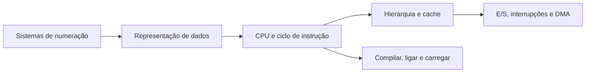
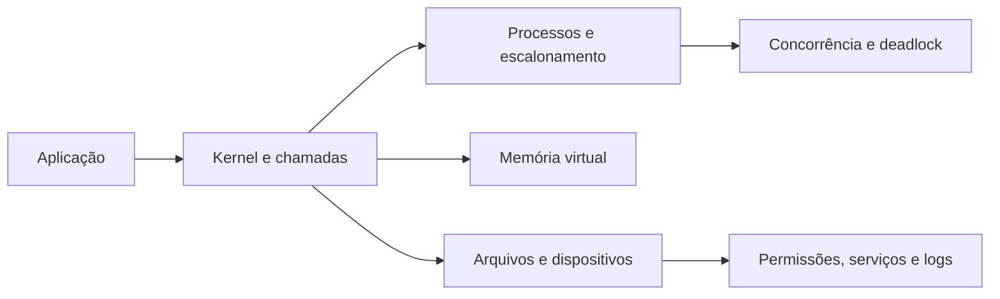
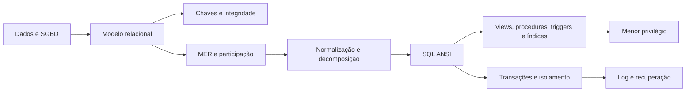

# Apostila de Estudo - Semana 1

## CRA-PR 2026 - Analista de Sistemas

**Versão 1.3**

Material de estudo direcionado para a primeira semana de preparação, com foco em construção de base forte, revisão diária de matérias de alto peso e aderência ao edital oficial vigente.

---

## Versão do edital utilizada

- **Nome do concurso:** Concurso Público do Conselho Regional de Administração do Paraná - CRA-PR.
- **Cargo:** Analista de Sistemas.
- **Banca:** Instituto Consulplan.
- **Versão do edital:** Edital de Concurso Público nº 1/2026, consolidado no arquivo oficial identificado como **conforme Retificação I**.
- **Data da retificação:** **Ponto pendente de confirmação.** O PDF oficial consolidado usado como base informa "conforme Retificação I", mas a data do ato isolado de retificação não foi localizada no próprio PDF consolidado consultado.
- **Arquivo oficial usado:** `../edital/edital_cra_pr_2026_analista_sistemas_retificacao_1.pdf`.
- **Link oficial consultado:** https://cdnsite.institutoconsulplan.org.br/concursos/1330/b2c07c473c9749fea22728da3c964c06.pdf
- **Observação sobre o Código de Ética:** o edital oficial consolidado conforme Retificação I cita a **Resolução Normativa CFA nº 671/2025** como Código de Ética dos profissionais da Administração. A página oficial do CFA da RN CFA nº 671/2025 informa expressamente que ela revogou a RN CFA nº 640/2024. Portanto, nesta apostila a RN CFA nº 671/2025 será usada apenas porque está indicada no edital vigente e há fonte oficial do CFA comprovando a revogação da RN CFA nº 640/2024.
- **Observação sobre o Regimento Interno do CRA-PR:** a RN CFA nº 651/2024 será citada apenas como norma oficial que aprova o Regimento do Conselho Regional de Administração do Paraná, conforme fonte oficial do CFA.

---

## Mapa de Pontuação e Prioridade

A prova objetiva para Analista de Sistemas tem 50 questões, todas com valor de 2 pontos, totalizando 100 pontos. A distribuição por disciplina define a estratégia de estudo: primeiro entram as matérias que concentram mais pontos e que têm maior impacto direto na classificação.

| Disciplina | Questões | Pontos | Prioridade |
|---|---:|---:|---|
| Conhecimentos do Cargo | 15 | 30 | Muito alta |
| Legislação CRA-PR/CFA | 10 | 20 | Muito alta |
| Língua Portuguesa | 10 | 20 | Muito alta |
| Administração Pública e Legislação Correlata | 5 | 10 | Média |
| Raciocínio Lógico-Matemático | 5 | 10 | Média |
| Informática | 5 | 10 | Baixa nesta primeira etapa |

Conhecimentos do Cargo, Legislação CRA-PR/CFA e Língua Portuguesa somam **35 questões**, ou seja, **70 pontos da objetiva**. Por isso, a Semana 1 prioriza base técnica, legislação específica e Português, mantendo revisões curtas diárias de Administração Pública, interpretação e discursiva.

O objetivo prático é evitar dois erros comuns de preparação: estudar apenas TI e perder pontos previsíveis em legislação/Português, ou estudar apenas teoria geral e deixar fraca a matéria de maior peso, que é Conhecimentos do Cargo.

---

## Como usar esta apostila

Esta apostila é a parte de estudo teórico da Semana 1. A apostila de questões será separada e seguirá exatamente a mesma divisão por dias.

Use o material assim:

1. Leia abertura, objetivo, orientação e entregas do dia.
2. Percorra os Blocos 1–5 na ordem, estudando teoria, aprofundamento, prática guiada, matéria fixa e Português/discursiva antes da cobrança.
3. Execute o Bloco 6 sem consulta, corrija a recuperação e registre regra, contraexemplo, âncora e próxima revisão no caderno de erros.
4. Faça mini revisão, perguntas de fixação e checklist.
5. Abra o roteiro do banco e resolva somente a amostra indicada de até 10 Essenciais.
6. Corrija A–D integralmente, complete o caderno de erros, agende D+2/D+7 e encerre a sessão.

### Rotina diária em até três sessões reais

Cada dia é uma unidade distribuída em no máximo três sessões de 2h30 a 3h líquidas. O banco completo alimenta D+2, D+7 e o ciclo seguinte; ele não cria sessões extras no mesmo dia. Pausas de 10 a 15 minutos ficam fora do tempo líquido.

| Ordem física | Função |
|---|---|
| Abertura | objetivo, orientação e entregas |
| Bloco 1 | teoria principal |
| Bloco 2 | aprofundamento |
| Bloco 3 | exemplos e prática guiada |
| Bloco 4 | matéria fixa programada |
| Bloco 5 | Português ou discursiva |
| Bloco 6 | recuperação ativa, sem conteúdo novo |
| Fechamento | mini revisão → fixação → checklist → roteiro de questões → correção |

### Como executar cada bloco do dia

A lógica de estudo não vale apenas para os Blocos 1, 2 e 3. Os Blocos 4, 5 e 6 também devem seguir um passo a passo claro, para que a matéria fixa, o treino de Português/discursiva e o caderno de erros não virem apenas leitura solta.

| Bloco | Função | Passo a passo obrigatório |
|---|---|---|
| Bloco 1 | Abrir o tema principal | **Teoria explicada de forma didática**; leitura ativa; marcação dos conceitos centrais; anotação das diferenças entre conceitos parecidos. |
| Bloco 2 | Aprofundar o tema principal | **Teoria explicada de forma didática**; exemplos resolvidos; aplicação em situações de prova; identificação de pegadinhas da Consulplan. |
| Bloco 3 | Praticar o tema principal | Exercícios guiados e casos resolvidos; o banco classificado começa apenas depois de toda a base do dia. |
| Bloco 4 | Matéria fixa do dia | Teoria suficiente e fonte oficial antes das questões extras correspondentes. |
| Bloco 5 | Português, interpretação ou discursiva | **Teoria explicada de forma didática** do ponto linguístico; leitura de trecho curto; reescrita ou análise gramatical; treino de parágrafo quando houver discursiva. |
| Bloco 6 | Recuperação e caderno de erros | Recuperar sem consulta somente conteúdo já ensinado; transformar erro em regra curta e agendar retorno, sem abrir assunto novo. |

Em todos os blocos, a pergunta final deve ser: "eu sei explicar isso sem olhar?". Se a resposta for não, o ponto entra no caderno de erros.

---

## Mapa da Semana 1

| Dia | Tema principal | Revisão curta | Foco de prova |
|---|---|---|---|
| Dia 1 | Arquitetura e organização de computadores | Legislação CRA/CFA | Conhecimentos do Cargo |
| Dia 2 | Sistemas operacionais | Administração Pública | Conhecimentos do Cargo |
| Dia 3 | Banco de dados base e SQL | Legislação CRA/CFA | Conhecimentos do Cargo |
| Dia 4 | Legislação CRA-PR/CFA | Administração Pública | Legislação específica |
| Dia 5 | Português e discursiva | Legislação CRA/CFA | Português e discursiva |
| Dia 6 | Administração Pública, RLM e revisão | Legislação CRA/CFA | Revisão e consolidação |

---

# Dia 1 - Arquitetura e Organização de Computadores

## Objetivo do dia

Construir base sólida em arquitetura e organização de computadores, especialmente sistemas de numeração, representação de dados, aritmética computacional, organização de CPU/memória, interrupções, endereçamento e tradução de programas.

Ao final do dia, você deve conseguir:

- converter números entre decimal, binário e hexadecimal;
- entender como dados são representados internamente;
- diferenciar CPU, memória, barramentos, registradores, cache e dispositivos de entrada/saída;
- explicar interrupções e endereçamento;
- diferenciar compilador, ligador e interpretador.

## Por que esse assunto importa para a prova

O edital de Analista de Sistemas abre Conhecimentos do Cargo com arquitetura e organização de computadores. Isso indica que a banca considera o tema base para os demais assuntos técnicos. Mesmo quando a questão parece de sistemas operacionais, redes ou banco de dados, ela frequentemente depende de noções de memória, processamento, representação de dados e execução de instruções.

Esse tema também é bom para ganhar pontos porque muitas questões têm resposta objetiva: conversões, conceitos e diferenças entre componentes. A dificuldade está nas pegadinhas de nomenclatura.

## Como a Consulplan costuma cobrar esse conteúdo

A Consulplan costuma cobrar esse tema de quatro formas:

- conversão simples entre bases numéricas, principalmente hexadecimal e decimal;
- identificação de componentes de arquitetura, como CPU, memória, cache e barramentos;
- distinção entre conceitos próximos, por exemplo compilador, interpretador e ligador;
- aplicação em cenário prático, como escolha de memória, análise de desempenho ou funcionamento de periféricos.

A banca gosta de alternativas com afirmações quase corretas, trocando uma palavra essencial: volátil por permanente, compilação por interpretação, memória principal por memória secundária, endereço físico por endereço lógico.

## Orientação e jornada de estudo

Estude na ordem física abaixo. Os Blocos 1 a 5 apresentam a base antes da cobrança; o Bloco 6 apenas recupera o que já foi estudado. Pausas de 10 a 15 minutos ficam fora do tempo líquido.

| Sessão | Tempo líquido | Percurso | Entrega verificável |
|---|---:|---|---|
| A | 2h50 | Abertura + Bloco 1 | conversões feitas sem consulta e mapa CPU–memória |
| B | 2h50 | Blocos 2 e 3 | três casos técnicos resolvidos e explicados |
| C | 3h | Blocos 4 e 5 + Bloco 6 + revisão, fixação, checklist, 10 questões e correção | caderno de erros preenchido e primeira passagem corrigida |

Na Sessão C, use: 45min para o Bloco 4, 30min para o Bloco 5, 20min para o Bloco 6, 15min para mini revisão/fixação/checklist, 30min para resolver as 10 essenciais e 40min para corrigi-las.

## Bloco 1 — Teoria principal: representação, CPU e memória

<a id="s1-d1-numeracao"></a>
### 1. Sistemas de numeração

Computadores trabalham internamente com sinais binários. Por isso, a base 2 é central em computação. Em provas, você precisa dominar principalmente:

- **Decimal:** base 10, usa os dígitos 0 a 9.
- **Binário:** base 2, usa os dígitos 0 e 1.
- **Hexadecimal:** base 16, usa 0 a 9 e A a F.

Cada posição de um número tem peso. No decimal, os pesos são potências de 10. No binário, potências de 2. No hexadecimal, potências de 16.

Exemplo: o número binário `1011` vale:

`1 x 2^3 + 0 x 2^2 + 1 x 2^1 + 1 x 2^0 = 8 + 0 + 2 + 1 = 11`.

No hexadecimal, `1F` vale:

`1 x 16^1 + F x 16^0 = 16 + 15 = 31`.

### Como funciona na prática

Hexadecimal é muito usado porque representa binários longos de forma curta. Cada dígito hexadecimal corresponde exatamente a 4 bits.

Exemplo:

- `1111` em binário = `F` em hexadecimal.
- `1010` em binário = `A` em hexadecimal.
- `1111 0000` em binário = `F0` em hexadecimal.

Isso aparece em endereços de memória, máscaras, dumps, cores em HTML/CSS, identificadores e configurações de baixo nível.

### Exemplos resolvidos - sistemas de numeração

**Exemplo 1:** converter `101101` de binário para decimal.

Pesos:

- `1 x 2^5 = 32`
- `0 x 2^4 = 0`
- `1 x 2^3 = 8`
- `1 x 2^2 = 4`
- `0 x 2^1 = 0`
- `1 x 2^0 = 1`

Resultado: `32 + 8 + 4 + 1 = 45`.

**Exemplo 2:** converter `2A` de hexadecimal para decimal.

`A` vale 10.

`2A = 2 x 16^1 + 10 x 16^0 = 32 + 10 = 42`.

**Exemplo 3:** converter `1110 0111` para hexadecimal.

Separe em grupos de 4 bits:

- `1110 = E`
- `0111 = 7`

Resultado: `E7`.

### Conversão hexadecimal para decimal

Para converter hexadecimal para decimal, multiplique cada dígito pela potência de 16 correspondente à sua posição. A leitura é da direita para a esquerda:

- posição mais à direita: `16^0`;
- segunda posição da direita para a esquerda: `16^1`;
- terceira posição: `16^2`;
- e assim por diante.

Lembre a tabela básica:

| Hexadecimal | Decimal |
|---|---:|
| A | 10 |
| B | 11 |
| C | 12 |
| D | 13 |
| E | 14 |
| F | 15 |

**Exemplo 4:** converter `B7` para decimal.

`B` vale 11 e `7` vale 7.

`B7 = 11 x 16^1 + 7 x 16^0 = 176 + 7 = 183`.

**Exemplo 5:** converter `3F` para decimal.

`F` vale 15.

`3F = 3 x 16^1 + 15 x 16^0 = 48 + 15 = 63`.

<a id="s1-d1-representacao-dados"></a>
### 2. Representação de dados

Dados precisam ser codificados para serem processados. Os principais conceitos:

- **Bit:** menor unidade de informação, valor 0 ou 1.
- **Byte:** conjunto de 8 bits.
- **Word/palavra:** unidade natural de processamento de uma arquitetura, como 32 ou 64 bits.
- **Inteiros:** podem ser sem sinal ou com sinal.
- **Caracteres:** representados por códigos, como ASCII ou Unicode.
- **Ponto flutuante:** usado para números reais aproximados.

Uma pegadinha comum é achar que todo número real é representado exatamente. Em computação, ponto flutuante é aproximação. Isso pode gerar pequenos erros de arredondamento.

### Como funciona na prática

Quando um sistema grava a letra `A`, ele não guarda "a letra" como objeto abstrato. Ele guarda um código numérico. Em ASCII, `A` corresponde a 65 em decimal, que é `01000001` em binário.

Quando um sistema trabalha com inteiros com sinal, precisa reservar uma forma de indicar valores negativos. A técnica mais comum é o complemento de dois.

### Exemplos resolvidos - representação de dados

**Exemplo 1:** quantos valores distintos podem ser representados com 8 bits?

Cada bit tem 2 possibilidades. Com 8 bits:

`2^8 = 256`.

Se for inteiro sem sinal, o intervalo costuma ser de 0 a 255.

**Exemplo 2:** por que 1 byte pode representar 256 valores, e não 255?

Porque a contagem inclui o zero. Com 8 bits, temos 256 combinações possíveis. Se a menor combinação é 0, a maior é 255.

**Exemplo 3:** qual é a diferença entre ASCII e Unicode?

ASCII é uma codificação menor, historicamente voltada a caracteres básicos. Unicode é um padrão mais amplo para representar caracteres de vários idiomas, símbolos e acentos.

#### Inteiros com sinal e complemento de dois

Com `n` bits, um inteiro **sem sinal** representa de `0` a `2^n - 1`. Em complemento de dois, o intervalo é de `-2^(n-1)` a `2^(n-1) - 1`. Para obter o negativo de um valor na mesma largura, inverta os bits e some 1.

Exemplo em 8 bits: `00000101` representa `+5`; invertendo (`11111010`) e somando 1, obtém-se `11111011`, que representa `-5`. Não aplique esse procedimento sem verificar a largura e a codificação pedidas.

Para combinar hexadecimal e complemento de dois, primeiro expanda cada dígito em quatro bits. Em 8 bits, `F4` = `1111 0100`; como o bit mais significativo é 1, sua leitura com sinal é negativa (`-12`). Só depois faça a operação, retenha a largura pedida e verifique overflow.

<a id="s1-d1-von-neumann-ciclo"></a>
### 3. Programa armazenado e ciclo de instrução

No modelo de programa armazenado associado à arquitetura de von Neumann, instruções e dados residem na memória e percorrem caminhos compartilhados. A unidade de controle coordena o ciclo de **busca, decodificação e execução**; o contador de programa aponta a próxima instrução, e o registrador de instrução mantém a instrução corrente. O modelo não significa que dados e instruções sejam indistinguíveis para o programa nem que toda implementação moderna possua apenas um nível de memória.

<a id="s1-d1-cpu-componentes"></a>
### 4. CPU, memória, barramentos e cache

A CPU executa instruções. Para isso, usa registradores, unidade de controle, unidade lógica e aritmética e comunicação com memória.

Componentes essenciais:

- **Unidade de controle:** coordena a busca, decodificação e execução das instruções.
- **ULA/ALU:** realiza operações aritméticas e lógicas.
- **Registradores:** pequenas áreas de armazenamento dentro da CPU, extremamente rápidas.
- **Memória RAM:** memória principal, volátil, usada durante a execução dos programas.
- **Memória ROM:** memória não volátil, usada para armazenar instruções permanentes ou de inicialização.
- **Firmware:** software gravado em memória não volátil, próximo ao hardware, usado para inicializar ou controlar dispositivos.
- **Cache:** memória muito rápida entre CPU e RAM.
- **Barramentos:** caminhos de comunicação para dados, endereços e controle.
- **Armazenamento secundário:** SSD, HD e mídias persistentes.

<a id="s1-d1-firmware"></a>
#### Firmware

Firmware é software armazenado em memória não volátil e estreitamente ligado à inicialização ou ao controle de um equipamento. Ele não é sinônimo de ROM — ROM é um tipo de memória — nem de aplicativo comum do usuário. Uma atualização de firmware altera o código de controle e precisa respeitar compatibilidade e procedimento do fabricante.

<a id="s1-d1-hierarquia-memoria"></a>
#### Hierarquia de memória, ROM e RAM

RAM e ROM aparecem em questões porque ambas são "memórias", mas têm funções diferentes.

| Memória | Característica | Uso típico | Pegadinha |
|---|---|---|---|
| RAM | Volátil, leitura e escrita, rápida | Programas e dados em execução | Achar que guarda arquivos permanentemente |
| ROM | Não volátil, tende a preservar conteúdo | Rotinas de inicialização e firmware | Achar que funciona como memória principal comum |

A **RAM** perde seu conteúdo quando falta energia. Ela serve como área de trabalho do sistema em execução. A **ROM** tende a preservar o conteúdo e costuma armazenar instruções de inicialização ou componentes de firmware.

## Bloco 2 — Aprofundamento: desempenho, E/S, endereçamento e tradução

<a id="s1-d1-arquitetura-32-64"></a>
### Arquiteturas de 32 e 64 bits, barramentos e capacidade

“32 bits” ou “64 bits” pode se referir à largura natural de registradores, operandos ou endereços, conforme o contexto. Não conclua que todo barramento possui a mesma largura. Se há `n` linhas independentes de endereço e cada endereço identifica um byte, o espaço teórico diretamente endereçável é `2^n` bytes; limitações da implementação e do sistema podem reduzir o espaço utilizável.

- **largura do barramento de dados:** quantidade transferida por operação, não o endereço alcançável;
- **largura do barramento de endereços:** quantidade de posições distinguíveis;
- **largura de palavra/registrador:** tamanho natural de certos operandos da CPU;
- **largura de banda:** volume transferido por unidade de tempo;
- **latência:** demora até uma operação individual produzir resposta.

Se largura por transferência dobra e a taxa de transferências permanece comprovadamente igual, a **largura de banda bruta teórica do barramento** dobra. A **vazão efetiva do sistema**, porém, também depende de controlador, protocolo, memória, contenção e carga; sem esses dados, não se garante que o desempenho observado dobre. Mantenha pico teórico, vazão efetiva e latência como perguntas diferentes.

Um sistema de 64 bits não é automaticamente duas vezes mais rápido: desempenho também depende de frequência, microarquitetura, memória, software e carga.

#### Registradores

Registradores são as áreas de armazenamento mais rápidas usadas diretamente pela CPU. Eles ficam dentro do processador e armazenam temporariamente operandos, endereços e resultados usados diretamente pela CPU.

Exemplos comuns de registradores:

- **contador de programa/PC:** indica a próxima instrução a ser buscada;
- **registrador de instrução/IR:** guarda a instrução em execução;
- **acumulador ou registradores gerais:** guardam operandos e resultados intermediários;
- **registradores de endereço:** ajudam a localizar dados na memória;
- **registradores de estado/flags:** indicam resultados de operações, como zero, sinal, carry ou overflow.

A pegadinha é comparar registrador com RAM ou SSD. Registrador é muito menor, muito mais rápido e fica dentro da CPU. RAM é memória principal. SSD/HD são armazenamento persistente.

<a id="pipeline-de-cpu"></a>
<a id="s1-d1-pipeline-desempenho"></a>
#### Pipeline, vazão, latência e hazards

Pipeline é uma técnica em que a CPU sobrepõe etapas de execução de instruções. Em vez de esperar uma instrução passar por todas as etapas para só então iniciar a próxima, a CPU pode buscar uma instrução enquanto decodifica outra e executa uma terceira.

Modelo simplificado:

1. **Busca:** obter a instrução na memória.
2. **Decodificação:** identificar qual operação será feita.
3. **Execução:** realizar a operação.
4. **Acesso à memória:** ler ou escrever dados, se necessário.
5. **Escrita de resultado:** gravar o resultado no registrador ou destino.

Pipeline melhora a **vazão** do processador, isto é, a quantidade de instruções concluídas por unidade de tempo. Ele não significa, necessariamente, que uma instrução individual terá menor latência. Dependência de dados, desvio ainda não resolvido e disputa de recurso provocam hazards; a CPU pode encaminhar resultados, prever desvios ou inserir bolhas, mas cada medida tem custo e não elimina todo atraso.

#### Throughput vs latência

| Conceito | Ideia | Exemplo |
|---|---|---|
| Latência | Tempo para uma operação individual terminar | Tempo de uma instrução específica do início ao fim |
| Throughput/vazão | Quantidade de operações concluídas por unidade de tempo | Instruções concluídas por ciclo ou por segundo |

Na prova, a frase "pipeline sempre reduz o tempo de cada instrução" deve acender alerta. Pipeline tende a aumentar o throughput, mas uma instrução individual ainda passa por etapas e pode sofrer atrasos por dependências, desvios e conflitos de recursos.

<a id="cache-localidade-e-políticas-de-escrita"></a>
<a id="s1-d1-cache-localidade"></a>
#### Cache, acerto, falta e localidade

Cache melhora desempenho porque explora o princípio da localidade:

- **Localidade temporal:** se um dado foi acessado agora, há boa chance de ser acessado novamente em breve.
- **Localidade espacial:** se um endereço foi acessado, endereços próximos tendem a ser acessados em breve.

Exemplo de localidade temporal: repetir várias vezes uma variável dentro de um laço.  
Exemplo de localidade espacial: percorrer um vetor sequencialmente.

Um **hit** ocorre quando o bloco procurado já está no nível consultado; um **miss** exige buscá-lo em nível mais lento. A taxa de acertos isolada não determina todo o desempenho: considere também a penalidade da falta e o tempo de acerto. O tempo médio pode ser raciocinado como “tempo de acerto + taxa de faltas × penalidade da falta”.

<a id="s1-d1-cache-escrita"></a>
#### Políticas de escrita da cache

Políticas de escrita mais cobradas:

| Política | Como funciona | Vantagem | Risco/atenção |
|---|---|---|---|
| Write-through | Escreve no cache e na memória principal imediatamente | Memória principal fica mais atualizada | Pode gerar mais tráfego de memória |
| Write-back | Escreve primeiro no cache e atualiza a memória depois | Reduz escritas na memória principal | Exige controle de consistência, como bit de sujeira/dirty bit |

Cache não substitui ULA, registradores, RAM ou SSD. Ela reduz tempo médio de acesso, mas quem executa operações aritméticas e lógicas é a ULA.

### Como funciona na prática

Quando você abre um programa:

1. O programa está armazenado no SSD/HD.
2. O sistema operacional carrega partes do programa para a RAM.
3. A CPU busca instruções na memória.
4. A CPU decodifica e executa essas instruções.
5. Dados frequentemente usados podem ficar em cache.

Quanto mais próximo da CPU, mais rápida e cara tende a ser a memória. A hierarquia típica é:

registradores > cache > RAM > SSD > HD.

### Exemplos resolvidos - CPU e memória

**Exemplo 1:** se uma questão afirma que a RAM armazena permanentemente os arquivos do usuário, a afirmação está correta?

Não. A RAM é volátil. Ela mantém dados em uso enquanto há energia e execução. Armazenamento permanente é função de SSD, HD ou outro meio persistente.

**Exemplo 2:** por que cache melhora desempenho?

Porque reduz o tempo médio de acesso a dados e instruções frequentemente usados. A CPU é muito mais rápida que a RAM; se toda busca dependesse diretamente da RAM, a CPU ficaria esperando com mais frequência.

**Exemplo 3:** barramento de endereços e barramento de dados são iguais?

Não. O barramento de endereços indica onde acessar. O barramento de dados transporta o conteúdo lido ou escrito.

**Exemplo 4:** pipeline sempre diminui a latência de cada instrução?

Não. Pipeline tende a melhorar a vazão, permitindo que várias instruções estejam em etapas diferentes. A latência de uma instrução individual não necessariamente diminui.

**Exemplo 5:** qual é a diferença entre write-through e write-back?

No write-through, a escrita vai para cache e memória principal imediatamente. No write-back, a escrita fica inicialmente no cache e a memória é atualizada depois, reduzindo tráfego, mas exigindo controle de consistência.

<a id="s1-d1-interrupcoes-io"></a>
### 5. Interrupções, periféricos e entrada/saída

Interrupção é um mecanismo pelo qual um evento sinaliza à CPU que precisa de atenção. Pode vir de hardware ou software.

Exemplos:

- teclado pressionado;
- chegada de pacote de rede;
- conclusão de operação de disco;
- erro de divisão por zero;
- chamada de sistema.

Sem interrupções, a CPU teria que consultar repetidamente cada dispositivo para saber se algo aconteceu. Isso desperdiçaria processamento.

Interrupções **mascaráveis** podem ser temporariamente inibidas conforme a política da CPU/controlador; as não mascaráveis são reservadas a eventos que não devem ser ignorados pelo mecanismo comum. “Mascarável” não significa falsa nem sem prioridade: descreve a possibilidade de adiamento/bloqueio controlado.

<a id="s1-d1-polling-dma"></a>
#### Polling vs interrupções

No **polling**, a CPU pergunta repetidamente ao dispositivo se ele precisa de atendimento. É simples, mas pode desperdiçar processamento quando nada acontece.

Na **interrupção**, o dispositivo ou controlador sinaliza quando precisa de atenção. A CPU não precisa ficar perguntando continuamente; ela pode executar outras tarefas e ser avisada quando houver evento.

| Técnica | Como funciona | Ponto forte | Pegadinha |
|---|---|---|---|
| Polling | CPU consulta repetidamente o dispositivo | Simples de implementar | Pode desperdiçar CPU |
| Interrupção | Dispositivo avisa a CPU quando precisa | Resposta eficiente a eventos | Não significa erro; pode ser evento normal |

#### DMA

DMA significa **Direct Memory Access**, ou acesso direto à memória. É uma técnica em que um controlador transfere dados entre dispositivo de E/S e memória principal com menor intervenção da CPU.

Sem DMA, a CPU teria que participar mais ativamente da transferência de cada bloco de dados. Com DMA, a CPU configura a operação, o controlador realiza a transferência e a CPU é avisada ao final, normalmente por interrupção.

Isso é importante em operações de disco, rede e outros dispositivos que movimentam grande volume de dados.

### Como funciona na prática

Quando uma tecla é pressionada, o teclado gera um evento. O controlador de interrupção avisa a CPU. A CPU pausa temporariamente o fluxo atual, salva o contexto necessário, executa uma rotina de tratamento da interrupção e depois retorna ao que estava fazendo.

### Exemplos resolvidos - interrupções e E/S

**Exemplo 1:** interrupção sempre indica erro?

Não. Pode indicar eventos normais, como entrada de dados, término de E/S ou temporizador do sistema.

**Exemplo 2:** por que interrupções são importantes para sistemas operacionais multitarefa?

Porque permitem alternância de execução, resposta a eventos e gerenciamento eficiente de dispositivos. O temporizador, por exemplo, ajuda o SO a interromper um processo e dar tempo de CPU a outro.

**Exemplo 3:** polling e interrupção resolvem o mesmo problema do mesmo jeito?

Não. Ambos lidam com eventos de dispositivos, mas polling consulta repetidamente; interrupção sinaliza quando há evento.

**Exemplo 4:** DMA elimina a CPU do sistema?

Não. DMA reduz a intervenção da CPU na transferência de dados, mas a CPU ainda configura a operação, coordena o sistema e trata a conclusão quando necessário.

<a id="s1-d1-enderecamento"></a>
### 6. Endereçamento

Endereçamento é o modo como a arquitetura localiza dados e instruções. Em termos simples, a CPU precisa saber onde buscar operandos e onde gravar resultados.

Conceitos importantes:

- **Endereço de memória:** posição usada para localizar dado ou instrução.
- **Endereço lógico/virtual:** endereço visto pelo programa.
- **Endereço físico:** endereço real na memória principal.
- **Modos de endereçamento:** formas de indicar operandos, como imediato, direto, indireto, por registrador.

| Modo        | Onde está o valor?                         | Exemplo               | Ideia                    |
| ----------- | ------------------------------------------ | --------------------- | ------------------------ |
| Imediato    | Na própria instrução                       | `MOV R1, 10`          | Use o valor 10           |
| Direto      | Em um endereço de memória                  | `LOAD R1, [1000]`     | Busque na gaveta 1000    |
| Indireto    | Em um endereço apontado por outro endereço | `LOAD R1, [[1000]]`   | Vá onde o bilhete mandar |
| Registrador | Dentro da CPU                              | `ADD R1, R2`          | Use valores já na CPU    |
| Indexado    | Base + deslocamento                        | `LOAD R1, [BASE + i]` | Acessar arrays/listas    |


### Como funciona na prática

Em sistemas com memória virtual, o programa trabalha com endereços virtuais. O sistema operacional e a unidade de gerenciamento de memória fazem a tradução para endereços físicos. Isso permite isolamento entre processos e melhor gestão da memória.

### Exemplos resolvidos - endereçamento

**Exemplo 1:** no modo imediato, o operando está onde?

Está na própria instrução. Exemplo conceitual: `MOV A, 5` move o valor imediato 5 para o registrador A.

**Exemplo 2:** por que endereço virtual não é a mesma coisa que endereço físico?

Porque o endereço virtual é a visão do processo; o físico corresponde à posição real na RAM. A tradução permite proteção, paginação e isolamento.

<a id="s1-d1-traducao-programas"></a>
### 7. Compiladores, montadores, ligadores e carregadores

Esses conceitos aparecem muito em provas porque são parecidos.

- **Compilador:** traduz código-fonte de alto nível para código de máquina, código objeto ou código intermediário antes da execução.
- **Interpretador:** lê e executa comandos durante a execução.
- **Assembler/montador:** traduz linguagem de montagem para código de máquina.
- **Linker/ligador:** combina módulos compilados e bibliotecas, resolvendo referências externas para gerar o executável.
- **Loader/carregador:** coloca o executável na memória, prepara o ambiente de execução e inicia o programa.

### Como funciona na prática

Em C, é comum haver compilação de vários arquivos `.c` para arquivos objeto. O linker junta esses objetos e bibliotecas para gerar um executável. Depois, quando o usuário ou o sistema operacional inicia o programa, o loader carrega esse executável na memória.

Em Python, normalmente há interpretação/execução por uma máquina virtual, embora existam etapas internas de bytecode. Para concurso, o contraste clássico é: compilador traduz previamente; interpretador executa instrução a instrução ou unidade a unidade.

Fluxo simplificado:

1. Código-fonte em linguagem de alto nível é compilado.
2. Código assembly, quando houver, pode ser traduzido pelo assembler.
3. Arquivos objeto e bibliotecas são combinados pelo linker.
4. O executável é carregado na memória pelo loader.
5. A CPU executa instruções usando registradores, cache, RAM e barramentos.

### Exemplos resolvidos - tradução de programas

**Exemplo 1:** se um programa tem dois módulos compilados separadamente e um chama função do outro, quem resolve essa ligação?

O ligador/linker. Ele resolve referências externas entre módulos e bibliotecas.

**Exemplo 2:** qual é a diferença central entre compilador e interpretador?

O compilador traduz o programa antes da execução; o interpretador executa o código durante a execução, realizando a tradução/execução de forma incremental.

**Exemplo 3:** quem coloca o executável na memória para execução?

O loader/carregador. O linker gera o executável; o loader carrega esse executável na memória e prepara sua execução.

**Exemplo 4:** assembler e linker fazem a mesma coisa?

Não. O assembler traduz linguagem de montagem para código de máquina. O linker liga módulos e bibliotecas, resolvendo referências para formar o executável.

## Bloco 3 — Exemplos e prática guiada

Resolva falando em voz alta a **regra**, os **dados do caso** e a **conclusão**. Esses três passos separam uma questão difícil de uma definição decorada.

1. **Cache com decisão dupla:** um laço percorre um vetor sequencialmente e o repete diversas vezes. Há localidade espacial na varredura e temporal na repetição; ainda assim, uma linha modificada em write-back pode permanecer apenas na cache até a substituição/sincronização. Portanto, desempenho e consistência são decisões diferentes.
2. **Pipeline com dependência:** a segunda instrução usa o resultado da primeira. A sobreposição pode elevar a vazão global, mas a dependência pode exigir encaminhamento ou espera; não se conclui que a latência individual sempre caiu.
3. **E/S em três etapas:** a CPU configura o controlador DMA; o controlador move o bloco entre dispositivo e RAM; ao fim, uma interrupção comunica a conclusão. DMA reduz participação na transferência, não elimina configuração nem tratamento.
4. **Tradução completa:** fonte → compilador → objeto; objetos/bibliotecas → linker → executável; executável → loader → memória. Assembler só entra quando existe código assembly a montar.
5. **Capacidade e desempenho:** 32 linhas de endereço byte a byte dão `2^32` bytes teóricos, mas não informam a largura do barramento de dados nem garantem uma taxa de transferência específica.

### Mapa de conexões



### Pegadinhas comuns da banca

- Dizer que RAM é memória permanente.
- Confundir ROM com RAM ou firmware com aplicativo comum.
- Confundir cache com memória secundária.
- Dizer que cache substitui a ULA.
- Dizer que pipeline sempre reduz a latência de cada instrução.
- Confundir throughput com latência.
- Afirmar que todo número real é representado exatamente.
- Trocar compilador por ligador.
- Trocar linker por loader.
- Dizer que interrupção é sempre erro.
- Confundir polling com interrupção.
- Achar que DMA elimina a CPU, quando na verdade reduz sua intervenção em transferências de E/S.
- Confundir endereço lógico com endereço físico.
- Esquecer que hexadecimal usa A=10, B=11, C=12, D=13, E=14, F=15.

### O que memorizar

| Conceito | Memorização objetiva |
|---|---|
| 1 byte | 8 bits |
| 8 bits | 256 combinações |
| Hexadecimal | 1 dígito = 4 bits |
| B7 hexadecimal | 11 x 16 + 7 = 183 |
| RAM | memória principal, volátil |
| ROM | memória não volátil, usada em rotinas permanentes/firmware |
| Firmware | software gravado próximo ao hardware |
| Cache | memória rápida entre CPU e RAM |
| Localidade temporal | reutilização de dado acessado recentemente |
| Localidade espacial | acesso provável a endereços próximos |
| Write-through | escreve no cache e na memória principal |
| Write-back | escreve no cache e atualiza a memória depois |
| ULA | operações aritméticas e lógicas |
| Unidade de controle | coordena execução de instruções |
| Registradores | armazenam temporariamente operandos, endereços e resultados usados diretamente pela CPU |
| Pipeline | sobrepõe etapas para melhorar vazão |
| DMA | transferência de E/S com menor intervenção da CPU |
| Polling | CPU consulta repetidamente o dispositivo |
| Linker | liga módulos e bibliotecas |
| Loader | carrega programa na memória |
| Assembler | traduz linguagem de montagem para código de máquina |
| Interrupção | mecanismo de atenção da CPU a evento |

### Erros comuns

| Erro | Correção |
|---|---|
| Achar que 8 bits representam 255 valores | Representam 256 valores; 0 a 255 sem sinal |
| Dizer que HD/SSD é memória principal | É armazenamento secundário |
| Tratar Unicode como sinônimo de ASCII | Unicode é mais amplo |
| Confundir barramento de dados com barramento de endereços | Um transporta conteúdo; outro indica localização |
| Dizer que compilador executa o programa | Compilador traduz; execução é outro processo |
| Usar "registrador" como sinônimo de memória RAM | Registrador fica dentro da CPU e é muito mais rápido |
| Achar que pipeline sempre acelera uma instrução isolada | Pipeline melhora principalmente throughput |
| Dizer que polling é mais eficiente em qualquer cenário | Polling pode desperdiçar CPU perguntando repetidamente |
| Dizer que write-back e write-through são iguais | Uma política atualiza memória imediatamente; a outra posterga |

## Bloco 4 — Legislação CRA-PR/CFA (45min)

Use apenas a versão oficial vigente indicada nos links. A Lei e o Decreto dão a base; resoluções disciplinam organização, ética, registro e procedimento sem contrariar a norma superior.

<a id="s1-d1-lei-decreto"></a>
### Lei, decreto e competência do Sistema

- A [Lei nº 4.769/1965](https://www.planalto.gov.br/ccivil_03/leis/l4769.htm) disciplina o exercício da profissão e institui o CFA e os CRAs.
- O [Decreto nº 61.934/1967](https://www.planalto.gov.br/ccivil_03/decreto/antigos/d61934.htm) regulamenta a Lei. Decreto regulamentar detalha a execução da lei; não a substitui nem pode contrariá-la.

<a id="s1-d1-cfa-cra"></a>
### CFA × CRA e jurisdição

O CFA exerce funções normativas e de coordenação em âmbito nacional. O CRA registra e fiscaliza dentro de sua jurisdição, decide matérias regionais nos limites das normas do Sistema e aplica o procedimento cabível. Autonomia administrativa regional não rompe a vinculação ao sistema normativo nacional.

Regra de decisão: identifique **sujeito → território → ato pedido → norma aplicável**. Diploma demonstra formação; quando a atividade profissional exige registro, ele não é substituto do registro.

<a id="s1-d1-regimento-natureza"></a>
### CRA-PR: natureza, estrutura e Regimento

Segundo o art. 1º do [Regimento do CRA-PR — RN CFA nº 651/2024](https://documentos.cfa.org.br/?a=show&c=documento&id=955), o CRA-PR é **autarquia dotada de personalidade jurídica de direito público, com autonomia técnica, administrativa e financeira**. Possui sede na capital do Paraná e jurisdição em todo o estado nas matérias de sua competência. O Regimento organiza seus órgãos, distribui competências internas e disciplina o funcionamento do Conselho. Autonomia não é soberania: o CRA-PR executa as diretrizes e normas do CFA, registra e fiscaliza regionalmente e não se torna empresa privada nem órgão do Governo estadual.

<a id="s1-d1-etica"></a>
### Ética, sigilo e responsabilidade

O [Código de Ética — RN CFA nº 671/2025](https://documentos.cfa.org.br/?a=show&c=documento&id=1038) orienta deveres e vedações. O art. 4º preserva dignidade, prerrogativas e independência profissional também no vínculo de emprego ou serviço público; o art. 5º exige independência técnica; e o art. 6º veda assinar documento de terceiro sem orientação/supervisão ou trabalho do qual não participou. A violação do sigilo é infração quando ocorre **sem justa causa**. Analise casos por quatro filtros: dever profissional, titular da informação, justa causa/base legítima para revelar e limitação ao necessário. Sigilo não autoriza ocultar ilícito por interesse pessoal; também não permite divulgar informação apenas por curiosidade. Assinar trabalho alheio, emprestar registro ou permitir uso indevido de identificação pode gerar responsabilidade própria.

<a id="s1-d1-registro-pj"></a>
### Registro de pessoa física e pessoa jurídica

O registro decorre da atividade efetivamente exercida e dos critérios da norma aplicável, não apenas do nome empresarial. Para pessoa jurídica, a [Lei nº 6.839/1980](https://www.planalto.gov.br/ccivil_03/leis/l6839.htm) manda considerar a atividade básica ou a natureza dos serviços prestados, e a norma profissional disciplina o procedimento e eventual responsável técnico. A [RN CFA nº 649/2024](https://documentos.cfa.org.br/?a=show&c=documento&id=951) **aprova o Regulamento de Registro do Sistema CFA/CRAs**; consulte-a com as alterações vigentes, confirmando redação consolidada e vigência sem presumir revogação total.

<a id="s1-d1-registro-rn649-670"></a>
### Alteração normativa e vigência

A [RN CFA nº 670/2025](https://documentos.cfa.org.br/?a=show&c=documento&id=1033) altera pontos da RN nº 649. Ao comparar normas, verifique número, objeto, artigo alterado e data de vigência. Norma posterior especial pode modificar apenas dispositivos determinados; o restante da norma anterior continua aplicável.

<a id="s1-d1-fiscalizacao-processo"></a>
### Fiscalização e processo

A [RN CFA nº 589/2020](https://documentos.cfa.org.br/?a=show&c=documento&id=745) aprova o Regulamento de Fiscalização do Sistema CFA/CRAs. Fiscalizar inclui apurar fatos, documentar indícios, instruir o processo e encaminhar decisão à autoridade competente. Solicitações, intimações e notificações regulares devem partir de autoridade competente e seguir o rito; omitir fato relevante, obstar ou dificultar a fiscalização pode ter consequência própria, mas indício não equivale a condenação automática. Competência, contraditório, motivação e decisão impedem que o fiscal ou uma parte pule etapas.

<a id="s1-d1-contribuicoes"></a>
### Anuidades e contribuições

A [Lei nº 12.514/2011](https://www.planalto.gov.br/ccivil_03/_ato2011-2014/2011/lei/l12514.htm) contém regras gerais sobre contribuições devidas aos conselhos profissionais. Em casos, separe fato gerador, sujeito obrigado, exercício de referência e regra vigente; não confunda sanção ética com cobrança de anuidade.

<a id="s1-d1-normas-dirigidas"></a>
### Ordem de consulta das normas dirigidas

Para questão literal, consulte: Lei nº 4.769/1965 → Decreto nº 61.934/1967 → Regimento/RN nº 651 → Código de Ética/RN nº 671 → registro/RN nº 649 e alteração/RN nº 670 → norma processual ou financeira indicada. A numeração da resolução, sozinha, nunca prova seu conteúdo.

## Bloco 5 — Português e interpretação aplicada (30min)

<a id="s1-d1-portugues-conectores"></a>
### Comando, inferência e conectores

Marque o comando (“correta”, “incorreta”, “exceto”, “infere-se”) antes das alternativas. Inferência precisa ser autorizada pelo texto. “Porque” indica causa/explicação, “portanto” conclusão e “embora” concessão; trocar o conector pode inverter a relação lógica.

<a id="s1-d1-portugues-referencia"></a>
### Referência pronominal e ambiguidade

Localize o antecedente compatível em forma e sentido. Em `seu/sua`, a concordância se faz com a **coisa possuída**, não identifica por si só o possuidor; se dois possuidores forem plausíveis, o contexto precisa resolver ou a redação é ambígua. Para pronomes em geral, não escolha o referente apenas por proximidade.

<a id="s1-d1-portugues-reescrita"></a>
### Reescrita e restrição

“Somente X pode Y” restringe o sujeito autorizado; “X pode somente Y” restringe a ação. Preserve modalizadores: “pode” não equivale a “deve”, e “em regra” admite exceção. Uma reescrita correta mantém informação e relação lógica, ainda que mude a ordem.

<a id="s1-d1-portugues-crase"></a>
### Crase em contexto de prova

Há crase quando a regência exige preposição `a` e o termo seguinte admite artigo feminino `a/as`: “referiu-se **à** norma”. Não ocorre diante de verbo, termo masculino ou quando falta artigo: “começou **a** revisar”. Teste pelo masculino (“ao regulamento”) quando possível.

## Bloco 6 — Recuperação ativa e caderno de erros (20min)

Sem consultar a teoria, complete: `1 byte = __ bits`; `B7₁₆ = __₁₀`; pipeline melhora principalmente __; write-back exige controle de __; DMA segue as etapas __/__/__; CFA atua em âmbito __ e CRA em âmbito __; “embora” expressa __. Só então confira as respostas.

Registre cada erro em seis campos: **conceito confundido**, **regra correta**, **contraexemplo**, **sinal de prova**, **âncora interna consultada** e **próxima revisão (D+2 ou D+7)**. Não acrescente assunto novo neste bloco.

**Entrega do caderno:** crie a página `Arquitetura — Erros e Confusões` e registre as bases que confundiu, trocas como RAM/ROM, cache/RAM, compilador/linker e linker/loader, além das relações `2^n`, `1 byte = 8 bits` e `1 hexadecimal = 4 bits`.

<a id="s1-d1-mini-revisao"></a>
## Mini revisão do dia

Arquitetura de computadores é a base física e lógica que permite a execução de programas. A CPU executa instruções usando registradores, ULA e unidade de controle. A memória segue uma hierarquia de velocidade e custo: registradores, cache, RAM e armazenamento secundário. RAM é volátil; ROM tende a preservar conteúdo e pode armazenar firmware. Cache explora localidade temporal e espacial. Pipeline melhora vazão, mas não garante menor latência individual. Interrupções evitam que a CPU precise ficar consultando dispositivos a todo momento; polling faz essa consulta repetida; DMA reduz intervenção da CPU em transferências de E/S. Compiladores, assemblers, linkers, loaders e interpretadores atuam em etapas diferentes da transformação do código em execução.

<a id="s1-d1-fixacao"></a>
## 5 perguntas de fixação

1. Como complemento de dois e inteiro sem sinal mudam a leitura do mesmo padrão de bits?
2. Por que pipeline pode elevar vazão sem reduzir a latência de uma instrução dependente?
3. Quais decisões continuam sob responsabilidade da CPU quando há DMA?
4. Como lei, decreto e resolução se relacionam sem que a norma inferior contrarie a superior?
5. Que informação muda entre “somente o CRA pode fiscalizar” e “o CRA pode somente fiscalizar”?

<a id="s1-d1-checklist"></a>
## Checklist de domínio

- [ ] Sei converter binário para decimal.
- [ ] Sei converter hexadecimal para decimal.
- [ ] Sei converter `B7` hexadecimal para decimal: `11 x 16 + 7 = 183`.
- [ ] Sei agrupar binário em quartetos para obter hexadecimal.
- [ ] Diferencio bit, byte, palavra e caractere.
- [ ] Sei explicar CPU, ULA, registradores, RAM, ROM, firmware, cache e barramentos.
- [ ] Diferencio latência e throughput.
- [ ] Sei explicar localidade temporal e localidade espacial.
- [ ] Diferencio write-back e write-through.
- [ ] Sei o que é interrupção e por que ela existe.
- [ ] Diferencio polling, interrupção e DMA.
- [ ] Diferencio endereço lógico/virtual e físico.
- [ ] Diferencio compilador, interpretador, assembler, linker e loader.

<a id="s1-d1-roteiro-questoes"></a>
## Roteiro do banco completo de 70 questões

O banco não é uma jornada única de 70 itens. Resolva por finalidade:

| Momento | Questões | Regra |
|---|---|---|
| Primeira passagem, hoje | Q1, Q2, Q3, Q5, Q6, Q7, Q11, Q13, E1 e E16 | exatamente 10 essenciais, em 30min |
| D+2 | Q9, Q12, Q16, Q17, Q25, E2, E3, E8, E13 e E19 | concluir as essenciais e iniciar aprofundamento |
| Até antes do D+7 | todas marcadas como **Aprofundamento** | resolver em sessões curtas, com teoria já estudada |
| D+7 | todas marcadas como **Revisão** | medir retenção sem consulta |
| Ciclo seguinte | todas marcadas como **Simulado** | resolver sob tempo e sem pistas |

<a id="s1-d1-correcao"></a>
## Correção e fechamento

Corrija as 10 da primeira passagem integralmente, inclusive as acertadas. Para cada erro ou acerto inseguro, anote: `ID → regra decisiva → por que descartei A/B/C/D → âncora da teoria → data de retorno`. Feche a sessão somente após agendar D+2; não avance para o saldo do banco por impulso.

---

# Dia 2 - Sistemas Operacionais

## Objetivo do dia

Entender o papel do sistema operacional como gerenciador de recursos, com foco em processos, memória, memória virtual, paginação, segmentação, sistema de arquivos, dispositivos, concorrência, sincronização, deadlock e aspectos práticos de Windows/Linux.

## Por que esse assunto importa para a prova

Sistemas operacionais aparecem no edital como um bloco próprio dentro de Conhecimentos do Cargo. É um tema de alta probabilidade porque se relaciona diretamente às atribuições do Analista de Sistemas no CRA-PR: suporte a usuários, servidores de aplicação e banco de dados, backup, rede, estações de trabalho, segurança e sistemas de terceiros.

Além disso, a Consulplan costuma cobrar tanto conceito puro quanto aplicação prática, como comandos, comportamento de processos, memória virtual e administração básica de Windows/Linux.

## Como a Consulplan costuma cobrar esse conteúdo

O padrão mais comum é:

- "assinale a afirmativa correta" sobre funções do SO;
- V/F sobre memória, processos ou arquivos;
- cenário prático com falha de desempenho, deadlock ou consumo de memória;
- comparação entre Windows e Linux;
- alternativas que confundem processo, programa e thread.

## Orientação e jornada de estudo

Estude na ordem física abaixo. Todo conceito cobrado hoje aparece nos Blocos 1 a 5; o Bloco 6 é somente recuperação. Pausas de 10 a 15 minutos ficam fora do tempo líquido.

| Sessão | Tempo líquido | Percurso | Entrega verificável |
|---|---:|---|---|
| A | 2h50 | Abertura + Bloco 1 | mapa kernel–processo–memória e estados explicados |
| B | 2h50 | Blocos 2 e 3 | três diagnósticos de SO resolvidos |
| C | 3h | Blocos 4 e 5 + Bloco 6 + revisão, fixação, checklist, 10 questões e correção | caderno de erros e primeira passagem corrigida |

Na Sessão C, use: 45min para o Bloco 4, 30min para o Bloco 5, 20min para o Bloco 6, 15min para mini revisão/fixação/checklist, 30min para resolver as 10 essenciais e 40min para corrigi-las.

## Bloco 1 — Teoria principal: kernel, processos e memória

<a id="s1-d2-so-kernel"></a>
### 1. Conceito, kernel e chamadas de sistema

Sistema operacional é o software básico que intermedeia usuário, aplicações e hardware.

Principais funções:

- gerenciar processos;
- gerenciar memória;
- gerenciar arquivos;
- controlar dispositivos de entrada e saída;
- prover interface de usuário;
- controlar segurança, usuários e permissões;
- oferecer chamadas de sistema para programas.

Sem sistema operacional, cada programa teria que lidar diretamente com hardware, disco, teclado, vídeo, memória, rede e permissões. Isso seria inseguro, ineficiente e impraticável.

O **kernel** é o núcleo privilegiado que arbitra CPU, memória, dispositivos e proteção. Aplicações pedem operações protegidas por **chamadas de sistema**; uma biblioteca pode oferecer a interface, mas o serviço protegido é executado pelo kernel. Separar modo usuário e modo kernel limita o dano de uma aplicação defeituosa.

### Como funciona na prática

Quando você salva um arquivo em uma pasta, não é o editor de texto que grava diretamente no hardware. Ele pede ao sistema operacional, por meio de serviços do sistema, que realize a operação. O SO verifica permissões, localiza o sistema de arquivos e aciona drivers de dispositivo.

### Exemplos resolvidos - conceito de SO

**Exemplo 1:** navegador, editor de texto e antivírus são sistemas operacionais?

Não. São aplicativos ou utilitários. Sistema operacional é a camada que permite sua execução e gerencia recursos.

**Exemplo 2:** o SO gerencia apenas hardware?

Não. Ele gerencia hardware e recursos lógicos, como processos, memória, arquivos, permissões, usuários e comunicação entre processos.

<a id="s1-d2-processos-estados"></a>
### 2. Processos, threads e estados

Um **programa** é um conjunto de instruções armazenado. Um **processo** é um programa em execução, com contexto próprio: código, dados, pilha, registradores, espaço de endereçamento e recursos associados.

Uma **thread** é uma linha de execução dentro de um processo. Várias threads podem compartilhar recursos do mesmo processo.

O **escalonador** decide qual processo ou thread usará a CPU em determinado momento.

Conceitos importantes:

- **pronto:** processo apto a executar, aguardando CPU;
- **executando:** processo usando CPU;
- **bloqueado/esperando:** processo aguarda evento, como E/S;
- **preemptivo:** o SO pode interromper um processo;
- **não preemptivo:** o processo executa até terminar ou bloquear voluntariamente.

Uma **troca de contexto** salva o estado da execução interrompida e restaura o da próxima. Ela possibilita multitarefa, mas consome tempo sem realizar diretamente o trabalho da aplicação. No Unix/Linux, um processo encerrado cujo status ainda não foi coletado pelo pai fica **zumbi**; se o pai termina antes do filho, o filho fica **órfão** e é adotado por processo do sistema. Zumbi não é processo executando descontroladamente.

Sinais comunicam eventos a processos. `kill` envia um sinal; o nome não garante que todo uso encerre imediatamente o processo. Primeiro identifique sinal, alvo e tratamento possível.

### Como funciona na prática

Em um computador com vários programas abertos, a CPU alterna rapidamente entre tarefas. Parece que tudo roda ao mesmo tempo. Essa impressão é criada por escalonamento, interrupções de temporizador e gerenciamento de processos.

### Exemplos resolvidos - processos

**Exemplo 1:** um processo bloqueado está usando CPU?

Em regra, não. Ele aguarda algum evento, como leitura de disco, pacote de rede ou liberação de recurso.

**Exemplo 2:** escalonamento preemptivo permite que o SO retire a CPU de um processo antes de ele terminar?

Sim. Esse é o ponto central da preempção. O SO pode interromper a execução e passar a CPU para outro processo.

**Exemplo 3:** processo e programa são sinônimos?

Não. Programa é passivo, armazenado. Processo é ativo, em execução.

<a id="cpu-bound-io-bound-quantum-e-starvation"></a>
<a id="s1-d2-escalonamento"></a>
### 3. Escalonamento, quantum e starvation

Processos **CPU-bound** consomem longos trechos de CPU; processos **I/O-bound** bloqueiam com frequência aguardando disco, rede ou teclado. No Round Robin, um **quantum** curto melhora a oportunidade de resposta, mas aumenta trocas de contexto; um quantum muito longo reduz esse custo, porém aproxima a política de uma fila simples e pode piorar a interatividade.

**Starvation** é espera indefinida causada, por exemplo, por prioridades que sempre favorecem outros processos. Ela não exige a espera circular do deadlock. Aging é uma técnica para elevar gradualmente a prioridade de quem espera.

<a id="memória-virtual-page-fault-swap-e-thrashing"></a>
<a id="s1-d2-memoria-virtual"></a>
### 4. Memória virtual, paginação e segmentação

A memória principal é limitada. O sistema operacional precisa dividir, proteger e controlar a memória usada pelos processos.

**Memória virtual** é uma técnica que dá a cada processo a impressão de ter um espaço de memória próprio e contínuo. Ela permite:

- isolamento entre processos;
- execução de programas maiores que a RAM disponível;
- uso de disco como apoio;
- proteção de áreas de memória.

**Paginação** divide a memória em blocos de tamanho fixo:

- páginas: blocos do espaço virtual;
- molduras/frames: blocos da memória física.

**Segmentação** divide a memória em segmentos lógicos de tamanho variável, como código, dados e pilha.

### Como funciona na prática

Se há pouca RAM, o SO pode mover páginas menos usadas para disco. Isso permite continuar executando, mas se o uso de disco for intenso, o sistema fica lento. Esse fenômeno pode aparecer como degradação de desempenho por paginação excessiva.

Um **page fault** ocorre quando a página referenciada não está presente na RAM; se o acesso é válido, o SO pode carregá-la e retomar a instrução. Se o endereço é inválido ou viola proteção, o resultado é falha. **Swap** é apoio em armazenamento secundário e é muito mais lento que RAM. **Thrashing** ocorre quando faltas e trocas dominam o tempo, restando pouca execução útil.

Para conter thrashing, reduza a pressão sobre o conjunto de trabalho: diminua processos/carga concorrente, ajuste a alocação quando cabível ou amplie RAM. Apenas aumentar swap não remove a diferença de velocidade nem garante mais execução útil.

Isolamento impede que um processo leia ou escreva arbitrariamente no espaço de outro, mas não proíbe comunicação legítima. **Pipes, filas, sockets e memória compartilhada controlada** são mecanismos de IPC mediados/configurados pelo SO; permissões e sincronização determinam quem comunica e como o dado permanece consistente.

### Exemplos resolvidos - memória

**Exemplo 1:** memória virtual é a mesma coisa que memória RAM?

Não. Memória virtual é uma abstração criada pelo sistema operacional. RAM é memória física principal.

**Exemplo 2:** paginação usa blocos de tamanho fixo ou variável?

Fixo. Essa é uma diferença clássica em relação à segmentação, que usa segmentos de tamanho variável.

**Exemplo 3:** por que a memória virtual melhora segurança?

Porque cada processo trabalha em seu próprio espaço de endereçamento. Um processo não deve acessar livremente a memória de outro.

## Bloco 2 — Aprofundamento: arquivos, dispositivos, segurança e concorrência

<a id="s1-d2-arquivos-backup"></a>
### 5. Sistemas de arquivos, journaling e backup

Sistema de arquivos organiza dados em unidades como arquivos e diretórios. Ele controla nomes, permissões, metadados, localização física e estrutura de armazenamento.

Conceitos cobrados:

- arquivo;
- diretório/pasta;
- caminho absoluto e relativo;
- permissões;
- metadados;
- journaling;
- fragmentação;
- sistemas como NTFS, ext4, FAT32.

### Como funciona na prática

Quando você salva um relatório, o SO registra nome, localização, tamanho, datas, permissões e blocos ocupados no disco. Sistemas com journaling mantêm registros auxiliares para ajudar na recuperação em caso de falha.

### Exemplos resolvidos - arquivos

**Exemplo 1:** caminho absoluto e caminho relativo são iguais?

Não. Caminho absoluto parte da raiz ou unidade, como `C:\Dados\relatorio.pdf` ou `/home/user/relatorio.pdf`. Caminho relativo depende do diretório atual.

**Exemplo 2:** journaling substitui backup?

Não. Journaling ajuda na consistência do sistema de arquivos após falha. Backup permite recuperar dados perdidos, corrompidos ou apagados.

Uma política de backup define escopo, periodicidade, retenção, cópias isoladas e responsabilidade. “Backup concluído” não prova recuperabilidade: teste de restauração, integridade e tempo de recuperação precisam ser verificados. Journaling recupera consistência estrutural após interrupção; não é uma cópia histórica do dado.

<a id="s1-d2-dispositivos-spooling"></a>
### 6. Dispositivos, drivers e spooling

Dispositivos de entrada e saída são controlados por drivers. Driver é software que permite ao sistema operacional se comunicar com hardware específico.

Exemplos:

- impressora;
- placa de rede;
- disco;
- teclado;
- webcam.

### Como funciona na prática

Quando um usuário imprime documento, o aplicativo envia a solicitação ao SO. O SO usa o subsistema de impressão e o driver da impressora para transformar dados em comandos compatíveis com o dispositivo.

**Spooling** mantém trabalhos em uma fila intermediária para que processos compartilhem um dispositivo de atendimento sequencial, como impressora. Driver traduz/controla a comunicação com o hardware; spooling organiza a espera. São papéis diferentes.

### Exemplos resolvidos - dispositivos

**Exemplo 1:** um driver é hardware?

Não. Driver é software de controle de hardware.

**Exemplo 2:** se uma placa de rede não funciona por falta de driver, o problema é necessariamente físico?

Não. Pode ser problema de software, configuração, compatibilidade ou driver ausente/incorreto.

<a id="s1-d2-seguranca-permissoes"></a>
### 7. Autenticação, autorização e permissões

**Autenticação** verifica identidade; **autorização** decide ações permitidas. Privilégio mínimo concede apenas o necessário. No Linux, `chmod 640 arquivo` dá leitura/escrita ao dono, leitura ao grupo e nenhuma permissão aos outros; `chown` altera proprietário/grupo. No NTFS, permissões podem ser atribuídas a usuários e grupos, herdadas e combinadas; uma regra efetiva precisa considerar o conjunto aplicável, não apenas uma entrada isolada.

<a id="s1-d2-servicos-logs"></a>
### 8. Serviços, comandos e logs

Um **serviço** executa em segundo plano para oferecer uma função contínua, geralmente sem interação direta constante. `ps` oferece uma fotografia de processos; `top` apresenta visão atualizada; `systemctl status serviço` consulta uma unidade específica; `systemctl --failed` lista unidades em falha no `systemd`. Logs sustentam diagnóstico e auditoria quando possuem fonte, horário, integridade, acesso e retenção adequados. “Há log” não basta para provar causa.

Manutenção segura de serviço separa atualização, teste e retorno: registre versão/configuração, aplique patch em ambiente controlado, teste função e dependências, monitore e mantenha plano de rollback. Reiniciar sem diagnóstico ou atualizar diretamente sem possibilidade de retorno não é procedimento completo.

<a id="s1-d2-concorrencia"></a>
### 9. Concorrência, região crítica e deadlock

Concorrência ocorre quando múltiplos processos ou threads disputam recursos ou executam de forma intercalada.

Problemas típicos:

- condição de corrida;
- acesso simultâneo a recurso compartilhado;
- inconsistência de dados;
- deadlock.

**Sincronização** usa mecanismos para coordenar acesso:

- semáforos;
- mutex;
- monitores;
- locks.

A **região crítica** acessa estado compartilhado que precisa de coordenação. Um mutex protege exclusão mútua; um semáforo também pode representar uma quantidade de recursos. Locks excessivamente amplos reduzem concorrência; locks insuficientes permitem corrida.

**Deadlock** ocorre quando processos ficam presos esperando recursos uns dos outros.

Condições clássicas de deadlock:

1. exclusão mútua;
2. posse e espera;
3. não preempção;
4. espera circular.

### Como funciona na prática

Imagine dois processos:

- Processo A segura o arquivo 1 e espera o arquivo 2.
- Processo B segura o arquivo 2 e espera o arquivo 1.

Se nenhum liberar o recurso, ambos ficam bloqueados. Isso é espera circular.

Um **grafo de espera** representa processo/recurso e dependências; um ciclo é indício decisivo nos modelos em que cada recurso possui uma instância, mas o contexto precisa ser observado quando há múltiplas instâncias. Prevenir deadlock significa estruturar o sistema para romper pelo menos uma condição necessária — por exemplo, impor ordem global de aquisição para eliminar espera circular. Depois de detectar, a recuperação pode abortar/retroceder um participante ou preemptar recurso quando isso for seguro e suportado; cada opção tem custo e risco de inconsistência. Detectar e recuperar é estratégia diferente de prevenir.

### Exemplos resolvidos - concorrência

**Exemplo 1:** condição de corrida ocorre quando o resultado depende da ordem de execução?

Sim. Se duas threads alteram o mesmo dado sem sincronização, a ordem pode gerar resultado incorreto.

**Exemplo 2:** deadlock é apenas lentidão?

Não. É bloqueio permanente ou indefinido por dependência circular de recursos.

**Exemplo 3:** mutex serve para quê?

Serve para garantir exclusão mútua no acesso a recurso compartilhado.

<a id="s1-d2-windows-linux"></a>
### 10. Windows e Linux

O edital exige aspectos práticos e teóricos de Windows/Linux.

Pontos essenciais:

- Windows usa tradicionalmente unidades como `C:\`.
- Linux organiza tudo a partir da raiz `/`.
- Linux é fortemente orientado a permissões por usuário, grupo e outros.
- Windows usa NTFS como sistema comum moderno.
- Linux usa ext4, XFS, Btrfs e outros.
- Ambos suportam multitarefa, usuários, rede, serviços, logs e permissões.

Comandos úteis para prova:

- Linux: `ls`, `cd`, `pwd`, `cp`, `mv`, `rm`, `chmod`, `chown`, `ps`, `top`, `kill`, `grep`, `systemctl`.
- Windows: Gerenciador de Tarefas, PowerShell, Serviços, Event Viewer, permissões NTFS.

### Exemplos resolvidos - Windows/Linux

**Exemplo 1:** em Linux, `/home/ana/documentos` é caminho absoluto?

Sim, porque começa na raiz `/`.

**Exemplo 2:** `chmod` altera proprietário do arquivo?

Não. `chmod` altera permissões. Para proprietário, usa-se `chown`.

<a id="s1-d2-virtualizacao"></a>
### 11. Virtualização e isolamento

Uma máquina virtual executa um sistema convidado sobre recursos mediados por hipervisor; contêineres compartilham o kernel do hospedeiro e isolam processos por mecanismos do SO. Por compartilhar o kernel, o contêiner **tende**, em geral, a exigir menos recursos e iniciar mais rapidamente que uma VM completa, mas oferece fronteira de isolamento diferente; isso não é garantia universal de desempenho ou segurança. Nenhuma das técnicas torna backup, atualização ou controle de acesso dispensáveis. Ao comparar, identifique **o que é compartilhado**, **qual falha se pretende isolar** e **qual custo operacional foi aceito**.

## Bloco 3 — Exemplos e prática guiada

1. **Quantum:** a equipe reduz o quantum e observa resposta mais rápida, mas CPU útil menor. Diagnóstico: maior frequência de preempções e trocas de contexto; não conclua starvation sem espera indefinida.
2. **Memória:** disco ocupado, muitas faltas de página e pouca execução útil indicam thrashing. Aumentar swap pode ampliar capacidade de apoio, mas não torna o acesso equivalente à RAM nem remove a causa por si só.
3. **Processo zumbi:** o filho terminou, mas o pai ainda não coletou o status. O recurso central retido é a entrada de controle, não um processo consumindo CPU continuamente.
4. **Backup:** a cópia diária existe, porém a restauração nunca foi testada e a única mídia permanece conectada. Frequência foi atendida; recuperabilidade e isolamento ainda não.
5. **Deadlock em dois filtros:** confirme primeiro retenção/espera e depois o ciclo no grafo. Se só há fila longa ou baixa prioridade, investigue contenção ou starvation.
6. **Diagnóstico de serviço:** para listar unidades em falha, use comando direcionado (`systemctl --failed`); para uma unidade específica, consulte seu status e depois correlacione logs pelo horário.

### Mapa de conexões



### Pegadinhas comuns da banca

- Confundir programa com processo.
- Afirmar que processo bloqueado está usando CPU.
- Dizer que paginação usa blocos variáveis.
- Dizer que segmentação usa blocos fixos.
- Confundir deadlock com simples lentidão.
- Afirmar que driver é componente físico.
- Tratar journaling como backup.
- Confundir permissões Linux: usuário, grupo e outros.

### O que memorizar

| Conceito | Memorização objetiva |
|---|---|
| Processo | programa em execução |
| Thread | linha de execução dentro do processo |
| Preempção | SO pode retirar CPU do processo |
| Paginação | blocos fixos |
| Segmentação | blocos lógicos variáveis |
| Deadlock | espera circular por recursos |
| Mutex | exclusão mútua |
| Driver | software de controle de hardware |
| Journaling | consistência do sistema de arquivos |

### Erros comuns

| Erro | Correção |
|---|---|
| Processo = programa | Processo é programa em execução |
| Memória virtual = RAM | Memória virtual é abstração; RAM é física |
| Deadlock = qualquer travamento | Deadlock exige espera por recursos |
| `chmod` troca dono | `chmod` muda permissões; `chown` muda dono |
| Journaling recupera qualquer arquivo apagado | Backup é que recupera dados perdidos |

## Bloco 4 — Administração Pública e legislação aplicada (45min)

<a id="s1-d2-limpe-organizacao"></a>
### LIMPE, organização administrativa e autarquia

O caput do art. 37 da [Constituição Federal](https://www2.camara.leg.br/legin/fed/consti/1988/constituicao-1988-5-outubro-1988-322142-normaatualizada-pl.html) sujeita a Administração direta e indireta aos princípios de legalidade, impessoalidade, moralidade, publicidade e eficiência. Eficiência não autoriza afastar a lei; publicidade admite restrições constitucionais e legais, não sigilo por conveniência.

O [Decreto-Lei nº 200/1967](https://www.planalto.gov.br/ccivil_03/decreto-lei/del0200.htm) distingue, no plano federal, Administração Direta e Indireta. **Autarquia** é entidade criada por lei, com personalidade jurídica e patrimônio próprios, destinada a atividade típica de Administração Pública. **Órgão** integra a estrutura de uma pessoa; **entidade** possui personalidade própria. Criar órgãos na mesma pessoa é desconcentração; transferir atividade a outra pessoa é descentralização. Entre Administração Direta e autarquia não há subordinação hierárquica comum, mas vinculação e controle finalístico nos limites legais. Para o CRA-PR especificamente, o art. 1º do [Regimento aprovado pela RN CFA nº 651/2024](https://documentos.cfa.org.br/?a=show&c=documento&id=955) o define como autarquia com personalidade jurídica de direito público e autonomia técnica, administrativa e financeira. Use essa fonte específica em vez de generalizar a situação de qualquer conselho profissional.

<a id="s1-d2-atos-controle"></a>
### Ato administrativo, competência, anulação e revogação

Na leitura tradicional, examine competência, finalidade, forma, motivo e objeto. Competência e finalidade são vinculadas ao interesse público; discricionariedade não significa liberdade sem limites. Pela [Lei nº 9.784/1999](https://www.planalto.gov.br/ccivil_03/leis/l9784.htm), a Administração deve anular ato ilegal e pode revogar ato válido por conveniência e oportunidade, respeitados direitos adquiridos. O Judiciário controla legalidade, não substitui rotineiramente o mérito administrativo.

Regra prática: **ilegal → anulação**; **válido, mas inconveniente → revogação**. Antes, confirme autoridade competente, motivação e efeitos no caso concreto.

<a id="s1-d2-lai-lgpd"></a>
### LAI × LGPD

A [Lei de Acesso à Informação](https://www.planalto.gov.br/ccivil_03/_ato2011-2014/2011/lei/l12527.htm) trata publicidade como regra e sigilo como exceção legal. A [LGPD](https://www.planalto.gov.br/ccivil_03/_ato2015-2018/2018/lei/l13709compilado.htm) exige finalidade, adequação, necessidade, segurança e base jurídica para tratamento de dados pessoais. As leis coexistem: dado pessoal não é automaticamente secreto, e transparência não permite divulgar qualquer dado sem análise.

Em caso prático, identifique: informação solicitada, existência de dado pessoal, finalidade pública, parcela divulgável, necessidade de restrição/anonimização e fundamento da decisão.

<a id="s1-d2-improbidade"></a>
### Improbidade administrativa

Na redação vigente da [Lei nº 8.429/1992](https://www.planalto.gov.br/ccivil_03/leis/l8429compilada.htm), os atos de improbidade são condutas dolosas tipificadas. Ilegalidade isolada ou erro sem dolo não basta. O art. 9º trata de enriquecimento ilícito; outros tipos protegem erário e princípios nos limites legais. A análise exige conduta, elemento subjetivo, tipo e nexo — não apenas resultado indesejado.

<a id="s1-d2-licitacoes"></a>
### Licitações, pregão, dispensa e inexigibilidade

Pela [Lei nº 14.133/2021](https://www.planalto.gov.br/ccivil_03/_ato2019-2022/2021/lei/l14133.htm), edital e julgamento vinculam Administração e licitantes às regras válidas do procedimento. Critério de julgamento não pode ser improvisado depois da apresentação das propostas; eventual alteração válida do instrumento segue procedimento, publicidade, motivação e tratamento isonômico. Pregão é adotado quando o objeto possui padrões de desempenho e qualidade objetivamente definidos como bens ou serviços comuns. **Inexigibilidade** pressupõe inviabilidade de competição; **dispensa** depende de hipótese legal. Contratação direta continua exigindo instrução e motivação, não escolha livre.

## Bloco 5 — Português e interpretação aplicada (30min)

<a id="s1-d2-portugues-comando"></a>
### Comando negativo e inferência literal

Circule “incorreta”, “exceto”, “não se aplica” ou “não decorre”. Depois classifique cada alternativa como verdadeira/falsa e só então aplique o comando. Uma inferência válida permanece dentro do texto; possibilidade não vira obrigação e ausência de menção não prova proibição.

<a id="s1-d2-portugues-concordancia"></a>
### Concordância e verbo haver impessoal

No sentido de existir ou ocorrer, `haver` é impessoal: “havia processos pendentes”, sem plural. Em locução, o auxiliar também fica no singular: “deve haver falhas”. Quando `haver` é auxiliar de outro verbo (“eles haviam concluído”), concorda normalmente.

<a id="s1-d2-portugues-ambiguidade-onde"></a>
### Referência pronominal e uso de “onde”

Pronome precisa de referente identificável; dois referentes plausíveis tornam a frase ambígua. Em `seu/sua`, gênero e número concordam com a coisa possuída, não revelam automaticamente o possuidor. `Onde` retoma lugar físico ou figurado com valor locativo; para situação, norma ou conclusão sem valor de lugar, prefira “em que”, “na qual” ou outra construção precisa.

<a id="s1-d2-portugues-pontuacao"></a>
### Pontuação e restrição de sentido

Vírgulas podem marcar explicação, deslocamento ou enumeração, mas não devem separar sujeito e verbo sem elemento intercalado. Compare: “os serviços que falharam foram reiniciados” restringe o grupo; “os serviços, que falharam, foram reiniciados” apresenta a falha como explicação relativa a todos.

## Bloco 6 — Recuperação ativa e caderno de erros (20min)

Sem consulta, complete: programa é __; processo é __; bloqueado aguarda __; quantum curto aumenta __; page fault válido pode exigir __; journaling não substitui __; autenticação responde __; deadlock exige __; ilegalidade leva a __ e inconveniência de ato válido pode levar a __.

Registre apenas conceitos já estudados em seis campos: **confusão**, **regra**, **contraexemplo**, **sinal de prova**, **âncora interna consultada** e **próxima revisão (D+2 ou D+7)**. Não abra comandos, leis ou tópicos novos neste bloco.

**Entrega do caderno:** faça três quadros — programa/processo/thread/escalonamento; RAM/memória virtual/paginação/segmentação; mutex/semáforo/corrida/deadlock — e escreva um exemplo próprio em cada um.

<a id="s1-d2-mini-revisao"></a>
## Mini revisão do dia

O sistema operacional é o gerenciador central de recursos. Ele controla processos, memória, arquivos, dispositivos e segurança. Processos competem por CPU e recursos; memória virtual abstrai e protege a memória; sistemas de arquivos organizam dados; drivers permitem comunicação com hardware; concorrência exige sincronização; deadlocks ocorrem quando há espera circular.

<a id="s1-d2-fixacao"></a>
## 5 perguntas de fixação

1. Como diferenciar processo bloqueado, zumbi e órfão sem olhar apenas o nome?
2. Por que quantum muito curto e quantum muito longo produzem custos diferentes?
3. Que evidências separam page fault normal de thrashing?
4. Como LAI e LGPD podem ser aplicadas juntas à mesma solicitação?
5. Que teste separa anulação de revogação e dispensa de inexigibilidade?

<a id="s1-d2-checklist"></a>
## Checklist de domínio

- [ ] Sei explicar o que é sistema operacional.
- [ ] Diferencio programa, processo e thread.
- [ ] Entendo estados de processo.
- [ ] Sei o que é escalonamento preemptivo.
- [ ] Diferencio paginação e segmentação.
- [ ] Entendo memória virtual.
- [ ] Sei explicar sistema de arquivos e journaling.
- [ ] Sei reconhecer deadlock.
- [ ] Diferencio `chmod` e `chown`.

<a id="s1-d2-roteiro-questoes"></a>
## Roteiro do banco completo de 70 questões

| Momento | Questões | Regra |
|---|---|---|
| Primeira passagem, hoje | Q1, Q2, Q3, Q6, Q9, Q13, Q15, Q18, E3 e E20 | exatamente 10 essenciais, em 30min |
| D+2 | Q4, Q5, Q7, Q12, Q14, Q16, Q22, E1, E5 e E16 | concluir as essenciais e iniciar aprofundamento |
| Até antes do D+7 | todas marcadas como **Aprofundamento** | resolver em sessões curtas e corrigir no mesmo dia |
| D+7 | todas marcadas como **Revisão** | medir retenção sem consulta |
| Ciclo seguinte | todas marcadas como **Simulado** | executar sob tempo e sem pistas |

<a id="s1-d2-correcao"></a>
## Correção e fechamento

Corrija as 10 da primeira passagem integralmente. Registre `ID → diagnóstico correto → indícios do enunciado → descarte de A/B/C/D → âncora → retorno`. Para item administrativo, acrescente a fonte oficial e o artigo/tema consultado. Agende D+2 e encerre; o saldo do banco não cria uma quarta sessão.

---

# Dia 3 - Banco de Dados Base e SQL

## Objetivo do dia

Construir uma base forte em SGBD, modelo relacional, modelagem, normalização e SQL ANSI e aplicá-la a consultas, objetos programáveis, transações, segurança, backup e recuperação. O estudante deve chegar às questões somente depois de estudar a regra, o exemplo e a pegadinha correspondente.

## Por que esse assunto importa para a prova

Banco de dados é um dos temas mais relevantes para Analista de Sistemas. O edital inclui conceitos, princípios, administração de dados, independência de dados, arquitetura, modelo relacional, álgebra relacional, modelagem, normalização, MER, mapeamento MER-relacional, SQL ANSI, Transact-SQL, SGBD, transações, segurança, procedures, views, triggers e índices.

Na prática do cargo, o edital de atribuições menciona relatórios gerenciais, dados qualificados, integração entre sistemas, banco de dados do tipo de/para, servidores de aplicação e banco de dados. Ou seja, o conteúdo não é decorativo: tem relação direta com o trabalho.

## Como a Consulplan costuma cobrar esse conteúdo

A Consulplan costuma usar:

- comandos SQL curtos;
- tabelas com campos simples;
- identificação de DDL, DML, DQL e DCL;
- chaves primárias e estrangeiras;
- normalização até 3FN;
- relacionamento 1:1, 1:N e N:N;
- cenários de órgão público com cadastro, processo, servidor, pagamento, contrato ou usuário.

Pegadinhas frequentes: usar `WHERE` depois de `GROUP BY` no lugar errado, confundir `DELETE` com `DROP`, achar que chave estrangeira precisa ser única, trocar entidade por atributo.

## Orientação de execução

O Dia 3 é uma **unidade temática distribuída em sessões**, e não uma tarefa para ser concluída de uma vez. A sequência de leitura é obrigatória: Bloco 1, Bloco 2, Bloco 3, Bloco 4, Bloco 5, Bloco 6, revisão, questões e correção. Não antecipe o banco de questões para “testar” assunto ainda não estudado.

Use um SGBD local apenas se já estiver disponível. Os exemplos também podem ser resolvidos no papel: identifique entrada, transformação e saída esperada. Marque uma regra como dominada somente quando conseguir explicá-la e produzir um exemplo próprio.

## Primeira passagem em três sessões reais

O Dia 3 termina após **três sessões de 2h30 a 3h líquidas**. O restante do banco pertence ao calendário de revisão, e não a novas sessões do mesmo dia.

| Sessão | Tempo líquido | Entrega e ponto de parada |
|---|---:|---|
| A — fundamentos e SQL | 2h50 | até 2h35 para abertura, Bloco 1 e Bloco 2, itens 7–14; 15min de recuperação; encerrar após views, procedures e triggers |
| B — aprofundamento e aplicação | 2h50 | até 2h35 para Bloco 2, itens 15–23, Bloco 3 e Bloco 4; 15min para conferir as entregas e encerrar após concluir o Bloco 4 e preparar teoricamente as Extras 3.1–3.15 |
| C — fechamento e amostra Essencial | 2h50 | 65min para Blocos 5 e 6, mini revisão e checklist; 45min para P1–P8 + E1–E2; 60min para correção integral e caderno de erros |

Pausas de 5 a 15 minutos ficam fora do tempo líquido. A Sessão C termina depois da correção integral da amostra fixa de 10 Essenciais: P1–P8 + E1–E2. As outras 10 Essenciais — P9–P15 + E3–E5 — abrem obrigatoriamente D+2 e devem ser corrigidas antes de qualquer questão de Aprofundamento. Não crie Sessões D, E ou F para “zerar” o banco.

## Bloco 1 — Teoria principal: fundamentos, modelo relacional e SQL

Este bloco constrói o vocabulário e as regras fundamentais antes de qualquer cobrança. Leia na ordem e execute os exemplos no papel ou em um SGBD de testes. Os aprofundamentos que exigem combinar mais de uma regra aparecem no Bloco 2, ainda antes da revisão e das questões.

<a id="s1-d3-conceitos-sgbd"></a>
### 1. Conceitos e arquitetura de banco de dados

Banco de dados é uma coleção organizada de dados relacionados, mantida para atender necessidades de informação.

SGBD é o software que gerencia o banco de dados. Exemplos:

- PostgreSQL;
- MySQL;
- SQL Server;
- Oracle.

Funções do SGBD:

- armazenar dados;
- consultar dados;
- controlar concorrência;
- garantir integridade;
- controlar segurança;
- recuperar dados após falhas;
- gerenciar transações.

A arquitetura de banco costuma ser explicada em níveis:

- **nível externo:** visão dos usuários e aplicações;
- **nível conceitual:** estrutura lógica global dos dados;
- **nível interno:** forma física de armazenamento.

**Independência de dados** é a capacidade de alterar um nível sem afetar diretamente os demais. Por exemplo, alterar a forma física de armazenamento sem mudar a aplicação.

### Como funciona na prática

Um sistema do CRA-PR pode ter tabelas de profissionais, pessoas jurídicas, pagamentos, processos e fiscalizações. Usuários diferentes veem partes diferentes desses dados. O setor financeiro pode ver pagamentos; fiscalização pode ver autos; atendimento pode ver cadastro. O SGBD controla essas visões, acessos e consistência.

### Exemplos resolvidos - conceitos

**Exemplo 1:** banco de dados e SGBD são a mesma coisa?

Não. Banco de dados é o conjunto de dados. SGBD é o sistema que gerencia esses dados.

**Exemplo 2:** independência física de dados significa o quê?

Significa poder alterar aspectos físicos de armazenamento, como índices ou organização em disco, sem alterar a visão lógica usada pela aplicação.

<a id="s1-d3-modelo-relacional-chaves"></a>
### 2. Modelo relacional, tabelas e chaves

O modelo relacional organiza dados em relações, normalmente implementadas como tabelas.

Conceitos essenciais:

- **relação/tabela:** conjunto de linhas e colunas;
- **tupla/linha/registro:** ocorrência de dados;
- **atributo/coluna/campo:** característica armazenada;
- **domínio:** conjunto de valores válidos para um atributo;
- **chave primária:** identifica unicamente uma linha;
- **chave estrangeira:** referência à chave de outra tabela;
- **integridade de entidade:** chave primária não deve ser nula;
- **integridade referencial:** chave estrangeira deve apontar para registro existente ou aceitar nulo, conforme regra.

### Como funciona na prática

Tabela `Profissional`:

| id_profissional | nome | registro_cra |
|---:|---|---|
| 1 | Ana Lima | PR-100 |
| 2 | Bruno Souza | PR-101 |

Tabela `Anuidade`:

| id_anuidade | id_profissional | ano | valor |
|---:|---:|---:|---:|
| 10 | 1 | 2026 | 500 |
| 11 | 2 | 2026 | 500 |

`id_profissional` é chave primária em `Profissional` e chave estrangeira em `Anuidade`.

### Exemplos resolvidos - modelo relacional

**Exemplo 1:** uma chave estrangeira precisa ser única?

Não necessariamente. Em relacionamento 1:N, vários registros da tabela filha podem apontar para o mesmo registro da tabela pai.

**Exemplo 2:** uma chave primária pode ser nula?

Não. Pela integridade de entidade, chave primária identifica unicamente cada registro e não deve ser nula.

<a id="s1-d3-mer-mapeamento"></a>
### 3. Modelo Entidade-Relacionamento e mapeamento relacional

O MER representa entidades, atributos e relacionamentos.

- **Entidade:** algo relevante para o sistema. Ex.: Profissional, Empresa, Processo.
- **Atributo:** característica da entidade. Ex.: nome, CPF, registro.
- **Relacionamento:** associação entre entidades. Ex.: Profissional paga Anuidade.

Cardinalidades comuns:

- **1:1:** uma ocorrência se relaciona com uma ocorrência.
- **1:N:** uma ocorrência se relaciona com várias.
- **N:N:** várias ocorrências se relacionam com várias.

No mapeamento para o modelo relacional:

- entidade vira tabela;
- atributo vira coluna;
- relacionamento 1:N normalmente vira chave estrangeira no lado N;
- relacionamento N:N vira tabela associativa.

### Como funciona na prática

Se um profissional pode participar de vários cursos e um curso pode ter vários profissionais, temos N:N. O mapeamento cria:

- `Profissional`;
- `Curso`;
- `InscricaoCurso`, com chaves estrangeiras para as duas tabelas.

### Exemplos resolvidos - MER

**Exemplo 1:** `Profissional` e `Anuidade`, em que um profissional tem várias anuidades. Onde fica a chave estrangeira?

Na tabela `Anuidade`, que é o lado N do relacionamento. Ela guarda `id_profissional`.

**Exemplo 2:** relacionamento N:N entre `Usuario` e `Perfil`. Como mapear?

Criando tabela associativa, por exemplo `UsuarioPerfil(id_usuario, id_perfil)`. Essa tabela pode ter chave primária composta.

<a id="s1-d3-normalizacao-base"></a>
### 4. Normalização

Normalização organiza tabelas para reduzir redundância e evitar anomalias.

Principais formas normais:

- **1FN:** atributos atômicos, sem grupos repetidos.
- **2FN:** está em 1FN e atributos não chave dependem da chave inteira, especialmente quando a chave é composta.
- **3FN:** está em 2FN e não há dependência transitiva de atributo não chave para outro atributo não chave.

Anomalias:

- **inserção:** não consigo inserir dado sem outro dado desnecessário;
- **atualização:** preciso alterar o mesmo dado em vários lugares;
- **exclusão:** ao excluir uma linha, perco informação que deveria permanecer.

### Como funciona na prática

Tabela ruim:

| id_pedido | id_cliente | nome_cliente | cidade_cliente | produto |
|---:|---:|---|---|---|
| 1 | 10 | Ana | Curitiba | Teclado |
| 2 | 10 | Ana | Curitiba | Mouse |

O nome e a cidade da cliente se repetem. Se Ana mudar de cidade, será preciso atualizar várias linhas. Melhor separar `Cliente` e `Pedido`.

### Exemplos resolvidos - normalização

**Exemplo 1:** uma tabela com coluna `telefones` contendo "9999-1111, 9999-2222" viola qual ideia?

Viola a 1FN, porque o atributo não é atômico. Há múltiplos valores no mesmo campo.

**Exemplo 2:** em uma tabela `Matricula(id_aluno, id_disciplina, nome_aluno, nome_disciplina)`, com chave composta `(id_aluno, id_disciplina)`, há problema de 2FN?

Sim. `nome_aluno` depende só de `id_aluno`; `nome_disciplina` depende só de `id_disciplina`. Atributos não chave dependem de parte da chave composta.

**Exemplo 3:** tabela `Funcionario(id_func, id_departamento, nome_departamento)` tem dependência transitiva?

Sim, se `nome_departamento` depende de `id_departamento`, e `id_departamento` depende do funcionário. Melhor separar tabela `Departamento`.

<a id="s1-d3-sql-base"></a>
### 5. SQL ANSI básico

SQL é linguagem declarativa para definir, consultar e manipular dados.

Grupos principais:

- **DDL:** define estrutura. Ex.: `CREATE`, `ALTER`, `DROP`.
- **DML:** manipula dados. Ex.: `INSERT`, `UPDATE`, `DELETE`.
- **DQL:** consulta dados. Ex.: `SELECT`.
- **DCL:** controle de acesso. Ex.: `GRANT`, `REVOKE`.
- **TCL:** transações. Ex.: `COMMIT`, `ROLLBACK`.

Comandos essenciais:

```sql
SELECT nome FROM profissional WHERE uf = 'PR';
```

```sql
INSERT INTO profissional (nome, uf) VALUES ('Ana', 'PR');
```

```sql
UPDATE profissional SET uf = 'SC' WHERE id_profissional = 1;
```

```sql
DELETE FROM profissional WHERE id_profissional = 1;
```

### Como funciona na prática

SQL deve ser lido como uma solicitação ao SGBD. Você declara o que quer, e o SGBD decide como executar.

Ordem lógica simplificada do `SELECT`:

1. `FROM`
2. `WHERE`
3. `GROUP BY`
4. `HAVING`
5. `SELECT`
6. `ORDER BY`

Isso ajuda a evitar pegadinhas.

### Exemplos resolvidos - SQL

**Exemplo 1:** selecionar nomes de profissionais ativos.

Tabela `profissional(id, nome, situacao)`.

```sql
SELECT nome
FROM profissional
WHERE situacao = 'ATIVO';
```

**Exemplo 2:** contar profissionais por situação.

```sql
SELECT situacao, COUNT(*) AS total
FROM profissional
GROUP BY situacao;
```

**Exemplo 3:** diferença entre `DELETE` e `DROP`.

`DELETE` remove linhas de uma tabela. `DROP` remove o objeto tabela. Logo:

```sql
DELETE FROM profissional WHERE id = 10;
```

remove um registro.

```sql
DROP TABLE profissional;
```

remove a tabela inteira.

<a id="s1-d3-transacoes-acid"></a>
### 6. Noções iniciais de transação e integridade

Transação é uma unidade lógica de trabalho. Em banco de dados, é comum estudar ACID:

- **Atomicidade:** tudo ocorre ou nada ocorre.
- **Consistência:** banco sai de um estado válido para outro.
- **Isolamento:** transações concorrentes não devem interferir indevidamente.
- **Durabilidade:** após commit, alterações persistem.

### Como funciona na prática

Em um pagamento:

1. registrar pagamento;
2. baixar dívida;
3. atualizar saldo.

Se a etapa 2 falhar, não faz sentido manter só a etapa 1. A transação deve ser confirmada integralmente ou desfeita.

### Exemplos resolvidos - transações

**Exemplo 1:** `ROLLBACK` serve para quê?

Desfaz alterações de uma transação ainda não confirmada.

**Exemplo 2:** `COMMIT` garante o quê?

Confirma a transação, tornando as alterações persistentes conforme regras do SGBD.

## Bloco 2 — Aprofundamento e integração das regras

Os tópicos deste bloco combinam regras que aparecem juntas nas questões difíceis. Cada seção apresenta conceito, funcionamento, exemplo, pegadinha e aplicação de prova. Só avance quando conseguir prever o resultado do exemplo sem consultar a explicação.

<a id="s1-d3-sql-consultas"></a>
### 7. Consultas, ordem lógica, ordenação e limitação

**Conceito.** Uma consulta declarativa descreve o resultado desejado. Para raciocinar, use a ordem lógica simplificada `FROM` → `WHERE` → `GROUP BY` → `HAVING` → `SELECT` → `DISTINCT` → `ORDER BY` → limitação. A ordem escrita não é a ordem mental de avaliação.

**Funcionamento.** `WHERE` elimina linhas; `SELECT` projeta colunas; `ORDER BY` apenas ordena o resultado. Sem `ORDER BY`, não existe garantia de quais linhas virão primeiro. Para retornar as três maiores anuidades com desempate estável:

```sql
SELECT id_anuidade, valor
FROM anuidade
ORDER BY valor DESC, id_anuidade ASC
FETCH FIRST 3 ROWS ONLY;
```

`FETCH FIRST n ROWS ONLY` limita o resultado após a ordenação. `OFFSET n ROWS` descarta as primeiras `n` linhas; não significa “retorne as primeiras n”. Alguns SGBDs oferecem `LIMIT`, mas a prova pode preferir a sintaxe indicada no enunciado.

**Pegadinha de prova.** Limitar sem ordenar não produz “os maiores”; usar `OFFSET 3` descarta três linhas; ordenar só por `valor` deixa empates sem ordem determinística.

**Aplicação.** Em uma alternativa, identifique filtro, chave de ordenação, direção `ASC/DESC`, desempate e só então a limitação.

<a id="s1-d3-agregacoes"></a>
<a id="s1-d3-group-by-having"></a>
### 8. Agregações, `GROUP BY`, `HAVING` e contagens

**Conceito.** `GROUP BY` muda a granularidade: várias linhas formam um grupo. `COUNT`, `SUM`, `AVG`, `MIN` e `MAX` produzem uma medida por grupo. `WHERE` filtra linhas antes do agrupamento; `HAVING` filtra grupos depois da agregação.

```sql
SELECT ano, COUNT(*) AS quantidade
FROM anuidade
GROUP BY ano
HAVING COUNT(*) > 20
ORDER BY quantidade DESC;
```

**Funcionamento.** Uma expressão não agregada projetada deve, em regra, integrar o `GROUP BY` ou ser funcionalmente determinada pelo agrupamento conforme a regra aceita pelo SGBD. Se há vários `id_lancamento` por `setor`, a consulta abaixo não pode escolher um ID individual para representar o grupo:

```sql
SELECT setor, id_lancamento, SUM(valor)
FROM lancamento
GROUP BY setor;
```

`COUNT(*)` conta linhas. `COUNT(email)` conta apenas valores não `NULL` de `email`. Após um `LEFT JOIN`, `COUNT(*)` conta inclusive a linha esquerda preservada sem par; `COUNT(chave_da_direita)` retorna zero se a chave direita é não nula apenas em linhas correspondentes.

**Pegadinha de prova.** “Mais de 20” exige `> 20`, não `>= 20`. “Quantidade de lançamentos” pede `COUNT`; “valor total” pede `SUM(valor)`.

**Aplicação.** Escreva em português a granularidade antes de escolher as cláusulas: “uma linha por ano, contendo a quantidade de anuidades”.

<a id="s1-d3-null-distinct"></a>
### 9. `NULL`, lógica de três valores e `DISTINCT`

**Conceito.** `NULL` representa valor ausente, desconhecido ou não aplicável. Não é zero, string vazia nem o texto `NULL`. Comparações comuns como `email = NULL` e `email <> NULL` não produzem verdadeiro; use `IS NULL` ou `IS NOT NULL`.

```sql
SELECT nome
FROM profissional
WHERE email IS NULL;
```

`COALESCE(email, '') = ''` é diferente: seleciona tanto `NULL` quanto string vazia. Portanto, só é equivalente a `IS NULL` se o domínio impedir string vazia ou se o enunciado pedir explicitamente as duas situações.

**Funcionamento de `DISTINCT`.** A eliminação considera o conjunto completo de colunas projetadas. Para `(PR,A)`, `(PR,A)`, `(PR,I)`, `(NULL,A)`, `(NULL,A)`, a projeção `DISTINCT uf, situacao` retorna três combinações. Na eliminação de duplicatas, as duas ocorrências do mesmo par com `NULL` não geram duas linhas.

**Pegadinha de prova.** `DISTINCT` não atua apenas na primeira coluna; `COUNT(coluna)` ignora `NULL`; string vazia continua sendo um valor.

**Aplicação.** Quando a questão disser “sem e-mail”, procure se ela exige SQL `NULL`, campo vazio ou ambos antes de escolher o predicado.

<a id="s1-d3-joins"></a>
### 10. Junções, lado preservado e diferença entre `ON` e `WHERE`

**Conceito.** `INNER JOIN` conserva pares correspondentes. `LEFT JOIN` conserva todas as linhas da esquerda e preenche as colunas da direita com `NULL` quando não existe par.

```sql
SELECT p.nome, a.ano
FROM profissional p
LEFT JOIN anuidade a
  ON a.id_profissional = p.id;
```

**Funcionamento.** Em junção externa, um filtro da tabela opcional no `ON` restringe quais linhas podem corresponder, sem eliminar a linha esquerda. O mesmo filtro no `WHERE` é avaliado depois da junção e pode rejeitar o `NULL` criado, neutralizando a preservação:

```sql
-- mantém todos os setores e conta somente profissionais ativos
SELECT s.id, COUNT(p.id)
FROM setor s
LEFT JOIN profissional p
  ON p.id_setor = s.id
 AND p.ativo = 1
GROUP BY s.id;
```

Se `p.ativo = 1` fosse colocado no `WHERE`, setores sem profissional ativo seriam eliminados. A coluna `p.id` deve ser chave não nula para que `COUNT(p.id)` conte apenas correspondências.

**Pegadinha de prova.** Mover qualquer predicado entre `ON` e `WHERE` não é neutro em outer joins. Outra armadilha é usar `COUNT(*)` e obter um para o setor sem par.

**Aplicação.** Marque primeiro qual conjunto deve sobreviver sem correspondência; coloque-o à esquerda e simule uma linha sem par até o `WHERE` e a contagem.

<a id="s1-d3-algebra-relacional"></a>
### 11. Álgebra relacional: seleção e projeção

**Conceito.** Álgebra relacional descreve operações sobre relações. A seleção `σ` mantém tuplas que satisfazem um predicado; a projeção `π` escolhe atributos. Seleção reduz linhas; projeção reduz colunas.

**Funcionamento e exemplo.** Leia de dentro para fora:

```text
π_nome(σ_uf = 'PR' ∧ situacao = 'ATIVO'(Profissional))
```

Primeiro `σ` conserva profissionais do Paraná e ativos; depois `π_nome` retorna apenas seus nomes. O SQL equivalente é:

```sql
SELECT nome
FROM profissional
WHERE uf = 'PR' AND situacao = 'ATIVO';
```

**Pegadinha de prova.** `σ` não ordena nem agrupa; `π` não conta. A expressão não contém operação que não esteja escrita.

**Aplicação.** Circule o operador externo, resolva a expressão interna e anote separadamente “linhas” e “colunas”.

<a id="s1-d3-restricoes-integridade"></a>
### 12. Restrições, valores padrão e integridade referencial

**Conceito.** Cada restrição traduz uma regra diferente:

| Restrição | Regra |
|---|---|
| `PRIMARY KEY` | identifica uma linha; unicidade e não nulidade |
| `FOREIGN KEY` | exige referência válida ou `NULL`, se permitido |
| `UNIQUE` | impede repetição dos valores abrangidos |
| `NOT NULL` | torna o preenchimento obrigatório |
| `CHECK` | exige que uma condição seja verdadeira ou aceita conforme a semântica do SGBD |
| `DEFAULT` | fornece valor quando a coluna é omitida; não valida todo valor informado |

```sql
CREATE TABLE profissional (
  id INTEGER GENERATED ALWAYS AS IDENTITY PRIMARY KEY,
  numero_registro VARCHAR(20) NOT NULL UNIQUE,
  situacao CHAR(1) NOT NULL DEFAULT 'A',
  valor_anuidade DECIMAL(10,2) CHECK (valor_anuidade >= 0)
);
```

**Funcionamento.** `CHECK (valor_anuidade >= 0)` rejeita negativos; `DEFAULT 0` apenas preencheria uma omissão. Uma coluna `UNIQUE` sem `NOT NULL` não se torna chave primária. O tratamento de várias ocorrências de `NULL` em unicidade deve ser conferido no SGBD; em prova portátil, não presuma que `UNIQUE` impõe `NOT NULL`.

**Ações referenciais.** Uma FK pode impedir a exclusão da linha-pai (`RESTRICT`/`NO ACTION`), propagar a exclusão (`CASCADE`) ou adotar outra ação prevista. Cascata não é automática. Leia a configuração antes de afirmar o efeito.

**Pegadinha de prova.** `NOT NULL` não impede negativo; `UNIQUE` não torna a coluna obrigatória; `DEFAULT` não é acionado quando se informa `NULL` explicitamente.

**Aplicação.** Traduza cada requisito em uma restrição separada: obrigatório, único, domínio permitido e referência válida.

<a id="s1-d3-comandos-alteracao"></a>
### 13. `INSERT`, `UPDATE`, `DELETE`, `TRUNCATE` e `DROP`

**Conceito.** `INSERT`, `UPDATE` e `DELETE` manipulam linhas. `TRUNCATE` esvazia a tabela sem predicado e preserva o objeto. `DROP` remove o objeto do esquema.

**Identidade, omissão e `NULL`.** Com a definição anterior, a inserção usa identidade e padrão quando as colunas são omitidas:

```sql
INSERT INTO profissional (numero_registro)
VALUES ('PR-100'), ('PR-101');
```

Informar `situacao = NULL` não aciona o `DEFAULT` e viola `NOT NULL`. Em `UPDATE` ou `DELETE`, a ausência de `WHERE` amplia o alvo para todas as linhas permitidas:

```sql
UPDATE profissional SET situacao = 'I';
```

**Transação e portabilidade.** Um `DELETE` dentro de transação ainda não confirmada pode ser desfeito por `ROLLBACK`. Comportamento transacional de `TRUNCATE`, quantidade de log, reinício de identidade e restrições com FKs variam entre SGBDs; memorize o núcleo e não transforme detalhe de produto em regra universal.

**Pegadinha de prova.** `DELETE` não remove a definição; `TRUNCATE` não aceita `WHERE`; `DROP TABLE` não preserva a tabela.

**Aplicação.** Pergunte em ordem: o alvo é linha ou objeto? há predicado? houve `COMMIT`? existe FK que restringe a operação?

<a id="s1-d3-objetos-programaveis"></a>
### 14. Views, procedures e triggers

**View — conceito e funcionamento.** Uma view comum apresenta o resultado de uma consulta como relação lógica; não é obrigatoriamente uma cópia física. Sua atualizabilidade depende da definição e do SGBD. Uma view materializada, quando disponível, armazena resultado e exige política de atualização.

```sql
CREATE VIEW vw_profissionais_ativos AS
SELECT id, nome
FROM profissional
WHERE situacao = 'A';
```

**Procedure — conceito e funcionamento.** Uma stored procedure é chamada explicitamente, pode receber parâmetros e encapsular validações e vários comandos. Exemplo conceitual: `registrar_pagamento(id, valor)` valida o valor, insere o pagamento e baixa o débito na mesma unidade de trabalho.

**Trigger — conceito e funcionamento.** Uma trigger é disparada automaticamente por evento como `INSERT` ou `UPDATE`. Em auditoria de `UPDATE`, pseudorregistros equivalentes a `OLD` e `NEW` — com nomes e disponibilidade dependentes do SGBD — permitem registrar valor anterior e novo.

**Pegadinhas de prova.** Trigger não é chamada voluntariamente pela aplicação; view não intercepta toda alteração; índice não guarda histórico. Procedure e trigger não são sinônimos.

**Aplicação.** Identifique quem inicia a execução: consulta do usuário → view; chamada explícita → procedure; evento na tabela → trigger.

<a id="s1-d3-trigger-transacional"></a>
### 15. Trigger, transação, rollback e auditoria

**Conceito.** Salvo mecanismo autônomo específico e explicitamente informado, o efeito da trigger participa da mesma transação do comando que a disparou. `AFTER INSERT` significa depois do evento de inserção dentro do processamento transacional; não significa “depois do commit”.

**Funcionamento.** Se um `INSERT` dispara auditoria e a transação principal sofre `ROLLBACK`, tanto a linha inserida quanto o registro de auditoria normalmente são desfeitos. Se a trigger falha, pode provocar falha do comando ou da transação conforme o SGBD.

**Exemplo.** Uma trigger de `UPDATE` grava `OLD.situacao`, `NEW.situacao`, usuário e instante. Antes de adotá-la, avalie recursão, volume de escrita, retenção e se a própria tabela de auditoria dispara outra trigger.

**Pegadinha de prova.** “Automática” não significa “autônoma” nem “sempre persistente”.

**Aplicação.** Localize a fronteira da transação e aplique `COMMIT` ou `ROLLBACK` a todos os efeitos dentro dela.

<a id="s1-d3-indices"></a>
### 16. Índices e custo de manutenção

**Conceito.** Índice é estrutura de acesso auxiliar. Pode reduzir leituras quando o predicado, a ordenação ou a junção são compatíveis com sua chave e quando o otimizador estima benefício.

```sql
CREATE INDEX ix_processo_numero ON processo(numero_processo);
```

**Funcionamento.** O índice ocupa espaço e deve ser mantido em `INSERT`, `UPDATE` e `DELETE`. Índice comum não garante unicidade; isso requer restrição ou índice `UNIQUE`. Baixa seletividade, função sobre a coluna ou filtro em outra coluna podem levar o otimizador a preferir varredura.

**Pegadinha de prova.** Índice não acelera toda consulta, não elimina toda varredura e não é gratuito para escritas.

**Aplicação.** Relacione coluna indexada, predicado e custo de escrita antes de escolher uma afirmação absoluta.

<a id="s1-d3-metadados-catalogo"></a>
### 17. Metadados, catálogo e independência física

**Conceito.** Metadados descrevem objetos: tabelas, colunas, tipos, padrões, restrições, views e índices. O catálogo ou dicionário de dados mantém essas descrições para o SGBD e para consultas administrativas.

**Funcionamento.** Consultar tipos e constraints antes de `ALTER TABLE` é consultar metadados, não o log transacional nem dados de negócio. Reorganizar índices e partições no nível interno sem alterar tabelas e consultas exemplifica independência física.

**Exemplo.** O DBA troca a organização do índice de `numero_processo`; a aplicação continua executando o mesmo `SELECT` sobre o esquema lógico.

**Pegadinha de prova.** Catálogo não é backup; log não é catálogo; índice não altera automaticamente a visão externa.

**Aplicação.** Pergunte se a informação é o fato de negócio ou a descrição da estrutura que armazena o fato.

<a id="s1-d3-normalizacao-decomposicao"></a>
### 18. Dependências, decomposição e preservação da informação

**Conceito.** Normalizar não é dividir colunas arbitrariamente. A decomposição deve representar os mesmos fatos, permitir recomposição sem linhas espúrias e, quando possível, preservar dependências relevantes.

**Funcionamento.** Em `Servidor(id_servidor, nome, id_departamento, nome_departamento)`, se `id_servidor → id_departamento` e `id_departamento → nome_departamento`, há dependência transitiva. A decomposição coerente é:

```text
Servidor(id_servidor, nome, id_departamento FK)
Departamento(id_departamento PK, nome_departamento)
```

A junção pela FK recompõe a associação. Declarar `nome_departamento UNIQUE` na tabela original não elimina a dependência e ainda impediria vários servidores no mesmo departamento.

**Pegadinha de prova.** Toda decomposição não é automaticamente sem perda; descartar a chave de ligação perde informação; uma chave simples não possui dependência parcial a remover pela 2FN.

**Aplicação.** Escreva as dependências com setas, coloque cada atributo junto de seu determinante e confira a chave usada para recompor.

<a id="s1-d3-participacao-temporalidade"></a>
### 19. Participação, cardinalidade e vínculos temporais

**Conceito.** Cardinalidade máxima indica “um ou muitos”; participação mínima indica se a ocorrência pode faltar. Em 1:N, a FK fica no lado N. `NOT NULL` torna obrigatória a participação da linha filha; a inexistência de linha filha mantém opcional a participação do pai.

**Exemplo 1:N.** Um profissional pode não ter anuidade ou ter várias; cada anuidade pertence exatamente a um profissional; não se repete o exercício para o mesmo profissional:

```sql
CREATE TABLE anuidade (
  id_anuidade INTEGER PRIMARY KEY,
  profissional_id INTEGER NOT NULL REFERENCES profissional(id),
  exercicio INTEGER NOT NULL,
  UNIQUE (profissional_id, exercicio)
);
```

**Exemplo N:N temporal.** Se profissionais e pessoas jurídicas podem ter vários vínculos ao longo do tempo, a associativa guarda as duas FKs, início, fim e situação. Os atributos pertencem ao vínculo, não a apenas uma das entidades.

**Pegadinha de prova.** Modelar só o “responsável atual” perde histórico; FK anulável permitiria anuidade sem profissional; `UNIQUE(exercicio)` impediria que pessoas diferentes tivessem anuidade no mesmo ano.

**Aplicação.** Traduza separadamente máximo, mínimo, lado da FK, nulabilidade e combinação única.

<a id="s1-d3-isolamento"></a>
### 20. Isolamento e anomalias de concorrência

**Conceito.** Isolamento controla o que uma transação pode observar de outras transações concorrentes. A classificação ANSI tradicional diferencia níveis pela prevenção de anomalias.

| Nível | Leitura suja | Leitura não repetível | Fantasma |
|---|---|---|---|
| `READ UNCOMMITTED` | pode ocorrer | pode ocorrer | pode ocorrer |
| `READ COMMITTED` | impede | pode ocorrer | pode ocorrer |
| `REPEATABLE READ` | impede | impede | pode ocorrer na matriz ANSI; alguns SGBDs oferecem garantia mais forte |
| `SERIALIZABLE` | impede | impede | impede no modelo serializável |

- **leitura suja:** ler alteração ainda não confirmada;
- **não repetível:** reler a mesma linha e encontrar valor confirmado diferente;
- **fantasma:** repetir um predicado e encontrar conjunto diferente por inserção/remoção concorrente.

**Funcionamento.** Implementações podem oferecer garantias mais fortes ou usar MVCC e locks de formas diferentes. O nome do nível não elimina `COMMIT`, rollback ou controle de concorrência.

**Pegadinha de prova.** `READ COMMITTED` não congela a linha para toda a transação; `READ UNCOMMITTED` não impede leitura suja; isolamento não é atomicidade.

**Aplicação.** Descreva o que foi lido duas vezes e se a outra transação já confirmou antes de nomear a anomalia.

<a id="s1-d3-log-recuperacao"></a>
### 21. Log, redo, undo e recuperação após falha

**Conceito.** O log transacional registra informação suficiente para o mecanismo de recuperação distinguir efeitos confirmados e incompletos. `REDO` reaplica efeitos que deveriam ser duráveis; `UNDO` desfaz efeitos que não chegaram a confirmação.

**Funcionamento.** Se T1 recebeu confirmação de `COMMIT` e T2 alterou o mesmo cadastro sem confirmar antes da falha, a recuperação deve preservar T1 e desfazer T2. Isso combina durabilidade para a confirmada e atomicidade para a incompleta. O algoritmo exato depende do SGBD, mas a decisão conceitual não depende de “qual transação foi a mais recente”.

**Exemplo.** O pagamento e a baixa do débito formam uma transação. Se o servidor falha antes do commit, o log permite remover efeitos parciais; se o commit foi confirmado, o mecanismo deve conseguir recuperar os efeitos persistentes.

**Pegadinha de prova.** Log não torna toda alteração durável; registrar uma operação não equivale a confirmá-la. `ROLLBACK` não substitui backup histórico.

**Aplicação.** No instante da falha, rotule cada transação como `committed` ou `uncommitted`; associe a primeira a preservação/redo e a segunda a desfazimento/undo.

<a id="s1-d3-backup-consistente"></a>
### 22. Backup lógico consistente e restauração

**Conceito.** Backup lógico exporta objetos e dados em formato reconstruível. Consistência significa capturar um estado coerente entre tabelas, mesmo com escritas concorrentes.

**Funcionamento.** Use ferramenta do SGBD que ofereça snapshot consistente ou coordenação transacional. Exportar cada tabela em momentos independentes pode combinar um pagamento novo com um débito ainda antigo. Copiar arquivos físicos abertos sem método suportado também pode gerar estado irrecuperável.

**Exemplo.** Durante o backup, uma transação insere pagamento e baixa débito. O snapshot deve enxergar ambas as alterações confirmadas ou nenhuma delas, e não metade.

**Validação.** Um arquivo gerado não prova recuperabilidade: verifique integridade, restaure em ambiente controlado e execute testes de consistência e negócio.

**Pegadinha de prova.** Índice, réplica ou log isolado não substituem backup; disponibilidade da produção não dispensa restauração de teste.

**Aplicação.** Procure quatro elementos na alternativa: ferramenta suportada, ponto consistente, proteção do artefato e teste de restauração.

<a id="s1-d3-menor-privilegio"></a>
### 23. Segurança e menor privilégio com views

**Conceito.** Menor privilégio concede apenas dados e operações necessários. Projeção restringe colunas; seleção restringe linhas; privilégios restringem operações e objetos.

**Funcionamento e exemplo.** Para o usuário `relatorio` consultar apenas `id` e `nome` de ativos, crie a view filtrada e conceda acesso somente a ela:

```sql
CREATE VIEW vw_profissionais_ativos AS
SELECT id, nome
FROM profissional
WHERE situacao = 'A';

GRANT SELECT ON vw_profissionais_ativos TO relatorio;
```

O usuário não deve conservar `SELECT` sobre a tabela-base, pois isso permitiria contornar filtro e projeção. Conceder só colunas da tabela não restringe linhas inativas.

**Pegadinha de prova.** Filtro da aplicação não é barreira independente; view segura perde efeito se a tabela-base continua acessível; `GRANT` amplo contradiz menor privilégio.

**Aplicação.** Liste colunas, linhas, operações e objetos permitidos e elimine todo caminho alternativo que exceda um desses limites.

### Pegadinhas integradas do Bloco 2

- Confundir banco de dados com SGBD.
- Achar que chave estrangeira sempre é única.
- Dizer que chave primária pode ser nula.
- Confundir `DELETE`, `TRUNCATE` e `DROP`.
- Usar `WHERE` para filtrar grupos agregados, quando o correto é `HAVING`.
- Achar que normalização sempre melhora desempenho. Ela melhora organização e integridade, mas pode exigir joins.
- Dizer que SQL é linguagem procedural. SQL é predominantemente declarativa.

### O que memorizar

| Conceito | Memorização objetiva |
|---|---|
| SGBD | software que gerencia banco |
| Chave primária | identifica unicamente linha |
| Chave estrangeira | referencia outra tabela |
| 1FN | atributos atômicos |
| 2FN | depende da chave inteira |
| 3FN | sem dependência transitiva |
| DDL | `CREATE`, `ALTER`, `DROP` |
| DML | `INSERT`, `UPDATE`, `DELETE` |
| DQL | `SELECT` |
| DCL | `GRANT`, `REVOKE` |
| TCL | `COMMIT`, `ROLLBACK` |

### Erros comuns

| Erro | Correção |
|---|---|
| `DROP` apaga registros específicos | `DROP` remove objeto; `DELETE` remove linhas |
| `HAVING` filtra linhas antes de agrupar | `WHERE` filtra linhas; `HAVING` filtra grupos |
| N:N vira chave estrangeira simples | N:N vira tabela associativa |
| 1FN é sobre chave primária | 1FN é sobre atomicidade dos atributos |
| Normalização é só dividir tabelas | É aplicar dependências para reduzir redundância |

## Bloco 3 — Exemplos e prática guiada

<a id="s1-d3-pratica-guiada"></a>
### Caso integrado 1 — relatório por setor

Tabelas:

```text
Setor(id PK, nome)
Profissional(id PK, id_setor FK, situacao, email)
```

Objetivo: listar todos os setores, inclusive os sem profissional ativo, e contar os ativos.

```sql
SELECT s.id, s.nome, COUNT(p.id) AS ativos
FROM setor s
LEFT JOIN profissional p
  ON p.id_setor = s.id
 AND p.situacao = 'A'
GROUP BY s.id, s.nome
ORDER BY ativos DESC, s.id ASC;
```

Raciocínio guiado:

1. `Setor` fica à esquerda porque todos devem sobreviver.
2. O filtro de ativo fica no `ON` para limitar correspondências sem eliminar o setor.
3. `COUNT(p.id)` gera zero sem par; `COUNT(*)` geraria um.
4. Todas as colunas não agregadas projetadas integram o agrupamento.
5. O segundo critério de ordenação estabiliza empates.

### Caso integrado 2 — esquema com integridade

```sql
CREATE TABLE anuidade (
  id_anuidade INTEGER GENERATED ALWAYS AS IDENTITY PRIMARY KEY,
  profissional_id INTEGER NOT NULL REFERENCES profissional(id),
  exercicio INTEGER NOT NULL,
  valor DECIMAL(10,2) NOT NULL CHECK (valor >= 0),
  situacao CHAR(1) NOT NULL DEFAULT 'A',
  UNIQUE (profissional_id, exercicio)
);
```

Explique cada regra sem consultar:

- identidade preenche a chave quando omitida;
- FK não nula torna obrigatório o profissional para cada anuidade;
- `CHECK` rejeita valor negativo;
- `DEFAULT` atua na omissão, não em `NULL` explícito;
- unicidade composta impede repetição apenas do par profissional–exercício.

### Caso integrado 3 — trigger e recuperação

Uma transação atualiza a situação de um profissional. Uma trigger de auditoria registra valor anterior e novo. Antes do commit, o servidor falha.

Resposta guiada:

1. atualização e auditoria estão na mesma transação, salvo mecanismo autônomo informado;
2. ambas estão `uncommitted`;
3. a recuperação deve desfazer seus efeitos;
4. se o commit tivesse sido confirmado, a durabilidade exigiria preservá-los ou refazê-los pelo mecanismo de log.

### Caso integrado 4 — modelagem e decomposição

Modele a responsabilidade técnica histórica:

```text
Profissional(id PK, nome)
PessoaJuridica(id PK, razao_social)
ResponsabilidadeTecnica(
  profissional_id FK,
  pessoa_juridica_id FK,
  inicio,
  fim,
  situacao,
  PK ou UNIQUE adequado ao histórico
)
```

A associativa representa N:N e guarda atributos do vínculo. Não substitua o histórico por uma única FK de “responsável atual”.

### Cinco perguntas de fixação

1. Por que um filtro da tabela direita no `WHERE` pode neutralizar um `LEFT JOIN`?
2. Em que `COUNT(*)` difere de `COUNT(coluna)`?
3. O que ocorre com a auditoria de uma trigger quando a transação principal sofre rollback?
4. Como distinguir `DEFAULT` acionado por omissão de `NULL` explícito?
5. Em uma falha, por que uma transação confirmada deve sobreviver e uma incompleta deve ser desfeita?

**Entrega do Bloco 3:** resolva os quatro casos, produza um contraexemplo para cada pegadinha e só então avance aos Blocos 4 e 5.

### Mapa de conexões dos Blocos 1–3



**Leitura ativa:** a modelagem define fatos e vínculos; o mapeamento cria relações; a normalização reduz anomalias; SQL opera o modelo; transações, segurança e recuperação preservam o serviço sob concorrência e falhas.

<a id="s1-d3-b4"></a>
## Bloco 4 — Legislação CRA/CFA: base suficiente para as Extras 3.1–3.15 (40min)

Este bloco ensina apenas o núcleo confirmado nas fontes oficiais já relacionadas ao final da apostila. Ele não atribui artigo, prazo, rito detalhado ou sanção específica a norma cujo texto não tenha sido conferido.

### Como as fontes se encaixam

| Fonte confirmada | Função segura neste bloco | O que não presumir |
|---|---|---|
| Lei Federal nº 4.769/1965 | estrutura a profissão e o Sistema CFA/CRAs | procedimento detalhado não transcrito neste material |
| Decreto Federal nº 61.934/1967 | regulamenta a execução da lei | poder para contrariar ou ampliar livremente a lei |
| Regimento Interno do CRA-PR, aprovado pela RN CFA nº 651/2024 | organiza órgãos, funcionamento e competências internas do CRA-PR | competência nacional ou alteração do campo profissional definido em norma superior |
| Código de Ética aprovado pela RN CFA nº 671/2025 | disciplina deveres, condutas, infrações e sanções éticas de profissionais e pessoas jurídicas, observadas as especificidades | aplicação idêntica de toda sanção a pessoa física e pessoa jurídica |

**Controle de fonte:** o edital e suas retificações definem a referência cobrada. Uma postagem, um resumo ou a simples existência de norma numericamente posterior não substituem o edital. Se apenas o objeto ou a ementa de uma resolução estiver confirmado, é possível registrar esse objeto, mas não inventar artigo, prazo, requisito ou penalidade. A literalidade só deve ser aprofundada com o texto oficial correspondente.

### CFA, CRA, jurisdição e fiscalização

- **CFA:** atua no plano nacional, com coordenação, orientação e normatização geral do Sistema, dentro de suas competências.
- **CRA:** executa as atribuições regionais, registra, fiscaliza e apura situações em sua jurisdição conforme a legislação aplicável.
- **CRA-PR:** exerce sua atuação regional no Paraná. Registro ou formação não transformam sua jurisdição em nacional.
- **Fiscalização:** verifica a regularidade do exercício, a atividade efetivamente desenvolvida, o uso da condição profissional e a participação técnica. Seu propósito institucional é proteger a sociedade e a regularidade profissional, e não apenas conferir pagamento de anuidade.

**Regra de aplicação:** antes de resolver um caso, identifique quatro elementos: **quem** praticou a conduta, **qual** atividade foi exercida, **onde** ocorreu o fato e **qual fonte** disciplina o objeto. A denúncia não escolhe o órgão competente nem a sanção.

**Exemplo:** uma consultoria no Paraná divulga serviço típico da área de Administração e indica como responsável alguém que apenas cedeu o número de registro. O caminho correto é examinar a atividade da empresa, a regularidade aplicável, a participação técnica real e a competência do CRA da jurisdição. O contrato ou a existência de CNPJ não tornam irrelevante essa análise.

**Pegadinha:** atribuir ao CFA a fiscalização regional ordinária ou afirmar que qualquer CRA pode sancionar diretamente fato ocorrido no Paraná sem observar a distribuição institucional e territorial.

### Ética de pessoas físicas e jurídicas

O Código indicado no edital alcança profissionais e pessoas jurídicas, respeitadas as diferenças aplicáveis a cada sujeito. Entre os núcleos confirmados para estudo estão:

- zelo, honestidade, responsabilidade e independência técnica;
- sigilo profissional, ressalvada justa causa ou hipótese legal aplicável;
- uso regular do nome, do título e do registro;
- atuação técnica efetiva, sem assinatura de fachada ou validação de trabalho sem participação;
- colaboração com a fiscalização, sem perda do direito de defesa;
- atualização de endereço ou dado cadastral exigível;
- vedação a facilitar exercício por pessoa não habilitada e a dificultar a fiscalização;
- cuidado para não apresentar informação enganosa, promessa absoluta de resultado ou condição profissional inexistente.

Ao analisar divulgação de serviço ou pressão de cliente, não procure primeiro uma pena. Verifique se a conduta preserva honestidade, independência, informação correta e atuação técnica efetiva. Se o cliente exigir conclusão que o profissional não consegue sustentar, a resposta segura é recusar a validação e manter apenas a conclusão tecnicamente fundamentada.

**Pessoa jurídica não recebe automaticamente o mesmo tratamento sancionador da pessoa física.** No conteúdo confirmado da RN CFA nº 671/2025 usado nesta apostila, suspensão do exercício e cancelamento do registro profissional não são aplicados à pessoa jurídica. Isso não significa que ela esteja fora da disciplina ou da fiscalização; significa que o sujeito e a sanção precisam ser compatíveis com a fonte.

### Contraditório, defesa e decisão fundamentada

Fiscalizar não autoriza punir de imediato. Quando a atuação puder resultar em sanção, o roteiro seguro é:

1. verificar o órgão e a jurisdição competentes;
2. dar ciência dos fatos atribuídos ao interessado;
3. permitir contraditório e oportunidade de defesa;
4. examinar as provas e a norma aplicável;
5. produzir decisão fundamentada por autoridade competente;
6. aplicar somente consequência prevista e adequada ao sujeito e ao caso.

Prova documental, denúncia ou possibilidade de recurso posterior não dispensam defesa na apuração. Também não existe cancelamento ou cassação automática para toda irregularidade.

**Exemplo resolvido:** foi apresentada denúncia documentada contra profissional no Paraná. A resposta correta não é aplicar a sanção máxima imediatamente. O CRA competente deve apurar o fato em processo regular, permitir defesa e fundamentar a decisão conforme a fonte aplicável.

**Aplicação nas Extras 3.1–3.15:** separe sempre competência nacional de execução regional; fiscalização de disciplina ética; pessoa física de pessoa jurídica; norma confirmada de detalhe pendente; apuração regular de punição automática.

<a id="s1-d3-b5"></a>
## Bloco 5 — Português e interpretação aplicada: base para as Extras 3.16–3.20 (30min)

### Leitura do comando

Circule a palavra que define a tarefa: **correta**, **incorreta**, **exceto**, **mantém o sentido**, **de acordo com o texto** ou **infere-se**. Uma alternativa pode estar gramaticalmente bem escrita e ainda responder a comando diferente. Em texto técnico, preserve também a relação lógica: possibilidade não é certeza; condição não é causa; oposição não é conclusão.

### Os quatro porquês

| Forma | Uso | Exemplo |
|---|---|---|
| `por que` | pergunta direta/indireta ou equivalente a “por qual razão” | “Perguntou-se **por que** o acesso falhou.” |
| `porque` | resposta, causa ou explicação | “O acesso falhou **porque** faltou espaço.” |
| `por quê` | no fim da oração, antes de pausa | “O serviço parou **por quê**?” |
| `porquê` | substantivo, normalmente com determinante | “O relatório registrou **o porquê** da falha.” |

Modelo completo: “Perguntou-se **por que** o serviço falhou, explicou-se **porque** faltou espaço e registrou-se **o porquê** no chamado.”

### Regências básicas de prova

- aspirar **a** um cargo, no sentido de desejar;
- obedecer **a** uma regra ou **ao** edital;
- assistir **a** um julgamento, no sentido de ver;
- recorrer **de** uma decisão;
- chegar **a** um órgão ou **ao** local;
- informar **algo a alguém**: “informou o resultado **aos colegas**”;
- preferir **uma coisa a outra**, e não “preferir mais” nem “preferir do que”.

Exemplo correto: “O candidato aspirava **ao** cargo, obedeceu **ao** edital, recorreu **da** decisão e assistiu **ao** julgamento.”

### Conectores e preservação do sentido

- `mas`, `porém`, `contudo`, `entretanto`: oposição ou ressalva;
- `porque`, `visto que`: causa/explicação;
- `portanto`, `logo`, `por isso`: conclusão;
- `embora`, `ainda que`, `mesmo que`: concessão;
- `se`, `caso`, `desde que`: condição;
- `para que`, `a fim de que`: finalidade.

Exemplo: “O índice reduziu o custo das leituras; **entretanto**, elevou a manutenção das escritas. **Logo**, sua adoção deve considerar o padrão de uso.” A primeira ligação opõe benefícios e custos; a segunda conclui. Trocar `entretanto` por `porque` alteraria o sentido.

### Concordância nominal

Adjetivos e particípios usados como adjetivos concordam com o substantivo: “seguem **anexas as planilhas**”, “seguem **inclusos os pareceres**”. O adjetivo `quite` varia: “o servidor está quite”; “os servidores estão quites”.

### Tese em uma frase

Tese não é enumeração de palavras positivas; é uma posição que relaciona condições e consequência. Modelo: “A transformação digital amplia eficiência e acesso quando combina segurança, interoperabilidade, acessibilidade, canais alternativos e avaliação por indicadores.” A frase defende um avanço condicionado, sem afirmar que tecnologia resolve tudo automaticamente.

**Entrega do bloco:** resolva um exemplo de cada tópico — comando, porquês, regência, conectores e concordância — e escreva uma tese de uma frase. Corrija cada resposta citando a regra usada.

### Revisão fixa dos Blocos 4 e 5

**Foco:** Legislação CRA/CFA e Português. Revise competências do Sistema, registro, fiscalização, ética, comando, conectores, regência e concordância. **Base já estudada:** [Bloco 4 do Dia 3](#s1-d3-b4) e [Bloco 5 do Dia 3](#s1-d3-b5). **Pegadinha:** confundir competência nacional do CFA com execução regional do CRA ou trocar conclusão por causa.

<a id="s1-d3-b6"></a>
## Bloco 6 — Recuperação ativa e caderno de erros (20min)

Este bloco **não apresenta conceito novo e não possui banco próprio de Extras**. Recupere apenas o que já foi estudado nos Blocos 1–5 do Dia 3.

Sem consultar a teoria, escolha seis pontos: dois de banco de dados, dois do Bloco 4 e dois do Bloco 5. Para cada ponto, preencha:

| Campo | Registro obrigatório |
|---|---|
| Confusão | o que você trocou ou esqueceu |
| Regra recuperada | explicação em uma frase, com suas palavras |
| Contraexemplo | situação em que a regra não se aplica como você pensava |
| Fonte interna | título exato da seção estudada |
| Próxima ação | uma questão a refazer ou exemplo próprio a produzir |

**Entrega:** seis registros completos e uma lista dos dois pontos que deverão ser retomados no início do Dia 4. Se não conseguir formular a regra sem consulta, marque o item como “não retido”; não acrescente teoria nova ao bloco.

### Mapa de cobertura dos Blocos 4, 5 e 6 — Dia 3

| Faixa | Bloco | Matéria | Referência suficiente |
|---|---|---|---|
| Extras 3.1–3.15 | Bloco 4 | Legislação CFA/CRA | [`s1-d3-b4`](#s1-d3-b4) |
| Extras 3.16–3.20 | Bloco 5 | Língua Portuguesa e interpretação aplicada | [`s1-d3-b5`](#s1-d3-b5) |
| Sem faixa própria | Bloco 6 | Recuperação ativa | [`s1-d3-b6`](#s1-d3-b6); entrega prática, sem questões novas |

## Mini revisão do Dia 3

- SGBD gerencia dados, catálogo, segurança, concorrência, transações e recuperação.
- Modelo relacional usa relações, tuplas, atributos, domínios, chaves e restrições.
- MER define entidades, relacionamentos, cardinalidade e participação antes do mapeamento.
- Normalização usa dependências; decompor sem analisar chaves pode perder informação.
- `WHERE` filtra linhas; `HAVING` filtra grupos; `ORDER BY` ordena; `FETCH` limita.
- `LEFT JOIN` preserva a esquerda; filtro da direita no `WHERE` pode eliminar essa preservação.
- `NULL` exige `IS NULL`; `COALESCE(coluna, '') = ''` também alcança string vazia.
- View apresenta consulta; procedure é chamada; trigger reage a evento e normalmente integra a mesma transação.
- Índice favorece acessos compatíveis, mas ocupa espaço e aumenta manutenção de escrita.
- Em recuperação, transação confirmada deve sobreviver; transação incompleta deve ser desfeita.
- Backup só é confiável quando o ponto é consistente e a restauração foi testada.
- Menor privilégio exige remover acesso alternativo que contorne a view protegida.

## Checklist de domínio

- [ ] Diferencio banco de dados, SGBD, catálogo, log e backup.
- [ ] Explico níveis externo, conceitual e interno e independência física.
- [ ] Mapeio 1:N e N:N, incluindo participação mínima e atributos do vínculo.
- [ ] Reconheço 1FN, 2FN, 3FN e decomposição sem perda de informação.
- [ ] Leio seleção `σ` e projeção `π` de dentro para fora.
- [ ] Escrevo `SELECT`, `WHERE`, `GROUP BY`, `HAVING`, `ORDER BY` e `FETCH`.
- [ ] Diferencio `COUNT(*)`, `COUNT(coluna)` e `SUM(coluna)`.
- [ ] Simulo `INNER JOIN` e `LEFT JOIN`, inclusive filtro no `ON` e no `WHERE`.
- [ ] Diferencio `NULL`, string vazia e `DISTINCT` multicoluna.
- [ ] Associo PK, FK, `UNIQUE`, `NOT NULL`, `CHECK` e `DEFAULT` às regras corretas.
- [ ] Diferencio omissão de coluna, `NULL` explícito e valor gerado por identidade.
- [ ] Diferencio `DELETE`, `TRUNCATE` e `DROP` sem absolutizar detalhe de SGBD.
- [ ] Explico view, procedure, trigger e efeito de rollback sobre trigger não autônoma.
- [ ] Explico benefício e custo de um índice sem prometer aceleração universal.
- [ ] Reconheço leitura suja, não repetível e fantasma.
- [ ] Distingo transação confirmada de incompleta em redo/undo.
- [ ] Descrevo backup lógico consistente e teste de restauração.
- [ ] Aplico menor privilégio com view e sem acesso à tabela-base.
- [ ] Concluí as entregas dos Blocos 4, 5 e 6 sem acrescentar conteúdo novo ao Bloco 6.

## Roteiro do banco completo de 70 questões

O banco completo permanece disponível, mas não deve ser resolvido de uma vez. `P` identifica questão principal e `E`, questão extra.

| Uso | Faixa | Quantidade | Momento | Meta de execução |
|---|---|---:|---|---|
| Essenciais | P1–P15 + E1–E5 | 20 | Sessão C: P1–P8 + E1–E2; abertura de D+2: P9–P15 + E3–E5 | duas amostras fixas de 10; resolver e corrigir integralmente cada uma antes de avançar |
| Aprofundamento | P16–P30 + E6–E10 | 20 | somente depois de corrigir as 10 Essenciais que abrem D+2 | combinar regras e voltar às âncoras; se não couber em D+2, continuar em ciclo próprio antes de D+7 |
| Revisão | P31–P40 + E11–E15 | 15 | revisão D+7, em ciclo próprio | resolver sem consulta e retomar somente os pontos errados ou duvidosos |
| Simulado | P41–P50 + E16–E20 | 15 | simulado do ciclo seguinte | executar em tempo contínuo, sem consulta, e corrigir depois |

A ordem de D+2 é fixa: primeiro P9–P15 + E3–E5, com correção integral; somente depois começa o Aprofundamento. Não há obrigação de concluir as 20 questões de Aprofundamento no mesmo ciclo: o saldo segue em ciclo próprio antes de D+7. D+2, D+7 e o simulado são compromissos futuros explícitos e não prolongam o Dia 3. Reserve de 2h30 a 3h para cada ciclo, incluindo correção.

## Correção e fechamento

Para cada erro ou acerto por dúvida:

1. leia novamente o comando e identifique quantificador ou negação;
2. confira o gabarito;
3. explique por que cada alternativa A–D está certa ou errada;
4. abra a referência específica indicada na questão;
5. escreva `confusão | regra correta | contraexemplo | próxima revisão`;
6. refaça a questão nas revisões D+2 e D+7.

**Critério de encerramento:** a sessão termina quando os itens previstos foram corrigidos e os erros registrados. Quantidade resolvida sem correção não caracteriza conclusão.

**Critério de conclusão da primeira passagem do Dia 3:** três sessões encerradas, teoria percorrida na ordem, Blocos 4–6 executados e a amostra fixa P1–P8 + E1–E2 resolvida e corrigida integralmente. As outras 10 Essenciais abrem D+2 antes do Aprofundamento; as categorias globais permanecem 20 Essenciais, 20 de Aprofundamento, 15 de Revisão e 15 de Simulado.

# Dia 4 — Legislação CRA-PR/CFA

<a id="s1-d4-abertura"></a>
## Abertura, objetivo e orientação do dia

O objetivo é compreender a base legal da profissão, a distribuição de competências no Sistema CFA/CRAs, a organização do CRA-PR, o registro e a fiscalização, a responsabilidade técnica e os deveres éticos. Ao final, o estudante deve conseguir resolver casos práticos sem completar lacunas da norma por suposição.

Este dia é uma **unidade temática distribuída em sessões**. O banco tem 70 questões, mas elas não devem ser lidas, respondidas e corrigidas de uma só vez. Primeiro estude a teoria na ordem dos blocos; depois use as questões conforme a categoria operacional indicada.

### Regra de leitura

1. estude os Blocos 1 a 3 e faça a prática guiada;
2. recupere as matérias fixas dos Blocos 4 e 5;
3. execute o Bloco 6 sem consultar o texto;
4. faça a mini revisão e o checklist;
5. resolva apenas a faixa programada para a sessão;
6. corrija cada erro pela referência específica e conclua o caderno de erros.

## Primeira passagem em três sessões reais

Os tempos são líquidos; pausas ficam fora da contagem. O Dia 4 termina após a Sessão C. As revisões D+2, D+7 e o simulado pertencem a ciclos futuros.

| Sessão | Tempo estimado | Atividade e entrega |
|---|---:|---|
| A — base institucional, organização e ética | 2h50 | até 2h30 para Blocos 1 e 2; 20min para o mapa `fonte → órgão → competência` e o quadro `dever → infração → consequência` |
| B — normas e matérias fixas | 2h50 | até 2h35 para Bloco 3 e Blocos 4 e 5; 15min para conferir as entregas e encerrar após o parágrafo argumentativo completo |
| C — recuperação e amostra Essencial | 2h50 | 35min para Bloco 6, mini revisão e checklist; 60min para Principais 1–8 + Extras 4.1–4.2; 75min para correção integral e caderno de erros |

A Sessão C termina depois da correção integral da amostra fixa de 10 Essenciais: Principais 1–8 + Extras 4.1–4.2. As outras 10 Essenciais — Principais 9–15 + Extras 4.3–4.5 — abrem obrigatoriamente D+2 e devem ser corrigidas antes de qualquer questão de Aprofundamento. Não avance para outra faixa nem crie Sessões D–G apenas para “zerar” o banco.

<a id="s1-d4-b1"></a>
## Bloco 1 — Teoria principal: base legal e atuação do Sistema CFA/CRAs

<a id="s1-d4-lei-4769"></a>
### 1. Lei Federal nº 4.769/1965

A [Lei nº 4.769/1965](https://www.planalto.gov.br/ccivil_03/leis/l4769.htm) disciplina o exercício da profissão de Administrador e fornece a base legal do Conselho Federal de Administração e dos Conselhos Regionais. Ela estrutura a profissão, os campos de atividade, o registro e a fiscalização.

Para a prova, retenha quatro relações:

- **profissão regulamentada:** o exercício das atividades abrangidas submete-se às condições legais;
- **CFA:** atua nacionalmente na orientação, disciplina e uniformização do sistema;
- **CRA:** registra e fiscaliza na respectiva jurisdição;
- **lei e atos inferiores:** decreto e resolução detalham a execução, mas não podem dispensar requisito criado pela lei.

**Exemplo:** uma questão que atribua ao CRA-PR a edição de uma regra nacional vinculante para todos os regionais troca a função regional pela função uniformizadora do CFA.

**Pegadinha:** a antiguidade da lei não a torna inferior a resolução posterior. Cronologia não autoriza ato administrativo a contrariar lei.

<a id="s1-d4-decreto-61934"></a>
### 2. Decreto Federal nº 61.934/1967

O [Decreto nº 61.934/1967](https://www.planalto.gov.br/ccivil_03/decreto/antigos/d61934.htm) regulamenta a Lei nº 4.769/1965. A lei estabelece a base; o decreto organiza sua execução e detalha o funcionamento do sistema profissional.

| Norma | Função | Limite |
|---|---|---|
| Lei 4.769/1965 | cria a disciplina legal da profissão e do sistema | só pode ser modificada por norma de hierarquia adequada |
| Decreto 61.934/1967 | regulamenta a execução da lei | não pode contrariar nem dispensar comando legal |
| Resolução do CFA | disciplina matéria administrativa dentro da competência legal | não revoga lei nem decreto |

**Exemplo:** se uma interpretação de resolução dispensar condição expressa da lei, deve ser rejeitada; decreto e resolução são lidos dentro dos limites legais.

**Pegadinha:** “mais recente” não significa “hierarquicamente superior”.

<a id="s1-d4-cfa-cra"></a>
### 3. CFA × CRA: competência nacional e execução regional

| Entidade | Papel central | Exemplo de prova |
|---|---|---|
| CFA | orientação, disciplina, uniformização e normatização nacional | aprovar resolução aplicável ao sistema e decidir matéria de alcance nacional |
| CRA | registro, fiscalização e execução na respectiva jurisdição | fiscalizar pessoa física ou jurídica que atue no Paraná |

O CRA-PR não precisa aguardar provocação do CFA para exercer a fiscalização ordinária dentro de sua competência. Ao mesmo tempo, uma instrução regional não pode afastar unilateralmente norma nacional válida; eventual discordância deve seguir os canais institucionais.

**Exemplo:** notícia de exercício irregular em município paranaense é apurada regionalmente pelo CRA-PR, sem transformar o CFA em fiscal cotidiano de cada cidade.

**Pegadinha:** autonomia administrativa do CRA não significa soberania normativa perante o CFA.

<a id="s1-d4-registro-fiscalizacao-rt"></a>
### 4. Registro, fiscalização, pessoa física, pessoa jurídica e responsabilidade técnica

A análise começa pela **atividade efetivamente exercida**, e não apenas pelo nome empresarial, pelo CNPJ ou pela forma do contrato. Pessoa física ou jurídica que exerça ou explore atividade abrangida pela legislação profissional pode sujeitar-se ao registro e à fiscalização do CRA competente.

Para pessoa jurídica, separe duas verificações:

1. a regularidade registral da própria organização, quando exigível segundo sua atividade básica ou os serviços prestados;
2. a atuação efetiva do responsável técnico habilitado.

A indicação documental de responsável técnico não substitui orientação e supervisão reais. Emprestar nome ou número de registro, assinar trabalho alheio sem participação ou permitir que terceiro aparente habilitação são problemas próprios, mesmo quando o CNPJ da empresa está ativo.

**Exemplo:** uma consultoria que oferece habitualmente planejamento e organização administrativa não se torna imune à fiscalização apenas por possuir CNPJ. Também não basta indicar profissional que nunca acompanha o serviço.

**Pegadinha:** `empresa registrada` e `responsabilidade técnica efetiva` são controles relacionados, mas não equivalentes.

<a id="s1-d4-conselho-sindicato"></a>
### 5. Conselho profissional × sindicato

O conselho profissional é autarquia que exerce função pública de registro, orientação e fiscalização do exercício profissional. O sindicato representa interesses trabalhistas e coletivos da categoria. Um não é unidade administrativa do outro, e a filiação sindical não substitui registro profissional exigível.

**Exemplo:** negociação salarial pertence à representação sindical; exame de exercício irregular pertence ao conselho profissional competente.

**Pegadinha:** conselho não existe para maximizar arrecadação nem para representar exclusivamente o interesse econômico dos inscritos; sua atuação fiscalizatória decorre de finalidade pública.

<a id="s1-d4-b2"></a>
## Bloco 2 — Aprofundamento: organização do CRA-PR e ética profissional

<a id="s1-d4-regimento"></a>
### 6. Regimento Interno do CRA-PR — RN CFA nº 651/2024

A [RN CFA nº 651/2024](https://documentos.cfa.org.br/?a=show&c=documento&id=955) aprova o Regimento do Conselho Regional de Administração do Paraná.

O CRA-PR é autarquia dotada de personalidade jurídica de direito público, com autonomia técnica, administrativa e financeira, sede na capital e jurisdição em todo o Estado do Paraná. Suas finalidades incluem executar diretrizes do CFA, fiscalizar, manter registros, julgar infrações e impor penalidades dentro da competência legal.

Órgãos regimentais:

- Plenário;
- Diretoria Executiva;
- Ouvidoria;
- Comissões Permanentes, Especiais e Grupos de Trabalho;
- Órgãos de Representação.

O **Plenário** é o órgão colegiado de deliberação superior e primeira instância de julgamento no âmbito da jurisdição. Sede, unidade de atendimento e jurisdição não se confundem: atendimento descentralizado não cria novo conselho autônomo.

<a id="s1-d4-diretoria"></a>
#### Diretoria Executiva

A Diretoria Executiva é órgão de direção do Plenário. Entre suas funções estão cumprir as decisões aprovadas pelo Plenário, promover atos de administração e gestão, acompanhar os trabalhos técnicos e administrativos e deliberar sobre matérias de sua competência. Ela não substitui a competência deliberativa superior do Plenário nem edita norma nacional para todos os CRAs.

**Exemplo:** execução e gestão de uma deliberação pertencem à Diretoria dentro de sua competência; julgamento reservado ao Plenário não se transfere automaticamente.

**Pegadinha:** autonomia do CRA-PR não transforma sua jurisdição estadual em atuação nacional.

<a id="s1-d4-codigo-etica"></a>
### 7. Código de Ética — RN CFA nº 671/2025

A [RN CFA nº 671/2025](https://documentos.cfa.org.br/?a=show&c=documento&id=1038) aprova o Código de Ética e Disciplina dos Profissionais de Administração e das Pessoas Jurídicas e revoga a RN CFA nº 640/2024.

<a id="s1-d4-etica-abrangencia-deveres"></a>
#### Abrangência e deveres

O Código alcança pessoas físicas e jurídicas registradas, observadas as especificidades das pessoas jurídicas. Para o profissional, a incidência não se limita à atividade liberal: empregado, servidor ou empregado público não pode abdicar de dignidade, prerrogativas e independência quando exerce atividade profissional abrangida.

Deveres centrais:

- zelo, dedicação, responsabilidade e honestidade;
- defesa de interesses legítimos de quem recebe o serviço;
- sigilo sobre o que se conhece no exercício profissional lícito;
- independência técnica;
- aperfeiçoamento contínuo;
- preservação da reputação profissional e institucional;
- comunicação imediata de mudança de domicílio ou endereço, inclusive eletrônico, e de fatos necessários ao controle profissional.

O sigilo é regra, mas o próprio Código caracteriza como infração a violação **sem justa causa**. Não se deve transformar o dever em autorização para ocultar ilícito nem em proibição absoluta diante de dever legal legítimo.

**Exemplo:** ordem escrita de cliente não legitima omissão tecnicamente relevante em parecer. O profissional registra a limitação e preserva a integridade da conclusão.

<a id="s1-d4-etica-infracoes"></a>
#### Infrações recorrentes

Constituem exemplos de infração:

- assinar documento elaborado por terceiro sem orientação ou supervisão;
- assinar ou publicar trabalho técnico de que não participou;
- violar sigilo sem justa causa;
- obstar, omitir fato relevante ou dificultar fiscalização do CRA;
- permitir uso do nome ou registro onde não exerce atividade profissional;
- facilitar exercício por pessoa não habilitada ou impedida;
- deixar de atender requisição, intimação ou notificação válida do sistema;
- usar artifício enganoso para obter vantagem indevida.

Profissionais e pessoas jurídicas devem tratar representantes do sistema com respeito, fornecer informações e facilitar seu desempenho, sem prejuízo do direito de defesa e do devido processo.

**Exemplo:** empresa registrada que oculta documento pertinente e cria obstáculo deliberado não regulariza a conduta apenas por manter o cadastro ativo.

<a id="s1-d4-sancoes"></a>
#### Sanções, gradação e pessoa jurídica

O Código prevê advertência escrita e reservada, censura pública, suspensão do exercício profissional e cancelamento do registro profissional, além das multas disciplinadas pela própria norma. A sanção somente pode ser aplicada após o trânsito em julgado administrativo.

Na individualização, devem ser considerados o enquadramento da infração, o grau de culpa, as circunstâncias, a gravidade e eventuais atenuantes ou agravantes. Não se escolhe automaticamente a pena máxima pela mera existência do fato.

As sanções de **suspensão e cancelamento não se aplicam à pessoa jurídica**. Essa diferença impede copiar mecanicamente para a organização todas as consequências previstas para a pessoa física.

**Exemplo:** sem artigo, circunstâncias e elementos de individualização, é possível reconhecer possível infração, mas não inventar uma penalidade específica.

**Pegadinha:** responsabilização administrativa não depende de condenação criminal, mas exige processo e decisão administrativa definitiva para a aplicação da sanção.

<a id="s1-d4-b3"></a>
## Bloco 3 — Normas dirigidas, exemplos e prática guiada

O limite deste bloco é deliberado: **objeto, relação normativa, exemplo e pegadinha confirmados oficialmente**. Procedimentos, valores, prazos e requisitos não explicados continuam fora da base resolutiva.

<a id="s1-d4-lei-12514"></a>
### 8. Lei nº 12.514/2011 — contribuições e cobrança

A [Lei nº 12.514/2011](https://www.planalto.gov.br/ccivil_03/_ato2011-2014/2011/lei/l12514.htm) trata, entre outros pontos, de contribuições devidas aos conselhos profissionais e autoriza critérios relativos a isenção, recuperação e parcelamento de créditos.

**Exemplo:** questão que associe a lei aos campos privativos da Administração troca o tema de contribuições pela lei profissional.

**Pegadinha:** anuidade, multa disciplinar e honorário contratual têm fundamentos distintos.

<a id="s1-d4-rn-649-670"></a>
### 9. RN CFA nº 649/2024 e RN CFA nº 670/2025 — registro

A [RN CFA nº 649/2024](https://documentos.cfa.org.br/?a=show&c=documento&id=951) aprova o Regulamento de Registro do Sistema CFA/CRAs. A [RN CFA nº 670/2025](https://documentos.cfa.org.br/?a=show&c=documento&id=1033) altera esse regulamento e, especificamente, dá nova redação ao art. 11 sobre cursos de educação profissional técnica de nível médio considerados conexos à Administração.

**Exemplo:** para identificar a disciplina vigente, lê-se a RN 649 com a alteração expressa da RN 670.

**Pegadinha:** alteração de um artigo não significa revogação integral do regulamento nem autoriza concluir requisitos não estudados.

<a id="s1-d4-rn-546"></a>
### 10. RN CFA nº 546/2018 — isenção de débitos

A [RN CFA nº 546/2018](https://documentos.cfa.org.br/?a=show&c=documento&id=700) dispõe sobre concessão de isenção de débitos pelos Conselhos Regionais, relaciona-se à competência prevista na Lei nº 12.514/2011 e revogou a RN CFA nº 510/2017.

**Exemplo:** a norma deve ser associada a isenção de débitos, não a registro, ética ou eleição.

**Pegadinha:** conhecer o objeto não autoriza inventar hipótese concreta de isenção não ensinada.

<a id="s1-d4-rn-626"></a>
### 11. RN CFA nº 626/2023 — PERC

A [RN CFA nº 626/2023](https://documentos.cfa.org.br/?a=show&c=documento&id=803) dispõe sobre o Programa Especial de Recuperação de Créditos — PERC. Ela foi alterada pela RN CFA nº 627/2023, inclusive quanto a regras do parcelamento e à data de adesão.

O programa teve adesão temporal em 2023. Nesta semana, cobra-se apenas seu objeto e a relação com a norma alteradora; não se apresenta o PERC como programa permanentemente aberto.

**Exemplo:** `RN 626 → PERC` é associação segura.

**Pegadinha:** não transportar a antiga data de adesão para 2026 nem inferir desconto atual.

<a id="s1-d4-rn-589"></a>
### 12. RN CFA nº 589/2020 — fiscalização

A [RN CFA nº 589/2020](https://documentos.cfa.org.br/?a=show&c=documento&id=745) aprova o Regulamento de Fiscalização do Sistema CFA/CRAs e revogou as RNs CFA nº 446/2014 e nº 449/2014.

O regulamento disciplina a fiscalização pelos CRAs e o processo administrativo fiscal decorrente. A competência originária para aplicar sanção por infração à legislação profissional é do CRA onde ocorreu o fato punível, sem excluir outras consequências previstas em lei.

**Exemplo:** infração ocorrida no Paraná é tratada originariamente pelo CRA-PR dentro da jurisdição, segundo o processo aplicável.

**Pegadinha:** a função nacional do CFA não elimina a atuação fiscalizatória regional; também não se deve extrair dessa norma uma política de prioridade baseada em arrecadação ou risco que o texto estudado não estabeleça.

<a id="s1-d4-rn-680"></a>
### 13. RN CFA nº 680/2025 — eleições

A [RN CFA nº 680/2025](https://documentos.cfa.org.br/?a=show&c=documento&id=1058) aprova o Regulamento das Eleições do Sistema CFA/CRAs e revoga a RN CFA nº 633/2023.

**Exemplo:** associação `RN 680 → eleições do Sistema CFA/CRAs` é suficiente no nível desta semana.

**Pegadinha:** não confundir eleição com registro, fiscalização, ética ou regimento do CRA-PR.

<a id="s1-d4-mapa-rns"></a>
### 14. Mapa consolidado das resoluções

| Norma | Objeto seguro nesta semana | Relação confirmada |
|---|---|---|
| RN 546/2018 | isenção de débitos pelos CRAs | Lei 12.514/2011; revoga RN 510 |
| RN 589/2020 | Regulamento de Fiscalização | revoga RNs 446 e 449 |
| RN 626/2023 | PERC | alterada pela RN 627; adesão temporal em 2023 |
| RN 649/2024 | Regulamento de Registro | norma-base alterada pela RN 670 |
| RN 651/2024 | Regimento do CRA-PR | organiza o Regional |
| RN 670/2025 | alteração do art. 11 da RN 649 | não substitui integralmente a norma-base |
| RN 671/2025 | Código de Ética | revoga RN 640 |
| RN 680/2025 | Regulamento das Eleições | revoga RN 633 |

<a id="s1-d4-fontes-hierarquia"></a>
### 15. Proveniência, vigência e hierarquia

Use este protocolo antes de transformar uma afirmação em gabarito:

1. confirme número, data, ementa e texto no repositório oficial;
2. verifique alteração ou revogação expressa;
3. leia a norma-base junto com a alteradora;
4. respeite a hierarquia `lei → decreto regulamentar → resolução`;
5. identifique como **autoral** a questão criada para treino, ainda que imite o estilo da banca;
6. não complete prazo, sanção ou requisito por analogia com outro conselho.

**Exemplo:** duas apostilas não oficiais divergem sobre uma resolução. A versão não é escolhida pela data impressa no material; consulta-se o repositório oficial e a cadeia de alterações.

**Pegadinha:** semelhança de redação não prova que uma questão saiu de prova oficial.

<a id="s1-d4-pratica-guiada"></a>
### 16. Prática guiada

**Caso 1 — empresa e registro:** identifique `atividade → jurisdição → registro da PJ → atuação real do responsável técnico`.

**Caso 2 — assinatura técnica:** pergunte quem elaborou, orientou ou supervisionou. Autorização do terceiro não substitui participação profissional.

**Caso 3 — conflito normativo:** identifique a hierarquia. Resolução não afasta requisito legal; norma alteradora é lida com a norma-base.

**Caso 4 — ética de servidor:** o vínculo público não elimina dignidade e independência quando a atividade pertence ao campo profissional.

**Caso 5 — sanção:** primeiro enquadre a conduta; depois verifique sujeito, processo, circunstâncias e regra de gradação. Não comece escolhendo a penalidade máxima.

<a id="s1-d4-b4"></a>
## Bloco 4 — Administração Pública e RLM programado (40min)

Este bloco contém a teoria necessária para as Extras 4.1–4.10 e 4.16–4.20. Ele não depende do Dia 6.

#### LIMPE aplicado

| Princípio | Regra operacional | Exemplo de erro |
|---|---|---|
| Legalidade | a Administração atua dentro da competência e da norma | restringir direito sem base legal |
| Impessoalidade | a atuação se dirige ao interesse público, sem favorecimento ou promoção pessoal | publicidade oficial com nome, imagem ou slogan de autoridade |
| Moralidade | exige conduta leal, honesta e proba, não só aparência formal de legalidade | usar competência para perseguir ou beneficiar alguém |
| Publicidade | transparência é regra, ressalvados sigilo legal e proteção de dados | divulgar dado pessoal sem finalidade ou ocultar decisão sem fundamento |
| Eficiência | busca resultado e uso adequado de recursos, sempre dentro da lei | justificar ilegalidade porque a solução seria mais rápida |

**Aplicação:** uma campanha institucional deve informar o cidadão, e não promover a autoridade. A publicação do ato não corrige desvio de finalidade nem transforma promoção pessoal em transparência legítima.

#### Ato administrativo, poder de polícia e motivação

Os elementos básicos do ato são **competência, finalidade, forma, motivo e objeto**. Competência responde quem pode agir; finalidade aponta o interesse público; forma é o modo exigido; motivo são os fatos e fundamentos jurídicos; objeto é o efeito produzido.

Não confunda:

- **motivo:** pressuposto de fato e de direito da decisão;
- **motivação:** exposição objetiva desses pressupostos no processo ou no ato.

O **poder de polícia administrativa** permite condicionar ou limitar direitos e atividades nos termos da lei para proteger o interesse público. Não é autorização para criar restrição sem base normativa nem se reduz a sanção penal.

**Exemplo:** se a autoridade usa fiscalização formalmente possível para perseguir desafeto, pode haver violação de impessoalidade, moralidade e finalidade. Divulgar a decisão não elimina o vício.

#### Responsabilidade civil do Estado e nexo causal

No roteiro básico, procure **conduta estatal, dano e nexo causal**. Responsabilidade objetiva dispensa a vítima de provar culpa do agente na atuação comissiva típica, mas não dispensa dano nem nexo e não significa indenização automática.

- **omissão:** verifique se havia dever concreto e possibilidade de agir, se houve falha estatal, dano e nexo;
- **culpa exclusiva da vítima ou fato externo que rompa o nexo:** pode excluir a responsabilidade, conforme o caso;
- **culpa concorrente:** pode reduzir a indenização de acordo com a contribuição causal;
- **caso fortuito ou força maior:** só afastam a responsabilidade se efetivamente romperem o nexo analisado.

**Exemplo:** dano ocorrido em espaço público, sozinho, não basta. É preciso relacioná-lo a ação ou omissão juridicamente relevante do Estado. Se a vítima contribuiu em parte, a análise é de atenuação; se causou sozinha o evento e rompeu o nexo, pode haver exclusão.

<a id="s1-d4-contratacao-publica"></a>
#### Contratação pública: modalidade, fases e motivação objetiva

O objeto orienta a modalidade e o critério. Para esta faixa:

- **concurso:** seleção de trabalho técnico, científico ou artístico, com prêmio ou remuneração ao vencedor;
- **leilão:** alienação de bens;
- **pregão:** bens e serviços comuns;
- **concorrência:** hipóteses definidas pela Lei nº 14.133/2021 conforme objeto e regime aplicável.

Na **dispensa**, a competição seria possível, mas a lei autoriza contratar diretamente em hipótese específica. Na **inexigibilidade**, a competição é inviável, como pode ocorrer diante de exclusividade efetivamente comprovada. Nenhuma das duas permite escolha verbal ou sem instrução: continuam necessários processo, motivação, justificativa e controle.

Sequência geral: **fase preparatória → divulgação do edital → propostas/lances → julgamento → habilitação → recursos → homologação**. A ordem pode ter ajustes legalmente admitidos, mas não começa pela contratação e não deixa o planejamento para depois.

Motivação objetiva significa registrar necessidade, objeto, base legal, critério, justificativas e elementos técnicos verificáveis. Mesmo contratação direta exige processo, justificativa e controle; preferência pessoal não substitui motivação.

<a id="s1-d4-rlm-extras"></a>
#### Microtrilha de RLM para as Extras 4.16–4.20

1. **Proporcionalidade direta:** encontre a taxa unitária. Exemplo: 48 processos em 4 dias correspondem a 12 por dia; em 7 dias, 84.
2. **Três conjuntos:** `n(A união B união C) = n(A) + n(B) + n(C) - n(A interseção B) - n(A interseção C) - n(B interseção C) + n(A interseção B interseção C)`. Para achar “nenhum”, subtraia a união do total.
3. **Negação:** `não(P e Q) = não P ou não Q`; a negação de “todo A é B” é “algum A não é B”; a negação de “algum A é B” é “nenhum A é B”.
4. **PA:** `an = a1 + (n - 1)r` e `Sn = n(a1 + an)/2`. Primeiro calcule o total planejado; depois aplique o percentual restante.
5. **Probabilidade sem reposição:** o total diminui após cada retirada. Para “exatamente dois de um tipo e um de outro”, conte as combinações favoráveis e divida pelas combinações totais. Use `C(n,k) = n!/[k!(n-k)!]`; com `a` itens de um tipo e `b` de outro, escolher exatamente dois do primeiro e um do segundo produz `C(a,2) x C(b,1)` casos favoráveis em `C(a+b,3)` casos totais.
6. **Percentuais sucessivos:** cada taxa incide sobre a base indicada, não necessariamente sobre o total inicial. Se 40% de `T` são rejeitados, restam `0,60T`; se 25% dos restantes vão para complementação, esse grupo vale `0,25 x 0,60T = 0,15T`, e os aceitos valem `0,45T`. Se parte de um grupo muda de classificação, subtraia da origem e some ao destino antes de comparar os totais finais.

**Exemplo integrado de conjuntos:** em 60 candidatos, 35 estudam A, 30 estudam B, 20 estudam C, as interseções aos pares são 15, 12 e 10, e 5 estudam as três. A união é `35 + 30 + 20 - 15 - 12 - 10 + 5 = 53`; portanto, 7 não estudam nenhuma.

**Exemplo de probabilidade:** entre 5 acessos liberados e 2 bloqueados, escolher 2 sem reposição e obter um de cada tipo tem `5 x 2 = 10` pares favoráveis em `C(7,2) = 21` pares possíveis: `10/21`.

**Pegadinhas do bloco:** eficiência acima da lei; publicidade como promoção; dano sem nexo; culpa concorrente tratada como exclusiva; concurso confundido com concorrência; somar interseções duas vezes; negar conjunção mantendo `e`; manter denominador em retirada sem reposição.

<a id="s1-d4-b5"></a>
## Bloco 5 — Português e parágrafo argumentativo completo (30min)

#### Regras necessárias para as Extras 4.11–4.15

- oração adjetiva **restritiva**, sem vírgulas, delimita o antecedente: “Foram bloqueados os acessos **que estavam vencidos**” significa apenas os vencidos;
- oração adjetiva **explicativa**, entre vírgulas, acrescenta informação sobre todo o antecedente;
- há crase quando um termo exige preposição `a` e o seguinte admite artigo ou integra pronome iniciado por `a`: `referiu-se àquela irregularidade`, `encaminhou à chefia`;
- não há crase antes de verbo: `começou a revisar`;
- na indicação de hora determinada, ocorre crase: `a reunião terá início às 14 horas`;
- `embora`, `ainda que` e `mesmo que` indicam concessão;
- `para que` e `a fim de que` indicam finalidade;
- linguagem administrativa deve ser objetiva, formal e impessoal: prefira “Solicita-se o envio do relatório até 18 de julho de 2026, para instrução do processo” a pedidos vagos ou coloquiais.

#### Estrutura do parágrafo

Use quatro movimentos: **tópico frasal**, **explicação**, **exemplo** e **fechamento**.

**Modelo completo:**

> A ética profissional é indispensável à atuação dos conselhos porque preserva a confiança social e orienta decisões tecnicamente independentes. Quando um responsável se recusa a alterar relatório sem base ou protege informação sigilosa nos limites legais, ele impede que interesses particulares deformem a finalidade do serviço. Essa postura também fortalece a fiscalização, pois permite que os fatos sejam apurados com transparência, defesa e critérios objetivos. Assim, ética e competência técnica se complementam na proteção da sociedade.

**Comentário do modelo:**

- primeira frase: apresenta a tese;
- segunda: explica e concretiza com dois exemplos;
- terceira: mostra consequência institucional;
- quarta: conclui o raciocínio sem abrir assunto novo.

**Aplicação:** escreva outro parágrafo com a tese “A motivação objetiva melhora a legitimidade da contratação pública”. Use um exemplo, um conector de consequência e uma frase final. Revise crase, concordância e pontuação antes de entregar.

**Pegadinha:** enumerar normas ou palavras como “ética”, “transparência” e “eficiência” sem explicar a relação entre elas não constitui argumento.

<a id="s1-d4-b6"></a>
## Bloco 6 — Recuperação CFA x CRA e caderno de erros (20min)

Este bloco não acrescenta norma ou conceito. Sem consultar, construa duas colunas: **CFA** — coordenação e normatização nacional — e **CRA** — registro, fiscalização e execução regional dentro da jurisdição. Para cada erro, associe apenas uma das fontes já estudadas: Lei, Decreto, Regimento aprovado pela RN nº 651/2024 ou Código de Ética aprovado pela RN nº 671/2025.

**Entrega:** cinco casos classificados com `sujeito | conduta | território | órgão | fonte | motivo da classificação`. Depois confira o Bloco 4 do Dia 3 e marque em outra cor qualquer classificação corrigida. Não use resolução pendente para preencher lacuna.

### Mapa de cobertura dos Blocos 4, 5 e 6 — Dia 4

| Faixa | Bloco | Matéria | Referência suficiente |
|---|---|---|---|
| Extras 4.1–4.10 | Bloco 4 | Administração Pública | [`s1-d4-b4`](#s1-d4-b4), itens LIMPE, ato, responsabilidade e contratação |
| Extras 4.11–4.15 | Bloco 5 | Português e escrita administrativa | [`s1-d4-b5`](#s1-d4-b5) |
| Extras 4.16–4.20 | Bloco 4 | RLM programado | [`s1-d4-b4`](#s1-d4-b4), microtrilha de RLM |
| Sem faixa própria | Bloco 6 | Recuperação CFA x CRA | [`s1-d4-b6`](#s1-d4-b6); entrega prática, sem questões novas |

<a id="s1-d4-mini-revisao"></a>
## Mini revisão do dia

- Lei 4.769 estrutura; Decreto 61.934 regulamenta.
- CFA orienta e uniformiza nacionalmente; CRA registra e fiscaliza regionalmente.
- RN 651 aprova o Regimento do CRA-PR; RN 671 aprova o Código de Ética.
- Registro da pessoa jurídica e responsabilidade técnica efetiva não são sinônimos.
- RN 649/670 tratam do Regulamento de Registro; RN 589, de fiscalização; RN 680, de eleições.
- RN 546 trata de isenção de débitos; RN 626, do PERC temporal de 2023.
- Norma alteradora não revoga automaticamente toda a norma-base.
- Sanção exige enquadramento, processo e individualização; suspensão e cancelamento não se aplicam à pessoa jurídica.

## Checklist de domínio

- [ ] Distingo lei, decreto e resolução pela função e hierarquia.
- [ ] Explico CFA × CRA sem inverter competência nacional e regional.
- [ ] Separo registro da organização de atuação efetiva do responsável técnico.
- [ ] Identifico natureza, jurisdição, Plenário e Diretoria Executiva do CRA-PR.
- [ ] Reconheço abrangência, deveres, infrações e sanções da RN 671.
- [ ] Associo corretamente as oito resoluções do mapa consolidado.
- [ ] Diferencio conselho profissional e sindicato.
- [ ] Verifico proveniência, vigência, alteração e revogação em fonte oficial.
- [ ] Sei que o banco de 70 questões será distribuído em quatro usos.

<a id="s1-d4-roteiro-questoes"></a>
## Roteiro de resolução das 70 questões

| Uso | Questões | Quando resolver | Entrega |
|---|---|---|---|
| Essenciais | Principais 1–15 + Extras 4.1–4.5 | Sessão C: Principais 1–8 + Extras 4.1–4.2; abertura de D+2: Principais 9–15 + Extras 4.3–4.5 | duas amostras fixas de 10, cada uma com correção integral antes de avançar |
| Aprofundamento | Principais 16–30 + Extras 4.6–4.10 | somente depois de corrigir as 10 Essenciais que abrem D+2 | justificar a correta e descartar os distratores; se não couber em D+2, continuar em ciclo próprio antes de D+7 |
| Revisão | Principais 31–40 + Extras 4.11–4.15 | revisão D+7, em ciclo próprio | resolução sem consulta e releitura apenas do que gerou erro ou dúvida |
| Simulado | Principais 41–50 + Extras 4.16–4.20 | simulado do ciclo seguinte | tempo marcado, taxa de acerto, causas de erro e plano de retomada |

A ordem de D+2 é fixa: primeiro Principais 9–15 + Extras 4.3–4.5, com correção integral; somente depois começa o Aprofundamento. Não há obrigação de concluir as 20 questões de Aprofundamento no mesmo ciclo: o saldo segue em ciclo próprio antes de D+7. D+2, D+7 e o simulado não prolongam o Dia 4; reserve de 2h30 a 3h para cada ciclo futuro.

## Correção e fechamento

Para cada erro, registre:

| Questão | Regra decisiva | Motivo do erro | Fonte/âncora | Ação de recuperação | Data de retorno |
|---|---|---|---|---|---|
| exemplo | CFA × CRA | inverti competência | `s1-d4-cfa-cra` | explicar em voz alta e refazer | D+2 |

Feche cada sessão com três ações:

1. confira o comentário e abra a referência específica;
2. explique por que a correta é única e por que o distrator escolhido falha;
3. atualize o caderno de erros e programe a próxima categoria, sem iniciar outra faixa no mesmo impulso.

**Critério de conclusão da primeira passagem do Dia 4:** três sessões encerradas, teoria lida na ordem e a amostra fixa Principais 1–8 + Extras 4.1–4.2 resolvida e corrigida integralmente, com caderno de erros iniciado. As outras 10 Essenciais abrem D+2 antes do Aprofundamento; as categorias globais permanecem 20 Essenciais, 20 de Aprofundamento, 15 de Revisão e 15 de Simulado.
# Dia 5 — Língua Portuguesa e Discursiva

<a id="s1-d5-abertura"></a>

## Abertura, objetivo e orientação do dia

Ao final do Dia 5, você deverá conseguir:

- interpretar o comando antes de analisar as alternativas;
- localizar tema, ideia central, tese, argumentos e referentes;
- distinguir informação expressa, inferência válida e extrapolação;
- julgar reescritas sem alterar sentido, referência ou relação lógica;
- aplicar regras essenciais de sintaxe, concordância, regência, crase e pontuação;
- reconhecer a estrutura da dissertação exigida pelo edital;
- planejar e escrever um parágrafo de desenvolvimento;
- revisar normas profissionais estudadas no Dia 4.

> Regra do dia: a teoria e o modelo comentado vêm antes da produção e das questões.

## Primeira passagem em três sessões

| Sessão | Duração | Entrega obrigatória |
|---|---:|---|
| A | 2h50 | abertura e Bloco 1; ficha com ideia central, inferência e três reescritas; **pare após concluir o protocolo de reescrita** |
| B | 2h50 | Blocos 2 e 3; leitura do modelo, do erro e da rubrica; **pare após conseguir explicar a função de cada parágrafo do modelo** |
| C | 3h | Blocos 4 a 6, revisão, dez questões e correção A–D; **pare somente depois de registrar os erros e a próxima revisão** |

Faça uma pausa real entre as sessões. Não transforme a primeira passagem em maratona.

### Distribuição da Sessão C

- Bloco 4: 30 min.
- Bloco 5: 35 min.
- Bloco 6: 20 min.
- Mini revisão: 5 min.
- Cinco perguntas fixas: 10 min.
- Checklist: 5 min.
- Roteiro do banco: 5 min.
- Dez questões essenciais: 30 min.
- Correção A–D e caderno de erros: 40 min.

Total: 180 minutos.

---

<a id="s1-d5-b1"></a>

## Bloco 1 — Interpretação, semântica, coesão e reescrita

<a id="s1-d5-interpretacao"></a>

### 1. Leia primeiro o comando

Antes do texto, identifique a operação pedida:

- correta ou incorreta;
- informação expressa ou inferida;
- manutenção ou alteração de sentido;
- referência de pronome ou expressão;
- valor de conectivo;
- substituição gramaticalmente possível.

Uma alternativa pode ser verdadeira no mundo e, ainda assim, não responder ao texto.

### 2. Tema, ideia central e tese

- Tema é o assunto amplo.
- Ideia central é o que o texto afirma sobre esse assunto.
- Tese é a posição defendida quando há argumentação.
- Argumento é a razão usada para sustentar a tese.
- Exemplo ilustra; sozinho, não substitui o argumento.

Teste prático: resuma o texto em uma frase sem acrescentar causa, consequência ou julgamento.

### 3. Informação expressa, inferência e extrapolação

- Expressa: está literalmente formulada.
- Inferência válida: decorre necessariamente de pistas do texto.
- Possibilidade: é compatível, mas não obrigatória.
- Extrapolação: acrescenta dado, causa, intensidade ou universalização sem apoio.

Exemplo: “Alguns processos foram digitalizados.”

- Válido: ao menos um processo foi digitalizado.
- Inválido: todos os processos foram digitalizados.
- Inválido: a digitalização tornou todos os processos mais rápidos.

### 4. Quantificadores e negação

- todo: conjunto inteiro;
- algum: ao menos um;
- nenhum: zero elemento;
- nem todo: ao menos uma exceção;
- não necessariamente: a conclusão pode falhar.

“Nem todos os relatórios foram aprovados” equivale a “ao menos um relatório não foi aprovado”.

Não equivale a “nenhum relatório foi aprovado”.

### 5. Pressuposto e subentendido

Pressuposto é acionado pela própria construção.

Exemplo: “A equipe voltou a auditar o sistema” pressupõe auditoria anterior.

Subentendido depende do contexto e da intenção; por isso exige mais cautela.

### 6. Sentido contextual

Não escolha o primeiro sinônimo do dicionário. Verifique:

- o campo semântico do parágrafo;
- a polaridade positiva ou negativa;
- o grau de intensidade;
- a relação com as frases vizinhas;
- o registro formal ou informal.

<a id="s1-d5-semantica-coesao"></a>

### 7. Conectivos e relações lógicas

| Relação | Marcas frequentes | Pergunta de controle |
|---|---|---|
| causa | porque, visto que, porquanto | apresenta o motivo? |
| consequência | por isso, de modo que | apresenta o efeito? |
| conclusão | portanto, logo, assim | fecha um raciocínio? |
| oposição | mas, porém, contudo | contrasta ideias? |
| concessão | embora, ainda que | admite obstáculo sem anular a tese? |
| condição | se, caso, desde que | depende de hipótese? |
| finalidade | para que, a fim de que | indica objetivo? |
| explicação | pois, porque | justifica ordem ou afirmação? |

Trocar “embora” por “portanto” altera a relação lógica, mesmo com frases gramaticais.

### 8. Referenciação e coesão

Pronomes, elipses e expressões resumidoras conectam as partes do texto.

Procedimento para descobrir o referente:

1. localize a expressão retomadora;
2. procure candidatos compatíveis em número e gênero;
3. elimine o candidato que produza incoerência;
4. releia o período com a substituição explícita.

Evite pronome com dois antecedentes plausíveis.

### 9. Escopo

A posição de advérbios e da negação pode mudar o alcance da frase.

- “A comissão não analisou apenas os contratos” admite análise de outros itens.
- “A comissão analisou apenas os contratos” restringe o objeto aos contratos.

<a id="s1-d5-reescrita"></a>

### 10. Protocolo de reescrita

Compare original e proposta em sete pontos:

1. sujeito e agente;
2. referente dos pronomes;
3. tempo e modo verbal;
4. negação;
5. quantificador;
6. relação lógica;
7. grau de certeza ou intensidade.

Na voz passiva, preserve o agente quando ele for relevante.

Oração adjetiva restritiva, sem vírgulas, seleciona parte do conjunto.

Oração adjetiva explicativa, entre vírgulas, atribui informação ao conjunto apresentado.

Mantenha paralelismo: “planejar, executar e avaliar”, e não “planejar, execução e avaliar”.

---

<a id="s1-d5-b2"></a>

## Bloco 2 — Gramática aplicada à prova

<a id="s1-d5-sintaxe"></a>
<a id="s1-d5-sintaxe-oracoes"></a>

### 1. Funções sintáticas essenciais

- objeto direto completa verbo sem preposição obrigatória;
- objeto indireto completa verbo com preposição obrigatória;
- complemento nominal completa nome e costuma ter valor passivo;
- agente da passiva pratica a ação na voz passiva;
- adjunto adverbial indica circunstância;
- aposto explica, resume, enumera ou especifica;
- vocativo chama o interlocutor e não integra a oração.

Em “O acesso aos dados foi autorizado pela chefia”:

- aos dados completa o nome “acesso”;
- pela chefia é agente da passiva.

Orações reduzidas exigem recuperação do sujeito e da relação lógica.

“Concluída a auditoria, a equipe publicou o relatório” expressa anterioridade temporal.

O particípio depois de um nome pode formar oração reduzida com valor adjetivo: em “a norma publicada em 2025”, “publicada em 2025” delimita qual norma, como faria “que foi publicada em 2025”. Não confunda essa função com circunstância da ação principal.

<a id="s1-d5-concordancia-regencia-crase-pontuacao"></a>
<a id="s1-d5-concordancia"></a>

### 2. Concordância verbal e nominal

- haver com sentido de existir é impessoal: “há falhas”;
- fazer indicando tempo é impessoal: “faz dois anos”;
- mais de um normalmente leva o verbo ao singular;
- um ou outro normalmente leva o verbo ao singular;
- pronome apassivador faz o verbo concordar com o sujeito paciente;
- índice de indeterminação mantém o verbo na terceira pessoa do singular.

Compare:

- “Publicaram-se os resultados”: resultados é sujeito paciente.
- “Precisa-se de analistas”: de analistas é objeto indireto.

<a id="s1-d5-regencia-crase"></a>

### 3. Regência

- assistir a algo, no sentido de presenciar;
- aspirar a algo, no sentido de desejar;
- obedecer a algo;
- preferir uma coisa a outra;
- visar a algo, no sentido de almejar;
- informar algo a alguém ou informar alguém de algo.

Não aceite mistura de construções: “preferir mais X do que Y” é inadequado no padrão cobrado.

Na regência nominal, o complemento é exigido por um nome. Associações úteis de prova: compatível **com**, contrário **a**, favorável **a**, avesso **a**, consciente **de**, passível **de** e apto **a/para**. A preposição deve ser julgada junto do nome, não apenas pela sonoridade da frase.

### 4. Crase

Há crase quando a preposição a se encontra com artigo feminino a ou pronome iniciado por a.

Teste duplo:

1. o termo anterior exige preposição a?
2. o termo seguinte admite artigo feminino?

Não ocorre antes de verbo, palavra masculina em regra, pronome pessoal ou artigo indefinido.

Ocorre em locuções femininas usuais: à medida que, às vezes, à disposição.

<a id="s1-d5-pontuacao"></a>

### 5. Pontuação

- não separe sujeito e verbo por vírgula;
- não separe verbo e complemento sem intercalação justificável;
- isole adjunto adverbial longo deslocado;
- use vírgulas para oração explicativa;
- não use vírgulas para oração restritiva;
- dois-pontos introduzem explicação, enumeração ou citação;
- ponto e vírgula separa itens complexos ou orações coordenadas extensas.

A vírgula também pode marcar a elipse de verbo já expresso: “A equipe revisou o relatório; o coordenador, a planilha; e a diretora, o parecer”. Nas duas últimas orações, as vírgulas ocupam o lugar de “revisou”; não separam sujeito de verbo escrito.

<a id="s1-d5-colocacao-onde"></a>

### 6. Colocação pronominal, onde e aonde

Palavra negativa, pronome relativo e conjunção subordinativa atraem pronome átono.

No início formal de oração, evite pronome átono antes do verbo.

Use onde para lugar físico ou institucional concebido como lugar.

Use aonde com verbo que exige movimento para destino.

Não use onde para conclusão, norma, problema ou hipótese abstrata.

### 7. Há, a e porquês

- há: existência ou tempo decorrido;
- a: distância ou tempo futuro;
- porque: resposta ou causa;
- por que: pergunta ou sequência preposição + pronome;
- por quê: antes de pausa;
- porquê: substantivo.

<a id="s1-d5-acentuacao-paronimos"></a>

### 8. Acentuação e parônimos

Todas as proparoxítonas são acentuadas.

Oxítonas terminadas em a, e, o, em e ens recebem acento, com ou sem s quando cabível.

Paroxítonas seguem terminações específicas; não aplique regra de oxítona por semelhança sonora.

- retificar: corrigir;
- ratificar: confirmar;
- descrição: ato de descrever;
- discrição: reserva;
- sessão: reunião;
- seção: divisão;
- cessão: transferência.

---

<a id="s1-d5-b3"></a>

## Bloco 3 — Discursiva: estrutura, modelo, erro e autocorreção

<a id="s1-d5-discursiva-estrutura-modelo"></a>
<a id="s1-d5-discursiva-estrutura"></a>

### 1. Estrutura da dissertação

Use quatro parágrafos:

1. introdução: contexto, recorte e tese;
2. desenvolvimento 1: argumento, explicação, exemplo e consequência;
3. desenvolvimento 2: novo argumento, explicação, exemplo e consequência;
4. conclusão: retomada da tese e fechamento, sem argumento novo.

<a id="s1-d5-discursiva-modelo"></a>

### 2. Modelo integral comentado

Tema: ética no uso de tecnologia pelo poder público.

**Introdução — contexto, recorte e tese**

A digitalização amplia a capacidade do poder público de prestar serviços e analisar dados, mas também aumenta riscos de vigilância, exclusão e decisões opacas. Por isso, o uso ético da tecnologia depende tanto de governança dos dados quanto de mecanismos de inclusão e supervisão humana.

**Desenvolvimento 1 — argumento, explicação, exemplo e consequência**

Em primeiro lugar, a governança dos dados limita usos incompatíveis com a finalidade pública. Regras de acesso, registro de operações e responsabilização permitem verificar quem consultou ou alterou informações. Um sistema com perfis de acesso e trilhas de auditoria, por exemplo, reduz a possibilidade de manipulação invisível. Desse modo, controle e transparência fortalecem a confiança no serviço.

**Desenvolvimento 2 — argumento, explicação, exemplo e consequência**

Além disso, eficiência tecnológica não pode excluir pessoas nem eliminar a revisão responsável. Canais alternativos de atendimento e análise humana de decisões automatizadas evitam que dificuldades de acesso ou erros de classificação se convertam em barreiras de direitos. Assim, inovação permanece instrumento da Administração, e não obstáculo imposto ao cidadão.

**Conclusão — retomada e fechamento**

Portanto, a transformação digital só atende ao interesse público quando combina segurança dos dados, transparência, inclusão e responsabilidade decisória. Com essas salvaguardas, a tecnologia pode elevar a eficiência sem afastar os deveres éticos que legitimam a atuação estatal.

### 3. Por que o modelo funciona

- responde ao tema desde a introdução;
- apresenta uma tese com dois eixos;
- desenvolve um eixo em cada parágrafo;
- usa exemplos vinculados ao argumento;
- progride sem repetir a mesma frase;
- conclui sem inserir assunto novo.

### 4. Exemplo inadequado

“A tecnologia, melhora o serviço porque é moderna. Onde todos usam sistemas, tudo fica eficiente e por isso não existem riscos. O governo deve sempre digitalizar.”

Erros:

- vírgula entre sujeito e verbo;
- onde retoma situação abstrata;
- modernidade é apresentada como causa suficiente;
- “todos”, “tudo” e “não existem” universalizam sem prova;
- conclusão absoluta ignora condições e riscos.

Versão corrigida:

“A tecnologia pode melhorar o serviço público quando sua adoção é acompanhada por planejamento, controle e inclusão. Sistemas digitais ampliam a eficiência, mas também criam riscos que exigem governança e supervisão.”

<a id="s1-d5-autocorrecao"></a>
<a id="s1-d5-discursiva-rubrica"></a>

### 5. Rubrica oficial de 20 pontos

| Critério | Valor |
|---|---:|
| conteúdo e compreensão da proposta | 4,00 |
| desenvolvimento, objetividade, informatividade e macroestrutura | 4,00 |
| coerência e progressão | 3,00 |
| estrutura sintática | 2,00 |
| morfossintaxe | 3,00 |
| acentuação, ortografia, translineação, maiúsculas/minúsculas e pontuação | 4,00 |
| total | 20,00 |

Na estrutura sintática, cada erro desconta 0,50 ponto. Em morfossintaxe e nos desvios do último critério, cada erro desconta 0,25 ponto, respeitado o limite de cada dimensão.

Objetividade e informatividade exigem separar **fato observado** de **providência recomendada**. Registre primeiro dado verificável — data, quantidade, etapa, item ou resultado — e só depois formule a recomendação como recomendação. Não apresente causa provável como fato comprovado nem use expressões vagas como “diversos problemas” ou “medidas cabíveis” sem elemento que permita conferência.

Exemplo adequado: “O teste de 12 de maio registrou falhas nos itens 4, 7 e 9; recomenda-se corrigi-las e repetir o teste”. Exemplo inadequado: “As falhas decorreram certamente de negligência; serão tomadas as providências cabíveis”, quando o registro não demonstrou causa nem ação concreta.

### 6. Autocorreção em três passagens

1. Conteúdo: respondi ao tema e sustentei os dois eixos da tese?
2. Estrutura: cada parágrafo tem função clara e há progressão?
3. Língua: há erro de sintaxe, concordância, regência, crase, pontuação ou grafia?

Marque o erro, escreva a regra aplicável e reescreva o trecho.

---

<a id="s1-d5-b4"></a>

## Bloco 4 — Revisão normativa do Dia 4

Este bloco revisa; não substitui a leitura das normas oficiais confirmadas no Dia 4.

<a id="s1-d5-fontes-hierarquia"></a>

### 1. Fontes e órgãos

- Lei nº 4.769/1965: exercício da profissão e sistema CFA/CRAs;
- Decreto nº 61.934/1967: regulamentação da lei profissional;
- Resolução Normativa CFA nº 651: Regimento do CRA-PR e revogação da RN nº 263;
- Resolução Normativa CFA nº 671: Código de Ética de profissionais e pessoas jurídicas e revogação da RN nº 640;
- Lei nº 12.514/2011: contribuições devidas aos conselhos profissionais.

No CRA-PR, o Plenário delibera e julga na esfera prevista; a Diretoria Executiva dirige e executa.

A lei fornece a base e não pode ser contrariada pelo decreto regulamentar. Resoluções e Regimento detalham matérias dentro da competência conferida pelo ordenamento; ato inferior não cria, por conta própria, competência ou sanção incompatível com a norma superior. Num item sobre prazo, rito, sanção ou exceção literal, consulte o texto oficial vigente: ementa, resumo e numeração mais recente não substituem a conferência do dispositivo e de suas alterações.

<a id="s1-d5-registro-fiscalizacao"></a>

### 2. Registro, fiscalização e competência

O CFA exerce coordenação nacional; o CRA atua regionalmente.

O CRA-PR tem jurisdição no Paraná, sem deixar de integrar o sistema coordenado pelo CFA.

Analise quatro elementos: atividade, sujeito, território e fonte normativa.

Fiscalização protege a sociedade e a regularidade do exercício profissional.

Anunciar-se como profissional registrado, ceder número ou permitir uso indevido da condição profissional não se torna regular apenas por publicidade ou contrato privado. Primeiro confira habilitação, registro, atividade e participação efetiva.

Formação acadêmica, registro profissional e regularidade financeira são planos distintos. A inadimplência pode produzir os efeitos autorizados pela legislação aplicável, mas não apaga diploma, não transforma retroativamente a formação e não autoriza inventar cancelamento automático sem base normativa e processo.

<a id="s1-d5-etica-responsabilidade"></a>

### 3. Ética e responsabilidade

Responsável técnico deve atuar de forma efetiva, não apenas emprestar o nome.

Pressão hierárquica não elimina independência técnica nem dever de fundamentação.

Profissional e pessoa jurídica têm deveres e consequências próprios; suas sanções não são automaticamente idênticas.

O Código de Ética confirmado alcança pessoas físicas e jurídicas registradas, respeitadas as especificidades de cada sujeito. O sigilo profissional persiste depois do término do contrato; revelação depende de dever legal ou de justa causa efetivamente aplicável, não de proposta comercial, conveniência do antigo cliente ou pressão hierárquica.

Na recuperação do Código, organize a leitura em quatro eixos: direitos e deveres; condutas tipificadas como infração; sanções admitidas para cada sujeito; e critérios de fixação ou gradação relacionados à gravidade e às circunstâncias. Não memorize uma sanção isolada nem a transporte automaticamente de pessoa física para pessoa jurídica.

<a id="s1-d5-processo-sancao"></a>

### 4. Processo de apuração

Sequência de controle:

1. identificar o indício;
2. delimitar sujeito, conduta, território e competência;
3. localizar a fonte normativa;
4. instaurar e investigar conforme o rito aplicável;
5. assegurar contraditório e ampla defesa;
6. decidir de forma motivada;
7. aplicar consequência apenas se houver suporte jurídico e probatório.

---

<a id="s1-d5-b5"></a>

## Bloco 5 — Produção guiada

Só comece após estudar o modelo, o erro e a rubrica.

Tema: transparência e proteção de dados na transformação digital do serviço público.

Entrega de 35 minutos:

1. formule a tese com dois eixos em até cinco minutos;
2. planeje dois argumentos em até cinco minutos;
3. escreva um parágrafo completo de desenvolvimento em quinze minutos;
4. use os dez minutos finais para autocorrigir conteúdo, estrutura e língua.

Estrutura do parágrafo:

- tópico frasal;
- explicação;
- exemplo concreto;
- consequência ligada à tese.

Não escreva a dissertação inteira nesta primeira passagem.

---

<a id="s1-d5-b6"></a>

## Bloco 6 — Recuperação ativa

Sem consultar a teoria, explique em uma frase cada item:

1. diferença entre ideia central e tema;
2. sentido de “nem todo”;
3. diferença entre inferência e possibilidade;
4. teste da crase;
5. diferença entre oração restritiva e explicativa;
6. função do exemplo em um desenvolvimento.

Depois, corrija:

| Frase | Problema esperado |
|---|---|
| Haviam riscos no sistema. | verbo haver impessoal |
| O relatório onde consta a conclusão foi publicado. | onde com referente abstrato |
| Nem todos falharam, logo ninguém acertou. | negação e conclusão inválida |

---

<a id="s1-d5-conexoes"></a>

### Mapa de conexões recuperadas

- comando da questão → operação de leitura;
- quantificador → alcance da conclusão;
- conectivo → relação lógica;
- referente → coesão;
- sintaxe → pontuação e concordância;
- tese → seleção dos argumentos;
- argumento → explicação, exemplo e consequência;
- conduta profissional → norma, competência, rito e decisão motivada.

## Mini revisão de cinco minutos

Feche o material e registre:

- uma regra de interpretação;
- um conectivo e sua relação;
- uma regra de sintaxe;
- uma regra de crase ou regência;
- a tese do modelo discursivo;
- a sequência mínima do processo sancionador.

## Perguntas de fixação

1. Qual palavra do comando define o que deve ser julgado?
2. A alternativa decorre necessariamente do texto ou apenas pode ser verdadeira?
3. A reescrita preserva quantificador, negação e relação lógica?
4. Cada parágrafo da discursiva cumpre uma função distinta?
5. A resposta normativa identifica fonte, competência, defesa e motivação?

## Checklist de saída

- [ ] Consigo resumir a ideia central sem extrapolar.
- [ ] Sei negar corretamente todo, algum e nenhum.
- [ ] Identifico referentes e valores de conectivos.
- [ ] Julgo reescrita por sentido e gramática.
- [ ] Aplico regras centrais de concordância, regência, crase e pontuação.
- [ ] Vi o modelo completo e o exemplo inadequado antes de produzir.
- [ ] Usei a rubrica oficial na autocorreção.
- [ ] Diferencio CFA, CRA-PR, Plenário e Diretoria Executiva.
- [ ] Não tratei sanções de profissional e pessoa jurídica como idênticas.

<a id="s1-d5-roteiro-banco"></a>

## Roteiro do banco de questões

O campo Uso deve conter apenas: Essenciais, Aprofundamento, Revisão ou Simulado.

O campo Momento registra: primeira passagem, D+2, antes de D+7, D+7 ou ciclo.

### Primeira passagem — dez essenciais

Resolva nesta ordem: P1, P2, P3, P6, P5, P7, P8, P22, E1 e E4. A ordem intercala os gabaritos sem mudar a seleção pedagógica.

### D+2 — dez essenciais restantes

P10, P11, P12, P14, P17, P19, P24, P27, P31 e P39.

### Aprofundamento

Resolva nesta ordem: P4, P9, P13, P18, P15, P16, P20, P21, P23, P25, P26, P28, P29, P30, P32, P33, P34, P35, P36 e E2.

### Revisão

P37, P38, P40, P42, P43, P44, P46, P47, P48, P49, E3, E5, E6, E7 e E8.

### Simulado

P41, P45, P50 e E9 a E20.

Questões muito difíceis: P41, P43, P48 e P50.

<a id="s1-d5-correcao"></a>

## Correção A–D e caderno de erros

Para cada questão errada ou acertada com dúvida, registre:

- A — alternativa marcada;
- B — base usada no momento da resposta;
- C — causa do erro: conteúdo, leitura, regra, distração ou tempo;
- D — decisão: regra curta e data da próxima revisão.

Modelo:

| Questão | A | B | C | D |
|---|---|---|---|---|
| P__ | __ | trecho/regra | causa | correção + revisão |

Encerre somente depois de programar os erros para D+2 ou D+7.

# Dia 6 — Administração Pública, Raciocínio Lógico-Matemático e consolidação

<a id="s1-d6-abertura"></a>
## Abertura, objetivo e orientação do dia

O objetivo é construir um núcleo inicial seguro de Administração Pública e Raciocínio Lógico-Matemático, recuperar as matérias dos Dias 1–5 e encerrar a semana com um caderno de erros utilizável. Ao final, o estudante deve conseguir distinguir regras próximas, resolver cadeias lógicas e cálculos em etapas e justificar cada resposta pela teoria anterior.

O Dia 6 é uma **jornada de três sessões**, não uma ordem para resolver as 70 questões de uma vez. Leia os blocos na sequência física, faça as entregas indicadas e interrompa a primeira passagem após a correção das 10 Essenciais programadas. D+2, D+7 e simulado são ciclos futuros.

### Como a banca tende a cobrar

- em Administração Pública, troca princípio expresso por princípio implícito, órgão por entidade, motivo por motivação, anulação por revogação e dispensa por inexigibilidade;
- em casos práticos, combina competência, finalidade, processo, transparência, proteção de dados e nexo causal;
- em RLM, exige traduzir a frase antes de calcular, controlar a base de cada percentual e executar operações em ordem;
- nas alternativas difíceis, usa uma primeira afirmação correta e introduz o erro na consequência.

### Limite desta primeira semana e encaminhamentos honestos

Este dia oferece o núcleo necessário ao banco do Dia 6. O aprofundamento integral do edital permanece programado para a Semana 6: direitos e garantias fundamentais em capítulo próprio; organização administrativa avançada; controle e regimes de agentes; leitura literal ampliada de licitações e improbidade; lógica dedutiva avançada; geometria, trigonometria, conjuntos numéricos, equações, matrizes, determinantes, sistemas lineares e polinômios. Esses assuntos não devem ser presumidos como dominados nem cobrados antecipadamente nesta primeira passagem.

## Primeira passagem em três sessões reais

Os tempos são líquidos; pausas ficam fora da contagem. Os pontos de parada impedem que o estudo se transforme em uma sessão contínua e irreal.

| Sessão | Tempo | Percurso | Entrega e ponto de parada |
|---|---:|---|---|
| A — fundamentos administrativos | 2h50 | Bloco 1: princípios, organização, atos, poderes e agentes | quadro `regra → exemplo → erro de prova`; parar após explicar anulação × revogação e excesso × desvio |
| B — legislação correlata e RLM | 2h50 | Bloco 2 (65min) + Bloco 3 (105min) | dois casos administrativos e seis cálculos/lógicas refeitos sem consulta; parar após conferir os exemplos de probabilidade e regressão |
| C — matérias fixas, consolidação e amostra | 3h | Bloco 4 (40min), Bloco 5 (25min), Bloco 6 (15min), mini revisão e checklist (10min), 10 Essenciais (45min) e correção A–D/caderno de erros (45min) | encerrar após corrigir integralmente Q2, Q3, Q5, Q9, Q13, Q25, Q27, Q28, Q32 e Q34 |

Não crie Sessões D, E, F ou G para “zerar” o banco. A Sessão C termina com dez respostas corrigidas, ainda que reste vontade de continuar.

<a id="s1-d6-b1"></a>
## Bloco 1 — Teoria principal: fundamentos de Administração Pública

<a id="s1-d6-principios"></a>
### 1. Princípios da Administração Pública e núcleo constitucional

O caput do art. 37 da [Constituição Federal](https://www.planalto.gov.br/ccivil_03/constituicao/constituicao.htm) apresenta cinco princípios expressos, lembrados por **LIMPE**:

| Princípio | Regra operacional | Exemplo de violação |
|---|---|---|
| Legalidade | o agente atua dentro da competência e da autorização jurídica | criar restrição sem base normativa |
| Impessoalidade | a atuação busca a finalidade pública, sem promoção, perseguição ou favorecimento pessoal | usar publicidade institucional para exaltar autoridade |
| Moralidade | exige lealdade, boa-fé, honestidade e coerência ética | praticar ato aparentemente formal para beneficiar aliado |
| Publicidade | transparência é regra, ressalvados sigilo legal e proteção legítima de dados | ocultar decisão sem fundamento ou divulgar dado pessoal desnecessário |
| Eficiência | busca resultado adequado e bom uso de recursos dentro da lei | invocar rapidez para dispensar requisito obrigatório |

Supremacia e indisponibilidade do interesse público, autotutela, motivação, continuidade e segurança jurídica são princípios ou ideias relevantes, mas **não integram a lista literal do caput do art. 37**. Em comando que peça apenas princípios expressos, não misture as categorias.

Direitos constitucionais também limitam a atuação administrativa. Igualdade sustenta tratamento impessoal; devido processo, contraditório e ampla defesa condicionam sanções; intimidade, vida privada e proteção de dados impedem publicidade indiscriminada; direito de petição e acesso à informação permitem controle. O interesse público não elimina essas garantias.

**Exemplo resolvido:** campanha oficial informa serviço público, mas destaca nome, fotografia e slogan pessoal do dirigente. Mesmo que o serviço seja útil e a despesa esteja registrada, há promoção pessoal incompatível com a impessoalidade; publicidade não saneia desvio de finalidade.

**Erro provável:** tratar eficiência como autorização para afastar legalidade. Os princípios convivem; um não revoga o outro.

<a id="s1-d6-organizacao"></a>
### 2. Organização administrativa

**Órgão** é centro de competências sem personalidade jurídica própria; **entidade** possui personalidade jurídica. Ministérios e secretarias são órgãos da Administração Direta. Autarquias, fundações públicas, empresas públicas e sociedades de economia mista compõem a Administração Indireta, cada qual com regime próprio.

| Conceito | Movimento | Resultado |
|---|---|---|
| Centralização | o próprio ente político executa a atividade | União, estado ou município atua por seus órgãos |
| Descentralização | a execução é atribuída a outra pessoa jurídica ou, conforme a técnica, a particular | surge relação entre pessoas distintas, sem hierarquia automática |
| Concentração | competências são reunidas em menos órgãos internos | reduz-se a distribuição interna |
| Desconcentração | competências são distribuídas entre órgãos da mesma pessoa jurídica | permanece uma só personalidade jurídica e existe hierarquia interna |

A [Constituição, art. 37, XIX](https://www.planalto.gov.br/ccivil_03/constituicao/constituicao.htm) estabelece que autarquia é criada por lei específica; a instituição de empresa pública, sociedade de economia mista e fundação é autorizada por lei específica. Na síntese clássica:

- **autarquia:** pessoa jurídica de direito público, criada para atividade administrativa típica, com patrimônio e capacidade administrativa próprios;
- **fundação pública:** entidade voltada a finalidade de interesse social; seu regime depende da forma instituída e da legislação aplicável;
- **empresa pública:** pessoa jurídica de direito privado, capital público e forma societária admitida em lei;
- **sociedade de economia mista:** pessoa jurídica de direito privado, normalmente sociedade anônima, com controle estatal e participação privada possível.

Vinculação de entidade da Administração Indireta ao ente supervisor não cria subordinação hierárquica idêntica à existente entre órgãos. Há controle finalístico nos limites legais.

O [Regimento do CRA-PR, aprovado pela RN CFA nº 651/2024](https://documentos.cfa.org.br/?a=show&c=documento&id=955), descreve o Conselho como autarquia dotada de personalidade jurídica de direito público, autonomia técnica, administrativa e financeira e jurisdição no Paraná. Por isso, ele não é secretaria estadual, associação privada nem empresa pública.

**Exemplo resolvido:** criar uma coordenação dentro de um ministério distribui competências na mesma pessoa jurídica: desconcentração. Criar uma autarquia por lei transfere execução a nova pessoa: descentralização.

**Erro provável:** dizer que toda distribuição de tarefas é descentralização. Primeiro pergunte se surgiu outra pessoa jurídica.

<a id="s1-d6-atos"></a>
### 3. Atos administrativos

O ato administrativo é manifestação da Administração, ou de quem exerça função administrativa, destinada a produzir efeitos jurídicos sob regime de direito público. O roteiro clássico dos elementos é **COFIFOMOB**: competência, finalidade, forma, motivo e objeto.

| Elemento | Pergunta de controle | Erro típico |
|---|---|---|
| Competência | quem podia praticar o ato? | autoridade absolutamente incompetente decide |
| Finalidade | para qual interesse público a competência foi dada? | remoção usada para perseguir servidor |
| Forma | qual exteriorização ou procedimento era exigido? | omissão de forma essencial |
| Motivo | quais fatos e fundamentos jurídicos sustentam a decisão? | fato declarado inexistente ou juridicamente inadequado |
| Objeto | qual efeito jurídico imediato o ato produz? | resultado proibido ou impossível |

**Motivo** é o pressuposto de fato e de direito. **Motivação** é a exposição desses pressupostos. A frase “por interesse público”, sem fatos nem fundamento, não permite controlar legalidade, coerência ou adequação. Quando a Administração declara motivos, sua validade fica vinculada à existência e à veracidade deles, segundo a teoria dos motivos determinantes.

#### Atributos e espécies

- **presunção de legitimidade e veracidade:** o ato produz efeitos e se presume conforme o direito até controle em sentido contrário; a presunção é relativa;
- **imperatividade:** certos atos impõem obrigações independentemente da concordância do destinatário; não está presente em todos;
- **autoexecutoriedade:** em hipóteses admitidas pelo ordenamento, a Administração executa diretamente a medida; não acompanha todo ato e costuma depender de previsão legal ou urgência juridicamente reconhecida;
- **tipicidade:** o ato deve corresponder a figura e finalidade admitidas no ordenamento.

Quanto ao conteúdo, a classificação didática costuma reunir atos normativos, ordinatórios, negociais, enunciativos e punitivos. Quanto à liberdade decisória, atos **vinculados** têm requisitos definidos pela norma; atos **discricionários** deixam margem legítima de conveniência e oportunidade dentro da lei. Discricionariedade não protege desvio, motivo falso, desproporção ou falta de motivação exigível.

#### Anulação, revogação e convalidação

| Providência | Causa | Quem pratica | Limite essencial |
|---|---|---|---|
| Anulação | ilegalidade | Administração e, quando provocado, Judiciário | observar processo, segurança jurídica e efeitos aplicáveis |
| Revogação | conveniência ou oportunidade de ato válido | Administração | não serve para encobrir ilegalidade nem alcança ato sem margem revogável |
| Convalidação | vício sanável, sem lesão ao interesse público nem prejuízo a terceiros | Administração competente | não é obrigatória e não corrige vício insanável |

A Administração pode invalidar seus próprios atos pela **autotutela**. A Lei nº 9.784/1999, como referência do processo administrativo federal, disciplina anulação, revogação e convalidação nos [arts. 53 a 55](https://www.planalto.gov.br/ccivil_03/leis/l9784.htm). Competência exclusiva ou absoluta, finalidade e objeto ilícito são exemplos de vícios que não devem ser tratados como automaticamente sanáveis.

**Exemplo resolvido:** licença foi concedida por autoridade absolutamente incompetente e depois se tornou inconveniente. A ilegalidade vem primeiro: o ato deve ser anulado com as garantias cabíveis; revogação por mérito não apaga o vício e convalidação não é automática.

**Erro provável:** concluir que estar dentro de uma faixa legal torna a decisão imune a controle. Se multa máxima é escolhida para retaliar crítica e sem relacionar gravidade e circunstâncias, há desvio de finalidade e motivação insuficiente.

<a id="s1-d6-poderes-agentes"></a>
### 4. Poderes administrativos, processo sancionador e agentes públicos

Poder administrativo é competência-dever para cumprir uma finalidade legal. Seu uso regular exige competência, finalidade, motivação, proporcionalidade e respeito ao processo.

| Poder | Função | Limite de prova |
|---|---|---|
| Hierárquico | ordenar, coordenar, fiscalizar e distribuir funções dentro da estrutura | não cria hierarquia entre pessoas jurídicas distintas; delegação e avocação respeitam a lei |
| Disciplinar | apurar e sancionar infrações de quem possui vínculo especial com a Administração | exige enquadramento, processo e defesa |
| Regulamentar ou normativo | detalhar a execução da lei dentro da competência | não pode contrariar a lei nem criar obrigação primária sem suporte jurídico |
| Polícia administrativa | condicionar direitos, bens e atividades em favor do interesse coletivo | exige base legal, competência, motivação, proporcionalidade e garantias no ato sancionador |

**Excesso de poder** ocorre quando o agente ultrapassa sua competência. **Desvio de poder ou de finalidade** ocorre quando usa competência existente para objetivo diferente do previsto. Ambos são formas de abuso e podem invalidar o ato.

No processo sancionador, a sequência segura é: ciência da imputação → oportunidade de defesa e produção pertinente de provas → análise dos argumentos → decisão motivada → recurso quando cabível. Competência legal para fiscalizar não elimina contraditório e ampla defesa.

**Agente público** é categoria ampla. Inclui agentes políticos, servidores estatutários, empregados públicos, temporários e particulares em colaboração, conforme o vínculo. Distinga:

- **cargo público:** conjunto de atribuições criado por lei, normalmente submetido a regime estatutário;
- **emprego público:** vínculo contratual regido pela CLT, quando juridicamente admitido;
- **função pública:** conjunto de atribuições, que pode existir sem cargo isolado, como em função de confiança ou contratação temporária.

Quem mantém vínculo CLT válido para ocupar emprego público é **empregado público** e continua integrante da categoria ampla de agentes públicos. A discussão sobre validade da investidura ou regime permitido é diferente da classificação conceitual do vínculo descrito.

**Exemplo resolvido:** autarquia aplica restrição prevista em lei após processo com defesa e decisão motivada. Trata-se de poder de polícia administrativo regular; não depende de condenação penal anterior.

**Erro provável:** confundir poder de polícia com polícia judiciária ou imaginar que toda medida policial administrativa seja autoexecutória e imune a defesa.

<a id="s1-d6-b2"></a>
## Bloco 2 — Aprofundamento: transparência, improbidade, licitações e responsabilidade estatal

<a id="s1-d6-transparencia"></a>
### 5. Transparência, LAI e LGPD

A [Lei de Acesso à Informação — Lei nº 12.527/2011](https://www.planalto.gov.br/ccivil_03/_ato2011-2014/2011/lei/l12527.htm) adota publicidade como regra e sigilo como exceção legalmente fundamentada. O requerente não precisa demonstrar interesse jurídico individual para pedir informação pública; eventual negativa deve indicar razão e fundamento, com informação sobre recurso.

Quando apenas parte do documento é protegida, a LAI assegura acesso à parte não sigilosa por certidão, extrato ou cópia com ocultação do trecho restrito. A presença de CPF, telefone ou endereço não transforma automaticamente estatísticas e demais informações públicas em segredo integral.

A [LGPD — Lei nº 13.709/2018](https://www.planalto.gov.br/ccivil_03/_ato2015-2018/2018/lei/l13709.htm) exige finalidade pública legítima, adequação, necessidade, segurança e transparência no tratamento pelo poder público. Consentimento não é a única base legal. Na conciliação prática:

1. identifique a finalidade pública do pedido e a informação de interesse coletivo;
2. localize dados pessoais que não sejam necessários ao atendimento;
3. forneça a parte acessível com anonimização, tarjamento ou ocultação tecnicamente adequada;
4. motive a restrição residual e preserve canal de recurso.

**Exemplo resolvido:** planilha contém resultado agregado de política pública e dados identificadores. A resposta adequada é liberar o conteúdo público e ocultar os identificadores desnecessários, explicando a restrição; negar tudo ou publicar tudo são extremos incorretos.

**Erro provável:** afirmar que todo dado mantido pelo Estado é público ou que qualquer dado pessoal torna o arquivo integralmente sigiloso.

<a id="s1-d6-improbidade"></a>
### 6. Improbidade administrativa

A [Lei nº 8.429/1992 em texto atualizado](https://www2.camara.leg.br/legin/fed/lei/1992/lei-8429-2-junho-1992-357452-normaatualizada-pl.html), após as alterações da Lei nº 14.230/2021, exige **conduta dolosa tipificada** para caracterização dos atos de improbidade. Ilegalidade, falha formal, inabilidade ou divergência interpretativa razoável não se convertem automaticamente em improbidade.

As três famílias centrais são:

- enriquecimento ilícito, nos tipos do art. 9º;
- lesão ao erário, nos tipos do art. 10;
- atentado contra princípios da Administração, nos tipos do art. 11.

O caminho de prova é: conduta concreta → tipo legal → dolo exigido → sujeito e nexo → processo e defesa → consequência legal. Condenação criminal prévia não é requisito para reconhecer a natureza civil-administrativa da ação de improbidade, embora o devido processo seja indispensável.

**Exemplo resolvido:** servidor adota interpretação técnica plausível, registra fundamentos e não busca resultado ilícito. Pode haver controle ou correção, mas a divergência, por si só, não satisfaz tipificação e dolo.

**Erro provável:** usar “houve ilegalidade” como conclusão suficiente. A pergunta seguinte deve ser “qual tipo doloso e quais fatos o demonstram?”.

<a id="s1-d6-licitacoes"></a>
### 7. Licitações e contratação direta

A [Lei nº 14.133/2021](https://www.planalto.gov.br/ccivil_03/_ato2019-2022/2021/lei/l14133.htm) organiza planejamento, seleção objetiva, isonomia, competição e controle. O edital vincula Administração e licitantes; requisito essencial não pode ser dispensado apenas para preservar uma proposta específica.

#### Modalidades e critérios

| Modalidade | Associação segura nesta etapa |
|---|---|
| Pregão | aquisição de bens e serviços comuns, com padrões objetivamente definíveis |
| Concorrência | bens e serviços especiais e obras/serviços de engenharia nas hipóteses legais |
| Concurso | escolha de trabalho técnico, científico ou artístico, com prêmio ou remuneração |
| Leilão | alienação de bens |
| Diálogo competitivo | objeto complexo ou inovador em que a Administração precisa dialogar para desenvolver alternativa capaz de atender à necessidade |

Critérios de julgamento previstos incluem menor preço, maior desconto, melhor técnica ou conteúdo artístico, técnica e preço, maior lance e maior retorno econômico. O critério deve estar definido antes das propostas e ser aplicado objetivamente; não pode ser inventado depois de conhecidos os concorrentes.

A sequência geral é: fase preparatória → divulgação do edital → propostas e lances, quando cabíveis → julgamento → habilitação → recursos → homologação. A lei admite hipóteses e ajustes próprios, mas planejamento nunca é etapa posterior à escolha pessoal do fornecedor.

#### Marca, parcelamento e contratação direta

A indicação de marca ou modelo é excepcional e precisa de **justificativa formal**, nas hipóteses legais do art. 41. Preferência pessoal ou afirmação genérica da área técnica não demonstram padronização, compatibilidade, exclusividade ou outra razão objetiva.

No parcelamento, separar objetos pode ampliar competição e adequar a contratação quando houver fundamento técnico e econômico. **Fracionamento artificial** para fazer contratações previsíveis e de mesma natureza caberem isoladamente em dispensa por valor desvirtua planejamento e finalidade. A análise deve considerar a necessidade global e os critérios de soma e natureza aplicáveis à hipótese legal; estar abaixo do limite em cada processo, sozinho, não legitima a divisão.

- **dispensa:** a competição pode ser viável, mas a lei autoriza contratação direta em hipótese expressa;
- **inexigibilidade:** a competição é inviável e essa inviabilidade deve ser demonstrada;
- **processo de contratação direta:** continua exigindo instrução, estimativa, razão da escolha, justificativa de preço, enquadramento jurídico, autorização e publicidade nos termos legais aplicáveis.

**Exemplo resolvido 1:** suporte técnico com especificações usuais de mercado é serviço comum; em regra, o pregão é compatível. Solução inovadora cuja alternativa ainda precisa ser desenvolvida com licitantes selecionados aponta para diálogo competitivo, se presentes os requisitos legais.

**Exemplo resolvido 2:** duas compras previsíveis e semelhantes são separadas apenas para ficar abaixo do limite de dispensa. A unidade deve revisar planejamento e agregação; o valor isolado de cada processo não torna o fracionamento automaticamente legítimo.

**Erro provável:** tratar contratação direta como contratação livre. Ela dispensa a competição formal na hipótese legal, não o processo, a justificativa ou o controle.

<a id="s1-d6-responsabilidade"></a>
### 8. Responsabilidade civil do Estado

O art. 37, § 6º, da [Constituição](https://www.planalto.gov.br/ccivil_03/constituicao/constituicao.htm) estabelece responsabilidade das pessoas jurídicas de direito público e das prestadoras de serviço público pelos danos que seus agentes, nessa qualidade, causarem a terceiros, assegurado regresso contra o responsável nos casos de dolo ou culpa.

Para ato comissivo típico, o roteiro objetivo exige:

1. conduta estatal atribuível ao serviço;
2. dano demonstrado;
3. nexo causal entre conduta e dano.

A vítima não precisa provar culpa do agente para essa responsabilidade objetiva, mas dano e nexo não são presumidos de modo absoluto. Culpa exclusiva da vítima ou fato externo que rompa o nexo pode excluir a responsabilidade; culpa concorrente pode reduzir a indenização segundo a contribuição causal. Caso fortuito ou força maior só exclui quando efetivamente rompe o nexo.

Na omissão, evite respostas automáticas. Verifique dever específico de agir, possibilidade concreta de atuação, falha estatal, dano e nexo. A mera ocorrência em bem público não basta. A qualificação jurídica da omissão pode variar conforme a situação e a jurisprudência, mas esses elementos são indispensáveis ao caso proposto.

Ação regressiva contra o agente é etapa distinta: exige dolo ou culpa. A vítima não precisa aguardar condenação pessoal do agente para buscar a pessoa jurídica responsável.

**Exemplo resolvido:** veículo oficial em serviço causa dano, e a vítima contribui parcialmente. O Estado pode responder objetivamente; a contribuição da vítima atenua a reparação, e eventual regresso depende de dolo ou culpa do agente.

**Erro provável:** confundir responsabilidade objetiva com indenização automática ou com impossibilidade de examinar causas concorrentes.

<a id="s1-d6-b3"></a>
## Bloco 3 — RLM, exemplos e prática guiada

O RLM ocupa 105 minutos da Sessão B. Divida-o em 45 minutos de lógica, 45 minutos de conjuntos e cálculos e 15 minutos para refazer os exemplos sem consulta. Não avance se a tradução simbólica ou a base do percentual estiverem indefinidas.

<a id="s1-d6-rlm-logica"></a>
### 9. Lógica proposicional e argumentativa

Uma proposição é frase declarativa com valor verdadeiro ou falso. Pergunta, ordem e sentença aberta sem valor definido não são proposições completas.

| Estrutura | Símbolo | Quando é falsa |
|---|---|---|
| não P | `¬P` | quando P é verdadeira |
| P e Q | `P ∧ Q` | quando pelo menos uma parcela é falsa |
| P ou Q, inclusivo | `P ∨ Q` | somente quando ambas são falsas |
| se P, então Q | `P → Q` | somente quando P é verdadeira e Q é falsa |
| P se e somente se Q | `P ↔ Q` | quando os valores são diferentes |

Equivalências essenciais:

- `P → Q ≡ ¬P ∨ Q`;
- contrapositiva: `P → Q ≡ ¬Q → ¬P`;
- negação da condicional: `¬(P → Q) ≡ P ∧ ¬Q`;
- De Morgan: `¬(P ∧ Q) ≡ ¬P ∨ ¬Q` e `¬(P ∨ Q) ≡ ¬P ∧ ¬Q`;
- `¬(todo A é B)` equivale a `algum A não é B`;
- `¬(algum A é B)` equivale a `nenhum A é B`.

#### Exemplos resolvidos de negação

**Exemplo 1:** “Se o edital é regular, então os critérios são públicos e objetivos”. Use `E → (P ∧ O)`. A negação é `E ∧ ¬(P ∧ O)`, isto é: **o edital é regular e algum critério não é público ou não é objetivo**.

**Exemplo 2:** “Todo ato válido foi motivado ou algum recurso foi provido”. A negação troca o `ou` externo por `e`: **algum ato válido não foi motivado e nenhum recurso foi provido**.

**Exemplo 3:** `R ∧ (P ∨ A)`. A negação é `¬R ∨ (¬P ∧ ¬A)`. Preserve os parênteses antes de aplicar De Morgan.

#### Argumentos e encadeamento

- **modus ponens:** `P → Q`, `P`; logo, `Q`;
- **modus tollens:** `P → Q`, `¬Q`; logo, `¬P`;
- **silogismo hipotético:** `P → Q`, `Q → R`; logo, `P → R`.

**Exemplo encadeado:** `backup íntegro → verificação sem erro`; `verificação sem erro → restauração possível`; sabe-se `restauração não possível`. Por modus tollens, a verificação não terminou sem erro; por novo modus tollens, não existe backup íntegro nas condições do argumento. A conclusão exige duas decisões sucessivas.

Para contar valorações, liste as combinações ou elimine as que tornam alguma implicação falsa. Em `(P → Q) ∧ (Q → R)`, são válidas `FFF`, `FFV`, `FVV` e `VVV`: quatro das oito valorações.

**Exemplo de bicondicional:** com P falsa, Q verdadeira e R falsa, em `[(P ∨ Q) → R] ↔ [Q ∧ ¬R]`, o lado esquerdo é falso e o direito é verdadeiro; a bicondicional é falsa.

**Erro provável:** negar `P → Q` como `¬P → ¬Q`. Essa é a inversa negada, não a negação da proposição.

<a id="s1-d6-rlm-conjuntos-calculos"></a>
<a id="s1-d6-rlm-regressao"></a>
### 10. Conjuntos, proporcionalidade, sequências e probabilidade

#### Conjuntos e inclusão-exclusão

Para dois conjuntos:

- `n(A ∪ B) = n(A) + n(B) - n(A ∩ B)`;
- exatamente um: `n(A) + n(B) - 2n(A ∩ B)`;
- nenhum: total do universo menos a união.

Para três conjuntos:

`n(A ∪ B ∪ C) = n(A) + n(B) + n(C) - n(A ∩ B) - n(A ∩ C) - n(B ∩ C) + n(A ∩ B ∩ C)`.

O termo triplo é somado ao fim porque foi retirado em excesso nas três subtrações.

**Exemplo 1:** 92 usam A, 71 usam B e 38 usam ambos. Exatamente um é `92 + 71 - 2×38 = 87`.

**Exemplo 2:** em 200 pessoas, os totais A, B e C são 110, 90 e 70; interseções aos pares 45, 30 e 25; tripla 15. A união é `110 + 90 + 70 - 45 - 30 - 25 + 15 = 185`.

#### Proporcionalidade, razão e porcentagens

Na regra de três composta, encontre uma taxa unitária e indique quais grandezas aumentam ou reduzem o resultado. Se 6 servidores fazem 360 processos em 5 dias, a taxa é `360/(6×5) = 12` por servidor-dia. Com 10 servidores, 8 dias e 75% da produtividade: `10×8×12×0,75 = 720`.

Percentuais sucessivos multiplicam fatores. Aumento de 12% e desconto de 10% produzem fator `1,12×0,90 = 1,008`; sobre R$ 7.500,00, o final é R$ 7.560,00. Para recuperar a base, divida pelos fatores: `4250/(1,25×0,85) = 4000`.

Em razões, represente as partes por um fator comum. Se analistas:técnicos = `3:5`, escreva `3k` e `5k`. Após contratar 6 analistas, `(3k+6)/(5k)=9/10`; logo, `k=4` e havia `8k=32` servidores.

**Coortes independentes:** não transfira saldo entre grupos quando o enunciado os separa. Uma segunda coorte 25% maior que 240 tem 300 processos; após concluir 72%, restam 84; concluir 25% desses 84 deixa 63. Em comparação aos 96 da primeira coorte, a redução é `(96-63)/96 = 34,375%`.

#### Sequências, PA e PG

Em sequência numérica, de letras ou figuras, procure diferenças, razões, alternâncias e ciclos antes de extrapolar. Uma regra deve explicar todos os termos apresentados, não apenas os dois últimos.

- PA: `an = a1 + (n-1)r` e `Sn = n(a1+an)/2`;
- PG, `q ≠ 1`: `an = a1·q^(n-1)` e `Sn = a1(q^n-1)/(q-1)`.

**PA resolvida:** `a1=7`, `r=4`, `n=20`. `a20=7+19×4=83`; `S20=20(7+83)/2=900`.

**PG resolvida:** `a1=3`, `q=2`, `n=8`. `S8=3(2^8-1)/(2-1)=765`.

**Sequência filtrada:** os múltiplos de 5 que não são de 10 até 200 formam `5,15,...,195`, uma PA de 20 termos e soma 2.000. Os divisíveis por 3 dentro dela são `15,45,...,195`, sete termos e soma 735. Restam `2000-735=1265`.

#### Contagem e probabilidade

Se a ordem não importa, use combinações: `C(n,k)=n!/[k!(n-k)!]`. Em retirada simultânea ou sem reposição, o espaço amostral deve refletir grupos distintos, não sequências duplicadas.

**Exemplo 1:** 5 crachás azuis e 3 vermelhos; escolher exatamente 2 azuis e 1 vermelho em 3 retiradas. Favoráveis: `C(5,2)×C(3,1)=30`. Total: `C(8,3)=56`. Probabilidade: `30/56=15/28`.

**Exemplo 2:** entre 10 pessoas, 2 são analistas; em 3 sorteadas, a probabilidade de pelo menos um analista é o complemento de nenhum: `1-C(8,3)/C(10,3)=1-56/120=8/15`.

#### Regressão ou reversão

Para descobrir o valor inicial, comece pelo final e aplique as operações inversas em ordem contrária. Se houve `aumentar 20% → subtrair 18 → multiplicar por 2` e o final foi 132:

1. `132 ÷ 2 = 66`;
2. `66 + 18 = 84`;
3. `84 ÷ 1,20 = 70`.

Logo, a quantidade inicial era 70. Confirme refazendo o caminho direto: `70×1,20=84`, `84-18=66`, `66×2=132`.

**Erro provável:** desfazer na mesma ordem das operações originais ou subtrair 20 pontos em vez de dividir por 1,20.

### 11. Prática guiada da Sessão B

Sem consulta, registre a regra e a solução:

1. classifique secretaria, autarquia e empresa pública como órgão ou entidade;
2. explique por que motivo falso e desvio de finalidade não são protegidos pela discricionariedade;
3. negue `P → (Q ∧ R)`;
4. faça o encadeamento `P → Q`, `Q → R`, `¬R`;
5. calcule exatamente um em dois conjuntos e uma união de três conjuntos;
6. resolva uma produtividade com fator de eficiência;
7. calcule uma PA e uma PG;
8. resolva uma probabilidade por complemento e uma por combinação;
9. reverta três operações e confira pelo caminho direto.

**Entrega:** duas respostas administrativas com fundamento e seis contas/lógicas completas. Se houver erro, reabra a âncora específica antes da Sessão C.

<a id="s1-d6-b4"></a>
## Bloco 4 — Legislação CRA/CFA consolidada (40min)

Este bloco é **revisão programada do Dia 4** e não acrescenta norma. Releia somente as fontes já confirmadas: [Lei nº 4.769/1965](#s1-d4-lei-4769), [Decreto nº 61.934/1967](#s1-d4-decreto-61934), [Regimento do CRA-PR](#s1-d4-regimento), [Código de Ética](#s1-d4-codigo-etica), [registro e responsabilidade técnica](#s1-d4-registro-fiscalizacao-rt) e [controle de fontes](#s1-d4-fontes-hierarquia).

Use o quadro de recuperação:

| Pergunta | Resposta que deve ser recuperada do Dia 4 |
|---|---|
| Quem o Código de Ética alcança? | pessoas físicas e jurídicas registradas, com as especificidades cabíveis; não se copiam sanções mecanicamente entre sujeitos |
| O que torna a responsabilidade técnica efetiva? | orientação, supervisão e participação reais; assinatura ou empréstimo do número não bastam |
| Como lei, decreto e ato interno se relacionam? | a lei fornece a base; decreto e resolução detalham dentro da competência e não podem ampliá-la sem suporte legal |
| O sigilo acaba com o contrato? | não; permanece, ressalvadas justa causa e hipótese legal aplicável |
| Discordar da fiscalização autoriza obstrução? | não; atende-se à diligência pertinente e exerce-se defesa pelos meios formais |
| Qual a jurisdição do CRA-PR? | Estado do Paraná; fato de outra jurisdição exige examinar o regional competente |
| Como resolver caso normativo? | identificar sujeito, atividade, território, órgão competente, fonte e consequência admitida |
| O que fazer se só a ementa foi confirmada? | afirmar apenas o objeto confirmado e consultar a fonte oficial antes de detalhar artigo, prazo ou sanção |

**Caso integrado:** empresa no Paraná exerce atividade sujeita ao sistema sem regularidade e profissional lhe empresta o número sem atuação efetiva. Examine separadamente registro da pessoa jurídica, participação técnica real, possível infração ética e competência fiscalizatória regional. Não use uma regularidade para apagar a outra falha.

**Entrega:** responda oralmente às oito perguntas e marque no caderno apenas o que precisou consultar. As Extras 6.1–6.10 usam esta revisão, mas nenhuma integra a primeira passagem.

<a id="s1-d6-b5"></a>
## Bloco 5 — Prática discursiva: plano preenchido (25min)

Retome a estrutura ensinada no Dia 5; não há nova regra de redação. Tema: **transparência administrativa, proteção de dados e confiança pública**.

| Parte | Conteúdo do plano |
|---|---|
| Tese | transparência e proteção de dados são deveres complementares, não opostos |
| Argumento 1 | acesso à informação permite controle social e legitima decisões públicas |
| Explicação/exemplo | dados estatísticos podem ser divulgados com ocultação de identificadores desnecessários |
| Argumento 2 | tratamento proporcional protege titulares e evita exposição sem finalidade |
| Consequência | conciliação fundamentada fortalece confiança e reduz decisões extremas |
| Conclusão | órgãos devem classificar a informação, fornecer a parte pública e motivar restrições |

**Entrega objetiva:** escreva uma introdução de três frases e um parágrafo de desenvolvimento com tópico frasal, explicação, exemplo e consequência. Reserve cinco minutos para autocorreção de tese, conectores, concordância, regência, crase e pontuação.

<a id="s1-d6-b6"></a>
## Bloco 6 — Recuperação ativa dos Dias 1–5 e caderno de erros (15min)

Este bloco **não ensina conteúdo novo**. Feche a apostila e responda a um gatilho por dia, usando somente o que já foi estudado:

| Dia recuperado | Gatilho sem consulta | Âncora de conferência posterior |
|---|---|---|
| 1 | localidade espacial × temporal; pipeline: vazão × latência | [`s1-d1-cache-localidade`](#s1-d1-cache-localidade), [`s1-d1-pipeline-desempenho`](#s1-d1-pipeline-desempenho) |
| 2 | Round Robin e quantum; page fault válido | [`s1-d2-escalonamento`](#s1-d2-escalonamento), [`s1-d2-memoria-virtual`](#s1-d2-memoria-virtual) |
| 3 | `WHERE` × `HAVING`; `COUNT(coluna)` × `COUNT(*)` | [`s1-d3-group-by-having`](#s1-d3-group-by-having) |
| 4 | Plenário × Diretoria; inexigibilidade e processo formal | [`s1-d4-regimento`](#s1-d4-regimento), [`s1-d4-contratacao-publica`](#s1-d4-contratacao-publica) |
| 5 | crase, concordância e pontuação em frase administrativa | [`s1-d5-concordancia-regencia-crase-pontuacao`](#s1-d5-concordancia-regencia-crase-pontuacao) |

Para cada falha, registre `tema | resposta dada | regra correta | causa | âncora | data de retorno`. Só consulte a âncora depois de responder. As Extras 6.11–6.20 são distribuídas entre Revisão, Aprofundamento e Simulado; não devem ser resolvidas agora para transformar o bloco em conteúdo novo disfarçado.

## Mini revisão do Dia 6

- LIMPE reúne apenas os princípios expressos do caput do art. 37.
- Órgão não tem personalidade; entidade tem. Desconcentração ocorre dentro da mesma pessoa; descentralização envolve outra pessoa.
- Competência, finalidade, forma, motivo e objeto são elementos; motivo não é motivação.
- Anulação combate ilegalidade; revogação examina mérito de ato válido; convalidação alcança somente vício sanável.
- Poder de polícia exige base legal e garantias; excesso de poder difere de desvio de finalidade.
- LAI presume acesso e permite ocultar apenas a parte protegida; LGPD impede divulgação desnecessária de dados pessoais.
- Improbidade exige conduta dolosa tipificada; ilegalidade isolada não basta.
- Dispensa difere de inexigibilidade; contratação direta continua formal e controlável.
- Responsabilidade objetiva exige conduta, dano e nexo; regresso contra agente exige dolo ou culpa.
- Negação de `P → Q` é `P ∧ ¬Q`; percentuais sucessivos multiplicam fatores; regressão inverte ordem e operação.

## Perguntas de fixação

1. Qual diferença entre desconcentração e descentralização?
2. Por que revogação não resolve ato ilegal e quando a convalidação é incabível?
3. Como fornecer planilha de interesse coletivo que contenha CPF e telefone?
4. Qual é a negação de `P → (Q ∧ R)` e como `¬R` atua numa cadeia `P → Q → R`?
5. Como calcular exatamente um em dois conjuntos e como desfazer três operações sucessivas?

## Checklist de domínio

- [ ] Enumero LIMPE sem inserir princípio implícito.
- [ ] Distingo órgão, entidade, centralização, descentralização, concentração e desconcentração.
- [ ] Explico elementos, atributos, motivo, motivação, anulação, revogação e convalidação.
- [ ] Diferencio poderes hierárquico, disciplinar, normativo e de polícia, além de excesso e desvio.
- [ ] Classifico cargo, emprego, função e a categoria ampla de agentes públicos.
- [ ] Concilio LAI e LGPD por acesso parcial motivado.
- [ ] Exijo tipificação dolosa para improbidade.
- [ ] Distingo modalidades, critérios, dispensa, inexigibilidade, indicação de marca e fracionamento artificial.
- [ ] Analiso ação, omissão, dano, nexo, excludentes, atenuantes e regresso.
- [ ] Nego condicionais, aplico De Morgan e quantificadores e valido argumento encadeado.
- [ ] Resolvo inclusão-exclusão, proporcionalidade, percentuais, PA, PG, probabilidade e regressão.
- [ ] Recuperei os Dias 1–5 sem introduzir regra nova no Bloco 6.
- [ ] Corrigi as 10 Essenciais da primeira passagem alternativa por alternativa.

<a id="s1-d6-roteiro-questoes"></a>
## Roteiro do banco completo de 70 questões

| Uso | Questões | Quando resolver | Entrega |
|---|---|---|---|
| Essenciais — primeira passagem | Q2, Q3, Q5, Q9, Q13, Q25, Q27, Q28, Q32 e Q34 | Sessão C | 10 questões, análise A–D e caderno de erros |
| Essenciais — saldo | Q16, Q19, Q20, Q21, Q22, Q29, Q33, Q35, Q37 e Q39 | abertura de D+2 | corrigir as 10 antes de iniciar Aprofundamento |
| Aprofundamento | Q1, Q7, Q15, Q23, Q24, Q26, Q30, Q36, Q40, Q43, Q44, Q46, E6.2, E6.5, E6.6, E6.9, E6.12, E6.14 e E6.15 | depois do saldo Essencial; continuar em ciclo próprio antes de D+7 se necessário | regra decisiva e descarte A–D |
| Revisão | Q4, Q6, Q8, Q11, Q12, Q14, E6.1, Q18, Q49, E6.3, E6.4, E6.7, E6.11, E6.13, E6.16 e E6.17 | D+7 | resolução sem consulta e retomada somente dos erros |
| Simulado | Q10, Q17, Q31, Q38, Q41, Q42, Q45, Q47, Q48, Q50, E6.8, E6.10, E6.18, E6.19 e E6.20 | ciclo seguinte | tempo, taxa de acerto, causa do erro e plano de retorno |

**Exceção pós-auditoria:** a distribuição final é 20 Essenciais, 19 de Aprofundamento, 16 de Revisão e 15 de Simulado. A assimetria é intencional: E6.17 recupera conteúdo já ensinado e repete a função pedagógica de item do Dia 5, por isso permanece em Revisão; nenhuma questão foi promovida artificialmente apenas para fechar uma matriz numérica.

**Ordem futura:** D+2 começa pelas dez Essenciais restantes. Somente depois da correção integral inicia o Aprofundamento; o saldo pode continuar em outro ciclo antes de D+7. D+7 contém apenas Revisão. O Simulado permanece separado. Cada ciclo futuro deve caber em 2h30 a 3h e não prolonga o Dia 6.

## Correção e fechamento

Corrija cada item em quatro movimentos:

1. confirme a alternativa correta e a regra decisiva na âncora indicada;
2. explique por que A, B, C e D estão certas ou erradas, sem registrar apenas a letra;
3. classifique a causa: `conceito`, `comando`, `cálculo`, `distração` ou `tempo`;
4. programe retorno em D+2 ou D+7 conforme o uso, sem antecipar Simulado.

| Questão | Regra decisiva | Minha falha | Âncora | Correção escrita | Retorno |
|---|---|---|---|---|---|
| exemplo | `¬(P→Q)=P∧¬Q` | neguei só o consequente | `s1-d6-rlm-logica` | reescrever e testar VF | D+2 |

**Critério de conclusão da primeira passagem:** Sessões A, B e C encerradas; Blocos 1–6 percorridos na ordem; prática discursiva entregue; recuperação dos Dias 1–5 feita sem consulta inicial; Q2, Q3, Q5, Q9, Q13, Q25, Q27, Q28, Q32 e Q34 resolvidas e corrigidas A–D; caderno de erros atualizado. As demais 60 questões ficam nos ciclos indicados.

# Fontes utilizadas

## Edital oficial e retificação usada

- Instituto Consulplan. **Edital de Concurso Público CRA-PR nº 1/2026 - conforme Retificação I.** Arquivo local usado: `../edital/edital_cra_pr_2026_analista_sistemas_retificacao_1.pdf`.
- Link oficial do PDF consolidado: https://cdnsite.institutoconsulplan.org.br/concursos/1330/b2c07c473c9749fea22728da3c964c06.pdf
- Página divulgada pelo CRA-PR sobre o concurso: https://cra-pr.org.br/cra-pr-divulga-edital-de-concurso-publico/
- **Data do ato isolado de Retificação I:** Ponto pendente de confirmação no arquivo oficial consolidado consultado.

## Normas oficiais consultadas

- Lei Federal nº 4.769/1965 - exercício da profissão de Administrador e Sistema CFA/CRA: https://www.planalto.gov.br/ccivil_03/leis/l4769.htm
- Decreto Federal nº 61.934/1967 - regulamenta a Lei nº 4.769/1965: https://www.planalto.gov.br/ccivil_03/decreto/Antigos/D61934.htm
- Lei Federal nº 12.514/2011 - contribuições devidas aos conselhos profissionais: https://www.planalto.gov.br/ccivil_03/_ato2011-2014/2011/lei/l12514.htm
- Resolução Normativa CFA nº 671/2025 - Código de Ética e Disciplina dos Profissionais de Administração e das Pessoas Jurídicas: https://documentos.cfa.org.br/?a=show&c=documento&id=1038
- Resolução Normativa CFA nº 651/2024 - aprova o Regimento do Conselho Regional de Administração do Paraná: https://documentos.cfa.org.br/?a=show&c=documento&id=955
- Resolução Normativa CFA nº 649/2024 - aprova o Regulamento de Registro do Sistema CFA/CRAs: https://documentos.cfa.org.br/?a=show&c=documento&id=951
- Resolução Normativa CFA nº 670/2025 - altera o Regulamento de Registro aprovado pela RN CFA nº 649/2024: https://documentos.cfa.org.br/?a=show&c=documento&id=1033
- Resolução Normativa CFA nº 546/2018 - dispõe sobre a concessão de isenção de débitos pelos CRAs: https://documentos.cfa.org.br/?a=show&c=documento&id=700
- Resolução Normativa CFA nº 626/2023 - dispõe sobre o Programa Especial de Recuperação de Créditos (PERC): https://documentos.cfa.org.br/?a=show&c=documento&id=803
- Resolução Normativa CFA nº 589/2020 - aprova o Regulamento de Fiscalização do Sistema CFA/CRAs: https://documentos.cfa.org.br/?a=show&c=documento&id=745
- Resolução Normativa CFA nº 680/2025 - aprova o Regulamento das Eleições do Sistema CFA/CRAs: https://documentos.cfa.org.br/?a=show&c=documento&id=1058
- Constituição Federal de 1988, art. 37 e demais dispositivos de Administração Pública: https://www.planalto.gov.br/ccivil_03/constituicao/constituicao.htm
- Lei nº 9.784/1999 - processo administrativo federal, autotutela, anulação, revogação e convalidação: https://www.planalto.gov.br/ccivil_03/leis/l9784.htm
- Lei nº 12.527/2011 - Lei de Acesso à Informação: https://www.planalto.gov.br/ccivil_03/_ato2011-2014/2011/lei/l12527.htm
- Lei nº 13.709/2018 - Lei Geral de Proteção de Dados Pessoais: https://www.planalto.gov.br/ccivil_03/_ato2015-2018/2018/lei/l13709.htm
- Lei nº 8.429/1992 - improbidade administrativa, em texto atualizado: https://www.planalto.gov.br/ccivil_03/leis/l8429compilada.htm
- Lei nº 14.133/2021 - Lei de Licitações e Contratos Administrativos: https://www.planalto.gov.br/ccivil_03/_ato2019-2022/2021/lei/l14133.htm

## Provas Consulplan usadas como referência de estilo

Estas provas foram usadas apenas como referência de estilo de cobrança da banca. Questões reais não foram reproduzidas nesta apostila de estudo.

- Instituto Consulplan - TJRO - Analista Judiciário / Analista de Sistemas - 2025: https://arquivos.qconcursos.com/prova/arquivo_prova/127268/instituto-consulplan-2025-tj-ro-analista-judiciario-analista-de-sistemas-prova.pdf
- Instituto Consulplan - TJMA - Analista Judiciário / Analista de Sistemas - Desenvolvimento - 2024: https://arquivos.qconcursos.com/prova/arquivo_prova/113729/instituto-consulplan-2024-tj-ma-analista-judiciario-analista-de-sistemas-desenvolvimento-prova.pdf
- Instituto Consulplan - Câmara Municipal de Belo Horizonte - Analista de Tecnologia da Informação / Desenvolvimento de Sistema - 2024: https://arquivos.qconcursos.com/prova/arquivo_prova/108319/instituto-consulplan-2024-camara-de-belo-horizonte-mg-analista-de-tecnologia-da-informacao-area-de-desenvolvimento-de-sistema-prova.pdf
- PCI Concursos - lista de provas Consulplan para localização de provas correlatas: https://www.pciconcursos.com.br/provas/consulplan/16
