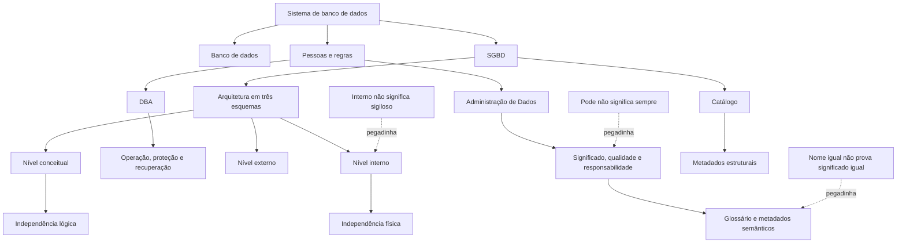
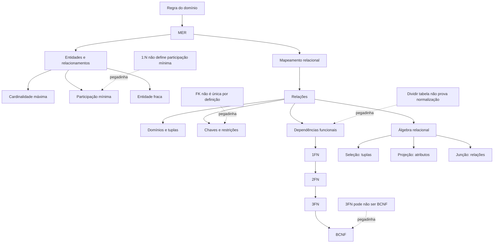

# Dia 1 — Arquitetura de banco de dados, independência e metadados

## Objetivo do dia

Compreender o sistema de banco de dados como um conjunto organizado de dados, pessoas, regras e software, distinguindo o papel do SGBD das responsabilidades de Administração de Dados e de Administração de Banco de Dados. Ao final, o estudante deve localizar uma necessidade nos níveis externo, conceitual ou interno, separar esquema de instância, reconhecer independência lógica e física e usar catálogo, dicionário e metadados como evidência de estrutura, significado e controle.

O Dia 1 não ensina consultas SQL, comandos DDL/DML, transações, índices ou otimização. Esses assuntos pertencem aos Dias 3–6 e não devem ser antecipados para resolver a fila de hoje.

## Resultados esperados

Ao concluir o dia, você deve conseguir:

- diferenciar dado, informação, banco de dados, SGBD e sistema de banco de dados;
- reconhecer as funções centrais de um SGBD sem tratá-lo como simples repositório de arquivos;
- distinguir a orientação corporativa da Administração de Dados da operação técnica predominante do DBA;
- separar esquema, instância e estado do banco;
- explicar os níveis externo, conceitual e interno e os mapeamentos entre eles;
- classificar uma mudança como independência física ou lógica e reconhecer seus limites;
- diferenciar catálogo de sistema, dicionário de dados, glossário de negócio e metadados;
- usar metadados para responder perguntas sobre estrutura, significado, responsabilidade e origem;
- recuperar pontos da Semana 2 sem reabrir toda a teoria;
- resolver situações básicas de Legislação CRA/CFA e de Google Documentos;
- formular tese clara para o treino discursivo da semana.

## Por que esse assunto importa para a prova

Arquitetura, independência e administração de dados aparecem expressamente no conteúdo de Banco de Dados do cargo. A banca pode não pedir apenas uma definição: pode descrever a troca de um dispositivo de armazenamento, a criação de uma visão departamental, a alteração de uma regra corporativa ou a consulta ao catálogo e exigir que o candidato identifique o nível atingido, o profissional predominante ou o tipo de metadado envolvido.

Esses conceitos também sustentam os dias seguintes. Modelagem, normalização e SQL só fazem sentido quando se sabe qual estrutura é estável, qual conteúdo varia e quais descrições permitem interpretar corretamente cada objeto.

## Como pode ser cobrado no estilo Instituto Consulplan

Formatos prováveis e pedagogicamente compatíveis com o perfil documentado da banca:

- alternativa correta ou incorreta sobre funções de um SGBD;
- cenário que troca Administração de Dados por DBA;
- comparação entre esquema e instância;
- associação entre nível externo, conceitual e interno;
- caso de alteração física que não deveria mudar programas;
- caso de alteração conceitual que exige preservar visões externas;
- identificação de metadado estrutural, administrativo, semântico ou de origem;
- análise de afirmações I, II e III;
- comando negativo com palavras absolutas como “sempre”, “somente” ou “automaticamente”.

Estratégia: identifique primeiro **o objeto que mudou** — significado corporativo, estrutura lógica, representação externa, armazenamento ou conteúdo corrente. Depois escolha o papel, nível ou tipo de independência correspondente.

## Jornada resumida — 6 horas líquidas

| Sessão | Etapa | Tempo | Entrega |
|---|---|---:|---|
| A | Bloco 1 | 55 min | mapa `SGBD × AD × DBA` |
| A | Bloco 2 | 55 min | quadro `esquema × instância × nível` |
| A | Bloco 3 | 60 min | matriz de mudanças, independência e metadados |
| B | Bloco 4 | 35 min | recuperação da Semana 2 + revisão legal e Google Documentos |
| B | Bloco 5 | 40 min | Português e tese discursiva |
| B | Bloco 6 | 25 min | recuperação ativa sem consulta |
| B | Seis Essenciais D0 | 30 min | S3D1Q001–S3D1Q006 |
| B | Correção A–D | 25 min | justificativa de todas as alternativas |
| B | Fechamento | 15 min | mini revisão, confiança e checklist |
| — | Consolidação | 20 min | caderno de erros e datas D+2/D+7/D+21 |
| **Total** |  | **360 min** | **dia encerrado sem sessão adicional** |

**Ponto de parada da Sessão A:** entregar uma folha com seis mudanças classificadas por responsável predominante, nível arquitetural, tipo de independência e metadado necessário. Encerrar aos 170 minutos mesmo que reste leitura complementar; nenhuma questão pode cobrar trecho ainda não estudado.

## Bloco 1 — SGBD, sistema de banco de dados e responsabilidades

### 1. Dado, informação, banco de dados, SGBD e sistema de banco de dados

**Dado** é uma representação de um fato, como `id_profissional = 417` ou `situacao = ativa`. Isolado, ele pode não responder a uma pergunta útil. **Informação** é o dado interpretado em contexto, por exemplo: “o profissional 417 está com registro ativo na data consultada”.

**Banco de dados** é uma coleção organizada de dados relacionados e mantidos para determinada finalidade. **SGBD** é o software que define, armazena, consulta, protege e administra o acesso ao banco. **Sistema de banco de dados** é mais amplo: inclui banco, SGBD, aplicações, usuários, regras, procedimentos, infraestrutura e pessoas responsáveis.

Um arquivo CSV pode conter dados, mas não se torna um SGBD por isso. Da mesma forma, o SGBD não é sinônimo do servidor físico em que está instalado nem da aplicação que apresenta telas ao usuário.

### 2. Funções centrais de um SGBD

| Função | Pergunta que resolve | Limite importante |
|---|---|---|
| definição estrutural | quais objetos, atributos e restrições existem? | não define sozinho o significado corporativo de cada termo |
| armazenamento e acesso | como os dados são mantidos e recuperados? | não transforma qualquer arquivo em banco governado |
| integridade | quais estados são aceitos ou rejeitados? | regra só é garantida se estiver corretamente especificada e aplicada |
| segurança e autorização | quem pode realizar cada operação? | autenticar alguém não significa autorizar tudo |
| controle de acesso simultâneo | como vários usuários trabalham sem corromper o estado? | o mecanismo depende de configuração e uso adequados |
| recuperação | como retornar a estado utilizável após falha? | possuir mecanismo não substitui política, teste e cópia íntegra |
| catálogo | como descrever objetos e propriedades do próprio banco? | catálogo técnico não substitui glossário de negócio |
| abstração | como separar representação externa, lógica e física? | independência reduz impacto, mas não torna mudanças invisíveis por magia |

Nesta etapa, retenha a finalidade de cada função. O funcionamento detalhado de transações, recuperação, segurança e índices será estudado nos Dias 5 e 6.

### Exemplos resolvidos — conceitos e funções do SGBD

#### Exemplo 1 — planilhas divergentes não formam um cadastro governado

**Situação:** três setores mantêm cópias locais do cadastro de profissionais. O mesmo registro aparece como `ATIVO`, `SUSPENSO` e `PENDENTE` em arquivos diferentes.

**Dados relevantes:** há cópias independentes, atualização sem regra comum e ausência de fonte única identificada.

**Passos de raciocínio:**

1. reconhecer que os arquivos contêm dados, mas não oferecem controle central do estado;
2. localizar o problema em integridade, compartilhamento e definição da fonte autorizada;
3. separar a tecnologia da governança: um SGBD pode centralizar e aplicar restrições, mas a organização ainda precisa definir a regra de negócio e o responsável pelo dado.

**Resposta:** migrar o cadastro para um sistema de banco de dados pode reduzir redundância descontrolada e aplicar regras comuns; isso não dispensa Administração de Dados nem definição da fonte oficial.

**Por que funciona:** a solução combina capacidade técnica do SGBD com responsabilidade organizacional sobre significado e qualidade.

**Erro provável:** afirmar que “usar SGBD elimina automaticamente toda inconsistência”. Um modelo incorreto ou uma integração mal definida também pode registrar dados errados.

#### Exemplo 2 — acesso negado é evidência de controle, não de perda do dado

**Situação:** uma usuária autenticada consegue consultar dados cadastrais, mas não consegue alterar a situação do registro.

**Dados relevantes:** a identidade foi reconhecida; a leitura é permitida; a alteração é bloqueada.

**Passos de raciocínio:**

1. distinguir autenticação de autorização;
2. observar que o SGBD ou a camada de acesso aplica privilégios diferentes por operação;
3. rejeitar a conclusão de que o dado não existe, pois a consulta foi bem-sucedida.

**Resposta:** o cenário é compatível com controle de autorização: a usuária possui permissão de leitura, mas não de alteração.

**Por que funciona:** permissões podem ser graduadas; reconhecer o usuário não concede todos os poderes.

**Erro provável:** concluir que falha de escrita prova indisponibilidade do banco ou erro de senha.

### 3. Administração de Dados versus Administração de Banco de Dados

Os nomes dos cargos variam entre organizações, por isso a prova deve ser resolvida pelo **foco predominante da atividade**, não por uma fronteira absoluta.

| Eixo | Administração de Dados — AD | Administração de Banco de Dados — DBA |
|---|---|---|
| foco predominante | dado como ativo corporativo | ambiente técnico do banco |
| perguntas típicas | o que significa? quem é dono? qual fonte é oficial? qual qualidade é exigida? | como implantar, proteger, monitorar, disponibilizar e recuperar? |
| produtos | política de dados, glossário, padrão de nomes, responsáveis, critérios de qualidade | configuração, contas e privilégios, rotinas operacionais, capacidade e recuperação |
| alcance | transversal ao negócio e aos sistemas | instâncias, serviços e plataformas de banco |
| relação | orienta significado e governança | implementa e opera controles técnicos coerentes com as regras |

AD e DBA cooperam. O AD não é “chefe do DBA” por definição, e o DBA não decide sozinho o significado de um indicador corporativo. Em equipes pequenas, a mesma pessoa pode acumular tarefas; a natureza da tarefa continua distinguível.

### Exemplos resolvidos — AD e DBA

#### Exemplo 1 — definição de “registro ativo”

**Situação:** áreas distintas calculam “profissionais ativos” de maneiras incompatíveis.

**Dados relevantes:** a divergência está no significado e no critério corporativo, não na disponibilidade do servidor.

**Passos de raciocínio:**

1. classificar o problema como semântico e de governança;
2. identificar a necessidade de glossário, responsável e regra comum;
3. somente depois traduzir a definição aprovada em estruturas e controles técnicos.

**Resposta:** a coordenação predominante é da Administração de Dados, com participação das áreas de negócio; o DBA apoia a implementação no ambiente.

**Por que funciona:** primeiro se decide o significado autorizado; depois se implementa a decisão.

**Erro provável:** atribuir ao DBA, sozinho, poder para escolher o conceito institucional por ser responsável técnico pelo banco.

#### Exemplo 2 — restauração do ambiente após falha

**Situação:** um serviço de banco não inicia após falha de armazenamento e precisa retornar de uma cópia validada.

**Dados relevantes:** há indisponibilidade técnica, mídia afetada e procedimento de recuperação previamente definido.

**Passos de raciocínio:**

1. classificar a demanda como operação e recuperação do ambiente;
2. identificar o DBA como responsável técnico predominante pela execução e validação;
3. manter a Administração de Dados informada sobre impacto, prioridade e qualidade do dado recuperado.

**Resposta:** o DBA conduz predominantemente a recuperação técnica; AD não é substituto operacional do administrador do ambiente.

**Por que funciona:** a atividade exige conhecimento da plataforma, das cópias e do procedimento de retorno.

**Erro provável:** concluir que somente AD participa porque os dados são um ativo corporativo.

## Bloco 2 — Esquemas, níveis arquiteturais e independência

### 4. Esquema, instância e estado do banco

**Esquema** descreve a estrutura relativamente estável: objetos, atributos, relacionamentos, domínios e restrições. É a intenção estrutural do banco.

**Instância**, ou estado do banco em um instante, é o conjunto de valores existentes naquele momento. Inserções, correções e exclusões mudam a instância; alterações estruturais mudam o esquema.

Não confunda “instância” neste sentido conceitual com o uso operacional do termo para designar uma instalação ou processo de um produto de banco. Em questão sobre arquitetura de dados, observe o contexto.

| Mudança | Classificação predominante |
|---|---|
| novo profissional cadastrado | instância/estado |
| correção de endereço | instância/estado |
| criação do atributo `data_validade` | esquema |
| alteração do domínio aceito para `situacao` | esquema/restrição |
| reinício do serviço do SGBD | operação da plataforma; não é, por si, alteração do esquema conceitual |

### Exemplos resolvidos — esquema e instância

#### Exemplo 1 — novos registros, mesma estrutura

**Situação:** o cadastro passa de 10.000 para 10.300 profissionais, mantendo os mesmos atributos e regras.

**Dados relevantes:** somente os valores e a quantidade de registros mudaram.

**Passos de raciocínio:**

1. verificar se houve criação ou alteração de atributo, relacionamento ou restrição;
2. como a resposta é não, observar que mudou apenas o conteúdo corrente;
3. classificar a mudança como nova instância/novo estado.

**Resposta:** houve mudança de instância, não de esquema.

**Por que funciona:** o esquema admite muitos estados válidos ao longo do tempo.

**Erro provável:** tratar crescimento do volume como mudança estrutural apenas porque a quantidade de linhas aumentou.

#### Exemplo 2 — novo atributo obrigatório

**Situação:** passa a ser necessário registrar a data de validade de uma credencial e impedir valor ausente nos novos registros.

**Dados relevantes:** há novo atributo e nova restrição estrutural.

**Passos de raciocínio:**

1. identificar a inclusão de `data_validade`;
2. identificar a regra de obrigatoriedade;
3. concluir que a descrição da estrutura mudou, ainda que os valores existentes também precisem de tratamento.

**Resposta:** a alteração é de esquema; a adequação dos registros é consequência sobre a instância.

**Por que funciona:** atributos e restrições integram a definição estrutural.

**Erro provável:** dizer que é apenas instância porque, ao final, valores serão preenchidos.

### 5. Arquitetura em três esquemas

A arquitetura ANSI/SPARC organiza descrições em três níveis conceituais:

| Nível | O que representa | Exemplo |
|---|---|---|
| externo | recorte necessário a usuário, grupo ou aplicação | visão do atendimento com nome e situação, sem dados restritos |
| conceitual | estrutura lógica global integrada | profissionais, registros, unidades e relacionamentos |
| interno | organização física e caminhos de armazenamento | arquivos, páginas, particionamento e estruturas de acesso |

Entre externo e conceitual há mapeamentos que relacionam cada recorte à estrutura global. Entre conceitual e interno há mapeamento entre a estrutura lógica e sua realização física.

“Externo” não significa fora do banco nem acesso público. É a representação adequada a determinado consumidor. “Conceitual” não significa apenas um desenho informal; é a descrição lógica integrada. “Interno” não é o conteúdo sigiloso; é a realização física.

### Exemplos resolvidos — três esquemas

#### Exemplo 1 — atendimento sem dado restrito

**Situação:** atendentes precisam ver nome, número de registro e situação, mas não informações internas de apuração.

**Dados relevantes:** a estrutura global contém todos os atributos; o grupo precisa de um recorte funcional.

**Passos de raciocínio:**

1. reconhecer que o conjunto completo pertence ao nível conceitual;
2. identificar que a apresentação limitada atende um grupo específico;
3. classificar o recorte como nível externo.

**Resposta:** deve existir uma representação externa para o atendimento, mapeada ao esquema conceitual.

**Por que funciona:** o nível externo adapta a representação sem exigir outra verdade corporativa.

**Erro provável:** chamar o recorte de nível interno porque ele contém dados “de dentro” da organização.

#### Exemplo 2 — troca da organização física

**Situação:** a equipe reorganiza páginas e arquivos físicos para melhorar a operação, preservando entidades, atributos e recortes dos usuários.

**Dados relevantes:** mudou a realização física; a estrutura lógica global e as representações externas foram preservadas.

**Passos de raciocínio:**

1. localizar arquivos e páginas no nível interno;
2. confirmar que o esquema conceitual não mudou;
3. concluir que o mapeamento conceitual–interno absorve a alteração.

**Resposta:** a mudança ocorre no nível interno e exemplifica o objetivo da independência física.

**Por que funciona:** aplicações continuam apoiadas na estrutura lógica, não na posição física dos dados.

**Erro provável:** afirmar que qualquer melhoria de desempenho altera automaticamente o nível conceitual.

### 6. Independência física e independência lógica de dados

**Independência física** é a capacidade de alterar o esquema interno sem exigir alteração do esquema conceitual e, por consequência, das aplicações que dependem dele. Exemplos: reorganizar arquivos, mudar estruturas físicas ou deslocar armazenamento preservando a estrutura lógica.

**Independência lógica** é a capacidade de alterar o esquema conceitual preservando, por mapeamento ou adaptação, os esquemas externos e aplicações que não deveriam ser afetados. Exemplos: acrescentar entidade ou atributo sem quebrar recortes existentes; reorganizar parte da estrutura lógica mantendo contratos externos.

A independência lógica costuma ser mais difícil, pois aplicações podem depender diretamente de nomes, atributos e relacionamentos conceituais. Nenhuma forma de independência promete impacto zero em toda mudança. Se um atributo consumido for removido ou tiver significado incompatível, algum contrato precisará ser alterado.

### Exemplos resolvidos — independência de dados

#### Exemplo 1 — mudança física preservada

**Situação:** o banco é movido de um conjunto de discos para outro arranjo de armazenamento, sem mudar objetos lógicos percebidos pelas aplicações.

**Dados relevantes:** a localização e a organização física mudam; nomes, atributos e relacionamentos permanecem.

**Passos de raciocínio:**

1. identificar que a mudança é interna;
2. verificar que o esquema conceitual foi preservado;
3. classificar como independência física.

**Resposta:** é um caso de independência física, desde que o mapeamento interno preserve a estrutura lógica consumida.

**Por que funciona:** a aplicação não precisa conhecer a mídia ou o arquivo físico.

**Erro provável:** chamar de independência lógica porque “a lógica da aplicação não mudou”. O critério é o nível alterado, não a sensação do usuário.

#### Exemplo 2 — ampliação conceitual preservando recorte externo

**Situação:** a estrutura global passa a distinguir endereço residencial e endereço profissional. Um relatório antigo precisa continuar exibindo apenas o endereço de correspondência já definido.

**Dados relevantes:** o esquema conceitual foi ampliado; o recorte externo antigo deve conservar significado e formato.

**Passos de raciocínio:**

1. localizar a nova distinção no nível conceitual;
2. definir qual dos novos endereços alimenta o campo externo antigo;
3. ajustar o mapeamento, preservando o contrato do relatório.

**Resposta:** o caso busca independência lógica por meio de mapeamento explícito entre a nova estrutura conceitual e o esquema externo antigo.

**Por que funciona:** a mudança lógica não precisa quebrar consumidores que não dependem da nova distinção.

**Erro provável:** afirmar que independência lógica torna qualquer remoção ou mudança de significado invisível automaticamente.

## Bloco 3 — Catálogo, dicionário, metadados e aplicação

### 7. Catálogo de sistema, dicionário de dados e metadados

**Metadados** são dados que descrevem outros dados e seus contextos. Podem registrar:

- estrutura: nome, tipo, domínio, obrigatoriedade e relacionamento;
- semântica: definição de negócio e regra de interpretação;
- administração: responsável, classificação, permissão e ciclo de vida;
- origem: sistema produtor, transformação e destino;
- operação: criação, alteração, volume ou outras propriedades observáveis.

O **catálogo de sistema** é mantido pelo SGBD e descreve objetos técnicos reconhecidos pelo próprio ambiente: esquemas, relações, atributos, restrições, usuários e privilégios, entre outros.

O termo **dicionário de dados** pode ser usado de forma ampla. Em prova, observe o contexto: pode designar a documentação estruturada de elementos, significados, formatos, domínios, regras e responsáveis. Ele não deve ser reduzido a uma lista de nomes.

O **glossário de negócio** concentra termos e significados corporativos, como “registro ativo” ou “data de regularização”. Ele complementa o catálogo técnico. Uma coluna pode existir no catálogo sem que seu significado institucional esteja suficientemente explicado.

### Exemplos resolvidos — catálogo e metadados

#### Exemplo 1 — descobrir estrutura sem abrir cada registro

**Situação:** o analista precisa saber quais atributos de uma relação são obrigatórios e qual chave a identifica.

**Dados relevantes:** a pergunta é sobre definição estrutural, não sobre os valores correntes.

**Passos de raciocínio:**

1. classificar nomes, tipos, obrigatoriedade e chaves como metadados estruturais;
2. localizar esses dados no catálogo mantido pelo SGBD;
3. evitar confundir catálogo com as próprias linhas da relação.

**Resposta:** consultar o catálogo/dicionário técnico do ambiente permite identificar atributos e restrições sem examinar cada ocorrência.

**Por que funciona:** o catálogo descreve a estrutura do banco.

**Erro provável:** dizer que somente uma amostra de registros revela se um atributo é obrigatório; ausência observada não prova a regra estrutural.

#### Exemplo 2 — mesmo nome, significados diferentes

**Situação:** dois sistemas possuem o atributo `status`, mas um usa `A/I` para atividade cadastral e outro usa `P/C` para processo pendente ou concluído.

**Dados relevantes:** o nome técnico é igual, enquanto domínio e significado são diferentes.

**Passos de raciocínio:**

1. rejeitar a integração baseada apenas no nome;
2. consultar domínio técnico no catálogo e definição semântica no dicionário/glossário;
3. registrar transformação e sistema de origem antes de combinar os dados.

**Resposta:** são necessários metadados estruturais, semânticos e de origem; igualdade de nome não demonstra equivalência.

**Por que funciona:** integração correta depende de significado, domínio e proveniência.

**Erro provável:** concluir que colunas homônimas podem ser unidas diretamente.

### 8. Contrastes decisivos

| Não confunda | Critério de separação |
|---|---|
| banco de dados × SGBD | coleção organizada × software gerenciador |
| SGBD × sistema de banco de dados | componente de software × ecossistema completo |
| AD × DBA | governança e significado × operação técnica predominante |
| esquema × instância | estrutura relativamente estável × valores em um instante |
| nível externo × interno | recorte do consumidor × realização física |
| independência física × lógica | muda interno × muda conceitual |
| catálogo × conteúdo | descrição dos objetos × ocorrências armazenadas |
| catálogo técnico × glossário | estrutura reconhecida pelo SGBD × significado corporativo |
| metadado × dado sem contexto | descrição do dado × valor que precisa ser interpretado |

### 9. Pegadinhas antes da prática

- chamar servidor físico de SGBD;
- supor que centralização elimina erro de modelagem ou de governança;
- atribuir toda definição de negócio ao DBA;
- tratar qualquer aumento de linhas como mudança de esquema;
- chamar dado sigiloso de “nível interno”;
- inverter independência lógica e física;
- afirmar que independência significa ausência total de impacto;
- equiparar catálogo técnico a glossário de negócio;
- inferir equivalência semântica apenas por nomes iguais.

### 10. Prática guiada — inventário de mudanças

Considere o seguinte cenário do Conselho:

1. a área institucional define que “regular” significa registro ativo e ausência de impedimento vigente;
2. a equipe cria um atributo para armazenar a origem da última atualização;
3. o armazenamento é reorganizado sem mudar objetos lógicos;
4. o atendimento passa a ver apenas nome, número e situação;
5. são carregados 500 novos registros;
6. o analista procura o responsável e a definição do atributo `situacao`;

Preencha sem consulta:

| Evento | AD ou DBA predominante | Esquema/instância | Nível | Independência | Metadado necessário |
|---|---|---|---|---|---|
| definição de “regular” |  |  |  |  |  |
| novo atributo de origem |  |  |  |  |  |
| reorganização física |  |  |  |  |  |
| recorte do atendimento |  |  |  |  |  |
| 500 registros |  |  |  |  |  |
| busca de responsável/definição |  |  |  |  |  |

**Solução guiada:**

| Evento | Classificação principal | Justificativa |
|---|---|---|
| definição de “regular” | AD; nível semântico/conceitual; metadado de negócio | decide significado e regra corporativa |
| novo atributo de origem | esquema conceitual; metadado estrutural e de proveniência | altera a descrição lógica e registra fonte |
| reorganização física | DBA; nível interno; independência física | muda realização física, preservando lógica |
| recorte do atendimento | nível externo | adapta a representação ao grupo consumidor |
| 500 registros | instância | muda conteúdo, não estrutura |
| busca de responsável/definição | dicionário/glossário e catálogo de governança | exige metadado administrativo e semântico |

**Produto da Sessão A:** redesenhe a tabela com um exemplo próprio em cada linha e grave uma explicação de até três minutos. Se não conseguir justificar o nível arquitetural, retorne somente à âncora correspondente.

## Bloco 4 — Recuperação da Semana 2, Legislação CRA/CFA e Google Documentos

**Tempo:** 35 minutos. **Questões associadas:** extras do Dia 1 indicadas como Bloco 4. O conteúdo abaixo é revisão suficiente para a cobrança; detalhes não apresentados não podem decidir uma alternativa.

### 11. Recuperação curta da Semana 2

Use no máximo oito minutos e responda sem consulta:

1. Qual equipamento encaminha entre redes IP: switch de camada 2 ou roteador?
2. Se o portal abre por IP, mas não por nome, qual serviço deve ser testado primeiro?
3. Autenticação bem-sucedida concede automaticamente acesso a todos os recursos?
4. Em resposta a incidente, por que preservar evidência antes de apagar artefatos?

**Conferência:** roteador; DNS; não, autorização é decisão separada; porque a erradicação precipitada pode destruir evidência necessária ao diagnóstico e à responsabilização. Qualquer erro volta ao caderno da Semana 2, sem reabrir a apostila inteira.

### 12. Legislação CRA/CFA — mapa de fonte e competência

Para esta revisão, use quatro núcleos confirmados:

| Fonte | Função segura para a prova | Não conclua |
|---|---|---|
| Lei nº 4.769/1965 | disciplina a profissão e estabelece a base do Sistema CFA/CRAs | que resolução posterior pode afastar livremente a lei |
| Decreto nº 61.934/1967 | regulamenta a execução da Lei nº 4.769/1965 | que decreto e lei possuem função idêntica |
| Regimento do CRA-PR — RN CFA nº 651/2024 | organiza natureza, jurisdição, órgãos e competências internas do Regional | que o Regimento é o Código de Ética |
| Código de Ética — RN CFA nº 671/2025 | disciplina deveres, direitos, infrações e sanções no alcance aplicável | que toda consequência vale indistintamente para pessoa física e jurídica |

O **CFA** atua no plano nacional de orientação, disciplina e normatização dentro de sua competência. O **CRA-PR** executa atribuições regionais, mantém registros, fiscaliza e decide matérias no âmbito de sua jurisdição. Autonomia administrativa do Regional não significa poder para revogar norma nacional ou lei federal.

Roteiro para caso legal:

1. identifique o objeto: profissão, regulamentação, organização interna ou ética;
2. localize a fonte correspondente;
3. identifique sujeito e jurisdição;
4. rejeite conclusão baseada apenas em a norma ser mais recente;
5. não invente prazo, sanção ou competência ausente do conteúdo confirmado.

### Exemplos resolvidos — Legislação CRA/CFA

#### Exemplo 1 — orientação nacional e fiscalização regional

**Situação:** surge notícia de exercício irregular em município paranaense e, paralelamente, necessidade de orientação uniforme para todos os Conselhos Regionais.

**Dados relevantes:** o fato concreto ocorre no Paraná; a orientação pretendida tem alcance nacional.

**Passos de raciocínio:**

1. separar execução regional de uniformização nacional;
2. atribuir registro e fiscalização ordinária ao CRA-PR em sua jurisdição;
3. atribuir orientação geral do sistema ao CFA dentro de suas competências.

**Resposta:** CRA-PR atua no caso regional; CFA exerce o papel nacional de orientação e disciplina.

**Por que funciona:** a divisão considera alcance e competência, não uma hierarquia simplista de “órgão maior faz tudo”.

**Erro provável:** afirmar que o CFA deve realizar toda diligência local porque possui atuação nacional.

#### Exemplo 2 — resolução mais nova não supera a lei

**Situação:** uma alternativa afirma que resolução administrativa de 2025 prevalece sobre lei federal de 1965 apenas por ser posterior.

**Dados relevantes:** as normas possuem hierarquia e funções distintas.

**Passos de raciocínio:**

1. reconhecer que cronologia e hierarquia são critérios diferentes;
2. verificar que a resolução deve permanecer dentro da competência legal;
3. rejeitar prevalência automática fundada somente na data.

**Resposta:** a afirmação está incorreta; ato inferior posterior não afasta livremente lei superior.

**Por que funciona:** o sistema normativo não é ordenado apenas do mais recente para o mais antigo.

**Erro provável:** escolher sempre a norma de número ou ano mais alto.

### 13. Google Documentos — colaboração, sugestões e histórico

No Google Documentos, separe função de edição, sugestão, comentário e histórico:

- **editor:** pode alterar o conteúdo diretamente, além de comentar e trabalhar com sugestões conforme as permissões do arquivo;
- **comentador:** pode comentar e sugerir alterações, mas não altera diretamente o conteúdo como editor;
- **leitor:** consulta o arquivo, sem editar o conteúdo ou acrescentar comentários;
- **modo Sugestão:** propõe inserções e exclusões sem substituir imediatamente o texto original; a sugestão pode ser aceita ou rejeitada;
- **comentário:** registra discussão associada a um trecho; não equivale a editar esse trecho;
- **histórico de versões:** permite a usuário com permissão adequada examinar versões e, quando autorizado, restaurar ou copiar uma versão anterior;
- **títulos e estilos:** estruturam o documento e ajudam navegação e consistência; aumentar manualmente a fonte não equivale semanticamente a aplicar um estilo de título.

Permissão deve seguir menor privilégio. Se alguém precisa apenas revisar, conceder edição integral é mais amplo que o necessário. Recurso disponível também pode depender do tipo de conta e de políticas administrativas; uma questão correta não deve transformar possibilidade configurável em garantia universal.

### Exemplos resolvidos — Google Documentos

#### Exemplo 1 — revisão sem alteração direta

**Situação:** uma consultora deve propor correções em minuta, mas o responsável precisa aceitar ou rejeitar cada mudança antes que ela componha o texto final.

**Dados relevantes:** a consultora não deve substituir imediatamente o original; o proprietário decide sobre cada alteração.

**Passos de raciocínio:**

1. excluir o modo de edição direta;
2. escolher o modo Sugestão;
3. conceder permissão compatível, como comentador ou editor conforme a política do arquivo, sem ampliar acesso desnecessariamente.

**Resposta:** usar sugestões permite propor alterações que serão aceitas ou rejeitadas pelo responsável.

**Por que funciona:** a sugestão preserva a decisão final sobre o texto.

**Erro provável:** usar comentários como se eles substituíssem automaticamente as palavras selecionadas.

#### Exemplo 2 — recuperar uma redação anterior

**Situação:** depois de várias edições válidas, a equipe percebe que um parágrafo importante existia em versão anterior.

**Dados relevantes:** o objetivo é localizar uma versão passada e recuperar seu conteúdo; não se trata apenas de desfazer a última tecla.

**Passos de raciocínio:**

1. abrir o histórico de versões com permissão adequada;
2. localizar a versão que contém o parágrafo;
3. decidir entre restaurar a versão inteira ou copiar o conteúdo necessário, evitando apagar alterações válidas posteriores.

**Resposta:** consultar o histórico e copiar o trecho costuma ser mais seguro quando outras mudanças posteriores devem ser preservadas.

**Por que funciona:** restaurar uma versão inteira altera o estado atual do documento; copiar permite recuperação seletiva.

**Erro provável:** afirmar que histórico de versões é visível e restaurável por qualquer leitor.

## Bloco 5 — Português e progressão discursiva

**Tempo:** 40 minutos. **Função:** leitura precisa de comandos e início da dissertação semanal.

### 14. Comando, escopo e palavras absolutas

Antes de avaliar o conteúdo técnico, circule o comando:

- `correta`: procure a única afirmação integralmente defensável;
- `incorreta`: procure a afirmação falsa e não marque uma verdadeira apenas por considerá-la incompleta;
- `EXCETO`: descubra primeiro a classe comum das demais;
- `apenas`: confira exatamente quais assertivas foram incluídas;
- `pode`: indica possibilidade, não garantia;
- `sempre`, `nunca`, `somente`: exigem regra sem exceção no contexto informado.

Conectores também mudam o raciocínio: `portanto` introduz conclusão; `porque` pode apresentar causa ou explicação; `embora` marca concessão; `contudo` contrapõe sem apagar a afirmação anterior.

### 15. Discursiva — recorte e tese

**Tema de trabalho:** governança e uso responsável de dados na melhoria dos serviços públicos.

**Comando de treino:** formule uma tese que responda como o poder público pode aproveitar dados para melhorar serviços sem reduzir direitos, transparência e responsabilidade.

Uma tese adequada contém:

1. resposta ao problema;
2. posição delimitada;
3. dois eixos que possam virar parágrafos de desenvolvimento.

Modelo de arquitetura, não de texto para copiar:

`posição central + eixo 1 (qualidade/finalidade) + eixo 2 (proteção/responsabilização)`.

### Exemplos resolvidos — Português e tese

#### Exemplo 1 — possibilidade não é garantia

**Situação:** o texto afirma: “metadados podem reduzir erros de interpretação quando registram significado e origem”. A alternativa conclui: “metadados sempre eliminam erros”.

**Dados relevantes:** `podem` expressa possibilidade condicionada; `sempre eliminam` universaliza o efeito.

**Passos de raciocínio:**

1. localizar o modal `podem`;
2. comparar seu alcance com `sempre`;
3. rejeitar a generalização absoluta.

**Resposta:** a alternativa extrapola o texto.

**Por que funciona:** possibilidade não sustenta universalidade.

**Erro provável:** marcar a alternativa porque repete as palavras “metadados” e “erros”.

#### Exemplo 2 — transformar tema em tese

**Situação:** a primeira versão diz: “Dados são importantes para a sociedade e devem ser bem usados.”

**Dados relevantes:** a frase é genérica, não responde como conciliar melhoria e direitos e não anuncia eixos.

**Passos de raciocínio:**

1. formular posição: uso de dados deve estar vinculado a finalidade pública;
2. escolher eixo 1: qualidade e avaliação do serviço;
3. escolher eixo 2: transparência, proteção e responsabilização;
4. reunir os elementos sem prometer solução total.

**Resposta possível:** “O uso de dados pode qualificar serviços públicos quando se apoia em informações confiáveis e finalidades verificáveis, ao mesmo tempo que assegura transparência, proteção e responsabilização.”

**Por que funciona:** a tese responde ao conflito e abre dois caminhos argumentativos.

**Erro provável:** apresentar apenas o tema ou listar palavras positivas sem relação causal.

**Entrega:** escreva uma introdução manuscrita de quatro a cinco linhas, sublinhe posição e dois eixos e reescreva uma expressão vaga.

## Bloco 6 — Recuperação ativa e caderno de erros

**Tempo:** 25 minutos. Este bloco não apresenta conteúdo novo e não pode fundamentar questão que os Blocos 1–5 não tenham preparado.

Sem consulta:

1. desenhe os três níveis arquiteturais;
2. dê um exemplo de esquema e outro de instância;
3. explique em uma frase a diferença entre independência lógica e física;
4. classifique duas tarefas como AD ou DBA e justifique;
5. diferencie catálogo técnico e glossário de negócio;
6. recupere CFA × CRA-PR;
7. diferencie sugestão, comentário e histórico no Google Documentos;
8. repita a tese sem olhar o modelo.

Confira com outra cor. Para cada erro, registre: resposta inicial, regra correta, contraste, exemplo próprio, âncora, confiança de 0 a 3 e datas D+2, D+7 e D+21.

## Mapa de conexões do Dia 1

## Tabela de revisão rápida do Dia 1

| Se o enunciado mencionar... | Pense primeiro em... |
|---|---|
| regra e significado corporativo | Administração de Dados |
| configuração, disponibilidade e recuperação do ambiente | DBA |
| valores correntes | instância |
| atributos, relações e restrições | esquema |
| recorte por usuário ou aplicação | nível externo |
| estrutura lógica global | nível conceitual |
| arquivos, páginas e organização física | nível interno |
| mudança interna sem mudança conceitual | independência física |
| mudança conceitual com preservação externa | independência lógica |
| nomes, tipos, chaves e privilégios | catálogo/metadado técnico |
| definição, responsável e origem | glossário/dicionário e metadados semânticos/administrativos |

## Pegadinhas do Dia 1

- SGBD é software; sistema de banco de dados é o conjunto mais amplo.
- AD e DBA podem colaborar; a questão pede o foco predominante.
- instância conceitual é estado dos dados, não necessariamente instalação do produto.
- externo é recorte, não informação pública.
- mudança física não se torna lógica apenas porque a aplicação foi preservada.
- independência não garante compatibilidade com remoção de campo consumido.
- catálogo descreve objetos, mas não substitui a definição corporativa.
- leitor, comentador e editor não possuem o mesmo alcance no Google Drive/Documentos.
- comando `INCORRETA` muda o alvo, não a verdade técnica das outras alternativas.

## Mini revisão — dez perguntas

1. O que torna o sistema de banco de dados mais amplo que o SGBD?
2. Qual papel predomina na definição corporativa de “registro regular”?
3. Cadastrar uma nova pessoa muda esquema ou instância?
4. Criar um atributo muda esquema ou instância?
5. Qual nível representa um recorte para determinada aplicação?
6. Qual nível descreve a estrutura lógica global?
7. Trocar a organização física preservando a lógica exemplifica qual independência?
8. Alterar o conceitual preservando uma representação externa busca qual independência?
9. Onde procurar tipos e restrições reconhecidos pelo SGBD?
10. Qual recurso do Google Documentos permite propor alteração sujeita a aceite?

### Respostas da mini revisão

1. Inclui banco, SGBD, aplicações, usuários, regras, infraestrutura e pessoas.
2. Administração de Dados, com participação do negócio.
3. Instância.
4. Esquema.
5. Externo.
6. Conceitual.
7. Física.
8. Lógica.
9. Catálogo/dicionário técnico.
10. Modo Sugestão.

## Checklist de domínio

- [ ] Distingo banco, SGBD e sistema de banco de dados.
- [ ] Classifico tarefas de AD e DBA pelo foco predominante.
- [ ] Separo esquema de instância em cenário novo.
- [ ] Desenho os níveis externo, conceitual e interno.
- [ ] Classifico independência lógica e física sem usar palavra-chave isolada.
- [ ] Diferencio catálogo, dicionário, glossário e metadados.
- [ ] Explico por que nome igual não prova semântica igual.
- [ ] Resolvo CFA × CRA-PR sem inverter alcance.
- [ ] Distingo edição, sugestão, comentário e histórico.
- [ ] Produzo tese com posição e dois eixos.

## Fila de dez Essenciais e correção

| Ordem | ID | Núcleo | Momento |
|---:|---|---|---|
| 1 | S3D1Q001 | Dado, banco e SGBD — [teoria](#s3-d1-conceitos-sgbd) | D0 |
| 2 | S3D1Q002 | Informação em contexto — [teoria](#s3-d1-conceitos-sgbd) | D0 |
| 3 | S3D1Q003 | Sistema de banco de dados — [teoria](#s3-d1-conceitos-sgbd) | D0 |
| 4 | S3D1Q004 | Catálogo como função do SGBD — [teoria](#s3-d1-funcoes-sgbd) | D0 |
| 5 | S3D1Q005 | Autenticação e autorização — [teoria](#s3-d1-funcoes-sgbd) | D0 |
| 6 | S3D1Q006 | Administração de Dados — [teoria](#s3-d1-ad-dba) | D0 |
| 7 | S3D1Q007 | Atuação predominante do DBA — [teoria](#s3-d1-ad-dba) | D+2 |
| 8 | S3D1Q008 | Cooperação entre AD e DBA — [teoria](#s3-d1-ad-dba) | D+2 |
| 9 | S3D1Q009 | Centralização e governança — [exemplo](#s3-d1-exemplos-sgbd) | D+2 |
| 10 | S3D1Q010 | Distribuição de responsabilidades — [exemplo](#s3-d1-exemplos-ad-dba) | D+2 |

O teto D0 é dez somente se couber correção integral; a fila padrão abre seis. Para cada item, registre resposta, confiança 0–3 e motivo. Na correção, explique A–D, volte apenas à âncora necessária e escreva um contraexemplo para o distrator escolhido.

## Fechamento do Dia 1

O dia encerra quando houver:

- produto da Sessão A preenchido;
- introdução e tese reescritas;
- seis Essenciais corrigidas A–D;
- erros e acertos inseguros registrados;
- saldo S3D1Q007–S3D1Q010 agendado para D+2;
- confiança geral por núcleo registrada.

Não use a sensação de leitura como domínio. Explique em voz alta por que cada exemplo pertence ao nível, papel ou metadado escolhido.

## Fontes do Dia 1

- Lei nº 4.769/1965: https://www.planalto.gov.br/ccivil_03/leis/l4769.htm
- Decreto nº 61.934/1967: https://www.planalto.gov.br/ccivil_03/decreto/Antigos/D61934.htm
- RN CFA nº 651/2024 — Regimento do CRA-PR: https://documentos.cfa.org.br/?a=show&c=documento&id=955
- RN CFA nº 671/2025 — Código de Ética: https://documentos.cfa.org.br/?a=show&c=documento&id=1038
- Google Drive — níveis de acesso: https://support.google.com/drive/answer/16722399
- Google Documentos — sugerir edições: https://support.google.com/docs/answer/6033474
- Editores Google — histórico de versões: https://support.google.com/docs/answer/190843

---

# Dia 2 — Modelo relacional, MER, mapeamento e normalização

## Objetivo do dia

Representar dados com precisão no modelo relacional e no Modelo Entidade–Relacionamento, interpretar domínios, tuplas, relações, chaves e restrições, mapear estruturas conceituais para relações e aplicar álgebra relacional e normalização até BCNF. O estudante deve justificar cada decomposição por dependências e anomalias, não apenas decorar slogans como “uma tabela para cada coisa”.

O Dia 2 não ensina sintaxe SQL, comandos de criação/alteração, Transact-SQL, transações, índices, produtos específicos ou BI. As relações e operações são tratadas em nível conceitual e algébrico; a tradução para SQL começa no Dia 3.

## Resultados esperados

Ao concluir o dia, você deve conseguir:

- definir domínio, atributo, tupla, relação, grau e cardinalidade;
- distinguir superchave, chave candidata, primária, alternativa, composta e estrangeira;
- reconhecer integridade de domínio, de entidade e referencial;
- modelar entidades, atributos e relacionamentos;
- interpretar cardinalidade mínima/máxima e participação total/parcial;
- reconhecer entidade fraca, chave parcial e relacionamento identificador;
- mapear entidades fortes, relacionamentos 1:1, 1:N e N:N, atributos multivalorados e entidades fracas;
- aplicar seleção, projeção, união, diferença, produto, renomeação e junção em nível algébrico;
- identificar dependências funcionais completas, parciais e transitivas;
- normalizar relações até 1FN, 2FN, 3FN e BCNF;
- justificar decomposição sem misturar normalização com mera divisão visual de tabelas;
- recuperar Administração Pública e usar referências, funções e filtros básicos no Google Planilhas;
- produzir o primeiro desenvolvimento da dissertação.

## Por que esse assunto importa para a prova

Modelo relacional, MER, mapeamento e normalização são núcleos explícitos do edital. A Consulplan pode apresentar um pequeno esquema, descrever uma regra de negócio e perguntar onde fica a chave estrangeira, se a participação é total, qual dependência viola determinada forma normal ou qual operação algébrica produz o resultado desejado.

O tema também mede raciocínio. Uma relação pode estar em 3FN e ainda violar BCNF; uma entidade fraca não é apenas uma entidade “pouco importante”; uma chave estrangeira não precisa ser única; e projeção matemática não é simples exibição visual de colunas sem considerar a natureza de conjunto.

## Como pode ser cobrado no estilo Instituto Consulplan

- classificação de chave em cenário cadastral;
- assertivas sobre domínio, tupla e relação;
- leitura de cardinalidade `0..1`, `1..1`, `0..N` e `1..N`;
- identificação de participação total ou parcial;
- reconhecimento e mapeamento de entidade fraca;
- escolha do lado que recebe chave estrangeira em 1:N ou 1:1;
- criação de relação associativa em N:N;
- resultado de seleção, projeção, diferença ou junção;
- identificação de dependência parcial ou transitiva;
- decomposição até 2FN, 3FN ou BCNF;
- alternativa incorreta que confunde chave candidata com qualquer atributo único observado em uma amostra.

Estratégia: escreva primeiro as regras do cenário em frases curtas. Depois converta cada regra em cardinalidade, dependência ou restrição. Não escolha a alternativa pelo desenho mais familiar.

## Jornada resumida — 6 horas líquidas

| Sessão | Etapa | Tempo | Entrega |
|---|---|---:|---|
| A | Bloco 1 | 55 min | quadro de relações, chaves e restrições |
| A | Bloco 2 | 55 min | dois MERs mapeados para relações |
| A | Bloco 3 | 60 min | operações algébricas e decomposição normalizada |
| B | Bloco 4 | 35 min | recuperação da Semana 2 + Administração Pública e Google Planilhas |
| B | Bloco 5 | 40 min | Português e desenvolvimento argumentativo |
| B | Bloco 6 | 25 min | recuperação ativa sem conteúdo novo |
| B | Seis Essenciais D0 | 30 min | S3D2Q051–S3D2Q056 |
| B | Correção A–D | 25 min | justificativa de todas as alternativas |
| B | Fechamento | 15 min | mini revisão, confiança e checklist |
| — | Consolidação | 20 min | caderno de erros e datas D+2/D+7/D+21 |
| **Total** |  | **360 min** | **dia encerrado sem sessão adicional** |

**Ponto de parada da Sessão A:** entregar o mapeamento do caso integrado e uma decomposição justificada até BCNF ou até a forma normal efetivamente alcançada. Se não conseguir demonstrar uma dependência, registre a lacuna; não invente regra do domínio para forçar normalização.

## Bloco 1 — Modelo relacional, chaves e restrições

### 1. Domínio, atributo, tupla e relação

No modelo relacional:

- **domínio** é o conjunto de valores admissíveis para um atributo, acompanhado de seu significado;
- **atributo** nomeia uma propriedade representada por uma coluna no esquema relacional;
- **tupla** é uma ocorrência formada por valores dos atributos;
- **relação** é um conjunto de tuplas compatíveis com o mesmo esquema;
- **grau** é a quantidade de atributos da relação;
- **cardinalidade da relação** é a quantidade de tuplas no estado considerado.

No modelo matemático, a ordem de atributos não altera o significado quando eles são identificados por nome, a ordem das tuplas é irrelevante e uma relação é conjunto, portanto não contém tuplas duplicadas. Produtos SQL podem trabalhar com resultados que admitem duplicidade; essa distinção será tratada no Dia 3 e não muda a definição relacional usada hoje.

Um domínio não é apenas o tipo físico. `data`, por exemplo, pode admitir qualquer data tecnicamente representável, mas o atributo `data_nascimento` ainda possui regra semântica diferente de `data_regularizacao`.

### 2. Superchaves, chaves candidatas e chave primária

| Conceito | Definição operacional |
|---|---|
| superchave | conjunto de atributos que identifica unicamente uma tupla, ainda que contenha atributo desnecessário |
| chave candidata | superchave mínima: retirar qualquer atributo faz perder a unicidade garantida |
| chave primária | chave candidata escolhida como identificador principal |
| chave alternativa | chave candidata não escolhida como primária |
| chave composta | chave formada por mais de um atributo |
| chave estrangeira | atributo ou conjunto que referencia chave candidata compatível de outra relação ou da própria relação |

Unicidade observada em uma amostra não cria chave candidata. É preciso que a regra do domínio garanta a unicidade. Se hoje todos os nomes são diferentes, isso não torna `nome` uma chave.

### 3. Restrições de integridade

- **integridade de domínio:** valor deve pertencer ao domínio e obedecer às regras do atributo;
- **integridade de entidade:** a chave primária identifica cada tupla e não admite valor nulo em seus componentes;
- **integridade referencial:** valor de chave estrangeira deve corresponder a uma chave referenciada existente, salvo quando valor nulo for permitido pelo modelo;
- **restrição semântica:** regra específica do negócio, como impedir data final anterior à inicial.

Uma chave estrangeira não precisa ser única em relação 1:N. Muitas tuplas filhas podem apontar para a mesma tupla pai. Também não se conclui que toda coluna de mesmo nome forma referência: a relação deve ser definida e os domínios precisam ser compatíveis.

### Exemplos resolvidos — modelo relacional, chaves e restrições

#### Exemplo 1 — encontrar chaves sem usar coincidência da amostra

**Situação:** `PROFISSIONAL(id_profissional, cpf, nome, email)` possui as regras: `id_profissional` é gerado sem repetição; `cpf` é obrigatório e único; `email` pode ser compartilhado por uma equipe.

**Dados relevantes:** unicidade garantida para `id_profissional` e `cpf`; `email` não é garantido como único.

**Passos de raciocínio:**

1. testar `id_profissional`: identifica sozinho, portanto é chave candidata;
2. testar `cpf`: também identifica sozinho, portanto é outra candidata;
3. testar o par `{id_profissional, nome}`: identifica, mas não é mínimo, logo é superchave não candidata;
4. rejeitar `email` como candidata;
5. escolher uma candidata como primária e classificar a outra como alternativa.

**Resposta:** candidatas: `id_profissional` e `cpf`; se a primeira for escolhida como PK, `cpf` é chave alternativa.

**Por que funciona:** candidaturas decorrem de unicidade garantida e minimalidade.

**Erro provável:** chamar todo conjunto único de chave candidata, ignorando atributo redundante.

#### Exemplo 2 — integridade referencial em anuidades

**Situação:** `ANUIDADE(id_anuidade, id_profissional, ano)` referencia `PROFISSIONAL(id_profissional)`. Existem várias anuidades do mesmo profissional, uma por ano.

**Dados relevantes:** relação 1:N entre profissional e anuidades; referência obrigatória ao profissional existente.

**Passos de raciocínio:**

1. localizar `id_profissional` em `ANUIDADE` como chave estrangeira;
2. permitir repetição desse valor, pois um profissional pode ter várias anuidades;
3. impedir valor que não corresponda a profissional existente;
4. usar `id_anuidade` ou outra candidata adequada para identificar a anuidade.

**Resposta:** `ANUIDADE.id_profissional` é FK não necessariamente única e deve respeitar integridade referencial.

**Por que funciona:** o lado N armazena a referência ao lado 1.

**Erro provável:** exigir unicidade da FK e, assim, transformar indevidamente 1:N em 1:1.

## Bloco 2 — MER e mapeamento MER–relacional

### 4. Entidades, atributos e relacionamentos

**Entidade** é objeto distinguível do domínio. **Tipo de entidade** reúne entidades com propriedades comuns. **Atributo** descreve uma propriedade e pode ser:

- simples ou composto;
- monovalorado ou multivalorado;
- armazenado ou derivado;
- identificador ou não identificador.

**Relacionamento** representa associação entre entidades. Seu grau indica quantos tipos de entidade participam, e pode possuir atributos próprios quando estes descrevem o vínculo, não cada participante isoladamente.

Exemplo: em `PROFISSIONAL participa de PROJETO`, `horas_semanais` descreve a participação e pertence ao relacionamento, não ao profissional ou ao projeto sozinho.

### 5. Cardinalidade e participação

Use mínimo e máximo:

- `0..1`: participação opcional, no máximo uma ocorrência;
- `1..1`: participação obrigatória, exatamente uma;
- `0..N`: opcional, várias possíveis;
- `1..N`: ao menos uma, várias possíveis.

**Cardinalidade máxima** distingue 1:1, 1:N e N:N. **Participação total** significa mínimo 1: toda entidade daquele lado deve participar. **Participação parcial** significa mínimo 0.

Não infira participação total apenas porque o relacionamento é 1:N. Máximo e mínimo respondem perguntas diferentes.

### 6. Entidade fraca

Uma entidade fraca não possui chave completa própria no contexto do modelo e depende de uma entidade proprietária para identificação. Ela apresenta:

- entidade proprietária;
- relacionamento identificador;
- participação total nesse relacionamento;
- chave parcial, que distingue ocorrências dentro do mesmo proprietário.

Sua identificação resulta da chave do proprietário combinada à chave parcial. Dependência existencial, sozinha, não transforma qualquer entidade em fraca; o ponto decisivo é a identificação dependente.

### Exemplos resolvidos — MER

#### Exemplo 1 — unidade e servidor

**Situação:** cada servidor está lotado em exatamente uma unidade; uma unidade pode existir temporariamente sem servidor e pode lotar muitos.

**Dados relevantes:** servidor `1..1`; unidade `0..N` no relacionamento de lotação.

**Passos de raciocínio:**

1. avaliar o máximo: uma unidade recebe muitos servidores, cada servidor uma unidade → 1:N;
2. avaliar o mínimo do servidor: exatamente uma unidade → participação total do servidor;
3. avaliar o mínimo da unidade: pode ter zero → participação parcial da unidade.

**Resposta:** relacionamento 1:N, com participação total de SERVIDOR e parcial de UNIDADE.

**Por que funciona:** máximo define 1:N; mínimo define obrigatoriedade.

**Erro provável:** declarar participação total dos dois lados porque todo servidor precisa de unidade.

#### Exemplo 2 — dependente identificado dentro do profissional

**Situação:** o sistema registra dependentes por `sequencia` dentro de cada profissional. A sequência 1 pode reaparecer para profissionais diferentes e um dependente não existe no cadastro sem seu titular.

**Dados relevantes:** `sequencia` não identifica globalmente; a chave do profissional completa a identificação; participação do dependente é obrigatória.

**Passos de raciocínio:**

1. reconhecer PROFISSIONAL como proprietário;
2. reconhecer DEPENDENTE como entidade fraca;
3. classificar `sequencia` como chave parcial;
4. formar a identificação por `(id_profissional, sequencia)`.

**Resposta:** DEPENDENTE é fraca e participa totalmente do relacionamento identificador com PROFISSIONAL.

**Por que funciona:** sua identidade depende da chave do proprietário.

**Erro provável:** usar `sequencia` sozinha como chave global.

### 7. Regras de mapeamento MER–relacional

| Estrutura no MER | Mapeamento básico |
|---|---|
| entidade forte | relação com atributos simples; identificador vira chave candidata/primária |
| atributo composto | decompor em componentes necessários |
| atributo multivalorado | criar relação própria com chave do proprietário e valor |
| 1:N | levar a chave do lado 1 para o lado N como FK; atributos do vínculo acompanham o lado N quando apropriado |
| 1:1 | colocar FK em um dos lados, preferindo o de participação total quando isso representa a regra; impor unicidade |
| N:N | criar relação associativa com FKs dos participantes e atributos do relacionamento |
| entidade fraca | criar relação com chave do proprietário + chave parcial |

Em 1:1, colocar uma FK sem restrição de unicidade pode permitir vários registros e alterar a cardinalidade. Em N:N, armazenar lista de identificadores em uma única célula prejudica atomicidade e integridade referencial.

### Exemplos resolvidos — mapeamento

#### Exemplo 1 — participação N:N com atributo próprio

**Situação:** profissionais participam de vários projetos e cada projeto reúne vários profissionais. O vínculo registra `papel` e `horas_semanais`.

**Dados relevantes:** cardinalidade N:N; dois atributos pertencem ao vínculo.

**Passos de raciocínio:**

1. criar `PROFISSIONAL(id_profissional, ...)`;
2. criar `PROJETO(id_projeto, ...)`;
3. criar `PARTICIPACAO(id_profissional, id_projeto, papel, horas_semanais)`;
4. usar FKs para os participantes e chave sobre o par, salvo regra que admita múltiplos períodos e exija ampliar a chave.

**Resposta:** o relacionamento vira relação associativa, e seus atributos permanecem nela.

**Por que funciona:** cada linha representa um vínculo específico entre profissional e projeto.

**Erro provável:** colocar `id_projeto` apenas em PROFISSIONAL, limitando-o a um projeto.

#### Exemplo 2 — relacionamento 1:1 opcional de um lado

**Situação:** toda CARTEIRA emitida pertence a exatamente um PROFISSIONAL, mas um profissional pode ainda não possuir carteira; cada profissional possui no máximo uma.

**Dados relevantes:** CARTEIRA participa totalmente; PROFISSIONAL participa parcialmente; máximo 1 nos dois lados.

**Passos de raciocínio:**

1. escolher CARTEIRA, lado de participação total, para receber `id_profissional`;
2. tornar a referência obrigatória para cada carteira;
3. impor unicidade a `CARTEIRA.id_profissional` para impedir duas carteiras por profissional;
4. manter a possibilidade de profissional sem linha correspondente.

**Resposta:** `CARTEIRA(..., id_profissional FK UNIQUE e obrigatório)` representa a regra descrita.

**Por que funciona:** presença e unicidade preservam mínimo e máximo do relacionamento.

**Erro provável:** criar apenas a FK e esquecer unicidade, convertendo o caso em 1:N.

## Bloco 3 — Álgebra relacional e normalização

### 8. Operações da álgebra relacional

| Operação | Símbolo usual | Efeito |
|---|---|---|
| seleção | `σ` | escolhe tuplas por predicado |
| projeção | `π` | escolhe atributos; no modelo relacional, o resultado é relação e elimina duplicatas |
| união | `∪` | reúne tuplas de relações compatíveis |
| diferença | `−` | mantém tuplas da primeira ausentes na segunda, exigindo compatibilidade |
| produto cartesiano | `×` | combina cada tupla da primeira com cada tupla da segunda |
| renomeação | `ρ` | renomeia relação ou atributos para tornar expressões claras |
| junção | `⋈` | combina tuplas relacionadas por condição; pode ser vista como produto seguido de seleção adequada |

Seleção atua sobre linhas; projeção, sobre colunas. União não é junção. Diferença não é subtração numérica. Produto cartesiano sem condição pode gerar combinações sem significado e costuma ser etapa intermediária, não resposta final.

### Exemplos resolvidos — álgebra relacional

#### Exemplo 1 — profissionais ativos do Paraná

**Situação:** `PROFISSIONAL(id, nome, uf, situacao)` deve produzir somente nomes de profissionais ativos do Paraná.

**Dados relevantes:** dois predicados sobre tuplas e um atributo desejado no resultado.

**Passos de raciocínio:**

1. selecionar tuplas com `uf = 'PR'` e `situacao = 'ATIVO'`;
2. projetar o atributo `nome`;
3. escrever da operação interna para a externa.

**Resposta:** `π_nome(σ_uf='PR' ∧ situacao='ATIVO'(PROFISSIONAL))`.

**Por que funciona:** seleção reduz tuplas; projeção reduz atributos.

**Erro provável:** projetar antes e remover `uf` e `situacao`, que ainda são necessários ao predicado.

#### Exemplo 2 — profissionais sem anuidade de 2026

**Situação:** encontrar IDs cadastrados em `PROFISSIONAL(id, ...)` que não aparecem em `ANUIDADE(id_profissional, ano, ...)` para 2026.

**Dados relevantes:** a diferença exige relações com esquema compatível de um atributo.

**Passos de raciocínio:**

1. projetar `id` de PROFISSIONAL;
2. selecionar anuidades de 2026;
3. projetar `id_profissional` e renomeá-lo para esquema compatível, se necessário;
4. aplicar diferença.

**Resposta conceitual:** `π_id(PROFISSIONAL) − ρ_id(π_id_profissional(σ_ano=2026(ANUIDADE)))`.

**Por que funciona:** os dois operandos representam conjuntos compatíveis de identificadores.

**Erro provável:** subtrair relações com graus ou atributos incompatíveis, ou usar produto cartesiano sem condição.

### 9. Dependências funcionais e anomalias

Uma dependência funcional `X → Y` afirma que, em todo estado válido da relação, valores iguais de `X` obrigam valores iguais de `Y`. `X` é o determinante. A dependência decorre da regra do domínio, não de coincidência momentânea dos dados.

- **dependência completa:** Y depende do conjunto X e não de parte própria dele;
- **dependência parcial:** Y depende de parte de uma chave candidata composta;
- **dependência transitiva:** uma chave determina um atributo não chave que, por sua vez, determina outro atributo não chave.

Estruturas redundantes podem produzir:

- anomalia de atualização: o mesmo fato precisa ser corrigido em várias tuplas;
- anomalia de inserção: não se consegue registrar um fato sem inventar outro;
- anomalia de exclusão: remover uma ocorrência elimina informação que deveria permanecer.

Normalização usa dependências para reduzir essas anomalias. Não é objetivo fragmentar relações indefinidamente nem substituir análise de desempenho, que pertence ao Dia 6.

### 10. Primeira Forma Normal — 1FN

Uma relação está em 1FN quando cada atributo assume um único valor do domínio definido para cada tupla, sem grupos repetitivos ou listas tratadas como vários valores independentes dentro da mesma célula.

“Atômico” depende do uso. Um endereço pode ser um único valor para determinada aplicação ou precisar ser decomposto quando rua, cidade e CEP possuem regras próprias. O problema não é existir texto com vírgulas; é armazenar coleção de ocorrências que o modelo precisa identificar, restringir ou relacionar separadamente.

### Exemplos resolvidos — 1FN

#### Exemplo 1 — vários telefones em uma célula

**Situação:** `PROFISSIONAL(id, nome, telefones)` guarda `"41-1111; 41-2222"` no atributo `telefones`, e cada telefone precisa ter tipo e confirmação próprios.

**Dados relevantes:** a célula contém coleção de telefones; cada ocorrência possui propriedades próprias.

**Passos de raciocínio:**

1. identificar grupo multivalorado;
2. manter `PROFISSIONAL(id, nome)`;
3. criar `TELEFONE_PROFISSIONAL(id_profissional, telefone, tipo, confirmado)`;
4. identificar cada telefone dentro do profissional pela chave adequada.

**Resposta:** separar os telefones em relação própria coloca cada ocorrência em uma tupla e permite regras individuais.

**Por que funciona:** o modelo deixa de tratar uma lista como valor indivisível quando seus componentes precisam ser gerenciados.

**Erro provável:** apenas aumentar o tamanho do campo de texto ou escolher outro separador.

#### Exemplo 2 — colunas repetidas de formação

**Situação:** `PROFISSIONAL(id, curso1, curso2, curso3)` precisa admitir quantidade variável de formações.

**Dados relevantes:** `curso1`–`curso3` repetem o mesmo papel e impõem limite artificial.

**Passos de raciocínio:**

1. reconhecer grupo repetitivo;
2. manter dados próprios em PROFISSIONAL;
3. criar `FORMACAO_PROFISSIONAL(id_profissional, sequencia, curso, instituicao)`;
4. transformar cada formação em uma tupla.

**Resposta:** remover as colunas numeradas e representar formações em relação própria.

**Por que funciona:** a quantidade de formações deixa de determinar a estrutura da relação.

**Erro provável:** acrescentar `curso4` sempre que surgir nova necessidade.

### 11. Segunda Forma Normal — 2FN

Uma relação está em 2FN quando está em 1FN e cada atributo não primo depende completamente de toda chave candidata, não apenas de parte de uma chave composta. Atributo **primo** pertence a pelo menos uma chave candidata.

Se todas as chaves candidatas forem simples, não há dependência parcial delas; a relação em 1FN já satisfaz esse aspecto da 2FN. Isso não garante 3FN.

### Exemplos resolvidos — 2FN

#### Exemplo 1 — matrícula em disciplina

**Situação:** `MATRICULA(id_aluno, id_disciplina, nome_aluno, nome_disciplina, nota)` tem chave `(id_aluno, id_disciplina)`.

**Dados relevantes:** `id_aluno → nome_aluno`; `id_disciplina → nome_disciplina`; o par determina `nota`.

**Passos de raciocínio:**

1. confirmar 1FN;
2. localizar dependências parciais dos nomes em partes da chave;
3. criar `ALUNO(id_aluno, nome_aluno)`;
4. criar `DISCIPLINA(id_disciplina, nome_disciplina)`;
5. manter `MATRICULA(id_aluno, id_disciplina, nota)`.

**Resposta:** a decomposição remove dependências parciais e leva o conjunto à 2FN.

**Por que funciona:** cada fato fica com o determinante que realmente o identifica.

**Erro provável:** mover também `nota` para ALUNO ou DISCIPLINA, embora ela dependa do vínculo entre ambos.

#### Exemplo 2 — itens de pedido

**Situação:** `ITEM_PEDIDO(id_pedido, id_produto, data_pedido, descricao_produto, quantidade)` usa chave `(id_pedido, id_produto)`.

**Dados relevantes:** `id_pedido → data_pedido`; `id_produto → descricao_produto`; o par determina `quantidade`.

**Passos de raciocínio:**

1. identificar as duas dependências parciais;
2. criar `PEDIDO(id_pedido, data_pedido)`;
3. criar `PRODUTO(id_produto, descricao_produto)`;
4. manter `ITEM_PEDIDO(id_pedido, id_produto, quantidade)`.

**Resposta:** a estrutura resultante remove repetição de data e descrição por item.

**Por que funciona:** fatos sobre pedido e produto não dependem do par completo.

**Erro provável:** concluir que toda relação com chave composta viola 2FN; a violação depende das dependências dos atributos não primos.

### 12. Terceira Forma Normal — 3FN

Uma relação está em 3FN quando está em 2FN e não mantém dependência transitiva inadequada de atributo não primo em relação à chave. Formulação precisa: para toda dependência funcional não trivial `X → A`, X deve ser superchave ou A deve ser atributo primo.

Na prática de prova, procure fato não chave determinando outro fato não chave. A simples existência de três atributos não cria transitividade.

### Exemplos resolvidos — 3FN

#### Exemplo 1 — nome da unidade repetido no servidor

**Situação:** `SERVIDOR(id_servidor, nome, id_unidade, nome_unidade)` possui `id_servidor → id_unidade` e `id_unidade → nome_unidade`.

**Dados relevantes:** a chave determina a unidade, e a unidade determina seu nome.

**Passos de raciocínio:**

1. identificar `id_servidor → id_unidade → nome_unidade`;
2. reconhecer dependência transitiva de `nome_unidade` em relação à chave;
3. criar `UNIDADE(id_unidade, nome_unidade)`;
4. manter `SERVIDOR(id_servidor, nome, id_unidade)`.

**Resposta:** a decomposição remove a dependência transitiva e evita repetir o nome da unidade para cada servidor.

**Por que funciona:** `nome_unidade` passa a ficar com seu determinante real.

**Erro provável:** remover também `id_unidade` de SERVIDOR e perder o relacionamento de lotação.

#### Exemplo 2 — código de categoria e descrição

**Situação:** `SERVICO(id_servico, descricao_servico, cod_categoria, descricao_categoria)` obedece a `id_servico → cod_categoria` e `cod_categoria → descricao_categoria`.

**Dados relevantes:** a descrição da categoria é fato sobre a categoria, não sobre cada serviço.

**Passos de raciocínio:**

1. reconhecer a cadeia transitiva;
2. criar `CATEGORIA(cod_categoria, descricao_categoria)`;
3. manter `SERVICO(id_servico, descricao_servico, cod_categoria)`;
4. preservar a referência entre serviço e categoria.

**Resposta:** a decomposição elimina repetição e anomalias sobre a descrição da categoria.

**Por que funciona:** alteração do nome da categoria passa a ocorrer em um único fato lógico.

**Erro provável:** pensar que repetir texto é sempre violação de 3FN; é preciso demonstrar a dependência funcional.

### 13. Forma Normal de Boyce–Codd — BCNF

Uma relação está em BCNF quando, para toda dependência funcional não trivial `X → Y`, X é superchave. BCNF é mais restritiva que 3FN porque não aceita a exceção em que o lado direito é atributo primo.

Toda relação em BCNF está em 3FN; nem toda relação em 3FN está em BCNF. Casos de diferença costumam envolver chaves candidatas sobrepostas.

### Exemplos resolvidos — BCNF

#### Exemplo 1 — professor vinculado a uma disciplina

**Situação:** `ENSINO(aluno, disciplina, professor)` obedece a `(aluno, disciplina) → professor` e `professor → disciplina`, pois cada professor ensina uma única disciplina nesse contexto.

**Dados relevantes:** chaves candidatas `(aluno, disciplina)` e `(aluno, professor)`; todos os atributos são primos; `professor` sozinho não identifica aluno.

**Passos de raciocínio:**

1. verificar que `professor → disciplina` possui determinante que não é superchave;
2. observar que `disciplina` é atributo primo, permitindo a relação em 3FN pela exceção formal;
3. concluir que BCNF é violada;
4. decompor em `PROFESSOR_DISCIPLINA(professor, disciplina)` e `ALUNO_PROFESSOR(aluno, professor)`.

**Resposta:** a relação pode estar em 3FN, mas não em BCNF; a decomposição coloca `professor → disciplina` em relação cujo determinante é chave.

**Por que funciona:** toda dependência não trivial das relações resultantes tem determinante apropriado no cenário informado.

**Erro provável:** afirmar que 3FN e BCNF são sempre equivalentes.

#### Exemplo 2 — instrutor fixado a uma sala

**Situação:** `AGENDA(sala, horario, instrutor)` obedece a `(sala, horario) → instrutor` e `instrutor → sala`, pois cada instrutor usa sempre a mesma sala, embora tenha vários horários.

**Dados relevantes:** candidatas `(sala, horario)` e `(instrutor, horario)`; `instrutor` não determina horário.

**Passos de raciocínio:**

1. identificar `instrutor → sala`;
2. notar que instrutor não é superchave da relação original;
3. reconhecer violação de BCNF, ainda que `sala` seja atributo primo;
4. decompor em `INSTRUTOR_SALA(instrutor, sala)` e `AGENDA_INSTRUTOR(instrutor, horario)`.

**Resposta:** a decomposição satisfaz a exigência de BCNF para a regra dada.

**Por que funciona:** a sala fixa do instrutor deixa de ser repetida em todos os horários.

**Erro provável:** tratar `instrutor` como chave da relação original por ele determinar sala, ignorando que não determina horário.

### 14. Decomposição sem perda e preservação de dependências

Uma boa decomposição deve permitir reconstruir as informações válidas sem criar combinações espúrias. Essa é a ideia de **junção sem perda**. Também é desejável que as dependências relevantes possam ser verificadas nas relações resultantes sem precisar reconstruir tudo; essa é a **preservação de dependências**.

Normalizar não significa aceitar qualquer divisão. Separar atributos sem manter a chave que relaciona as partes pode perder associação; juntar partes por atributo não identificador pode criar tuplas que nunca existiram.

### Exemplos resolvidos — qualidade da decomposição

#### Exemplo 1 — decomposição ligada pela chave

**Situação:** `SERVIDOR(id_servidor, nome, id_unidade, nome_unidade)` é decomposta em SERVIDOR e UNIDADE, preservando `id_unidade` em SERVIDOR.

**Dados relevantes:** `id_unidade` identifica UNIDADE e permanece como elo.

**Passos de raciocínio:**

1. reconstruir cada servidor com sua unidade pelo identificador;
2. verificar que o elo não depende de nome possivelmente repetido;
3. concluir que a associação original pode ser recuperada.

**Resposta:** a decomposição é coerente e permite junção sem perda sob as restrições informadas.

**Por que funciona:** o atributo comum é chave da relação UNIDADE.

**Erro provável:** remover `id_unidade` de SERVIDOR e tentar juntar apenas por `nome_unidade`.

#### Exemplo 2 — divisão que perde o vínculo

**Situação:** `PARTICIPACAO(id_profissional, id_projeto, papel)` é dividida em `PROF_PAPEL(id_profissional, papel)` e `PROJ_PAPEL(id_projeto, papel)`.

**Dados relevantes:** várias pessoas e projetos podem compartilhar o mesmo papel.

**Passos de raciocínio:**

1. observar que `papel` não identifica o vínculo original;
2. ao juntar as duas relações por papel, combinar cada profissional com todos os projetos do mesmo papel;
3. reconhecer tuplas espúrias.

**Resposta:** a decomposição é inadequada porque perde a associação específica profissional–projeto.

**Por que funciona:** o contraexemplo demonstra que a junção cria vínculos inexistentes.

**Erro provável:** considerar boa qualquer divisão que reduza repetição textual.

### 15. Contrastes decisivos

| Não confunda | Critério |
|---|---|
| domínio × tipo físico | conjunto semântico admissível × representação técnica |
| cardinalidade da relação × cardinalidade do MER | quantidade de tuplas × máximos entre entidades |
| superchave × candidata | identifica com possível sobra × identifica minimamente |
| chave primária × estrangeira | identificador escolhido × referência a chave candidata |
| máximo × participação | quantos podem se relacionar × se ao menos um é obrigatório |
| entidade fraca × entidade dependente comum | identificação depende do proprietário × pode depender existencialmente sem identificação fraca |
| seleção × projeção | escolhe tuplas × escolhe atributos |
| união × junção | reúne relações compatíveis × combina tuplas relacionadas |
| 2FN × 3FN | elimina dependência parcial × trata dependência transitiva/inadequada |
| 3FN × BCNF | admite exceção com atributo primo × exige determinante superchave |
| decomposição × normalização correta | dividir visualmente × dividir com dependências e junção sem perda |

### 16. Prática guiada — caso integrado de fiscalização

Regras do cenário:

1. cada PROFISSIONAL possui identificador e CPF únicos;
2. cada PROCESSO pertence a exatamente um profissional; um profissional pode ter zero ou muitos processos;
3. vários FISCAIS podem atuar em vários processos; a atuação registra papel e data de início;
4. cada processo pode guardar vários documentos, numerados dentro do próprio processo;
5. o cadastro provisório mistura `id_processo`, `assunto`, `id_profissional`, `nome_profissional`, `cpf`, `id_fiscal`, `nome_fiscal`, `papel_fiscal`.

**Etapa A — MER:**

- identifique entidades fortes;
- classifique PROCESSO–PROFISSIONAL;
- modele ATUACAO entre FISCAL e PROCESSO;
- decida se DOCUMENTO pode ser modelado como fraco com número parcial dentro do processo.

**Etapa B — mapeamento esperado:**

- `PROFISSIONAL(id_profissional, cpf, nome_profissional)`;
- `PROCESSO(id_processo, assunto, id_profissional)`;
- `FISCAL(id_fiscal, nome_fiscal)`;
- `ATUACAO(id_processo, id_fiscal, papel_fiscal, data_inicio)`;
- `DOCUMENTO(id_processo, numero_documento, ...)`, se a regra confirmar identificação apenas dentro do processo.

**Etapa C — normalização:**

1. remova do cadastro misto nomes que dependem apenas de seus identificadores;
2. mantenha atributos do vínculo em ATUACAO;
3. preserve as chaves de ligação;
4. escreva as dependências usadas; não decomponha atributo sem justificativa.

**Etapa D — álgebra:** expresse conceitualmente “IDs de profissionais que possuem processo” por projeção sobre PROCESSO e “profissionais sem processo” pela diferença compatível entre os IDs de PROFISSIONAL e os IDs projetados de PROCESSO.

**Produto da Sessão A:** entregar MER textual, cinco esquemas relacionais, dependências principais, forma normal justificada e duas expressões algébricas. Grave explicação de até quatro minutos sem usar sintaxe SQL.

## Bloco 4 — Recuperação da Semana 2, Administração Pública e Google Planilhas

**Tempo:** 35 minutos. **Questões associadas:** extras do Dia 2 indicadas como Bloco 4. A revisão ensina somente os núcleos abaixo; pormenor legal ou função de planilha não apresentada aqui não pode decidir uma questão.

### 17. Recuperação curta da Semana 2

Em até seis minutos, responda sem consulta:

1. Qual informação muda em cada salto roteado: endereço IP final ou quadro do enlace?
2. Porta conhecida comprova identidade e segurança do serviço?
3. Qual é a diferença central entre IDS e IPS em linha?
4. Deadlock e starvation são sinônimos?

**Conferência:** o quadro é recriado por enlace e o IP final é preservado no fluxo normal; porta é indício, não prova; IDS observa/alerta e IPS em linha pode bloquear, dentro de seus limites; não — deadlock envolve espera que impede progresso do conjunto afetado, enquanto starvation é adiamento indefinido de participante. Registre falha na fila da Semana 2 e siga.

### 18. Administração Pública — princípios, organização e atos

O caput do art. 37 da Constituição reúne os princípios expressos lembrados por `LIMPE`:

- **legalidade:** atuação administrativa vinculada ao ordenamento;
- **impessoalidade:** finalidade pública, isonomia e vedação à promoção pessoal;
- **moralidade:** padrão ético-jurídico de atuação;
- **publicidade:** transparência como regra, respeitadas hipóteses legítimas de restrição;
- **eficiência:** melhor resultado possível com uso responsável de recursos, sem afastar a legalidade.

Na organização administrativa:

- **Administração Direta:** órgãos integrados às pessoas políticas;
- **Administração Indireta:** entidades dotadas de personalidade própria, como autarquias, fundações públicas, empresas públicas e sociedades de economia mista, conforme o regime aplicável;
- **órgão:** centro de competências sem personalidade jurídica própria;
- **entidade:** pessoa jurídica.

O CRA-PR é apresentado no Regimento vigente como autarquia com personalidade jurídica de direito público e autonomia técnica, administrativa e financeira. Autonomia não o transforma em órgão da Administração Direta nem em entidade soberana.

Elementos clássicos do ato administrativo: competência, finalidade, forma, motivo e objeto. Atributos frequentemente cobrados: presunção de legitimidade/veracidade, imperatividade, autoexecutoriedade quando admitida e tipicidade. Não atribua todos os atributos a todo ato de maneira automática.

- **anulação:** retira ato ilegal, pela Administração ou pelo Judiciário dentro de suas competências;
- **revogação:** retira ato válido por conveniência e oportunidade, no âmbito administrativo e quando cabível;
- **convalidação:** corrige vício sanável quando os requisitos jurídicos estiverem presentes; não salva qualquer ilegalidade.

### Exemplos resolvidos — Administração Pública

#### Exemplo 1 — publicidade não autoriza promoção pessoal

**Situação:** campanha institucional informa serviço público, mas destaca nome, imagem e slogan pessoal do dirigente como centro da mensagem.

**Dados relevantes:** há dever de informação, porém a comunicação promove autoridade específica.

**Passos de raciocínio:**

1. reconhecer a finalidade informativa legítima;
2. aplicar impessoalidade e vedação à promoção pessoal;
3. concluir que publicidade não legitima personalização da ação estatal.

**Resposta:** a campanha pode violar impessoalidade mesmo sendo formalmente pública.

**Por que funciona:** publicidade e impessoalidade devem ser observadas conjuntamente.

**Erro provável:** considerar qualquer divulgação válida apenas porque amplia transparência.

#### Exemplo 2 — ato ilegal não é revogado por mérito

**Situação:** a autoridade descobre que ato foi praticado fora de competência legal definida como exclusiva. Uma alternativa propõe revogá-lo por inconveniência.

**Dados relevantes:** o problema descrito é de legalidade/competência, não mudança de conveniência.

**Passos de raciocínio:**

1. identificar o vício jurídico de competência exclusiva;
2. separar anulação de revogação;
3. reconhecer que, no cenário informado, não se trata de vício sanável por simples convalidação.

**Resposta:** a providência compatível é a anulação do ato ilegal, não a revogação por mérito.

**Por que funciona:** revogação pressupõe ato válido e juízo de conveniência/oportunidade.

**Erro provável:** usar “revogar” como termo genérico para qualquer retirada de ato.

### 19. Google Planilhas — referências, funções e filtros

Uma fórmula começa com `=` e pode usar valores, operadores, funções e referências. Em `B2`, `B` indica coluna e `2`, linha. `B2:D10` é um intervalo fechado.

Ao copiar fórmula:

- `B2` é referência relativa: linha e coluna podem se ajustar;
- `$B$2` é absoluta: coluna e linha permanecem fixas;
- `$B2` fixa a coluna e permite variar a linha;
- `B$2` fixa a linha e permite variar a coluna.

Funções básicas úteis:

- `SUM(intervalo)`: soma valores;
- `AVERAGE(intervalo)`: calcula média aritmética;
- `COUNTIF(intervalo, criterio)`: conta células que atendem a um critério;
- `IF(teste, valor_se_verdadeiro, valor_se_falso)`: escolhe resultado conforme condição.

Nomes, separadores de argumentos e representação decimal podem variar com localidade e configuração. Em questão conceitual, preserve a função da fórmula e observe a sintaxe apresentada no enunciado.

**Ordenar** muda a ordem visual das linhas do intervalo. **Filtrar** oculta temporariamente linhas que não atendem ao critério; não as exclui. **Visualização de filtro** permite aplicar uma visão de filtragem própria, útil quando colaboradores precisam enxergar recortes diferentes sem impor a mesma visualização a todos.

Não ordene apenas uma coluna de tabela quando as demais colunas relacionadas precisam acompanhá-la; isso pode desalojar valores de suas linhas lógicas.

### Exemplos resolvidos — Google Planilhas

#### Exemplo 1 — copiar fórmula mantendo a taxa

**Situação:** valores estão em `B2:B5` e a taxa única está em `F1`. A coluna C deve calcular valor multiplicado pela mesma taxa para todas as linhas.

**Dados relevantes:** B deve variar por linha; F1 deve permanecer fixa.

**Passos de raciocínio:**

1. em C2, referenciar o valor corrente por `B2`;
2. fixar taxa com `$F$1`;
3. usar `=B2*$F$1`;
4. copiar para baixo e conferir que B2 vira B3, enquanto F1 permanece.

**Resposta:** a referência mista de comportamento é relativa para o valor e absoluta para a taxa.

**Por que funciona:** cada linha usa seu próprio valor e a mesma célula de parâmetro.

**Erro provável:** usar `=B2*F1`, fazendo a taxa deslocar para F2, F3 e F4.

#### Exemplo 2 — analisar pendências sem apagar registros

**Situação:** uma planilha possui 800 processos e a equipe quer visualizar apenas os de situação `PENDENTE`, preservando todas as linhas e permitindo que outro colaborador mantenha seu próprio recorte.

**Dados relevantes:** não se deseja excluir dados; usuários podem precisar de visões simultâneas diferentes.

**Passos de raciocínio:**

1. rejeitar exclusão de linhas;
2. reconhecer que filtro comum afeta a visualização compartilhada;
3. criar uma visualização de filtro para o recorte individual;
4. usar `COUNTIF` em célula separada se também for necessário contar pendências, sem confundir contagem com filtragem.

**Resposta:** usar visualização de filtro para exibir `PENDENTE`; filtragem não elimina as demais linhas.

**Por que funciona:** o recurso cria recorte de análise preservando o conjunto original.

**Erro provável:** ordenar a coluna de situação isoladamente ou apagar as linhas não pendentes.

## Bloco 5 — Português e desenvolvimento discursivo

**Tempo:** 40 minutos. **Função:** coesão lógica e primeiro desenvolvimento da dissertação.

### 20. Relações lógicas e referência textual

Um conector deve expressar a relação efetiva entre as orações:

| Relação | Conectores usuais |
|---|---|
| causa/explicação | porque, pois, uma vez que |
| consequência/conclusão | portanto, por isso, assim |
| oposição | mas, porém, contudo |
| concessão | embora, ainda que |
| condição | se, caso, desde que |
| finalidade | para que, a fim de que |

Trocar conector pode preservar a gramática e alterar o sentido. Também confira referentes: pronomes como `ele`, `isso` e `esse processo` precisam apontar sem ambiguidade para termo recuperável.

### 21. Discursiva — desenvolvimento 1

Parta da tese do Dia 1 e desenvolva o eixo **qualidade e finalidade do dado** em sete a oito linhas:

1. tópico frasal que apresenta o argumento;
2. explicação da relação causal;
3. exemplo social ou institucional compreensível sem jargão;
4. consequência que retorna à tese.

Não transforme o parágrafo em inventário de tecnologias. O leitor precisa entender por que qualidade, significado e finalidade afetam o serviço público.

### Exemplos resolvidos — coesão e desenvolvimento

#### Exemplo 1 — causa não é conclusão

**Situação:** “Os cadastros usam critérios incompatíveis; portanto, o indicador final não é comparável.” Uma alternativa substitui `portanto` por `porque`, sem alterar a ordem.

**Dados relevantes:** a primeira oração apresenta causa; a segunda, consequência.

**Passos de raciocínio:**

1. perguntar qual fato explica o outro;
2. observar que critérios incompatíveis levam à falta de comparabilidade;
3. manter conector conclusivo/consecutivo;
4. rejeitar substituição que inverteria a relação na estrutura dada.

**Resposta:** `portanto` expressa adequadamente a consequência; `porque` não preserva o mesmo vínculo nessa redação.

**Por que funciona:** o conector acompanha a direção lógica causa → efeito.

**Erro provável:** considerar conectores equivalentes apenas porque ambos ligam orações.

#### Exemplo 2 — parágrafo deixa de ser enumeração

**Situação:** rascunho: “Qualidade é importante. Há cadastro, metadado, relatório e serviço. Os dados devem ser bons.”

**Dados relevantes:** não há tópico frasal preciso, causa, exemplo desenvolvido ou consequência.

**Passos de raciocínio:**

1. afirmar o argumento: decisão pública depende de dados comparáveis;
2. explicar: critérios divergentes distorcem diagnóstico e prioridade;
3. exemplificar: cadastros que classificam a mesma situação de maneiras diferentes;
4. concluir: governança semântica melhora a avaliação do serviço.

**Resposta possível:** “A melhoria de serviços públicos depende, inicialmente, de dados cujo significado seja comum às áreas responsáveis. Quando cadastros classificam a mesma situação por critérios incompatíveis, indicadores deixam de representar o problema real e podem direcionar recursos de modo inadequado. Definições compartilhadas, responsáveis identificados e verificação de qualidade permitem comparar resultados e fundamentar decisões, vinculando o uso de dados à finalidade pública anunciada.”

**Por que funciona:** cada frase cumpre função e a consequência retorna ao eixo da tese.

**Erro provável:** acrescentar mais substantivos técnicos sem explicar relação entre eles.

**Entrega:** escrever o desenvolvimento à mão, marcar tópico frasal, causa, exemplo e consequência e reescrever a frase mais enumerativa.

## Bloco 6 — Recuperação ativa e caderno de erros

**Tempo:** 25 minutos. Nenhuma regra nova entra neste bloco.

Sem consulta:

1. dê exemplo de domínio e de restrição de domínio;
2. explique por que superchave pode não ser candidata;
3. desenhe um relacionamento 1:N com mínimos diferentes;
4. explique a chave de uma entidade fraca;
5. mapeie um N:N com atributo próprio;
6. diferencie seleção, projeção e junção;
7. crie uma dependência parcial e uma transitiva;
8. explique por que 3FN não implica BCNF;
9. recupere LIMPE e anulação × revogação;
10. explique `B2`, `$B$2`, filtro e visualização de filtro.

Confira com outra cor. Cada erro recebe regra correta, exemplo próprio, âncora, confiança e datas de reabertura.

## Mapa de conexões do Dia 2

## Tabela de revisão rápida do Dia 2

| Indício no caso | Regra a testar |
|---|---|
| valor admissível | domínio |
| identifica com atributo sobrando | superchave não mínima |
| identifica minimamente | chave candidata |
| vários filhos para um pai | FK no lado N, normalmente repetível |
| mínimo zero | participação parcial |
| mínimo um | participação total |
| identidade depende do proprietário | entidade fraca |
| muitos dos dois lados | relação associativa |
| filtrar linhas | seleção |
| escolher colunas | projeção |
| combinar ocorrências relacionadas | junção |
| lista ou grupo repetitivo | violação de 1FN |
| atributo depende de parte da chave composta | violação de 2FN |
| não chave determina outro não chave | alerta de 3FN |
| determinante não é superchave | violação de BCNF |

## Pegadinhas do Dia 2

- unicidade observada hoje não cria chave candidata por regra;
- FK pode repetir e pode ser composta;
- cardinalidade máxima não informa participação mínima;
- entidade fraca depende da chave do proprietário para identificação;
- relacionamento N:N não cabe em uma única FK sem perder multiplicidade;
- projeção relacional produz relação e elimina duplicatas no modelo matemático;
- 2FN só trata dependência parcial relevante a chave composta;
- repetir texto não prova sozinho violação de 3FN;
- 3FN admite caso que BCNF rejeita;
- decomposição precisa preservar associações, não apenas reduzir colunas;
- filtro não exclui linhas; ordenação isolada pode desalinhar dados;
- eficiência administrativa não afasta legalidade.

## Mini revisão — dez perguntas

1. Qual a diferença entre grau e cardinalidade de uma relação?
2. Por que `{cpf, nome}` pode ser superchave sem ser candidata se `cpf` já identifica?
3. Uma FK em relação 1:N precisa ser única?
4. Qual informação define participação total?
5. Como se identifica uma entidade fraca?
6. Onde ficam atributos próprios de relacionamento N:N?
7. Qual operação escolhe tuplas e qual escolhe atributos?
8. Que dependência caracteriza violação típica de 2FN?
9. Qual exigência adicional diferencia BCNF de 3FN?
10. O que `$F$1` preserva quando a fórmula é copiada?

### Respostas da mini revisão

1. Grau é número de atributos; cardinalidade é número de tuplas no estado.
2. Porque contém atributo redundante e não é mínima.
3. Não; no lado N ela normalmente se repete.
4. Cardinalidade mínima igual a um.
5. Pela chave do proprietário combinada à chave parcial.
6. Na relação associativa criada para o vínculo.
7. Seleção escolhe tuplas; projeção escolhe atributos.
8. Atributo não primo depender de parte própria de chave candidata composta.
9. Todo determinante de dependência não trivial deve ser superchave.
10. Coluna F e linha 1.

## Checklist de domínio

- [ ] Distingo domínio, atributo, tupla, relação, grau e cardinalidade.
- [ ] Encontro candidatas usando unicidade garantida e minimalidade.
- [ ] Aplico integridade de entidade e referencial.
- [ ] Leio cardinalidades mínima e máxima separadamente.
- [ ] Reconheço entidade fraca e chave parcial.
- [ ] Mapeio 1:1, 1:N e N:N preservando restrições.
- [ ] Aplico seleção, projeção, diferença e junção conceitualmente.
- [ ] Escrevo dependências antes de normalizar.
- [ ] Justifico 1FN, 2FN, 3FN e BCNF.
- [ ] Verifico junção sem perda por contraexemplo simples.
- [ ] Diferencio anulação, revogação e convalidação.
- [ ] Uso referências relativas e absolutas em planilha.
- [ ] Produzo desenvolvimento com tópico, causa, exemplo e consequência.

## Fila de dez Essenciais e correção

| Ordem | ID | Núcleo | Momento |
|---:|---|---|---|
| 1 | S3D2Q051 | Relação e tabela válida — [teoria](#s3-d2-modelo-relacional) | D0 |
| 2 | S3D2Q052 | Tupla e grau da relação — [teoria](#s3-d2-modelo-relacional) | D0 |
| 3 | S3D2Q053 | Atributo e domínio — [teoria](#s3-d2-modelo-relacional) | D0 |
| 4 | S3D2Q054 | Esquema e estado relacional — [teoria](#s3-d2-modelo-relacional) | D0 |
| 5 | S3D2Q055 | Superchave e chave candidata — [teoria](#s3-d2-chaves) | D0 |
| 6 | S3D2Q056 | Escolha da chave primária — [teoria](#s3-d2-chaves) | D0 |
| 7 | S3D2Q057 | Chave composta — [teoria](#s3-d2-chaves) | D+2 |
| 8 | S3D2Q058 | Integridade de entidade e referencial — [teoria](#s3-d2-restricoes) | D+2 |
| 9 | S3D2Q059 | Entidade, atributo e relacionamento — [teoria](#s3-d2-mer) | D+2 |
| 10 | S3D2Q060 | Atributo do relacionamento — [teoria](#s3-d2-mer) | D+2 |

Resolva seis em D0 e mantenha as quatro restantes para D+2. Se tentar avançar, só prossiga quando houver tempo para analisar A–D. Na correção, registre a dependência, cardinalidade ou regra exata que eliminou cada distrator.

## Fechamento do Dia 2

O dia encerra quando houver:

- produto MER–relacional entregue;
- decomposição acompanhada de dependências, e não apenas de tabelas finais;
- desenvolvimento discursivo manuscrito e uma frase reescrita;
- seis Essenciais corrigidas A–D;
- erros e acertos inseguros classificados;
- saldo S3D2Q057–S3D2Q060 agendado para D+2;
- revisão do saldo do Dia 1 respeitada sem aumentar a carga.

Explique oralmente um caso que está em 3FN, mas não em BCNF. Se não conseguir nomear determinante, candidata e violação, retorne aos dois exemplos de BCNF antes de fechar.

## Fontes do Dia 2

- Constituição Federal, art. 37: https://www.planalto.gov.br/ccivil_03/constituicao/constituicao.htm
- RN CFA nº 651/2024 — natureza e organização do CRA-PR: https://documentos.cfa.org.br/?a=show&c=documento&id=955
- Google Planilhas — ordenar e filtrar dados: https://support.google.com/docs/answer/3540681
- Google Planilhas — lista oficial de funções: https://support.google.com/docs/table/25273
- Google Planilhas — boas práticas de referências e desempenho: https://support.google.com/docs/answer/12159115
- PostgreSQL — catálogo do sistema: https://www.postgresql.org/docs/current/catalogs.html
- PostgreSQL — esquema `information_schema`: https://www.postgresql.org/docs/current/information-schema.html
