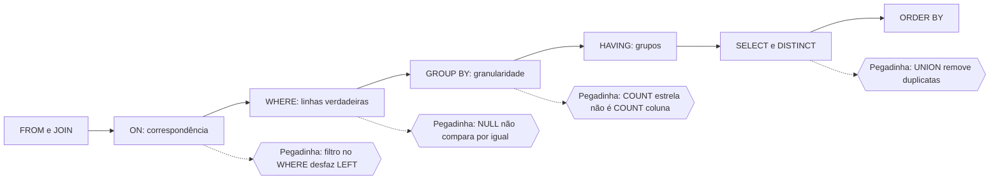
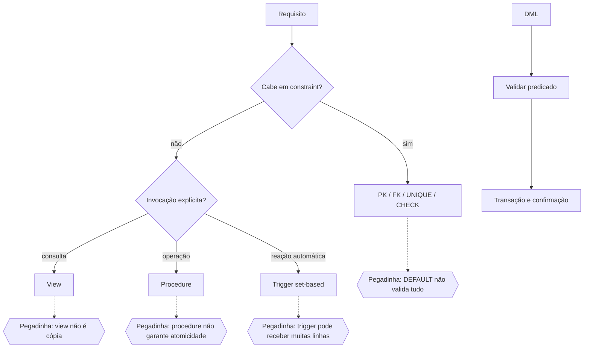

<a id="s3-d3-inicio"></a>
# Dia 3 - SQL ANSI: consulta, junções, agrupamento e subconsultas

## Abertura e objetivos

Ao final do dia, você deverá:

- prever o resultado de uma consulta sem executá-la;
- separar a ordem escrita da ordem lógica de processamento;
- tratar `NULL` pela lógica de três valores;
- escolher `INNER`, `LEFT`, `RIGHT`, `FULL` ou `CROSS JOIN` conforme o conjunto que precisa ser preservado;
- distinguir filtro em `ON`, `WHERE` e `HAVING`;
- agregar sem misturar granularidades;
- usar `EXISTS`, `IN`, subconsulta correlacionada e operações de conjunto com segurança;
- escrever SQL legível e suficientemente portável para o recorte ANSI do edital.

## Jornada executável e ponto de parada

### Sessão A - 170 minutos

- **Bloco 1 (55 min):** esquema de treino, `SELECT`, `FROM`, `WHERE`, projeção, expressões, `DISTINCT`, ordenação e `NULL`.
- **Bloco 2 (55 min):** junções, agregações, `GROUP BY`, `HAVING`, subconsultas e conjuntos.
- **Bloco 3 (60 min):** rastreamento manual de resultados e quatro consultas aplicadas ao CRA-PR.

**Ponto de parada:** entregar uma folha com a tabela intermediária produzida por `FROM/JOIN`, as linhas eliminadas por `WHERE`, os grupos formados e o resultado final de ao menos duas consultas. Não use tentativa e erro no SGBD antes de prever o resultado.

### Sessão B - 170 minutos

- **Bloco 4 (35 min):** D+2 do Dia 1, D+7 do Dia 3 da Semana 2, Legislação CRA/CFA e RLM.
- **Bloco 5 (40 min):** Português e desenvolvimento argumentativo do Dia 3.
- **Bloco 6 (25 min):** recuperação ativa de modelo, junções, `NULL` e grupos.
- **Essenciais (30 min):** S3D3Q101-S3D3Q106; teto S3D3Q110.
- **Correção A-D (25 min)** e **fechamento (15 min)**.

<a id="s3-d3-b1"></a>
## Bloco 1 - Consulta e filtragem

<a id="s3-d3-esquema-treino"></a>
### 1. Esquema e dados de treino

As consultas do dia usam este recorte deliberadamente pequeno:

```text
UNIDADE(id, nome)
PROFISSIONAL(id, nome, uf, unidade_id -> UNIDADE.id, ativo)
PAGAMENTO(id, profissional_id -> PROFISSIONAL.id, competencia, valor, status)
```

| UNIDADE.id | nome |
|---:|---|
| 10 | Fiscalização |
| 20 | Registro |
| 30 | Tecnologia |

| PROFISSIONAL.id | nome | uf | unidade_id | ativo |
|---:|---|:---:|---:|:---:|
| 1 | Ana | PR | 10 | S |
| 2 | Bruno | PR | 10 | S |
| 3 | Carla | SC | 20 | N |
| 4 | Davi | PR | `NULL` | S |

| PAGAMENTO.id | profissional_id | competência | valor | status |
|---:|---:|:---:|---:|---|
| 101 | 1 | 2026-07 | 120 | PAGO |
| 102 | 1 | 2026-08 | 120 | ABERTO |
| 103 | 2 | 2026-07 | 200 | PAGO |
| 104 | 3 | 2026-07 | 150 | PAGO |

Os valores formam um modelo didático; não representam cadastro real. Sempre identifique a granularidade: uma linha de `PROFISSIONAL` representa um profissional, enquanto uma linha de `PAGAMENTO` representa uma ocorrência de pagamento.

<a id="s3-d3-select-filtros-null"></a>
<a id="s3-d3-select-ordem"></a>
### 2. `SELECT`, ordem escrita e ordem lógica

Forma escrita frequente:

```sql
SELECT u.nome, COUNT(*) AS quantidade
FROM unidade AS u
JOIN profissional AS p ON p.unidade_id = u.id
WHERE p.ativo = 'S'
GROUP BY u.nome
HAVING COUNT(*) >= 2
ORDER BY quantidade DESC;
```

Modelo mental útil da ordem lógica:

1. `FROM` e `JOIN` constroem a tabela de entrada;
2. `ON` decide correspondências da junção;
3. `WHERE` elimina linhas;
4. `GROUP BY` forma grupos;
5. `HAVING` elimina grupos;
6. `SELECT` calcula as colunas de saída;
7. `DISTINCT` elimina duplicatas projetadas;
8. `ORDER BY` ordena a saída;
9. limitação de linhas, quando usada, atua conforme a sintaxe do produto.

Essa ordem explica por que um alias criado na lista `SELECT` normalmente não pode ser usado no `WHERE` do mesmo nível: o filtro lógico ocorre antes da projeção.

<a id="s3-d3-projecao-distinct-order"></a>
<a id="s3-d3-selecao-projecao"></a>
### 3. Projeção, expressão, alias, `DISTINCT` e `ORDER BY`

- projetar é escolher ou calcular colunas;
- na terminologia didática da álgebra relacional, **seleção** filtra linhas e **projeção** escolhe ou calcula colunas; apesar do nome da cláusula SQL, `SELECT` realiza a projeção;
- `AS` dá nome à expressão de saída, sem renomear a coluna armazenada;
- `DISTINCT` considera a combinação completa das expressões projetadas;
- `ORDER BY` é o mecanismo que garante a ordem solicitada; ordem física aparente não constitui contrato.

```sql
SELECT DISTINCT p.uf
FROM profissional AS p
WHERE p.ativo = 'S'
ORDER BY p.uf;
```

Resultado: `PR`. Carla é de SC, mas não satisfaz `ativo = 'S'`; as três ocorrências de PR na tabela filtrada tornam-se uma pela projeção distinta.

<a id="s3-d3-where-null"></a>
### 4. `WHERE`, predicados e lógica de três valores

`WHERE` conserva somente linhas cujo predicado resulta em verdadeiro. Falso e desconhecido são eliminados. Como `NULL` representa ausência ou desconhecimento, comparações ordinárias com ele não resultam em verdadeiro:

```sql
-- correto para localizar ausência
SELECT nome FROM profissional WHERE unidade_id IS NULL;

-- não localiza a ausência
SELECT nome FROM profissional WHERE unidade_id = NULL;
```

Predicados importantes:

- `BETWEEN a AND b` inclui os limites;
- `IN` compara com um conjunto de valores;
- `LIKE` trata padrões de texto, e os curingas dependem da sintaxe documentada;
- `IS NULL` e `IS NOT NULL` testam ausência;
- `AND`, `OR` e `NOT` exigem atenção a precedência e parênteses.

<a id="s3-d3-exemplos-b1"></a>
### Exemplos resolvidos do Bloco 1

#### Exemplo 1 - ordem lógica e alias

**Situação:** deseja-se listar UFs com pelo menos dois profissionais ativos.

**Dados relevantes:** após `WHERE ativo = 'S'`, permanecem Ana, Bruno e Davi, todos do PR.

**Raciocínio:** `FROM` lê profissionais; `WHERE` elimina Carla; `GROUP BY uf` forma um grupo PR com três linhas; `HAVING COUNT(*) >= 2` conserva o grupo; `SELECT` produz `PR, 3`.

```sql
SELECT uf, COUNT(*) AS total
FROM profissional
WHERE ativo = 'S'
GROUP BY uf
HAVING COUNT(*) >= 2;
```

**Resposta:** uma linha, `PR | 3`.

**Por que funciona:** o filtro de linha antecede a contagem e o filtro de grupo.

**Erro provável:** usar `WHERE COUNT(*) >= 2`, embora agregados pertençam ao filtro de grupos.

#### Exemplo 2 - `NULL` e exclusão silenciosa

**Situação:** alguém usa `WHERE unidade_id <> 10` esperando obter Carla e Davi.

**Dados relevantes:** Carla tem 20; Davi possui `NULL`.

**Raciocínio:** `20 <> 10` é verdadeiro; `NULL <> 10` é desconhecido; `WHERE` remove o desconhecido.

**Resposta:** apenas Carla aparece. Para incluir ausência, use `WHERE unidade_id <> 10 OR unidade_id IS NULL`.

**Por que funciona:** `NULL` não é um valor comum comparável por igualdade ou diferença.

**Erro provável:** tratar desconhecido como diferente de qualquer número.

<a id="s3-d3-b2"></a>
## Bloco 2 - Junções, grupos, subconsultas e conjuntos

<a id="s3-d3-joins"></a>
### 5. Tipos de junção

| Junção | Conjunto preservado |
|---|---|
| `INNER JOIN` | somente pares que satisfazem `ON` |
| `LEFT JOIN` | todas as linhas da esquerda; ausência à direita vira `NULL` |
| `RIGHT JOIN` | todas as linhas da direita |
| `FULL JOIN` | linhas de ambos os lados, correspondentes ou não |
| `CROSS JOIN` | produto cartesiano |
| self-join | duas referências lógicas à mesma relação |

Em uma junção externa, a posição do filtro pode mudar o resultado:

```sql
-- preserva todo profissional; apenas pagamentos PAGO casam
SELECT p.nome, pg.valor
FROM profissional AS p
LEFT JOIN pagamento AS pg
  ON pg.profissional_id = p.id
 AND pg.status = 'PAGO';

-- o WHERE remove as linhas sem pagamento e o efeito se aproxima de INNER JOIN
SELECT p.nome, pg.valor
FROM profissional AS p
LEFT JOIN pagamento AS pg
  ON pg.profissional_id = p.id
WHERE pg.status = 'PAGO';
```

`NATURAL JOIN` infere colunas de junção por nomes iguais e pode mudar de significado quando o esquema evolui. Em prova e em código crítico, condição explícita é mais segura.

<a id="s3-d3-agregacao"></a>
<a id="s3-d3-agrupamento-having"></a>
### 6. Agregação, `GROUP BY` e `HAVING`

- `COUNT(*)` conta linhas;
- `COUNT(expressão)` conta resultados não nulos;
- `SUM` e `AVG` ignoram nulos na expressão, mas não inventam zero;
- `MIN` e `MAX` procuram extremos;
- coluna não agregada da lista de seleção deve ser compatível com a granularidade do agrupamento.

`WHERE` filtra linhas antes do grupo; `HAVING` filtra grupos depois da agregação. Usar `HAVING` para todo filtro de linha pode produzir resultado correto em alguns casos, porém prejudica clareza e pode impedir redução antecipada.

<a id="s3-d3-subconsultas"></a>
### 7. Subconsultas, `IN`, `EXISTS` e correlação

Uma subconsulta não correlacionada pode ser avaliada independentemente da linha externa. A correlacionada referencia a linha externa e expressa perguntas como “existe pagamento deste profissional?”.

```sql
SELECT p.nome
FROM profissional AS p
WHERE EXISTS (
  SELECT 1
  FROM pagamento AS pg
  WHERE pg.profissional_id = p.id
    AND pg.status = 'ABERTO'
);
```

Para antijunção, `NOT EXISTS` é robusto diante de nulos na subconsulta. `NOT IN (subconsulta)` pode produzir desconhecido para todas as comparações se o conjunto contiver `NULL`; só o use quando a nulidade estiver excluída ou compreendida.

<a id="s3-d3-conjuntos"></a>
### 8. `UNION`, `INTERSECT` e `EXCEPT`

As consultas combinadas precisam produzir o mesmo número de colunas e tipos compatíveis por posição.

- `UNION` elimina duplicatas;
- `UNION ALL` preserva todas as ocorrências;
- `INTERSECT` conserva linhas presentes nos dois resultados;
- `EXCEPT` conserva linhas do primeiro resultado ausentes no segundo.

Operações de conjunto com eliminação de duplicatas não equivalem ao tratamento de multiplicidades da álgebra relacional pura. Parênteses podem ser necessários para controlar a associação com `ORDER BY` ou limitação.

<a id="s3-d3-exemplos-b2"></a>
### Exemplos resolvidos do Bloco 2

#### Exemplo 3 - filtro em `ON` versus `WHERE`

**Situação:** o relatório deve listar os quatro profissionais e, quando existir, o valor de pagamento aberto.

**Dados relevantes:** apenas Ana possui pagamento `ABERTO`.

**Raciocínio:** `PROFISSIONAL` deve ser preservada; portanto, usa-se `LEFT JOIN`. A condição de status integra `ON`, para que a ausência de pagamento aberto não elimine a linha esquerda.

**Resposta:** Ana aparece com 120; Bruno, Carla e Davi aparecem com valor nulo.

**Por que funciona:** a condição restringe correspondências, não as linhas preservadas.

**Erro provável:** mover o status para `WHERE`, reduzindo o resultado apenas a Ana.

#### Exemplo 4 - `COUNT(*)` versus `COUNT(coluna)`

**Situação:** uma `LEFT JOIN` agrupa profissionais e pagamentos.

```sql
SELECT p.id, COUNT(*) AS linhas, COUNT(pg.id) AS pagamentos
FROM profissional AS p
LEFT JOIN pagamento AS pg ON pg.profissional_id = p.id
GROUP BY p.id;
```

**Raciocínio:** todo profissional gera ao menos uma linha da junção; para Davi, as colunas de pagamento são nulas. `COUNT(*)` conta essa linha; `COUNT(pg.id)` não conta o nulo.

**Resposta:** Davi produz `linhas = 1` e `pagamentos = 0`.

**Por que funciona:** as duas contagens avaliam objetos distintos.

**Erro provável:** interpretar a linha estendida com nulos como pagamento existente.

#### Exemplo 5 - `NOT EXISTS`

**Situação:** localizar profissionais sem qualquer pagamento.

**Raciocínio:** para cada profissional, a subconsulta procura linha correlata; a negação conserva somente a ausência.

```sql
SELECT p.nome
FROM profissional AS p
WHERE NOT EXISTS (
  SELECT 1 FROM pagamento AS pg
  WHERE pg.profissional_id = p.id
);
```

**Resposta:** Davi.

**Por que funciona:** existência independe das colunas projetadas dentro da subconsulta.

**Erro provável:** usar `NOT IN` sem controlar a possibilidade de `NULL`.

#### Exemplo 6 - conjunto com e sem duplicatas

**Situação:** uma consulta retorna `PR, PR, SC`; outra retorna `PR`.

**Raciocínio:** `UNION` trata a combinação como conjunto distinto; `UNION ALL` concatena ocorrências.

**Resposta:** `UNION` produz `PR, SC`; `UNION ALL` produz quatro linhas (`PR, PR, SC, PR`).

**Por que funciona:** `ALL` desativa a eliminação de duplicatas.

**Erro provável:** presumir que `UNION` e `UNION ALL` diferem apenas em desempenho.

#### Exemplo 7 - `WHERE` e `HAVING` na mesma consulta

**Situação:** listar profissionais cujo total de pagamentos já realizados seja de, no mínimo, 200.

**Dados relevantes:** Ana possui dois pagamentos de 120, mas só um está `PAGO`; Bruno possui um pagamento pago de 200; Carla possui um de 150.

**Raciocínio:** o status restringe linhas antes de agrupá-las; o limite de 200 avalia o agregado depois de formar cada grupo.

```sql
SELECT profissional_id, SUM(valor) AS total_pago
FROM pagamento
WHERE status = 'PAGO'
GROUP BY profissional_id
HAVING SUM(valor) >= 200;
```

**Resposta:** somente Bruno, com total 200.

**Por que funciona:** `WHERE` testa cada pagamento; `HAVING` testa o total do profissional.

**Erro provável:** colocar `SUM(valor) >= 200` no `WHERE` ou contar também o pagamento aberto de Ana.

#### Exemplo 8 - máximo correlacionado com empate

**Situação:** recuperar todos os pagamentos que tenham o maior valor de seu respectivo profissional.

**Dados relevantes:** Ana possui dois pagamentos de mesmo valor; Bruno e Carla possuem um cada.

**Raciocínio:** a subconsulta precisa ser correlacionada pela chave do profissional. Igualdade com o máximo conserva empates.

```sql
SELECT pg.id, pg.profissional_id, pg.valor
FROM pagamento AS pg
WHERE pg.valor = (
  SELECT MAX(pg2.valor)
  FROM pagamento AS pg2
  WHERE pg2.profissional_id = pg.profissional_id
);
```

**Resposta:** aparecem os dois pagamentos de Ana e os pagamentos únicos de Bruno e Carla.

**Por que funciona:** o máximo é recalculado para o grupo lógico da linha externa e não escolhe arbitrariamente uma linha empatada.

**Erro provável:** retirar a correlação e comparar todos os pagamentos apenas com o máximo global.

#### Exemplo 9 - armadilha de `NOT IN` com nulo

**Situação:** uma lista auxiliar de profissionais bloqueados contém os valores `1`, `3` e `NULL`; deseja-se localizar profissionais não bloqueados.

**Raciocínio:** `id NOT IN (1, 3, NULL)` equivale a várias desigualdades ligadas por `AND`. Para os demais IDs, a comparação com `NULL` é desconhecida, e o `WHERE` não a aceita como verdadeira.

**Resposta:** essa forma pode devolver nenhuma linha; a solução robusta é `NOT EXISTS` com correlação por chave não nula, ou eliminar o nulo da subconsulta quando isso respeitar o requisito.

**Por que funciona:** a lógica de três valores participa do predicado inteiro.

**Erro provável:** tratar `NULL` como um valor da lista que simplesmente não coincide com os demais.

#### Exemplo 10 - compatibilidade em operação de conjunto

**Situação:** combinar uma consulta que devolve `(id, nome)` com outra que devolve `(nome)`.

**Raciocínio:** ramos de `UNION`, `INTERSECT` ou `EXCEPT` precisam ter a mesma quantidade de colunas e tipos compatíveis por posição. O nome das colunas não corrige aridade diferente.

**Resposta:** a combinação proposta é inválida; deve-se projetar duas colunas compatíveis nos dois ramos, com o mesmo significado por posição.

**Por que funciona:** a operação combina tuplas de um mesmo formato lógico.

**Erro provável:** acreditar que o SGBD alinha colunas pelo nome ou preenche automaticamente a coluna ausente.

#### Exemplo 11 - granularidade do agrupamento

**Situação:** a consulta pede uma linha por UF e situação de atividade, com a respectiva contagem.

**Raciocínio:** `uf` e `ativo` definem conjuntamente a granularidade. No SQL portável, ambas as colunas não agregadas devem participar de `GROUP BY`.

```sql
SELECT uf, ativo, COUNT(*) AS quantidade
FROM profissional
GROUP BY uf, ativo;
```

**Resposta:** cada combinação existente de UF e atividade forma um grupo separado.

**Por que funciona:** toda coluna projetada representa o grupo ou resulta de agregação.

**Erro provável:** agrupar apenas por `uf` e ainda projetar `ativo`, obtendo erro ou resultado dependente de configuração do produto.

#### Exemplo 12 - ordenação total e paginação estável

**Situação:** pagamentos são paginados por `valor DESC`, mas vários possuem o mesmo valor; entre execuções, linhas empatadas mudam de página.

**Raciocínio:** `ORDER BY valor DESC` não estabelece ordem entre empates. Acrescentar chave única completa a ordenação.

**Resposta:** usar, por exemplo, `ORDER BY valor DESC, id ASC` antes da limitação ou paginação.

**Por que funciona:** a chave única transforma a ordenação parcial em total para aquele conjunto.

**Erro provável:** atribuir ao SGBD uma ordem implícita e estável de inserção.

<a id="s3-d3-b3"></a>
## Bloco 3 - Prática guiada e produto

<a id="s3-d3-pratica"></a>
### Roteiro de rastreamento manual

Para cada consulta:

1. escreva a granularidade esperada da saída;
2. materialize em papel o resultado de `FROM/JOIN`;
3. risque linhas eliminadas pelo `WHERE`;
4. forme os grupos e calcule agregados;
5. aplique `HAVING`;
6. projete, elimine duplicatas e ordene;
7. só depois execute no SGBD para conferir.

**Produto obrigatório:** escrever e prever o resultado de quatro consultas: profissionais ativos; profissionais sem unidade; total pago por profissional preservando quem não pagou; unidades sem profissional ativo. Registre uma versão errada de cada consulta e explique o efeito.

### Diferenças que a banca pode explorar

| Par | Distinção decisiva |
|---|---|
| `ON` x `WHERE` em outer join | correspondência antes da preservação x filtro posterior |
| `WHERE` x `HAVING` | linha x grupo |
| `COUNT(*)` x `COUNT(coluna)` | linhas x valores não nulos |
| `UNION` x `UNION ALL` | remove x preserva duplicatas |
| `IN` x `EXISTS` | pertencimento x existência; nulidade e correlação importam |
| `NULL` x zero/vazio | ausência/desconhecido x valores existentes |

<a id="s3-d3-b4"></a>
## Bloco 4 - Revisão programada: D+2, D+7, Legislação e RLM

### Precedência da fila

1. concluir até quatro Essenciais ainda abertas do Dia 1 desta semana;
2. reabrir a fila D+7 do Dia 3 da Semana 2, incluindo Extras 3.1-3.5 conforme a jornada anterior;
3. preservar recuperação curta de Legislação e RLM.

<a id="s3-d3-b4-legislacao"></a>
### Legislação CRA/CFA - base das Extras 3.1-3.10

- a Lei nº 4.769/1965 disciplina a profissão e cria o Sistema CFA/CRAs;
- o Decreto nº 61.934/1967 regulamenta a execução da lei, sem poder afastá-la;
- o CFA exerce orientação normativa e supervisão em âmbito nacional;
- o CRA-PR registra, orienta e fiscaliza dentro de sua jurisdição e competências;
- o Regimento Interno organiza órgãos, competências e funcionamento do CRA-PR;
- o Código de Ética previsto no recorte vigente define deveres, direitos e infrações para os sujeitos que alcança;
- autonomia técnica, administrativa e financeira do CRA-PR não o transforma em associação privada nem elimina sua integração ao sistema.

**Aplicação:** antes de escolher a alternativa, classifique a fonte, o âmbito, o sujeito e a competência. Resolução não revoga lei; órgão regional não assume orientação normativa nacional só porque o fato ocorre no Paraná.

<a id="s3-d3-b4-rlm"></a>
### RLM - base das Extras 3.11-3.15

- negar `p e q` produz `não p ou não q`;
- negar `p ou q` produz `não p e não q`;
- negar `se p, então q` produz `p e não q`;
- negar “todos possuem” produz “existe ao menos um que não possui”;
- negar “nenhum possui” produz “existe ao menos um que possui”.

**Exemplo:** negar “todo profissional ativo possui pagamento” não afirma que ninguém possui; basta existir um ativo sem pagamento.

<a id="s3-d3-b5"></a>
## Bloco 5 - Português e progressão discursiva

<a id="s3-d3-b5-portugues"></a>
### Relação lógica e força da evidência - base das Extras 3.16-3.20

- `porque` e `uma vez que` introduzem causa ou explicação;
- `por isso` e `de modo que` marcam consequência;
- `embora` introduz concessão, não causa;
- `contudo` contrapõe argumentos sem apagar o primeiro;
- correlação não prova causalidade: duas medidas crescerem juntas não basta para afirmar que uma causou a outra;
- pronome ou expressão resumidora deve possuir referente inequívoco.

No [Dia 3 da progressão discursiva](semana_03_dissertacoes.md#s3-disc-d3), escreva o segundo desenvolvimento e um contraponto real. A ressalva deve limitar a tese, não contradizê-la por acidente.

<a id="s3-d3-b6"></a>
## Bloco 6 - Recuperação ativa e caderno de erros

Sem consulta:

- escreva a ordem lógica da consulta;
- explique `NULL` em uma frase e dê um predicado correto;
- desenhe os conjuntos preservados por `INNER`, `LEFT` e `FULL JOIN`;
- diferencie `WHERE` e `HAVING`;
- preveja `COUNT(*)` e `COUNT(coluna)` após outer join;
- escreva uma antijunção com `NOT EXISTS`.

**Entrega:** registre no caderno ao menos um erro como `granularidade -> etapa lógica ignorada -> resultado incorreto -> consulta corrigida`. Nenhum conceito novo entra neste bloco.

<a id="s3-d3-mini-revisao"></a>
## Mini revisão e perguntas de fixação

- `FROM/JOIN` constrói; `WHERE` filtra linhas; `GROUP BY` forma; `HAVING` filtra grupos; `SELECT` projeta.
- outer join preserva um lado; filtro posterior pode desfazer a preservação.
- nulo não é zero, vazio nem igualdade consigo mesmo por comparação ordinária.
- agregações trabalham na granularidade definida pelos grupos.

1. Onde deve ficar o filtro de uma linha opcional quando a linha esquerda precisa ser preservada?
2. Por que `COUNT(pg.id)` pode ser zero quando `COUNT(*)` é um?
3. Qual construção procura ausência sem sofrer a armadilha de nulo em `NOT IN`?
4. `HAVING` atua antes ou depois da formação dos grupos?
5. O que `UNION ALL` preserva que `UNION` remove?

**Respostas:** 1. Em `ON` da outer join, quando ele restringe apenas a correspondência opcional. 2. A linha externa existe, mas `pg.id` está nulo. 3. `NOT EXISTS`. 4. Depois. 5. Duplicatas/multiplicidades.

<a id="s3-d3-mapa"></a>
## Mapa de conexões do Dia 3



<a id="s3-d3-checklist"></a>
## Checklist de domínio

- [ ] prevejo a ordem lógica sem confundi-la com a escrita;
- [ ] uso `IS NULL` e raciocino com desconhecido;
- [ ] escolho o conjunto preservado pela junção;
- [ ] posiciono corretamente filtros em `ON`, `WHERE` e `HAVING`;
- [ ] diferencio contagens e granularidades;
- [ ] escrevo `EXISTS` e `NOT EXISTS` correlacionados;
- [ ] diferencio operações de conjunto com e sem duplicatas;
- [ ] explico cada resultado sem depender de execução por tentativa.

<a id="s3-d3-fila"></a>
## Fila ordenada de dez Essenciais e fechamento

| Ordem | ID | Título real e retorno | Momento |
|---:|---|---|---|
| 1 | S3D3Q101 | Ordem lógica de uma consulta — [teoria](#s3-d3-select-ordem) | D0 |
| 2 | S3D3Q102 | Resultado de `DISTINCT` após filtro — [teoria](#s3-d3-projecao-distinct-order) | D0 |
| 3 | S3D3Q103 | Teste correto de ausência — [teoria](#s3-d3-where-null) | D0 |
| 4 | S3D3Q104 | Limites de `BETWEEN` — [teoria](#s3-d3-where-null) | D0 |
| 5 | S3D3Q105 | Alias da projeção no `WHERE` — [teoria](#s3-d3-select-ordem) | D0 |
| 6 | S3D3Q106 | Diferença e ausência no mesmo filtro — [teoria](#s3-d3-where-null) | D0 |
| 7 | S3D3Q107 | Precedência entre `AND` e `OR` — [teoria](#s3-d3-where-null) | D+2 |
| 8 | S3D3Q108 | Contagem de pagamentos pagos — [dados](#s3-d3-esquema-treino) | D+2 |
| 9 | S3D3Q109 | Cardinalidade de `INNER JOIN` — [teoria](#s3-d3-joins) | D+2 |
| 10 | S3D3Q110 | `LEFT JOIN` e contagem de detalhes — [teoria](#s3-d3-agregacao) | D+2 |

Resolva S3D3Q101-S3D3Q106 e avance até S3D3Q110 apenas com correção A-D. Marque confiança, escreva o resultado esperado das questões com SQL e agende saldo D+2 para 31/07, D+7 para 05/08 e D+21 para 19/08.

## Fontes primárias do Dia 3

- PostgreSQL 18, [Table Expressions](https://www.postgresql.org/docs/current/queries-table-expressions.html), especialmente junções, `WHERE`, `GROUP BY` e `HAVING`;
- PostgreSQL 18, [Aggregate Functions](https://www.postgresql.org/docs/current/functions-aggregate.html);
- PostgreSQL 18, [Combining Queries](https://www.postgresql.org/docs/current/queries-union.html);
- edital consolidado local, página 28, item 6.13.

---

<a id="s3-d4-inicio"></a>
# Dia 4 - DDL, DML, Transact-SQL, views, procedures e triggers

## Abertura e objetivos

Ao final do dia, você deverá:

- classificar comandos de definição, manipulação, controle e transação pela finalidade;
- criar tabelas com restrições declarativas coerentes;
- prever o alcance de `INSERT`, `UPDATE` e `DELETE` antes de executar;
- reconhecer elementos básicos do Transact-SQL sem tratá-los como SQL universal;
- explicar o que uma view abstrai e o que ela não garante;
- distinguir stored procedure, função e trigger;
- escrever trigger de SQL Server que trate conjuntos, não apenas uma linha;
- escolher entre restrição, view, procedure e trigger conforme o requisito.

## Jornada executável e ponto de parada

### Sessão A - 170 minutos

- **Bloco 1 (55 min):** DDL, DML e restrições.
- **Bloco 2 (55 min):** Transact-SQL, views, procedures e triggers.
- **Bloco 3 (60 min):** esquema executável, análise de efeitos e auditoria de lote.

**Ponto de parada:** entregar um script com `CREATE TABLE`, uma view, uma procedure parametrizada e uma trigger segura para comando que afete várias linhas. Para cada objeto, escrever o requisito atendido e uma limitação.

### Sessão B - 170 minutos

- **Bloco 4 (35 min):** D+2 do Dia 2, D+7 do Dia 4 da Semana 2 e Administração Pública.
- **Bloco 5 (40 min):** Português, introdução e conclusão.
- **Bloco 6 (25 min):** recuperação de classes de comando e escolha de objeto.
- **Essenciais (30 min):** S3D4Q151-S3D4Q156; teto S3D4Q160.
- **Correção A-D (25 min)** e **fechamento (15 min)**.

<a id="s3-d4-b1"></a>
<a id="s3-d4-ddl-dml"></a>
## Bloco 1 - Definição, manipulação e integridade declarativa

<a id="s3-d4-classes-comando"></a>
### 1. Classes por finalidade

| Classe didática | Finalidade | Exemplos frequentes |
|---|---|---|
| DDL | definir estruturas e objetos | `CREATE`, `ALTER`, `DROP` |
| DML | consultar ou modificar dados | `SELECT`, `INSERT`, `UPDATE`, `DELETE` |
| DCL | administrar privilégios | `GRANT`, `REVOKE` |
| TCL | controlar transações | `COMMIT`, `ROLLBACK`, `SAVEPOINT` ou equivalente |

As siglas ajudam a classificar, mas a implementação pode tratar alguns comandos de maneira própria. `TRUNCATE` remove todas as linhas de uma tabela sem predicado e não é sinônimo de `DELETE`: logging, triggers, identidade, bloqueios e transacionalidade podem variar por SGBD. Em questão sem produto definido, não atribua automaticamente um efeito específico de fornecedor.

<a id="s3-d4-ddl-restricoes"></a>
### 2. `CREATE TABLE` e restrições

```sql
CREATE TABLE unidade (
  id        INTEGER      NOT NULL,
  nome      VARCHAR(100) NOT NULL,
  CONSTRAINT pk_unidade PRIMARY KEY (id),
  CONSTRAINT uq_unidade_nome UNIQUE (nome)
);

CREATE TABLE profissional (
  id          INTEGER      NOT NULL,
  nome        VARCHAR(120) NOT NULL,
  uf          CHAR(2)      NOT NULL,
  unidade_id  INTEGER      NULL,
  ativo       CHAR(1)      NOT NULL DEFAULT 'S',
  CONSTRAINT pk_profissional PRIMARY KEY (id),
  CONSTRAINT ck_profissional_uf CHECK (uf IN ('PR','SC','RS')),
  CONSTRAINT ck_profissional_ativo CHECK (ativo IN ('S','N')),
  CONSTRAINT fk_profissional_unidade
    FOREIGN KEY (unidade_id) REFERENCES unidade(id)
);
```

- `PRIMARY KEY` identifica cada linha, implica unicidade e não nulidade;
- `UNIQUE` define outra regra de unicidade, cujo tratamento de nulos pode variar;
- `FOREIGN KEY` exige valor correspondente ou nulo quando a coluna o admite;
- `CHECK` limita valores pela expressão avaliada;
- `DEFAULT` fornece valor quando o comando não o informa, sem corrigir valor explicitamente inválido;
- `NOT NULL` impede ausência na coluna.

Nomear constraints facilita diagnóstico e manutenção. Integridade declarativa deve ser preferida quando o requisito cabe em uma restrição: ela atua independentemente de qual aplicação escreve.

<a id="s3-d4-alter-drop-truncate"></a>
### 3. Evolução e remoção de estrutura

`ALTER TABLE` modifica definição existente, mas a alteração precisa respeitar os dados atuais. Tornar uma coluna `NOT NULL` falha ou exige saneamento quando já existem nulos. `DROP` remove o objeto; dependências podem impedir a operação ou ser removidas conforme opção explícita do produto. Mudança estrutural exige avaliação de dependências, janela, reversão e compatibilidade.

<a id="s3-d4-dml"></a>
### 4. `INSERT`, `UPDATE` e `DELETE`

```sql
INSERT INTO unidade (id, nome)
VALUES (40, 'Atendimento');

UPDATE profissional
SET ativo = 'N'
WHERE id = 2;

DELETE FROM pagamento
WHERE status = 'CANCELADO'
  AND competencia < '2025-01';
```

Antes de `UPDATE` ou `DELETE`, execute ou raciocine sobre um `SELECT` com o mesmo predicado e confira quantidade, chave e escopo. Omitir `WHERE` afeta todas as linhas alcançadas pelo comando; transação reduz risco apenas se houver validação e possibilidade efetiva de rollback.

<a id="s3-d4-exemplos-b1"></a>
### Exemplos resolvidos do Bloco 1

#### Exemplo 1 - restrição correta para o requisito

**Situação:** cada unidade precisa ter nome, e dois registros não podem usar o mesmo nome.

**Dados relevantes:** é uma propriedade permanente da tabela, não uma ação eventual.

**Raciocínio:** `NOT NULL` impede ausência; `UNIQUE` impede duplicação conforme a semântica do produto.

**Resposta:** declarar ambas as constraints na coluna ou na tabela.

**Por que funciona:** o SGBD verifica toda escrita, qualquer que seja a aplicação.

**Erro provável:** implementar a regra apenas em uma tela ou trigger sem necessidade.

#### Exemplo 2 - migração para `NOT NULL`

**Situação:** `unidade_id` possui nulos e será obrigatória.

**Dados relevantes:** a nova regra é incompatível com linhas antigas.

**Raciocínio:** localizar nulos; decidir valor válido ou rejeição; corrigir dados; validar referência; só então alterar a coluna; manter plano de reversão.

**Resposta:** não aplicar a constraint cegamente antes do saneamento.

**Por que funciona:** definição e estado dos dados precisam ser compatíveis.

**Erro provável:** presumir que `ALTER` preenche automaticamente valores ausentes.

#### Exemplo 3 - alcance de `UPDATE`

**Situação:** desativar somente profissionais sem unidade.

**Raciocínio:** o predicado correto é `unidade_id IS NULL`; `= NULL` não seleciona as linhas; ausência de `WHERE` desativa todos.

**Resposta:** `UPDATE profissional SET ativo='N' WHERE unidade_id IS NULL;`.

**Por que funciona:** usa o predicado próprio para nulo e limita o conjunto.

**Erro provável:** testar igualdade com `NULL`.

<a id="s3-d4-b2"></a>
## Bloco 2 - Transact-SQL e objetos programáveis

<a id="s3-d4-transact-sql"></a>
<a id="s3-d4-tsql"></a>
### 5. Transact-SQL

Transact-SQL (T-SQL) é o dialeto do ecossistema SQL Server. Ele inclui SQL relacional e extensões procedurais/administrativas. Exemplos reconhecíveis:

```sql
DECLARE @uf char(2) = 'PR';

SELECT TOP (10) p.id, p.nome
FROM dbo.profissional AS p
WHERE p.uf = @uf
ORDER BY p.nome;
```

`dbo` é um esquema comum do SQL Server; `@` identifica variável local; `TOP` limita a saída segundo a ordenação declarada. `GO` é reconhecido por utilitários clientes para separar lotes, não é uma instrução T-SQL enviada ao mecanismo como `SELECT`.

<a id="s3-d4-go-lotes-escopo"></a>
Em clientes que reconhecem `GO`, como SSMS e `sqlcmd`, o separador encerra o lote. Por isso, uma variável local T-SQL declarada em um lote não fica disponível no seguinte. `GO` não equivale a `COMMIT`: a transação e o lote são conceitos distintos, e o comportamento deve ser atribuído à ferramenta que interpreta o separador.

Não transforme sintaxe T-SQL em regra ANSI: PostgreSQL e MySQL aceitam `LIMIT` em seus dialetos, sem que a construção seja exclusiva de um deles; o SQL padrão possui construções próprias como `FETCH FIRST`, conforme suporte do produto.

<a id="s3-d4-views"></a>
### 6. Views

Uma view comum armazena a definição de uma consulta e apresenta uma relação virtual. Ela pode:

- esconder complexidade de junções;
- oferecer interface estável durante evolução controlada;
- restringir colunas e linhas como parte de uma política de acesso;
- padronizar uma consulta recorrente.

Ela não garante, por si só, materialização, índice, melhor desempenho, anonimização irreversível nem segurança se o usuário também possui acesso direto às tabelas. Atualização por view depende da definição e do SGBD.

<a id="s3-d4-views-seguranca"></a>
Na análise de segurança, mapeie as colunas e linhas expostas, os privilégios diretos sobre a base, o contexto de propriedade ou execução quando pertinente e os caminhos alternativos — outras views, procedures, exportações e combinações de dados. Considere também inferências possíveis por agregações ou cruzamentos. Uma view, isoladamente, não anonimiza o conteúdo nem bloqueia esses caminhos.

```sql
CREATE VIEW dbo.v_profissional_ativo
AS
SELECT p.id, p.nome, p.uf, p.unidade_id
FROM dbo.profissional AS p
WHERE p.ativo = 'S';
```

<a id="s3-d4-procedures-triggers"></a>
<a id="s3-d4-procedures"></a>
### 7. Stored procedures

Procedure é módulo armazenado invocado explicitamente. Pode receber parâmetros, executar vários comandos, controlar fluxo e centralizar uma operação autorizada. Não substitui automaticamente transação nem validação; seu código precisa tratar erros e o contrato de atomicidade.

```sql
CREATE OR ALTER PROCEDURE dbo.DesativarProfissional
  @id int
AS
BEGIN
  SET NOCOUNT ON;

  UPDATE dbo.profissional
  SET ativo = 'N'
  WHERE id = @id;
END;
```

Função costuma ser usada como expressão e retorna valor ou tabela sob regras específicas; procedure é chamada como operação. Os limites exatos variam pelo produto.

<a id="s3-d4-triggers"></a>
### 8. Triggers

Trigger é executada automaticamente em resposta a evento definido. Pode reforçar regra que não cabe declarativamente, manter auditoria ou sincronizar efeito interno, mas aumenta acoplamento e efeitos implícitos.

Em trigger DML do SQL Server, `inserted` e `deleted` representam conjuntos lógicos de linhas afetadas. Um único `UPDATE` pode alterar muitas linhas; lógica que presume uma linha é defeituosa.

```sql
CREATE OR ALTER TRIGGER dbo.trg_profissional_auditoria
ON dbo.profissional
AFTER UPDATE
AS
BEGIN
  SET NOCOUNT ON;

  INSERT INTO dbo.auditoria_profissional
         (profissional_id, ativo_anterior, ativo_novo, alterado_em)
  SELECT d.id, d.ativo, i.ativo, SYSUTCDATETIME()
  FROM deleted AS d
  JOIN inserted AS i ON i.id = d.id
  WHERE d.ativo <> i.ativo;
END;
```

Uma constraint é melhor para domínio, unicidade ou referência simples. Trigger deve ter requisito claro, tratar conjuntos, evitar recursão indesejada e participar da mesma transação conforme a semântica do evento.

<a id="s3-d4-trigger-mysql8"></a>
#### Caixa de produto — trigger no MySQL 8.4

Antes de resolver questão dependente de produto, fixe estas regras documentadas:

- a declaração de trigger usa evento `INSERT`, `UPDATE` ou `DELETE`; um comando `REPLACE` pode acionar triggers de `INSERT` e, conforme o caminho, de `DELETE`, mas `REPLACE` não é um quarto evento na sintaxe `CREATE TRIGGER`;
- a trigger é disparada automaticamente pelo evento da tabela, linha a linha; `CALL` invoca stored procedure e não dispara uma trigger pelo nome;
- a ativação pode ocorrer `BEFORE` ou `AFTER` o evento declarado;
- triggers não podem ser associadas a tabela `TEMPORARY` nem a view no MySQL 8.4.

Ao ler uma assertiva da banca, separe “comando que pode provocar a ativação” de “evento aceito na declaração”. A fonte de controle é [Using Triggers — MySQL 8.4](https://dev.mysql.com/doc/refman/8.4/en/triggers.html).

<a id="s3-d4-exemplos-b2"></a>
### Exemplos resolvidos do Bloco 2

#### Exemplo 4 - view não é cópia automática

**Situação:** a view de ativos é consultada após Ana ser desativada na tabela base.

**Dados relevantes:** a view comum armazena a consulta, não uma fotografia independente.

**Raciocínio:** na consulta seguinte, a definição volta a filtrar `ativo = 'S'`.

**Resposta:** Ana deixa de aparecer, salvo mecanismo materializado explicitamente diferente.

**Por que funciona:** a view virtual reflete a base segundo sua definição.

**Erro provável:** afirmar que criar view duplica e congela linhas.

#### Exemplo 5 - procedure e atomicidade

**Situação:** procedure atualiza duas tabelas; a segunda alteração falha.

**Dados relevantes:** vários comandos não se tornam atomicamente indivisíveis só por estarem no mesmo módulo.

**Raciocínio:** definir transação e tratamento de erro compatíveis; em falha, reverter o conjunto.

**Resposta:** procedure precisa de contrato transacional explícito ou de garantia equivalente do ambiente.

**Por que funciona:** armazenamento do código e controle de atomicidade são dimensões diferentes.

**Erro provável:** confundir “armazenada” com “automaticamente transacional”.

#### Exemplo 6 - trigger multirregistro

**Situação:** `UPDATE profissional SET ativo='N' WHERE uf='PR'` altera três linhas.

**Dados relevantes:** `inserted` e `deleted` possuem três linhas cada.

**Raciocínio:** juntar os conjuntos pela chave e inserir uma auditoria por linha alterada.

**Resposta:** a trigger baseada em `SELECT ... FROM deleted JOIN inserted` produz três registros; variável escalar que lê uma linha perde dados.

**Por que funciona:** a unidade do evento é o comando, que pode afetar um conjunto.

**Erro provável:** programar trigger como se executasse uma vez por linha em SQL Server.

#### Exemplo 7 - constraint antes de trigger

**Situação:** o campo `percentual_desconto` deve permanecer entre 0 e 30 em qualquer caminho de escrita.

**Raciocínio:** a regra é declarativa, local à linha e não exige efeito colateral. Uma `CHECK (percentual_desconto BETWEEN 0 AND 30)` comunica e aplica diretamente o domínio.

**Resposta:** usar `CHECK`; uma trigger só acrescentaria execução implícita e maior superfície de erro.

**Por que funciona:** a restrição pertence ao esquema e vale para inserções e atualizações, conforme suporte do produto.

**Erro provável:** usar trigger para toda validação por considerá-la “mais poderosa”.

#### Exemplo 8 - exclusão referenciada

**Situação:** uma unidade ainda possui profissionais vinculados e a FK não declara ação em cascata.

**Raciocínio:** excluir a linha-pai deixaria chaves estrangeiras sem destino. A integridade referencial bloqueia a operação enquanto existirem filhos, salvo ação declarada diferente.

**Resposta:** a exclusão falha; deve-se tratar os vínculos ou adotar conscientemente uma ação como `ON DELETE CASCADE` ou `SET NULL`, se o modelo permitir.

**Por que funciona:** a FK protege a existência do valor referenciado.

**Erro provável:** presumir que toda FK apaga filhos automaticamente.

#### Exemplo 9 - prévia e atualização com o mesmo predicado

**Situação:** desativar profissionais de uma UF sem atingir linhas de outras unidades por engano.

**Raciocínio:** primeiro executar `SELECT id, nome ... WHERE ...`; revisar contagem e chaves; depois reutilizar exatamente o predicado no `UPDATE`, dentro do controle transacional cabível.

**Resposta:** a prévia não substitui a transação, mas reduz erro de alcance e cria evidência do conjunto pretendido.

**Por que funciona:** o risco principal do DML em conjunto está no predicado, não na palavra `UPDATE`.

**Erro provável:** testar um filtro e digitar outro, ou confiar que ausência de `WHERE` será advertida pelo SGBD.

#### Exemplo 10 - view e privilégio sobre a base

**Situação:** uma view omite CPF, mas o mesmo usuário conserva `SELECT` direto na tabela que contém CPF.

**Raciocínio:** a projeção da view reduz o que ela própria expõe; não revoga autorização já concedida sobre a tabela.

**Resposta:** a view, isoladamente, não protege o CPF. A política precisa controlar também os privilégios sobre os objetos-base e o contexto de execução.

**Por que funciona:** interface lógica e autorização são mecanismos relacionados, porém distintos.

**Erro provável:** declarar que toda view é automaticamente uma barreira de segurança.

#### Exemplo 11 - procedure com falha intermediária

**Situação:** uma procedure debita um saldo, registra o movimento e falha no segundo comando.

**Raciocínio:** no SQL Server, o módulo deve definir o limite transacional e tratar erro; um padrão possível envolve `BEGIN TRANSACTION`, `TRY/CATCH`, teste de `XACT_STATE()` e `ROLLBACK` quando necessário.

**Resposta:** sem esse contrato ou garantia equivalente do chamador, o simples encapsulamento em procedure não prova atomicidade dos dois comandos.

**Por que funciona:** procedure organiza invocação; transação define tudo ou nada.

**Erro provável:** confundir unidade de código com unidade de confirmação.

#### Exemplo 12 - trigger não é chamada como procedure

**Situação:** no MySQL 8, uma trigger foi associada a `BEFORE INSERT` de uma tabela. Um item afirma que o usuário deve executar `CALL nome_da_trigger` para dispará-la.

**Raciocínio:** a operação de dados compatível com o evento dispara a trigger automaticamente. `CALL` invoca stored procedure, não trigger.

**Resposta:** a afirmação é falsa; um `INSERT` abrangido pelo objeto é que aciona a trigger.

**Por que funciona:** acionamento implícito por evento diferencia trigger de procedure invocada explicitamente.

**Erro provável:** generalizar a sintaxe de chamada de procedure para qualquer objeto armazenado.

<a id="s3-d4-b3"></a>
## Bloco 3 - Escolha do mecanismo e prática guiada

<a id="s3-d4-escolha-objeto"></a>
### 9. Matriz de decisão

| Requisito | Primeiro candidato | Alerta |
|---|---|---|
| impedir valor fora de domínio | `CHECK`/FK/constraint | não esconder regra simples em trigger |
| oferecer consulta estável e limitada | view | revisar privilégios sobre a base |
| executar operação explícita com parâmetros | procedure | definir erros e transação |
| reagir automaticamente a evento de dados | trigger | tratar múltiplas linhas e efeitos implícitos |
| mudar estrutura | DDL controlada | dependências, dados e reversão |
| alterar conjunto de linhas | DML com predicado | validar alcance antes de confirmar |

### Produto obrigatório

1. crie `unidade` e `profissional` com constraints;
2. escreva uma consulta de prévia e um `UPDATE` com o mesmo predicado;
3. crie uma view de ativos sem expor dado desnecessário;
4. escreva procedure parametrizada;
5. escreva trigger de auditoria que trate zero, uma ou muitas linhas;
6. anote uma limitação e um teste negativo para cada objeto.

<a id="s3-d4-b4"></a>
## Bloco 4 - Revisão programada: D+2, D+7 e Administração Pública

### Precedência da fila

1. concluir até quatro Essenciais ainda abertas do Dia 2;
2. reabrir D+7 do Dia 4 da Semana 2 e Extras 4.1-4.5;
3. preservar a revisão administrativa abaixo.

<a id="s3-d4-b4-administracao"></a>
### Administração Pública - base das Extras 4.1-4.12

- legalidade vincula a Administração ao ordenamento; eficiência não autoriza afastar competência ou procedimento;
- impessoalidade veda promoção pessoal e exige finalidade pública;
- publicidade favorece transparência, mas convive com sigilo legal e proteção de dados;
- ato com vício de legalidade é objeto de anulação; ato válido que deixou de ser conveniente pode ser revogado, respeitados limites;
- convalidação alcança vício sanável quando a lei e o caso permitirem, sem lesão ao interesse público ou a terceiros;
- descentralização transfere execução ou titularidade conforme o instrumento; desconcentração distribui competências dentro da mesma pessoa jurídica;
- autarquia integra a Administração Indireta e possui personalidade de direito público;
- LAI parte da publicidade como regra, enquanto LGPD disciplina tratamento de dados; nenhuma delas elimina a outra;
- responsabilidade objetiva do Estado perante a vítima não torna automática a responsabilização regressiva do agente, que exige dolo ou culpa nos termos constitucionais.

**Caso:** publicar relatório estatístico pode ser compatível com transparência; divulgar dados pessoais individualizados sem base, necessidade ou proteção não se legitima apenas pelo princípio da publicidade.

<a id="s3-d4-b5"></a>
## Bloco 5 - Português, introdução e conclusão

<a id="s3-d4-b5-portugues"></a>
### Base das Extras 4.13-4.20

- vírgula não separa sujeito de verbo sem elemento intercalado que justifique o par de vírgulas;
- oração explicativa é isolada; restritiva delimita o referente sem vírgulas;
- crase depende de preposição `a` e artigo/demonstrativo compatível, não da simples presença de palavra feminina;
- `haver` com sentido de existir permanece impessoal no singular; `existir` concorda com o sujeito;
- reescrita correta preserva relação lógica, referente, tempo verbal e escopo de negação;
- conclusão retoma a tese e sintetiza os eixos sem abrir argumento novo.

No [Dia 4 da progressão discursiva](semana_03_dissertacoes.md#s3-disc-d4), reescreva introdução e conclusão. Faça o leitor reconhecer os mesmos dois eixos sem copiar literalmente a tese.

<a id="s3-d4-b6"></a>
## Bloco 6 - Recuperação ativa e caderno de erros

Sem consulta:

- classifique oito comandos em DDL/DML/DCL/TCL;
- explique cada constraint em uma frase;
- escreva a diferença entre view, procedure e trigger;
- desenhe `inserted`/`deleted` para um update de três linhas;
- escolha constraint ou trigger para quatro regras propostas;
- registre o alcance de um `UPDATE` antes do `COMMIT`.

**Entrega:** uma tabela `requisito -> objeto escolhido -> garantia -> limitação -> teste`. Não introduza sintaxe nova no Bloco 6.

<a id="s3-d4-mini-revisao"></a>
## Mini revisão e perguntas de fixação

- DDL define; DML lê/modifica; DCL autoriza; TCL encerra ou reverte unidade de trabalho.
- constraint declarativa é preferível para regra que ela expressa diretamente.
- view virtual não é sinônimo de cópia ou ganho de desempenho.
- procedure é chamada; trigger reage a evento.
- trigger SQL Server deve tratar conjuntos de linhas.

1. Qual constraint liga a coluna filha à chave candidata da tabela pai?
2. `DEFAULT` corrige valor inválido informado explicitamente?
3. Uma view comum materializa automaticamente o resultado?
4. Por que uma trigger com variável escalar pode falhar em atualização em lote?
5. `GO` é uma instrução T-SQL executada pelo mecanismo?

**Respostas:** 1. `FOREIGN KEY`. 2. Não. 3. Não. 4. Porque o evento pode fornecer várias linhas em `inserted/deleted`. 5. Não; é separador reconhecido por ferramentas cliente.

<a id="s3-d4-mapa"></a>
## Mapa de conexões do Dia 4



<a id="s3-d4-checklist"></a>
## Checklist de domínio

- [ ] classifico comandos pela finalidade;
- [ ] crio PK, FK, UNIQUE, CHECK, NOT NULL e DEFAULT coerentes;
- [ ] planejo migração antes de endurecer constraint;
- [ ] valido alcance de DML;
- [ ] reconheço T-SQL sem universalizar seu dialeto;
- [ ] explico capacidades e limites de views;
- [ ] diferencio procedure, função e trigger;
- [ ] escrevo trigger orientada a conjuntos;
- [ ] escolho o mecanismo mais simples que garante o requisito.

<a id="s3-d4-fila"></a>
## Fila ordenada de dez Essenciais e fechamento

| Ordem | ID | Título real e retorno | Momento |
|---:|---|---|---|
| 1 | S3D4Q151 | Finalidade de DDL — [teoria](#s3-d4-classes-comando) | D0 |
| 2 | S3D4Q152 | Operações de DML — [teoria](#s3-d4-classes-comando) | D0 |
| 3 | S3D4Q153 | Garantia da chave primária — [teoria](#s3-d4-ddl-restricoes) | D0 |
| 4 | S3D4Q154 | Chave estrangeira anulável — [teoria](#s3-d4-ddl-restricoes) | D0 |
| 5 | S3D4Q155 | `DEFAULT` e `CHECK` — [teoria](#s3-d4-ddl-restricoes) | D0 |
| 6 | S3D4Q156 | `UNIQUE` e nulidade — [teoria](#s3-d4-ddl-restricoes) | D0 |
| 7 | S3D4Q157 | Migração segura para `NOT NULL` — [teoria](#s3-d4-alter-drop-truncate) | D+2 |
| 8 | S3D4Q158 | Cautela com `TRUNCATE` — [teoria](#s3-d4-alter-drop-truncate) | D+2 |
| 9 | S3D4Q159 | `UPDATE` sem `WHERE` — [teoria](#s3-d4-dml) | D+2 |
| 10 | S3D4Q160 | Prévia com o mesmo predicado — [teoria](#s3-d4-dml) | D+2 |

Resolva S3D4Q151-S3D4Q156 e avance até S3D4Q160 apenas com correção A-D. Agende saldo D+2 para 01/08, D+7 para 06/08 e D+21 para 20/08.

## Fontes primárias do Dia 4

- Microsoft Learn, [CREATE TRIGGER (Transact-SQL)](https://learn.microsoft.com/en-us/sql/t-sql/statements/create-trigger-transact-sql?view=sql-server-ver17);
- Microsoft Learn, [CREATE VIEW (Transact-SQL)](https://learn.microsoft.com/en-us/sql/t-sql/statements/create-view-transact-sql?view=sql-server-ver17);
- Microsoft Learn, [CREATE PROCEDURE (Transact-SQL)](https://learn.microsoft.com/en-us/sql/t-sql/statements/create-procedure-transact-sql?view=sql-server-ver17);
- MySQL 8.4, [Using Triggers](https://dev.mysql.com/doc/refman/8.4/en/triggers.html), para a comparação explícita de acionamento automático e `CALL`;
- PostgreSQL 18, [Data Definition](https://www.postgresql.org/docs/current/ddl.html), como fonte primária comparativa de DDL e constraints;
- edital consolidado local, página 28, itens 6.13, 6.14 e 7.6-7.8.

---
