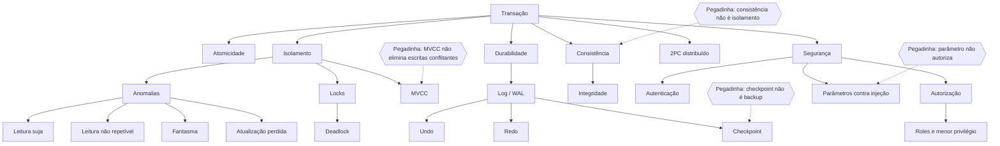
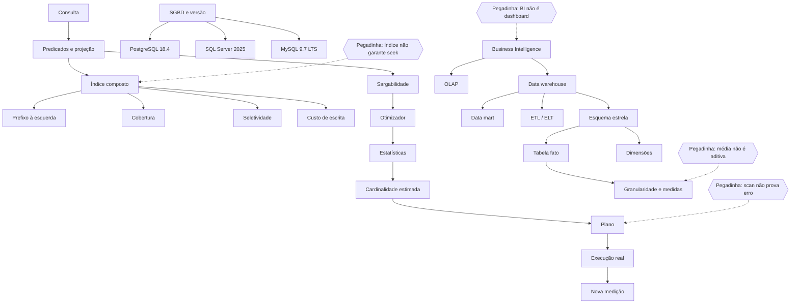

<a id="s3-d5"></a>
<a id="s3-d5-inicio"></a>
# Dia 5 — Transações, concorrência, recuperação, integridade e segurança

<a id="s3-d5-objetivos"></a>
## Abertura e resultados esperados

Hoje o banco deixa de ser observado apenas como estrutura e passa a ser analisado em movimento: várias sessões leem e modificam dados, algumas operações falham, privilégios limitam ações e o mecanismo precisa preservar um estado justificável. O objetivo não é decorar siglas isoladas, mas identificar **qual garantia foi violada**, **qual mecanismo atua** e **qual consequência deve ser observada**.

Ao concluir o dia, você deve conseguir:

- definir transação e reconhecer seus estados;
- explicar atomicidade, consistência, isolamento e durabilidade sem trocar seus significados;
- usar `COMMIT`, `ROLLBACK` e `SAVEPOINT` de acordo com o limite da unidade de trabalho;
- montar uma linha do tempo de duas transações e identificar leitura suja, leitura não repetível, fantasma e atualização perdida;
- comparar os quatro níveis clássicos de isolamento como referência do padrão SQL, sem universalizar detalhes de fornecedor;
- distinguir bloqueio, deadlock, starvation e controle multiversão;
- explicar por que MVCC reduz certos bloqueios sem eliminar conflitos de escrita;
- separar integridade, autenticação, autorização, isolamento e recuperação;
- aplicar roles, `GRANT`, `REVOKE` e menor privilégio;
- reconhecer concatenação vulnerável e usar parâmetros para valores;
- explicar log/WAL, checkpoint, undo e redo;
- descrever as fases e o risco do commit em duas fases;
- produzir uma análise completa de falha e concorrência sem transformar checkpoint em backup.

<a id="s3-d5-importancia"></a>
## Por que este assunto importa para a prova

O edital cita segurança, transações, concorrência, recuperação, integridade e transações distribuídas. Em prova, esses termos aparecem próximos e geram distratores verossímeis: consistência é trocada por isolamento, checkpoint é apresentado como cópia autônoma, parâmetro é confundido com validação de identificador e serialização é tratada como simples ordem cronológica.

No padrão observado da Consulplan, espere cenário curto, linha do tempo, associação entre garantia e mecanismo, afirmações I–III e comando negativo. A pergunta decisiva costuma ser: **o problema está na validade do estado, na interferência entre sessões, na autorização, na confirmação ou na recuperação após falha?**

<a id="s3-d5-jornada"></a>
## Jornada executável e ponto de parada

### Sessão A — 170 minutos

| Etapa | Tempo | Entrega |
|---|---:|---|
| Bloco 1 | 55 min | quadro `estado da transação × ACID × controle` |
| Bloco 2 | 55 min | duas linhas do tempo com anomalia, isolamento e mecanismo |
| Bloco 3 | 60 min | matriz integrada de integridade, acesso, log e 2PC |

**Ponto de parada:** entregar uma linha do tempo de duas transações, nomear a anomalia, indicar a garantia necessária e prever o resultado depois de uma falha. Separar, em colunas distintas, integridade, controle de acesso, isolamento e recuperação. Encerrar aos 170 minutos; política e execução autônoma de backup pertencem à semana própria e não entram hoje.

### Sessão B — 170 minutos

| Etapa | Tempo | Entrega |
|---|---:|---|
| Bloco 4 | 35 min | D+2 do Dia 3, D+7 da Semana 2 Dia 5, Legislação e internet |
| Bloco 5 | 40 min | Português e plano integral da discursiva |
| Bloco 6 | 25 min | recuperação ativa e caderno de erros, sem conteúdo novo |
| Mini revisão e checklist | 10 min | respostas sem consulta |
| Seis Essenciais D0 | 30 min | S3D5Q201–S3D5Q206 |
| Correção A–D | 25 min | justificativa das quatro alternativas |
| Fechamento | 5 min | confiança e agenda |

### Consolidação — 20 minutos

Registrar questão, confiança de 0 a 3, erro ou acerto inseguro, regra correta, contraste que elimina o distrator, nova aplicação, âncora e datas D+2/D+7/D+21. Não acrescentar leitura nem exercício.

<a id="s3-d5-b1"></a>
## Bloco 1 — Transação, estados e propriedades ACID

<a id="s3-d5-transacoes-acid"></a>
### 1. Transação e limite da unidade de trabalho

Uma **transação** é uma unidade lógica de trabalho formada por uma ou mais operações que devem produzir um resultado coerente. Seu limite nasce do requisito de negócio, não da quantidade de comandos. Debitar uma conta e creditar outra é uma unidade; consultar um relatório independente não precisa ser incluído nela apenas porque ocorre na mesma sessão.

Controles recorrentes:

| Controle | Finalidade | Alerta |
|---|---|---|
| início explícito | delimitar unidade de trabalho | nome e comportamento variam por SGBD |
| `COMMIT` | confirmar a transação | confirmação não corrige regra de negócio inválida |
| `ROLLBACK` | desfazer a transação ativa | não desfaz transação já confirmada por simples vontade posterior |
| `SAVEPOINT` | criar ponto intermediário para rollback parcial | não equivale a commit independente |
| autocommit | confirmar cada comando conforme configuração | pode destruir a atomicidade de operação composta |

Não presuma que DDL, erros, autocommit e savepoints se comportam de maneira idêntica nos três produtos. Quando o enunciado não identifica o fornecedor, resolva pela finalidade transacional explicitada.

### 2. Estados de uma transação

O modelo didático clássico usa:

1. **ativa:** executa leituras e escritas;
2. **parcialmente confirmada:** o último comando terminou, mas a confirmação ainda precisa tornar-se definitiva;
3. **confirmada:** a decisão de commit foi concluída;
4. **falha:** a transação não pode prosseguir;
5. **abortada:** seus efeitos foram desfeitos ou neutralizados;
6. **encerrada:** libera o contexto depois de commit ou aborto.

O último comando ter produzido mensagem de sucesso não basta para provar durabilidade. Ainda é preciso que a transação alcance a confirmação segundo o protocolo do SGBD.

### 3. ACID sem troca de conceitos

| Propriedade | Pergunta correta | Não confunda com |
|---|---|---|
| atomicidade | todas as partes da unidade são aplicadas ou nenhuma? | isolamento entre usuários |
| consistência | a transação preserva regras e leva um estado válido a outro válido? | todas as sessões enxergarem o mesmo instante |
| isolamento | interferências concorrentes ficam dentro da garantia escolhida? | sigilo ou autorização |
| durabilidade | depois do commit, a decisão sobrevive a falhas cobertas pelo mecanismo? | existência de backup histórico |

Consistência depende de restrições corretas e da lógica da transação. O SGBD não descobre sozinho que o total de uma transferência deve permanecer constante se essa regra não estiver representada na operação ou nas restrições.

<a id="s3-d5-exemplos-b1"></a>
### Exemplos realmente resolvidos do Bloco 1

#### Exemplo 1 — transferência interrompida

**Situação:** uma operação deve retirar R$ 100 da conta A e acrescentar R$ 100 à conta B. O primeiro `UPDATE` termina, mas o segundo falha.

**Dados relevantes:** saldo inicial A = 500; saldo inicial B = 300; as duas escritas formam uma única obrigação.

**Passos de raciocínio:**

1. definir a transferência completa como unidade lógica;
2. reconhecer que manter somente o débito viola a atomicidade e a regra do total;
3. verificar se houve commit antes da falha;
4. sem commit, abortar e desfazer o débito; com ambos os comandos válidos, confirmar o conjunto.

**Resposta:** se as duas operações estão na mesma transação e a segunda falha antes do commit, o resultado correto é rollback do conjunto: A volta a 500 e B permanece 300.

**Justificativa:** atomicidade impede efeito parcial; consistência descreve o estado válido preservado pela operação completa.

**Erro provável:** dizer que o problema é apenas de isolamento porque existem duas contas. Nenhuma sessão concorrente foi necessária para produzir a falha.

#### Exemplo 2 — savepoint não confirma metade

**Situação:** uma importação insere cabeçalho, cria o savepoint `itens_validos`, insere três itens e encontra o quarto inválido.

**Dados relevantes:** não houve `COMMIT`; o savepoint apenas marca posição dentro da transação.

**Passos de raciocínio:**

1. decidir se o requisito permite descartar somente itens posteriores ao ponto;
2. executar rollback até o savepoint quando essa parcialidade é válida;
3. corrigir ou abandonar o restante;
4. confirmar somente depois da validação final.

**Resposta:** o rollback até `itens_validos` pode desfazer o trecho posterior, mas o cabeçalho e os itens preservados continuam não confirmados até o commit.

**Justificativa:** savepoint organiza desfazimento parcial; ele não cria durabilidade independente.

**Erro provável:** afirmar que tudo antes do savepoint sobrevive necessariamente a uma queda.

#### Exemplo 3 — sucesso do comando antes da confirmação

**Situação:** o último `UPDATE` retorna “1 linha afetada”; antes do commit, a conexão é perdida.

**Dados relevantes:** a transação ainda estava ativa; nenhuma evidência de commit foi fornecida.

**Passos de raciocínio:**

1. separar término do comando de término da transação;
2. localizar o estado como ativo ou, no modelo didático, parcialmente confirmado;
3. aplicar a política de aborto da transação não confirmada;
4. exigir verificação do resultado antes de nova tentativa quando a aplicação não conhece a decisão.

**Resposta:** a mensagem do `UPDATE` não prova durabilidade; sem commit confirmado, os efeitos não devem ser tratados como permanentes.

**Justificativa:** durabilidade começa com a decisão confirmada, não com a última linha de código executada.

**Erro provável:** considerar “uma linha afetada” sinônimo de commit.

<a id="s3-d5-b2"></a>
## Bloco 2 — Concorrência, isolamento, locks, MVCC e deadlock

<a id="s3-d5-concorrencia"></a>
### 4. Escalonamentos e anomalias

Execução **serial** termina uma transação antes de iniciar a outra. Execução **concorrente** intercala operações para aproveitar recursos e atender usuários. O objetivo de controle não é proibir toda intercalação, mas produzir resultado aceito pelo nível de isolamento. Um escalonamento **serializável** tem efeito equivalente ao de alguma ordem serial, embora suas operações tenham sido intercaladas.

| Anomalia | Linha do tempo mínima | Pergunta de reconhecimento |
|---|---|---|
| leitura suja | T1 escreve; T2 lê; T1 aborta | T2 usou dado nunca confirmado? |
| leitura não repetível | T1 lê linha; T2 altera e confirma; T1 relê | a mesma linha mudou entre leituras? |
| fantasma | T1 consulta predicado; T2 insere/remove e confirma; T1 repete | o conjunto de linhas do predicado mudou? |
| atualização perdida | T1 e T2 leem base; ambas calculam; a última escrita sobrescreve a outra | uma decisão confirmada desapareceu? |

Fantasma não é simplesmente “o valor de uma linha mudou”; envolve surgimento ou desaparecimento de linhas que satisfazem um predicado. Atualização perdida pode ser evitada por bloqueio, validação de versão ou operação atômica apropriada; isolamento nominal sozinho deve ser interpretado conforme o produto.

### 5. Níveis clássicos de isolamento

Esta tabela é uma referência conceitual do padrão SQL, não promessa de implementação idêntica:

| Nível | Leitura suja | Leitura não repetível | Fantasma |
|---|---|---|---|
| Read Uncommitted | pode ocorrer | pode ocorrer | pode ocorrer |
| Read Committed | impedida | pode ocorrer | pode ocorrer |
| Repeatable Read | impedida | impedida | pode ocorrer no modelo clássico |
| Serializable | impedida | impedida | impedida |

Produtos podem oferecer garantia mais forte, isolamento por snapshot ou tratamento adicional. PostgreSQL, SQL Server e MySQL não devem ser comparados apenas pelo nome do nível. `Serializable` busca resultado equivalente a uma execução serial, mas ainda pode abortar uma transação para preservar a garantia; não significa executar uma por vez.

### 6. Locks e MVCC

**Locks** controlam acesso incompatível a recursos:

- lock compartilhado admite leituras compatíveis, conforme o mecanismo;
- lock exclusivo protege escrita contra acessos incompatíveis;
- granularidade pode ser linha, página, tabela ou outro recurso;
- transação longa retém recursos por mais tempo e amplia bloqueio e chance de deadlock.

**MVCC** mantém versões que permitem a leitores observar snapshot consistente enquanto outra transação modifica dados. Ele melhora concorrência entre leitura e escrita em muitos cenários, mas:

- não elimina lock de escrita;
- não impede duas escritas incompatíveis;
- não substitui detecção de conflito;
- não garante que todas as sessões vejam a versão mais recente;
- pode exigir limpeza e gestão de versões conforme o produto.

### 7. Deadlock, espera e starvation

Há **bloqueio normal** quando T2 espera um recurso mantido por T1 e T1 ainda pode terminar. Há **deadlock** quando existe ciclo de espera, por exemplo T1 segura A e espera B, enquanto T2 segura B e espera A. O SGBD detecta ou evita o ciclo e normalmente escolhe uma vítima para rollback.

**Starvation** é adiamento indefinido sem ciclo obrigatório. **Livelock** envolve atividade sem progresso útil. Medidas contra deadlock incluem adquirir recursos na mesma ordem, reduzir a duração da transação e tratar a vítima com nova tentativa controlada.

<a id="s3-d5-exemplos-b2"></a>
### Exemplos realmente resolvidos do Bloco 2

#### Exemplo 4 — atualização perdida

**Situação:** o estoque do item X é 10. T1 vende 2; T2 vende 3. Ambas leem 10 antes de escrever.

**Dados relevantes:** T1 calcula 8; T2 calcula 7; T1 grava 8; T2 grava 7.

**Passos de raciocínio:**

1. reconstruir as leituras e escritas na ordem;
2. comparar o efeito final 7 com o efeito serial esperado 5;
3. reconhecer que a escrita de T2 apagou o efeito de T1;
4. escolher mecanismo que detecte conflito ou execute atualização atômica sobre o valor corrente.

**Resposta:** ocorreu atualização perdida; o estoque final correto depois das duas vendas é 5, não 7.

**Justificativa:** a última escrita foi calculada sobre base desatualizada e eliminou uma alteração já realizada.

**Erro provável:** chamar o caso de leitura suja. As duas leituras podem ter usado valor confirmado; o problema está na sobrescrita.

#### Exemplo 5 — fantasma em consulta por predicado

**Situação:** T1 conta pedidos `WHERE status = 'PENDENTE'` e obtém 4. T2 insere outro pedido pendente e confirma. T1 repete a contagem e obtém 5.

**Dados relevantes:** a consulta é repetida pelo mesmo predicado; uma nova linha passou a pertencer ao conjunto.

**Passos de raciocínio:**

1. comparar conjuntos, não apenas valores de linha existente;
2. identificar inserção confirmada entre as leituras;
3. nomear a alteração do conjunto como fantasma;
4. exigir garantia que estabilize o predicado quando o requisito precisar da mesma visão.

**Resposta:** o caso descreve leitura fantasma.

**Justificativa:** a segunda execução inclui uma linha inexistente no primeiro conjunto.

**Erro provável:** marcar leitura não repetível porque a contagem mudou; a distinção cobrada é a entrada de nova linha no predicado.

#### Exemplo 6 — ciclo de deadlock

**Situação:** T1 altera a unidade 10 e depois tenta a 20. T2 altera a unidade 20 e depois tenta a 10.

**Dados relevantes:** T1 segura 10 e espera 20; T2 segura 20 e espera 10.

**Passos de raciocínio:**

1. desenhar arestas T1 → T2 e T2 → T1;
2. identificar ciclo;
3. prever aborto de uma vítima e liberação de seus recursos;
4. prevenir pelo acesso ordenado, por exemplo sempre unidade menor antes da maior.

**Resposta:** existe deadlock; uma transação precisa ser desfeita ou impedida de completar o ciclo.

**Justificativa:** nenhuma das duas progride enquanto conserva o recurso exigido pela outra.

**Erro provável:** chamar qualquer espera de deadlock. Sem ciclo, pode haver apenas bloqueio transitório.

<a id="s3-d5-b3"></a>
## Bloco 3 — Integridade, segurança, recuperação e transações distribuídas

<a id="s3-d5-integridade-seguranca"></a>
### 8. Integridade é validade; segurança decide acesso

| Controle | Exemplo | Pergunta |
|---|---|---|
| integridade de entidade | chave primária única e não nula | cada linha é identificável? |
| integridade referencial | FK aponta para chave existente ou admite nulo | a relação pai–filho é válida? |
| integridade de domínio | tipo, `CHECK`, formato ou faixa | o valor pertence ao conjunto aceito? |
| regra de negócio | saldo não pode ultrapassar limite definido | a operação respeita a política? |
| autenticação | validar identidade | quem é? |
| autorização | privilégio ou role | o que pode fazer? |
| auditoria | registrar ação relevante | quem fez o quê, quando e sobre qual objeto? |

Uma FK não decide quem pode excluir; um `GRANT` não torna o valor semanticamente válido; isolamento não concede sigilo. Questões da banca exploram precisamente essas trocas.

### 9. Roles, privilégios e menor privilégio

Uma **role** agrupa privilégios de acordo com uma função. `GRANT` concede privilégio ou participação conforme a sintaxe do produto; `REVOKE` retira concessão, mas o acesso pode continuar por outra role, herança, propriedade ou concessão. Menor privilégio significa fornecer somente as operações e objetos necessários, pelo período e contexto adequados.

Exemplo conceitual:

```sql
CREATE ROLE consulta_relatorio;
GRANT SELECT ON v_atendimento_resumido TO consulta_relatorio;
```

Conceder acesso à view limitada pode reduzir exposição, desde que o usuário não possua privilégio direto mais amplo sobre as tabelas. Contas de aplicação não devem receber poderes administrativos por conveniência.

### 10. Injeção de SQL e parâmetros

Código vulnerável mistura dado do usuário com texto executável:

```text
sql = "SELECT id FROM usuario WHERE login = '" + entrada + "'"
```

Com parâmetro, o comando é preparado e o valor é transmitido separadamente:

```sql
EXEC sys.sp_executesql
  N'SELECT id FROM dbo.usuario WHERE login = @p',
  N'@p nvarchar(100)',
  @p = @login_informado;
```

Parâmetros protegem **valores** quando a API é usada corretamente. Nome de tabela, coluna ou direção de ordenação não vira identificador seguro apenas por ocupar um parâmetro; opções estruturais precisam de lista permitida e composição apropriada ao produto. Parametrização também não substitui autorização nem validação de regra de negócio.

<a id="s3-d5-recuperacao-distribuidas"></a>
### 11. Log/WAL, checkpoint, undo e redo

O log registra informações necessárias para reconstruir decisões transacionais. No princípio **write-ahead**, o registro de log pertinente deve chegar ao armazenamento durável antes que a página de dados correspondente seja considerada persistida.

- **undo:** desfaz efeito de transação não confirmada;
- **redo:** reaplica efeito confirmado que ainda não estava refletido na página persistida;
- **checkpoint:** registra um ponto de coordenação que reduz o trabalho necessário na recuperação;
- **commit:** registra a decisão de confirmar conforme o protocolo.

Checkpoint não é commit global, não garante que toda página tenha sido copiada de uma vez e não substitui cópia autônoma. Hoje o foco é recuperação transacional por log. Planejamento, execução e teste de backup ficam na semana prevista no cronograma.

### 12. Commit em duas fases — 2PC

Uma transação distribuída envolve mais de um gerenciador de recursos. No 2PC:

1. o coordenador pede que cada participante **prepare**;
2. cada participante registra o necessário e vota se consegue confirmar;
3. se todos votam positivamente, o coordenador decide commit;
4. se algum não prepara, decide rollback;
5. a decisão é comunicada e aplicada pelos participantes.

O protocolo busca atomicidade entre participantes. Ele não replica automaticamente dados, não melhora disponibilidade e pode deixar participante preparado aguardando decisão se houver falha de comunicação ou do coordenador. Por isso, “distribuída” não significa “mais rápida” nem “sempre disponível”.

<a id="s3-d5-exemplos-b3"></a>
### Exemplos realmente resolvidos do Bloco 3

#### Exemplo 7 — menor privilégio para relatório

**Situação:** uma equipe precisa consultar totais por unidade, sem ver CPF nem alterar registros.

**Dados relevantes:** necessidade somente de leitura agregada; dados pessoais e comandos de escrita são desnecessários.

**Passos de raciocínio:**

1. criar ou reutilizar view que exponha apenas colunas e agregações autorizadas;
2. conceder `SELECT` sobre a view a uma role de relatório;
3. associar usuários à role segundo o produto;
4. negar ou não conceder acesso direto amplo às tabelas.

**Resposta:** role limitada com `SELECT` na view atende melhor que privilégio de leitura e escrita em todo o esquema.

**Justificativa:** autorização acompanha finalidade e minimiza superfície de exposição.

**Erro provável:** acreditar que ocultar colunas na interface impede consulta direta por usuário com privilégio na tabela.

#### Exemplo 8 — entrada maliciosa como valor

**Situação:** o login informado é `' OR 1=1 --`.

**Dados relevantes:** na concatenação, caracteres passam a integrar a instrução; no parâmetro, compõem um valor literal.

**Passos de raciocínio:**

1. identificar a fronteira entre comando e dado;
2. substituir concatenação por instrução parametrizada;
3. manter conta da aplicação com privilégio mínimo;
4. tratar identificadores dinâmicos por lista permitida, não pelo mesmo parâmetro de valor.

**Resposta:** a consulta parametrizada procura literalmente um login com aquele conteúdo e não transforma a entrada em condição SQL.

**Justificativa:** a API transmite estrutura e valor separadamente.

**Erro provável:** escapar manualmente uma única aspa e considerar qualquer SQL dinâmico seguro.

#### Exemplo 9 — recuperação depois de queda

**Situação:** T1 confirmou alteração; T2 modificou outra linha, mas não confirmou. O servidor cai antes de todas as páginas irem ao armazenamento.

**Dados relevantes:** o log contém a decisão de T1 e não contém commit de T2.

**Passos de raciocínio:**

1. localizar transações confirmadas e não confirmadas;
2. reaplicar T1 se sua página persistida ainda não refletir a decisão;
3. desfazer ou ignorar efeitos não confirmados de T2 conforme o algoritmo;
4. não usar checkpoint como critério único de commit.

**Resposta:** T1 deve aparecer após recuperação; T2 não deve permanecer como transação confirmada.

**Justificativa:** redo preserva durabilidade de T1 e undo protege atomicidade de T2.

**Erro provável:** desfazer tudo depois do último checkpoint, inclusive commits válidos.

#### Exemplo 10 — participante preparado sem decisão

**Situação:** bancos A e B votam “preparado”; antes de divulgar a decisão final, o coordenador fica indisponível.

**Dados relevantes:** os participantes persistiram o preparo e podem manter recursos; a decisão global não é conhecida localmente.

**Passos de raciocínio:**

1. reconhecer que a primeira fase terminou;
2. impedir commit unilateral de apenas um participante;
3. consultar ou recuperar a decisão do coordenador;
4. manter a transação em estado incerto conforme o protocolo até resolver.

**Resposta:** os participantes não devem decidir resultados divergentes; o 2PC pode bloquear aguardando a decisão global.

**Justificativa:** atomicidade distribuída exige a mesma decisão para todos.

**Erro provável:** concluir que cada participante pode escolher commit ou rollback depois de votar preparado.

### Produto obrigatório da Sessão A

Preencha:

| Evento | Transação/estado | Risco ou anomalia | Garantia | Mecanismo | Resultado esperado | Evidência |
|---|---|---|---|---|---|---|
| falha entre débito e crédito |  |  |  |  |  |  |
| duas escritas sobre estoque 10 |  |  |  |  |  |  |
| nova linha em predicado repetido |  |  |  |  |  |  |
| usuário de relatório tenta `UPDATE` |  |  |  |  |  |  |
| queda com T1 confirmada e T2 ativa |  |  |  |  |  |  |
| dois participantes preparados |  |  |  |  |  |  |

Depois, desenhe uma linha do tempo com T1 e T2 e explique em áudio, em até quatro minutos, por que o controle escolhido corresponde à garantia e não apenas à palavra mais conhecida.

<a id="s3-d5-b4"></a>
## Bloco 4 — D+2, D+7, Legislação CRA/CFA e internet

**Tempo total:** 35 minutos. A precedência é obrigatória:

1. até 15 minutos para o saldo D+2 S3D3Q107–S3D3Q110;
2. até 10 minutos para o D+7 do Dia 5 da Semana 2 pelas Extras 5.1–5.5;
3. 10 minutos para Legislação e internet.

### Recuperação D+2 — SQL do Dia 3

Sem consulta, responda:

1. por que `coluna = NULL` não substitui `IS NULL`?
2. em `LEFT JOIN`, quando um filtro da tabela direita colocado em `WHERE` elimina a linha preservada?
3. qual diferença funcional existe entre `WHERE` e `HAVING`?
4. `COUNT(coluna)` conta nulos?

**Conferência:** `NULL` produz valor lógico desconhecido na comparação comum; o `WHERE` rejeita a linha estendida com nulos quando o predicado não é verdadeiro; `WHERE` filtra linhas antes do agrupamento e `HAVING` filtra grupos; `COUNT(coluna)` ignora nulos.

### Recuperação D+7 — Semana 2, Dia 5

Recupere processo × thread, condição de corrida, exclusão mútua, quatro condições de Coffman e permissões de arquivo. Faça uma linha: `recurso → detentor → solicitante → espera`. Se houver ciclo, compare com o deadlock deste dia; se não houver, classifique como espera comum.

### Legislação CRA/CFA — base das Extras 5.1–5.10

| Objeto do enunciado | Fonte ou competência a examinar primeiro | Pegadinha |
|---|---|---|
| disciplina e base da profissão | Lei nº 4.769/1965 | resolução posterior não afasta lei por ser mais nova |
| regulamentação da lei | Decreto nº 61.934/1967 | decreto não é regimento interno |
| organização e competência interna do CRA-PR | RN CFA nº 651/2024 | jurisdição regional não vira competência nacional |
| dever, sigilo, infração ou sanção ética | RN CFA nº 671/2025 | identificar sujeito e conduta antes da consequência |
| orientação geral do sistema | CFA, dentro da competência normativa | alcance nacional não significa executar toda diligência local |
| registro e fiscalização no Paraná | CRA-PR, dentro de sua jurisdição | autonomia regional não permite contrariar norma superior |

Roteiro: identifique objeto, fonte, sujeito, território, verbo de competência e limite. Publicidade institucional não elimina sigilo legal ou proteção de dados, e sigilo não autoriza omitir toda prestação de contas.

### Internet — base das Extras 5.11–5.15

- em `https://portal.exemplo.br/servicos?id=7#prazo`, `https` é o esquema, `portal.exemplo.br` é o host, `/servicos` é o caminho, `id=7` é a consulta e `prazo` é o fragmento;
- HTTPS protege o trânsito e autentica o servidor conforme a cadeia de certificados, mas não prova que todo conteúdo, oferta ou intenção do site é confiável;
- cache armazena cópia para acelerar acesso; cookie mantém estado ou preferências; histórico registra navegação; download grava arquivo;
- navegação privada reduz registros locais da sessão, mas não torna a conexão anônima para rede, provedor, organização ou site;
- antes de fornecer credencial, confira domínio, contexto, certificado, destino do link e canal oficial; aparência visual não prova identidade.

#### Exemplo resolvido — cadeado sem legitimidade

**Situação:** um domínio parecido com o oficial exibe cadeado e pede senha.

**Dados relevantes:** a conexão pode estar cifrada com o domínio falso; o nome não corresponde ao serviço esperado.

**Passos de raciocínio:** conferir host completo, origem do link e canal oficial; separar segurança do transporte de legitimidade do destinatário.

**Resposta:** não inserir a senha; o cadeado sozinho não prova que o site pertence à instituição pretendida.

**Justificativa:** TLS protege a sessão com o host autenticado, mesmo que o usuário tenha escolhido um host malicioso.

**Erro provável:** considerar HTTPS sinônimo de site honesto.

<a id="s3-d5-b5"></a>
## Bloco 5 — Português e plano integral da discursiva

**Tempo:** 40 minutos. **Tema:** uso responsável de dados para melhorar serviços públicos.

### Português — coerência, referência e paralelismo

- cada pronome deve possuir referente inequívoco;
- conectores precisam expressar a relação realmente pretendida: causa, consequência, concessão, contraste ou conclusão;
- enumerações devem manter paralelismo: verbos com verbos, substantivos com substantivos;
- exemplo ilustra argumento, mas não substitui explicação causal;
- repetição de palavra-chave pode preservar o tema; repetição automática da mesma frase empobrece progressão;
- termos absolutos como “sempre”, “nunca” e “elimina” exigem prova muito mais forte que “pode”, “tende” ou “contribui”.

#### Exemplo resolvido — referente e coerência

**Situação:** “A administração deve explicar os critérios aos cidadãos, pois eles podem ser incompletos.”

**Dados relevantes:** `eles` pode retomar critérios ou cidadãos; somente critérios podem ser incompletos no argumento.

**Passos de raciocínio:** localizar os dois antecedentes masculinos no plural; identificar ambiguidade; repetir o referente necessário.

**Resposta:** “A administração deve explicar aos cidadãos os critérios utilizados, pois tais critérios podem ser incompletos.”

**Justificativa:** a reescrita mantém a relação causal e elimina dupla leitura.

**Erro provável:** trocar `eles` por `os mesmos` sem resolver o referente.

### Plano integral — treino obrigatório

Preencha antes de redigir:

| Parte | Pergunta | Conteúdo próprio |
|---|---|---|
| problema | qual tensão o tema apresenta? | eficiência orientada por dados × risco a direitos e confiança |
| tese | qual posição e quais dois eixos? | benefício condicionado à qualidade/finalidade e à transparência/proteção |
| desenvolvimento 1 | como a informação pode melhorar o serviço? | causa, exemplo geral, condição de qualidade e consequência |
| desenvolvimento 2 | qual risco e qual critério de equilíbrio? | risco, contraponto legítimo, salvaguarda e consequência |
| conclusão | o que deve ser retomado? | tese reformulada, síntese dos eixos e fechamento sem argumento novo |

Teste o plano:

1. cada desenvolvimento sustenta um eixo da tese;
2. o exemplo permanece compreensível sem jargão técnico;
3. o contraponto não destrói a posição;
4. a conclusão não promete eliminar todo risco;
5. nenhuma ideia depende de SQL, banco de dados ou arquitetura para ser entendida.

**Produto:** escrever o plano completo, transformar o trecho mais genérico em frase com causa, critério ou consequência e conferir se a arquitetura produziria de 20 a 30 linhas no Dia 6.

<a id="s3-d5-b6"></a>
## Bloco 6 — Recuperação ativa e caderno de erros

Este bloco não ensina nada novo. Sem consulta:

1. defina ACID em quatro frases;
2. ordene os estados ativa, falha, abortada e encerrada em um caso;
3. desenhe leitura suja, não repetível, fantasma e atualização perdida;
4. explique `Read Committed` e `Serializable` sem prometer comportamento idêntico entre fornecedores;
5. diferencie espera comum e deadlock;
6. diga o que MVCC melhora e o que não elimina;
7. diferencie integridade, autenticação e autorização;
8. explique por que parâmetro protege valor, não identificador arbitrário;
9. ordene log, commit, checkpoint, undo e redo pela função;
10. recite as duas fases do 2PC.

Para cada erro, registre `resposta inicial → categoria da confusão → regra correta → contraexemplo → âncora → confiança`. As categorias são: garantia, mecanismo ou consequência.

**Entrega:** tabela com três linhas `risco → controle → evidência → erro cometido → nova tentativa`. Não consultar seção inédita.

<a id="s3-d5-mini-revisao"></a>
## Mini revisão — perguntas e respostas

1. Qual propriedade impede aplicar somente o débito de uma transferência?
2. Consistência significa que duas sessões sempre veem o mesmo valor?
3. Quando T2 lê dado escrito por T1 e depois T1 aborta, qual anomalia ocorreu?
4. O que caracteriza fantasma?
5. Serializable significa necessariamente executar uma transação por vez?
6. MVCC elimina conflito entre duas escritas?
7. `GRANT` valida o domínio do dado?
8. Parâmetros aceitam com segurança qualquer nome de tabela fornecido pelo usuário?
9. Checkpoint é uma cópia autônoma do banco?
10. O que acontece se um participante não votar preparado no 2PC?

### Respostas

1. Atomicidade.
2. Não; isso mistura consistência com visibilidade/isolamento.
3. Leitura suja.
4. Mudança no conjunto de linhas que satisfaz o mesmo predicado.
5. Não; exige efeito equivalente a alguma ordem serial e pode abortar conflitos.
6. Não.
7. Não; é autorização.
8. Não; identificadores dinâmicos exigem lista permitida e composição própria.
9. Não.
10. O coordenador deve decidir rollback global.

<a id="s3-d5-mapa"></a>
## Mapa de conexões do Dia 5



<a id="s3-d5-checklist"></a>
## Checklist de domínio

- [ ] Delimito uma transação pelo requisito.
- [ ] Reconheço estados antes e depois do commit.
- [ ] Explico ACID sem trocar consistência e isolamento.
- [ ] Uso savepoint sem chamá-lo de commit.
- [ ] Desenho quatro anomalias de concorrência.
- [ ] Comparo níveis de isolamento como referência, com ressalva de fornecedor.
- [ ] Distingo lock, MVCC, espera, deadlock e starvation.
- [ ] Separo integridade, autenticação, autorização e auditoria.
- [ ] Aplico role, `GRANT`, `REVOKE` e menor privilégio.
- [ ] Identifico concatenação vulnerável e limite dos parâmetros.
- [ ] Explico WAL, checkpoint, undo e redo.
- [ ] Descrevo 2PC e seu estado preparado.
- [ ] Mantive backup autônomo fora do conteúdo de hoje.
- [ ] Completei plano discursivo coerente.

<a id="s3-d5-fila"></a>
## Fila ordenada de dez Essenciais

| Ordem | ID | Núcleo | Momento |
|---:|---|---|---|
| 1 | S3D5Q201 | Unidade lógica de trabalho — [teoria](#s3-d5-transacoes-acid) | D0 |
| 2 | S3D5Q202 | Savepoint e confirmação — [teoria](#s3-d5-transacoes-acid) | D0 |
| 3 | S3D5Q203 | Último comando concluído — [teoria](#s3-d5-transacoes-acid) | D0 |
| 4 | S3D5Q204 | Atomicidade e consistência — [teoria](#s3-d5-transacoes-acid) | D0 |
| 5 | S3D5Q205 | Início da durabilidade — [teoria](#s3-d5-transacoes-acid) | D0 |
| 6 | S3D5Q206 | Autocommit em operação composta — [teoria](#s3-d5-transacoes-acid) | D0 |
| 7 | S3D5Q207 | Mapeamento das propriedades ACID — [teoria](#s3-d5-transacoes-acid) | D+2 |
| 8 | S3D5Q208 | Rollback após commit — [teoria](#s3-d5-transacoes-acid) | D+2 |
| 9 | S3D5Q209 | Consistência e regra de negócio — [teoria](#s3-d5-transacoes-acid) | D+2 |
| 10 | S3D5Q210 | Conexão perdida antes da confirmação — [teoria](#s3-d5-transacoes-acid) | D+2 |

Resolva S3D5Q201–S3D5Q206. Avance somente se couber correção A–D completa; o teto é S3D5Q210. Em cada item, registre resposta, confiança e regra. O saldo vence em 02/08; se o domingo não for usado, entra como D+3 no primeiro Bloco 4 de 03/08.

<a id="s3-d5-fechamento"></a>
## Fechamento do Dia 5

O dia encerra quando houver:

- linha do tempo de duas transações;
- matriz de garantia, mecanismo, resultado e evidência;
- plano integral da discursiva;
- seis Essenciais corrigidas A–D;
- três erros ou acertos inseguros convertidos em regra e contraexemplo;
- saldo agendado para D+2/D+3, D+7 em 07/08 e D+21 em 21/08.

Explique em voz alta: “o problema é de integridade, autorização, isolamento, confirmação ou recuperação?”. Se a resposta depender apenas de repetir “ACID”, retorne ao cenário e identifique a evidência.

<a id="s3-d5-fontes"></a>
## Fontes primárias do Dia 5

- Oracle AI Database 26, [Transactions e propriedades ACID](https://docs.oracle.com/en/database/oracle/oracle-database/26/cncpt/transactions.html);
- PostgreSQL 18, [Concurrency Control e MVCC](https://www.postgresql.org/docs/18/mvcc.html);
- PostgreSQL 18, [Explicit Locking e deadlocks](https://www.postgresql.org/docs/18/explicit-locking.html);
- PostgreSQL 18, [Write-Ahead Logging](https://www.postgresql.org/docs/18/wal-intro.html);
- PostgreSQL 18, [Two-Phase Transactions](https://www.postgresql.org/docs/18/two-phase.html);
- Microsoft Learn, [Transaction Locking and Row Versioning Guide — SQL Server 2025](https://learn.microsoft.com/en-us/sql/relational-databases/sql-server-transaction-locking-and-row-versioning-guide?view=sql-server-ver17);
- Microsoft Learn, [Permissions — Database Engine](https://learn.microsoft.com/en-us/sql/relational-databases/security/permissions-database-engine?view=sql-server-ver17);
- Microsoft Learn, [sp_executesql e parâmetros](https://learn.microsoft.com/en-us/sql/relational-databases/system-stored-procedures/sp-executesql-transact-sql?view=sql-server-ver17);
- MySQL 9.7, [InnoDB Transaction Model](https://dev.mysql.com/doc/refman/9.7/en/innodb-transaction-model.html);
- MySQL 9.7, [XA Transactions](https://dev.mysql.com/doc/refman/9.7/en/xa.html);
- Lei nº 4.769/1965: https://www.planalto.gov.br/ccivil_03/leis/l4769.htm
- Decreto nº 61.934/1967: https://www.planalto.gov.br/ccivil_03/decreto/Antigos/D61934.htm
- RN CFA nº 651/2024 — Regimento do CRA-PR: https://documentos.cfa.org.br/?a=show&c=documento&id=955
- RN CFA nº 671/2025 — Código de Ética: https://documentos.cfa.org.br/?a=show&c=documento&id=1038
- edital consolidado local, página 28, itens 7.1–7.5 e 7.9.

---

<a id="s3-d6"></a>
<a id="s3-d6-inicio"></a>
# Dia 6 — Índices, otimização, SGBDs e Business Intelligence

<a id="s3-d6-objetivos"></a>
## Abertura e resultados esperados

O último dia técnico da semana conecta acesso físico, decisão do otimizador e uso analítico. Um índice não é um “botão de velocidade”: ele possui ordem, largura, seletividade, custo de escrita e utilidade condicionada à consulta. Do mesmo modo, `EXPLAIN` não fornece uma sentença infalível; ele oferece evidências para formular e testar hipótese.

Ao concluir o dia, você deve conseguir:

- explicar a finalidade de índices B-tree e hash sem prometer suporte idêntico entre produtos;
- escolher a ordem de colunas de um índice composto a partir dos predicados e da ordenação;
- aplicar a regra do prefixo à esquerda como heurística de B-tree, reconhecendo otimizações específicas;
- distinguir índice seletivo, índice de cobertura e índice redundante;
- explicar sargabilidade e reescrever predicado que esconde a coluna do acesso indexado;
- estimar o custo de armazenamento e de manutenção de índices;
- relacionar estatísticas, estimativa de cardinalidade, custo e plano;
- ler `EXPLAIN` sem concluir que todo scan é ruim;
- diferenciar plano estimado de evidência de execução;
- comparar PostgreSQL 18.4, SQL Server 2025 17.x e MySQL 9.7 LTS com versão e fonte;
- distinguir BI, OLTP, OLAP, data warehouse e data mart;
- modelar fato, dimensão, granularidade e medidas em esquema estrela;
- comparar estrela e floco de neve;
- diferenciar ETL e ELT;
- executar um diagnóstico fechado por nova medição.

<a id="s3-d6-importancia"></a>
## Por que este assunto importa para a prova

O edital nomeia índices, otimização de acesso, SQL Server, MySQL, PostgreSQL e sistemas de apoio a BI. A cobrança pode associar estrutura a operação, apresentar uma consulta e perguntar por que um índice composto não ajuda, comparar dialetos ou confundir data warehouse com ferramenta de visualização.

Uma prova Consulplan comparável já explorou associação de conceitos de BI e item específico de fornecedor. Recursos posteriores demonstraram o risco de descrição duplicada e de detalhe dependente de versão. Por isso, cada contraste deste dia deve indicar **núcleo portátil**, **produto/versão** e **evidência observável**.

<a id="s3-d6-jornada"></a>
## Jornada executável e ponto de parada

### Sessão A — 170 minutos

| Etapa | Tempo | Entrega |
|---|---:|---|
| Bloco 1 | 55 min | matriz `consulta × índice × custo colateral` |
| Bloco 2 | 55 min | diagnóstico por plano e nova medição |
| Bloco 3 | 60 min | comparação dos três SGBDs e modelo dimensional |

**Ponto de parada:** entregar o diagnóstico `consulta → evidência no plano → hipótese → índice ou reescrita → custo colateral → nova medição`, comparar uma diferença real entre os três SGBDs com fonte primária e distinguir carga transacional de uso analítico sem transformar BI em sinônimo de banco de dados.

### Sessão B ajustada — 170 minutos

| Etapa | Tempo | Entrega |
|---|---:|---|
| Bloco 4 | 35 min | D+2 do Dia 4, D+7 da Semana 2 Dia 6, RLM e ferramentas |
| Bloco 5 | 45 min | texto integral manuscrito e rubrica |
| Bloco 6 | 20 min | recuperação integrada, sem conteúdo novo |
| Mini revisão e checklist | 10 min | respostas sem consulta |
| Seis Essenciais D0 | 30 min | S3D6Q251–S3D6Q256 |
| Correção A–D | 25 min | análise integral |
| Fechamento | 5 min | agenda e prioridade |

### Consolidação — 20 minutos

Registrar três erros prioritários, regra correta, evidência que faltou, nova aplicação, referência e datas D+2, D+7 e D+21. Nenhuma nova leitura entra nesta etapa.

<a id="s3-d6-b1"></a>
## Bloco 1 — Índices, composição, seletividade e sargabilidade

<a id="s3-d6-indices"></a>
### 1. Índice é caminho de acesso com custo

Índice é uma estrutura auxiliar que organiza chaves e localizadores para reduzir o trabalho de certas consultas. Ele não altera a resposta lógica correta da consulta e não garante uso pelo otimizador. Se ler grande parte da tabela for mais barato, um scan pode ser a escolha correta.

Custos de cada índice:

- espaço para a estrutura;
- leitura e memória para páginas do índice;
- manutenção em `INSERT`, `UPDATE` e `DELETE`;
- possibilidade de divisão de páginas e fragmentação conforme o produto;
- atualização de estatísticas;
- maior espaço de busca para o otimizador;
- risco de redundância com outro índice.

Constraint e índice não são sinônimos. Um produto pode usar índice para garantir `PRIMARY KEY` ou `UNIQUE`, mas a constraint expressa regra lógica; o índice é mecanismo físico.

### 2. B-tree e hash

| Estrutura conceitual | Vantagem típica | Limite típico |
|---|---|---|
| B-tree/B+tree | igualdade, faixa, prefixo ordenado e possível apoio a `ORDER BY` | ordem das colunas decide os caminhos úteis |
| hash | busca por igualdade da chave completa | não preserva ordem e, em regra, não atende faixa |

A disponibilidade de índice hash criado pelo usuário depende do produto e do mecanismo de armazenamento. Não conclua que SQL Server, PostgreSQL e todo engine MySQL oferecem a mesma estrutura com a mesma sintaxe.

### 3. Índice composto e prefixo à esquerda

Para índice B-tree `(uf, status, nome)`, os caminhos clássicos começam pela coluna mais à esquerda:

| Predicado | Aproveitamento provável do ordenamento |
|---|---|
| `uf = 'PR'` | prefixo de uma coluna |
| `uf = 'PR' AND status = 'A'` | prefixo de duas |
| `uf = 'PR' AND status = 'A' AND nome >= 'M'` | prefixo completo com faixa final |
| `status = 'A'` | não possui o primeiro prefixo clássico |
| `uf = 'PR' AND nome = 'Ana'` | usa `uf`; o salto de `status` pode limitar o restante |

Isso é heurística, não lei universal de que o índice será “impossível” sem a primeira coluna. Otimizadores podem fazer scan do próprio índice, combinar caminhos ou usar skip scan quando disponível. A prova deve distinguir **ordem física útil** de **decisão final baseada em custo**.

### 4. Cobertura, seletividade e cardinalidade

Um índice é **cobridor** para determinada consulta quando contém tudo de que ela precisa para filtrar, juntar e produzir a saída, permitindo evitar ou reduzir acesso à tabela, conforme o produto. Cobertura pertence à relação índice–consulta; o mesmo índice pode cobrir uma consulta e não outra. `INCLUDE` é uma forma de acrescentar colunas não-chave em produtos que oferecem essa sintaxe; não a transporte automaticamente para todo SGBD ou engine.

**Seletividade** mede quanto um predicado reduz o conjunto. Procurar um CPF entre milhões tende a ser seletivo; filtrar um indicador com dois valores pode retornar grande parcela. Baixa seletividade não torna a coluna sempre inútil: ela pode colaborar em índice composto, cobertura, ordenação ou distribuição específica.

### 5. Sargabilidade

Predicado sargável permite ao mecanismo formular busca sobre a chave indexada. Compare:

```sql
-- costuma esconder a coluna sob uma função
WHERE EXTRACT(YEAR FROM criado_em) = 2026

-- expõe um intervalo sobre a coluna
WHERE criado_em >= DATE '2026-01-01'
  AND criado_em <  DATE '2027-01-01'
```

O trecho acima usa **SQL conceitual com literal tipado**. Preserve a ideia do intervalo semiaberto, mas adapte a escrita ao dialeto e ao tipo temporal: PostgreSQL aceita o literal mostrado; em T-SQL, use parâmetros do tipo adequado ou `CAST`/`CONVERT`; no MySQL, confirme a forma suportada na versão. A sargabilidade também depende de evitar conversão da coluna e de manter os limites com tipo compatível.

Função na coluna, conversão implícita incompatível, cálculo ou padrão com curinga inicial podem impedir busca convencional. Índice por expressão ou recurso equivalente pode mudar o cenário, mas deve ser criado e compatível com a expressão. “Não sargável” não significa “consulta errada”; significa que o caminho de acesso pode ficar mais caro.

<a id="s3-d6-exemplos-b1"></a>
### Exemplos realmente resolvidos do Bloco 1

#### Exemplo 1 — ordem do índice composto

**Situação:** a consulta mais importante filtra `unidade_id = ?` e `status = 'PENDENTE'`, restringe período e ordena por `criado_em`.

**Dados relevantes:** unidade e status usam igualdade; data usa faixa e ordenação; consultas raramente procuram somente status.

**Passos de raciocínio:**

1. colocar colunas de igualdade utilizadas em conjunto no prefixo;
2. colocar a faixa/ordenação depois delas;
3. conferir projeção antes de decidir cobertura;
4. medir o plano e o custo de escrita.

**Resposta:** candidato inicial: `(unidade_id, status, criado_em)`.

**Justificativa:** o prefixo atende as igualdades e mantém a data ordenada dentro desse recorte.

**Erro provável:** ordenar colunas somente pela maior cardinalidade, ignorando padrão real das consultas.

#### Exemplo 2 — busca não sargável por data

**Situação:** existe índice em `criado_em`, mas a consulta aplica função de ano à coluna.

**Dados relevantes:** o filtro precisa de todo o ano de 2026; não existe índice de expressão informado.

**Passos de raciocínio:**

1. transformar o ano em limite inferior inclusivo;
2. usar limite superior exclusivo para abranger horário e precisão;
3. comparar planos antes e depois;
4. verificar se estimativa e linhas reais se aproximam.

**Resposta:** em SQL conceitual, usar `criado_em >= DATE '2026-01-01' AND criado_em < DATE '2027-01-01'`; na implementação, escrever os mesmos limites com parâmetros ou literais compatíveis com o produto.

**Justificativa:** o intervalo pode ser convertido em busca ordenada na chave.

**Erro provável:** usar `BETWEEN '2026-01-01' AND '2026-12-31'` e perder horários depois da meia-noite do último dia.

#### Exemplo 3 — índice em coluna de baixa seletividade

**Situação:** 96% das linhas têm `ativo = 'S'` e uma consulta retorna todas elas.

**Dados relevantes:** o filtro elimina apenas 4%; a saída precisa de muitas colunas.

**Passos de raciocínio:**

1. estimar a proporção retornada;
2. comparar leitura dispersa por índice mais acesso à tabela com leitura sequencial;
3. reconhecer que scan pode ser mais barato;
4. testar índice filtrado/parcial apenas se houver consulta relevante ao subconjunto raro e suporte do produto.

**Resposta:** não há justificativa automática para índice isolado em `ativo` destinado à consulta que retorna 96%; medir e considerar o subconjunto realmente seletivo.

**Justificativa:** custo depende de linhas visitadas e acessos adicionais, não da mera existência do predicado.

**Erro provável:** afirmar que toda coluna usada em `WHERE` precisa de índice.

<a id="s3-d6-b2"></a>
## Bloco 2 — Estatísticas, otimizador, EXPLAIN e diagnóstico

<a id="s3-d6-otimizacao"></a>
### 6. Otimização baseada em custo

O fluxo lógico simplificado é:

1. analisar e validar a instrução;
2. reescrever ou normalizar operações quando permitido;
3. gerar caminhos possíveis;
4. estimar cardinalidades e custos com estatísticas;
5. escolher um plano;
6. executar e produzir métricas reais.

O custo é unidade interna comparativa, não milissegundo universal. Estatísticas descrevem distribuição, quantidade de valores e correlações conforme o produto. Se estiverem desatualizadas ou não representarem dependência entre colunas, a estimativa pode induzir ordem de junção ou método inadequado.

### 7. Cardinalidade estimada e métodos de junção

| Operador | Cenário em que pode ser adequado | Leitura equivocada |
|---|---|---|
| nested loop | entrada externa pequena e busca interna eficiente | “loop é sempre lento” |
| hash join | igualdade e conjuntos relevantes | “hash exige índice hash” |
| merge join | entradas ordenadas e condição compatível | “merge sempre precisa ordenar durante a consulta” |
| scan | tabela pequena ou grande parte das linhas necessária | “scan prova falta de índice” |
| index seek/search | predicado seletivo e chave adequada | “seek garante consulta rápida” |

Uma estimativa de 1 linha com 500 mil linhas reais pode fazer o otimizador escolher algoritmo apropriado para conjunto pequeno. O primeiro alvo é entender por que a cardinalidade foi estimada incorretamente, não forçar operador aleatório.

### 8. `EXPLAIN` e plano real

- PostgreSQL usa `EXPLAIN` para estimativas e `EXPLAIN ANALYZE` para executar e medir;
- MySQL 9.7 LTS oferece `EXPLAIN` e `EXPLAIN ANALYZE` no recorte versionado deste material;
- SQL Server apresenta plano de execução estimado e plano real por suas ferramentas, sem transformar `EXPLAIN` em sintaxe T-SQL genérica.

Plano estimado responde “o que o otimizador espera”; plano real acrescenta “o que ocorreu”. Operações de análise que executam DML podem modificar dados; teste deve ocorrer em ambiente controlado e dentro de transação reversível quando apropriado.

### 9. Protocolo de otimização

1. registrar consulta, parâmetros representativos e tempo/buffers;
2. obter plano e localizar maior discrepância ou trabalho;
3. formular uma hipótese: estatística, predicado, índice, join ou volume;
4. fazer uma mudança por vez;
5. medir com o mesmo cenário;
6. comparar ganho e custo de escrita, espaço e estabilidade;
7. manter ou reverter com evidência.

Não use dica para forçar plano como primeira reação. Dica pode envelhecer, esconder causa e piorar outro conjunto de parâmetros.

<a id="s3-d6-exemplos-b2"></a>
### Exemplos realmente resolvidos do Bloco 2

#### Exemplo 4 — estimativa incorreta por correlação

**Situação:** o plano estima 50 mil linhas para `uf='PR' AND cidade='Curitiba'`, mas retorna 4 mil.

**Dados relevantes:** cidade e UF são correlacionadas; estatísticas independentes podem multiplicar seletividades inadequadamente.

**Passos de raciocínio:**

1. comparar estimado com real no nó do filtro;
2. verificar atualidade e capacidade das estatísticas;
3. considerar estatística multicoluna quando suportada;
4. medir novamente antes de trocar o método de junção.

**Resposta:** a primeira hipótese é erro de estimativa por correlação ou estatística, não ausência automática de memória.

**Justificativa:** o desvio aparece antes do operador escolhido e altera o custo de toda a árvore.

**Erro provável:** forçar hash join sem corrigir a estimativa que orienta outras decisões.

#### Exemplo 5 — scan correto em tabela pequena

**Situação:** uma tabela de 40 linhas é lida integralmente para montar lista de status.

**Dados relevantes:** todas as linhas são necessárias; a tabela ocupa poucas páginas.

**Passos de raciocínio:**

1. medir tamanho e proporção retornada;
2. reconhecer que percorrer índice e localizar linhas pode custar mais;
3. aceitar scan como plano barato;
4. evitar “corrigir” o plano apenas porque a palavra scan aparece.

**Resposta:** o scan pode ser o melhor plano e não demonstra problema.

**Justificativa:** otimização minimiza custo, não maximiza quantidade de índices usados.

**Erro provável:** criar vários índices para eliminar qualquer scan visual.

#### Exemplo 6 — índice que melhora leitura e piora escrita

**Situação:** um novo índice reduz relatório de 8 s para 900 ms, mas a carga de 100 mil linhas sobe de 20 s para 38 s.

**Dados relevantes:** relatório ocorre uma vez por dia; carga ocorre a cada hora; índice ocupa espaço adicional.

**Passos de raciocínio:**

1. confirmar que a mesma carga foi medida;
2. calcular frequência e impacto acumulado;
3. avaliar reescrita, execução em horário diferente ou índice mais estreito;
4. decidir pelo custo global do serviço.

**Resposta:** o índice não pode ser aprovado apenas pelo ganho da consulta; a decisão depende do balanço de leitura, escrita e criticidade.

**Justificativa:** cada escrita mantém todas as estruturas afetadas.

**Erro provável:** declarar otimização porque uma única métrica de leitura diminuiu.

### Produto obrigatório de diagnóstico

| Consulta | Evidência do plano | Hipótese | Mudança única | Custo colateral | Nova medida | Decisão |
|---|---|---|---|---|---|---|
| filtro anual não sargável |  |  |  |  |  |  |
| estimado 1, real 50.000 |  |  |  |  |  |  |
| retorno de 96% das linhas |  |  |  |  |  |  |

Inclua no mínimo uma reescrita e um índice candidato. “Ficou mais rápido” sem ambiente, métrica e comparação não encerra o produto.

<a id="s3-d6-b3"></a>
## Bloco 3 — Comparação responsável dos SGBDs e BI

<a id="s3-d6-sgbds"></a>
### 10. PostgreSQL 18.4, SQL Server 2025 17.x e MySQL 9.7 LTS

Use o núcleo comum e marque as extensões:

| Tema | PostgreSQL 18.4 | SQL Server 2025 17.x | MySQL 9.7 LTS |
|---|---|---|---|
| dialeto/procedural | SQL + PL/pgSQL | T-SQL | SQL/PSM próprio e stored programs |
| limitação de linhas | `LIMIT` ou SQL compatível conforme consulta | `TOP` e `OFFSET/FETCH` | `LIMIT` |
| organização principal | heap com índices separados na forma comum | heap ou índice clustered; índices nonclustered | InnoDB usa a PK como clustered quando definida; sem ela, usa o primeiro `UNIQUE NOT NULL` adequado ou cria índice oculto |
| índice secundário | aponta para localização da linha; `INCLUDE` pode apoiar index-only scan | possui chave/localizador e pode usar `INCLUDE` | entrada secundária InnoDB leva a chave primária |
| plano | `EXPLAIN [ANALYZE]` | plano estimado/real nas ferramentas | `EXPLAIN [ANALYZE]` |
| concorrência | MVCC e níveis definidos pelo produto | locks, row versioning e isolamento snapshot configurável | InnoDB MVCC, locks e níveis próprios |

Regras de comparação:

- fixar versão;
- comparar o mesmo conceito, não nomes parecidos;
- não executar sintaxe de um dialeto no outro por analogia;
- não inferir o mesmo plano para o mesmo SQL;
- registrar engine no MySQL quando o comportamento depender dele;
- separar recurso do produto, configuração e garantia do padrão.

No InnoDB, “dados organizados pela primary key” é a forma comum, não uma regra sem exceção. Se não houver PK explícita, o engine escolhe o primeiro índice `UNIQUE` cujas colunas sejam `NOT NULL`; se também não houver esse candidato, cria o clustered oculto `GEN_CLUST_INDEX`.

#### Exemplo 7 — `TOP` não é SQL portátil

**Situação:** uma alternativa afirma que `SELECT TOP (10)` funciona sem alteração nos três SGBDs.

**Dados relevantes:** `TOP` é construção T-SQL; PostgreSQL e MySQL normalmente usam `LIMIT`, e o padrão possui `FETCH FIRST/OFFSET FETCH` conforme suporte.

**Passos de raciocínio:** identificar o dialeto; rejeitar universalidade; procurar construção suportada no produto; conferir ordenação.

**Resposta:** a afirmação é falsa; `TOP` identifica SQL Server/T-SQL.

**Justificativa:** finalidade semelhante não torna a sintaxe portátil.

**Erro provável:** aceitar porque os três produtos limitam linhas de alguma forma.

<a id="s3-d6-bi"></a>
### 11. BI, OLTP, OLAP, data warehouse e data mart

**Business Intelligence** combina processos, dados, modelos, pessoas e ferramentas para apoiar análise e decisão. BI não é sinônimo de dashboard, SGBD ou data warehouse.

| Eixo | OLTP | OLAP/analítico |
|---|---|---|
| finalidade | registrar operação corrente | analisar padrões, histórico e agregados |
| transações | curtas e numerosas | consultas longas e leituras extensas |
| modelo frequente | relacional normalizado | dimensional, colunar ou estrutura analítica |
| atualização | contínua | cargas periódicas ou ingestão analítica |
| pergunta | “qual é o estado deste pedido?” | “como o tempo médio evoluiu por unidade e mês?” |

**Data warehouse** integra dados de assuntos relevantes para análise histórica e governada. **Data mart** possui recorte departamental ou temático menor; pode derivar do warehouse ou ser implementado de modo controlado para um domínio.

### 12. Fato, dimensão, estrela, floco e granularidade

Em um esquema estrela:

- a **tabela fato** registra evento ou medição na granularidade declarada;
- as **dimensões** descrevem quem, o quê, onde, quando e como;
- chaves das dimensões relacionam contexto ao fato;
- medidas devem respeitar a granularidade.

Exemplo:

| Objeto | Definição |
|---|---|
| grão | uma linha por atendimento concluído |
| fato | `fato_atendimento` |
| dimensões | data, unidade, serviço, canal |
| medidas | `quantidade = 1` e `tempo_espera_min` |

`SUM(quantidade)` é aditiva. Para tempo médio, use `SUM(tempo_espera_min) / SUM(quantidade)`; média de médias pode distorcer grupos com tamanhos diferentes. Saldo fotografado no fim do dia pode ser somado entre unidades, mas não automaticamente entre dias: é medida semiaditiva em relação ao tempo.

No **floco de neve**, dimensões são normalizadas em mais tabelas. Isso reduz redundância em certas dimensões, mas aumenta junções e complexidade. Estrela favorece compreensão e consulta; não é regra de que toda dimensão deva conter qualquer redundância.

### 13. ETL e ELT

| Processo | Ordem | Uso conceitual |
|---|---|---|
| ETL | extrair → transformar → carregar | transformação ocorre antes do destino analítico final |
| ELT | extrair → carregar → transformar | destino recebe dados e executa transformações |

Em ambos, é necessário tratar qualidade, tipos, duplicatas, chaves, linhagem, falhas e reconciliação. ETL não é o próprio data warehouse, e “load” não descreve a etapa de análise OLAP.

<a id="s3-d6-exemplos-bi"></a>
### Exemplos realmente resolvidos de BI

#### Exemplo 8 — definir o grão antes das medidas

**Situação:** uma equipe quer analisar quantidade e espera por atendimento, dia, unidade e serviço.

**Dados relevantes:** um protocolo pode ter várias interações; o indicador pedido é por atendimento concluído.

**Passos de raciocínio:**

1. declarar uma linha por atendimento concluído;
2. impedir que cada interação gere contagem duplicada;
3. associar dimensões data, unidade e serviço;
4. guardar quantidade 1 e tempo total de espera do atendimento.

**Resposta:** o fato deve usar o grão “atendimento concluído”, não “linha recebida de qualquer sistema”.

**Justificativa:** toda medida passa a ter significado estável e agregável.

**Erro provável:** escolher colunas primeiro e deixar a granularidade implícita.

#### Exemplo 9 — média de médias

**Situação:** unidade A tem 2 atendimentos com média de 10 min; unidade B tem 18 com média de 20 min.

**Dados relevantes:** os grupos têm tamanhos diferentes.

**Passos de raciocínio:**

1. recuperar somas: A = 20 min; B = 360 min;
2. somar 380 min;
3. dividir por 20 atendimentos;
4. comparar com a média simples de 10 e 20.

**Resposta:** média global = 19 min; `(10 + 20)/2 = 15` está errada.

**Justificativa:** média global precisa ponderar pela quantidade.

**Erro provável:** tratar média como medida plenamente aditiva.

#### Exemplo 10 — classificar ETL sem duplicar conceitos

**Situação:** dados são extraídos de três sistemas, padronizados em área de processamento e só depois carregados nas tabelas dimensionais.

**Dados relevantes:** a transformação antecede a carga no destino final.

**Passos de raciocínio:**

1. marcar extração nas fontes;
2. localizar transformação antes do destino;
3. marcar carga nas tabelas finais;
4. não chamar o warehouse inteiro de ETL.

**Resposta:** o fluxo é ETL.

**Justificativa:** a ordem observada é extrair, transformar e carregar.

**Erro provável:** associar qualquer armazenamento analítico à etapa “transformar”.

### Produto obrigatório da Sessão A

Entregue:

1. diagnóstico completo de uma consulta com plano;
2. um índice candidato e uma reescrita sargável;
3. tabela de custos colaterais;
4. uma diferença real entre cada par de SGBDs, com versão e fonte;
5. modelo estrela com grão, fato, quatro dimensões e três medidas classificadas;
6. fluxo ETL ou ELT com reconciliação final.

<a id="s3-d6-b4"></a>
## Bloco 4 — D+2, D+7, RLM, Google Documentos, Planilhas e internet

**Tempo total:** 35 minutos:

1. até 15 minutos no saldo D+2 S3D4Q157–S3D4Q160;
2. até 10 minutos no D+7 do Dia 6 da Semana 2 pelas Extras 6.1–6.5;
3. 10 minutos na revisão de RLM e ferramentas.

### Recuperação D+2 — Dia 4

Sem consulta:

1. DDL define e DML altera dados: dê dois exemplos de cada;
2. por que constraint deve preceder trigger quando expressa diretamente a regra?
3. view comum materializa automaticamente o resultado?
4. procedure garante atomicidade apenas por agrupar comandos?
5. por que trigger SQL Server deve tratar `inserted` e `deleted` como conjuntos?

### Recuperação D+7 — Semana 2, Dia 6

Preencha rapidamente `sintoma → camada → evidência → hipótese → teste → ação` para:

- nome não resolve, mas IP responde;
- conexão TCP abre, mas certificado não corresponde ao host;
- processo espera indefinidamente dois recursos;
- usuário autenticado não consegue ler arquivo;
- Wi-Fi conecta, mas não recebe configuração IP.

Não escolher ação antes de evidência; o objetivo é recuperar método, não reabrir toda a Semana 2.

### RLM — base das Extras 6.1–6.5

- negação de `P e Q`: `não P ou não Q`;
- negação de `P ou Q`: `não P e não Q`;
- negação de `se P, então Q`: `P e não Q`;
- negação de “todo A é B”: “existe A que não é B”;
- união de dois conjuntos: `n(A ∪ B) = n(A) + n(B) - n(A ∩ B)`;
- aumento de 20% multiplica por 1,20; desconto de 20% multiplica por 0,80; operações sucessivas não se cancelam automaticamente.

#### Exemplo resolvido — percentuais sucessivos

**Situação:** um tempo de 100 ms aumenta 20% e depois diminui 20%.

**Dados relevantes:** cada percentual usa uma base diferente.

**Passos de raciocínio:** `100 × 1,20 = 120`; depois `120 × 0,80 = 96`.

**Resposta:** resultado 96 ms, queda líquida de 4%.

**Justificativa:** fatores 1,20 e 0,80 multiplicam para 0,96.

**Erro provável:** somar +20 e −20 e concluir zero.

### Google Documentos, Planilhas e internet — base das Extras 6.6–6.15

**Documentos**

- sugestão propõe mudança sujeita a aceite; comentário discute; edição altera diretamente;
- histórico de versões permite localizar estados anteriores a quem possui permissão adequada;
- estilo de título cria estrutura; apenas aumentar fonte não cria a mesma semântica.

**Planilhas**

- `A2` é referência relativa;
- `$A$2` fixa coluna e linha;
- `$A2` fixa a coluna; `A$2` fixa a linha;
- ordenação de uma coluna isolada pode romper correspondência entre linhas; selecione o intervalo/tabela;
- função, separador e nome localizado podem variar com a configuração; interprete finalidade e referência.

**Internet**

- HTTPS protege transporte, não garante legitimidade do conteúdo;
- cookie, cache, histórico e download têm funções diferentes;
- navegação privada não oferece anonimato total;
- confira host e origem antes de inserir credencial.

#### Exemplo resolvido — referência copiada

**Situação:** em `C2`, a fórmula `=$A2*B$1` é copiada para `D3`.

**Dados relevantes:** coluna A está fixa; linha 2 é relativa; coluna B é relativa; linha 1 está fixa.

**Passos de raciocínio:** mover uma coluna e uma linha; `$A2` vira `$A3`; `B$1` vira `C$1`.

**Resposta:** `=$A3*C$1`.

**Justificativa:** cada cifrão fixa apenas o componente que antecede.

**Erro provável:** tratar referência mista como totalmente absoluta.

<a id="s3-d6-b5"></a>
## Bloco 5 — Português e texto integral manuscrito

**Tempo:** 45 minutos. O produto é uma dissertação completa de **20 a 30 linhas**, manuscrita, sem consulta, sobre:

> Uso responsável de dados para melhorar serviços públicos: como conciliar decisões mais eficientes, direitos dos cidadãos e confiança nas instituições?

### Protocolo cronometrado

1. **até 7 minutos — planejamento:** problema, tese, dois eixos, exemplos e conclusão;
2. **até 30 minutos — redação:** introdução, dois desenvolvimentos e conclusão;
3. **até 8 minutos — revisão:** conteúdo, coerência, sintaxe, morfossintaxe, ortografia e pontuação;
4. contar linhas e confirmar o intervalo obrigatório;
5. aplicar a rubrica;
6. reescrever à mão o trecho de menor desempenho.

### Revisão linguística integral

- sujeito e verbo concordam, inclusive quando estão distantes;
- regência determina preposição; crase exige preposição `a` e termo que admita artigo/demonstrativo;
- vírgula não separa sujeito de verbo sem intercalação;
- pronome possui referente único;
- tempos verbais permanecem coerentes;
- conectores expressam a relação pretendida;
- enumerações mantêm paralelismo;
- nenhum período fica truncado ou justaposto sem ligação;
- exemplo retorna ao argumento;
- conclusão não abre ideia nova;
- jargão técnico desnecessário é substituído por linguagem de conhecimento geral.

### Rubrica oficial de treino — 20 pontos

| Critério | Pontos |
|---|---:|
| conhecimento e compreensão do conteúdo | 4 |
| argumentação, objetividade e informatividade | 4 |
| coerência e progressão | 3 |
| estruturação sintática | 2 |
| morfossintaxe | 3 |
| acentuação, ortografia, translineação, maiúsculas/minúsculas e pontuação | 4 |
| **Total** | **20** |

#### Exemplo resolvido — reescrita do pior trecho

**Situação:** “Os dados melhoram os serviços, e isso é bom, e deve haver cuidado, pois há riscos.”

**Dados relevantes:** frase genérica, coordenações repetidas, nenhuma relação precisa.

**Passos de raciocínio:**

1. definir benefício: identificar demandas e avaliar resultados;
2. definir condição: qualidade, finalidade e possibilidade de revisão;
3. ligar benefício e condição por estrutura concessiva/condicional;
4. retirar repetição de `e`.

**Resposta possível:** “Embora informações confiáveis ajudem a identificar demandas e avaliar resultados, seu uso só aperfeiçoa o serviço público quando há finalidade legítima, critérios compreensíveis e possibilidade de revisão.”

**Justificativa:** a frase apresenta tensão, condição e consequência relacionadas ao tema.

**Erro provável:** apenas substituir `bom` por palavra mais longa sem acrescentar argumento.

O treino só termina com nota por critério e reescrita manuscrita. Na prova, objetiva e discursiva compartilham quatro horas; os 45 minutos são reserva de treinamento, não nova regra oficial de duração.

<a id="s3-d6-b6"></a>
## Bloco 6 — Recuperação integrada e caderno de erros

Sem conteúdo novo e sem consulta:

1. percorra `modelo → SQL → transação → acesso → índice → plano → BI`;
2. explique por que PK é regra e índice é mecanismo;
3. escolha ordem de um índice composto a partir de uma consulta já vista;
4. reescreva o filtro anual de modo sargável;
5. explique por que scan pode ser correto;
6. compare plano estimado e real;
7. cite uma diferença versionada entre cada par de SGBDs;
8. declare o grão do fato de atendimentos;
9. diferencie OLTP/OLAP, warehouse/mart, estrela/floco e ETL/ELT;
10. produza três pares `erro → regra correta`.

**Entrega:** três linhas com `erro prioritário → evidência ignorada → regra recuperada → teste novo → D+7/D+21`. O bloco não abre questão nem seção inédita.

<a id="s3-d6-mini-revisao"></a>
## Mini revisão — perguntas e respostas

1. Um índice garante ser usado?
2. Qual estrutura preserva ordem e atende faixas tipicamente?
3. O índice `(A,B,C)` oferece qual prefixo clássico para filtro apenas em B?
4. Índice cobridor é propriedade absoluta?
5. Por que aplicar função à coluna pode prejudicar busca?
6. Scan sempre indica erro?
7. Custo estimado é milissegundo?
8. `TOP` é portátil entre os três SGBDs?
9. Qual é a primeira decisão de um modelo dimensional?
10. Em que ordem ocorrem ETL e ELT?

### Respostas

1. Não; o otimizador decide pelo custo.
2. B-tree/B+tree.
3. Não começa pelo prefixo clássico; ainda pode haver outro uso decidido pelo produto.
4. Não; depende das colunas exigidas pela consulta.
5. Pode impedir que o predicado seja convertido em faixa/busca na chave.
6. Não.
7. Não; é unidade comparativa interna.
8. Não; é T-SQL.
9. A granularidade do fato.
10. ETL transforma antes de carregar; ELT carrega antes de transformar no destino.

<a id="s3-d6-mapa"></a>
## Mapa de conexões do Dia 6



<a id="s3-d6-checklist"></a>
## Checklist de domínio

- [ ] Explico B-tree e hash com limites.
- [ ] Escolho ordem de índice composto pela consulta.
- [ ] Uso prefixo à esquerda como heurística, não dogma.
- [ ] Distingo seletividade e cobertura.
- [ ] Reescrevo predicado não sargável.
- [ ] Avalio espaço e custo de escrita.
- [ ] Relaciono estatística e cardinalidade.
- [ ] Leio plano estimado e real.
- [ ] Não condeno scan sem medir.
- [ ] Executo hipótese, mudança e nova medição.
- [ ] Comparo os três SGBDs com versão.
- [ ] Distingo OLTP, OLAP, BI, warehouse e mart.
- [ ] Declaro grão antes de fato e medidas.
- [ ] Comparo estrela e floco.
- [ ] Diferencio ETL e ELT.
- [ ] Escrevi texto integral de 20 a 30 linhas e apliquei a rubrica.

<a id="s3-d6-fila"></a>
## Fila ordenada de dez Essenciais

| Ordem | ID | Núcleo | Momento |
|---:|---|---|---|
| 1 | S3D6Q251 | Índice como caminho com custo — [teoria](#s3-d6-indices) | D0 |
| 2 | S3D6Q252 | B-tree e hash — [teoria](#s3-d6-indices) | D0 |
| 3 | S3D6Q253 | Prefixo à esquerda — [teoria](#s3-d6-indices) | D0 |
| 4 | S3D6Q254 | Salto de coluna no índice composto — [teoria](#s3-d6-indices) | D0 |
| 5 | S3D6Q255 | Cobertura depende da consulta — [teoria](#s3-d6-indices) | D0 |
| 6 | S3D6Q256 | Baixa seletividade e scan — [teoria](#s3-d6-indices) | D0 |
| 7 | S3D6Q257 | Predicado sargável — [teoria](#s3-d6-indices) | D+2 |
| 8 | S3D6Q258 | Limite superior exclusivo — [teoria](#s3-d6-indices) | D+2 |
| 9 | S3D6Q259 | Custo colateral de índice — [teoria](#s3-d6-indices) | D+2 |
| 10 | S3D6Q260 | Constraint e índice — [teoria](#s3-d6-indices) | D+2 |

Resolva S3D6Q251–S3D6Q256 e avance até S3D6Q260 somente com correção A–D integral. Agende saldo D+2 para 03/08, D+7 para 08/08 e D+21 para 22/08.

<a id="s3-d6-fechamento"></a>
## Fechamento do Dia 6

O dia encerra quando houver:

- matriz de índice e custo colateral;
- diagnóstico medido antes/depois;
- comparação versionada dos três produtos;
- esquema estrela com grão explícito;
- texto integral manuscrito corrigido pela rubrica;
- seis Essenciais corrigidas;
- três erros convertidos em regra, evidência e nova tentativa;
- agenda D+2/D+7/D+21 registrada.

Feche explicando: “qual evidência do plano sustenta minha hipótese e qual métrica a confirmou?”. Se a resposta for apenas “criei um índice”, o diagnóstico está incompleto.

<a id="s3-d6-fontes"></a>
## Fontes primárias do Dia 6

- PostgreSQL, [Release 18.4, de 14/05/2026](https://www.postgresql.org/docs/release/18.4/);
- PostgreSQL 18, [Indexes](https://www.postgresql.org/docs/18/indexes.html);
- PostgreSQL 18, [Using EXPLAIN](https://www.postgresql.org/docs/18/using-explain.html);
- Microsoft Learn, [SQL Server 2025 release notes](https://learn.microsoft.com/en-us/sql/sql-server/sql-server-2025-release-notes?view=sql-server-ver17);
- Microsoft Learn, [Indexes — SQL Server 2025](https://learn.microsoft.com/en-us/sql/relational-databases/indexes/indexes?view=sql-server-ver17);
- Microsoft Learn, [Execution plan overview](https://learn.microsoft.com/en-us/sql/relational-databases/performance/execution-plans?view=sql-server-ver17);
- MySQL, [Release model Innovation e LTS](https://dev.mysql.com/doc/refman/9.7/en/mysql-releases.html);
- MySQL 9.7, [Optimization](https://dev.mysql.com/doc/refman/9.7/en/optimization.html);
- MySQL 9.7, [How MySQL Uses Indexes](https://dev.mysql.com/doc/refman/9.7/en/mysql-indexes.html);
- MySQL 9.7, [Optimizing Queries with EXPLAIN](https://dev.mysql.com/doc/refman/9.7/en/using-explain.html);
- Microsoft Fabric, [Dimensional modeling](https://learn.microsoft.com/en-us/fabric/data-warehouse/dimensional-modeling-overview);
- Microsoft Power BI, [Star schema guidance](https://learn.microsoft.com/en-us/power-bi/guidance/star-schema);
- Microsoft Learn, [SQL Server Integration Services — ETL](https://learn.microsoft.com/en-us/sql/integration-services/sql-server-integration-services?view=sql-server-ver17);
- Microsoft Learn, [SQL Server Analysis Services](https://learn.microsoft.com/en-us/analysis-services/ssas-overview?view=sql-analysis-services-2025);
- Google Docs, [Suggest edits](https://support.google.com/docs/answer/6033474);
- Google Docs/Sheets, [Version history](https://support.google.com/docs/answer/190843);
- edital consolidado local, página 28, itens 7.6–7.8, 8.1–8.3 e 6.14.
