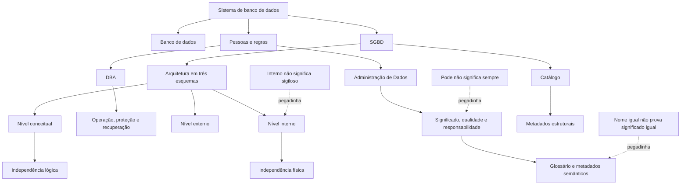
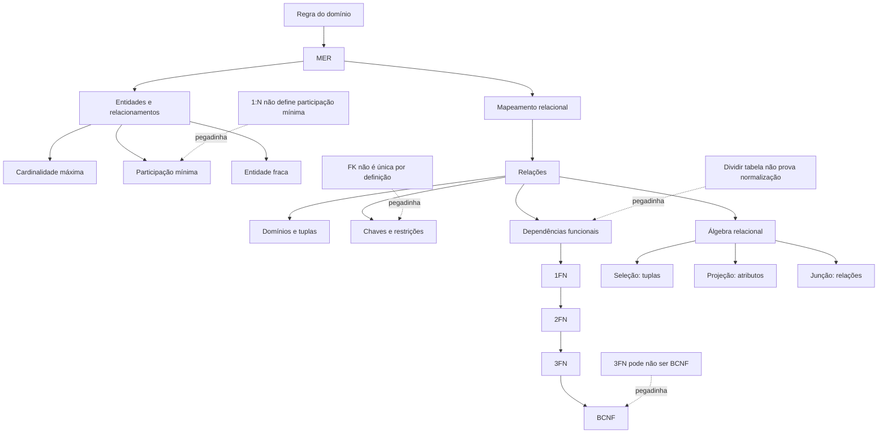
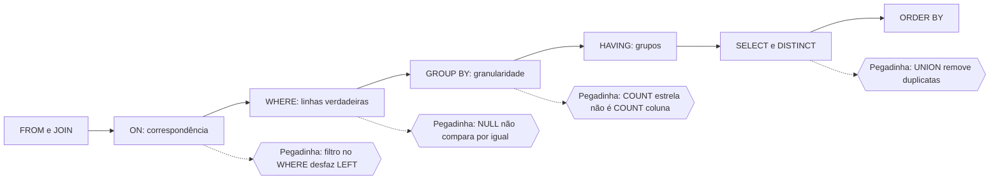
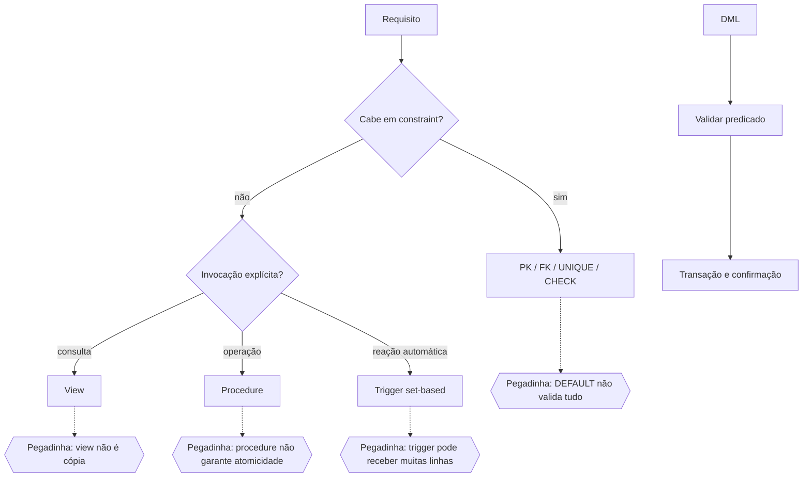
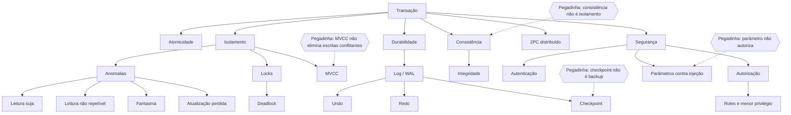
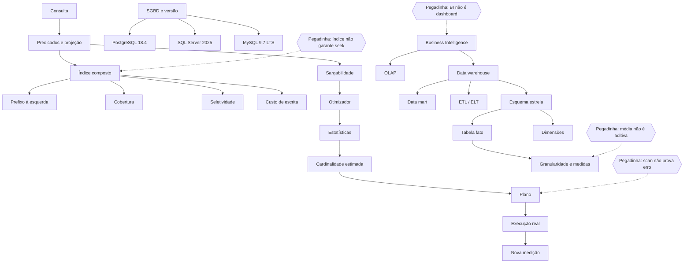

# Apostila de Estudo - Semana 3

> **Execução:** use `semana_03_jornada.md` como cronograma vigente. Esta apostila ensina o conteúdo na ordem necessária para a prática; o banco completo é distribuído entre D0, D+2, D+7, D+21 e ciclos de aprofundamento ou simulado.

## CRA-PR 2026 - Analista de Sistemas

- **Período:** 27/07/2026 a 01/08/2026.
- **Foco técnico:** Banco de Dados avançado, modelagem, SQL e Sistemas de Gerência de Banco de Dados.
- **Banca:** Instituto Consulplan.
- **Situação do material:** Material aprovado para execução em 19/07/2026; execução do candidato pendente.
- **Execução do candidato:** não presumida.

## Versão do edital utilizada

O recorte foi conferido no edital consolidado conforme Retificação I, preservado em `../edital/edital_cra_pr_2026_analista_sistemas_retificacao_1.pdf`, especialmente na página 28, itens 6, 7 e 8 de Conhecimentos do Cargo.

Esta semana cobre literalmente:

- conceitos e princípios de banco de dados;
- administração e independência de dados;
- dicionário de dados e níveis da arquitetura;
- modelo e bancos relacionais, álgebra relacional e modelagem;
- normalização, MER e mapeamento MER-relacional;
- SQL ANSI para definição, consulta e manipulação de dados;
- Transact-SQL e sistemas de suporte à inteligência de negócio;
- segurança, transações, concorrência, recuperação e integridade em SGBD;
- stored procedures, views, triggers, índices, otimização e transações distribuídas;
- SQL Server, MySQL e PostgreSQL.

O perfil do Instituto Consulplan orienta o modo de treinar, mas não amplia esse rol. Questões autorais usam comandos precisos, alternativas do mesmo domínio, resultados de consultas, cenários de administração de dados e decisões técnicas com requisitos explícitos.

## Prioridade na prova

Conhecimentos do Cargo possuem 15 questões e valem 30 pontos, a maior parcela técnica da objetiva. Banco de Dados forma um bloco extenso e interligado: uma única questão pode exigir modelo, restrição, SQL e consequência transacional. Por isso, o tema principal recebe 4h30 líquidas por dia, sem abandonar as revisões do núcleo comum.

## Como usar esta apostila

1. abra a jornada e siga apenas as âncoras do dia;
2. execute os Blocos 1, 2 e 3 e entregue o produto prático antes das revisões;
3. cumpra os Blocos 4 e 5 somente depois da teoria principal;
4. use o Bloco 6 apenas para recuperar conteúdo já ensinado;
5. resolva seis questões principais Essenciais no D0 e avance até dez somente quando couber correção integral A-D;
6. marque confiança de 0 a 3 antes de consultar o gabarito;
7. registre no caderno de erros a regra, o motivo do erro, um contraexemplo e as datas D+2, D+7 e D+21;
8. deixe Aprofundamento, Revisão e Simulado para as filas próprias; o tamanho do banco não aumenta as seis horas do dia.

## Rotina diária fixa - 6h líquidas

| Etapa | Tempo | Função |
|---|---:|---|
| Sessão A | 170 min | Blocos 1–3: aquisição, contraste, exemplos e produto prático |
| Sessão B | 170 min | Blocos 4–6, seis Essenciais, correção e fechamento |
| Consolidação | 20 min | caderno de erros, confiança e agendamento |
| **Total** | **360 min** | pausas fora da carga líquida |

A ordem física é obrigatória: teoria-base, aprofundamento, prática guiada, revisão fixa, Português/discursiva, recuperação ativa, mini revisão, mapa, checklist, questões e correção.

## Mapa da Semana 3

| Dia | Blocos 1–3 | Bloco 4 | Bloco 5 | Bloco 6 |
|---:|---|---|---|---|
| 1 | SGBD, administração de dados, três esquemas, independência e dicionário | D+2/D+7 da Semana 2, Legislação e Google Documentos | Português e recorte/tese | recuperação do Dia 1 |
| 2 | modelo relacional, MER, mapeamento, álgebra e normalização | D+7 da Semana 2, Administração Pública e Google Planilhas | Português e desenvolvimento 1 | recuperação dos Dias 1–2 |
| 3 | SQL ANSI: consulta, filtros, NULL, junções, grupos e subconsultas | D+2 do Dia 1, D+7 da Semana 2, Legislação e RLM | Português e desenvolvimento 2 | recuperação de modelagem e SQL |
| 4 | DDL, DML, Transact-SQL, views, procedures e triggers | D+2 do Dia 2, D+7 da Semana 2 e Administração Pública | Português, introdução e conclusão | recuperação dos Dias 3–4 |
| 5 | transações, concorrência, recuperação, integridade, segurança e distribuição | D+2 do Dia 3, D+7 da Semana 2, Legislação e internet | Português e plano integral | recuperação transacional |
| 6 | índices, otimização, SQL Server, MySQL, PostgreSQL e BI | D+2 do Dia 4, D+7 da Semana 2, RLM e Informática | texto integral manuscrito | recuperação integrada |

## Mapa das 120 questões extras

| Dia | Revisões que sustentam as 20 extras | Divisão declarada |
|---:|---|---|
| 1 | Legislação CRA/CFA, Google Documentos e Português | 8 + 8 + 4, intercaladas por uso |
| 2 | Administração Pública, Google Planilhas e Português | 7 + 7 + 6, intercaladas por uso |
| 3 | Legislação CRA/CFA, RLM e Português | 10 + 5 + 5 |
| 4 | Administração Pública e Português | 12 + 8 |
| 5 | Legislação CRA/CFA, Português e internet | 10 + 5 + 5 |
| 6 | RLM, revisão Google Documentos/Planilhas/internet e Português/discursiva | 5 + 10 + 5 |

O Bloco 6 possui entrega prática e nenhuma questão objetiva própria: ele recupera os conceitos cobrados nos Blocos 1–5 e alimenta o caderno acumulado. As extras Essenciais 1–5 de cada dia abrem pela primeira vez no D+7; as demais respeitam o uso indicado.

## Matriz de rastreabilidade da cobertura

| Tópico do edital | Dia e seção de teoria | Questões principais | Extras | Estado de produção |
|---|---|---|---|---|
| conceitos, SGBD, administração e dicionário | Dia 1 | S3D1Q001–S3D1Q050 | revisões do Dia 1 | coberto |
| modelo relacional, álgebra, MER, mapeamento e normalização | Dia 2 | S3D2Q051–S3D2Q100 | revisões do Dia 2 | coberto |
| SQL ANSI: consulta e manipulação por consulta | Dia 3 | S3D3Q101–S3D3Q150 | revisões do Dia 3 | coberto |
| definição/manipulação, T-SQL, views, procedures e triggers | Dia 4 | S3D4Q151–S3D4Q200 | revisões do Dia 4 | coberto |
| segurança, transações, concorrência, recuperação, integridade e distribuição | Dia 5 | S3D5Q201–S3D5Q250 | revisões do Dia 5 | coberto |
| índices, otimização, SGBDs e inteligência de negócio | Dia 6 | S3D6Q251–S3D6Q300 | revisões do Dia 6 | coberto |

O estado desta matriz será alterado para `coberto` somente depois de a teoria, os exemplos e as 420 referências passarem pela auditoria. Tópicos das Semanas 4–9 não serão antecipados para completar questões.

## Delimitação da cobertura

Esta semana encerra o primeiro contato pesado com os itens 6, 7 e 8. Integração por XML/Web Services, nuvem, backup como tópico autônomo, IA, UML, engenharia de software, programação, DevOps, governança e contratações de TIC permanecem nas semanas previstas no Plano Mestre.

Recursos de fornecedores aparecem apenas quando necessários para comparar os três SGBDs expressamente nomeados. Sintaxe ou comportamento dependente de versão é identificado como tal; não se transforma uma particularidade de produto em regra universal do SQL.

---

<a id="s3-d1"></a>
# Dia 1 — Arquitetura de banco de dados, independência e metadados

<a id="s3-d1-objetivo"></a>
## Objetivo do dia

Compreender o sistema de banco de dados como um conjunto organizado de dados, pessoas, regras e software, distinguindo o papel do SGBD das responsabilidades de Administração de Dados e de Administração de Banco de Dados. Ao final, o estudante deve localizar uma necessidade nos níveis externo, conceitual ou interno, separar esquema de instância, reconhecer independência lógica e física e usar catálogo, dicionário e metadados como evidência de estrutura, significado e controle.

O Dia 1 não ensina consultas SQL, comandos DDL/DML, transações, índices ou otimização. Esses assuntos pertencem aos Dias 3–6 e não devem ser antecipados para resolver a fila de hoje.

<a id="s3-d1-resultados"></a>
## Resultados esperados

Ao concluir o dia, você deve conseguir:

- diferenciar dado, informação, banco de dados, SGBD e sistema de banco de dados;
- reconhecer as funções centrais de um SGBD sem tratá-lo como simples repositório de arquivos;
- distinguir a orientação corporativa da Administração de Dados da operação técnica predominante do DBA;
- separar esquema, instância e estado do banco;
- explicar os níveis externo, conceitual e interno e os mapeamentos entre eles;
- classificar uma mudança como independência física ou lógica e reconhecer seus limites;
- diferenciar catálogo de sistema, dicionário de dados, glossário de negócio e metadados;
- usar metadados para responder perguntas sobre estrutura, significado, responsabilidade e origem;
- recuperar pontos da Semana 2 sem reabrir toda a teoria;
- resolver situações básicas de Legislação CRA/CFA e de Google Documentos;
- formular tese clara para o treino discursivo da semana.

<a id="s3-d1-importancia"></a>
## Por que esse assunto importa para a prova

Arquitetura, independência e administração de dados aparecem expressamente no conteúdo de Banco de Dados do cargo. A banca pode não pedir apenas uma definição: pode descrever a troca de um dispositivo de armazenamento, a criação de uma visão departamental, a alteração de uma regra corporativa ou a consulta ao catálogo e exigir que o candidato identifique o nível atingido, o profissional predominante ou o tipo de metadado envolvido.

Esses conceitos também sustentam os dias seguintes. Modelagem, normalização e SQL só fazem sentido quando se sabe qual estrutura é estável, qual conteúdo varia e quais descrições permitem interpretar corretamente cada objeto.

<a id="s3-d1-estilo-consulplan"></a>
## Como pode ser cobrado no estilo Instituto Consulplan

Formatos prováveis e pedagogicamente compatíveis com o perfil documentado da banca:

- alternativa correta ou incorreta sobre funções de um SGBD;
- cenário que troca Administração de Dados por DBA;
- comparação entre esquema e instância;
- associação entre nível externo, conceitual e interno;
- caso de alteração física que não deveria mudar programas;
- caso de alteração conceitual que exige preservar visões externas;
- identificação de metadado estrutural, administrativo, semântico ou de origem;
- análise de afirmações I, II e III;
- comando negativo com palavras absolutas como “sempre”, “somente” ou “automaticamente”.

Estratégia: identifique primeiro **o objeto que mudou** — significado corporativo, estrutura lógica, representação externa, armazenamento ou conteúdo corrente. Depois escolha o papel, nível ou tipo de independência correspondente.

<a id="s3-d1-jornada"></a>
## Jornada resumida — 6 horas líquidas

| Sessão | Etapa | Tempo | Entrega |
|---|---|---:|---|
| A | Bloco 1 | 55 min | mapa `SGBD × AD × DBA` |
| A | Bloco 2 | 55 min | quadro `esquema × instância × nível` |
| A | Bloco 3 | 60 min | matriz de mudanças, independência e metadados |
| B | Bloco 4 | 35 min | recuperação da Semana 2 + revisão legal e Google Documentos |
| B | Bloco 5 | 40 min | Português e tese discursiva |
| B | Bloco 6 | 25 min | recuperação ativa sem consulta |
| B | Seis Essenciais D0 | 30 min | S3D1Q001–S3D1Q006 |
| B | Correção A–D | 25 min | justificativa de todas as alternativas |
| B | Fechamento | 15 min | mini revisão, confiança e checklist |
| — | Consolidação | 20 min | caderno de erros e datas D+2/D+7/D+21 |
| **Total** |  | **360 min** | **dia encerrado sem sessão adicional** |

**Ponto de parada da Sessão A:** entregar uma folha com seis mudanças classificadas por responsável predominante, nível arquitetural, tipo de independência e metadado necessário. Encerrar aos 170 minutos mesmo que reste leitura complementar; nenhuma questão pode cobrar trecho ainda não estudado.

<a id="s3-d1-b1"></a>
## Bloco 1 — SGBD, sistema de banco de dados e responsabilidades

<a id="s3-d1-conceitos-sgbd"></a>
### 1. Dado, informação, banco de dados, SGBD e sistema de banco de dados

**Dado** é uma representação de um fato, como `id_profissional = 417` ou `situacao = ativa`. Isolado, ele pode não responder a uma pergunta útil. **Informação** é o dado interpretado em contexto, por exemplo: “o profissional 417 está com registro ativo na data consultada”.

**Banco de dados** é uma coleção organizada de dados relacionados e mantidos para determinada finalidade. **SGBD** é o software que define, armazena, consulta, protege e administra o acesso ao banco. **Sistema de banco de dados** é mais amplo: inclui banco, SGBD, aplicações, usuários, regras, procedimentos, infraestrutura e pessoas responsáveis.

Um arquivo CSV pode conter dados, mas não se torna um SGBD por isso. Da mesma forma, o SGBD não é sinônimo do servidor físico em que está instalado nem da aplicação que apresenta telas ao usuário.

<a id="s3-d1-funcoes-sgbd"></a>
### 2. Funções centrais de um SGBD

| Função | Pergunta que resolve | Limite importante |
|---|---|---|
| definição estrutural | quais objetos, atributos e restrições existem? | não define sozinho o significado corporativo de cada termo |
| armazenamento e acesso | como os dados são mantidos e recuperados? | não transforma qualquer arquivo em banco governado |
| integridade | quais estados são aceitos ou rejeitados? | regra só é garantida se estiver corretamente especificada e aplicada |
| segurança e autorização | quem pode realizar cada operação? | autenticar alguém não significa autorizar tudo |
| controle de acesso simultâneo | como vários usuários trabalham sem corromper o estado? | o mecanismo depende de configuração e uso adequados |
| recuperação | como retornar a estado utilizável após falha? | possuir mecanismo não substitui política, teste e cópia íntegra |
| catálogo | como descrever objetos e propriedades do próprio banco? | catálogo técnico não substitui glossário de negócio |
| abstração | como separar representação externa, lógica e física? | independência reduz impacto, mas não torna mudanças invisíveis por magia |

Nesta etapa, retenha a finalidade de cada função. O funcionamento detalhado de transações, recuperação, segurança e índices será estudado nos Dias 5 e 6.

<a id="s3-d1-exemplos-sgbd"></a>
### Exemplos resolvidos — conceitos e funções do SGBD

#### Exemplo 1 — planilhas divergentes não formam um cadastro governado

**Situação:** três setores mantêm cópias locais do cadastro de profissionais. O mesmo registro aparece como `ATIVO`, `SUSPENSO` e `PENDENTE` em arquivos diferentes.

**Dados relevantes:** há cópias independentes, atualização sem regra comum e ausência de fonte única identificada.

**Passos de raciocínio:**

1. reconhecer que os arquivos contêm dados, mas não oferecem controle central do estado;
2. localizar o problema em integridade, compartilhamento e definição da fonte autorizada;
3. separar a tecnologia da governança: um SGBD pode centralizar e aplicar restrições, mas a organização ainda precisa definir a regra de negócio e o responsável pelo dado.

**Resposta:** migrar o cadastro para um sistema de banco de dados pode reduzir redundância descontrolada e aplicar regras comuns; isso não dispensa Administração de Dados nem definição da fonte oficial.

**Por que funciona:** a solução combina capacidade técnica do SGBD com responsabilidade organizacional sobre significado e qualidade.

**Erro provável:** afirmar que “usar SGBD elimina automaticamente toda inconsistência”. Um modelo incorreto ou uma integração mal definida também pode registrar dados errados.

#### Exemplo 2 — acesso negado é evidência de controle, não de perda do dado

**Situação:** uma usuária autenticada consegue consultar dados cadastrais, mas não consegue alterar a situação do registro.

**Dados relevantes:** a identidade foi reconhecida; a leitura é permitida; a alteração é bloqueada.

**Passos de raciocínio:**

1. distinguir autenticação de autorização;
2. observar que o SGBD ou a camada de acesso aplica privilégios diferentes por operação;
3. rejeitar a conclusão de que o dado não existe, pois a consulta foi bem-sucedida.

**Resposta:** o cenário é compatível com controle de autorização: a usuária possui permissão de leitura, mas não de alteração.

**Por que funciona:** permissões podem ser graduadas; reconhecer o usuário não concede todos os poderes.

**Erro provável:** concluir que falha de escrita prova indisponibilidade do banco ou erro de senha.

<a id="s3-d1-ad-dba"></a>
### 3. Administração de Dados versus Administração de Banco de Dados

Os nomes dos cargos variam entre organizações, por isso a prova deve ser resolvida pelo **foco predominante da atividade**, não por uma fronteira absoluta.

| Eixo | Administração de Dados — AD | Administração de Banco de Dados — DBA |
|---|---|---|
| foco predominante | dado como ativo corporativo | ambiente técnico do banco |
| perguntas típicas | o que significa? quem é dono? qual fonte é oficial? qual qualidade é exigida? | como implantar, proteger, monitorar, disponibilizar e recuperar? |
| produtos | política de dados, glossário, padrão de nomes, responsáveis, critérios de qualidade | configuração, contas e privilégios, rotinas operacionais, capacidade e recuperação |
| alcance | transversal ao negócio e aos sistemas | instâncias, serviços e plataformas de banco |
| relação | orienta significado e governança | implementa e opera controles técnicos coerentes com as regras |

AD e DBA cooperam. O AD não é “chefe do DBA” por definição, e o DBA não decide sozinho o significado de um indicador corporativo. Em equipes pequenas, a mesma pessoa pode acumular tarefas; a natureza da tarefa continua distinguível.

<a id="s3-d1-exemplos-ad-dba"></a>
### Exemplos resolvidos — AD e DBA

#### Exemplo 1 — definição de “registro ativo”

**Situação:** áreas distintas calculam “profissionais ativos” de maneiras incompatíveis.

**Dados relevantes:** a divergência está no significado e no critério corporativo, não na disponibilidade do servidor.

**Passos de raciocínio:**

1. classificar o problema como semântico e de governança;
2. identificar a necessidade de glossário, responsável e regra comum;
3. somente depois traduzir a definição aprovada em estruturas e controles técnicos.

**Resposta:** a coordenação predominante é da Administração de Dados, com participação das áreas de negócio; o DBA apoia a implementação no ambiente.

**Por que funciona:** primeiro se decide o significado autorizado; depois se implementa a decisão.

**Erro provável:** atribuir ao DBA, sozinho, poder para escolher o conceito institucional por ser responsável técnico pelo banco.

#### Exemplo 2 — restauração do ambiente após falha

**Situação:** um serviço de banco não inicia após falha de armazenamento e precisa retornar de uma cópia validada.

**Dados relevantes:** há indisponibilidade técnica, mídia afetada e procedimento de recuperação previamente definido.

**Passos de raciocínio:**

1. classificar a demanda como operação e recuperação do ambiente;
2. identificar o DBA como responsável técnico predominante pela execução e validação;
3. manter a Administração de Dados informada sobre impacto, prioridade e qualidade do dado recuperado.

**Resposta:** o DBA conduz predominantemente a recuperação técnica; AD não é substituto operacional do administrador do ambiente.

**Por que funciona:** a atividade exige conhecimento da plataforma, das cópias e do procedimento de retorno.

**Erro provável:** concluir que somente AD participa porque os dados são um ativo corporativo.

<a id="s3-d1-b2"></a>
<a id="s3-d1-arquitetura-bd"></a>
## Bloco 2 — Esquemas, níveis arquiteturais e independência

<a id="s3-d1-esquema-instancia"></a>
### 4. Esquema, instância e estado do banco

**Esquema** descreve a estrutura relativamente estável: objetos, atributos, relacionamentos, domínios e restrições. É a intenção estrutural do banco.

**Instância**, ou estado do banco em um instante, é o conjunto de valores existentes naquele momento. Inserções, correções e exclusões mudam a instância; alterações estruturais mudam o esquema.

Não confunda “instância” neste sentido conceitual com o uso operacional do termo para designar uma instalação ou processo de um produto de banco. Em questão sobre arquitetura de dados, observe o contexto.

| Mudança | Classificação predominante |
|---|---|
| novo profissional cadastrado | instância/estado |
| correção de endereço | instância/estado |
| criação do atributo `data_validade` | esquema |
| alteração do domínio aceito para `situacao` | esquema/restrição |
| reinício do serviço do SGBD | operação da plataforma; não é, por si, alteração do esquema conceitual |

<a id="s3-d1-exemplos-esquema-instancia"></a>
### Exemplos resolvidos — esquema e instância

#### Exemplo 1 — novos registros, mesma estrutura

**Situação:** o cadastro passa de 10.000 para 10.300 profissionais, mantendo os mesmos atributos e regras.

**Dados relevantes:** somente os valores e a quantidade de registros mudaram.

**Passos de raciocínio:**

1. verificar se houve criação ou alteração de atributo, relacionamento ou restrição;
2. como a resposta é não, observar que mudou apenas o conteúdo corrente;
3. classificar a mudança como nova instância/novo estado.

**Resposta:** houve mudança de instância, não de esquema.

**Por que funciona:** o esquema admite muitos estados válidos ao longo do tempo.

**Erro provável:** tratar crescimento do volume como mudança estrutural apenas porque a quantidade de linhas aumentou.

#### Exemplo 2 — novo atributo obrigatório

**Situação:** passa a ser necessário registrar a data de validade de uma credencial e impedir valor ausente nos novos registros.

**Dados relevantes:** há novo atributo e nova restrição estrutural.

**Passos de raciocínio:**

1. identificar a inclusão de `data_validade`;
2. identificar a regra de obrigatoriedade;
3. concluir que a descrição da estrutura mudou, ainda que os valores existentes também precisem de tratamento.

**Resposta:** a alteração é de esquema; a adequação dos registros é consequência sobre a instância.

**Por que funciona:** atributos e restrições integram a definição estrutural.

**Erro provável:** dizer que é apenas instância porque, ao final, valores serão preenchidos.

<a id="s3-d1-tres-esquemas"></a>
### 5. Arquitetura em três esquemas

A arquitetura ANSI/SPARC organiza descrições em três níveis conceituais:

| Nível | O que representa | Exemplo |
|---|---|---|
| externo | recorte necessário a usuário, grupo ou aplicação | visão do atendimento com nome e situação, sem dados restritos |
| conceitual | estrutura lógica global integrada | profissionais, registros, unidades e relacionamentos |
| interno | organização física e caminhos de armazenamento | arquivos, páginas, particionamento e estruturas de acesso |

Entre externo e conceitual há mapeamentos que relacionam cada recorte à estrutura global. Entre conceitual e interno há mapeamento entre a estrutura lógica e sua realização física.

“Externo” não significa fora do banco nem acesso público. É a representação adequada a determinado consumidor. “Conceitual” não significa apenas um desenho informal; é a descrição lógica integrada. “Interno” não é o conteúdo sigiloso; é a realização física.

<a id="s3-d1-exemplos-tres-esquemas"></a>
### Exemplos resolvidos — três esquemas

#### Exemplo 1 — atendimento sem dado restrito

**Situação:** atendentes precisam ver nome, número de registro e situação, mas não informações internas de apuração.

**Dados relevantes:** a estrutura global contém todos os atributos; o grupo precisa de um recorte funcional.

**Passos de raciocínio:**

1. reconhecer que o conjunto completo pertence ao nível conceitual;
2. identificar que a apresentação limitada atende um grupo específico;
3. classificar o recorte como nível externo.

**Resposta:** deve existir uma representação externa para o atendimento, mapeada ao esquema conceitual.

**Por que funciona:** o nível externo adapta a representação sem exigir outra verdade corporativa.

**Erro provável:** chamar o recorte de nível interno porque ele contém dados “de dentro” da organização.

#### Exemplo 2 — troca da organização física

**Situação:** a equipe reorganiza páginas e arquivos físicos para melhorar a operação, preservando entidades, atributos e recortes dos usuários.

**Dados relevantes:** mudou a realização física; a estrutura lógica global e as representações externas foram preservadas.

**Passos de raciocínio:**

1. localizar arquivos e páginas no nível interno;
2. confirmar que o esquema conceitual não mudou;
3. concluir que o mapeamento conceitual–interno absorve a alteração.

**Resposta:** a mudança ocorre no nível interno e exemplifica o objetivo da independência física.

**Por que funciona:** aplicações continuam apoiadas na estrutura lógica, não na posição física dos dados.

**Erro provável:** afirmar que qualquer melhoria de desempenho altera automaticamente o nível conceitual.

<a id="s3-d1-independencia-dados"></a>
<a id="s3-d1-independencia"></a>
### 6. Independência física e independência lógica de dados

**Independência física** é a capacidade de alterar o esquema interno sem exigir alteração do esquema conceitual e, por consequência, das aplicações que dependem dele. Exemplos: reorganizar arquivos, mudar estruturas físicas ou deslocar armazenamento preservando a estrutura lógica.

**Independência lógica** é a capacidade de alterar o esquema conceitual preservando, por mapeamento ou adaptação, os esquemas externos e aplicações que não deveriam ser afetados. Exemplos: acrescentar entidade ou atributo sem quebrar recortes existentes; reorganizar parte da estrutura lógica mantendo contratos externos.

A independência lógica costuma ser mais difícil, pois aplicações podem depender diretamente de nomes, atributos e relacionamentos conceituais. Nenhuma forma de independência promete impacto zero em toda mudança. Se um atributo consumido for removido ou tiver significado incompatível, algum contrato precisará ser alterado.

<a id="s3-d1-exemplos-independencia"></a>
### Exemplos resolvidos — independência de dados

#### Exemplo 1 — mudança física preservada

**Situação:** o banco é movido de um conjunto de discos para outro arranjo de armazenamento, sem mudar objetos lógicos percebidos pelas aplicações.

**Dados relevantes:** a localização e a organização física mudam; nomes, atributos e relacionamentos permanecem.

**Passos de raciocínio:**

1. identificar que a mudança é interna;
2. verificar que o esquema conceitual foi preservado;
3. classificar como independência física.

**Resposta:** é um caso de independência física, desde que o mapeamento interno preserve a estrutura lógica consumida.

**Por que funciona:** a aplicação não precisa conhecer a mídia ou o arquivo físico.

**Erro provável:** chamar de independência lógica porque “a lógica da aplicação não mudou”. O critério é o nível alterado, não a sensação do usuário.

#### Exemplo 2 — ampliação conceitual preservando recorte externo

**Situação:** a estrutura global passa a distinguir endereço residencial e endereço profissional. Um relatório antigo precisa continuar exibindo apenas o endereço de correspondência já definido.

**Dados relevantes:** o esquema conceitual foi ampliado; o recorte externo antigo deve conservar significado e formato.

**Passos de raciocínio:**

1. localizar a nova distinção no nível conceitual;
2. definir qual dos novos endereços alimenta o campo externo antigo;
3. ajustar o mapeamento, preservando o contrato do relatório.

**Resposta:** o caso busca independência lógica por meio de mapeamento explícito entre a nova estrutura conceitual e o esquema externo antigo.

**Por que funciona:** a mudança lógica não precisa quebrar consumidores que não dependem da nova distinção.

**Erro provável:** afirmar que independência lógica torna qualquer remoção ou mudança de significado invisível automaticamente.

<a id="s3-d1-b3"></a>
## Bloco 3 — Catálogo, dicionário, metadados e aplicação

<a id="s3-d1-dicionario-administracao"></a>
<a id="s3-d1-catalogo-metadados"></a>
### 7. Catálogo de sistema, dicionário de dados e metadados

**Metadados** são dados que descrevem outros dados e seus contextos. Podem registrar:

- estrutura: nome, tipo, domínio, obrigatoriedade e relacionamento;
- semântica: definição de negócio e regra de interpretação;
- administração: responsável, classificação, permissão e ciclo de vida;
- origem: sistema produtor, transformação e destino;
- operação: criação, alteração, volume ou outras propriedades observáveis.

O **catálogo de sistema** é mantido pelo SGBD e descreve objetos técnicos reconhecidos pelo próprio ambiente: esquemas, relações, atributos, restrições, usuários e privilégios, entre outros.

O termo **dicionário de dados** pode ser usado de forma ampla. Em prova, observe o contexto: pode designar a documentação estruturada de elementos, significados, formatos, domínios, regras e responsáveis. Ele não deve ser reduzido a uma lista de nomes.

O **glossário de negócio** concentra termos e significados corporativos, como “registro ativo” ou “data de regularização”. Ele complementa o catálogo técnico. Uma coluna pode existir no catálogo sem que seu significado institucional esteja suficientemente explicado.

<a id="s3-d1-exemplos-catalogo"></a>
### Exemplos resolvidos — catálogo e metadados

#### Exemplo 1 — descobrir estrutura sem abrir cada registro

**Situação:** o analista precisa saber quais atributos de uma relação são obrigatórios e qual chave a identifica.

**Dados relevantes:** a pergunta é sobre definição estrutural, não sobre os valores correntes.

**Passos de raciocínio:**

1. classificar nomes, tipos, obrigatoriedade e chaves como metadados estruturais;
2. localizar esses dados no catálogo mantido pelo SGBD;
3. evitar confundir catálogo com as próprias linhas da relação.

**Resposta:** consultar o catálogo/dicionário técnico do ambiente permite identificar atributos e restrições sem examinar cada ocorrência.

**Por que funciona:** o catálogo descreve a estrutura do banco.

**Erro provável:** dizer que somente uma amostra de registros revela se um atributo é obrigatório; ausência observada não prova a regra estrutural.

#### Exemplo 2 — mesmo nome, significados diferentes

**Situação:** dois sistemas possuem o atributo `status`, mas um usa `A/I` para atividade cadastral e outro usa `P/C` para processo pendente ou concluído.

**Dados relevantes:** o nome técnico é igual, enquanto domínio e significado são diferentes.

**Passos de raciocínio:**

1. rejeitar a integração baseada apenas no nome;
2. consultar domínio técnico no catálogo e definição semântica no dicionário/glossário;
3. registrar transformação e sistema de origem antes de combinar os dados.

**Resposta:** são necessários metadados estruturais, semânticos e de origem; igualdade de nome não demonstra equivalência.

**Por que funciona:** integração correta depende de significado, domínio e proveniência.

**Erro provável:** concluir que colunas homônimas podem ser unidas diretamente.

<a id="s3-d1-contrastes"></a>
### 8. Contrastes decisivos

| Não confunda | Critério de separação |
|---|---|
| banco de dados × SGBD | coleção organizada × software gerenciador |
| SGBD × sistema de banco de dados | componente de software × ecossistema completo |
| AD × DBA | governança e significado × operação técnica predominante |
| esquema × instância | estrutura relativamente estável × valores em um instante |
| nível externo × interno | recorte do consumidor × realização física |
| independência física × lógica | muda interno × muda conceitual |
| catálogo × conteúdo | descrição dos objetos × ocorrências armazenadas |
| catálogo técnico × glossário | estrutura reconhecida pelo SGBD × significado corporativo |
| metadado × dado sem contexto | descrição do dado × valor que precisa ser interpretado |

<a id="s3-d1-pegadinhas-teoria"></a>
### 9. Pegadinhas antes da prática

- chamar servidor físico de SGBD;
- supor que centralização elimina erro de modelagem ou de governança;
- atribuir toda definição de negócio ao DBA;
- tratar qualquer aumento de linhas como mudança de esquema;
- chamar dado sigiloso de “nível interno”;
- inverter independência lógica e física;
- afirmar que independência significa ausência total de impacto;
- equiparar catálogo técnico a glossário de negócio;
- inferir equivalência semântica apenas por nomes iguais.

<a id="s3-d1-pratica"></a>
### 10. Prática guiada — inventário de mudanças

Considere o seguinte cenário do Conselho:

1. a área institucional define que “regular” significa registro ativo e ausência de impedimento vigente;
2. a equipe cria um atributo para armazenar a origem da última atualização;
3. o armazenamento é reorganizado sem mudar objetos lógicos;
4. o atendimento passa a ver apenas nome, número e situação;
5. são carregados 500 novos registros;
6. o analista procura o responsável e a definição do atributo `situacao`;

Preencha sem consulta:

| Evento | AD ou DBA predominante | Esquema/instância | Nível | Independência | Metadado necessário |
|---|---|---|---|---|---|
| definição de “regular” |  |  |  |  |  |
| novo atributo de origem |  |  |  |  |  |
| reorganização física |  |  |  |  |  |
| recorte do atendimento |  |  |  |  |  |
| 500 registros |  |  |  |  |  |
| busca de responsável/definição |  |  |  |  |  |

**Solução guiada:**

| Evento | Classificação principal | Justificativa |
|---|---|---|
| definição de “regular” | AD; nível semântico/conceitual; metadado de negócio | decide significado e regra corporativa |
| novo atributo de origem | esquema conceitual; metadado estrutural e de proveniência | altera a descrição lógica e registra fonte |
| reorganização física | DBA; nível interno; independência física | muda realização física, preservando lógica |
| recorte do atendimento | nível externo | adapta a representação ao grupo consumidor |
| 500 registros | instância | muda conteúdo, não estrutura |
| busca de responsável/definição | dicionário/glossário e catálogo de governança | exige metadado administrativo e semântico |

**Produto da Sessão A:** redesenhe a tabela com um exemplo próprio em cada linha e grave uma explicação de até três minutos. Se não conseguir justificar o nível arquitetural, retorne somente à âncora correspondente.

<a id="s3-d1-b4"></a>
## Bloco 4 — Recuperação da Semana 2, Legislação CRA/CFA e Google Documentos

**Tempo:** 35 minutos. **Questões associadas:** extras do Dia 1 indicadas como Bloco 4. O conteúdo abaixo é revisão suficiente para a cobrança; detalhes não apresentados não podem decidir uma alternativa.

<a id="s3-d1-recuperacao-semana2"></a>
### 11. Recuperação curta da Semana 2

Use no máximo oito minutos e responda sem consulta:

1. Qual equipamento encaminha entre redes IP: switch de camada 2 ou roteador?
2. Se o portal abre por IP, mas não por nome, qual serviço deve ser testado primeiro?
3. Autenticação bem-sucedida concede automaticamente acesso a todos os recursos?
4. Em resposta a incidente, por que preservar evidência antes de apagar artefatos?

**Conferência:** roteador; DNS; não, autorização é decisão separada; porque a erradicação precipitada pode destruir evidência necessária ao diagnóstico e à responsabilização. Qualquer erro volta ao caderno da Semana 2, sem reabrir a apostila inteira.

<a id="s3-d1-revisao-legislacao"></a>
### 12. Legislação CRA/CFA — mapa de fonte e competência

Para esta revisão, use quatro núcleos confirmados:

| Fonte | Função segura para a prova | Não conclua |
|---|---|---|
| Lei nº 4.769/1965 | disciplina a profissão e estabelece a base do Sistema CFA/CRAs | que resolução posterior pode afastar livremente a lei |
| Decreto nº 61.934/1967 | regulamenta a execução da Lei nº 4.769/1965 | que decreto e lei possuem função idêntica |
| Regimento do CRA-PR — RN CFA nº 651/2024 | organiza natureza, jurisdição, órgãos e competências internas do Regional | que o Regimento é o Código de Ética |
| Código de Ética — RN CFA nº 671/2025 | disciplina deveres, direitos, infrações e sanções no alcance aplicável | que toda consequência vale indistintamente para pessoa física e jurídica |

O **CFA** atua no plano nacional de orientação, disciplina e normatização dentro de sua competência. O **CRA-PR** executa atribuições regionais, mantém registros, fiscaliza e decide matérias no âmbito de sua jurisdição. Autonomia administrativa do Regional não significa poder para revogar norma nacional ou lei federal.

Roteiro para caso legal:

1. identifique o objeto: profissão, regulamentação, organização interna ou ética;
2. localize a fonte correspondente;
3. identifique sujeito e jurisdição;
4. rejeite conclusão baseada apenas em a norma ser mais recente;
5. não invente prazo, sanção ou competência ausente do conteúdo confirmado.

<a id="s3-d1-exemplos-legislacao"></a>
### Exemplos resolvidos — Legislação CRA/CFA

#### Exemplo 1 — orientação nacional e fiscalização regional

**Situação:** surge notícia de exercício irregular em município paranaense e, paralelamente, necessidade de orientação uniforme para todos os Conselhos Regionais.

**Dados relevantes:** o fato concreto ocorre no Paraná; a orientação pretendida tem alcance nacional.

**Passos de raciocínio:**

1. separar execução regional de uniformização nacional;
2. atribuir registro e fiscalização ordinária ao CRA-PR em sua jurisdição;
3. atribuir orientação geral do sistema ao CFA dentro de suas competências.

**Resposta:** CRA-PR atua no caso regional; CFA exerce o papel nacional de orientação e disciplina.

**Por que funciona:** a divisão considera alcance e competência, não uma hierarquia simplista de “órgão maior faz tudo”.

**Erro provável:** afirmar que o CFA deve realizar toda diligência local porque possui atuação nacional.

#### Exemplo 2 — resolução mais nova não supera a lei

**Situação:** uma alternativa afirma que resolução administrativa de 2025 prevalece sobre lei federal de 1965 apenas por ser posterior.

**Dados relevantes:** as normas possuem hierarquia e funções distintas.

**Passos de raciocínio:**

1. reconhecer que cronologia e hierarquia são critérios diferentes;
2. verificar que a resolução deve permanecer dentro da competência legal;
3. rejeitar prevalência automática fundada somente na data.

**Resposta:** a afirmação está incorreta; ato inferior posterior não afasta livremente lei superior.

**Por que funciona:** o sistema normativo não é ordenado apenas do mais recente para o mais antigo.

**Erro provável:** escolher sempre a norma de número ou ano mais alto.

<a id="s3-d1-google-documentos"></a>
### 13. Google Documentos — colaboração, sugestões e histórico

No Google Documentos, separe função de edição, sugestão, comentário e histórico:

- **editor:** pode alterar o conteúdo diretamente, além de comentar e trabalhar com sugestões conforme as permissões do arquivo;
- **comentador:** pode comentar e sugerir alterações, mas não altera diretamente o conteúdo como editor;
- **leitor:** consulta o arquivo, sem editar o conteúdo ou acrescentar comentários;
- **modo Sugestão:** propõe inserções e exclusões sem substituir imediatamente o texto original; a sugestão pode ser aceita ou rejeitada;
- **comentário:** registra discussão associada a um trecho; não equivale a editar esse trecho;
- **histórico de versões:** permite a usuário com permissão adequada examinar versões e, quando autorizado, restaurar ou copiar uma versão anterior;
- **títulos e estilos:** estruturam o documento e ajudam navegação e consistência; aumentar manualmente a fonte não equivale semanticamente a aplicar um estilo de título.

Permissão deve seguir menor privilégio. Se alguém precisa apenas revisar, conceder edição integral é mais amplo que o necessário. Recurso disponível também pode depender do tipo de conta e de políticas administrativas; uma questão correta não deve transformar possibilidade configurável em garantia universal.

<a id="s3-d1-exemplos-google-docs"></a>
### Exemplos resolvidos — Google Documentos

#### Exemplo 1 — revisão sem alteração direta

**Situação:** uma consultora deve propor correções em minuta, mas o responsável precisa aceitar ou rejeitar cada mudança antes que ela componha o texto final.

**Dados relevantes:** a consultora não deve substituir imediatamente o original; o proprietário decide sobre cada alteração.

**Passos de raciocínio:**

1. excluir o modo de edição direta;
2. escolher o modo Sugestão;
3. conceder permissão compatível, como comentador ou editor conforme a política do arquivo, sem ampliar acesso desnecessariamente.

**Resposta:** usar sugestões permite propor alterações que serão aceitas ou rejeitadas pelo responsável.

**Por que funciona:** a sugestão preserva a decisão final sobre o texto.

**Erro provável:** usar comentários como se eles substituíssem automaticamente as palavras selecionadas.

#### Exemplo 2 — recuperar uma redação anterior

**Situação:** depois de várias edições válidas, a equipe percebe que um parágrafo importante existia em versão anterior.

**Dados relevantes:** o objetivo é localizar uma versão passada e recuperar seu conteúdo; não se trata apenas de desfazer a última tecla.

**Passos de raciocínio:**

1. abrir o histórico de versões com permissão adequada;
2. localizar a versão que contém o parágrafo;
3. decidir entre restaurar a versão inteira ou copiar o conteúdo necessário, evitando apagar alterações válidas posteriores.

**Resposta:** consultar o histórico e copiar o trecho costuma ser mais seguro quando outras mudanças posteriores devem ser preservadas.

**Por que funciona:** restaurar uma versão inteira altera o estado atual do documento; copiar permite recuperação seletiva.

**Erro provável:** afirmar que histórico de versões é visível e restaurável por qualquer leitor.

<a id="s3-d1-b5"></a>
## Bloco 5 — Português e progressão discursiva

**Tempo:** 40 minutos. **Função:** leitura precisa de comandos e início da dissertação semanal.

<a id="s3-d1-portugues-comando"></a>
### 14. Comando, escopo e palavras absolutas

Antes de avaliar o conteúdo técnico, circule o comando:

- `correta`: procure a única afirmação integralmente defensável;
- `incorreta`: procure a afirmação falsa e não marque uma verdadeira apenas por considerá-la incompleta;
- `EXCETO`: descubra primeiro a classe comum das demais;
- `apenas`: confira exatamente quais assertivas foram incluídas;
- `pode`: indica possibilidade, não garantia;
- `sempre`, `nunca`, `somente`: exigem regra sem exceção no contexto informado.

Conectores também mudam o raciocínio: `portanto` introduz conclusão; `porque` pode apresentar causa ou explicação; `embora` marca concessão; `contudo` contrapõe sem apagar a afirmação anterior.

<a id="s3-d1-discursiva-tese"></a>
### 15. Discursiva — recorte e tese

**Tema de trabalho:** governança e uso responsável de dados na melhoria dos serviços públicos.

**Comando de treino:** formule uma tese que responda como o poder público pode aproveitar dados para melhorar serviços sem reduzir direitos, transparência e responsabilidade.

Uma tese adequada contém:

1. resposta ao problema;
2. posição delimitada;
3. dois eixos que possam virar parágrafos de desenvolvimento.

Modelo de arquitetura, não de texto para copiar:

`posição central + eixo 1 (qualidade/finalidade) + eixo 2 (proteção/responsabilização)`.

<a id="s3-d1-exemplos-portugues-disc"></a>
### Exemplos resolvidos — Português e tese

#### Exemplo 1 — possibilidade não é garantia

**Situação:** o texto afirma: “metadados podem reduzir erros de interpretação quando registram significado e origem”. A alternativa conclui: “metadados sempre eliminam erros”.

**Dados relevantes:** `podem` expressa possibilidade condicionada; `sempre eliminam` universaliza o efeito.

**Passos de raciocínio:**

1. localizar o modal `podem`;
2. comparar seu alcance com `sempre`;
3. rejeitar a generalização absoluta.

**Resposta:** a alternativa extrapola o texto.

**Por que funciona:** possibilidade não sustenta universalidade.

**Erro provável:** marcar a alternativa porque repete as palavras “metadados” e “erros”.

#### Exemplo 2 — transformar tema em tese

**Situação:** a primeira versão diz: “Dados são importantes para a sociedade e devem ser bem usados.”

**Dados relevantes:** a frase é genérica, não responde como conciliar melhoria e direitos e não anuncia eixos.

**Passos de raciocínio:**

1. formular posição: uso de dados deve estar vinculado a finalidade pública;
2. escolher eixo 1: qualidade e avaliação do serviço;
3. escolher eixo 2: transparência, proteção e responsabilização;
4. reunir os elementos sem prometer solução total.

**Resposta possível:** “O uso de dados pode qualificar serviços públicos quando se apoia em informações confiáveis e finalidades verificáveis, ao mesmo tempo que assegura transparência, proteção e responsabilização.”

**Por que funciona:** a tese responde ao conflito e abre dois caminhos argumentativos.

**Erro provável:** apresentar apenas o tema ou listar palavras positivas sem relação causal.

**Entrega:** escreva uma introdução manuscrita de quatro a cinco linhas, sublinhe posição e dois eixos e reescreva uma expressão vaga.

<a id="s3-d1-b6"></a>
## Bloco 6 — Recuperação ativa e caderno de erros

**Tempo:** 25 minutos. Este bloco não apresenta conteúdo novo e não pode fundamentar questão que os Blocos 1–5 não tenham preparado.

Sem consulta:

1. desenhe os três níveis arquiteturais;
2. dê um exemplo de esquema e outro de instância;
3. explique em uma frase a diferença entre independência lógica e física;
4. classifique duas tarefas como AD ou DBA e justifique;
5. diferencie catálogo técnico e glossário de negócio;
6. recupere CFA × CRA-PR;
7. diferencie sugestão, comentário e histórico no Google Documentos;
8. repita a tese sem olhar o modelo.

Confira com outra cor. Para cada erro, registre: resposta inicial, regra correta, contraste, exemplo próprio, âncora, confiança de 0 a 3 e datas D+2, D+7 e D+21.

<a id="s3-d1-mapa"></a>
## Mapa de conexões do Dia 1



<a id="s3-d1-tabela-rapida"></a>
## Tabela de revisão rápida do Dia 1

| Se o enunciado mencionar... | Pense primeiro em... |
|---|---|
| regra e significado corporativo | Administração de Dados |
| configuração, disponibilidade e recuperação do ambiente | DBA |
| valores correntes | instância |
| atributos, relações e restrições | esquema |
| recorte por usuário ou aplicação | nível externo |
| estrutura lógica global | nível conceitual |
| arquivos, páginas e organização física | nível interno |
| mudança interna sem mudança conceitual | independência física |
| mudança conceitual com preservação externa | independência lógica |
| nomes, tipos, chaves e privilégios | catálogo/metadado técnico |
| definição, responsável e origem | glossário/dicionário e metadados semânticos/administrativos |

<a id="s3-d1-pegadinhas"></a>
## Pegadinhas do Dia 1

- SGBD é software; sistema de banco de dados é o conjunto mais amplo.
- AD e DBA podem colaborar; a questão pede o foco predominante.
- instância conceitual é estado dos dados, não necessariamente instalação do produto.
- externo é recorte, não informação pública.
- mudança física não se torna lógica apenas porque a aplicação foi preservada.
- independência não garante compatibilidade com remoção de campo consumido.
- catálogo descreve objetos, mas não substitui a definição corporativa.
- leitor, comentador e editor não possuem o mesmo alcance no Google Drive/Documentos.
- comando `INCORRETA` muda o alvo, não a verdade técnica das outras alternativas.

<a id="s3-d1-mini-revisao"></a>
## Mini revisão — dez perguntas

1. O que torna o sistema de banco de dados mais amplo que o SGBD?
2. Qual papel predomina na definição corporativa de “registro regular”?
3. Cadastrar uma nova pessoa muda esquema ou instância?
4. Criar um atributo muda esquema ou instância?
5. Qual nível representa um recorte para determinada aplicação?
6. Qual nível descreve a estrutura lógica global?
7. Trocar a organização física preservando a lógica exemplifica qual independência?
8. Alterar o conceitual preservando uma representação externa busca qual independência?
9. Onde procurar tipos e restrições reconhecidos pelo SGBD?
10. Qual recurso do Google Documentos permite propor alteração sujeita a aceite?

### Respostas da mini revisão

1. Inclui banco, SGBD, aplicações, usuários, regras, infraestrutura e pessoas.
2. Administração de Dados, com participação do negócio.
3. Instância.
4. Esquema.
5. Externo.
6. Conceitual.
7. Física.
8. Lógica.
9. Catálogo/dicionário técnico.
10. Modo Sugestão.

<a id="s3-d1-checklist"></a>
## Checklist de domínio

- [ ] Distingo banco, SGBD e sistema de banco de dados.
- [ ] Classifico tarefas de AD e DBA pelo foco predominante.
- [ ] Separo esquema de instância em cenário novo.
- [ ] Desenho os níveis externo, conceitual e interno.
- [ ] Classifico independência lógica e física sem usar palavra-chave isolada.
- [ ] Diferencio catálogo, dicionário, glossário e metadados.
- [ ] Explico por que nome igual não prova semântica igual.
- [ ] Resolvo CFA × CRA-PR sem inverter alcance.
- [ ] Distingo edição, sugestão, comentário e histórico.
- [ ] Produzo tese com posição e dois eixos.

<a id="s3-d1-fila"></a>
## Fila de dez Essenciais e correção

| Ordem | ID | Núcleo | Momento |
|---:|---|---|---|
| 1 | S3D1Q001 | Dado, banco e SGBD — [teoria](#s3-d1-conceitos-sgbd) | D0 |
| 2 | S3D1Q002 | Informação em contexto — [teoria](#s3-d1-conceitos-sgbd) | D0 |
| 3 | S3D1Q003 | Sistema de banco de dados — [teoria](#s3-d1-conceitos-sgbd) | D0 |
| 4 | S3D1Q004 | Catálogo como função do SGBD — [teoria](#s3-d1-funcoes-sgbd) | D0 |
| 5 | S3D1Q005 | Autenticação e autorização — [teoria](#s3-d1-funcoes-sgbd) | D0 |
| 6 | S3D1Q006 | Administração de Dados — [teoria](#s3-d1-ad-dba) | D0 |
| 7 | S3D1Q007 | Atuação predominante do DBA — [teoria](#s3-d1-ad-dba) | D+2 |
| 8 | S3D1Q008 | Cooperação entre AD e DBA — [teoria](#s3-d1-ad-dba) | D+2 |
| 9 | S3D1Q009 | Centralização e governança — [exemplo](#s3-d1-exemplos-sgbd) | D+2 |
| 10 | S3D1Q010 | Distribuição de responsabilidades — [exemplo](#s3-d1-exemplos-ad-dba) | D+2 |

O teto D0 é dez somente se couber correção integral; a fila padrão abre seis. Para cada item, registre resposta, confiança 0–3 e motivo. Na correção, explique A–D, volte apenas à âncora necessária e escreva um contraexemplo para o distrator escolhido.

<a id="s3-d1-fechamento"></a>
## Fechamento do Dia 1

O dia encerra quando houver:

- produto da Sessão A preenchido;
- introdução e tese reescritas;
- seis Essenciais corrigidas A–D;
- erros e acertos inseguros registrados;
- saldo S3D1Q007–S3D1Q010 agendado para D+2;
- confiança geral por núcleo registrada.

Não use a sensação de leitura como domínio. Explique em voz alta por que cada exemplo pertence ao nível, papel ou metadado escolhido.

<a id="s3-d1-fontes"></a>
## Fontes do Dia 1

- Lei nº 4.769/1965: https://www.planalto.gov.br/ccivil_03/leis/l4769.htm
- Decreto nº 61.934/1967: https://www.planalto.gov.br/ccivil_03/decreto/Antigos/D61934.htm
- RN CFA nº 651/2024 — Regimento do CRA-PR: https://documentos.cfa.org.br/?a=show&c=documento&id=955
- RN CFA nº 671/2025 — Código de Ética: https://documentos.cfa.org.br/?a=show&c=documento&id=1038
- Google Drive — níveis de acesso: https://support.google.com/drive/answer/16722399
- Google Documentos — sugerir edições: https://support.google.com/docs/answer/6033474
- Editores Google — histórico de versões: https://support.google.com/docs/answer/190843

---

<a id="s3-d2"></a>
# Dia 2 — Modelo relacional, MER, mapeamento e normalização

<a id="s3-d2-objetivo"></a>
## Objetivo do dia

Representar dados com precisão no modelo relacional e no Modelo Entidade–Relacionamento, interpretar domínios, tuplas, relações, chaves e restrições, mapear estruturas conceituais para relações e aplicar álgebra relacional e normalização até BCNF. O estudante deve justificar cada decomposição por dependências e anomalias, não apenas decorar slogans como “uma tabela para cada coisa”.

O Dia 2 não ensina sintaxe SQL, comandos de criação/alteração, Transact-SQL, transações, índices, produtos específicos ou BI. As relações e operações são tratadas em nível conceitual e algébrico; a tradução para SQL começa no Dia 3.

<a id="s3-d2-resultados"></a>
## Resultados esperados

Ao concluir o dia, você deve conseguir:

- definir domínio, atributo, tupla, relação, grau e cardinalidade;
- distinguir superchave, chave candidata, primária, alternativa, composta e estrangeira;
- reconhecer integridade de domínio, de entidade e referencial;
- modelar entidades, atributos e relacionamentos;
- interpretar cardinalidade mínima/máxima e participação total/parcial;
- reconhecer entidade fraca, chave parcial e relacionamento identificador;
- mapear entidades fortes, relacionamentos 1:1, 1:N e N:N, atributos multivalorados e entidades fracas;
- aplicar seleção, projeção, união, diferença, produto, renomeação e junção em nível algébrico;
- identificar dependências funcionais completas, parciais e transitivas;
- normalizar relações até 1FN, 2FN, 3FN e BCNF;
- justificar decomposição sem misturar normalização com mera divisão visual de tabelas;
- recuperar Administração Pública e usar referências, funções e filtros básicos no Google Planilhas;
- produzir o primeiro desenvolvimento da dissertação.

<a id="s3-d2-importancia"></a>
## Por que esse assunto importa para a prova

Modelo relacional, MER, mapeamento e normalização são núcleos explícitos do edital. A Consulplan pode apresentar um pequeno esquema, descrever uma regra de negócio e perguntar onde fica a chave estrangeira, se a participação é total, qual dependência viola determinada forma normal ou qual operação algébrica produz o resultado desejado.

O tema também mede raciocínio. Uma relação pode estar em 3FN e ainda violar BCNF; uma entidade fraca não é apenas uma entidade “pouco importante”; uma chave estrangeira não precisa ser única; e projeção matemática não é simples exibição visual de colunas sem considerar a natureza de conjunto.

<a id="s3-d2-estilo-consulplan"></a>
## Como pode ser cobrado no estilo Instituto Consulplan

- classificação de chave em cenário cadastral;
- assertivas sobre domínio, tupla e relação;
- leitura de cardinalidade `0..1`, `1..1`, `0..N` e `1..N`;
- identificação de participação total ou parcial;
- reconhecimento e mapeamento de entidade fraca;
- escolha do lado que recebe chave estrangeira em 1:N ou 1:1;
- criação de relação associativa em N:N;
- resultado de seleção, projeção, diferença ou junção;
- identificação de dependência parcial ou transitiva;
- decomposição até 2FN, 3FN ou BCNF;
- alternativa incorreta que confunde chave candidata com qualquer atributo único observado em uma amostra.

Estratégia: escreva primeiro as regras do cenário em frases curtas. Depois converta cada regra em cardinalidade, dependência ou restrição. Não escolha a alternativa pelo desenho mais familiar.

<a id="s3-d2-jornada"></a>
## Jornada resumida — 6 horas líquidas

| Sessão | Etapa | Tempo | Entrega |
|---|---|---:|---|
| A | Bloco 1 | 55 min | quadro de relações, chaves e restrições |
| A | Bloco 2 | 55 min | dois MERs mapeados para relações |
| A | Bloco 3 | 60 min | operações algébricas e decomposição normalizada |
| B | Bloco 4 | 35 min | recuperação da Semana 2 + Administração Pública e Google Planilhas |
| B | Bloco 5 | 40 min | Português e desenvolvimento argumentativo |
| B | Bloco 6 | 25 min | recuperação ativa sem conteúdo novo |
| B | Seis Essenciais D0 | 30 min | S3D2Q051–S3D2Q056 |
| B | Correção A–D | 25 min | justificativa de todas as alternativas |
| B | Fechamento | 15 min | mini revisão, confiança e checklist |
| — | Consolidação | 20 min | caderno de erros e datas D+2/D+7/D+21 |
| **Total** |  | **360 min** | **dia encerrado sem sessão adicional** |

**Ponto de parada da Sessão A:** entregar o mapeamento do caso integrado e uma decomposição justificada até BCNF ou até a forma normal efetivamente alcançada. Se não conseguir demonstrar uma dependência, registre a lacuna; não invente regra do domínio para forçar normalização.

<a id="s3-d2-b1"></a>
## Bloco 1 — Modelo relacional, chaves e restrições

<a id="s3-d2-modelo-relacional"></a>
### 1. Domínio, atributo, tupla e relação

No modelo relacional:

- **domínio** é o conjunto de valores admissíveis para um atributo, acompanhado de seu significado;
- **atributo** nomeia uma propriedade representada por uma coluna no esquema relacional;
- **tupla** é uma ocorrência formada por valores dos atributos;
- **relação** é um conjunto de tuplas compatíveis com o mesmo esquema;
- **grau** é a quantidade de atributos da relação;
- **cardinalidade da relação** é a quantidade de tuplas no estado considerado.

No modelo matemático, a ordem de atributos não altera o significado quando eles são identificados por nome, a ordem das tuplas é irrelevante e uma relação é conjunto, portanto não contém tuplas duplicadas. Produtos SQL podem trabalhar com resultados que admitem duplicidade; essa distinção será tratada no Dia 3 e não muda a definição relacional usada hoje.

Um domínio não é apenas o tipo físico. `data`, por exemplo, pode admitir qualquer data tecnicamente representável, mas o atributo `data_nascimento` ainda possui regra semântica diferente de `data_regularizacao`.

<a id="s3-d2-chaves"></a>
### 2. Superchaves, chaves candidatas e chave primária

| Conceito | Definição operacional |
|---|---|
| superchave | conjunto de atributos que identifica unicamente uma tupla, ainda que contenha atributo desnecessário |
| chave candidata | superchave mínima: retirar qualquer atributo faz perder a unicidade garantida |
| chave primária | chave candidata escolhida como identificador principal |
| chave alternativa | chave candidata não escolhida como primária |
| chave composta | chave formada por mais de um atributo |
| chave estrangeira | atributo ou conjunto que referencia chave candidata compatível de outra relação ou da própria relação |

Unicidade observada em uma amostra não cria chave candidata. É preciso que a regra do domínio garanta a unicidade. Se hoje todos os nomes são diferentes, isso não torna `nome` uma chave.

<a id="s3-d2-restricoes"></a>
### 3. Restrições de integridade

- **integridade de domínio:** valor deve pertencer ao domínio e obedecer às regras do atributo;
- **integridade de entidade:** a chave primária identifica cada tupla e não admite valor nulo em seus componentes;
- **integridade referencial:** valor de chave estrangeira deve corresponder a uma chave referenciada existente, salvo quando valor nulo for permitido pelo modelo;
- **restrição semântica:** regra específica do negócio, como impedir data final anterior à inicial.

Uma chave estrangeira não precisa ser única em relação 1:N. Muitas tuplas filhas podem apontar para a mesma tupla pai. Também não se conclui que toda coluna de mesmo nome forma referência: a relação deve ser definida e os domínios precisam ser compatíveis.

<a id="s3-d2-exemplos-relacional"></a>
### Exemplos resolvidos — modelo relacional, chaves e restrições

#### Exemplo 1 — encontrar chaves sem usar coincidência da amostra

**Situação:** `PROFISSIONAL(id_profissional, cpf, nome, email)` possui as regras: `id_profissional` é gerado sem repetição; `cpf` é obrigatório e único; `email` pode ser compartilhado por uma equipe.

**Dados relevantes:** unicidade garantida para `id_profissional` e `cpf`; `email` não é garantido como único.

**Passos de raciocínio:**

1. testar `id_profissional`: identifica sozinho, portanto é chave candidata;
2. testar `cpf`: também identifica sozinho, portanto é outra candidata;
3. testar o par `{id_profissional, nome}`: identifica, mas não é mínimo, logo é superchave não candidata;
4. rejeitar `email` como candidata;
5. escolher uma candidata como primária e classificar a outra como alternativa.

**Resposta:** candidatas: `id_profissional` e `cpf`; se a primeira for escolhida como PK, `cpf` é chave alternativa.

**Por que funciona:** candidaturas decorrem de unicidade garantida e minimalidade.

**Erro provável:** chamar todo conjunto único de chave candidata, ignorando atributo redundante.

#### Exemplo 2 — integridade referencial em anuidades

**Situação:** `ANUIDADE(id_anuidade, id_profissional, ano)` referencia `PROFISSIONAL(id_profissional)`. Existem várias anuidades do mesmo profissional, uma por ano.

**Dados relevantes:** relação 1:N entre profissional e anuidades; referência obrigatória ao profissional existente.

**Passos de raciocínio:**

1. localizar `id_profissional` em `ANUIDADE` como chave estrangeira;
2. permitir repetição desse valor, pois um profissional pode ter várias anuidades;
3. impedir valor que não corresponda a profissional existente;
4. usar `id_anuidade` ou outra candidata adequada para identificar a anuidade.

**Resposta:** `ANUIDADE.id_profissional` é FK não necessariamente única e deve respeitar integridade referencial.

**Por que funciona:** o lado N armazena a referência ao lado 1.

**Erro provável:** exigir unicidade da FK e, assim, transformar indevidamente 1:N em 1:1.

<a id="s3-d2-b2"></a>
<a id="s3-d2-mer-mapeamento"></a>
## Bloco 2 — MER e mapeamento MER–relacional

<a id="s3-d2-mer"></a>
### 4. Entidades, atributos e relacionamentos

**Entidade** é objeto distinguível do domínio. **Tipo de entidade** reúne entidades com propriedades comuns. **Atributo** descreve uma propriedade e pode ser:

- simples ou composto;
- monovalorado ou multivalorado;
- armazenado ou derivado;
- identificador ou não identificador.

**Relacionamento** representa associação entre entidades. Seu grau indica quantos tipos de entidade participam, e pode possuir atributos próprios quando estes descrevem o vínculo, não cada participante isoladamente.

Exemplo: em `PROFISSIONAL participa de PROJETO`, `horas_semanais` descreve a participação e pertence ao relacionamento, não ao profissional ou ao projeto sozinho.

<a id="s3-d2-cardinalidade-participacao"></a>
### 5. Cardinalidade e participação

Use mínimo e máximo:

- `0..1`: participação opcional, no máximo uma ocorrência;
- `1..1`: participação obrigatória, exatamente uma;
- `0..N`: opcional, várias possíveis;
- `1..N`: ao menos uma, várias possíveis.

**Cardinalidade máxima** distingue 1:1, 1:N e N:N. **Participação total** significa mínimo 1: toda entidade daquele lado deve participar. **Participação parcial** significa mínimo 0.

Não infira participação total apenas porque o relacionamento é 1:N. Máximo e mínimo respondem perguntas diferentes.

<a id="s3-d2-entidade-fraca"></a>
### 6. Entidade fraca

Uma entidade fraca não possui chave completa própria no contexto do modelo e depende de uma entidade proprietária para identificação. Ela apresenta:

- entidade proprietária;
- relacionamento identificador;
- participação total nesse relacionamento;
- chave parcial, que distingue ocorrências dentro do mesmo proprietário.

Sua identificação resulta da chave do proprietário combinada à chave parcial. Dependência existencial, sozinha, não transforma qualquer entidade em fraca; o ponto decisivo é a identificação dependente.

<a id="s3-d2-exemplos-mer"></a>
### Exemplos resolvidos — MER

#### Exemplo 1 — unidade e servidor

**Situação:** cada servidor está lotado em exatamente uma unidade; uma unidade pode existir temporariamente sem servidor e pode lotar muitos.

**Dados relevantes:** servidor `1..1`; unidade `0..N` no relacionamento de lotação.

**Passos de raciocínio:**

1. avaliar o máximo: uma unidade recebe muitos servidores, cada servidor uma unidade → 1:N;
2. avaliar o mínimo do servidor: exatamente uma unidade → participação total do servidor;
3. avaliar o mínimo da unidade: pode ter zero → participação parcial da unidade.

**Resposta:** relacionamento 1:N, com participação total de SERVIDOR e parcial de UNIDADE.

**Por que funciona:** máximo define 1:N; mínimo define obrigatoriedade.

**Erro provável:** declarar participação total dos dois lados porque todo servidor precisa de unidade.

#### Exemplo 2 — dependente identificado dentro do profissional

**Situação:** o sistema registra dependentes por `sequencia` dentro de cada profissional. A sequência 1 pode reaparecer para profissionais diferentes e um dependente não existe no cadastro sem seu titular.

**Dados relevantes:** `sequencia` não identifica globalmente; a chave do profissional completa a identificação; participação do dependente é obrigatória.

**Passos de raciocínio:**

1. reconhecer PROFISSIONAL como proprietário;
2. reconhecer DEPENDENTE como entidade fraca;
3. classificar `sequencia` como chave parcial;
4. formar a identificação por `(id_profissional, sequencia)`.

**Resposta:** DEPENDENTE é fraca e participa totalmente do relacionamento identificador com PROFISSIONAL.

**Por que funciona:** sua identidade depende da chave do proprietário.

**Erro provável:** usar `sequencia` sozinha como chave global.

<a id="s3-d2-mapeamento"></a>
### 7. Regras de mapeamento MER–relacional

| Estrutura no MER | Mapeamento básico |
|---|---|
| entidade forte | relação com atributos simples; identificador vira chave candidata/primária |
| atributo composto | decompor em componentes necessários |
| atributo multivalorado | criar relação própria com chave do proprietário e valor |
| 1:N | levar a chave do lado 1 para o lado N como FK; atributos do vínculo acompanham o lado N quando apropriado |
| 1:1 | colocar FK em um dos lados, preferindo o de participação total quando isso representa a regra; impor unicidade |
| N:N | criar relação associativa com FKs dos participantes e atributos do relacionamento |
| entidade fraca | criar relação com chave do proprietário + chave parcial |

Em 1:1, colocar uma FK sem restrição de unicidade pode permitir vários registros e alterar a cardinalidade. Em N:N, armazenar lista de identificadores em uma única célula prejudica atomicidade e integridade referencial.

<a id="s3-d2-exemplos-mapeamento"></a>
### Exemplos resolvidos — mapeamento

#### Exemplo 1 — participação N:N com atributo próprio

**Situação:** profissionais participam de vários projetos e cada projeto reúne vários profissionais. O vínculo registra `papel` e `horas_semanais`.

**Dados relevantes:** cardinalidade N:N; dois atributos pertencem ao vínculo.

**Passos de raciocínio:**

1. criar `PROFISSIONAL(id_profissional, ...)`;
2. criar `PROJETO(id_projeto, ...)`;
3. criar `PARTICIPACAO(id_profissional, id_projeto, papel, horas_semanais)`;
4. usar FKs para os participantes e chave sobre o par, salvo regra que admita múltiplos períodos e exija ampliar a chave.

**Resposta:** o relacionamento vira relação associativa, e seus atributos permanecem nela.

**Por que funciona:** cada linha representa um vínculo específico entre profissional e projeto.

**Erro provável:** colocar `id_projeto` apenas em PROFISSIONAL, limitando-o a um projeto.

#### Exemplo 2 — relacionamento 1:1 opcional de um lado

**Situação:** toda CARTEIRA emitida pertence a exatamente um PROFISSIONAL, mas um profissional pode ainda não possuir carteira; cada profissional possui no máximo uma.

**Dados relevantes:** CARTEIRA participa totalmente; PROFISSIONAL participa parcialmente; máximo 1 nos dois lados.

**Passos de raciocínio:**

1. escolher CARTEIRA, lado de participação total, para receber `id_profissional`;
2. tornar a referência obrigatória para cada carteira;
3. impor unicidade a `CARTEIRA.id_profissional` para impedir duas carteiras por profissional;
4. manter a possibilidade de profissional sem linha correspondente.

**Resposta:** `CARTEIRA(..., id_profissional FK UNIQUE e obrigatório)` representa a regra descrita.

**Por que funciona:** presença e unicidade preservam mínimo e máximo do relacionamento.

**Erro provável:** criar apenas a FK e esquecer unicidade, convertendo o caso em 1:N.

<a id="s3-d2-b3"></a>
## Bloco 3 — Álgebra relacional e normalização

<a id="s3-d2-algebra-relacional"></a>
### 8. Operações da álgebra relacional

| Operação | Símbolo usual | Efeito |
|---|---|---|
| seleção | `σ` | escolhe tuplas por predicado |
| projeção | `π` | escolhe atributos; no modelo relacional, o resultado é relação e elimina duplicatas |
| união | `∪` | reúne tuplas de relações compatíveis |
| diferença | `−` | mantém tuplas da primeira ausentes na segunda, exigindo compatibilidade |
| produto cartesiano | `×` | combina cada tupla da primeira com cada tupla da segunda |
| renomeação | `ρ` | renomeia relação ou atributos para tornar expressões claras |
| junção | `⋈` | combina tuplas relacionadas por condição; pode ser vista como produto seguido de seleção adequada |

Seleção atua sobre linhas; projeção, sobre colunas. União não é junção. Diferença não é subtração numérica. Produto cartesiano sem condição pode gerar combinações sem significado e costuma ser etapa intermediária, não resposta final.

<a id="s3-d2-exemplos-algebra"></a>
### Exemplos resolvidos — álgebra relacional

#### Exemplo 1 — profissionais ativos do Paraná

**Situação:** `PROFISSIONAL(id, nome, uf, situacao)` deve produzir somente nomes de profissionais ativos do Paraná.

**Dados relevantes:** dois predicados sobre tuplas e um atributo desejado no resultado.

**Passos de raciocínio:**

1. selecionar tuplas com `uf = 'PR'` e `situacao = 'ATIVO'`;
2. projetar o atributo `nome`;
3. escrever da operação interna para a externa.

**Resposta:** `π_nome(σ_uf='PR' ∧ situacao='ATIVO'(PROFISSIONAL))`.

**Por que funciona:** seleção reduz tuplas; projeção reduz atributos.

**Erro provável:** projetar antes e remover `uf` e `situacao`, que ainda são necessários ao predicado.

#### Exemplo 2 — profissionais sem anuidade de 2026

**Situação:** encontrar IDs cadastrados em `PROFISSIONAL(id, ...)` que não aparecem em `ANUIDADE(id_profissional, ano, ...)` para 2026.

**Dados relevantes:** a diferença exige relações com esquema compatível de um atributo.

**Passos de raciocínio:**

1. projetar `id` de PROFISSIONAL;
2. selecionar anuidades de 2026;
3. projetar `id_profissional` e renomeá-lo para esquema compatível, se necessário;
4. aplicar diferença.

**Resposta conceitual:** `π_id(PROFISSIONAL) − ρ_id(π_id_profissional(σ_ano=2026(ANUIDADE)))`.

**Por que funciona:** os dois operandos representam conjuntos compatíveis de identificadores.

**Erro provável:** subtrair relações com graus ou atributos incompatíveis, ou usar produto cartesiano sem condição.

<a id="s3-d2-normalizacao"></a>
<a id="s3-d2-dependencias"></a>
### 9. Dependências funcionais e anomalias

Uma dependência funcional `X → Y` afirma que, em todo estado válido da relação, valores iguais de `X` obrigam valores iguais de `Y`. `X` é o determinante. A dependência decorre da regra do domínio, não de coincidência momentânea dos dados.

- **dependência completa:** Y depende do conjunto X e não de parte própria dele;
- **dependência parcial:** Y depende de parte de uma chave candidata composta;
- **dependência transitiva:** uma chave determina um atributo não chave que, por sua vez, determina outro atributo não chave.

Estruturas redundantes podem produzir:

- anomalia de atualização: o mesmo fato precisa ser corrigido em várias tuplas;
- anomalia de inserção: não se consegue registrar um fato sem inventar outro;
- anomalia de exclusão: remover uma ocorrência elimina informação que deveria permanecer.

Normalização usa dependências para reduzir essas anomalias. Não é objetivo fragmentar relações indefinidamente nem substituir análise de desempenho, que pertence ao Dia 6.

<a id="s3-d2-1fn"></a>
### 10. Primeira Forma Normal — 1FN

Uma relação está em 1FN quando cada atributo assume um único valor do domínio definido para cada tupla, sem grupos repetitivos ou listas tratadas como vários valores independentes dentro da mesma célula.

“Atômico” depende do uso. Um endereço pode ser um único valor para determinada aplicação ou precisar ser decomposto quando rua, cidade e CEP possuem regras próprias. O problema não é existir texto com vírgulas; é armazenar coleção de ocorrências que o modelo precisa identificar, restringir ou relacionar separadamente.

<a id="s3-d2-exemplos-1fn"></a>
### Exemplos resolvidos — 1FN

#### Exemplo 1 — vários telefones em uma célula

**Situação:** `PROFISSIONAL(id, nome, telefones)` guarda `"41-1111; 41-2222"` no atributo `telefones`, e cada telefone precisa ter tipo e confirmação próprios.

**Dados relevantes:** a célula contém coleção de telefones; cada ocorrência possui propriedades próprias.

**Passos de raciocínio:**

1. identificar grupo multivalorado;
2. manter `PROFISSIONAL(id, nome)`;
3. criar `TELEFONE_PROFISSIONAL(id_profissional, telefone, tipo, confirmado)`;
4. identificar cada telefone dentro do profissional pela chave adequada.

**Resposta:** separar os telefones em relação própria coloca cada ocorrência em uma tupla e permite regras individuais.

**Por que funciona:** o modelo deixa de tratar uma lista como valor indivisível quando seus componentes precisam ser gerenciados.

**Erro provável:** apenas aumentar o tamanho do campo de texto ou escolher outro separador.

#### Exemplo 2 — colunas repetidas de formação

**Situação:** `PROFISSIONAL(id, curso1, curso2, curso3)` precisa admitir quantidade variável de formações.

**Dados relevantes:** `curso1`–`curso3` repetem o mesmo papel e impõem limite artificial.

**Passos de raciocínio:**

1. reconhecer grupo repetitivo;
2. manter dados próprios em PROFISSIONAL;
3. criar `FORMACAO_PROFISSIONAL(id_profissional, sequencia, curso, instituicao)`;
4. transformar cada formação em uma tupla.

**Resposta:** remover as colunas numeradas e representar formações em relação própria.

**Por que funciona:** a quantidade de formações deixa de determinar a estrutura da relação.

**Erro provável:** acrescentar `curso4` sempre que surgir nova necessidade.

<a id="s3-d2-2fn"></a>
### 11. Segunda Forma Normal — 2FN

Uma relação está em 2FN quando está em 1FN e cada atributo não primo depende completamente de toda chave candidata, não apenas de parte de uma chave composta. Atributo **primo** pertence a pelo menos uma chave candidata.

Se todas as chaves candidatas forem simples, não há dependência parcial delas; a relação em 1FN já satisfaz esse aspecto da 2FN. Isso não garante 3FN.

<a id="s3-d2-exemplos-2fn"></a>
### Exemplos resolvidos — 2FN

#### Exemplo 1 — matrícula em disciplina

**Situação:** `MATRICULA(id_aluno, id_disciplina, nome_aluno, nome_disciplina, nota)` tem chave `(id_aluno, id_disciplina)`.

**Dados relevantes:** `id_aluno → nome_aluno`; `id_disciplina → nome_disciplina`; o par determina `nota`.

**Passos de raciocínio:**

1. confirmar 1FN;
2. localizar dependências parciais dos nomes em partes da chave;
3. criar `ALUNO(id_aluno, nome_aluno)`;
4. criar `DISCIPLINA(id_disciplina, nome_disciplina)`;
5. manter `MATRICULA(id_aluno, id_disciplina, nota)`.

**Resposta:** a decomposição remove dependências parciais e leva o conjunto à 2FN.

**Por que funciona:** cada fato fica com o determinante que realmente o identifica.

**Erro provável:** mover também `nota` para ALUNO ou DISCIPLINA, embora ela dependa do vínculo entre ambos.

#### Exemplo 2 — itens de pedido

**Situação:** `ITEM_PEDIDO(id_pedido, id_produto, data_pedido, descricao_produto, quantidade)` usa chave `(id_pedido, id_produto)`.

**Dados relevantes:** `id_pedido → data_pedido`; `id_produto → descricao_produto`; o par determina `quantidade`.

**Passos de raciocínio:**

1. identificar as duas dependências parciais;
2. criar `PEDIDO(id_pedido, data_pedido)`;
3. criar `PRODUTO(id_produto, descricao_produto)`;
4. manter `ITEM_PEDIDO(id_pedido, id_produto, quantidade)`.

**Resposta:** a estrutura resultante remove repetição de data e descrição por item.

**Por que funciona:** fatos sobre pedido e produto não dependem do par completo.

**Erro provável:** concluir que toda relação com chave composta viola 2FN; a violação depende das dependências dos atributos não primos.

<a id="s3-d2-3fn"></a>
### 12. Terceira Forma Normal — 3FN

Uma relação está em 3FN quando está em 2FN e não mantém dependência transitiva inadequada de atributo não primo em relação à chave. Formulação precisa: para toda dependência funcional não trivial `X → A`, X deve ser superchave ou A deve ser atributo primo.

Na prática de prova, procure fato não chave determinando outro fato não chave. A simples existência de três atributos não cria transitividade.

<a id="s3-d2-exemplos-3fn"></a>
### Exemplos resolvidos — 3FN

#### Exemplo 1 — nome da unidade repetido no servidor

**Situação:** `SERVIDOR(id_servidor, nome, id_unidade, nome_unidade)` possui `id_servidor → id_unidade` e `id_unidade → nome_unidade`.

**Dados relevantes:** a chave determina a unidade, e a unidade determina seu nome.

**Passos de raciocínio:**

1. identificar `id_servidor → id_unidade → nome_unidade`;
2. reconhecer dependência transitiva de `nome_unidade` em relação à chave;
3. criar `UNIDADE(id_unidade, nome_unidade)`;
4. manter `SERVIDOR(id_servidor, nome, id_unidade)`.

**Resposta:** a decomposição remove a dependência transitiva e evita repetir o nome da unidade para cada servidor.

**Por que funciona:** `nome_unidade` passa a ficar com seu determinante real.

**Erro provável:** remover também `id_unidade` de SERVIDOR e perder o relacionamento de lotação.

#### Exemplo 2 — código de categoria e descrição

**Situação:** `SERVICO(id_servico, descricao_servico, cod_categoria, descricao_categoria)` obedece a `id_servico → cod_categoria` e `cod_categoria → descricao_categoria`.

**Dados relevantes:** a descrição da categoria é fato sobre a categoria, não sobre cada serviço.

**Passos de raciocínio:**

1. reconhecer a cadeia transitiva;
2. criar `CATEGORIA(cod_categoria, descricao_categoria)`;
3. manter `SERVICO(id_servico, descricao_servico, cod_categoria)`;
4. preservar a referência entre serviço e categoria.

**Resposta:** a decomposição elimina repetição e anomalias sobre a descrição da categoria.

**Por que funciona:** alteração do nome da categoria passa a ocorrer em um único fato lógico.

**Erro provável:** pensar que repetir texto é sempre violação de 3FN; é preciso demonstrar a dependência funcional.

<a id="s3-d2-bcnf"></a>
### 13. Forma Normal de Boyce–Codd — BCNF

Uma relação está em BCNF quando, para toda dependência funcional não trivial `X → Y`, X é superchave. BCNF é mais restritiva que 3FN porque não aceita a exceção em que o lado direito é atributo primo.

Toda relação em BCNF está em 3FN; nem toda relação em 3FN está em BCNF. Casos de diferença costumam envolver chaves candidatas sobrepostas.

<a id="s3-d2-exemplos-bcnf"></a>
### Exemplos resolvidos — BCNF

#### Exemplo 1 — professor vinculado a uma disciplina

**Situação:** `ENSINO(aluno, disciplina, professor)` obedece a `(aluno, disciplina) → professor` e `professor → disciplina`, pois cada professor ensina uma única disciplina nesse contexto.

**Dados relevantes:** chaves candidatas `(aluno, disciplina)` e `(aluno, professor)`; todos os atributos são primos; `professor` sozinho não identifica aluno.

**Passos de raciocínio:**

1. verificar que `professor → disciplina` possui determinante que não é superchave;
2. observar que `disciplina` é atributo primo, permitindo a relação em 3FN pela exceção formal;
3. concluir que BCNF é violada;
4. decompor em `PROFESSOR_DISCIPLINA(professor, disciplina)` e `ALUNO_PROFESSOR(aluno, professor)`.

**Resposta:** a relação pode estar em 3FN, mas não em BCNF; a decomposição coloca `professor → disciplina` em relação cujo determinante é chave.

**Por que funciona:** toda dependência não trivial das relações resultantes tem determinante apropriado no cenário informado.

**Erro provável:** afirmar que 3FN e BCNF são sempre equivalentes.

#### Exemplo 2 — instrutor fixado a uma sala

**Situação:** `AGENDA(sala, horario, instrutor)` obedece a `(sala, horario) → instrutor` e `instrutor → sala`, pois cada instrutor usa sempre a mesma sala, embora tenha vários horários.

**Dados relevantes:** candidatas `(sala, horario)` e `(instrutor, horario)`; `instrutor` não determina horário.

**Passos de raciocínio:**

1. identificar `instrutor → sala`;
2. notar que instrutor não é superchave da relação original;
3. reconhecer violação de BCNF, ainda que `sala` seja atributo primo;
4. decompor em `INSTRUTOR_SALA(instrutor, sala)` e `AGENDA_INSTRUTOR(instrutor, horario)`.

**Resposta:** a decomposição satisfaz a exigência de BCNF para a regra dada.

**Por que funciona:** a sala fixa do instrutor deixa de ser repetida em todos os horários.

**Erro provável:** tratar `instrutor` como chave da relação original por ele determinar sala, ignorando que não determina horário.

<a id="s3-d2-decomposicao"></a>
### 14. Decomposição sem perda e preservação de dependências

Uma boa decomposição deve permitir reconstruir as informações válidas sem criar combinações espúrias. Essa é a ideia de **junção sem perda**. Também é desejável que as dependências relevantes possam ser verificadas nas relações resultantes sem precisar reconstruir tudo; essa é a **preservação de dependências**.

Normalizar não significa aceitar qualquer divisão. Separar atributos sem manter a chave que relaciona as partes pode perder associação; juntar partes por atributo não identificador pode criar tuplas que nunca existiram.

<a id="s3-d2-exemplos-decomposicao"></a>
### Exemplos resolvidos — qualidade da decomposição

#### Exemplo 1 — decomposição ligada pela chave

**Situação:** `SERVIDOR(id_servidor, nome, id_unidade, nome_unidade)` é decomposta em SERVIDOR e UNIDADE, preservando `id_unidade` em SERVIDOR.

**Dados relevantes:** `id_unidade` identifica UNIDADE e permanece como elo.

**Passos de raciocínio:**

1. reconstruir cada servidor com sua unidade pelo identificador;
2. verificar que o elo não depende de nome possivelmente repetido;
3. concluir que a associação original pode ser recuperada.

**Resposta:** a decomposição é coerente e permite junção sem perda sob as restrições informadas.

**Por que funciona:** o atributo comum é chave da relação UNIDADE.

**Erro provável:** remover `id_unidade` de SERVIDOR e tentar juntar apenas por `nome_unidade`.

#### Exemplo 2 — divisão que perde o vínculo

**Situação:** `PARTICIPACAO(id_profissional, id_projeto, papel)` é dividida em `PROF_PAPEL(id_profissional, papel)` e `PROJ_PAPEL(id_projeto, papel)`.

**Dados relevantes:** várias pessoas e projetos podem compartilhar o mesmo papel.

**Passos de raciocínio:**

1. observar que `papel` não identifica o vínculo original;
2. ao juntar as duas relações por papel, combinar cada profissional com todos os projetos do mesmo papel;
3. reconhecer tuplas espúrias.

**Resposta:** a decomposição é inadequada porque perde a associação específica profissional–projeto.

**Por que funciona:** o contraexemplo demonstra que a junção cria vínculos inexistentes.

**Erro provável:** considerar boa qualquer divisão que reduza repetição textual.

<a id="s3-d2-contrastes"></a>
### 15. Contrastes decisivos

| Não confunda | Critério |
|---|---|
| domínio × tipo físico | conjunto semântico admissível × representação técnica |
| cardinalidade da relação × cardinalidade do MER | quantidade de tuplas × máximos entre entidades |
| superchave × candidata | identifica com possível sobra × identifica minimamente |
| chave primária × estrangeira | identificador escolhido × referência a chave candidata |
| máximo × participação | quantos podem se relacionar × se ao menos um é obrigatório |
| entidade fraca × entidade dependente comum | identificação depende do proprietário × pode depender existencialmente sem identificação fraca |
| seleção × projeção | escolhe tuplas × escolhe atributos |
| união × junção | reúne relações compatíveis × combina tuplas relacionadas |
| 2FN × 3FN | elimina dependência parcial × trata dependência transitiva/inadequada |
| 3FN × BCNF | admite exceção com atributo primo × exige determinante superchave |
| decomposição × normalização correta | dividir visualmente × dividir com dependências e junção sem perda |

<a id="s3-d2-pratica"></a>
### 16. Prática guiada — caso integrado de fiscalização

Regras do cenário:

1. cada PROFISSIONAL possui identificador e CPF únicos;
2. cada PROCESSO pertence a exatamente um profissional; um profissional pode ter zero ou muitos processos;
3. vários FISCAIS podem atuar em vários processos; a atuação registra papel e data de início;
4. cada processo pode guardar vários documentos, numerados dentro do próprio processo;
5. o cadastro provisório mistura `id_processo`, `assunto`, `id_profissional`, `nome_profissional`, `cpf`, `id_fiscal`, `nome_fiscal`, `papel_fiscal`.

**Etapa A — MER:**

- identifique entidades fortes;
- classifique PROCESSO–PROFISSIONAL;
- modele ATUACAO entre FISCAL e PROCESSO;
- decida se DOCUMENTO pode ser modelado como fraco com número parcial dentro do processo.

**Etapa B — mapeamento esperado:**

- `PROFISSIONAL(id_profissional, cpf, nome_profissional)`;
- `PROCESSO(id_processo, assunto, id_profissional)`;
- `FISCAL(id_fiscal, nome_fiscal)`;
- `ATUACAO(id_processo, id_fiscal, papel_fiscal, data_inicio)`;
- `DOCUMENTO(id_processo, numero_documento, ...)`, se a regra confirmar identificação apenas dentro do processo.

**Etapa C — normalização:**

1. remova do cadastro misto nomes que dependem apenas de seus identificadores;
2. mantenha atributos do vínculo em ATUACAO;
3. preserve as chaves de ligação;
4. escreva as dependências usadas; não decomponha atributo sem justificativa.

**Etapa D — álgebra:** expresse conceitualmente “IDs de profissionais que possuem processo” por projeção sobre PROCESSO e “profissionais sem processo” pela diferença compatível entre os IDs de PROFISSIONAL e os IDs projetados de PROCESSO.

**Produto da Sessão A:** entregar MER textual, cinco esquemas relacionais, dependências principais, forma normal justificada e duas expressões algébricas. Grave explicação de até quatro minutos sem usar sintaxe SQL.

<a id="s3-d2-b4"></a>
## Bloco 4 — Recuperação da Semana 2, Administração Pública e Google Planilhas

**Tempo:** 35 minutos. **Questões associadas:** extras do Dia 2 indicadas como Bloco 4. A revisão ensina somente os núcleos abaixo; pormenor legal ou função de planilha não apresentada aqui não pode decidir uma questão.

<a id="s3-d2-recuperacao-semana2"></a>
### 17. Recuperação curta da Semana 2

Em até seis minutos, responda sem consulta:

1. Qual informação muda em cada salto roteado: endereço IP final ou quadro do enlace?
2. Porta conhecida comprova identidade e segurança do serviço?
3. Qual é a diferença central entre IDS e IPS em linha?
4. Deadlock e starvation são sinônimos?

**Conferência:** o quadro é recriado por enlace e o IP final é preservado no fluxo normal; porta é indício, não prova; IDS observa/alerta e IPS em linha pode bloquear, dentro de seus limites; não — deadlock envolve espera que impede progresso do conjunto afetado, enquanto starvation é adiamento indefinido de participante. Registre falha na fila da Semana 2 e siga.

<a id="s3-d2-administracao-publica"></a>
### 18. Administração Pública — princípios, organização e atos

O caput do art. 37 da Constituição reúne os princípios expressos lembrados por `LIMPE`:

- **legalidade:** atuação administrativa vinculada ao ordenamento;
- **impessoalidade:** finalidade pública, isonomia e vedação à promoção pessoal;
- **moralidade:** padrão ético-jurídico de atuação;
- **publicidade:** transparência como regra, respeitadas hipóteses legítimas de restrição;
- **eficiência:** melhor resultado possível com uso responsável de recursos, sem afastar a legalidade.

Na organização administrativa:

- **Administração Direta:** órgãos integrados às pessoas políticas;
- **Administração Indireta:** entidades dotadas de personalidade própria, como autarquias, fundações públicas, empresas públicas e sociedades de economia mista, conforme o regime aplicável;
- **órgão:** centro de competências sem personalidade jurídica própria;
- **entidade:** pessoa jurídica.

O CRA-PR é apresentado no Regimento vigente como autarquia com personalidade jurídica de direito público e autonomia técnica, administrativa e financeira. Autonomia não o transforma em órgão da Administração Direta nem em entidade soberana.

Elementos clássicos do ato administrativo: competência, finalidade, forma, motivo e objeto. Atributos frequentemente cobrados: presunção de legitimidade/veracidade, imperatividade, autoexecutoriedade quando admitida e tipicidade. Não atribua todos os atributos a todo ato de maneira automática.

- **anulação:** retira ato ilegal, pela Administração ou pelo Judiciário dentro de suas competências;
- **revogação:** retira ato válido por conveniência e oportunidade, no âmbito administrativo e quando cabível;
- **convalidação:** corrige vício sanável quando os requisitos jurídicos estiverem presentes; não salva qualquer ilegalidade.

<a id="s3-d2-exemplos-adm"></a>
### Exemplos resolvidos — Administração Pública

#### Exemplo 1 — publicidade não autoriza promoção pessoal

**Situação:** campanha institucional informa serviço público, mas destaca nome, imagem e slogan pessoal do dirigente como centro da mensagem.

**Dados relevantes:** há dever de informação, porém a comunicação promove autoridade específica.

**Passos de raciocínio:**

1. reconhecer a finalidade informativa legítima;
2. aplicar impessoalidade e vedação à promoção pessoal;
3. concluir que publicidade não legitima personalização da ação estatal.

**Resposta:** a campanha pode violar impessoalidade mesmo sendo formalmente pública.

**Por que funciona:** publicidade e impessoalidade devem ser observadas conjuntamente.

**Erro provável:** considerar qualquer divulgação válida apenas porque amplia transparência.

#### Exemplo 2 — ato ilegal não é revogado por mérito

**Situação:** a autoridade descobre que ato foi praticado fora de competência legal definida como exclusiva. Uma alternativa propõe revogá-lo por inconveniência.

**Dados relevantes:** o problema descrito é de legalidade/competência, não mudança de conveniência.

**Passos de raciocínio:**

1. identificar o vício jurídico de competência exclusiva;
2. separar anulação de revogação;
3. reconhecer que, no cenário informado, não se trata de vício sanável por simples convalidação.

**Resposta:** a providência compatível é a anulação do ato ilegal, não a revogação por mérito.

**Por que funciona:** revogação pressupõe ato válido e juízo de conveniência/oportunidade.

**Erro provável:** usar “revogar” como termo genérico para qualquer retirada de ato.

<a id="s3-d2-google-planilhas"></a>
### 19. Google Planilhas — referências, funções e filtros

Uma fórmula começa com `=` e pode usar valores, operadores, funções e referências. Em `B2`, `B` indica coluna e `2`, linha. `B2:D10` é um intervalo fechado.

Ao copiar fórmula:

- `B2` é referência relativa: linha e coluna podem se ajustar;
- `$B$2` é absoluta: coluna e linha permanecem fixas;
- `$B2` fixa a coluna e permite variar a linha;
- `B$2` fixa a linha e permite variar a coluna.

Funções básicas úteis:

- `SUM(intervalo)`: soma valores;
- `AVERAGE(intervalo)`: calcula média aritmética;
- `COUNTIF(intervalo, criterio)`: conta células que atendem a um critério;
- `IF(teste, valor_se_verdadeiro, valor_se_falso)`: escolhe resultado conforme condição.

Nomes, separadores de argumentos e representação decimal podem variar com localidade e configuração. Em questão conceitual, preserve a função da fórmula e observe a sintaxe apresentada no enunciado.

**Ordenar** muda a ordem visual das linhas do intervalo. **Filtrar** oculta temporariamente linhas que não atendem ao critério; não as exclui. **Visualização de filtro** permite aplicar uma visão de filtragem própria, útil quando colaboradores precisam enxergar recortes diferentes sem impor a mesma visualização a todos.

Não ordene apenas uma coluna de tabela quando as demais colunas relacionadas precisam acompanhá-la; isso pode desalojar valores de suas linhas lógicas.

<a id="s3-d2-exemplos-sheets"></a>
### Exemplos resolvidos — Google Planilhas

#### Exemplo 1 — copiar fórmula mantendo a taxa

**Situação:** valores estão em `B2:B5` e a taxa única está em `F1`. A coluna C deve calcular valor multiplicado pela mesma taxa para todas as linhas.

**Dados relevantes:** B deve variar por linha; F1 deve permanecer fixa.

**Passos de raciocínio:**

1. em C2, referenciar o valor corrente por `B2`;
2. fixar taxa com `$F$1`;
3. usar `=B2*$F$1`;
4. copiar para baixo e conferir que B2 vira B3, enquanto F1 permanece.

**Resposta:** a referência mista de comportamento é relativa para o valor e absoluta para a taxa.

**Por que funciona:** cada linha usa seu próprio valor e a mesma célula de parâmetro.

**Erro provável:** usar `=B2*F1`, fazendo a taxa deslocar para F2, F3 e F4.

#### Exemplo 2 — analisar pendências sem apagar registros

**Situação:** uma planilha possui 800 processos e a equipe quer visualizar apenas os de situação `PENDENTE`, preservando todas as linhas e permitindo que outro colaborador mantenha seu próprio recorte.

**Dados relevantes:** não se deseja excluir dados; usuários podem precisar de visões simultâneas diferentes.

**Passos de raciocínio:**

1. rejeitar exclusão de linhas;
2. reconhecer que filtro comum afeta a visualização compartilhada;
3. criar uma visualização de filtro para o recorte individual;
4. usar `COUNTIF` em célula separada se também for necessário contar pendências, sem confundir contagem com filtragem.

**Resposta:** usar visualização de filtro para exibir `PENDENTE`; filtragem não elimina as demais linhas.

**Por que funciona:** o recurso cria recorte de análise preservando o conjunto original.

**Erro provável:** ordenar a coluna de situação isoladamente ou apagar as linhas não pendentes.

<a id="s3-d2-b5"></a>
## Bloco 5 — Português e desenvolvimento discursivo

**Tempo:** 40 minutos. **Função:** coesão lógica e primeiro desenvolvimento da dissertação.

<a id="s3-d2-portugues-coesao"></a>
### 20. Relações lógicas e referência textual

Um conector deve expressar a relação efetiva entre as orações:

| Relação | Conectores usuais |
|---|---|
| causa/explicação | porque, pois, uma vez que |
| consequência/conclusão | portanto, por isso, assim |
| oposição | mas, porém, contudo |
| concessão | embora, ainda que |
| condição | se, caso, desde que |
| finalidade | para que, a fim de que |

Trocar conector pode preservar a gramática e alterar o sentido. Também confira referentes: pronomes como `ele`, `isso` e `esse processo` precisam apontar sem ambiguidade para termo recuperável.

<a id="s3-d2-discursiva-desenvolvimento"></a>
### 21. Discursiva — desenvolvimento 1

Parta da tese do Dia 1 e desenvolva o eixo **qualidade e finalidade do dado** em sete a oito linhas:

1. tópico frasal que apresenta o argumento;
2. explicação da relação causal;
3. exemplo social ou institucional compreensível sem jargão;
4. consequência que retorna à tese.

Não transforme o parágrafo em inventário de tecnologias. O leitor precisa entender por que qualidade, significado e finalidade afetam o serviço público.

<a id="s3-d2-exemplos-portugues-disc"></a>
### Exemplos resolvidos — coesão e desenvolvimento

#### Exemplo 1 — causa não é conclusão

**Situação:** “Os cadastros usam critérios incompatíveis; portanto, o indicador final não é comparável.” Uma alternativa substitui `portanto` por `porque`, sem alterar a ordem.

**Dados relevantes:** a primeira oração apresenta causa; a segunda, consequência.

**Passos de raciocínio:**

1. perguntar qual fato explica o outro;
2. observar que critérios incompatíveis levam à falta de comparabilidade;
3. manter conector conclusivo/consecutivo;
4. rejeitar substituição que inverteria a relação na estrutura dada.

**Resposta:** `portanto` expressa adequadamente a consequência; `porque` não preserva o mesmo vínculo nessa redação.

**Por que funciona:** o conector acompanha a direção lógica causa → efeito.

**Erro provável:** considerar conectores equivalentes apenas porque ambos ligam orações.

#### Exemplo 2 — parágrafo deixa de ser enumeração

**Situação:** rascunho: “Qualidade é importante. Há cadastro, metadado, relatório e serviço. Os dados devem ser bons.”

**Dados relevantes:** não há tópico frasal preciso, causa, exemplo desenvolvido ou consequência.

**Passos de raciocínio:**

1. afirmar o argumento: decisão pública depende de dados comparáveis;
2. explicar: critérios divergentes distorcem diagnóstico e prioridade;
3. exemplificar: cadastros que classificam a mesma situação de maneiras diferentes;
4. concluir: governança semântica melhora a avaliação do serviço.

**Resposta possível:** “A melhoria de serviços públicos depende, inicialmente, de dados cujo significado seja comum às áreas responsáveis. Quando cadastros classificam a mesma situação por critérios incompatíveis, indicadores deixam de representar o problema real e podem direcionar recursos de modo inadequado. Definições compartilhadas, responsáveis identificados e verificação de qualidade permitem comparar resultados e fundamentar decisões, vinculando o uso de dados à finalidade pública anunciada.”

**Por que funciona:** cada frase cumpre função e a consequência retorna ao eixo da tese.

**Erro provável:** acrescentar mais substantivos técnicos sem explicar relação entre eles.

**Entrega:** escrever o desenvolvimento à mão, marcar tópico frasal, causa, exemplo e consequência e reescrever a frase mais enumerativa.

<a id="s3-d2-b6"></a>
## Bloco 6 — Recuperação ativa e caderno de erros

**Tempo:** 25 minutos. Nenhuma regra nova entra neste bloco.

Sem consulta:

1. dê exemplo de domínio e de restrição de domínio;
2. explique por que superchave pode não ser candidata;
3. desenhe um relacionamento 1:N com mínimos diferentes;
4. explique a chave de uma entidade fraca;
5. mapeie um N:N com atributo próprio;
6. diferencie seleção, projeção e junção;
7. crie uma dependência parcial e uma transitiva;
8. explique por que 3FN não implica BCNF;
9. recupere LIMPE e anulação × revogação;
10. explique `B2`, `$B$2`, filtro e visualização de filtro.

Confira com outra cor. Cada erro recebe regra correta, exemplo próprio, âncora, confiança e datas de reabertura.

<a id="s3-d2-mapa"></a>
## Mapa de conexões do Dia 2



<a id="s3-d2-tabela-rapida"></a>
## Tabela de revisão rápida do Dia 2

| Indício no caso | Regra a testar |
|---|---|
| valor admissível | domínio |
| identifica com atributo sobrando | superchave não mínima |
| identifica minimamente | chave candidata |
| vários filhos para um pai | FK no lado N, normalmente repetível |
| mínimo zero | participação parcial |
| mínimo um | participação total |
| identidade depende do proprietário | entidade fraca |
| muitos dos dois lados | relação associativa |
| filtrar linhas | seleção |
| escolher colunas | projeção |
| combinar ocorrências relacionadas | junção |
| lista ou grupo repetitivo | violação de 1FN |
| atributo depende de parte da chave composta | violação de 2FN |
| não chave determina outro não chave | alerta de 3FN |
| determinante não é superchave | violação de BCNF |

<a id="s3-d2-pegadinhas"></a>
## Pegadinhas do Dia 2

- unicidade observada hoje não cria chave candidata por regra;
- FK pode repetir e pode ser composta;
- cardinalidade máxima não informa participação mínima;
- entidade fraca depende da chave do proprietário para identificação;
- relacionamento N:N não cabe em uma única FK sem perder multiplicidade;
- projeção relacional produz relação e elimina duplicatas no modelo matemático;
- 2FN só trata dependência parcial relevante a chave composta;
- repetir texto não prova sozinho violação de 3FN;
- 3FN admite caso que BCNF rejeita;
- decomposição precisa preservar associações, não apenas reduzir colunas;
- filtro não exclui linhas; ordenação isolada pode desalinhar dados;
- eficiência administrativa não afasta legalidade.

<a id="s3-d2-mini-revisao"></a>
## Mini revisão — dez perguntas

1. Qual a diferença entre grau e cardinalidade de uma relação?
2. Por que `{cpf, nome}` pode ser superchave sem ser candidata se `cpf` já identifica?
3. Uma FK em relação 1:N precisa ser única?
4. Qual informação define participação total?
5. Como se identifica uma entidade fraca?
6. Onde ficam atributos próprios de relacionamento N:N?
7. Qual operação escolhe tuplas e qual escolhe atributos?
8. Que dependência caracteriza violação típica de 2FN?
9. Qual exigência adicional diferencia BCNF de 3FN?
10. O que `$F$1` preserva quando a fórmula é copiada?

### Respostas da mini revisão

1. Grau é número de atributos; cardinalidade é número de tuplas no estado.
2. Porque contém atributo redundante e não é mínima.
3. Não; no lado N ela normalmente se repete.
4. Cardinalidade mínima igual a um.
5. Pela chave do proprietário combinada à chave parcial.
6. Na relação associativa criada para o vínculo.
7. Seleção escolhe tuplas; projeção escolhe atributos.
8. Atributo não primo depender de parte própria de chave candidata composta.
9. Todo determinante de dependência não trivial deve ser superchave.
10. Coluna F e linha 1.

<a id="s3-d2-checklist"></a>
## Checklist de domínio

- [ ] Distingo domínio, atributo, tupla, relação, grau e cardinalidade.
- [ ] Encontro candidatas usando unicidade garantida e minimalidade.
- [ ] Aplico integridade de entidade e referencial.
- [ ] Leio cardinalidades mínima e máxima separadamente.
- [ ] Reconheço entidade fraca e chave parcial.
- [ ] Mapeio 1:1, 1:N e N:N preservando restrições.
- [ ] Aplico seleção, projeção, diferença e junção conceitualmente.
- [ ] Escrevo dependências antes de normalizar.
- [ ] Justifico 1FN, 2FN, 3FN e BCNF.
- [ ] Verifico junção sem perda por contraexemplo simples.
- [ ] Diferencio anulação, revogação e convalidação.
- [ ] Uso referências relativas e absolutas em planilha.
- [ ] Produzo desenvolvimento com tópico, causa, exemplo e consequência.

<a id="s3-d2-fila"></a>
## Fila de dez Essenciais e correção

| Ordem | ID | Núcleo | Momento |
|---:|---|---|---|
| 1 | S3D2Q051 | Relação e tabela válida — [teoria](#s3-d2-modelo-relacional) | D0 |
| 2 | S3D2Q052 | Tupla e grau da relação — [teoria](#s3-d2-modelo-relacional) | D0 |
| 3 | S3D2Q053 | Atributo e domínio — [teoria](#s3-d2-modelo-relacional) | D0 |
| 4 | S3D2Q054 | Esquema e estado relacional — [teoria](#s3-d2-modelo-relacional) | D0 |
| 5 | S3D2Q055 | Superchave e chave candidata — [teoria](#s3-d2-chaves) | D0 |
| 6 | S3D2Q056 | Escolha da chave primária — [teoria](#s3-d2-chaves) | D0 |
| 7 | S3D2Q057 | Chave composta — [teoria](#s3-d2-chaves) | D+2 |
| 8 | S3D2Q058 | Integridade de entidade e referencial — [teoria](#s3-d2-restricoes) | D+2 |
| 9 | S3D2Q059 | Entidade, atributo e relacionamento — [teoria](#s3-d2-mer) | D+2 |
| 10 | S3D2Q060 | Atributo do relacionamento — [teoria](#s3-d2-mer) | D+2 |

Resolva seis em D0 e mantenha as quatro restantes para D+2. Se tentar avançar, só prossiga quando houver tempo para analisar A–D. Na correção, registre a dependência, cardinalidade ou regra exata que eliminou cada distrator.

<a id="s3-d2-fechamento"></a>
## Fechamento do Dia 2

O dia encerra quando houver:

- produto MER–relacional entregue;
- decomposição acompanhada de dependências, e não apenas de tabelas finais;
- desenvolvimento discursivo manuscrito e uma frase reescrita;
- seis Essenciais corrigidas A–D;
- erros e acertos inseguros classificados;
- saldo S3D2Q057–S3D2Q060 agendado para D+2;
- revisão do saldo do Dia 1 respeitada sem aumentar a carga.

Explique oralmente um caso que está em 3FN, mas não em BCNF. Se não conseguir nomear determinante, candidata e violação, retorne aos dois exemplos de BCNF antes de fechar.

<a id="s3-d2-fontes"></a>
## Fontes do Dia 2

- Constituição Federal, art. 37: https://www.planalto.gov.br/ccivil_03/constituicao/constituicao.htm
- RN CFA nº 651/2024 — natureza e organização do CRA-PR: https://documentos.cfa.org.br/?a=show&c=documento&id=955
- Google Planilhas — ordenar e filtrar dados: https://support.google.com/docs/answer/3540681
- Google Planilhas — lista oficial de funções: https://support.google.com/docs/table/25273
- Google Planilhas — boas práticas de referências e desempenho: https://support.google.com/docs/answer/12159115
- PostgreSQL — catálogo do sistema: https://www.postgresql.org/docs/current/catalogs.html
- PostgreSQL — esquema `information_schema`: https://www.postgresql.org/docs/current/information-schema.html

<a id="s3-d3-inicio"></a>
# Dia 3 - SQL ANSI: consulta, junções, agrupamento e subconsultas

## Abertura e objetivos

Ao final do dia, você deverá:

- prever o resultado de uma consulta sem executá-la;
- separar a ordem escrita da ordem lógica de processamento;
- tratar `NULL` pela lógica de três valores;
- escolher `INNER`, `LEFT`, `RIGHT`, `FULL` ou `CROSS JOIN` conforme o conjunto que precisa ser preservado;
- distinguir filtro em `ON`, `WHERE` e `HAVING`;
- agregar sem misturar granularidades;
- usar `EXISTS`, `IN`, subconsulta correlacionada e operações de conjunto com segurança;
- escrever SQL legível e suficientemente portável para o recorte ANSI do edital.

## Jornada executável e ponto de parada

### Sessão A - 170 minutos

- **Bloco 1 (55 min):** esquema de treino, `SELECT`, `FROM`, `WHERE`, projeção, expressões, `DISTINCT`, ordenação e `NULL`.
- **Bloco 2 (55 min):** junções, agregações, `GROUP BY`, `HAVING`, subconsultas e conjuntos.
- **Bloco 3 (60 min):** rastreamento manual de resultados e quatro consultas aplicadas ao CRA-PR.

**Ponto de parada:** entregar uma folha com a tabela intermediária produzida por `FROM/JOIN`, as linhas eliminadas por `WHERE`, os grupos formados e o resultado final de ao menos duas consultas. Não use tentativa e erro no SGBD antes de prever o resultado.

### Sessão B - 170 minutos

- **Bloco 4 (35 min):** D+2 do Dia 1, D+7 do Dia 3 da Semana 2, Legislação CRA/CFA e RLM.
- **Bloco 5 (40 min):** Português e desenvolvimento argumentativo do Dia 3.
- **Bloco 6 (25 min):** recuperação ativa de modelo, junções, `NULL` e grupos.
- **Essenciais (30 min):** S3D3Q101-S3D3Q106; teto S3D3Q110.
- **Correção A-D (25 min)** e **fechamento (15 min)**.

<a id="s3-d3-b1"></a>
## Bloco 1 - Consulta e filtragem

<a id="s3-d3-esquema-treino"></a>
### 1. Esquema e dados de treino

As consultas do dia usam este recorte deliberadamente pequeno:

```text
UNIDADE(id, nome)
PROFISSIONAL(id, nome, uf, unidade_id -> UNIDADE.id, ativo)
PAGAMENTO(id, profissional_id -> PROFISSIONAL.id, competencia, valor, status)
```

| UNIDADE.id | nome |
|---:|---|
| 10 | Fiscalização |
| 20 | Registro |
| 30 | Tecnologia |

| PROFISSIONAL.id | nome | uf | unidade_id | ativo |
|---:|---|:---:|---:|:---:|
| 1 | Ana | PR | 10 | S |
| 2 | Bruno | PR | 10 | S |
| 3 | Carla | SC | 20 | N |
| 4 | Davi | PR | `NULL` | S |

| PAGAMENTO.id | profissional_id | competência | valor | status |
|---:|---:|:---:|---:|---|
| 101 | 1 | 2026-07 | 120 | PAGO |
| 102 | 1 | 2026-08 | 120 | ABERTO |
| 103 | 2 | 2026-07 | 200 | PAGO |
| 104 | 3 | 2026-07 | 150 | PAGO |

Os valores formam um modelo didático; não representam cadastro real. Sempre identifique a granularidade: uma linha de `PROFISSIONAL` representa um profissional, enquanto uma linha de `PAGAMENTO` representa uma ocorrência de pagamento.

<a id="s3-d3-select-filtros-null"></a>
<a id="s3-d3-select-ordem"></a>
### 2. `SELECT`, ordem escrita e ordem lógica

Forma escrita frequente:

```sql
SELECT u.nome, COUNT(*) AS quantidade
FROM unidade AS u
JOIN profissional AS p ON p.unidade_id = u.id
WHERE p.ativo = 'S'
GROUP BY u.nome
HAVING COUNT(*) >= 2
ORDER BY quantidade DESC;
```

Modelo mental útil da ordem lógica:

1. `FROM` e `JOIN` constroem a tabela de entrada;
2. `ON` decide correspondências da junção;
3. `WHERE` elimina linhas;
4. `GROUP BY` forma grupos;
5. `HAVING` elimina grupos;
6. `SELECT` calcula as colunas de saída;
7. `DISTINCT` elimina duplicatas projetadas;
8. `ORDER BY` ordena a saída;
9. limitação de linhas, quando usada, atua conforme a sintaxe do produto.

Essa ordem explica por que um alias criado na lista `SELECT` normalmente não pode ser usado no `WHERE` do mesmo nível: o filtro lógico ocorre antes da projeção.

<a id="s3-d3-projecao-distinct-order"></a>
<a id="s3-d3-selecao-projecao"></a>
### 3. Projeção, expressão, alias, `DISTINCT` e `ORDER BY`

- projetar é escolher ou calcular colunas;
- na terminologia didática da álgebra relacional, **seleção** filtra linhas e **projeção** escolhe ou calcula colunas; apesar do nome da cláusula SQL, `SELECT` realiza a projeção;
- `AS` dá nome à expressão de saída, sem renomear a coluna armazenada;
- `DISTINCT` considera a combinação completa das expressões projetadas;
- `ORDER BY` é o mecanismo que garante a ordem solicitada; ordem física aparente não constitui contrato.

```sql
SELECT DISTINCT p.uf
FROM profissional AS p
WHERE p.ativo = 'S'
ORDER BY p.uf;
```

Resultado: `PR`. Carla é de SC, mas não satisfaz `ativo = 'S'`; as três ocorrências de PR na tabela filtrada tornam-se uma pela projeção distinta.

<a id="s3-d3-where-null"></a>
### 4. `WHERE`, predicados e lógica de três valores

`WHERE` conserva somente linhas cujo predicado resulta em verdadeiro. Falso e desconhecido são eliminados. Como `NULL` representa ausência ou desconhecimento, comparações ordinárias com ele não resultam em verdadeiro:

```sql
-- correto para localizar ausência
SELECT nome FROM profissional WHERE unidade_id IS NULL;

-- não localiza a ausência
SELECT nome FROM profissional WHERE unidade_id = NULL;
```

Predicados importantes:

- `BETWEEN a AND b` inclui os limites;
- `IN` compara com um conjunto de valores;
- `LIKE` trata padrões de texto, e os curingas dependem da sintaxe documentada;
- `IS NULL` e `IS NOT NULL` testam ausência;
- `AND`, `OR` e `NOT` exigem atenção a precedência e parênteses.

<a id="s3-d3-exemplos-b1"></a>
### Exemplos resolvidos do Bloco 1

#### Exemplo 1 - ordem lógica e alias

**Situação:** deseja-se listar UFs com pelo menos dois profissionais ativos.

**Dados relevantes:** após `WHERE ativo = 'S'`, permanecem Ana, Bruno e Davi, todos do PR.

**Raciocínio:** `FROM` lê profissionais; `WHERE` elimina Carla; `GROUP BY uf` forma um grupo PR com três linhas; `HAVING COUNT(*) >= 2` conserva o grupo; `SELECT` produz `PR, 3`.

```sql
SELECT uf, COUNT(*) AS total
FROM profissional
WHERE ativo = 'S'
GROUP BY uf
HAVING COUNT(*) >= 2;
```

**Resposta:** uma linha, `PR | 3`.

**Por que funciona:** o filtro de linha antecede a contagem e o filtro de grupo.

**Erro provável:** usar `WHERE COUNT(*) >= 2`, embora agregados pertençam ao filtro de grupos.

#### Exemplo 2 - `NULL` e exclusão silenciosa

**Situação:** alguém usa `WHERE unidade_id <> 10` esperando obter Carla e Davi.

**Dados relevantes:** Carla tem 20; Davi possui `NULL`.

**Raciocínio:** `20 <> 10` é verdadeiro; `NULL <> 10` é desconhecido; `WHERE` remove o desconhecido.

**Resposta:** apenas Carla aparece. Para incluir ausência, use `WHERE unidade_id <> 10 OR unidade_id IS NULL`.

**Por que funciona:** `NULL` não é um valor comum comparável por igualdade ou diferença.

**Erro provável:** tratar desconhecido como diferente de qualquer número.

<a id="s3-d3-b2"></a>
## Bloco 2 - Junções, grupos, subconsultas e conjuntos

<a id="s3-d3-joins"></a>
### 5. Tipos de junção

| Junção | Conjunto preservado |
|---|---|
| `INNER JOIN` | somente pares que satisfazem `ON` |
| `LEFT JOIN` | todas as linhas da esquerda; ausência à direita vira `NULL` |
| `RIGHT JOIN` | todas as linhas da direita |
| `FULL JOIN` | linhas de ambos os lados, correspondentes ou não |
| `CROSS JOIN` | produto cartesiano |
| self-join | duas referências lógicas à mesma relação |

Em uma junção externa, a posição do filtro pode mudar o resultado:

```sql
-- preserva todo profissional; apenas pagamentos PAGO casam
SELECT p.nome, pg.valor
FROM profissional AS p
LEFT JOIN pagamento AS pg
  ON pg.profissional_id = p.id
 AND pg.status = 'PAGO';

-- o WHERE remove as linhas sem pagamento e o efeito se aproxima de INNER JOIN
SELECT p.nome, pg.valor
FROM profissional AS p
LEFT JOIN pagamento AS pg
  ON pg.profissional_id = p.id
WHERE pg.status = 'PAGO';
```

`NATURAL JOIN` infere colunas de junção por nomes iguais e pode mudar de significado quando o esquema evolui. Em prova e em código crítico, condição explícita é mais segura.

<a id="s3-d3-agregacao"></a>
<a id="s3-d3-agrupamento-having"></a>
### 6. Agregação, `GROUP BY` e `HAVING`

- `COUNT(*)` conta linhas;
- `COUNT(expressão)` conta resultados não nulos;
- `SUM` e `AVG` ignoram nulos na expressão, mas não inventam zero;
- `MIN` e `MAX` procuram extremos;
- coluna não agregada da lista de seleção deve ser compatível com a granularidade do agrupamento.

`WHERE` filtra linhas antes do grupo; `HAVING` filtra grupos depois da agregação. Usar `HAVING` para todo filtro de linha pode produzir resultado correto em alguns casos, porém prejudica clareza e pode impedir redução antecipada.

<a id="s3-d3-subconsultas"></a>
### 7. Subconsultas, `IN`, `EXISTS` e correlação

Uma subconsulta não correlacionada pode ser avaliada independentemente da linha externa. A correlacionada referencia a linha externa e expressa perguntas como “existe pagamento deste profissional?”.

```sql
SELECT p.nome
FROM profissional AS p
WHERE EXISTS (
  SELECT 1
  FROM pagamento AS pg
  WHERE pg.profissional_id = p.id
    AND pg.status = 'ABERTO'
);
```

Para antijunção, `NOT EXISTS` é robusto diante de nulos na subconsulta. `NOT IN (subconsulta)` pode produzir desconhecido para todas as comparações se o conjunto contiver `NULL`; só o use quando a nulidade estiver excluída ou compreendida.

<a id="s3-d3-conjuntos"></a>
### 8. `UNION`, `INTERSECT` e `EXCEPT`

As consultas combinadas precisam produzir o mesmo número de colunas e tipos compatíveis por posição.

- `UNION` elimina duplicatas;
- `UNION ALL` preserva todas as ocorrências;
- `INTERSECT` conserva linhas presentes nos dois resultados;
- `EXCEPT` conserva linhas do primeiro resultado ausentes no segundo.

Operações de conjunto com eliminação de duplicatas não equivalem ao tratamento de multiplicidades da álgebra relacional pura. Parênteses podem ser necessários para controlar a associação com `ORDER BY` ou limitação.

<a id="s3-d3-exemplos-b2"></a>
### Exemplos resolvidos do Bloco 2

#### Exemplo 3 - filtro em `ON` versus `WHERE`

**Situação:** o relatório deve listar os quatro profissionais e, quando existir, o valor de pagamento aberto.

**Dados relevantes:** apenas Ana possui pagamento `ABERTO`.

**Raciocínio:** `PROFISSIONAL` deve ser preservada; portanto, usa-se `LEFT JOIN`. A condição de status integra `ON`, para que a ausência de pagamento aberto não elimine a linha esquerda.

**Resposta:** Ana aparece com 120; Bruno, Carla e Davi aparecem com valor nulo.

**Por que funciona:** a condição restringe correspondências, não as linhas preservadas.

**Erro provável:** mover o status para `WHERE`, reduzindo o resultado apenas a Ana.

#### Exemplo 4 - `COUNT(*)` versus `COUNT(coluna)`

**Situação:** uma `LEFT JOIN` agrupa profissionais e pagamentos.

```sql
SELECT p.id, COUNT(*) AS linhas, COUNT(pg.id) AS pagamentos
FROM profissional AS p
LEFT JOIN pagamento AS pg ON pg.profissional_id = p.id
GROUP BY p.id;
```

**Raciocínio:** todo profissional gera ao menos uma linha da junção; para Davi, as colunas de pagamento são nulas. `COUNT(*)` conta essa linha; `COUNT(pg.id)` não conta o nulo.

**Resposta:** Davi produz `linhas = 1` e `pagamentos = 0`.

**Por que funciona:** as duas contagens avaliam objetos distintos.

**Erro provável:** interpretar a linha estendida com nulos como pagamento existente.

#### Exemplo 5 - `NOT EXISTS`

**Situação:** localizar profissionais sem qualquer pagamento.

**Raciocínio:** para cada profissional, a subconsulta procura linha correlata; a negação conserva somente a ausência.

```sql
SELECT p.nome
FROM profissional AS p
WHERE NOT EXISTS (
  SELECT 1 FROM pagamento AS pg
  WHERE pg.profissional_id = p.id
);
```

**Resposta:** Davi.

**Por que funciona:** existência independe das colunas projetadas dentro da subconsulta.

**Erro provável:** usar `NOT IN` sem controlar a possibilidade de `NULL`.

#### Exemplo 6 - conjunto com e sem duplicatas

**Situação:** uma consulta retorna `PR, PR, SC`; outra retorna `PR`.

**Raciocínio:** `UNION` trata a combinação como conjunto distinto; `UNION ALL` concatena ocorrências.

**Resposta:** `UNION` produz `PR, SC`; `UNION ALL` produz quatro linhas (`PR, PR, SC, PR`).

**Por que funciona:** `ALL` desativa a eliminação de duplicatas.

**Erro provável:** presumir que `UNION` e `UNION ALL` diferem apenas em desempenho.

#### Exemplo 7 - `WHERE` e `HAVING` na mesma consulta

**Situação:** listar profissionais cujo total de pagamentos já realizados seja de, no mínimo, 200.

**Dados relevantes:** Ana possui dois pagamentos de 120, mas só um está `PAGO`; Bruno possui um pagamento pago de 200; Carla possui um de 150.

**Raciocínio:** o status restringe linhas antes de agrupá-las; o limite de 200 avalia o agregado depois de formar cada grupo.

```sql
SELECT profissional_id, SUM(valor) AS total_pago
FROM pagamento
WHERE status = 'PAGO'
GROUP BY profissional_id
HAVING SUM(valor) >= 200;
```

**Resposta:** somente Bruno, com total 200.

**Por que funciona:** `WHERE` testa cada pagamento; `HAVING` testa o total do profissional.

**Erro provável:** colocar `SUM(valor) >= 200` no `WHERE` ou contar também o pagamento aberto de Ana.

#### Exemplo 8 - máximo correlacionado com empate

**Situação:** recuperar todos os pagamentos que tenham o maior valor de seu respectivo profissional.

**Dados relevantes:** Ana possui dois pagamentos de mesmo valor; Bruno e Carla possuem um cada.

**Raciocínio:** a subconsulta precisa ser correlacionada pela chave do profissional. Igualdade com o máximo conserva empates.

```sql
SELECT pg.id, pg.profissional_id, pg.valor
FROM pagamento AS pg
WHERE pg.valor = (
  SELECT MAX(pg2.valor)
  FROM pagamento AS pg2
  WHERE pg2.profissional_id = pg.profissional_id
);
```

**Resposta:** aparecem os dois pagamentos de Ana e os pagamentos únicos de Bruno e Carla.

**Por que funciona:** o máximo é recalculado para o grupo lógico da linha externa e não escolhe arbitrariamente uma linha empatada.

**Erro provável:** retirar a correlação e comparar todos os pagamentos apenas com o máximo global.

#### Exemplo 9 - armadilha de `NOT IN` com nulo

**Situação:** uma lista auxiliar de profissionais bloqueados contém os valores `1`, `3` e `NULL`; deseja-se localizar profissionais não bloqueados.

**Raciocínio:** `id NOT IN (1, 3, NULL)` equivale a várias desigualdades ligadas por `AND`. Para os demais IDs, a comparação com `NULL` é desconhecida, e o `WHERE` não a aceita como verdadeira.

**Resposta:** essa forma pode devolver nenhuma linha; a solução robusta é `NOT EXISTS` com correlação por chave não nula, ou eliminar o nulo da subconsulta quando isso respeitar o requisito.

**Por que funciona:** a lógica de três valores participa do predicado inteiro.

**Erro provável:** tratar `NULL` como um valor da lista que simplesmente não coincide com os demais.

#### Exemplo 10 - compatibilidade em operação de conjunto

**Situação:** combinar uma consulta que devolve `(id, nome)` com outra que devolve `(nome)`.

**Raciocínio:** ramos de `UNION`, `INTERSECT` ou `EXCEPT` precisam ter a mesma quantidade de colunas e tipos compatíveis por posição. O nome das colunas não corrige aridade diferente.

**Resposta:** a combinação proposta é inválida; deve-se projetar duas colunas compatíveis nos dois ramos, com o mesmo significado por posição.

**Por que funciona:** a operação combina tuplas de um mesmo formato lógico.

**Erro provável:** acreditar que o SGBD alinha colunas pelo nome ou preenche automaticamente a coluna ausente.

#### Exemplo 11 - granularidade do agrupamento

**Situação:** a consulta pede uma linha por UF e situação de atividade, com a respectiva contagem.

**Raciocínio:** `uf` e `ativo` definem conjuntamente a granularidade. No SQL portável, ambas as colunas não agregadas devem participar de `GROUP BY`.

```sql
SELECT uf, ativo, COUNT(*) AS quantidade
FROM profissional
GROUP BY uf, ativo;
```

**Resposta:** cada combinação existente de UF e atividade forma um grupo separado.

**Por que funciona:** toda coluna projetada representa o grupo ou resulta de agregação.

**Erro provável:** agrupar apenas por `uf` e ainda projetar `ativo`, obtendo erro ou resultado dependente de configuração do produto.

#### Exemplo 12 - ordenação total e paginação estável

**Situação:** pagamentos são paginados por `valor DESC`, mas vários possuem o mesmo valor; entre execuções, linhas empatadas mudam de página.

**Raciocínio:** `ORDER BY valor DESC` não estabelece ordem entre empates. Acrescentar chave única completa a ordenação.

**Resposta:** usar, por exemplo, `ORDER BY valor DESC, id ASC` antes da limitação ou paginação.

**Por que funciona:** a chave única transforma a ordenação parcial em total para aquele conjunto.

**Erro provável:** atribuir ao SGBD uma ordem implícita e estável de inserção.

<a id="s3-d3-b3"></a>
## Bloco 3 - Prática guiada e produto

<a id="s3-d3-pratica"></a>
### Roteiro de rastreamento manual

Para cada consulta:

1. escreva a granularidade esperada da saída;
2. materialize em papel o resultado de `FROM/JOIN`;
3. risque linhas eliminadas pelo `WHERE`;
4. forme os grupos e calcule agregados;
5. aplique `HAVING`;
6. projete, elimine duplicatas e ordene;
7. só depois execute no SGBD para conferir.

**Produto obrigatório:** escrever e prever o resultado de quatro consultas: profissionais ativos; profissionais sem unidade; total pago por profissional preservando quem não pagou; unidades sem profissional ativo. Registre uma versão errada de cada consulta e explique o efeito.

### Diferenças que a banca pode explorar

| Par | Distinção decisiva |
|---|---|
| `ON` x `WHERE` em outer join | correspondência antes da preservação x filtro posterior |
| `WHERE` x `HAVING` | linha x grupo |
| `COUNT(*)` x `COUNT(coluna)` | linhas x valores não nulos |
| `UNION` x `UNION ALL` | remove x preserva duplicatas |
| `IN` x `EXISTS` | pertencimento x existência; nulidade e correlação importam |
| `NULL` x zero/vazio | ausência/desconhecido x valores existentes |

<a id="s3-d3-b4"></a>
## Bloco 4 - Revisão programada: D+2, D+7, Legislação e RLM

### Precedência da fila

1. concluir até quatro Essenciais ainda abertas do Dia 1 desta semana;
2. reabrir a fila D+7 do Dia 3 da Semana 2, incluindo Extras 3.1-3.5 conforme a jornada anterior;
3. preservar recuperação curta de Legislação e RLM.

<a id="s3-d3-b4-legislacao"></a>
### Legislação CRA/CFA - base das Extras 3.1-3.10

- a Lei nº 4.769/1965 disciplina a profissão e cria o Sistema CFA/CRAs;
- o Decreto nº 61.934/1967 regulamenta a execução da lei, sem poder afastá-la;
- o CFA exerce orientação normativa e supervisão em âmbito nacional;
- o CRA-PR registra, orienta e fiscaliza dentro de sua jurisdição e competências;
- o Regimento Interno organiza órgãos, competências e funcionamento do CRA-PR;
- o Código de Ética previsto no recorte vigente define deveres, direitos e infrações para os sujeitos que alcança;
- autonomia técnica, administrativa e financeira do CRA-PR não o transforma em associação privada nem elimina sua integração ao sistema.

**Aplicação:** antes de escolher a alternativa, classifique a fonte, o âmbito, o sujeito e a competência. Resolução não revoga lei; órgão regional não assume orientação normativa nacional só porque o fato ocorre no Paraná.

<a id="s3-d3-b4-rlm"></a>
### RLM - base das Extras 3.11-3.15

- negar `p e q` produz `não p ou não q`;
- negar `p ou q` produz `não p e não q`;
- negar `se p, então q` produz `p e não q`;
- negar “todos possuem” produz “existe ao menos um que não possui”;
- negar “nenhum possui” produz “existe ao menos um que possui”.

**Exemplo:** negar “todo profissional ativo possui pagamento” não afirma que ninguém possui; basta existir um ativo sem pagamento.

<a id="s3-d3-b5"></a>
## Bloco 5 - Português e progressão discursiva

<a id="s3-d3-b5-portugues"></a>
### Relação lógica e força da evidência - base das Extras 3.16-3.20

- `porque` e `uma vez que` introduzem causa ou explicação;
- `por isso` e `de modo que` marcam consequência;
- `embora` introduz concessão, não causa;
- `contudo` contrapõe argumentos sem apagar o primeiro;
- correlação não prova causalidade: duas medidas crescerem juntas não basta para afirmar que uma causou a outra;
- pronome ou expressão resumidora deve possuir referente inequívoco.

No [Dia 3 da progressão discursiva](semana_03_dissertacoes.md#s3-disc-d3), escreva o segundo desenvolvimento e um contraponto real. A ressalva deve limitar a tese, não contradizê-la por acidente.

<a id="s3-d3-b6"></a>
## Bloco 6 - Recuperação ativa e caderno de erros

Sem consulta:

- escreva a ordem lógica da consulta;
- explique `NULL` em uma frase e dê um predicado correto;
- desenhe os conjuntos preservados por `INNER`, `LEFT` e `FULL JOIN`;
- diferencie `WHERE` e `HAVING`;
- preveja `COUNT(*)` e `COUNT(coluna)` após outer join;
- escreva uma antijunção com `NOT EXISTS`.

**Entrega:** registre no caderno ao menos um erro como `granularidade -> etapa lógica ignorada -> resultado incorreto -> consulta corrigida`. Nenhum conceito novo entra neste bloco.

<a id="s3-d3-mini-revisao"></a>
## Mini revisão e perguntas de fixação

- `FROM/JOIN` constrói; `WHERE` filtra linhas; `GROUP BY` forma; `HAVING` filtra grupos; `SELECT` projeta.
- outer join preserva um lado; filtro posterior pode desfazer a preservação.
- nulo não é zero, vazio nem igualdade consigo mesmo por comparação ordinária.
- agregações trabalham na granularidade definida pelos grupos.

1. Onde deve ficar o filtro de uma linha opcional quando a linha esquerda precisa ser preservada?
2. Por que `COUNT(pg.id)` pode ser zero quando `COUNT(*)` é um?
3. Qual construção procura ausência sem sofrer a armadilha de nulo em `NOT IN`?
4. `HAVING` atua antes ou depois da formação dos grupos?
5. O que `UNION ALL` preserva que `UNION` remove?

**Respostas:** 1. Em `ON` da outer join, quando ele restringe apenas a correspondência opcional. 2. A linha externa existe, mas `pg.id` está nulo. 3. `NOT EXISTS`. 4. Depois. 5. Duplicatas/multiplicidades.

<a id="s3-d3-mapa"></a>
## Mapa de conexões do Dia 3



<a id="s3-d3-checklist"></a>
## Checklist de domínio

- [ ] prevejo a ordem lógica sem confundi-la com a escrita;
- [ ] uso `IS NULL` e raciocino com desconhecido;
- [ ] escolho o conjunto preservado pela junção;
- [ ] posiciono corretamente filtros em `ON`, `WHERE` e `HAVING`;
- [ ] diferencio contagens e granularidades;
- [ ] escrevo `EXISTS` e `NOT EXISTS` correlacionados;
- [ ] diferencio operações de conjunto com e sem duplicatas;
- [ ] explico cada resultado sem depender de execução por tentativa.

<a id="s3-d3-fila"></a>
## Fila ordenada de dez Essenciais e fechamento

| Ordem | ID | Título real e retorno | Momento |
|---:|---|---|---|
| 1 | S3D3Q101 | Ordem lógica de uma consulta — [teoria](#s3-d3-select-ordem) | D0 |
| 2 | S3D3Q102 | Resultado de `DISTINCT` após filtro — [teoria](#s3-d3-projecao-distinct-order) | D0 |
| 3 | S3D3Q103 | Teste correto de ausência — [teoria](#s3-d3-where-null) | D0 |
| 4 | S3D3Q104 | Limites de `BETWEEN` — [teoria](#s3-d3-where-null) | D0 |
| 5 | S3D3Q105 | Alias da projeção no `WHERE` — [teoria](#s3-d3-select-ordem) | D0 |
| 6 | S3D3Q106 | Diferença e ausência no mesmo filtro — [teoria](#s3-d3-where-null) | D0 |
| 7 | S3D3Q107 | Precedência entre `AND` e `OR` — [teoria](#s3-d3-where-null) | D+2 |
| 8 | S3D3Q108 | Contagem de pagamentos pagos — [dados](#s3-d3-esquema-treino) | D+2 |
| 9 | S3D3Q109 | Cardinalidade de `INNER JOIN` — [teoria](#s3-d3-joins) | D+2 |
| 10 | S3D3Q110 | `LEFT JOIN` e contagem de detalhes — [teoria](#s3-d3-agregacao) | D+2 |

Resolva S3D3Q101-S3D3Q106 e avance até S3D3Q110 apenas com correção A-D. Marque confiança, escreva o resultado esperado das questões com SQL e agende saldo D+2 para 31/07, D+7 para 05/08 e D+21 para 19/08.

## Fontes primárias do Dia 3

- PostgreSQL 18, [Table Expressions](https://www.postgresql.org/docs/current/queries-table-expressions.html), especialmente junções, `WHERE`, `GROUP BY` e `HAVING`;
- PostgreSQL 18, [Aggregate Functions](https://www.postgresql.org/docs/current/functions-aggregate.html);
- PostgreSQL 18, [Combining Queries](https://www.postgresql.org/docs/current/queries-union.html);
- edital consolidado local, página 28, item 6.13.

---

<a id="s3-d4-inicio"></a>
# Dia 4 - DDL, DML, Transact-SQL, views, procedures e triggers

## Abertura e objetivos

Ao final do dia, você deverá:

- classificar comandos de definição, manipulação, controle e transação pela finalidade;
- criar tabelas com restrições declarativas coerentes;
- prever o alcance de `INSERT`, `UPDATE` e `DELETE` antes de executar;
- reconhecer elementos básicos do Transact-SQL sem tratá-los como SQL universal;
- explicar o que uma view abstrai e o que ela não garante;
- distinguir stored procedure, função e trigger;
- escrever trigger de SQL Server que trate conjuntos, não apenas uma linha;
- escolher entre restrição, view, procedure e trigger conforme o requisito.

## Jornada executável e ponto de parada

### Sessão A - 170 minutos

- **Bloco 1 (55 min):** DDL, DML e restrições.
- **Bloco 2 (55 min):** Transact-SQL, views, procedures e triggers.
- **Bloco 3 (60 min):** esquema executável, análise de efeitos e auditoria de lote.

**Ponto de parada:** entregar um script com `CREATE TABLE`, uma view, uma procedure parametrizada e uma trigger segura para comando que afete várias linhas. Para cada objeto, escrever o requisito atendido e uma limitação.

### Sessão B - 170 minutos

- **Bloco 4 (35 min):** D+2 do Dia 2, D+7 do Dia 4 da Semana 2 e Administração Pública.
- **Bloco 5 (40 min):** Português, introdução e conclusão.
- **Bloco 6 (25 min):** recuperação de classes de comando e escolha de objeto.
- **Essenciais (30 min):** S3D4Q151-S3D4Q156; teto S3D4Q160.
- **Correção A-D (25 min)** e **fechamento (15 min)**.

<a id="s3-d4-b1"></a>
<a id="s3-d4-ddl-dml"></a>
## Bloco 1 - Definição, manipulação e integridade declarativa

<a id="s3-d4-classes-comando"></a>
### 1. Classes por finalidade

| Classe didática | Finalidade | Exemplos frequentes |
|---|---|---|
| DDL | definir estruturas e objetos | `CREATE`, `ALTER`, `DROP` |
| DML | consultar ou modificar dados | `SELECT`, `INSERT`, `UPDATE`, `DELETE` |
| DCL | administrar privilégios | `GRANT`, `REVOKE` |
| TCL | controlar transações | `COMMIT`, `ROLLBACK`, `SAVEPOINT` ou equivalente |

As siglas ajudam a classificar, mas a implementação pode tratar alguns comandos de maneira própria. `TRUNCATE` remove todas as linhas de uma tabela sem predicado e não é sinônimo de `DELETE`: logging, triggers, identidade, bloqueios e transacionalidade podem variar por SGBD. Em questão sem produto definido, não atribua automaticamente um efeito específico de fornecedor.

<a id="s3-d4-ddl-restricoes"></a>
### 2. `CREATE TABLE` e restrições

```sql
CREATE TABLE unidade (
  id        INTEGER      NOT NULL,
  nome      VARCHAR(100) NOT NULL,
  CONSTRAINT pk_unidade PRIMARY KEY (id),
  CONSTRAINT uq_unidade_nome UNIQUE (nome)
);

CREATE TABLE profissional (
  id          INTEGER      NOT NULL,
  nome        VARCHAR(120) NOT NULL,
  uf          CHAR(2)      NOT NULL,
  unidade_id  INTEGER      NULL,
  ativo       CHAR(1)      NOT NULL DEFAULT 'S',
  CONSTRAINT pk_profissional PRIMARY KEY (id),
  CONSTRAINT ck_profissional_uf CHECK (uf IN ('PR','SC','RS')),
  CONSTRAINT ck_profissional_ativo CHECK (ativo IN ('S','N')),
  CONSTRAINT fk_profissional_unidade
    FOREIGN KEY (unidade_id) REFERENCES unidade(id)
);
```

- `PRIMARY KEY` identifica cada linha, implica unicidade e não nulidade;
- `UNIQUE` define outra regra de unicidade, cujo tratamento de nulos pode variar;
- `FOREIGN KEY` exige valor correspondente ou nulo quando a coluna o admite;
- `CHECK` limita valores pela expressão avaliada;
- `DEFAULT` fornece valor quando o comando não o informa, sem corrigir valor explicitamente inválido;
- `NOT NULL` impede ausência na coluna.

Nomear constraints facilita diagnóstico e manutenção. Integridade declarativa deve ser preferida quando o requisito cabe em uma restrição: ela atua independentemente de qual aplicação escreve.

<a id="s3-d4-alter-drop-truncate"></a>
### 3. Evolução e remoção de estrutura

`ALTER TABLE` modifica definição existente, mas a alteração precisa respeitar os dados atuais. Tornar uma coluna `NOT NULL` falha ou exige saneamento quando já existem nulos. `DROP` remove o objeto; dependências podem impedir a operação ou ser removidas conforme opção explícita do produto. Mudança estrutural exige avaliação de dependências, janela, reversão e compatibilidade.

<a id="s3-d4-dml"></a>
### 4. `INSERT`, `UPDATE` e `DELETE`

```sql
INSERT INTO unidade (id, nome)
VALUES (40, 'Atendimento');

UPDATE profissional
SET ativo = 'N'
WHERE id = 2;

DELETE FROM pagamento
WHERE status = 'CANCELADO'
  AND competencia < '2025-01';
```

Antes de `UPDATE` ou `DELETE`, execute ou raciocine sobre um `SELECT` com o mesmo predicado e confira quantidade, chave e escopo. Omitir `WHERE` afeta todas as linhas alcançadas pelo comando; transação reduz risco apenas se houver validação e possibilidade efetiva de rollback.

<a id="s3-d4-exemplos-b1"></a>
### Exemplos resolvidos do Bloco 1

#### Exemplo 1 - restrição correta para o requisito

**Situação:** cada unidade precisa ter nome, e dois registros não podem usar o mesmo nome.

**Dados relevantes:** é uma propriedade permanente da tabela, não uma ação eventual.

**Raciocínio:** `NOT NULL` impede ausência; `UNIQUE` impede duplicação conforme a semântica do produto.

**Resposta:** declarar ambas as constraints na coluna ou na tabela.

**Por que funciona:** o SGBD verifica toda escrita, qualquer que seja a aplicação.

**Erro provável:** implementar a regra apenas em uma tela ou trigger sem necessidade.

#### Exemplo 2 - migração para `NOT NULL`

**Situação:** `unidade_id` possui nulos e será obrigatória.

**Dados relevantes:** a nova regra é incompatível com linhas antigas.

**Raciocínio:** localizar nulos; decidir valor válido ou rejeição; corrigir dados; validar referência; só então alterar a coluna; manter plano de reversão.

**Resposta:** não aplicar a constraint cegamente antes do saneamento.

**Por que funciona:** definição e estado dos dados precisam ser compatíveis.

**Erro provável:** presumir que `ALTER` preenche automaticamente valores ausentes.

#### Exemplo 3 - alcance de `UPDATE`

**Situação:** desativar somente profissionais sem unidade.

**Raciocínio:** o predicado correto é `unidade_id IS NULL`; `= NULL` não seleciona as linhas; ausência de `WHERE` desativa todos.

**Resposta:** `UPDATE profissional SET ativo='N' WHERE unidade_id IS NULL;`.

**Por que funciona:** usa o predicado próprio para nulo e limita o conjunto.

**Erro provável:** testar igualdade com `NULL`.

<a id="s3-d4-b2"></a>
## Bloco 2 - Transact-SQL e objetos programáveis

<a id="s3-d4-transact-sql"></a>
<a id="s3-d4-tsql"></a>
### 5. Transact-SQL

Transact-SQL (T-SQL) é o dialeto do ecossistema SQL Server. Ele inclui SQL relacional e extensões procedurais/administrativas. Exemplos reconhecíveis:

```sql
DECLARE @uf char(2) = 'PR';

SELECT TOP (10) p.id, p.nome
FROM dbo.profissional AS p
WHERE p.uf = @uf
ORDER BY p.nome;
```

`dbo` é um esquema comum do SQL Server; `@` identifica variável local; `TOP` limita a saída segundo a ordenação declarada. `GO` é reconhecido por utilitários clientes para separar lotes, não é uma instrução T-SQL enviada ao mecanismo como `SELECT`.

<a id="s3-d4-go-lotes-escopo"></a>
Em clientes que reconhecem `GO`, como SSMS e `sqlcmd`, o separador encerra o lote. Por isso, uma variável local T-SQL declarada em um lote não fica disponível no seguinte. `GO` não equivale a `COMMIT`: a transação e o lote são conceitos distintos, e o comportamento deve ser atribuído à ferramenta que interpreta o separador.

Não transforme sintaxe T-SQL em regra ANSI: PostgreSQL e MySQL aceitam `LIMIT` em seus dialetos, sem que a construção seja exclusiva de um deles; o SQL padrão possui construções próprias como `FETCH FIRST`, conforme suporte do produto.

<a id="s3-d4-views"></a>
### 6. Views

Uma view comum armazena a definição de uma consulta e apresenta uma relação virtual. Ela pode:

- esconder complexidade de junções;
- oferecer interface estável durante evolução controlada;
- restringir colunas e linhas como parte de uma política de acesso;
- padronizar uma consulta recorrente.

Ela não garante, por si só, materialização, índice, melhor desempenho, anonimização irreversível nem segurança se o usuário também possui acesso direto às tabelas. Atualização por view depende da definição e do SGBD.

<a id="s3-d4-views-seguranca"></a>
Na análise de segurança, mapeie as colunas e linhas expostas, os privilégios diretos sobre a base, o contexto de propriedade ou execução quando pertinente e os caminhos alternativos — outras views, procedures, exportações e combinações de dados. Considere também inferências possíveis por agregações ou cruzamentos. Uma view, isoladamente, não anonimiza o conteúdo nem bloqueia esses caminhos.

```sql
CREATE VIEW dbo.v_profissional_ativo
AS
SELECT p.id, p.nome, p.uf, p.unidade_id
FROM dbo.profissional AS p
WHERE p.ativo = 'S';
```

<a id="s3-d4-procedures-triggers"></a>
<a id="s3-d4-procedures"></a>
### 7. Stored procedures

Procedure é módulo armazenado invocado explicitamente. Pode receber parâmetros, executar vários comandos, controlar fluxo e centralizar uma operação autorizada. Não substitui automaticamente transação nem validação; seu código precisa tratar erros e o contrato de atomicidade.

```sql
CREATE OR ALTER PROCEDURE dbo.DesativarProfissional
  @id int
AS
BEGIN
  SET NOCOUNT ON;

  UPDATE dbo.profissional
  SET ativo = 'N'
  WHERE id = @id;
END;
```

Função costuma ser usada como expressão e retorna valor ou tabela sob regras específicas; procedure é chamada como operação. Os limites exatos variam pelo produto.

<a id="s3-d4-triggers"></a>
### 8. Triggers

Trigger é executada automaticamente em resposta a evento definido. Pode reforçar regra que não cabe declarativamente, manter auditoria ou sincronizar efeito interno, mas aumenta acoplamento e efeitos implícitos.

Em trigger DML do SQL Server, `inserted` e `deleted` representam conjuntos lógicos de linhas afetadas. Um único `UPDATE` pode alterar muitas linhas; lógica que presume uma linha é defeituosa.

```sql
CREATE OR ALTER TRIGGER dbo.trg_profissional_auditoria
ON dbo.profissional
AFTER UPDATE
AS
BEGIN
  SET NOCOUNT ON;

  INSERT INTO dbo.auditoria_profissional
         (profissional_id, ativo_anterior, ativo_novo, alterado_em)
  SELECT d.id, d.ativo, i.ativo, SYSUTCDATETIME()
  FROM deleted AS d
  JOIN inserted AS i ON i.id = d.id
  WHERE d.ativo <> i.ativo;
END;
```

Uma constraint é melhor para domínio, unicidade ou referência simples. Trigger deve ter requisito claro, tratar conjuntos, evitar recursão indesejada e participar da mesma transação conforme a semântica do evento.

<a id="s3-d4-trigger-mysql8"></a>
#### Caixa de produto — trigger no MySQL 8.4

Antes de resolver questão dependente de produto, fixe estas regras documentadas:

- a declaração de trigger usa evento `INSERT`, `UPDATE` ou `DELETE`; um comando `REPLACE` pode acionar triggers de `INSERT` e, conforme o caminho, de `DELETE`, mas `REPLACE` não é um quarto evento na sintaxe `CREATE TRIGGER`;
- a trigger é disparada automaticamente pelo evento da tabela, linha a linha; `CALL` invoca stored procedure e não dispara uma trigger pelo nome;
- a ativação pode ocorrer `BEFORE` ou `AFTER` o evento declarado;
- triggers não podem ser associadas a tabela `TEMPORARY` nem a view no MySQL 8.4.

Ao ler uma assertiva da banca, separe “comando que pode provocar a ativação” de “evento aceito na declaração”. A fonte de controle é [Using Triggers — MySQL 8.4](https://dev.mysql.com/doc/refman/8.4/en/triggers.html).

<a id="s3-d4-exemplos-b2"></a>
### Exemplos resolvidos do Bloco 2

#### Exemplo 4 - view não é cópia automática

**Situação:** a view de ativos é consultada após Ana ser desativada na tabela base.

**Dados relevantes:** a view comum armazena a consulta, não uma fotografia independente.

**Raciocínio:** na consulta seguinte, a definição volta a filtrar `ativo = 'S'`.

**Resposta:** Ana deixa de aparecer, salvo mecanismo materializado explicitamente diferente.

**Por que funciona:** a view virtual reflete a base segundo sua definição.

**Erro provável:** afirmar que criar view duplica e congela linhas.

#### Exemplo 5 - procedure e atomicidade

**Situação:** procedure atualiza duas tabelas; a segunda alteração falha.

**Dados relevantes:** vários comandos não se tornam atomicamente indivisíveis só por estarem no mesmo módulo.

**Raciocínio:** definir transação e tratamento de erro compatíveis; em falha, reverter o conjunto.

**Resposta:** procedure precisa de contrato transacional explícito ou de garantia equivalente do ambiente.

**Por que funciona:** armazenamento do código e controle de atomicidade são dimensões diferentes.

**Erro provável:** confundir “armazenada” com “automaticamente transacional”.

#### Exemplo 6 - trigger multirregistro

**Situação:** `UPDATE profissional SET ativo='N' WHERE uf='PR'` altera três linhas.

**Dados relevantes:** `inserted` e `deleted` possuem três linhas cada.

**Raciocínio:** juntar os conjuntos pela chave e inserir uma auditoria por linha alterada.

**Resposta:** a trigger baseada em `SELECT ... FROM deleted JOIN inserted` produz três registros; variável escalar que lê uma linha perde dados.

**Por que funciona:** a unidade do evento é o comando, que pode afetar um conjunto.

**Erro provável:** programar trigger como se executasse uma vez por linha em SQL Server.

#### Exemplo 7 - constraint antes de trigger

**Situação:** o campo `percentual_desconto` deve permanecer entre 0 e 30 em qualquer caminho de escrita.

**Raciocínio:** a regra é declarativa, local à linha e não exige efeito colateral. Uma `CHECK (percentual_desconto BETWEEN 0 AND 30)` comunica e aplica diretamente o domínio.

**Resposta:** usar `CHECK`; uma trigger só acrescentaria execução implícita e maior superfície de erro.

**Por que funciona:** a restrição pertence ao esquema e vale para inserções e atualizações, conforme suporte do produto.

**Erro provável:** usar trigger para toda validação por considerá-la “mais poderosa”.

#### Exemplo 8 - exclusão referenciada

**Situação:** uma unidade ainda possui profissionais vinculados e a FK não declara ação em cascata.

**Raciocínio:** excluir a linha-pai deixaria chaves estrangeiras sem destino. A integridade referencial bloqueia a operação enquanto existirem filhos, salvo ação declarada diferente.

**Resposta:** a exclusão falha; deve-se tratar os vínculos ou adotar conscientemente uma ação como `ON DELETE CASCADE` ou `SET NULL`, se o modelo permitir.

**Por que funciona:** a FK protege a existência do valor referenciado.

**Erro provável:** presumir que toda FK apaga filhos automaticamente.

#### Exemplo 9 - prévia e atualização com o mesmo predicado

**Situação:** desativar profissionais de uma UF sem atingir linhas de outras unidades por engano.

**Raciocínio:** primeiro executar `SELECT id, nome ... WHERE ...`; revisar contagem e chaves; depois reutilizar exatamente o predicado no `UPDATE`, dentro do controle transacional cabível.

**Resposta:** a prévia não substitui a transação, mas reduz erro de alcance e cria evidência do conjunto pretendido.

**Por que funciona:** o risco principal do DML em conjunto está no predicado, não na palavra `UPDATE`.

**Erro provável:** testar um filtro e digitar outro, ou confiar que ausência de `WHERE` será advertida pelo SGBD.

#### Exemplo 10 - view e privilégio sobre a base

**Situação:** uma view omite CPF, mas o mesmo usuário conserva `SELECT` direto na tabela que contém CPF.

**Raciocínio:** a projeção da view reduz o que ela própria expõe; não revoga autorização já concedida sobre a tabela.

**Resposta:** a view, isoladamente, não protege o CPF. A política precisa controlar também os privilégios sobre os objetos-base e o contexto de execução.

**Por que funciona:** interface lógica e autorização são mecanismos relacionados, porém distintos.

**Erro provável:** declarar que toda view é automaticamente uma barreira de segurança.

#### Exemplo 11 - procedure com falha intermediária

**Situação:** uma procedure debita um saldo, registra o movimento e falha no segundo comando.

**Raciocínio:** no SQL Server, o módulo deve definir o limite transacional e tratar erro; um padrão possível envolve `BEGIN TRANSACTION`, `TRY/CATCH`, teste de `XACT_STATE()` e `ROLLBACK` quando necessário.

**Resposta:** sem esse contrato ou garantia equivalente do chamador, o simples encapsulamento em procedure não prova atomicidade dos dois comandos.

**Por que funciona:** procedure organiza invocação; transação define tudo ou nada.

**Erro provável:** confundir unidade de código com unidade de confirmação.

#### Exemplo 12 - trigger não é chamada como procedure

**Situação:** no MySQL 8, uma trigger foi associada a `BEFORE INSERT` de uma tabela. Um item afirma que o usuário deve executar `CALL nome_da_trigger` para dispará-la.

**Raciocínio:** a operação de dados compatível com o evento dispara a trigger automaticamente. `CALL` invoca stored procedure, não trigger.

**Resposta:** a afirmação é falsa; um `INSERT` abrangido pelo objeto é que aciona a trigger.

**Por que funciona:** acionamento implícito por evento diferencia trigger de procedure invocada explicitamente.

**Erro provável:** generalizar a sintaxe de chamada de procedure para qualquer objeto armazenado.

<a id="s3-d4-b3"></a>
## Bloco 3 - Escolha do mecanismo e prática guiada

<a id="s3-d4-escolha-objeto"></a>
### 9. Matriz de decisão

| Requisito | Primeiro candidato | Alerta |
|---|---|---|
| impedir valor fora de domínio | `CHECK`/FK/constraint | não esconder regra simples em trigger |
| oferecer consulta estável e limitada | view | revisar privilégios sobre a base |
| executar operação explícita com parâmetros | procedure | definir erros e transação |
| reagir automaticamente a evento de dados | trigger | tratar múltiplas linhas e efeitos implícitos |
| mudar estrutura | DDL controlada | dependências, dados e reversão |
| alterar conjunto de linhas | DML com predicado | validar alcance antes de confirmar |

### Produto obrigatório

1. crie `unidade` e `profissional` com constraints;
2. escreva uma consulta de prévia e um `UPDATE` com o mesmo predicado;
3. crie uma view de ativos sem expor dado desnecessário;
4. escreva procedure parametrizada;
5. escreva trigger de auditoria que trate zero, uma ou muitas linhas;
6. anote uma limitação e um teste negativo para cada objeto.

<a id="s3-d4-b4"></a>
## Bloco 4 - Revisão programada: D+2, D+7 e Administração Pública

### Precedência da fila

1. concluir até quatro Essenciais ainda abertas do Dia 2;
2. reabrir D+7 do Dia 4 da Semana 2 e Extras 4.1-4.5;
3. preservar a revisão administrativa abaixo.

<a id="s3-d4-b4-administracao"></a>
### Administração Pública - base das Extras 4.1-4.12

- legalidade vincula a Administração ao ordenamento; eficiência não autoriza afastar competência ou procedimento;
- impessoalidade veda promoção pessoal e exige finalidade pública;
- publicidade favorece transparência, mas convive com sigilo legal e proteção de dados;
- ato com vício de legalidade é objeto de anulação; ato válido que deixou de ser conveniente pode ser revogado, respeitados limites;
- convalidação alcança vício sanável quando a lei e o caso permitirem, sem lesão ao interesse público ou a terceiros;
- descentralização transfere execução ou titularidade conforme o instrumento; desconcentração distribui competências dentro da mesma pessoa jurídica;
- autarquia integra a Administração Indireta e possui personalidade de direito público;
- LAI parte da publicidade como regra, enquanto LGPD disciplina tratamento de dados; nenhuma delas elimina a outra;
- responsabilidade objetiva do Estado perante a vítima não torna automática a responsabilização regressiva do agente, que exige dolo ou culpa nos termos constitucionais.

**Caso:** publicar relatório estatístico pode ser compatível com transparência; divulgar dados pessoais individualizados sem base, necessidade ou proteção não se legitima apenas pelo princípio da publicidade.

<a id="s3-d4-b5"></a>
## Bloco 5 - Português, introdução e conclusão

<a id="s3-d4-b5-portugues"></a>
### Base das Extras 4.13-4.20

- vírgula não separa sujeito de verbo sem elemento intercalado que justifique o par de vírgulas;
- oração explicativa é isolada; restritiva delimita o referente sem vírgulas;
- crase depende de preposição `a` e artigo/demonstrativo compatível, não da simples presença de palavra feminina;
- `haver` com sentido de existir permanece impessoal no singular; `existir` concorda com o sujeito;
- reescrita correta preserva relação lógica, referente, tempo verbal e escopo de negação;
- conclusão retoma a tese e sintetiza os eixos sem abrir argumento novo.

No [Dia 4 da progressão discursiva](semana_03_dissertacoes.md#s3-disc-d4), reescreva introdução e conclusão. Faça o leitor reconhecer os mesmos dois eixos sem copiar literalmente a tese.

<a id="s3-d4-b6"></a>
## Bloco 6 - Recuperação ativa e caderno de erros

Sem consulta:

- classifique oito comandos em DDL/DML/DCL/TCL;
- explique cada constraint em uma frase;
- escreva a diferença entre view, procedure e trigger;
- desenhe `inserted`/`deleted` para um update de três linhas;
- escolha constraint ou trigger para quatro regras propostas;
- registre o alcance de um `UPDATE` antes do `COMMIT`.

**Entrega:** uma tabela `requisito -> objeto escolhido -> garantia -> limitação -> teste`. Não introduza sintaxe nova no Bloco 6.

<a id="s3-d4-mini-revisao"></a>
## Mini revisão e perguntas de fixação

- DDL define; DML lê/modifica; DCL autoriza; TCL encerra ou reverte unidade de trabalho.
- constraint declarativa é preferível para regra que ela expressa diretamente.
- view virtual não é sinônimo de cópia ou ganho de desempenho.
- procedure é chamada; trigger reage a evento.
- trigger SQL Server deve tratar conjuntos de linhas.

1. Qual constraint liga a coluna filha à chave candidata da tabela pai?
2. `DEFAULT` corrige valor inválido informado explicitamente?
3. Uma view comum materializa automaticamente o resultado?
4. Por que uma trigger com variável escalar pode falhar em atualização em lote?
5. `GO` é uma instrução T-SQL executada pelo mecanismo?

**Respostas:** 1. `FOREIGN KEY`. 2. Não. 3. Não. 4. Porque o evento pode fornecer várias linhas em `inserted/deleted`. 5. Não; é separador reconhecido por ferramentas cliente.

<a id="s3-d4-mapa"></a>
## Mapa de conexões do Dia 4



<a id="s3-d4-checklist"></a>
## Checklist de domínio

- [ ] classifico comandos pela finalidade;
- [ ] crio PK, FK, UNIQUE, CHECK, NOT NULL e DEFAULT coerentes;
- [ ] planejo migração antes de endurecer constraint;
- [ ] valido alcance de DML;
- [ ] reconheço T-SQL sem universalizar seu dialeto;
- [ ] explico capacidades e limites de views;
- [ ] diferencio procedure, função e trigger;
- [ ] escrevo trigger orientada a conjuntos;
- [ ] escolho o mecanismo mais simples que garante o requisito.

<a id="s3-d4-fila"></a>
## Fila ordenada de dez Essenciais e fechamento

| Ordem | ID | Título real e retorno | Momento |
|---:|---|---|---|
| 1 | S3D4Q151 | Finalidade de DDL — [teoria](#s3-d4-classes-comando) | D0 |
| 2 | S3D4Q152 | Operações de DML — [teoria](#s3-d4-classes-comando) | D0 |
| 3 | S3D4Q153 | Garantia da chave primária — [teoria](#s3-d4-ddl-restricoes) | D0 |
| 4 | S3D4Q154 | Chave estrangeira anulável — [teoria](#s3-d4-ddl-restricoes) | D0 |
| 5 | S3D4Q155 | `DEFAULT` e `CHECK` — [teoria](#s3-d4-ddl-restricoes) | D0 |
| 6 | S3D4Q156 | `UNIQUE` e nulidade — [teoria](#s3-d4-ddl-restricoes) | D0 |
| 7 | S3D4Q157 | Migração segura para `NOT NULL` — [teoria](#s3-d4-alter-drop-truncate) | D+2 |
| 8 | S3D4Q158 | Cautela com `TRUNCATE` — [teoria](#s3-d4-alter-drop-truncate) | D+2 |
| 9 | S3D4Q159 | `UPDATE` sem `WHERE` — [teoria](#s3-d4-dml) | D+2 |
| 10 | S3D4Q160 | Prévia com o mesmo predicado — [teoria](#s3-d4-dml) | D+2 |

Resolva S3D4Q151-S3D4Q156 e avance até S3D4Q160 apenas com correção A-D. Agende saldo D+2 para 01/08, D+7 para 06/08 e D+21 para 20/08.

## Fontes primárias do Dia 4

- Microsoft Learn, [CREATE TRIGGER (Transact-SQL)](https://learn.microsoft.com/en-us/sql/t-sql/statements/create-trigger-transact-sql?view=sql-server-ver17);
- Microsoft Learn, [CREATE VIEW (Transact-SQL)](https://learn.microsoft.com/en-us/sql/t-sql/statements/create-view-transact-sql?view=sql-server-ver17);
- Microsoft Learn, [CREATE PROCEDURE (Transact-SQL)](https://learn.microsoft.com/en-us/sql/t-sql/statements/create-procedure-transact-sql?view=sql-server-ver17);
- MySQL 8.4, [Using Triggers](https://dev.mysql.com/doc/refman/8.4/en/triggers.html), para a comparação explícita de acionamento automático e `CALL`;
- PostgreSQL 18, [Data Definition](https://www.postgresql.org/docs/current/ddl.html), como fonte primária comparativa de DDL e constraints;
- edital consolidado local, página 28, itens 6.13, 6.14 e 7.6-7.8.

---

<a id="s3-d5"></a>
<a id="s3-d5-inicio"></a>
# Dia 5 — Transações, concorrência, recuperação, integridade e segurança

<a id="s3-d5-objetivos"></a>
## Abertura e resultados esperados

Hoje o banco deixa de ser observado apenas como estrutura e passa a ser analisado em movimento: várias sessões leem e modificam dados, algumas operações falham, privilégios limitam ações e o mecanismo precisa preservar um estado justificável. O objetivo não é decorar siglas isoladas, mas identificar **qual garantia foi violada**, **qual mecanismo atua** e **qual consequência deve ser observada**.

Ao concluir o dia, você deve conseguir:

- definir transação e reconhecer seus estados;
- explicar atomicidade, consistência, isolamento e durabilidade sem trocar seus significados;
- usar `COMMIT`, `ROLLBACK` e `SAVEPOINT` de acordo com o limite da unidade de trabalho;
- montar uma linha do tempo de duas transações e identificar leitura suja, leitura não repetível, fantasma e atualização perdida;
- comparar os quatro níveis clássicos de isolamento como referência do padrão SQL, sem universalizar detalhes de fornecedor;
- distinguir bloqueio, deadlock, starvation e controle multiversão;
- explicar por que MVCC reduz certos bloqueios sem eliminar conflitos de escrita;
- separar integridade, autenticação, autorização, isolamento e recuperação;
- aplicar roles, `GRANT`, `REVOKE` e menor privilégio;
- reconhecer concatenação vulnerável e usar parâmetros para valores;
- explicar log/WAL, checkpoint, undo e redo;
- descrever as fases e o risco do commit em duas fases;
- produzir uma análise completa de falha e concorrência sem transformar checkpoint em backup.

<a id="s3-d5-importancia"></a>
## Por que este assunto importa para a prova

O edital cita segurança, transações, concorrência, recuperação, integridade e transações distribuídas. Em prova, esses termos aparecem próximos e geram distratores verossímeis: consistência é trocada por isolamento, checkpoint é apresentado como cópia autônoma, parâmetro é confundido com validação de identificador e serialização é tratada como simples ordem cronológica.

No padrão observado da Consulplan, espere cenário curto, linha do tempo, associação entre garantia e mecanismo, afirmações I–III e comando negativo. A pergunta decisiva costuma ser: **o problema está na validade do estado, na interferência entre sessões, na autorização, na confirmação ou na recuperação após falha?**

<a id="s3-d5-jornada"></a>
## Jornada executável e ponto de parada

### Sessão A — 170 minutos

| Etapa | Tempo | Entrega |
|---|---:|---|
| Bloco 1 | 55 min | quadro `estado da transação × ACID × controle` |
| Bloco 2 | 55 min | duas linhas do tempo com anomalia, isolamento e mecanismo |
| Bloco 3 | 60 min | matriz integrada de integridade, acesso, log e 2PC |

**Ponto de parada:** entregar uma linha do tempo de duas transações, nomear a anomalia, indicar a garantia necessária e prever o resultado depois de uma falha. Separar, em colunas distintas, integridade, controle de acesso, isolamento e recuperação. Encerrar aos 170 minutos; política e execução autônoma de backup pertencem à semana própria e não entram hoje.

### Sessão B — 170 minutos

| Etapa | Tempo | Entrega |
|---|---:|---|
| Bloco 4 | 35 min | D+2 do Dia 3, D+7 da Semana 2 Dia 5, Legislação e internet |
| Bloco 5 | 40 min | Português e plano integral da discursiva |
| Bloco 6 | 25 min | recuperação ativa e caderno de erros, sem conteúdo novo |
| Mini revisão e checklist | 10 min | respostas sem consulta |
| Seis Essenciais D0 | 30 min | S3D5Q201–S3D5Q206 |
| Correção A–D | 25 min | justificativa das quatro alternativas |
| Fechamento | 5 min | confiança e agenda |

### Consolidação — 20 minutos

Registrar questão, confiança de 0 a 3, erro ou acerto inseguro, regra correta, contraste que elimina o distrator, nova aplicação, âncora e datas D+2/D+7/D+21. Não acrescentar leitura nem exercício.

<a id="s3-d5-b1"></a>
## Bloco 1 — Transação, estados e propriedades ACID

<a id="s3-d5-transacoes-acid"></a>
### 1. Transação e limite da unidade de trabalho

Uma **transação** é uma unidade lógica de trabalho formada por uma ou mais operações que devem produzir um resultado coerente. Seu limite nasce do requisito de negócio, não da quantidade de comandos. Debitar uma conta e creditar outra é uma unidade; consultar um relatório independente não precisa ser incluído nela apenas porque ocorre na mesma sessão.

Controles recorrentes:

| Controle | Finalidade | Alerta |
|---|---|---|
| início explícito | delimitar unidade de trabalho | nome e comportamento variam por SGBD |
| `COMMIT` | confirmar a transação | confirmação não corrige regra de negócio inválida |
| `ROLLBACK` | desfazer a transação ativa | não desfaz transação já confirmada por simples vontade posterior |
| `SAVEPOINT` | criar ponto intermediário para rollback parcial | não equivale a commit independente |
| autocommit | confirmar cada comando conforme configuração | pode destruir a atomicidade de operação composta |

Não presuma que DDL, erros, autocommit e savepoints se comportam de maneira idêntica nos três produtos. Quando o enunciado não identifica o fornecedor, resolva pela finalidade transacional explicitada.

### 2. Estados de uma transação

O modelo didático clássico usa:

1. **ativa:** executa leituras e escritas;
2. **parcialmente confirmada:** o último comando terminou, mas a confirmação ainda precisa tornar-se definitiva;
3. **confirmada:** a decisão de commit foi concluída;
4. **falha:** a transação não pode prosseguir;
5. **abortada:** seus efeitos foram desfeitos ou neutralizados;
6. **encerrada:** libera o contexto depois de commit ou aborto.

O último comando ter produzido mensagem de sucesso não basta para provar durabilidade. Ainda é preciso que a transação alcance a confirmação segundo o protocolo do SGBD.

### 3. ACID sem troca de conceitos

| Propriedade | Pergunta correta | Não confunda com |
|---|---|---|
| atomicidade | todas as partes da unidade são aplicadas ou nenhuma? | isolamento entre usuários |
| consistência | a transação preserva regras e leva um estado válido a outro válido? | todas as sessões enxergarem o mesmo instante |
| isolamento | interferências concorrentes ficam dentro da garantia escolhida? | sigilo ou autorização |
| durabilidade | depois do commit, a decisão sobrevive a falhas cobertas pelo mecanismo? | existência de backup histórico |

Consistência depende de restrições corretas e da lógica da transação. O SGBD não descobre sozinho que o total de uma transferência deve permanecer constante se essa regra não estiver representada na operação ou nas restrições.

<a id="s3-d5-exemplos-b1"></a>
### Exemplos realmente resolvidos do Bloco 1

#### Exemplo 1 — transferência interrompida

**Situação:** uma operação deve retirar R$ 100 da conta A e acrescentar R$ 100 à conta B. O primeiro `UPDATE` termina, mas o segundo falha.

**Dados relevantes:** saldo inicial A = 500; saldo inicial B = 300; as duas escritas formam uma única obrigação.

**Passos de raciocínio:**

1. definir a transferência completa como unidade lógica;
2. reconhecer que manter somente o débito viola a atomicidade e a regra do total;
3. verificar se houve commit antes da falha;
4. sem commit, abortar e desfazer o débito; com ambos os comandos válidos, confirmar o conjunto.

**Resposta:** se as duas operações estão na mesma transação e a segunda falha antes do commit, o resultado correto é rollback do conjunto: A volta a 500 e B permanece 300.

**Justificativa:** atomicidade impede efeito parcial; consistência descreve o estado válido preservado pela operação completa.

**Erro provável:** dizer que o problema é apenas de isolamento porque existem duas contas. Nenhuma sessão concorrente foi necessária para produzir a falha.

#### Exemplo 2 — savepoint não confirma metade

**Situação:** uma importação insere cabeçalho, cria o savepoint `itens_validos`, insere três itens e encontra o quarto inválido.

**Dados relevantes:** não houve `COMMIT`; o savepoint apenas marca posição dentro da transação.

**Passos de raciocínio:**

1. decidir se o requisito permite descartar somente itens posteriores ao ponto;
2. executar rollback até o savepoint quando essa parcialidade é válida;
3. corrigir ou abandonar o restante;
4. confirmar somente depois da validação final.

**Resposta:** o rollback até `itens_validos` pode desfazer o trecho posterior, mas o cabeçalho e os itens preservados continuam não confirmados até o commit.

**Justificativa:** savepoint organiza desfazimento parcial; ele não cria durabilidade independente.

**Erro provável:** afirmar que tudo antes do savepoint sobrevive necessariamente a uma queda.

#### Exemplo 3 — sucesso do comando antes da confirmação

**Situação:** o último `UPDATE` retorna “1 linha afetada”; antes do commit, a conexão é perdida.

**Dados relevantes:** a transação ainda estava ativa; nenhuma evidência de commit foi fornecida.

**Passos de raciocínio:**

1. separar término do comando de término da transação;
2. localizar o estado como ativo ou, no modelo didático, parcialmente confirmado;
3. aplicar a política de aborto da transação não confirmada;
4. exigir verificação do resultado antes de nova tentativa quando a aplicação não conhece a decisão.

**Resposta:** a mensagem do `UPDATE` não prova durabilidade; sem commit confirmado, os efeitos não devem ser tratados como permanentes.

**Justificativa:** durabilidade começa com a decisão confirmada, não com a última linha de código executada.

**Erro provável:** considerar “uma linha afetada” sinônimo de commit.

<a id="s3-d5-b2"></a>
## Bloco 2 — Concorrência, isolamento, locks, MVCC e deadlock

<a id="s3-d5-concorrencia"></a>
### 4. Escalonamentos e anomalias

Execução **serial** termina uma transação antes de iniciar a outra. Execução **concorrente** intercala operações para aproveitar recursos e atender usuários. O objetivo de controle não é proibir toda intercalação, mas produzir resultado aceito pelo nível de isolamento. Um escalonamento **serializável** tem efeito equivalente ao de alguma ordem serial, embora suas operações tenham sido intercaladas.

| Anomalia | Linha do tempo mínima | Pergunta de reconhecimento |
|---|---|---|
| leitura suja | T1 escreve; T2 lê; T1 aborta | T2 usou dado nunca confirmado? |
| leitura não repetível | T1 lê linha; T2 altera e confirma; T1 relê | a mesma linha mudou entre leituras? |
| fantasma | T1 consulta predicado; T2 insere/remove e confirma; T1 repete | o conjunto de linhas do predicado mudou? |
| atualização perdida | T1 e T2 leem base; ambas calculam; a última escrita sobrescreve a outra | uma decisão confirmada desapareceu? |

Fantasma não é simplesmente “o valor de uma linha mudou”; envolve surgimento ou desaparecimento de linhas que satisfazem um predicado. Atualização perdida pode ser evitada por bloqueio, validação de versão ou operação atômica apropriada; isolamento nominal sozinho deve ser interpretado conforme o produto.

### 5. Níveis clássicos de isolamento

Esta tabela é uma referência conceitual do padrão SQL, não promessa de implementação idêntica:

| Nível | Leitura suja | Leitura não repetível | Fantasma |
|---|---|---|---|
| Read Uncommitted | pode ocorrer | pode ocorrer | pode ocorrer |
| Read Committed | impedida | pode ocorrer | pode ocorrer |
| Repeatable Read | impedida | impedida | pode ocorrer no modelo clássico |
| Serializable | impedida | impedida | impedida |

Produtos podem oferecer garantia mais forte, isolamento por snapshot ou tratamento adicional. PostgreSQL, SQL Server e MySQL não devem ser comparados apenas pelo nome do nível. `Serializable` busca resultado equivalente a uma execução serial, mas ainda pode abortar uma transação para preservar a garantia; não significa executar uma por vez.

### 6. Locks e MVCC

**Locks** controlam acesso incompatível a recursos:

- lock compartilhado admite leituras compatíveis, conforme o mecanismo;
- lock exclusivo protege escrita contra acessos incompatíveis;
- granularidade pode ser linha, página, tabela ou outro recurso;
- transação longa retém recursos por mais tempo e amplia bloqueio e chance de deadlock.

**MVCC** mantém versões que permitem a leitores observar snapshot consistente enquanto outra transação modifica dados. Ele melhora concorrência entre leitura e escrita em muitos cenários, mas:

- não elimina lock de escrita;
- não impede duas escritas incompatíveis;
- não substitui detecção de conflito;
- não garante que todas as sessões vejam a versão mais recente;
- pode exigir limpeza e gestão de versões conforme o produto.

### 7. Deadlock, espera e starvation

Há **bloqueio normal** quando T2 espera um recurso mantido por T1 e T1 ainda pode terminar. Há **deadlock** quando existe ciclo de espera, por exemplo T1 segura A e espera B, enquanto T2 segura B e espera A. O SGBD detecta ou evita o ciclo e normalmente escolhe uma vítima para rollback.

**Starvation** é adiamento indefinido sem ciclo obrigatório. **Livelock** envolve atividade sem progresso útil. Medidas contra deadlock incluem adquirir recursos na mesma ordem, reduzir a duração da transação e tratar a vítima com nova tentativa controlada.

<a id="s3-d5-exemplos-b2"></a>
### Exemplos realmente resolvidos do Bloco 2

#### Exemplo 4 — atualização perdida

**Situação:** o estoque do item X é 10. T1 vende 2; T2 vende 3. Ambas leem 10 antes de escrever.

**Dados relevantes:** T1 calcula 8; T2 calcula 7; T1 grava 8; T2 grava 7.

**Passos de raciocínio:**

1. reconstruir as leituras e escritas na ordem;
2. comparar o efeito final 7 com o efeito serial esperado 5;
3. reconhecer que a escrita de T2 apagou o efeito de T1;
4. escolher mecanismo que detecte conflito ou execute atualização atômica sobre o valor corrente.

**Resposta:** ocorreu atualização perdida; o estoque final correto depois das duas vendas é 5, não 7.

**Justificativa:** a última escrita foi calculada sobre base desatualizada e eliminou uma alteração já realizada.

**Erro provável:** chamar o caso de leitura suja. As duas leituras podem ter usado valor confirmado; o problema está na sobrescrita.

#### Exemplo 5 — fantasma em consulta por predicado

**Situação:** T1 conta pedidos `WHERE status = 'PENDENTE'` e obtém 4. T2 insere outro pedido pendente e confirma. T1 repete a contagem e obtém 5.

**Dados relevantes:** a consulta é repetida pelo mesmo predicado; uma nova linha passou a pertencer ao conjunto.

**Passos de raciocínio:**

1. comparar conjuntos, não apenas valores de linha existente;
2. identificar inserção confirmada entre as leituras;
3. nomear a alteração do conjunto como fantasma;
4. exigir garantia que estabilize o predicado quando o requisito precisar da mesma visão.

**Resposta:** o caso descreve leitura fantasma.

**Justificativa:** a segunda execução inclui uma linha inexistente no primeiro conjunto.

**Erro provável:** marcar leitura não repetível porque a contagem mudou; a distinção cobrada é a entrada de nova linha no predicado.

#### Exemplo 6 — ciclo de deadlock

**Situação:** T1 altera a unidade 10 e depois tenta a 20. T2 altera a unidade 20 e depois tenta a 10.

**Dados relevantes:** T1 segura 10 e espera 20; T2 segura 20 e espera 10.

**Passos de raciocínio:**

1. desenhar arestas T1 → T2 e T2 → T1;
2. identificar ciclo;
3. prever aborto de uma vítima e liberação de seus recursos;
4. prevenir pelo acesso ordenado, por exemplo sempre unidade menor antes da maior.

**Resposta:** existe deadlock; uma transação precisa ser desfeita ou impedida de completar o ciclo.

**Justificativa:** nenhuma das duas progride enquanto conserva o recurso exigido pela outra.

**Erro provável:** chamar qualquer espera de deadlock. Sem ciclo, pode haver apenas bloqueio transitório.

<a id="s3-d5-b3"></a>
## Bloco 3 — Integridade, segurança, recuperação e transações distribuídas

<a id="s3-d5-integridade-seguranca"></a>
### 8. Integridade é validade; segurança decide acesso

| Controle | Exemplo | Pergunta |
|---|---|---|
| integridade de entidade | chave primária única e não nula | cada linha é identificável? |
| integridade referencial | FK aponta para chave existente ou admite nulo | a relação pai–filho é válida? |
| integridade de domínio | tipo, `CHECK`, formato ou faixa | o valor pertence ao conjunto aceito? |
| regra de negócio | saldo não pode ultrapassar limite definido | a operação respeita a política? |
| autenticação | validar identidade | quem é? |
| autorização | privilégio ou role | o que pode fazer? |
| auditoria | registrar ação relevante | quem fez o quê, quando e sobre qual objeto? |

Uma FK não decide quem pode excluir; um `GRANT` não torna o valor semanticamente válido; isolamento não concede sigilo. Questões da banca exploram precisamente essas trocas.

### 9. Roles, privilégios e menor privilégio

Uma **role** agrupa privilégios de acordo com uma função. `GRANT` concede privilégio ou participação conforme a sintaxe do produto; `REVOKE` retira concessão, mas o acesso pode continuar por outra role, herança, propriedade ou concessão. Menor privilégio significa fornecer somente as operações e objetos necessários, pelo período e contexto adequados.

Exemplo conceitual:

```sql
CREATE ROLE consulta_relatorio;
GRANT SELECT ON v_atendimento_resumido TO consulta_relatorio;
```

Conceder acesso à view limitada pode reduzir exposição, desde que o usuário não possua privilégio direto mais amplo sobre as tabelas. Contas de aplicação não devem receber poderes administrativos por conveniência.

### 10. Injeção de SQL e parâmetros

Código vulnerável mistura dado do usuário com texto executável:

```text
sql = "SELECT id FROM usuario WHERE login = '" + entrada + "'"
```

Com parâmetro, o comando é preparado e o valor é transmitido separadamente:

```sql
EXEC sys.sp_executesql
  N'SELECT id FROM dbo.usuario WHERE login = @p',
  N'@p nvarchar(100)',
  @p = @login_informado;
```

Parâmetros protegem **valores** quando a API é usada corretamente. Nome de tabela, coluna ou direção de ordenação não vira identificador seguro apenas por ocupar um parâmetro; opções estruturais precisam de lista permitida e composição apropriada ao produto. Parametrização também não substitui autorização nem validação de regra de negócio.

<a id="s3-d5-recuperacao-distribuidas"></a>
### 11. Log/WAL, checkpoint, undo e redo

O log registra informações necessárias para reconstruir decisões transacionais. No princípio **write-ahead**, o registro de log pertinente deve chegar ao armazenamento durável antes que a página de dados correspondente seja considerada persistida.

- **undo:** desfaz efeito de transação não confirmada;
- **redo:** reaplica efeito confirmado que ainda não estava refletido na página persistida;
- **checkpoint:** registra um ponto de coordenação que reduz o trabalho necessário na recuperação;
- **commit:** registra a decisão de confirmar conforme o protocolo.

Checkpoint não é commit global, não garante que toda página tenha sido copiada de uma vez e não substitui cópia autônoma. Hoje o foco é recuperação transacional por log. Planejamento, execução e teste de backup ficam na semana prevista no cronograma.

### 12. Commit em duas fases — 2PC

Uma transação distribuída envolve mais de um gerenciador de recursos. No 2PC:

1. o coordenador pede que cada participante **prepare**;
2. cada participante registra o necessário e vota se consegue confirmar;
3. se todos votam positivamente, o coordenador decide commit;
4. se algum não prepara, decide rollback;
5. a decisão é comunicada e aplicada pelos participantes.

O protocolo busca atomicidade entre participantes. Ele não replica automaticamente dados, não melhora disponibilidade e pode deixar participante preparado aguardando decisão se houver falha de comunicação ou do coordenador. Por isso, “distribuída” não significa “mais rápida” nem “sempre disponível”.

<a id="s3-d5-exemplos-b3"></a>
### Exemplos realmente resolvidos do Bloco 3

#### Exemplo 7 — menor privilégio para relatório

**Situação:** uma equipe precisa consultar totais por unidade, sem ver CPF nem alterar registros.

**Dados relevantes:** necessidade somente de leitura agregada; dados pessoais e comandos de escrita são desnecessários.

**Passos de raciocínio:**

1. criar ou reutilizar view que exponha apenas colunas e agregações autorizadas;
2. conceder `SELECT` sobre a view a uma role de relatório;
3. associar usuários à role segundo o produto;
4. negar ou não conceder acesso direto amplo às tabelas.

**Resposta:** role limitada com `SELECT` na view atende melhor que privilégio de leitura e escrita em todo o esquema.

**Justificativa:** autorização acompanha finalidade e minimiza superfície de exposição.

**Erro provável:** acreditar que ocultar colunas na interface impede consulta direta por usuário com privilégio na tabela.

#### Exemplo 8 — entrada maliciosa como valor

**Situação:** o login informado é `' OR 1=1 --`.

**Dados relevantes:** na concatenação, caracteres passam a integrar a instrução; no parâmetro, compõem um valor literal.

**Passos de raciocínio:**

1. identificar a fronteira entre comando e dado;
2. substituir concatenação por instrução parametrizada;
3. manter conta da aplicação com privilégio mínimo;
4. tratar identificadores dinâmicos por lista permitida, não pelo mesmo parâmetro de valor.

**Resposta:** a consulta parametrizada procura literalmente um login com aquele conteúdo e não transforma a entrada em condição SQL.

**Justificativa:** a API transmite estrutura e valor separadamente.

**Erro provável:** escapar manualmente uma única aspa e considerar qualquer SQL dinâmico seguro.

#### Exemplo 9 — recuperação depois de queda

**Situação:** T1 confirmou alteração; T2 modificou outra linha, mas não confirmou. O servidor cai antes de todas as páginas irem ao armazenamento.

**Dados relevantes:** o log contém a decisão de T1 e não contém commit de T2.

**Passos de raciocínio:**

1. localizar transações confirmadas e não confirmadas;
2. reaplicar T1 se sua página persistida ainda não refletir a decisão;
3. desfazer ou ignorar efeitos não confirmados de T2 conforme o algoritmo;
4. não usar checkpoint como critério único de commit.

**Resposta:** T1 deve aparecer após recuperação; T2 não deve permanecer como transação confirmada.

**Justificativa:** redo preserva durabilidade de T1 e undo protege atomicidade de T2.

**Erro provável:** desfazer tudo depois do último checkpoint, inclusive commits válidos.

#### Exemplo 10 — participante preparado sem decisão

**Situação:** bancos A e B votam “preparado”; antes de divulgar a decisão final, o coordenador fica indisponível.

**Dados relevantes:** os participantes persistiram o preparo e podem manter recursos; a decisão global não é conhecida localmente.

**Passos de raciocínio:**

1. reconhecer que a primeira fase terminou;
2. impedir commit unilateral de apenas um participante;
3. consultar ou recuperar a decisão do coordenador;
4. manter a transação em estado incerto conforme o protocolo até resolver.

**Resposta:** os participantes não devem decidir resultados divergentes; o 2PC pode bloquear aguardando a decisão global.

**Justificativa:** atomicidade distribuída exige a mesma decisão para todos.

**Erro provável:** concluir que cada participante pode escolher commit ou rollback depois de votar preparado.

### Produto obrigatório da Sessão A

Preencha:

| Evento | Transação/estado | Risco ou anomalia | Garantia | Mecanismo | Resultado esperado | Evidência |
|---|---|---|---|---|---|---|
| falha entre débito e crédito |  |  |  |  |  |  |
| duas escritas sobre estoque 10 |  |  |  |  |  |  |
| nova linha em predicado repetido |  |  |  |  |  |  |
| usuário de relatório tenta `UPDATE` |  |  |  |  |  |  |
| queda com T1 confirmada e T2 ativa |  |  |  |  |  |  |
| dois participantes preparados |  |  |  |  |  |  |

Depois, desenhe uma linha do tempo com T1 e T2 e explique em áudio, em até quatro minutos, por que o controle escolhido corresponde à garantia e não apenas à palavra mais conhecida.

<a id="s3-d5-b4"></a>
## Bloco 4 — D+2, D+7, Legislação CRA/CFA e internet

**Tempo total:** 35 minutos. A precedência é obrigatória:

1. até 15 minutos para o saldo D+2 S3D3Q107–S3D3Q110;
2. até 10 minutos para o D+7 do Dia 5 da Semana 2 pelas Extras 5.1–5.5;
3. 10 minutos para Legislação e internet.

### Recuperação D+2 — SQL do Dia 3

Sem consulta, responda:

1. por que `coluna = NULL` não substitui `IS NULL`?
2. em `LEFT JOIN`, quando um filtro da tabela direita colocado em `WHERE` elimina a linha preservada?
3. qual diferença funcional existe entre `WHERE` e `HAVING`?
4. `COUNT(coluna)` conta nulos?

**Conferência:** `NULL` produz valor lógico desconhecido na comparação comum; o `WHERE` rejeita a linha estendida com nulos quando o predicado não é verdadeiro; `WHERE` filtra linhas antes do agrupamento e `HAVING` filtra grupos; `COUNT(coluna)` ignora nulos.

### Recuperação D+7 — Semana 2, Dia 5

Recupere processo × thread, condição de corrida, exclusão mútua, quatro condições de Coffman e permissões de arquivo. Faça uma linha: `recurso → detentor → solicitante → espera`. Se houver ciclo, compare com o deadlock deste dia; se não houver, classifique como espera comum.

### Legislação CRA/CFA — base das Extras 5.1–5.10

| Objeto do enunciado | Fonte ou competência a examinar primeiro | Pegadinha |
|---|---|---|
| disciplina e base da profissão | Lei nº 4.769/1965 | resolução posterior não afasta lei por ser mais nova |
| regulamentação da lei | Decreto nº 61.934/1967 | decreto não é regimento interno |
| organização e competência interna do CRA-PR | RN CFA nº 651/2024 | jurisdição regional não vira competência nacional |
| dever, sigilo, infração ou sanção ética | RN CFA nº 671/2025 | identificar sujeito e conduta antes da consequência |
| orientação geral do sistema | CFA, dentro da competência normativa | alcance nacional não significa executar toda diligência local |
| registro e fiscalização no Paraná | CRA-PR, dentro de sua jurisdição | autonomia regional não permite contrariar norma superior |

Roteiro: identifique objeto, fonte, sujeito, território, verbo de competência e limite. Publicidade institucional não elimina sigilo legal ou proteção de dados, e sigilo não autoriza omitir toda prestação de contas.

### Internet — base das Extras 5.11–5.15

- em `https://portal.exemplo.br/servicos?id=7#prazo`, `https` é o esquema, `portal.exemplo.br` é o host, `/servicos` é o caminho, `id=7` é a consulta e `prazo` é o fragmento;
- HTTPS protege o trânsito e autentica o servidor conforme a cadeia de certificados, mas não prova que todo conteúdo, oferta ou intenção do site é confiável;
- cache armazena cópia para acelerar acesso; cookie mantém estado ou preferências; histórico registra navegação; download grava arquivo;
- navegação privada reduz registros locais da sessão, mas não torna a conexão anônima para rede, provedor, organização ou site;
- antes de fornecer credencial, confira domínio, contexto, certificado, destino do link e canal oficial; aparência visual não prova identidade.

#### Exemplo resolvido — cadeado sem legitimidade

**Situação:** um domínio parecido com o oficial exibe cadeado e pede senha.

**Dados relevantes:** a conexão pode estar cifrada com o domínio falso; o nome não corresponde ao serviço esperado.

**Passos de raciocínio:** conferir host completo, origem do link e canal oficial; separar segurança do transporte de legitimidade do destinatário.

**Resposta:** não inserir a senha; o cadeado sozinho não prova que o site pertence à instituição pretendida.

**Justificativa:** TLS protege a sessão com o host autenticado, mesmo que o usuário tenha escolhido um host malicioso.

**Erro provável:** considerar HTTPS sinônimo de site honesto.

<a id="s3-d5-b5"></a>
## Bloco 5 — Português e plano integral da discursiva

**Tempo:** 40 minutos. **Tema:** uso responsável de dados para melhorar serviços públicos.

### Português — coerência, referência e paralelismo

- cada pronome deve possuir referente inequívoco;
- conectores precisam expressar a relação realmente pretendida: causa, consequência, concessão, contraste ou conclusão;
- enumerações devem manter paralelismo: verbos com verbos, substantivos com substantivos;
- exemplo ilustra argumento, mas não substitui explicação causal;
- repetição de palavra-chave pode preservar o tema; repetição automática da mesma frase empobrece progressão;
- termos absolutos como “sempre”, “nunca” e “elimina” exigem prova muito mais forte que “pode”, “tende” ou “contribui”.

#### Exemplo resolvido — referente e coerência

**Situação:** “A administração deve explicar os critérios aos cidadãos, pois eles podem ser incompletos.”

**Dados relevantes:** `eles` pode retomar critérios ou cidadãos; somente critérios podem ser incompletos no argumento.

**Passos de raciocínio:** localizar os dois antecedentes masculinos no plural; identificar ambiguidade; repetir o referente necessário.

**Resposta:** “A administração deve explicar aos cidadãos os critérios utilizados, pois tais critérios podem ser incompletos.”

**Justificativa:** a reescrita mantém a relação causal e elimina dupla leitura.

**Erro provável:** trocar `eles` por `os mesmos` sem resolver o referente.

### Plano integral — treino obrigatório

Preencha antes de redigir:

| Parte | Pergunta | Conteúdo próprio |
|---|---|---|
| problema | qual tensão o tema apresenta? | eficiência orientada por dados × risco a direitos e confiança |
| tese | qual posição e quais dois eixos? | benefício condicionado à qualidade/finalidade e à transparência/proteção |
| desenvolvimento 1 | como a informação pode melhorar o serviço? | causa, exemplo geral, condição de qualidade e consequência |
| desenvolvimento 2 | qual risco e qual critério de equilíbrio? | risco, contraponto legítimo, salvaguarda e consequência |
| conclusão | o que deve ser retomado? | tese reformulada, síntese dos eixos e fechamento sem argumento novo |

Teste o plano:

1. cada desenvolvimento sustenta um eixo da tese;
2. o exemplo permanece compreensível sem jargão técnico;
3. o contraponto não destrói a posição;
4. a conclusão não promete eliminar todo risco;
5. nenhuma ideia depende de SQL, banco de dados ou arquitetura para ser entendida.

**Produto:** escrever o plano completo, transformar o trecho mais genérico em frase com causa, critério ou consequência e conferir se a arquitetura produziria de 20 a 30 linhas no Dia 6.

<a id="s3-d5-b6"></a>
## Bloco 6 — Recuperação ativa e caderno de erros

Este bloco não ensina nada novo. Sem consulta:

1. defina ACID em quatro frases;
2. ordene os estados ativa, falha, abortada e encerrada em um caso;
3. desenhe leitura suja, não repetível, fantasma e atualização perdida;
4. explique `Read Committed` e `Serializable` sem prometer comportamento idêntico entre fornecedores;
5. diferencie espera comum e deadlock;
6. diga o que MVCC melhora e o que não elimina;
7. diferencie integridade, autenticação e autorização;
8. explique por que parâmetro protege valor, não identificador arbitrário;
9. ordene log, commit, checkpoint, undo e redo pela função;
10. recite as duas fases do 2PC.

Para cada erro, registre `resposta inicial → categoria da confusão → regra correta → contraexemplo → âncora → confiança`. As categorias são: garantia, mecanismo ou consequência.

**Entrega:** tabela com três linhas `risco → controle → evidência → erro cometido → nova tentativa`. Não consultar seção inédita.

<a id="s3-d5-mini-revisao"></a>
## Mini revisão — perguntas e respostas

1. Qual propriedade impede aplicar somente o débito de uma transferência?
2. Consistência significa que duas sessões sempre veem o mesmo valor?
3. Quando T2 lê dado escrito por T1 e depois T1 aborta, qual anomalia ocorreu?
4. O que caracteriza fantasma?
5. Serializable significa necessariamente executar uma transação por vez?
6. MVCC elimina conflito entre duas escritas?
7. `GRANT` valida o domínio do dado?
8. Parâmetros aceitam com segurança qualquer nome de tabela fornecido pelo usuário?
9. Checkpoint é uma cópia autônoma do banco?
10. O que acontece se um participante não votar preparado no 2PC?

### Respostas

1. Atomicidade.
2. Não; isso mistura consistência com visibilidade/isolamento.
3. Leitura suja.
4. Mudança no conjunto de linhas que satisfaz o mesmo predicado.
5. Não; exige efeito equivalente a alguma ordem serial e pode abortar conflitos.
6. Não.
7. Não; é autorização.
8. Não; identificadores dinâmicos exigem lista permitida e composição própria.
9. Não.
10. O coordenador deve decidir rollback global.

<a id="s3-d5-mapa"></a>
## Mapa de conexões do Dia 5



<a id="s3-d5-checklist"></a>
## Checklist de domínio

- [ ] Delimito uma transação pelo requisito.
- [ ] Reconheço estados antes e depois do commit.
- [ ] Explico ACID sem trocar consistência e isolamento.
- [ ] Uso savepoint sem chamá-lo de commit.
- [ ] Desenho quatro anomalias de concorrência.
- [ ] Comparo níveis de isolamento como referência, com ressalva de fornecedor.
- [ ] Distingo lock, MVCC, espera, deadlock e starvation.
- [ ] Separo integridade, autenticação, autorização e auditoria.
- [ ] Aplico role, `GRANT`, `REVOKE` e menor privilégio.
- [ ] Identifico concatenação vulnerável e limite dos parâmetros.
- [ ] Explico WAL, checkpoint, undo e redo.
- [ ] Descrevo 2PC e seu estado preparado.
- [ ] Mantive backup autônomo fora do conteúdo de hoje.
- [ ] Completei plano discursivo coerente.

<a id="s3-d5-fila"></a>
## Fila ordenada de dez Essenciais

| Ordem | ID | Núcleo | Momento |
|---:|---|---|---|
| 1 | S3D5Q201 | Unidade lógica de trabalho — [teoria](#s3-d5-transacoes-acid) | D0 |
| 2 | S3D5Q202 | Savepoint e confirmação — [teoria](#s3-d5-transacoes-acid) | D0 |
| 3 | S3D5Q203 | Último comando concluído — [teoria](#s3-d5-transacoes-acid) | D0 |
| 4 | S3D5Q204 | Atomicidade e consistência — [teoria](#s3-d5-transacoes-acid) | D0 |
| 5 | S3D5Q205 | Início da durabilidade — [teoria](#s3-d5-transacoes-acid) | D0 |
| 6 | S3D5Q206 | Autocommit em operação composta — [teoria](#s3-d5-transacoes-acid) | D0 |
| 7 | S3D5Q207 | Mapeamento das propriedades ACID — [teoria](#s3-d5-transacoes-acid) | D+2 |
| 8 | S3D5Q208 | Rollback após commit — [teoria](#s3-d5-transacoes-acid) | D+2 |
| 9 | S3D5Q209 | Consistência e regra de negócio — [teoria](#s3-d5-transacoes-acid) | D+2 |
| 10 | S3D5Q210 | Conexão perdida antes da confirmação — [teoria](#s3-d5-transacoes-acid) | D+2 |

Resolva S3D5Q201–S3D5Q206. Avance somente se couber correção A–D completa; o teto é S3D5Q210. Em cada item, registre resposta, confiança e regra. O saldo vence em 02/08; se o domingo não for usado, entra como D+3 no primeiro Bloco 4 de 03/08.

<a id="s3-d5-fechamento"></a>
## Fechamento do Dia 5

O dia encerra quando houver:

- linha do tempo de duas transações;
- matriz de garantia, mecanismo, resultado e evidência;
- plano integral da discursiva;
- seis Essenciais corrigidas A–D;
- três erros ou acertos inseguros convertidos em regra e contraexemplo;
- saldo agendado para D+2/D+3, D+7 em 07/08 e D+21 em 21/08.

Explique em voz alta: “o problema é de integridade, autorização, isolamento, confirmação ou recuperação?”. Se a resposta depender apenas de repetir “ACID”, retorne ao cenário e identifique a evidência.

<a id="s3-d5-fontes"></a>
## Fontes primárias do Dia 5

- Oracle AI Database 26, [Transactions e propriedades ACID](https://docs.oracle.com/en/database/oracle/oracle-database/26/cncpt/transactions.html);
- PostgreSQL 18, [Concurrency Control e MVCC](https://www.postgresql.org/docs/18/mvcc.html);
- PostgreSQL 18, [Explicit Locking e deadlocks](https://www.postgresql.org/docs/18/explicit-locking.html);
- PostgreSQL 18, [Write-Ahead Logging](https://www.postgresql.org/docs/18/wal-intro.html);
- PostgreSQL 18, [Two-Phase Transactions](https://www.postgresql.org/docs/18/two-phase.html);
- Microsoft Learn, [Transaction Locking and Row Versioning Guide — SQL Server 2025](https://learn.microsoft.com/en-us/sql/relational-databases/sql-server-transaction-locking-and-row-versioning-guide?view=sql-server-ver17);
- Microsoft Learn, [Permissions — Database Engine](https://learn.microsoft.com/en-us/sql/relational-databases/security/permissions-database-engine?view=sql-server-ver17);
- Microsoft Learn, [sp_executesql e parâmetros](https://learn.microsoft.com/en-us/sql/relational-databases/system-stored-procedures/sp-executesql-transact-sql?view=sql-server-ver17);
- MySQL 9.7, [InnoDB Transaction Model](https://dev.mysql.com/doc/refman/9.7/en/innodb-transaction-model.html);
- MySQL 9.7, [XA Transactions](https://dev.mysql.com/doc/refman/9.7/en/xa.html);
- Lei nº 4.769/1965: https://www.planalto.gov.br/ccivil_03/leis/l4769.htm
- Decreto nº 61.934/1967: https://www.planalto.gov.br/ccivil_03/decreto/Antigos/D61934.htm
- RN CFA nº 651/2024 — Regimento do CRA-PR: https://documentos.cfa.org.br/?a=show&c=documento&id=955
- RN CFA nº 671/2025 — Código de Ética: https://documentos.cfa.org.br/?a=show&c=documento&id=1038
- edital consolidado local, página 28, itens 7.1–7.5 e 7.9.

---

<a id="s3-d6"></a>
<a id="s3-d6-inicio"></a>
# Dia 6 — Índices, otimização, SGBDs e Business Intelligence

<a id="s3-d6-objetivos"></a>
## Abertura e resultados esperados

O último dia técnico da semana conecta acesso físico, decisão do otimizador e uso analítico. Um índice não é um “botão de velocidade”: ele possui ordem, largura, seletividade, custo de escrita e utilidade condicionada à consulta. Do mesmo modo, `EXPLAIN` não fornece uma sentença infalível; ele oferece evidências para formular e testar hipótese.

Ao concluir o dia, você deve conseguir:

- explicar a finalidade de índices B-tree e hash sem prometer suporte idêntico entre produtos;
- escolher a ordem de colunas de um índice composto a partir dos predicados e da ordenação;
- aplicar a regra do prefixo à esquerda como heurística de B-tree, reconhecendo otimizações específicas;
- distinguir índice seletivo, índice de cobertura e índice redundante;
- explicar sargabilidade e reescrever predicado que esconde a coluna do acesso indexado;
- estimar o custo de armazenamento e de manutenção de índices;
- relacionar estatísticas, estimativa de cardinalidade, custo e plano;
- ler `EXPLAIN` sem concluir que todo scan é ruim;
- diferenciar plano estimado de evidência de execução;
- comparar PostgreSQL 18.4, SQL Server 2025 17.x e MySQL 9.7 LTS com versão e fonte;
- distinguir BI, OLTP, OLAP, data warehouse e data mart;
- modelar fato, dimensão, granularidade e medidas em esquema estrela;
- comparar estrela e floco de neve;
- diferenciar ETL e ELT;
- executar um diagnóstico fechado por nova medição.

<a id="s3-d6-importancia"></a>
## Por que este assunto importa para a prova

O edital nomeia índices, otimização de acesso, SQL Server, MySQL, PostgreSQL e sistemas de apoio a BI. A cobrança pode associar estrutura a operação, apresentar uma consulta e perguntar por que um índice composto não ajuda, comparar dialetos ou confundir data warehouse com ferramenta de visualização.

Uma prova Consulplan comparável já explorou associação de conceitos de BI e item específico de fornecedor. Recursos posteriores demonstraram o risco de descrição duplicada e de detalhe dependente de versão. Por isso, cada contraste deste dia deve indicar **núcleo portátil**, **produto/versão** e **evidência observável**.

<a id="s3-d6-jornada"></a>
## Jornada executável e ponto de parada

### Sessão A — 170 minutos

| Etapa | Tempo | Entrega |
|---|---:|---|
| Bloco 1 | 55 min | matriz `consulta × índice × custo colateral` |
| Bloco 2 | 55 min | diagnóstico por plano e nova medição |
| Bloco 3 | 60 min | comparação dos três SGBDs e modelo dimensional |

**Ponto de parada:** entregar o diagnóstico `consulta → evidência no plano → hipótese → índice ou reescrita → custo colateral → nova medição`, comparar uma diferença real entre os três SGBDs com fonte primária e distinguir carga transacional de uso analítico sem transformar BI em sinônimo de banco de dados.

### Sessão B ajustada — 170 minutos

| Etapa | Tempo | Entrega |
|---|---:|---|
| Bloco 4 | 35 min | D+2 do Dia 4, D+7 da Semana 2 Dia 6, RLM e ferramentas |
| Bloco 5 | 45 min | texto integral manuscrito e rubrica |
| Bloco 6 | 20 min | recuperação integrada, sem conteúdo novo |
| Mini revisão e checklist | 10 min | respostas sem consulta |
| Seis Essenciais D0 | 30 min | S3D6Q251–S3D6Q256 |
| Correção A–D | 25 min | análise integral |
| Fechamento | 5 min | agenda e prioridade |

### Consolidação — 20 minutos

Registrar três erros prioritários, regra correta, evidência que faltou, nova aplicação, referência e datas D+2, D+7 e D+21. Nenhuma nova leitura entra nesta etapa.

<a id="s3-d6-b1"></a>
## Bloco 1 — Índices, composição, seletividade e sargabilidade

<a id="s3-d6-indices"></a>
### 1. Índice é caminho de acesso com custo

Índice é uma estrutura auxiliar que organiza chaves e localizadores para reduzir o trabalho de certas consultas. Ele não altera a resposta lógica correta da consulta e não garante uso pelo otimizador. Se ler grande parte da tabela for mais barato, um scan pode ser a escolha correta.

Custos de cada índice:

- espaço para a estrutura;
- leitura e memória para páginas do índice;
- manutenção em `INSERT`, `UPDATE` e `DELETE`;
- possibilidade de divisão de páginas e fragmentação conforme o produto;
- atualização de estatísticas;
- maior espaço de busca para o otimizador;
- risco de redundância com outro índice.

Constraint e índice não são sinônimos. Um produto pode usar índice para garantir `PRIMARY KEY` ou `UNIQUE`, mas a constraint expressa regra lógica; o índice é mecanismo físico.

### 2. B-tree e hash

| Estrutura conceitual | Vantagem típica | Limite típico |
|---|---|---|
| B-tree/B+tree | igualdade, faixa, prefixo ordenado e possível apoio a `ORDER BY` | ordem das colunas decide os caminhos úteis |
| hash | busca por igualdade da chave completa | não preserva ordem e, em regra, não atende faixa |

A disponibilidade de índice hash criado pelo usuário depende do produto e do mecanismo de armazenamento. Não conclua que SQL Server, PostgreSQL e todo engine MySQL oferecem a mesma estrutura com a mesma sintaxe.

### 3. Índice composto e prefixo à esquerda

Para índice B-tree `(uf, status, nome)`, os caminhos clássicos começam pela coluna mais à esquerda:

| Predicado | Aproveitamento provável do ordenamento |
|---|---|
| `uf = 'PR'` | prefixo de uma coluna |
| `uf = 'PR' AND status = 'A'` | prefixo de duas |
| `uf = 'PR' AND status = 'A' AND nome >= 'M'` | prefixo completo com faixa final |
| `status = 'A'` | não possui o primeiro prefixo clássico |
| `uf = 'PR' AND nome = 'Ana'` | usa `uf`; o salto de `status` pode limitar o restante |

Isso é heurística, não lei universal de que o índice será “impossível” sem a primeira coluna. Otimizadores podem fazer scan do próprio índice, combinar caminhos ou usar skip scan quando disponível. A prova deve distinguir **ordem física útil** de **decisão final baseada em custo**.

### 4. Cobertura, seletividade e cardinalidade

Um índice é **cobridor** para determinada consulta quando contém tudo de que ela precisa para filtrar, juntar e produzir a saída, permitindo evitar ou reduzir acesso à tabela, conforme o produto. Cobertura pertence à relação índice–consulta; o mesmo índice pode cobrir uma consulta e não outra. `INCLUDE` é uma forma de acrescentar colunas não-chave em produtos que oferecem essa sintaxe; não a transporte automaticamente para todo SGBD ou engine.

**Seletividade** mede quanto um predicado reduz o conjunto. Procurar um CPF entre milhões tende a ser seletivo; filtrar um indicador com dois valores pode retornar grande parcela. Baixa seletividade não torna a coluna sempre inútil: ela pode colaborar em índice composto, cobertura, ordenação ou distribuição específica.

### 5. Sargabilidade

Predicado sargável permite ao mecanismo formular busca sobre a chave indexada. Compare:

```sql
-- costuma esconder a coluna sob uma função
WHERE EXTRACT(YEAR FROM criado_em) = 2026

-- expõe um intervalo sobre a coluna
WHERE criado_em >= DATE '2026-01-01'
  AND criado_em <  DATE '2027-01-01'
```

O trecho acima usa **SQL conceitual com literal tipado**. Preserve a ideia do intervalo semiaberto, mas adapte a escrita ao dialeto e ao tipo temporal: PostgreSQL aceita o literal mostrado; em T-SQL, use parâmetros do tipo adequado ou `CAST`/`CONVERT`; no MySQL, confirme a forma suportada na versão. A sargabilidade também depende de evitar conversão da coluna e de manter os limites com tipo compatível.

Função na coluna, conversão implícita incompatível, cálculo ou padrão com curinga inicial podem impedir busca convencional. Índice por expressão ou recurso equivalente pode mudar o cenário, mas deve ser criado e compatível com a expressão. “Não sargável” não significa “consulta errada”; significa que o caminho de acesso pode ficar mais caro.

<a id="s3-d6-exemplos-b1"></a>
### Exemplos realmente resolvidos do Bloco 1

#### Exemplo 1 — ordem do índice composto

**Situação:** a consulta mais importante filtra `unidade_id = ?` e `status = 'PENDENTE'`, restringe período e ordena por `criado_em`.

**Dados relevantes:** unidade e status usam igualdade; data usa faixa e ordenação; consultas raramente procuram somente status.

**Passos de raciocínio:**

1. colocar colunas de igualdade utilizadas em conjunto no prefixo;
2. colocar a faixa/ordenação depois delas;
3. conferir projeção antes de decidir cobertura;
4. medir o plano e o custo de escrita.

**Resposta:** candidato inicial: `(unidade_id, status, criado_em)`.

**Justificativa:** o prefixo atende as igualdades e mantém a data ordenada dentro desse recorte.

**Erro provável:** ordenar colunas somente pela maior cardinalidade, ignorando padrão real das consultas.

#### Exemplo 2 — busca não sargável por data

**Situação:** existe índice em `criado_em`, mas a consulta aplica função de ano à coluna.

**Dados relevantes:** o filtro precisa de todo o ano de 2026; não existe índice de expressão informado.

**Passos de raciocínio:**

1. transformar o ano em limite inferior inclusivo;
2. usar limite superior exclusivo para abranger horário e precisão;
3. comparar planos antes e depois;
4. verificar se estimativa e linhas reais se aproximam.

**Resposta:** em SQL conceitual, usar `criado_em >= DATE '2026-01-01' AND criado_em < DATE '2027-01-01'`; na implementação, escrever os mesmos limites com parâmetros ou literais compatíveis com o produto.

**Justificativa:** o intervalo pode ser convertido em busca ordenada na chave.

**Erro provável:** usar `BETWEEN '2026-01-01' AND '2026-12-31'` e perder horários depois da meia-noite do último dia.

#### Exemplo 3 — índice em coluna de baixa seletividade

**Situação:** 96% das linhas têm `ativo = 'S'` e uma consulta retorna todas elas.

**Dados relevantes:** o filtro elimina apenas 4%; a saída precisa de muitas colunas.

**Passos de raciocínio:**

1. estimar a proporção retornada;
2. comparar leitura dispersa por índice mais acesso à tabela com leitura sequencial;
3. reconhecer que scan pode ser mais barato;
4. testar índice filtrado/parcial apenas se houver consulta relevante ao subconjunto raro e suporte do produto.

**Resposta:** não há justificativa automática para índice isolado em `ativo` destinado à consulta que retorna 96%; medir e considerar o subconjunto realmente seletivo.

**Justificativa:** custo depende de linhas visitadas e acessos adicionais, não da mera existência do predicado.

**Erro provável:** afirmar que toda coluna usada em `WHERE` precisa de índice.

<a id="s3-d6-b2"></a>
## Bloco 2 — Estatísticas, otimizador, EXPLAIN e diagnóstico

<a id="s3-d6-otimizacao"></a>
### 6. Otimização baseada em custo

O fluxo lógico simplificado é:

1. analisar e validar a instrução;
2. reescrever ou normalizar operações quando permitido;
3. gerar caminhos possíveis;
4. estimar cardinalidades e custos com estatísticas;
5. escolher um plano;
6. executar e produzir métricas reais.

O custo é unidade interna comparativa, não milissegundo universal. Estatísticas descrevem distribuição, quantidade de valores e correlações conforme o produto. Se estiverem desatualizadas ou não representarem dependência entre colunas, a estimativa pode induzir ordem de junção ou método inadequado.

### 7. Cardinalidade estimada e métodos de junção

| Operador | Cenário em que pode ser adequado | Leitura equivocada |
|---|---|---|
| nested loop | entrada externa pequena e busca interna eficiente | “loop é sempre lento” |
| hash join | igualdade e conjuntos relevantes | “hash exige índice hash” |
| merge join | entradas ordenadas e condição compatível | “merge sempre precisa ordenar durante a consulta” |
| scan | tabela pequena ou grande parte das linhas necessária | “scan prova falta de índice” |
| index seek/search | predicado seletivo e chave adequada | “seek garante consulta rápida” |

Uma estimativa de 1 linha com 500 mil linhas reais pode fazer o otimizador escolher algoritmo apropriado para conjunto pequeno. O primeiro alvo é entender por que a cardinalidade foi estimada incorretamente, não forçar operador aleatório.

### 8. `EXPLAIN` e plano real

- PostgreSQL usa `EXPLAIN` para estimativas e `EXPLAIN ANALYZE` para executar e medir;
- MySQL 9.7 LTS oferece `EXPLAIN` e `EXPLAIN ANALYZE` no recorte versionado deste material;
- SQL Server apresenta plano de execução estimado e plano real por suas ferramentas, sem transformar `EXPLAIN` em sintaxe T-SQL genérica.

Plano estimado responde “o que o otimizador espera”; plano real acrescenta “o que ocorreu”. Operações de análise que executam DML podem modificar dados; teste deve ocorrer em ambiente controlado e dentro de transação reversível quando apropriado.

### 9. Protocolo de otimização

1. registrar consulta, parâmetros representativos e tempo/buffers;
2. obter plano e localizar maior discrepância ou trabalho;
3. formular uma hipótese: estatística, predicado, índice, join ou volume;
4. fazer uma mudança por vez;
5. medir com o mesmo cenário;
6. comparar ganho e custo de escrita, espaço e estabilidade;
7. manter ou reverter com evidência.

Não use dica para forçar plano como primeira reação. Dica pode envelhecer, esconder causa e piorar outro conjunto de parâmetros.

<a id="s3-d6-exemplos-b2"></a>
### Exemplos realmente resolvidos do Bloco 2

#### Exemplo 4 — estimativa incorreta por correlação

**Situação:** o plano estima 50 mil linhas para `uf='PR' AND cidade='Curitiba'`, mas retorna 4 mil.

**Dados relevantes:** cidade e UF são correlacionadas; estatísticas independentes podem multiplicar seletividades inadequadamente.

**Passos de raciocínio:**

1. comparar estimado com real no nó do filtro;
2. verificar atualidade e capacidade das estatísticas;
3. considerar estatística multicoluna quando suportada;
4. medir novamente antes de trocar o método de junção.

**Resposta:** a primeira hipótese é erro de estimativa por correlação ou estatística, não ausência automática de memória.

**Justificativa:** o desvio aparece antes do operador escolhido e altera o custo de toda a árvore.

**Erro provável:** forçar hash join sem corrigir a estimativa que orienta outras decisões.

#### Exemplo 5 — scan correto em tabela pequena

**Situação:** uma tabela de 40 linhas é lida integralmente para montar lista de status.

**Dados relevantes:** todas as linhas são necessárias; a tabela ocupa poucas páginas.

**Passos de raciocínio:**

1. medir tamanho e proporção retornada;
2. reconhecer que percorrer índice e localizar linhas pode custar mais;
3. aceitar scan como plano barato;
4. evitar “corrigir” o plano apenas porque a palavra scan aparece.

**Resposta:** o scan pode ser o melhor plano e não demonstra problema.

**Justificativa:** otimização minimiza custo, não maximiza quantidade de índices usados.

**Erro provável:** criar vários índices para eliminar qualquer scan visual.

#### Exemplo 6 — índice que melhora leitura e piora escrita

**Situação:** um novo índice reduz relatório de 8 s para 900 ms, mas a carga de 100 mil linhas sobe de 20 s para 38 s.

**Dados relevantes:** relatório ocorre uma vez por dia; carga ocorre a cada hora; índice ocupa espaço adicional.

**Passos de raciocínio:**

1. confirmar que a mesma carga foi medida;
2. calcular frequência e impacto acumulado;
3. avaliar reescrita, execução em horário diferente ou índice mais estreito;
4. decidir pelo custo global do serviço.

**Resposta:** o índice não pode ser aprovado apenas pelo ganho da consulta; a decisão depende do balanço de leitura, escrita e criticidade.

**Justificativa:** cada escrita mantém todas as estruturas afetadas.

**Erro provável:** declarar otimização porque uma única métrica de leitura diminuiu.

### Produto obrigatório de diagnóstico

| Consulta | Evidência do plano | Hipótese | Mudança única | Custo colateral | Nova medida | Decisão |
|---|---|---|---|---|---|---|
| filtro anual não sargável |  |  |  |  |  |  |
| estimado 1, real 50.000 |  |  |  |  |  |  |
| retorno de 96% das linhas |  |  |  |  |  |  |

Inclua no mínimo uma reescrita e um índice candidato. “Ficou mais rápido” sem ambiente, métrica e comparação não encerra o produto.

<a id="s3-d6-b3"></a>
## Bloco 3 — Comparação responsável dos SGBDs e BI

<a id="s3-d6-sgbds"></a>
### 10. PostgreSQL 18.4, SQL Server 2025 17.x e MySQL 9.7 LTS

Use o núcleo comum e marque as extensões:

| Tema | PostgreSQL 18.4 | SQL Server 2025 17.x | MySQL 9.7 LTS |
|---|---|---|---|
| dialeto/procedural | SQL + PL/pgSQL | T-SQL | SQL/PSM próprio e stored programs |
| limitação de linhas | `LIMIT` ou SQL compatível conforme consulta | `TOP` e `OFFSET/FETCH` | `LIMIT` |
| organização principal | heap com índices separados na forma comum | heap ou índice clustered; índices nonclustered | InnoDB usa a PK como clustered quando definida; sem ela, usa o primeiro `UNIQUE NOT NULL` adequado ou cria índice oculto |
| índice secundário | aponta para localização da linha; `INCLUDE` pode apoiar index-only scan | possui chave/localizador e pode usar `INCLUDE` | entrada secundária InnoDB leva a chave primária |
| plano | `EXPLAIN [ANALYZE]` | plano estimado/real nas ferramentas | `EXPLAIN [ANALYZE]` |
| concorrência | MVCC e níveis definidos pelo produto | locks, row versioning e isolamento snapshot configurável | InnoDB MVCC, locks e níveis próprios |

Regras de comparação:

- fixar versão;
- comparar o mesmo conceito, não nomes parecidos;
- não executar sintaxe de um dialeto no outro por analogia;
- não inferir o mesmo plano para o mesmo SQL;
- registrar engine no MySQL quando o comportamento depender dele;
- separar recurso do produto, configuração e garantia do padrão.

No InnoDB, “dados organizados pela primary key” é a forma comum, não uma regra sem exceção. Se não houver PK explícita, o engine escolhe o primeiro índice `UNIQUE` cujas colunas sejam `NOT NULL`; se também não houver esse candidato, cria o clustered oculto `GEN_CLUST_INDEX`.

#### Exemplo 7 — `TOP` não é SQL portátil

**Situação:** uma alternativa afirma que `SELECT TOP (10)` funciona sem alteração nos três SGBDs.

**Dados relevantes:** `TOP` é construção T-SQL; PostgreSQL e MySQL normalmente usam `LIMIT`, e o padrão possui `FETCH FIRST/OFFSET FETCH` conforme suporte.

**Passos de raciocínio:** identificar o dialeto; rejeitar universalidade; procurar construção suportada no produto; conferir ordenação.

**Resposta:** a afirmação é falsa; `TOP` identifica SQL Server/T-SQL.

**Justificativa:** finalidade semelhante não torna a sintaxe portátil.

**Erro provável:** aceitar porque os três produtos limitam linhas de alguma forma.

<a id="s3-d6-bi"></a>
### 11. BI, OLTP, OLAP, data warehouse e data mart

**Business Intelligence** combina processos, dados, modelos, pessoas e ferramentas para apoiar análise e decisão. BI não é sinônimo de dashboard, SGBD ou data warehouse.

| Eixo | OLTP | OLAP/analítico |
|---|---|---|
| finalidade | registrar operação corrente | analisar padrões, histórico e agregados |
| transações | curtas e numerosas | consultas longas e leituras extensas |
| modelo frequente | relacional normalizado | dimensional, colunar ou estrutura analítica |
| atualização | contínua | cargas periódicas ou ingestão analítica |
| pergunta | “qual é o estado deste pedido?” | “como o tempo médio evoluiu por unidade e mês?” |

**Data warehouse** integra dados de assuntos relevantes para análise histórica e governada. **Data mart** possui recorte departamental ou temático menor; pode derivar do warehouse ou ser implementado de modo controlado para um domínio.

### 12. Fato, dimensão, estrela, floco e granularidade

Em um esquema estrela:

- a **tabela fato** registra evento ou medição na granularidade declarada;
- as **dimensões** descrevem quem, o quê, onde, quando e como;
- chaves das dimensões relacionam contexto ao fato;
- medidas devem respeitar a granularidade.

Exemplo:

| Objeto | Definição |
|---|---|
| grão | uma linha por atendimento concluído |
| fato | `fato_atendimento` |
| dimensões | data, unidade, serviço, canal |
| medidas | `quantidade = 1` e `tempo_espera_min` |

`SUM(quantidade)` é aditiva. Para tempo médio, use `SUM(tempo_espera_min) / SUM(quantidade)`; média de médias pode distorcer grupos com tamanhos diferentes. Saldo fotografado no fim do dia pode ser somado entre unidades, mas não automaticamente entre dias: é medida semiaditiva em relação ao tempo.

No **floco de neve**, dimensões são normalizadas em mais tabelas. Isso reduz redundância em certas dimensões, mas aumenta junções e complexidade. Estrela favorece compreensão e consulta; não é regra de que toda dimensão deva conter qualquer redundância.

### 13. ETL e ELT

| Processo | Ordem | Uso conceitual |
|---|---|---|
| ETL | extrair → transformar → carregar | transformação ocorre antes do destino analítico final |
| ELT | extrair → carregar → transformar | destino recebe dados e executa transformações |

Em ambos, é necessário tratar qualidade, tipos, duplicatas, chaves, linhagem, falhas e reconciliação. ETL não é o próprio data warehouse, e “load” não descreve a etapa de análise OLAP.

<a id="s3-d6-exemplos-bi"></a>
### Exemplos realmente resolvidos de BI

#### Exemplo 8 — definir o grão antes das medidas

**Situação:** uma equipe quer analisar quantidade e espera por atendimento, dia, unidade e serviço.

**Dados relevantes:** um protocolo pode ter várias interações; o indicador pedido é por atendimento concluído.

**Passos de raciocínio:**

1. declarar uma linha por atendimento concluído;
2. impedir que cada interação gere contagem duplicada;
3. associar dimensões data, unidade e serviço;
4. guardar quantidade 1 e tempo total de espera do atendimento.

**Resposta:** o fato deve usar o grão “atendimento concluído”, não “linha recebida de qualquer sistema”.

**Justificativa:** toda medida passa a ter significado estável e agregável.

**Erro provável:** escolher colunas primeiro e deixar a granularidade implícita.

#### Exemplo 9 — média de médias

**Situação:** unidade A tem 2 atendimentos com média de 10 min; unidade B tem 18 com média de 20 min.

**Dados relevantes:** os grupos têm tamanhos diferentes.

**Passos de raciocínio:**

1. recuperar somas: A = 20 min; B = 360 min;
2. somar 380 min;
3. dividir por 20 atendimentos;
4. comparar com a média simples de 10 e 20.

**Resposta:** média global = 19 min; `(10 + 20)/2 = 15` está errada.

**Justificativa:** média global precisa ponderar pela quantidade.

**Erro provável:** tratar média como medida plenamente aditiva.

#### Exemplo 10 — classificar ETL sem duplicar conceitos

**Situação:** dados são extraídos de três sistemas, padronizados em área de processamento e só depois carregados nas tabelas dimensionais.

**Dados relevantes:** a transformação antecede a carga no destino final.

**Passos de raciocínio:**

1. marcar extração nas fontes;
2. localizar transformação antes do destino;
3. marcar carga nas tabelas finais;
4. não chamar o warehouse inteiro de ETL.

**Resposta:** o fluxo é ETL.

**Justificativa:** a ordem observada é extrair, transformar e carregar.

**Erro provável:** associar qualquer armazenamento analítico à etapa “transformar”.

### Produto obrigatório da Sessão A

Entregue:

1. diagnóstico completo de uma consulta com plano;
2. um índice candidato e uma reescrita sargável;
3. tabela de custos colaterais;
4. uma diferença real entre cada par de SGBDs, com versão e fonte;
5. modelo estrela com grão, fato, quatro dimensões e três medidas classificadas;
6. fluxo ETL ou ELT com reconciliação final.

<a id="s3-d6-b4"></a>
## Bloco 4 — D+2, D+7, RLM, Google Documentos, Planilhas e internet

**Tempo total:** 35 minutos:

1. até 15 minutos no saldo D+2 S3D4Q157–S3D4Q160;
2. até 10 minutos no D+7 do Dia 6 da Semana 2 pelas Extras 6.1–6.5;
3. 10 minutos na revisão de RLM e ferramentas.

### Recuperação D+2 — Dia 4

Sem consulta:

1. DDL define e DML altera dados: dê dois exemplos de cada;
2. por que constraint deve preceder trigger quando expressa diretamente a regra?
3. view comum materializa automaticamente o resultado?
4. procedure garante atomicidade apenas por agrupar comandos?
5. por que trigger SQL Server deve tratar `inserted` e `deleted` como conjuntos?

### Recuperação D+7 — Semana 2, Dia 6

Preencha rapidamente `sintoma → camada → evidência → hipótese → teste → ação` para:

- nome não resolve, mas IP responde;
- conexão TCP abre, mas certificado não corresponde ao host;
- processo espera indefinidamente dois recursos;
- usuário autenticado não consegue ler arquivo;
- Wi-Fi conecta, mas não recebe configuração IP.

Não escolher ação antes de evidência; o objetivo é recuperar método, não reabrir toda a Semana 2.

### RLM — base das Extras 6.1–6.5

- negação de `P e Q`: `não P ou não Q`;
- negação de `P ou Q`: `não P e não Q`;
- negação de `se P, então Q`: `P e não Q`;
- negação de “todo A é B”: “existe A que não é B”;
- união de dois conjuntos: `n(A ∪ B) = n(A) + n(B) - n(A ∩ B)`;
- aumento de 20% multiplica por 1,20; desconto de 20% multiplica por 0,80; operações sucessivas não se cancelam automaticamente.

#### Exemplo resolvido — percentuais sucessivos

**Situação:** um tempo de 100 ms aumenta 20% e depois diminui 20%.

**Dados relevantes:** cada percentual usa uma base diferente.

**Passos de raciocínio:** `100 × 1,20 = 120`; depois `120 × 0,80 = 96`.

**Resposta:** resultado 96 ms, queda líquida de 4%.

**Justificativa:** fatores 1,20 e 0,80 multiplicam para 0,96.

**Erro provável:** somar +20 e −20 e concluir zero.

### Google Documentos, Planilhas e internet — base das Extras 6.6–6.15

**Documentos**

- sugestão propõe mudança sujeita a aceite; comentário discute; edição altera diretamente;
- histórico de versões permite localizar estados anteriores a quem possui permissão adequada;
- estilo de título cria estrutura; apenas aumentar fonte não cria a mesma semântica.

**Planilhas**

- `A2` é referência relativa;
- `$A$2` fixa coluna e linha;
- `$A2` fixa a coluna; `A$2` fixa a linha;
- ordenação de uma coluna isolada pode romper correspondência entre linhas; selecione o intervalo/tabela;
- função, separador e nome localizado podem variar com a configuração; interprete finalidade e referência.

**Internet**

- HTTPS protege transporte, não garante legitimidade do conteúdo;
- cookie, cache, histórico e download têm funções diferentes;
- navegação privada não oferece anonimato total;
- confira host e origem antes de inserir credencial.

#### Exemplo resolvido — referência copiada

**Situação:** em `C2`, a fórmula `=$A2*B$1` é copiada para `D3`.

**Dados relevantes:** coluna A está fixa; linha 2 é relativa; coluna B é relativa; linha 1 está fixa.

**Passos de raciocínio:** mover uma coluna e uma linha; `$A2` vira `$A3`; `B$1` vira `C$1`.

**Resposta:** `=$A3*C$1`.

**Justificativa:** cada cifrão fixa apenas o componente que antecede.

**Erro provável:** tratar referência mista como totalmente absoluta.

<a id="s3-d6-b5"></a>
## Bloco 5 — Português e texto integral manuscrito

**Tempo:** 45 minutos. O produto é uma dissertação completa de **20 a 30 linhas**, manuscrita, sem consulta, sobre:

> Uso responsável de dados para melhorar serviços públicos: como conciliar decisões mais eficientes, direitos dos cidadãos e confiança nas instituições?

### Protocolo cronometrado

1. **até 7 minutos — planejamento:** problema, tese, dois eixos, exemplos e conclusão;
2. **até 30 minutos — redação:** introdução, dois desenvolvimentos e conclusão;
3. **até 8 minutos — revisão:** conteúdo, coerência, sintaxe, morfossintaxe, ortografia e pontuação;
4. contar linhas e confirmar o intervalo obrigatório;
5. aplicar a rubrica;
6. reescrever à mão o trecho de menor desempenho.

### Revisão linguística integral

- sujeito e verbo concordam, inclusive quando estão distantes;
- regência determina preposição; crase exige preposição `a` e termo que admita artigo/demonstrativo;
- vírgula não separa sujeito de verbo sem intercalação;
- pronome possui referente único;
- tempos verbais permanecem coerentes;
- conectores expressam a relação pretendida;
- enumerações mantêm paralelismo;
- nenhum período fica truncado ou justaposto sem ligação;
- exemplo retorna ao argumento;
- conclusão não abre ideia nova;
- jargão técnico desnecessário é substituído por linguagem de conhecimento geral.

### Rubrica oficial de treino — 20 pontos

| Critério | Pontos |
|---|---:|
| conhecimento e compreensão do conteúdo | 4 |
| argumentação, objetividade e informatividade | 4 |
| coerência e progressão | 3 |
| estruturação sintática | 2 |
| morfossintaxe | 3 |
| acentuação, ortografia, translineação, maiúsculas/minúsculas e pontuação | 4 |
| **Total** | **20** |

#### Exemplo resolvido — reescrita do pior trecho

**Situação:** “Os dados melhoram os serviços, e isso é bom, e deve haver cuidado, pois há riscos.”

**Dados relevantes:** frase genérica, coordenações repetidas, nenhuma relação precisa.

**Passos de raciocínio:**

1. definir benefício: identificar demandas e avaliar resultados;
2. definir condição: qualidade, finalidade e possibilidade de revisão;
3. ligar benefício e condição por estrutura concessiva/condicional;
4. retirar repetição de `e`.

**Resposta possível:** “Embora informações confiáveis ajudem a identificar demandas e avaliar resultados, seu uso só aperfeiçoa o serviço público quando há finalidade legítima, critérios compreensíveis e possibilidade de revisão.”

**Justificativa:** a frase apresenta tensão, condição e consequência relacionadas ao tema.

**Erro provável:** apenas substituir `bom` por palavra mais longa sem acrescentar argumento.

O treino só termina com nota por critério e reescrita manuscrita. Na prova, objetiva e discursiva compartilham quatro horas; os 45 minutos são reserva de treinamento, não nova regra oficial de duração.

<a id="s3-d6-b6"></a>
## Bloco 6 — Recuperação integrada e caderno de erros

Sem conteúdo novo e sem consulta:

1. percorra `modelo → SQL → transação → acesso → índice → plano → BI`;
2. explique por que PK é regra e índice é mecanismo;
3. escolha ordem de um índice composto a partir de uma consulta já vista;
4. reescreva o filtro anual de modo sargável;
5. explique por que scan pode ser correto;
6. compare plano estimado e real;
7. cite uma diferença versionada entre cada par de SGBDs;
8. declare o grão do fato de atendimentos;
9. diferencie OLTP/OLAP, warehouse/mart, estrela/floco e ETL/ELT;
10. produza três pares `erro → regra correta`.

**Entrega:** três linhas com `erro prioritário → evidência ignorada → regra recuperada → teste novo → D+7/D+21`. O bloco não abre questão nem seção inédita.

<a id="s3-d6-mini-revisao"></a>
## Mini revisão — perguntas e respostas

1. Um índice garante ser usado?
2. Qual estrutura preserva ordem e atende faixas tipicamente?
3. O índice `(A,B,C)` oferece qual prefixo clássico para filtro apenas em B?
4. Índice cobridor é propriedade absoluta?
5. Por que aplicar função à coluna pode prejudicar busca?
6. Scan sempre indica erro?
7. Custo estimado é milissegundo?
8. `TOP` é portátil entre os três SGBDs?
9. Qual é a primeira decisão de um modelo dimensional?
10. Em que ordem ocorrem ETL e ELT?

### Respostas

1. Não; o otimizador decide pelo custo.
2. B-tree/B+tree.
3. Não começa pelo prefixo clássico; ainda pode haver outro uso decidido pelo produto.
4. Não; depende das colunas exigidas pela consulta.
5. Pode impedir que o predicado seja convertido em faixa/busca na chave.
6. Não.
7. Não; é unidade comparativa interna.
8. Não; é T-SQL.
9. A granularidade do fato.
10. ETL transforma antes de carregar; ELT carrega antes de transformar no destino.

<a id="s3-d6-mapa"></a>
## Mapa de conexões do Dia 6



<a id="s3-d6-checklist"></a>
## Checklist de domínio

- [ ] Explico B-tree e hash com limites.
- [ ] Escolho ordem de índice composto pela consulta.
- [ ] Uso prefixo à esquerda como heurística, não dogma.
- [ ] Distingo seletividade e cobertura.
- [ ] Reescrevo predicado não sargável.
- [ ] Avalio espaço e custo de escrita.
- [ ] Relaciono estatística e cardinalidade.
- [ ] Leio plano estimado e real.
- [ ] Não condeno scan sem medir.
- [ ] Executo hipótese, mudança e nova medição.
- [ ] Comparo os três SGBDs com versão.
- [ ] Distingo OLTP, OLAP, BI, warehouse e mart.
- [ ] Declaro grão antes de fato e medidas.
- [ ] Comparo estrela e floco.
- [ ] Diferencio ETL e ELT.
- [ ] Escrevi texto integral de 20 a 30 linhas e apliquei a rubrica.

<a id="s3-d6-fila"></a>
## Fila ordenada de dez Essenciais

| Ordem | ID | Núcleo | Momento |
|---:|---|---|---|
| 1 | S3D6Q251 | Índice como caminho com custo — [teoria](#s3-d6-indices) | D0 |
| 2 | S3D6Q252 | B-tree e hash — [teoria](#s3-d6-indices) | D0 |
| 3 | S3D6Q253 | Prefixo à esquerda — [teoria](#s3-d6-indices) | D0 |
| 4 | S3D6Q254 | Salto de coluna no índice composto — [teoria](#s3-d6-indices) | D0 |
| 5 | S3D6Q255 | Cobertura depende da consulta — [teoria](#s3-d6-indices) | D0 |
| 6 | S3D6Q256 | Baixa seletividade e scan — [teoria](#s3-d6-indices) | D0 |
| 7 | S3D6Q257 | Predicado sargável — [teoria](#s3-d6-indices) | D+2 |
| 8 | S3D6Q258 | Limite superior exclusivo — [teoria](#s3-d6-indices) | D+2 |
| 9 | S3D6Q259 | Custo colateral de índice — [teoria](#s3-d6-indices) | D+2 |
| 10 | S3D6Q260 | Constraint e índice — [teoria](#s3-d6-indices) | D+2 |

Resolva S3D6Q251–S3D6Q256 e avance até S3D6Q260 somente com correção A–D integral. Agende saldo D+2 para 03/08, D+7 para 08/08 e D+21 para 22/08.

<a id="s3-d6-fechamento"></a>
## Fechamento do Dia 6

O dia encerra quando houver:

- matriz de índice e custo colateral;
- diagnóstico medido antes/depois;
- comparação versionada dos três produtos;
- esquema estrela com grão explícito;
- texto integral manuscrito corrigido pela rubrica;
- seis Essenciais corrigidas;
- três erros convertidos em regra, evidência e nova tentativa;
- agenda D+2/D+7/D+21 registrada.

Feche explicando: “qual evidência do plano sustenta minha hipótese e qual métrica a confirmou?”. Se a resposta for apenas “criei um índice”, o diagnóstico está incompleto.

<a id="s3-d6-fontes"></a>
## Fontes primárias do Dia 6

- PostgreSQL, [Release 18.4, de 14/05/2026](https://www.postgresql.org/docs/release/18.4/);
- PostgreSQL 18, [Indexes](https://www.postgresql.org/docs/18/indexes.html);
- PostgreSQL 18, [Using EXPLAIN](https://www.postgresql.org/docs/18/using-explain.html);
- Microsoft Learn, [SQL Server 2025 release notes](https://learn.microsoft.com/en-us/sql/sql-server/sql-server-2025-release-notes?view=sql-server-ver17);
- Microsoft Learn, [Indexes — SQL Server 2025](https://learn.microsoft.com/en-us/sql/relational-databases/indexes/indexes?view=sql-server-ver17);
- Microsoft Learn, [Execution plan overview](https://learn.microsoft.com/en-us/sql/relational-databases/performance/execution-plans?view=sql-server-ver17);
- MySQL, [Release model Innovation e LTS](https://dev.mysql.com/doc/refman/9.7/en/mysql-releases.html);
- MySQL 9.7, [Optimization](https://dev.mysql.com/doc/refman/9.7/en/optimization.html);
- MySQL 9.7, [How MySQL Uses Indexes](https://dev.mysql.com/doc/refman/9.7/en/mysql-indexes.html);
- MySQL 9.7, [Optimizing Queries with EXPLAIN](https://dev.mysql.com/doc/refman/9.7/en/using-explain.html);
- Microsoft Fabric, [Dimensional modeling](https://learn.microsoft.com/en-us/fabric/data-warehouse/dimensional-modeling-overview);
- Microsoft Power BI, [Star schema guidance](https://learn.microsoft.com/en-us/power-bi/guidance/star-schema);
- Microsoft Learn, [SQL Server Integration Services — ETL](https://learn.microsoft.com/en-us/sql/integration-services/sql-server-integration-services?view=sql-server-ver17);
- Microsoft Learn, [SQL Server Analysis Services](https://learn.microsoft.com/en-us/analysis-services/ssas-overview?view=sql-analysis-services-2025);
- Google Docs, [Suggest edits](https://support.google.com/docs/answer/6033474);
- Google Docs/Sheets, [Version history](https://support.google.com/docs/answer/190843);
- edital consolidado local, página 28, itens 7.6–7.8, 8.1–8.3 e 6.14.
