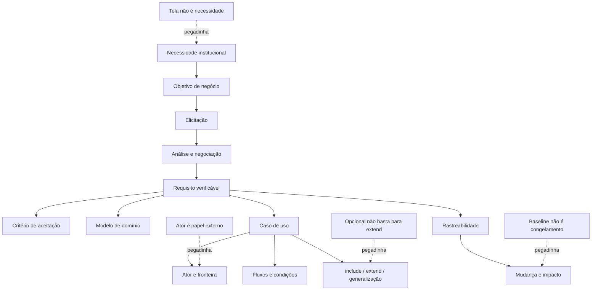
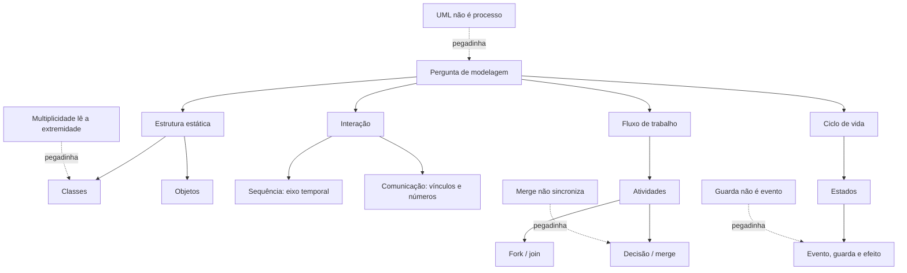

# Dia 1 — Requisitos, análise orientada a objetos e casos de uso

## Objetivo do dia

Transformar uma necessidade institucional em requisitos verificáveis e em um modelo de análise orientado a objetivos dos usuários. Ao final, o estudante deverá distinguir problema, solução, requisito, regra e restrição; conduzir elicitação, análise, especificação, validação e gestão; reconhecer objetos, classes e responsabilidades no domínio; e interpretar casos de uso, atores, fronteira, fluxos e relacionamentos sem atribuir à UML decisões que pertencem ao negócio.

O Dia 1 não ensina diagramas detalhados de classes, sequência, comunicação, atividades ou estados. Esses diagramas entram no Dia 2. Ciclos de vida, testes e qualidade ficam para os Dias 4 e 5.

## Resultados esperados

Ao concluir o dia, você deve conseguir:

- separar necessidade, requisito, regra de negócio, restrição e solução;
- classificar requisitos funcionais, de qualidade, de interface, de dados e restrições;
- reconhecer requisitos claros, necessários, viáveis, consistentes, rastreáveis e verificáveis;
- escolher técnicas de elicitação conforme fonte, incerteza e conflito;
- analisar escopo, dependências, prioridade, risco e critérios de aceitação;
- validar requisitos com os interessados e controlar mudanças por impacto;
- distinguir análise orientada a objetos de projeto orientado a objetos;
- identificar classe, objeto, atributo, operação, responsabilidade e colaboração;
- delimitar ator, objetivo, fronteira e fluxo de um caso de uso;
- empregar inclusão, extensão e generalização pelo significado, não pela aparência;
- recuperar Legislação CRA/CFA e interpretar relações semânticas em Português;
- entregar um caderno de erros sem conteúdo novo.

## Por que esse assunto importa para a prova

O item 13 do conteúdo do cargo prevê análise e projeto orientado a objetos com UML e diagramas de casos de uso. Engenharia de requisitos fornece a ponte entre a necessidade administrativa e esses modelos. Uma questão pode narrar um pedido vago, uma regra institucional, um conflito entre áreas ou uma mudança de escopo e pedir a atividade adequada, o tipo de requisito, a característica ausente ou a relação correta entre casos de uso.

No perfil documentado do Instituto Consulplan, o detalhe discriminador costuma estar no verbo e no efeito: “o sistema deve emitir” descreve comportamento; “em até dois segundos” estabelece qualidade mensurável; “conforme norma vigente” introduz restrição; “sempre autenticar antes de protocolar” pode justificar comportamento comum incluído. Leia o caso antes de procurar a sigla.

## Jornada resumida — 6 horas líquidas

| Sessão | Etapa | Tempo | Entrega |
|---|---|---:|---|
| A | Bloco 1 | 55 min | quadro `necessidade × requisito × regra × restrição` |
| A | Bloco 2 | 55 min | cadeia de elicitação, análise, especificação, validação e mudança |
| A | Bloco 3 | 60 min | modelo de domínio e caso de uso do protocolo digital |
| B | Bloco 4 | 60 min | revisão Legislação CFA/CRA + filas D+21/D+7/D+2 |
| B | Bloco 5 | 30 min | Português: inferência, coesão e reescrita |
| B | Bloco 6 | 15 min | recuperação sem consulta e caderno de erros |
| B | Mini revisão | 10 min | dez respostas orais e conferência |
| B | Seis Essenciais D0 | 25 min | S4D1Q001–S4D1Q006 |
| B | Correção A–D | 25 min | justificativa de todas as alternativas |
| B | Fechamento | 5 min | confiança e agendamento |
| — | Consolidação | 20 min | registro final de erros e datas |
| **Total** |  | **360 min** | **dia encerrado sem esgotar o banco** |

**Ponto de parada da Sessão A:** entregar uma folha com cinco requisitos reescritos, seus critérios de aceitação, quatro elementos do modelo de domínio e um caso de uso com fluxo principal e duas alternativas. Pare a teoria aos **170 minutos** mesmo que sobrem leituras; o restante do banco abre ciclos futuros. Os 60 minutos do Bloco 4 acomodam, nesta ordem, a revisão fixa e as filas vencidas D+21 da Semana 1, D+7 da Semana 3 e D+2 imediatamente aplicável, sem aumentar as seis horas.

## Matriz de rastreabilidade do Dia 1

| Tópico do edital | Teoria anterior à cobrança | Exemplos completos | Principais | Extras | Status |
|---|---|---:|---|---|---|
| requisitos: conceitos, tipos e qualidade | [Bloco 1](#s4-d1-b1) | 4 | S4D1Q001–S4D1Q010 | — | Coberto |
| elicitação, análise, especificação e validação | [Bloco 2](#s4-d1-b2) | 6 | S4D1Q011–S4D1Q030 | — | Coberto |
| análise e projeto orientado a objetos | [Análise OO](#s4-d1-oo) | 2 | S4D1Q031–S4D1Q038 | — | Coberto |
| casos de uso e relacionamentos | [Casos de uso](#s4-d1-casos-uso) | 6 | S4D1Q039–S4D1Q050 | — | Coberto |
| Legislação CFA/CRA | [Bloco 4](#s4-d1-b4) | 2 | — | 1.1–1.10 | Coberto por revisão |
| Português | [Bloco 5](#s4-d1-b5) | 2 | — | 1.11–1.20 | Coberto por revisão |
| recuperação ativa | [Bloco 6](#s4-d1-b6) | entrega prática | — | sem item objetivo | Coberto; sem teoria nova |

## Bloco 1 — Fundamentos, tipos e qualidade dos requisitos

### 1. Necessidade, requisito, regra, restrição e solução

**Necessidade** é o problema ou resultado desejado: reduzir o tempo de resposta ao profissional. **Requisito** expressa uma capacidade, condição ou qualidade que o sistema deve satisfazer: permitir consulta ao andamento pelo número do protocolo. **Regra de negócio** determina ou limita o comportamento do domínio: somente processo com decisão publicada pode aparecer como encerrado. **Restrição** reduz o espaço de solução, por exemplo integração obrigatória com serviço institucional já existente. **Solução** é uma forma concreta de atender aos requisitos; tela, banco e framework não devem aparecer como necessidade quando ainda existem alternativas legítimas.

O requisito deve indicar o efeito observável, o sujeito responsável e o contexto. “Criar uma tela moderna” descreve prematuramente uma interface. “Permitir ao fiscal registrar vistoria em dispositivo móvel, inclusive sem conexão, e sincronizar depois” revela capacidade e condições que podem ser verificadas.

### 2. Tipos e níveis de requisitos

| Categoria | Pergunta central | Exemplo no CRA |
|---|---|---|
| objetivo/negócio | por que o investimento existe? | reduzir retrabalho no protocolo |
| usuário/interessado | o que o papel precisa alcançar? | fiscal consulta processos atribuídos |
| funcional | que comportamento o sistema oferece? | sistema registra despacho e notifica interessado |
| qualidade ou não funcional | quão bem ou sob qual qualidade? | consulta responde em até dois segundos no percentil definido |
| interface externa | com que pessoa ou sistema interage? | consumir identidade institucional |
| dados | que informação, regra e retenção são necessárias? | guardar autor, instante e versão do despacho |
| restrição | que limite obrigatório condiciona a solução? | utilizar infraestrutura homologada |
| derivado | que necessidade nasce de outra? | auditoria é derivada da exigência de responsabilização |

“Não funcional” não significa opcional nem alheio ao usuário. Desempenho, disponibilidade, segurança, acessibilidade e usabilidade afetam o serviço e precisam ser mensuráveis. Uma regra de negócio pode originar vários requisitos funcionais e de dados, mas não se confunde automaticamente com eles.

### 3. Qualidade, critérios de aceitação e verificabilidade

Um requisito útil deve ser, no contexto do projeto:

- **necessário:** sua ausência compromete objetivo ou obrigação;
- **claro e singular:** evita termos vagos e mistura de comportamentos independentes;
- **consistente:** não contradiz outro requisito válido;
- **viável:** pode ser implementado dentro das restrições conhecidas;
- **rastreável:** possui origem e ligações com objetivos, modelos, testes e mudanças;
- **verificável:** permite evidência objetiva de atendimento;
- **priorizado:** tem importância relativa e justificativa;
- **modificável:** pode ser alterado com impacto identificável.

Termos como “rápido”, “intuitivo”, “seguro” e “quando possível” não bastam sem métrica e contexto. Um **critério de aceitação** concretiza a condição observável. Para desempenho, informe operação, carga, ambiente, medida e limiar; para permissão, informe papel, recurso, operação e resultado esperado. Verificabilidade não significa que todo requisito precise ser demonstrado exclusivamente por teste: inspeção, análise, demonstração e teste são formas possíveis de obter evidência objetiva, conforme a natureza do requisito.

### Exemplos resolvidos — fundamentos e tipos

#### Exemplo 1 — desejo de gestão não é requisito de solução

**Situação:** a direção declara: “precisamos diminuir o prazo médio de resposta dos protocolos”.

**Dados relevantes:** há um resultado institucional, mas não foi definida capacidade do sistema nem solução.

**Raciocínio passo a passo:**

1. identificar o verbo “diminuir” e o indicador “prazo médio”;
2. reconhecer um objetivo de negócio;
3. evitar inventar tela, aplicativo ou automação;
4. derivar requisitos somente após entender causas, usuários e fluxo.

**Resposta:** a frase é objetivo/necessidade de negócio; ainda precisa ser decomposta em requisitos verificáveis.

**Por que funciona:** preserva o problema antes de escolher a solução.

**Erro provável:** classificar a frase como requisito funcional apenas porque pode motivar software.

#### Exemplo 2 — regra e requisito trabalham juntos

**Situação:** a área afirma que somente servidores designados podem assinar determinado despacho.

**Dados relevantes:** há condição do domínio, sujeito autorizado e ação protegida.

**Raciocínio passo a passo:**

1. registrar a regra de negócio sobre autorização;
2. derivar o requisito funcional de impedir assinatura por papel não designado;
3. derivar requisito de dados para manter designações vigentes;
4. definir critério de aceitação para autorizado e não autorizado.

**Resposta:** a declaração é regra de negócio que origina requisitos funcionais, de dados e testes de permissão.

**Por que funciona:** separa a política institucional dos mecanismos que a realizam.

**Erro provável:** chamar a própria regra de “tela de login”.

### Exemplos resolvidos — qualidade e aceitação

#### Exemplo 1 — tornar desempenho verificável

**Situação:** o rascunho diz: “a consulta deve ser rápida”.

**Dados relevantes:** não há operação delimitada, carga, estatística nem limite.

**Raciocínio passo a passo:**

1. identificar a consulta crítica;
2. fixar um cenário de carga representativo;
3. escolher métrica, como tempo de resposta no percentil 95;
4. definir limiar e ambiente de medição.

**Resposta possível:** “sob até 200 consultas concorrentes no ambiente de homologação definido, 95% das consultas de protocolo devem responder em até dois segundos”.

**Por que funciona:** produz evidência repetível de aceitação.

**Erro provável:** trocar “rápida” por “muito rápida” sem criar métrica.

#### Exemplo 2 — separar duas obrigações

**Situação:** “o sistema deve receber o pedido, validar anexos, calcular taxa e enviar confirmação”.

**Dados relevantes:** quatro comportamentos podem mudar, falhar ou ser priorizados separadamente.

**Raciocínio passo a passo:**

1. localizar cada verbo;
2. dividir os comportamentos em requisitos singulares;
3. registrar dependências e ordem;
4. criar critérios próprios para sucesso e falha.

**Resposta:** o enunciado deve ser decomposto em requisitos ligados por rastreabilidade.

**Por que funciona:** singularidade facilita análise de impacto e teste.

**Erro provável:** preservar a frase porque ela é gramaticalmente clara, ignorando sua indivisibilidade gerencial.

## Bloco 2 — Elicitação, análise, especificação, validação e gestão

### 4. Elicitação: descobrir, não apenas perguntar

Elicitar é obter e explorar informação de fontes relevantes. O analista prepara objetivo, seleciona participantes, aplica técnica, registra evidência e confirma entendimento. Entrevista aprofunda decisões e exceções; oficina aproxima áreas em conflito; observação revela trabalho real e atalhos; análise documental recupera regras e formulários; questionário amplia alcance; protótipo explora interação e reduz mal-entendidos. Nenhuma técnica garante sozinha requisito completo.

O interessado não é apenas o usuário da tela. Inclui patrocinador, operador, suporte, segurança, jurídico, dono do processo, responsáveis por sistemas externos ou integrações e pessoas afetadas. Um componente técnico, uma norma ou um sistema externo é fonte ou elemento do contexto; não se torna, por si só, parte interessada. A escolha deve considerar poder decisório, conhecimento, impacto e disponibilidade.

### 5. Análise, modelagem e priorização

Analisar significa eliminar duplicidades, descobrir lacunas, resolver conflitos, delimitar escopo, verificar viabilidade, decompor requisitos, modelar relações e avaliar dependências. Priorizar não é obedecer à pessoa mais influente sem critério. Valor, risco, obrigação, custo, dependência e urgência precisam estar explícitos.

Quando duas áreas discordam, registre a fonte e a razão de cada posição, procure regra superior ou objetivo comum, avalie alternativas e obtenha decisão do responsável. Não “valide” o requisito escolhendo silenciosamente uma versão.

Um modelo é representação parcial para responder perguntas. Modelo de contexto esclarece fronteira e interfaces; modelo de domínio organiza conceitos; caso de uso mostra objetivos e interações; protótipo explora interface. O modelo não substitui conversa nem cria automaticamente verdade.

### 6. Especificação e validação

Especificar é registrar requisitos e atributos com precisão adequada ao trabalho: identificador, texto, fonte, justificativa, prioridade, estado, critérios e relações. Validação pergunta se o conjunto representa a necessidade correta; verificação interna examina clareza, consistência e conformidade do artefato. Revisões, inspeções, protótipos e derivação de testes ajudam a encontrar defeitos cedo.

Perguntas de validação:

1. este requisito é necessário e está dentro do escopo?
2. pessoas afetadas e responsáveis concordam com o significado?
3. existe conflito com outra regra?
4. é viável nas restrições conhecidas?
5. existe método adequado — como inspeção, análise, demonstração ou teste — para obter evidência objetiva de atendimento?
6. origem e critérios estão registrados?

### 7. Gestão, baseline, mudança e rastreabilidade

Requisitos mudam. A gestão controla versão, estado, responsável, baseline, solicitação, decisão e impacto. **Baseline** é uma versão acordada usada como referência; não congela eternamente o projeto. Uma mudança deve ser identificada, analisada, aprovada ou rejeitada por autoridade definida, incorporada de forma controlada e comunicada.

A rastreabilidade pode ligar:

- objetivo → requisito;
- fonte → requisito;
- requisito → modelo/caso de uso;
- requisito → componente;
- requisito → teste;
- requisito → solicitação de mudança.

Rastreabilidade bidirecional permite descobrir tanto “por que isto existe?” quanto “o que será afetado?”. Uma matriz cheia de IDs sem relações confiáveis não é rastreabilidade útil.

### Exemplos resolvidos — elicitação

#### Exemplo 1 — procedimento declarado e procedimento real

**Situação:** o manual diz que todo protocolo segue a mesma fila, mas atendentes relatam exceções frequentes.

**Dados relevantes:** documento e prática divergem; a exceção influencia requisitos.

**Raciocínio passo a passo:**

1. analisar o manual para obter regra declarada;
2. observar amostras do trabalho e entrevistar operadores;
3. registrar divergências sem assumir que a prática é correta;
4. levar as exceções ao dono do processo para decisão.

**Resposta:** combinar análise documental, observação e entrevista, seguida de validação institucional.

**Por que funciona:** triangula fontes e separa fato observado de regra autorizada.

**Erro provável:** escolher apenas o manual ou automatizar toda exceção observada.

#### Exemplo 2 — conflito entre unidades

**Situação:** fiscalização quer campos obrigatórios; atendimento quer protocolo mínimo para reduzir fila.

**Dados relevantes:** objetivos legítimos competem e há dependência entre etapas.

**Raciocínio passo a passo:**

1. reunir representantes com poder e conhecimento;
2. mapear objetivo, risco e momento de cada informação;
3. explorar preenchimento progressivo e critérios de completude;
4. registrar decisão, responsável e itens pendentes.

**Resposta:** uma oficina facilitada é adequada para construir entendimento comum e decidir trade-offs.

**Por que funciona:** o conflito é tratado coletivamente com critérios verificáveis.

**Erro provável:** aplicar questionário isolado e considerar vencedora a maioria.

### Exemplos resolvidos — análise e priorização

#### Exemplo 1 — prioridade depende de obrigação e dependência

**Situação:** há três pedidos: tema visual, adequação obrigatória com prazo e relatório que depende dessa adequação.

**Dados relevantes:** valor, obrigação, prazo e dependência não são iguais.

**Raciocínio passo a passo:**

1. identificar a obrigação e seu prazo;
2. mapear o relatório dependente;
3. avaliar valor e custo do tema visual;
4. ordenar com justificativa e capacidade disponível.

**Resposta:** a adequação tende a preceder o relatório dependente; o tema visual não vence apenas por visibilidade.

**Por que funciona:** usa múltiplos critérios e relações técnicas.

**Erro provável:** priorizar por ordem de chegada sem avaliar obrigação.

#### Exemplo 2 — requisito fora da fronteira

**Situação:** o projeto é consulta de protocolo; durante a oficina pedem substituir todo o sistema financeiro.

**Dados relevantes:** o pedido pode ser valioso, mas não decorre do objetivo nem da fronteira aprovada.

**Raciocínio passo a passo:**

1. comparar pedido com objetivo e escopo;
2. registrar a necessidade sem descartá-la informalmente;
3. avaliar interfaces necessárias;
4. encaminhar eventual iniciativa separada à governança.

**Resposta:** manter apenas a integração necessária no escopo e tratar a substituição como demanda distinta.

**Por que funciona:** evita expansão silenciosa e preserva rastreabilidade da decisão.

**Erro provável:** implementar o novo pedido porque surgiu de interessado legítimo.

### Exemplos resolvidos — validação, mudança e rastreabilidade

#### Exemplo 1 — protótipo aprovado não valida tudo

**Situação:** usuários aprovam as telas de consulta; não foram discutidos autorização, carga nem indisponibilidade.

**Dados relevantes:** a aparência foi explorada, mas qualidades e exceções permanecem abertas.

**Raciocínio passo a passo:**

1. delimitar o que o protótipo demonstrou;
2. listar requisitos não exercitados;
3. validar fluxos, regras e qualidades por técnicas adequadas;
4. registrar decisões e lacunas.

**Resposta:** a aprovação valida aspectos da interação, não o conjunto integral de requisitos.

**Por que funciona:** cada evidência sustenta apenas o que realmente examinou.

**Erro provável:** tratar protótipo visual como aceite técnico completo.

#### Exemplo 2 — impacto de mudança

**Situação:** após baseline, muda o prazo de recurso de dez para cinco dias no cenário do projeto.

**Dados relevantes:** a regra afeta validação de data, mensagens, caso de uso, testes e talvez integração.

**Raciocínio passo a passo:**

1. abrir solicitação com fonte e justificativa;
2. seguir ligações do requisito para modelos, componentes e testes;
3. estimar impacto e obter decisão;
4. atualizar versão, artefatos e comunicação.

**Resposta:** a baseline é alterada de modo controlado após análise; não se edita apenas a frase original.

**Por que funciona:** a rastreabilidade reduz omissões e mantém coerência.

**Erro provável:** rejeitar a mudança porque a baseline seria imutável.

## Bloco 3 — Análise orientada a objetos e casos de uso

### 8. Análise e projeto orientado a objetos

Na **análise**, o foco é compreender conceitos, responsabilidades e colaborações do domínio, evitando detalhes desnecessários de tecnologia. No **projeto**, essas abstrações recebem decisões de software: interfaces, classes de controle, persistência, padrões e distribuição de responsabilidades.

**Objeto** é uma ocorrência com identidade, estado e comportamento. **Classe** descreve características e operações compartilhadas por objetos. **Atributo** representa estado relevante; **operação** expressa comportamento. **Abstração** seleciona propriedades úteis; **encapsulamento** protege decisões internas atrás de responsabilidades; **generalização** organiza especialização; **associação** representa vínculo significativo.

Uma classe de análise deve ter responsabilidade coerente. **Alta coesão** mantém responsabilidades relacionadas; **baixo acoplamento** reduz dependências desnecessárias. Substantivo não vira classe automaticamente: “sistema”, “cadastro” e “dados” podem ser vagos; verbos também não viram operações sem examinar quem possui a responsabilidade.

### Exemplos resolvidos — análise orientada a objetos

#### Exemplo 1 — localizar conceitos do domínio

**Situação:** “O profissional envia requerimento; o protocolo registra data e o servidor responsável profere despacho”.

**Dados relevantes:** existem participantes, artefatos com identidade e comportamentos.

**Raciocínio passo a passo:**

1. identificar Profissional, Requerimento, Protocolo, Servidor e Despacho como candidatos;
2. rejeitar “envia” e “registra” como classes;
3. atribuir responsabilidades sem decidir banco ou framework;
4. validar termos com especialistas.

**Resposta:** os substantivos relevantes são candidatos a classes do domínio, sujeitos a validação; verbos sugerem associações e responsabilidades.

**Por que funciona:** a análise modela significado antes de tecnologia.

**Erro provável:** criar uma classe para cada substantivo e um método em uma classe central “Sistema”.

#### Exemplo 2 — mover responsabilidade para o dono da informação

**Situação:** uma classe ControladorGeral calcula prazo, muda situação, gera documento, autentica e envia e-mail.

**Dados relevantes:** responsabilidades pertencem a conceitos e serviços distintos.

**Raciocínio passo a passo:**

1. agrupar cada comportamento por informação necessária;
2. atribuir cálculo de prazo ao conceito/política correspondente;
3. separar autenticação e notificação como colaborações;
4. manter um coordenador apenas para orquestração indispensável.

**Resposta:** redistribuir responsabilidades aumenta coesão e reduz dependência de uma classe central.

**Por que funciona:** cada elemento passa a ter motivo mais claro para mudar.

**Erro provável:** considerar encapsulamento apenas como tornar todos os atributos privados, sem rever responsabilidades.

### 9. Casos de uso: ator, objetivo, fronteira e fluxo

Um **caso de uso** representa um conjunto de comportamentos do sistema que produz resultado de valor para um ator. O nome costuma usar verbo no infinitivo e objeto: “Consultar andamento”. **Ator** é um papel externo que interage com o sistema; não é necessariamente pessoa, cargo nominal nem objeto interno. Um mesmo indivíduo pode desempenhar mais de um papel, e outro sistema pode ser ator.

A **fronteira** mostra o sistema modelado. Atores ficam fora; casos de uso, dentro. Caso de uso não é tela, botão, etapa interna isolada nem organograma. Sua descrição textual pode conter:

- objetivo e escopo;
- ator primário e interessados;
- gatilho;
- precondições;
- fluxo principal;
- fluxos alternativos e de exceção;
- pós-condições de sucesso e garantia mínima;
- regras e requisitos relacionados.

Precondição é estado assumido antes do início, não passo executado pelo caso. Pós-condição descreve estado garantido ao final, não desejo genérico.

### 10. Inclusão, extensão e generalização

**Inclusão — «include»:** o caso base incorpora obrigatoriamente o comportamento reutilizado. A seta de dependência parte do caso base e aponta para o incluído. Use para comportamento comum significativo; não decomponha cada clique.

**Extensão — «extend»:** o caso extensor acrescenta fragmentos de comportamento em um ou mais pontos de extensão de um caso base que permanece significativo sem ele. A seta parte do extensor e aponta para o caso base. A condição é opcional na UML 2.5.1: se existir, deve ser satisfeita quando o primeiro ponto de extensão for alcançado; sem condição associada, a extensão é incondicional nos pontos especificados.

**Generalização:** ator ou caso específico herda relações e comportamento do mais geral e pode especializá-lo. Não equivale a include nem a sequência temporal.

Entre casos de uso, simples ordem “A acontece antes de B” não cria include. Obrigatoriedade, reutilização e autonomia do objetivo precisam ser avaliadas.

### Exemplos resolvidos — casos de uso

#### Exemplo 1 — ator é papel externo

**Situação:** Ana consulta o próprio protocolo e, em outro momento, atua como servidora que analisa requerimentos.

**Dados relevantes:** a mesma pessoa exerce objetivos e permissões distintos.

**Raciocínio passo a passo:**

1. abstrair a pessoa nominal;
2. identificar os papéis “Interessado” e “Analista”;
3. ligar cada papel aos objetivos pertinentes;
4. não modelar o banco como ator se ele pertence ao sistema.

**Resposta:** Ana pode instanciar dois atores/papéis diferentes no modelo.

**Por que funciona:** ator representa relação com o sistema, não identidade civil.

**Erro provável:** criar ator “Ana” ou fundir os papéis por serem exercidos pela mesma pessoa.

#### Exemplo 2 — fronteira correta

**Situação:** o Portal de Serviços consulta um provedor externo de identidade.

**Dados relevantes:** o Portal é o sistema modelado; o provedor está fora e interage com ele.

**Raciocínio passo a passo:**

1. declarar o escopo do Portal;
2. colocar os casos do Portal dentro da fronteira;
3. representar o provedor externo como ator de apoio;
4. evitar desenhar classes internas no diagrama de casos.

**Resposta:** Provedor de Identidade é ator externo; autenticação interna do Portal é comportamento, conforme o recorte.

**Por que funciona:** a fronteira define o que será construído e o que apenas colabora.

**Erro provável:** afirmar que sistema nunca pode ser ator.

### Exemplos resolvidos — fluxos e condições

#### Exemplo 1 — fluxo principal e alternativa

**Situação:** no caso “Protocolar requerimento”, anexos válidos geram número; anexo inválido solicita correção.

**Dados relevantes:** há caminho normal e desvio sob condição verificável.

**Raciocínio passo a passo:**

1. escrever o fluxo principal com submissão, validação, registro e confirmação;
2. localizar a condição “anexo inválido”;
3. registrar fluxo alternativo no passo de validação;
4. definir pós-condição de sucesso e garantia mínima.

**Resposta:** confirmação e número pertencem ao sucesso; rejeição orientada é fluxo alternativo, não novo ator.

**Por que funciona:** o desvio permanece relacionado ao mesmo objetivo.

**Erro provável:** criar um caso de uso para cada mensagem de erro.

#### Exemplo 2 — precondição não é primeiro passo

**Situação:** “o interessado está autenticado” foi escrito como passo 1 de “Consultar dados restritos”.

**Dados relevantes:** autenticação já deve existir quando o caso começa.

**Raciocínio passo a passo:**

1. perguntar se o caso executa ou apenas assume o estado;
2. se assume, registrar como precondição;
3. se autenticar é comportamento obrigatório reutilizável, modelar separadamente conforme escopo;
4. não duplicar a mesma ação em todos os fluxos.

**Resposta:** no enunciado, “estar autenticado” é precondição.

**Por que funciona:** separa estado de entrada de interação realizada pelo caso.

**Erro provável:** tratar toda precondição como include.

### Exemplos resolvidos — include, extend e generalização

#### Exemplo 1 — comportamento obrigatório reutilizado

**Situação:** “Protocolar recurso” e “Atualizar cadastro” sempre precisam “Validar identidade”, que possui fluxo significativo próprio.

**Dados relevantes:** o comportamento é comum e obrigatório nos dois casos.

**Raciocínio passo a passo:**

1. confirmar obrigatoriedade;
2. confirmar reutilização por mais de um caso;
3. preservar resultado compreensível do comportamento;
4. ligar os casos base ao incluído.

**Resposta:** modelar «include» de ambos os casos para “Validar identidade”.

**Por que funciona:** inclusão representa execução obrigatória do comportamento comum.

**Erro provável:** inverter a seta ou usar extend por haver mais de um consumidor.

#### Exemplo 2 — complemento condicional

**Situação:** após “Emitir certidão”, o usuário pode solicitar envio postal mediante escolha e pagamento; emitir certidão continua completo sem isso.

**Dados relevantes:** o comportamento adicional é opcional/condicional e o caso base é autônomo.

**Raciocínio passo a passo:**

1. verificar que a emissão produz valor sem envio postal;
2. identificar condição explícita;
3. modelar “Solicitar envio postal” como extensor;
4. apontar o extensor para “Emitir certidão”.

**Resposta:** usar «extend» condicionado à escolha e às regras aplicáveis.

**Por que funciona:** extensão acrescenta comportamento sem tornar o caso base incompleto.

**Erro provável:** usar include apenas porque o envio ocorre depois da emissão.

### 11. Prática guiada — protocolo digital rastreável

Modele o cenário: profissional envia requerimento; o sistema valida campos e anexos, gera protocolo, encaminha à unidade competente e permite acompanhamento. Determinadas categorias exigem documento adicional. A direção exige trilha de autoria e resposta da consulta em limite mensurável.

**Passo 1 — requisitos:** escreva três funcionais, um de dados, um de qualidade e uma restrição. Cada um recebe ID, fonte e critério.

**Passo 2 — domínio:** proponha Profissional, Requerimento, Documento, Protocolo e Unidade; atribua uma responsabilidade principal a cada conceito.

**Passo 3 — casos:** crie “Protocolar requerimento” e “Consultar andamento”; use extensão apenas se o documento adicional for condicional e estiver modelado como comportamento que realmente justifique caso separado.

**Passo 4 — validação:** simule sucesso, documento inválido, categoria especial, indisponibilidade e acesso sem permissão.

**Produto:** uma folha com requisitos, relações, fluxos e cinco ligações de rastreabilidade. Se alguma decisão depender de regra não fornecida, marque-a como questão aberta; não invente literalidade.

## Bloco 4 — Revisão fixa: Legislação CRA/CFA

Esta é recuperação da base já aprovada na Semana 3, especialmente [fonte, competência e hierarquia](../semana_03/semana_03_estudo.md#s3-d1-revisao-legislacao). Antes das extras, recupere:

| Indício | Regra de decisão |
|---|---|
| orientação e normatização do sistema | verificar competência do CFA e a fonte aplicável |
| registro e fiscalização na jurisdição paranaense | verificar atribuição regional do CRA-PR |
| lei, decreto e resolução | objeto, competência e hierarquia; novidade cronológica não basta |
| organização interna do CRA-PR | consultar o Regimento aprovado pela RN CFA nº 651/2024, vigente na consulta oficial de 19/07/2026 |
| conduta ética | consultar o Código de Ética aprovado pela RN CFA nº 671/2025, vigente na consulta oficial de 19/07/2026 |

Não deduza artigo, prazo ou sanção que não esteja no texto oficial. O bloco treina localização de fonte e competência, não aprofundamento literal reservado à Semana 6.

### Exemplos resolvidos — Legislação CRA/CFA

#### Exemplo 1 — fato regional e orientação nacional

**Situação:** chega notícia de possível exercício irregular no Paraná e surge dúvida interpretativa relevante para todo o sistema.

**Dados relevantes:** execução territorial e orientação sistêmica são planos distintos.

**Raciocínio passo a passo:** localizar o fato; identificar atribuição regional; separar orientação/normatização nacional; consultar as fontes vigentes.

**Resposta:** o CRA-PR atua no âmbito regional de suas atribuições, enquanto o CFA exerce as competências nacionais correspondentes.

**Por que funciona:** distribui papéis sem transformar autonomia em soberania.

**Erro provável:** atribuir toda providência ao CFA ou permitir atuação regional sem jurisdição.

#### Exemplo 2 — ato inferior e lei

**Situação:** uma leitura de resolução parece afastar requisito expresso em lei.

**Dados relevantes:** existe conflito aparente entre atos de níveis diferentes.

**Raciocínio passo a passo:** conferir redação, vigência, objeto e competência; interpretar o ato inferior nos limites da lei; não decidir apenas pela data.

**Resposta:** a resolução não supera automaticamente a lei por ser mais recente.

**Por que funciona:** cronologia não apaga hierarquia e competência.

**Erro provável:** aplicar “norma posterior” sem verificar nível e objeto.

## Bloco 5 — Português: inferência, coesão e reescrita

### 12. Modalidade, referência e preservação de sentido

Palavras de modalidade alteram o alcance: **pode** indica possibilidade ou permissão conforme o contexto; **deve** expressa obrigação ou conclusão forte; **tende a** aponta propensão; **sempre** universaliza. Trocar uma pela outra pode tornar falsa uma reescrita.

Na coesão, pronome e expressão substitutiva precisam ter antecedente identificável. Conectores explicitam relações: porque/pois podem marcar causa ou explicação; portanto/logo, consequência; embora/ainda que, concessão; se/caso, condição; para que/a fim de que, finalidade.

Reescrita correta preserva sentido relevante, relações lógicas, referência, tempo, voz e escopo. Passar da ativa para a passiva exige conservar agente e paciente quando isso importa.

### Exemplos resolvidos — Português

#### Exemplo 1 — possibilidade não vira garantia

**Situação:** “A rastreabilidade pode reduzir omissões na análise de impacto.”

**Dados relevantes:** o verbo modal não promete resultado universal.

**Raciocínio passo a passo:** localizar “pode”; interpretar possibilidade; rejeitar “elimina” e “sempre”; preservar o agente causal provável.

**Resposta:** é válida a paráfrase “a rastreabilidade é capaz de contribuir para a redução de omissões”, sem garantia absoluta.

**Por que funciona:** mantém a modalidade.

**Erro provável:** trocar “pode reduzir” por “impede qualquer omissão”.

#### Exemplo 2 — conector define o vínculo

**Situação:** “Os critérios eram vagos; portanto, não se podia verificar o requisito.”

**Dados relevantes:** a primeira oração apresenta causa; a segunda, consequência.

**Raciocínio passo a passo:** perguntar qual fato explica o outro; manter direção causa → efeito; testar conectores; rejeitar concessão.

**Resposta:** “por isso” preserva o vínculo de consequência; “embora” o alteraria.

**Por que funciona:** o conector substituto mantém a relação lógica.

**Erro provável:** considerar todo conector intercambiável porque une orações.

**Entrega:** reescreva duas frases técnicas: uma preservando modalidade e outra trocando ativa por passiva sem inverter papéis.

## Bloco 6 — Recuperação ativa e caderno de erros

**Tempo:** 15 minutos. **Não há conteúdo novo neste bloco.** Ele recupera apenas os Blocos 1–5 e pontos já estudados.

Sem consulta:

1. dê um exemplo de requisito funcional e outro de qualidade mensurável;
2. diferencie regra, restrição e solução;
3. escolha técnica para conflito entre áreas e justifique;
4. explique por que baseline não significa imutabilidade;
5. trace objetivo → requisito → caso → teste;
6. diferencie classe e objeto;
7. defina ator pela fronteira;
8. compare include e extend;
9. recupere CFA × CRA-PR;
10. explique por que “pode” não equivale a “sempre”.

Confira com outra cor. Cada falha recebe: resposta inicial, regra correta, contraste, exemplo próprio, âncora, confiança de 0 a 3 e datas D+2, D+7 e D+21. A entrega é uma lista de até cinco erros priorizados e duas respostas reescritas.

## Mapa de conexões do Dia 1

## Tabela de revisão rápida do Dia 1

| Se o enunciado mencionar... | Pense primeiro em... |
|---|---|
| resultado institucional | objetivo/necessidade |
| comportamento observável | requisito funcional |
| tempo, segurança ou disponibilidade mensurável | requisito de qualidade |
| política do domínio | regra de negócio |
| tecnologia obrigatória ou limite imposto | restrição |
| divergência entre manual e prática | triangulação e validação |
| versão acordada | baseline controlada |
| origem e impacto | rastreabilidade |
| ocorrência individual | objeto |
| descrição de ocorrências | classe |
| papel fora da fronteira | ator |
| comportamento comum obrigatório | include |
| fragmento adicional inserido em ponto de extensão de base autônoma, com condição quando prevista | extend |

## Pegadinhas do Dia 1

- requisito não é sinônimo de solução;
- não funcional não significa opcional;
- protótipo aprovado não valida qualidades que ele não exercitou;
- entrevista não substitui confirmação e análise;
- prioridade não é apenas vontade do interessado mais influente;
- baseline admite mudança controlada;
- substantivo é candidato a classe, não classe automática;
- ator é papel externo, inclusive outro sistema;
- precondição não é necessariamente primeiro passo;
- sequência temporal não cria include;
- “opcional” ajuda, mas não basta para justificar extend;
- resolução mais recente não supera lei automaticamente;
- reescrita deve preservar modalidade e relação lógica.

## Mini revisão — dez perguntas

1. Como requisito difere de objetivo de negócio?
2. O que torna “rápido” insuficiente?
3. Qual técnica favorece negociação simultânea de conflito?
4. O que a validação pergunta?
5. Para que serve rastreabilidade bidirecional?
6. Qual o foco da análise OO?
7. Por que pessoa e ator não são sinônimos?
8. Quando usar include?
9. Quando usar extend?
10. Que relação “portanto” costuma marcar?

### Respostas da mini revisão

1. O objetivo expressa resultado; o requisito, capacidade, condição ou qualidade necessária.
2. Falta operação, cenário, métrica e limiar verificável.
3. Oficina facilitada, sem excluir análise posterior.
4. Se o conjunto representa a necessidade correta dos interessados.
5. Descobrir origem e impacto nos dois sentidos.
6. Conceitos, responsabilidades e colaborações do domínio.
7. Ator é papel externo; uma pessoa pode exercer vários.
8. Para comportamento comum e obrigatório incorporado pelo caso base.
9. Para acrescentar fragmento modular em ponto de extensão de um caso base autônomo; a condição pode existir, mas sua ausência torna a extensão incondicional.
10. Conclusão ou consequência.

## Checklist de domínio

- [ ] Distingo necessidade, requisito, regra, restrição e solução.
- [ ] Escrevo requisito funcional e qualidade mensurável.
- [ ] Escolho técnica de elicitação pelo problema.
- [ ] Analiso conflito, escopo, dependência e prioridade.
- [ ] Valido requisito com critério objetivo.
- [ ] Explico baseline, mudança e rastreabilidade.
- [ ] Distingo análise de projeto OO.
- [ ] Identifico classes candidatas e responsabilidades.
- [ ] Delimito atores e fronteira.
- [ ] Escrevo fluxo, precondição e pós-condição.
- [ ] Aplico include, extend e generalização sem usar ordem temporal.
- [ ] Recupero competência e hierarquia no bloco CRA/CFA.
- [ ] Preservo modalidade e relação lógica em reescrita.

## Fila de dez Essenciais e correção

| Ordem | ID | Núcleo | Momento |
|---:|---|---|---|
| 1 | S4D1Q001 | necessidade × requisito — [teoria](#s4-d1-conceitos-requisitos) | D0 |
| 2 | S4D1Q002 | requisito funcional — [teoria](#s4-d1-tipos-requisitos) | D0 |
| 3 | S4D1Q003 | qualidade mensurável — [teoria](#s4-d1-qualidade-requisitos) | D0 |
| 4 | S4D1Q004 | regra de negócio — [teoria](#s4-d1-conceitos-requisitos) | D0 |
| 5 | S4D1Q005 | decomposição de requisito composto e rastreável — [exemplo](#s4-d1-exemplos-qualidade) | D0 |
| 6 | S4D1Q006 | restrição de solução — [teoria](#s4-d1-tipos-requisitos) | D0 |
| 7 | S4D1Q007 | critério de aceitação — [teoria](#s4-d1-qualidade-requisitos) | D+2 |
| 8 | S4D1Q008 | qualidades de um bom requisito — comando negativo — [teoria](#s4-d1-qualidade-requisitos) | D+2 |
| 9 | S4D1Q009 | elicitação — [teoria](#s4-d1-elicitacao) | D+2 |
| 10 | S4D1Q010 | diagnóstico integrado de qualidade — [teoria](#s4-d1-qualidade-requisitos) | D+2 |

Resolva seis no D0. Só avance até dez se houver tempo para corrigir A–D e registrar confiança. Os demais itens seguem o uso declarado: Aprofundamento após D+2, Revisão em D+7 e Simulado no ciclo seguinte.

## Fechamento do Dia 1

O dia encerra quando houver:

- produto da Sessão A entregue;
- seis Essenciais corrigidas A–D;
- duas reescritas de Português conferidas;
- recuperação legal respondida sem consulta;
- erros e acertos inseguros registrados;
- S4D1Q007–S4D1Q010 agendadas para D+2;
- confiança por núcleo e datas D+2/D+7/D+21 registradas.

## Fontes do Dia 1

- Edital CRA-PR 2026, item 13 — arquivo local `../edital/edital_cra_pr_2026_analista_sistemas_retificacao_1.pdf`.
- ISO/IEC/IEEE 29148:2018, página oficial, versão confirmada em 2024 e consultada em 19/07/2026: https://www.iso.org/standard/72089.html
- IEEE Computer Society, SWEBOK Guide V4.0a, áreas de requisitos, consultado em 19/07/2026: https://www.computer.org/education/bodies-of-knowledge/software-engineering/topics
- OMG, UML 2.5.1, especificação formal, consultada em 19/07/2026: https://www.omg.org/spec/UML/2.5.1
- Lei nº 4.769/1965: https://www.planalto.gov.br/ccivil_03/leis/l4769.htm
- Decreto nº 61.934/1967: https://www.planalto.gov.br/ccivil_03/decreto/Antigos/D61934.htm
- RN CFA nº 651/2024 — Regimento do CRA-PR: https://documentos.cfa.org.br/?a=show&c=documento&id=955
- RN CFA nº 671/2025 — Código de Ética: https://documentos.cfa.org.br/?a=show&c=documento&id=1038

---

# Dia 2 — UML: classes, objetos, sequência, comunicação, atividades e estados

## Objetivo do dia

Selecionar e interpretar diagramas UML conforme a pergunta de modelagem. Ao final, o estudante deverá representar estrutura estática com classes e objetos; interações ordenadas no tempo com sequência; colaboração estrutural e ordem numerada com comunicação; fluxos, decisões e paralelismo com atividades; e ciclo de vida reativo com máquina de estados. O foco é semântico: a notação deve preservar multiplicidades, condições, responsabilidades e ordem.

Componentes e implementação ficam para o Dia 3. Processos, ciclos de vida, testes e qualidade pertencem aos Dias 4 e 5; não use esses conteúdos para resolver a fila de hoje.

## Resultados esperados

Ao concluir o dia, você deve conseguir:

- explicar UML como linguagem de modelagem, sem chamá-la de método ou processo;
- escolher um diagrama pela pergunta que precisa ser respondida;
- distinguir classe de objeto e especificação de ocorrência;
- interpretar atributos, operações, visibilidade, associações e multiplicidades;
- separar associação, dependência, agregação, composição e generalização;
- ler linhas de vida, mensagens e fragmentos combinados em sequência;
- comparar sequência e comunicação sem atribuir superioridade universal;
- distinguir decisão de merge e fork de join em atividades;
- interpretar fluxo de controle, fluxo de objeto, guardas e raias;
- modelar estado, evento, guarda, efeito e ações internas;
- diferenciar final de atividade, final de fluxo e estado final;
- recuperar Administração Pública e reescrever frases com concordância e pontuação;
- produzir caderno de erros sem conteúdo novo.

## Por que esse assunto importa para a prova

O item 13 do edital enumera explicitamente classes/objetos, estados, colaboração/comunicação, sequência e atividades. A banca pode apresentar descrição textual de um diagrama, multiplicidades, uma sequência de mensagens ou um fluxo com paralelismo e perguntar qual elemento expressa a semântica pretendida. O erro comum é decidir pelo desenho superficial: losango não basta para diferenciar decisão e merge; losango vazio e preenchido não possuem a mesma força; uma seta entre classes não informa sozinha se há associação ou generalização.

Estratégia: identifique primeiro a pergunta — **estrutura**, **fotografia de instâncias**, **tempo da interação**, **topologia da colaboração**, **fluxo de trabalho** ou **reação a eventos**. Depois examine direção, cardinalidade, guarda e efeito.

## Jornada resumida — 6 horas líquidas

| Sessão | Etapa | Tempo | Entrega |
|---|---|---:|---|
| A | Bloco 1 | 55 min | diagrama de classes e fotografia de objetos |
| A | Bloco 2 | 55 min | uma interação em sequência e comunicação |
| A | Bloco 3 | 60 min | atividade com paralelismo e máquina de estados |
| B | Bloco 4 | 60 min | Administração Pública + filas D+21/D+7/D+2 |
| B | Bloco 5 | 30 min | Português: concordância, pontuação e reescrita |
| B | Bloco 6 | 15 min | recuperação sem consulta |
| B | Mini revisão | 10 min | dez respostas orais e conferência |
| B | Seis Essenciais D0 | 25 min | S4D2Q051–S4D2Q056 |
| B | Correção A–D | 25 min | justificativa de todas as alternativas |
| B | Fechamento | 5 min | confiança e agenda |
| — | Consolidação | 20 min | registro final de erros e datas |
| **Total** |  | **360 min** | **dia encerrado com saldo futuro** |

**Ponto de parada da Sessão A:** representar o mesmo caso em quatro perspectivas, concretizadas por seis representações: classes/objetos, sequência/comunicação, atividade e estados. Pare a teoria aos **170 minutos**; não tente resolver as 70 questões no primeiro contato. O Bloco 4 usa seus 60 minutos para a revisão fixa e as filas vencidas D+21 da Semana 1, D+7 da Semana 3 e D+2 da Semana 4, na ordem definida pela jornada semanal.

## Matriz de rastreabilidade do Dia 2

| Tópico do edital | Teoria anterior à cobrança | Exemplos completos | Principais | Extras | Status |
|---|---|---:|---|---|---|
| UML, classes e objetos | [Bloco 1](#s4-d2-b1) | 6 | S4D2Q051–S4D2Q070 | — | Coberto |
| sequência e comunicação | [Bloco 2](#s4-d2-b2) | 4 | S4D2Q071–S4D2Q082 | — | Coberto |
| atividades | [Atividades](#s4-d2-atividades) | 2 | S4D2Q083–S4D2Q090 | — | Coberto |
| estados | [Máquinas de estados](#s4-d2-estados) | 2 | S4D2Q091–S4D2Q100 | — | Coberto |
| Administração Pública | [Bloco 4](#s4-d2-b4) | 2 | — | 2.1–2.10 | Coberto por revisão |
| Português | [Bloco 5](#s4-d2-b5) | 2 | — | 2.11–2.20 | Coberto por revisão |
| recuperação ativa | [Bloco 6](#s4-d2-b6) | entrega prática | — | sem item objetivo | Coberto; sem teoria nova |

## Bloco 1 — UML, diagramas de classes e de objetos

### 1. UML: linguagem, modelo e escolha de perspectiva

A Unified Modeling Language é uma linguagem padronizada de modelagem. Ela fornece conceitos e notação, mas não impõe sozinha um processo de desenvolvimento, uma ordem fixa de diagramas ou uma ferramenta. **Modelo** reúne elementos e relações para determinada finalidade; **diagrama** é uma apresentação parcial desses elementos. O mesmo elemento pode aparecer em mais de um diagrama, e nenhum diagrama isolado precisa mostrar todo o sistema.

| Pergunta | Perspectiva apropriada |
|---|---|
| quais tipos, propriedades e vínculos existem? | classes |
| quais ocorrências e valores existem num instante? | objetos |
| em que ordem participantes trocam mensagens? | sequência |
| quais participantes colaboram e como mensagens são numeradas? | comunicação |
| como o trabalho flui, decide e paraleliza? | atividades |
| como uma entidade reage a eventos conforme seu estado? | máquina de estados |

Escolher diagrama inadequado não torna a informação falsa, mas pode ocultar o aspecto decisivo. Um diagrama de classes não é a melhor ferramenta para expressar a ordem temporal detalhada de mensagens.

### 2. Classes, objetos, atributos, operações e visibilidade

Uma classe pode ser apresentada em compartimentos de nome, atributos e operações. Notação frequente:

- atributo: `-situacao: Situacao`;
- operação: `+protocolar(pedido: Pedido): Protocolo`;
- visibilidade: `+` pública, `-` privada, `#` protegida e `~` de pacote;
- elemento sublinhado: característica estática/de classificador;
- nome em itálico: elemento abstrato, conforme o contexto.

O diagrama de objetos mostra especificações de instâncias e slots, como `p17:Protocolo` com `situacao = EmAnalise`. Ele é uma fotografia possível, não catálogo de todas as instâncias nem substituto do diagrama de classes.

Operação descreve serviço oferecido; método é uma implementação desse comportamento em determinado contexto. Prova conceitual pode explorar essa distinção sem exigir linguagem de programação.

### 3. Associação, papéis, navegabilidade e multiplicidade

Associação representa relação estrutural entre classificadores. Extremidades podem ter nome de papel, multiplicidade e navegabilidade. Multiplicidade indica quantas instâncias podem ocupar a extremidade para uma instância na extremidade oposta:

| Multiplicidade | Leitura |
|---|---|
| `1` | exatamente uma |
| `0..1` | zero ou uma |
| `*` ou `0..*` | zero ou muitas |
| `1..*` | uma ou muitas |
| `2..5` | de duas a cinco |

Leia pela extremidade. Se `Profissional 1 — 0..* Requerimento`, um Profissional pode estar relacionado a zero ou muitos Requerimentos, e cada Requerimento, no recorte, relaciona-se a exatamente um Profissional.

Navegabilidade trata da capacidade modelada de navegar de uma extremidade à outra; não é sinônimo de cardinalidade, propriedade física de banco nem permissão de segurança.

### 4. Generalização, dependência, agregação e composição

**Generalização:** o específico herda características do geral; a seta com triângulo vazio aponta para o geral. Deve representar relação “é um” semanticamente válida.

**Dependência:** um elemento usa ou é afetado por outro de forma menos estrutural; mudança no fornecedor pode afetar o cliente. Parâmetro temporário pode criar dependência sem associação duradoura.

**Agregação compartilhada:** losango vazio na extremidade do todo; relação todo-parte fraca, sem implicar por si só posse exclusiva ou destruição conjunta.

**Composição:** losango preenchido na extremidade do composto; vínculo todo-parte forte. Uma parte não pode pertencer simultaneamente a mais de um composto, e sua existência está ligada ao composto segundo a semântica modelada.

Losango fica no lado do todo. Composição não é usada apenas porque “há objetos dentro de outros” na implementação. A semântica do ciclo de vida decide.

### Exemplos resolvidos — escolha de diagrama e instâncias

#### Exemplo 1 — fotografia de um protocolo

**Situação:** a equipe quer mostrar que, num cenário, `p17:Protocolo` está `EmAnalise` e ligado a `r8:Requerimento`.

**Dados relevantes:** são ocorrências e valores concretos em um instante.

**Raciocínio passo a passo:** identificar instâncias; registrar slots; conectar os objetos; não generalizar para toda ocorrência.

**Resposta:** usar diagrama de objetos, coerente com as classes e associações correspondentes.

**Por que funciona:** o diagrama mostra uma fotografia do estado das instâncias.

**Erro provável:** usar diagrama de classes e escrever valores como se fossem atributos universais.

#### Exemplo 2 — ordem de chamadas

**Situação:** a pergunta é se a validação ocorre antes da persistência e da notificação.

**Dados relevantes:** o aspecto decisivo é a ordem temporal entre participantes.

**Raciocínio passo a passo:** listar participantes; ordenar mensagens; marcar alternativas; evitar sobrecarregar estrutura.

**Resposta:** diagrama de sequência é a perspectiva mais direta.

**Por que funciona:** o eixo vertical evidencia precedência.

**Erro provável:** escolher classes por haver objetos colaborando.

### Exemplos resolvidos — associação e multiplicidade

#### Exemplo 1 — leitura pelas extremidades

**Situação:** `Unidade 1 — 0..* Servidor`.

**Dados relevantes:** cada marca descreve quantos objetos daquela extremidade se relacionam a um da outra.

**Raciocínio passo a passo:** fixar um Servidor e ler `1` em Unidade; fixar uma Unidade e ler `0..*` em Servidor.

**Resposta:** cada Servidor liga-se a uma Unidade; uma Unidade pode ter zero ou muitos Servidores.

**Por que funciona:** evita inverter a leitura visual.

**Erro provável:** dizer que cada Servidor possui muitas Unidades porque `0..*` está próximo dele.

#### Exemplo 2 — intervalo obrigatório

**Situação:** cada comissão deve ter de três a cinco membros, e um servidor pode não integrar comissão.

**Dados relevantes:** há limites mínimo/máximo distintos nos dois lados.

**Raciocínio passo a passo:** na extremidade Membro, usar `3..5` para cada Comissão; na extremidade Comissão, usar `0..*` para cada Servidor; validar se múltiplas comissões são permitidas.

**Resposta:** as multiplicidades registram as duas regras separadamente.

**Por que funciona:** mínimo e máximo são propriedades do vínculo em cada extremidade.

**Erro provável:** usar `1..*` e perder o limite máximo.

### Exemplos resolvidos — relações estruturais

#### Exemplo 1 — composição e ciclo de vida

**Situação:** um Processo possui Peças numeradas que não existem fora dele nem podem migrar para outro Processo.

**Dados relevantes:** exclusividade de pertencimento e ciclo de vida dependente foram definidos.

**Raciocínio passo a passo:** verificar relação todo-parte; confirmar exclusividade; confirmar dependência existencial; posicionar losango no Processo.

**Resposta:** composição pode representar `Processo◆—Peça`.

**Por que funciona:** a semântica forte foi fornecida, não inferida do desenho.

**Erro provável:** colocar o losango na Peça.

#### Exemplo 2 — uso temporário não é associação obrigatória

**Situação:** GeradorDeRelatorio recebe um Formatador como parâmetro apenas durante a operação.

**Dados relevantes:** não foi informado vínculo estrutural mantido.

**Raciocínio passo a passo:** observar uso transitório; reconhecer que mudança no tipo pode afetar o cliente; evitar inventar propriedade duradoura.

**Resposta:** uma dependência pode ser suficiente no modelo.

**Por que funciona:** representa uso sem exagerar a estrutura.

**Erro provável:** modelar composição só porque um objeto chama operação de outro.

## Bloco 2 — Diagramas de sequência e de comunicação

### 5. Sequência: linhas de vida, mensagens e ocorrências

O diagrama de sequência enfatiza a ordem temporal. Participantes aparecem no eixo horizontal; o tempo progride de cima para baixo. A linha de vida representa a existência do participante na interação; a especificação de execução mostra período em que executa comportamento.

Mensagens podem representar chamada síncrona, envio assíncrono, resposta, criação ou destruição. Na síncrona, o emissor normalmente aguarda conclusão; na assíncrona, o envio não pressupõe a mesma espera. Mensagem de retorno pode ser omitida quando o contexto é claro. A ordem vertical continua decisiva.

Criação deve iniciar a linha de vida no ponto correspondente; destruição encerra a linha. Uma mensagem encontrada ou perdida indica extremidade fora do recorte da interação, não “erro de rede” automático.

### 6. Fragmentos combinados, guardas e repetição

| Operador | Semântica principal |
|---|---|
| `alt` | alternativas mutuamente escolhidas por guardas |
| `opt` | trecho condicional único |
| `loop` | repetição segundo condição/limites |
| `par` | operandos com potencial de execução paralela |
| `break` | trecho que, quando executado, abandona o restante da interação envolvente |

Guardas aparecem entre colchetes e precisam ser distinguíveis. `alt` não significa que todos os operandos executam; `par` não obriga ordem total entre operandos, embora preserve ordens internas relevantes.

### 7. Comunicação: vínculos e mensagens numeradas

O diagrama de comunicação modela interação como participantes conectados e mensagens sobre os vínculos. A ordem é indicada por numeração, inclusive níveis como `1`, `1.1` e `1.2`. Ele enfatiza organização estrutural da colaboração; sequência enfatiza o eixo temporal.

Ambos podem representar a mesma interação sob perspectivas diferentes. Comunicação não é o antigo diagrama de componentes; “colaboração” é denominação histórica associada a essa perspectiva. Ao converter:

1. preserve participantes;
2. preserve mensagens e guardas;
3. transforme posição vertical em numeração consistente;
4. preserve aninhamento e ordem.

### Exemplos resolvidos — sequência

#### Exemplo 1 — alternativa de validação

**Situação:** após `validar()`, se os anexos forem válidos o sistema persiste; caso contrário, solicita correção.

**Dados relevantes:** exatamente um de dois caminhos ocorre.

**Raciocínio passo a passo:** localizar ponto de decisão; criar fragmento `alt`; escrever guardas complementares; posicionar mensagens em cada operando.

**Resposta:** `alt [válidos]` contém persistência, e `[inválidos]` contém solicitação de correção.

**Por que funciona:** alternativas condicionais são representadas sem fingir duas execuções.

**Erro provável:** usar `par` e permitir persistir e rejeitar ao mesmo tempo.

#### Exemplo 2 — chamada síncrona e retorno

**Situação:** o controlador solicita cálculo de prazo e precisa do resultado para registrar a data limite.

**Dados relevantes:** a segunda ação depende do valor retornado.

**Raciocínio passo a passo:** enviar chamada ao calculador; representar execução; retornar prazo; só depois registrar data.

**Resposta:** uma chamada síncrona expressa a dependência de conclusão no cenário.

**Por que funciona:** a ordem mostra que o registro usa o resultado.

**Erro provável:** colocar registro acima da chamada ou inferir que todo envio assíncrono devolve valor imediatamente.

### Exemplos resolvidos — comunicação

#### Exemplo 1 — preservar ordem na conversão

**Situação:** na sequência aparecem `consultar()`, depois `validar()` dentro da consulta e, por fim, `responder()`.

**Dados relevantes:** há mensagem externa e chamada aninhada.

**Raciocínio passo a passo:** manter participantes; numerar `1: consultar()`; numerar `1.1: validar()`; numerar a resposta subsequente de forma coerente.

**Resposta:** a comunicação usa numeração hierárquica para preservar aninhamento e ordem.

**Por que funciona:** a posição espacial sozinha não garante temporalidade nesse diagrama.

**Erro provável:** numerar todas as mensagens como `1`.

#### Exemplo 2 — escolher perspectiva

**Situação:** o revisor precisa identificar rapidamente quais objetos possuem vínculos para trocar mensagens; a ordem já é simples.

**Dados relevantes:** topologia da colaboração é a dúvida principal.

**Raciocínio passo a passo:** comparar as duas perspectivas; reconhecer que ambas modelam interação; privilegiar a que destaca ligações.

**Resposta:** comunicação é adequada, sem ser universalmente “melhor” que sequência.

**Por que funciona:** a escolha decorre da pergunta de modelagem.

**Erro provável:** dizer que comunicação não possui ordem.

## Bloco 3 — Diagramas de atividades e máquinas de estados

### 8. Atividades: fluxo, decisão e concorrência

O diagrama de atividades representa comportamento por ações e fluxos. Nó inicial inicia fluxo; final de atividade encerra toda a atividade; final de fluxo encerra apenas o fluxo que o alcança. Raias particionam responsabilidades, mas não alteram automaticamente a ordem.

**Decisão** direciona um fluxo de entrada a uma alternativa conforme guardas. **Merge** reúne caminhos alternativos sem sincronizá-los. **Fork** divide um fluxo em fluxos concorrentes. **Join** sincroniza fluxos concorrentes segundo sua especificação. Confundir merge com join pode permitir avanço antes de todos os trabalhos necessários.

Fluxo de controle transporta habilitação; fluxo de objeto transporta dados/objetos entre ações. Guardas devem ser completas o suficiente para evitar sobreposição ou ausência indesejada.

### Exemplos resolvidos — atividades

#### Exemplo 1 — decisão e merge

**Situação:** se a documentação estiver completa, analisar mérito; senão, solicitar complementação. Depois de qualquer caminho concluído, registrar andamento.

**Dados relevantes:** os caminhos são alternativos, não paralelos.

**Raciocínio passo a passo:** usar decisão com guardas; colocar ações nos ramos; reuni-los em merge; seguir para registro.

**Resposta:** decisão separa e merge reúne alternativas.

**Por que funciona:** merge não espera dois fluxos que nunca coexistem.

**Erro provável:** usar join e bloquear o processo esperando ambos os ramos.

#### Exemplo 2 — fork e join

**Situação:** após protocolar, devem ocorrer em paralelo verificação cadastral e análise documental; decisão final exige ambas.

**Dados relevantes:** duas atividades podem ocorrer concorrentemente e ambas são pré-requisitos.

**Raciocínio passo a passo:** inserir fork após protocolo; criar dois fluxos; executar ações; sincronizar em join; prosseguir.

**Resposta:** fork abre concorrência e join aguarda os dois resultados.

**Por que funciona:** preserva paralelismo e barreira necessária.

**Erro provável:** usar merge e liberar decisão após o primeiro resultado.

### 9. Máquinas de estados: evento, guarda e efeito

Máquina de estados descreve como um objeto muda de estado em resposta a ocorrências. Uma transição pode ser rotulada:

`evento [guarda] / efeito`

- **evento/gatilho:** ocorrência que habilita avaliação;
- **guarda:** condição booleana avaliada quando o evento ocorre;
- **efeito:** comportamento executado pela transição;
- **estado:** condição durante a qual invariantes ou comportamentos são mantidos.

Estados podem ter `entry`, `do` e `exit`. `entry` ocorre ao entrar; `do` representa atividade durante a permanência; `exit` ocorre ao sair. Transição interna trata evento sem sair e reentrar; auto-transição sai e volta, podendo executar exit e entry.

Estado inicial é pseudestado de partida; estado final indica conclusão da região. Estado composto contém subestados. Histórico pode retomar configuração anterior conforme o tipo modelado; não é sinônimo de log de auditoria.

### Exemplos resolvidos — máquinas de estados

#### Exemplo 1 — guarda decide após o evento

**Situação:** Protocolo em `EmAnalise` recebe evento `decidir`. Se aprovado, vai a `Deferido`; se não, a `Indeferido`.

**Dados relevantes:** mesmo evento, condições alternativas e estados-alvo distintos.

**Raciocínio passo a passo:** partir de `EmAnalise`; criar duas transições com `decidir`; usar guardas complementares; validar unicidade.

**Resposta:** `decidir [aprovado]` e `decidir [não aprovado]` levam aos estados correspondentes.

**Por que funciona:** evento e guarda cumprem papéis distintos.

**Erro provável:** tratar a guarda como evento que ocorre depois.

#### Exemplo 2 — interna versus auto-transição

**Situação:** em `Rascunho`, `editar` atualiza conteúdo sem reiniciar a atividade de entrada; `reiniciar` deve executar saída e nova entrada.

**Dados relevantes:** um comportamento preserva o estado sem reentrada; o outro exige reentrada.

**Raciocínio passo a passo:** modelar `editar` como transição interna; modelar `reiniciar` como auto-transição; verificar efeitos de entry/exit.

**Resposta:** as duas formas não são equivalentes apesar do mesmo estado aparente antes e depois.

**Por que funciona:** a semântica de saída e entrada diferencia os casos.

**Erro provável:** considerar toda seta que retorna ao mesmo estado uma transição interna.

### 10. Prática guiada — seis representações em quatro perspectivas

Use o cenário do Dia 1:

1. **Classes:** Profissional, Requerimento, Documento, Protocolo e Unidade; acrescente multiplicidades justificadas.
2. **Objetos:** mostre uma fotografia com um requerimento, dois documentos e um protocolo em análise.
3. **Sequência:** ator solicita protocolo; interface chama controlador; controlador valida; um `alt` separa válido/inválido.
4. **Comunicação:** converta as mesmas mensagens e preserve a numeração.
5. **Atividade:** paralelize consulta cadastral e verificação documental; sincronize antes da decisão.
6. **Estados:** Rascunho → Protocolado → EmAnalise → Deferido/Indeferido, com eventos e guardas.

**Produto:** seis diagramas textuais e uma tabela que mostre qual pergunta cada um responde. Confira se todas as relações vieram do cenário; não invente composição, multiplicidade ou guarda.

## Bloco 4 — Revisão fixa: Administração Pública

Esta é recuperação da base já estudada, especialmente [princípios, organização e atos](../semana_03/semana_03_estudo.md#s3-d2-administracao-publica). Use o seguinte mapa:

| Indício | Distinção a recuperar |
|---|---|
| LIMPE | legalidade, impessoalidade, moralidade, publicidade e eficiência |
| competência, finalidade, forma, motivo e objeto | elementos/requisitos do ato |
| ilegalidade | anulação, com efeitos examinados no caso |
| conveniência e oportunidade | revogação de ato válido quando cabível |
| correção de vício sanável | convalidação, quando juridicamente admitida |
| distribuição interna de competências | desconcentração |
| transferência a outra pessoa | descentralização |

Publicidade não autoriza promoção pessoal nem substitui proteção legítima de dados. Eficiência não permite afastar a legalidade. O bloco não aprofunda exceções reservadas à Semana 6.

### Exemplos resolvidos — Administração Pública

#### Exemplo 1 — ilegalidade e mérito

**Situação:** um ato possui vício insanável de legalidade, mas a autoridade o chama de inconveniente.

**Dados relevantes:** a causa do desfazimento é jurídica, não escolha de mérito.

**Raciocínio passo a passo:** identificar o vício; separar validade de conveniência; escolher instituto compatível; rejeitar rótulo usado pela autoridade.

**Resposta:** o caso aponta para anulação, não revogação.

**Por que funciona:** a natureza do defeito decide o instituto.

**Erro provável:** usar “revogação” para qualquer retirada de ato.

#### Exemplo 2 — órgão e entidade

**Situação:** uma secretaria interna recebe competência, sem criação de nova pessoa jurídica.

**Dados relevantes:** há distribuição dentro da mesma pessoa.

**Raciocínio passo a passo:** verificar personalidade; localizar transferência interna; diferenciar desconcentração de descentralização.

**Resposta:** ocorre desconcentração, com criação/distribuição entre órgãos internos.

**Por que funciona:** órgão não ganha personalidade jurídica própria.

**Erro provável:** chamar toda divisão de trabalho de descentralização.

## Bloco 5 — Português: concordância, pontuação e reescrita

### 11. Concordância e pontuação em períodos técnicos

O verbo concorda com o núcleo do sujeito, não com o termo mais próximo: “A sequência das mensagens **evidencia** a ordem”. Em sujeito composto anteposto, o plural é a regra geral: “Decisão e merge **possuem** funções distintas”.

Vírgula não separa sujeito e predicado apenas por o sujeito ser longo. Ela pode isolar adjunto adverbial deslocado, oração explicativa e enumeração; orações restritivas não recebem vírgulas que alterem o conjunto referido.

Na reescrita, deslocar uma oração pode exigir pontuação sem mudar a relação lógica. Pronome relativo deve retomar termo compatível: `cujo` expressa posse e não admite artigo imediatamente depois; `onde` deve conservar valor locativo.

### Exemplos resolvidos — Português

#### Exemplo 1 — núcleo do sujeito

**Situação:** “A leitura das multiplicidades permitem identificar a regra.”

**Dados relevantes:** o núcleo singular é “leitura”; “das multiplicidades” apenas o especifica.

**Raciocínio passo a passo:** localizar verbo; perguntar quem permite; achar núcleo; ajustar número.

**Resposta:** “A leitura das multiplicidades **permite** identificar a regra.”

**Por que funciona:** a concordância segue o núcleo.

**Erro provável:** concordar com o substantivo plural mais próximo.

#### Exemplo 2 — vírgula muda restrição

**Situação:** compare “Os processos que possuem recurso aguardam análise” e “Os processos, que possuem recurso, aguardam análise”.

**Dados relevantes:** sem vírgulas, seleciona-se subconjunto; com vírgulas, atribui-se a característica ao conjunto contextual.

**Raciocínio passo a passo:** identificar oração relativa; verificar se restringe ou explica; observar mudança de alcance.

**Resposta:** as redações não são equivalentes; a pontuação altera o conjunto referido.

**Por que funciona:** vírgulas podem produzir leitura explicativa.

**Erro provável:** considerar vírgula mero recurso respiratório.

**Entrega:** corrija duas concordâncias, justifique duas vírgulas e reescreva uma oração relativa preservando o alcance.

## Bloco 6 — Recuperação ativa e caderno de erros

**Tempo:** 15 minutos. **Não introduza conceito, símbolo ou regra nova.**

Sem consulta:

1. escolha diagrama para estrutura, tempo, fluxo e ciclo de vida;
2. leia `1 — 0..*` pelas duas extremidades;
3. diferencie composição e agregação;
4. explique dependência versus associação;
5. compare `alt`, `opt`, `loop` e `par`;
6. converta três mensagens de sequência em comunicação;
7. diferencie decisão/merge e fork/join;
8. escreva `evento [guarda] / efeito`;
9. recupere anulação × revogação;
10. corrija “A ordem das mensagens mostram o fluxo”.

Confira com outra cor. Registre regra, causa do erro, contraexemplo, âncora, confiança e datas de revisão. Entrega: cinco cartões de contraste e uma versão corrigida de cada diagrama da prática.

## Mapa de conexões do Dia 2

## Tabela de revisão rápida do Dia 2

| Indício | Elemento a testar |
|---|---|
| tipos e vínculos | classes |
| valores de ocorrências | objetos |
| ordem vertical | sequência |
| mensagens numeradas | comunicação |
| alternativas condicionais de interação | alt/opt |
| repetição | loop |
| fluxo alternativo | decisão + merge |
| concorrência com barreira | fork + join |
| reação de objeto ao longo do tempo | máquina de estados |
| condição avaliada após evento | guarda |
| todo-parte exclusivo e ciclo dependente | composição |
| uso transitório | dependência |

## Pegadinhas do Dia 2

- UML é linguagem, não método de desenvolvimento;
- diagrama é visão parcial do modelo;
- objeto mostra ocorrência, não tipo universal;
- visibilidade não é multiplicidade;
- a marca de multiplicidade é lida na extremidade;
- losango fica no todo;
- agregação compartilhada não implica destruição conjunta;
- retorno pode ser omitido em sequência;
- alt escolhe alternativa; par permite concorrência;
- comunicação preserva ordem por numeração;
- merge reúne alternativas; join sincroniza concorrentes;
- final de fluxo não encerra necessariamente a atividade;
- guarda é condição, não gatilho;
- transição interna e auto-transição podem executar ações diferentes;
- eficiência não afasta legalidade;
- vírgula entre sujeito e verbo exige outra função sintática, não comprimento.

## Mini revisão — dez perguntas

1. UML define obrigatoriamente um processo?
2. Quando usar diagrama de objetos?
3. O que significa `0..1`?
4. Onde fica o losango da composição?
5. Que eixo distingue sequência?
6. Como comunicação expressa ordem?
7. Qual par trata caminhos alternativos?
8. Qual par trata concorrência e sincronização?
9. Quais partes compõem o rótulo completo de transição?
10. Por que “A ordem das mensagens mostram” está inadequado?

### Respostas da mini revisão

1. Não; é linguagem de modelagem.
2. Para mostrar instâncias, valores e vínculos em um cenário.
3. Zero ou uma ocorrência naquela extremidade.
4. Na extremidade do todo/composto.
5. O tempo de cima para baixo.
6. Por numeração de mensagens.
7. Decisão e merge.
8. Fork e join.
9. Evento, guarda e efeito.
10. O núcleo singular “ordem” exige “mostra”.

## Checklist de domínio

- [ ] Explico UML sem tratá-la como processo.
- [ ] Escolho diagrama pela pergunta.
- [ ] Distingo classe de objeto.
- [ ] Leio atributo, operação e visibilidade.
- [ ] Interpreto multiplicidades pelas extremidades.
- [ ] Distingo associação, dependência, agregação, composição e generalização.
- [ ] Leio mensagens e fragmentos de sequência.
- [ ] Converto sequência em comunicação preservando ordem.
- [ ] Distingo decisão/merge de fork/join.
- [ ] Diferencio final de fluxo e final de atividade.
- [ ] Escrevo transição com evento, guarda e efeito.
- [ ] Distingo transição interna de auto-transição.
- [ ] Recupero atos e organização administrativa.
- [ ] Corrijo concordância e pontuação sem mudar o sentido.

## Fila de dez Essenciais e correção

| Ordem | ID | Núcleo | Momento |
|---:|---|---|---|
| 1 | S4D2Q051 | UML e processo — [teoria](#s4-d2-uml) | D0 |
| 2 | S4D2Q052 | escolha de perspectiva — [teoria](#s4-d2-uml) | D0 |
| 3 | S4D2Q053 | classe × objeto — [teoria](#s4-d2-classes-objetos) | D0 |
| 4 | S4D2Q054 | atributo e operação — [teoria](#s4-d2-classes-objetos) | D0 |
| 5 | S4D2Q055 | escolha entre classes, objetos, sequência e estados — [teoria](#s4-d2-uml) | D0 |
| 6 | S4D2Q056 | visibilidade de atributo — [teoria](#s4-d2-classes-objetos) | D0 |
| 7 | S4D2Q057 | multiplicidade opcional — [teoria](#s4-d2-associacoes) | D+2 |
| 8 | S4D2Q058 | leitura por extremidade — [exemplo](#s4-d2-exemplos-multiplicidade) | D+2 |
| 9 | S4D2Q059 | finalidade da associação — [teoria](#s4-d2-associacoes) | D+2 |
| 10 | S4D2Q060 | validação de instâncias contra multiplicidade — [exemplo](#s4-d2-exemplos-multiplicidade) | D+2 |

Resolva seis em D0 e corrija todas as alternativas. A fila 057–060 abre D+2; Aprofundamento, Revisão e Simulado respeitam o roteiro do banco.

## Fechamento do Dia 2

O dia encerra quando houver:

- seis diagramas nas quatro perspectivas do caso entregues;
- seis Essenciais corrigidas A–D;
- diferenças entre relações estruturais recuperadas sem consulta;
- duas justificativas de Administração Pública;
- três reescritas de Português;
- erros e acertos inseguros registrados;
- S4D2Q057–S4D2Q060 agendadas para D+2;
- confiança e datas D+2/D+7/D+21 registradas.

## Fontes do Dia 2

- Edital CRA-PR 2026, item 13 — arquivo local `../edital/edital_cra_pr_2026_analista_sistemas_retificacao_1.pdf`.
- OMG, UML 2.5.1, especificação normativa e metamodelo, consultada em 19/07/2026: https://www.omg.org/spec/UML/2.5.1
- OMG, programa de fundamentos UML 2.5.1, áreas formais cobertas: https://www.omg.org/certification/uml/UML2-Foundation.pdf
- Constituição Federal, art. 37: https://www.planalto.gov.br/ccivil_03/constituicao/constituicao.htm
- Base de revisão aprovada da Semana 3: [Administração Pública — princípios, organização e atos](../semana_03/semana_03_estudo.md#s3-d2-administracao-publica).
