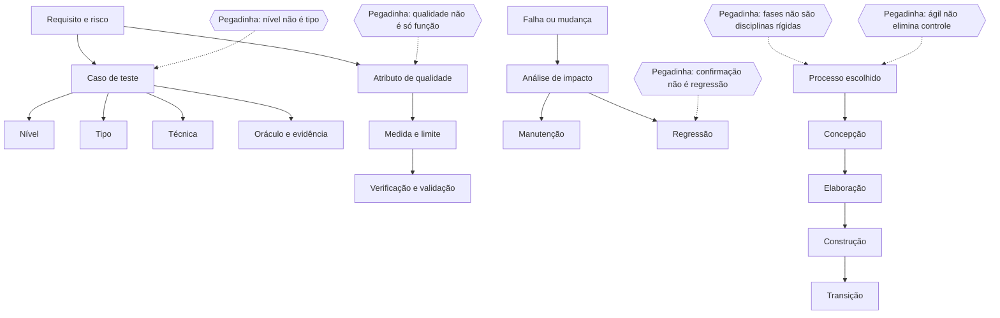
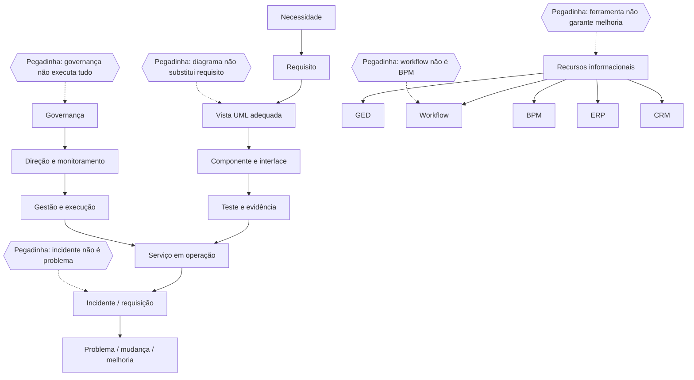

# Dia 5 — Testes, qualidade, manutenção e processos de desenvolvimento

## Abertura e resultados esperados

O Dia 5 fecha o núcleo de Engenharia de Software da semana. O recorte é deliberado: fundamentos cobrados no edital, relações entre artefatos e decisões e aplicação em cenários de órgão público. Não se pretende esgotar certificações, normas ou métodos completos. A pergunta-guia é: **qual evidência permite afirmar que o produto atende ao que foi pedido, com qualidade sustentável ao longo do ciclo de vida?**

Ao final, você deverá conseguir:

- separar erro humano, defeito no artefato e falha observada;
- distinguir teste estático e dinâmico, nível de teste, tipo de teste e técnica de projeto;
- montar caso de teste com base, condição, dados, resultado esperado e oráculo;
- comparar componente, integração, sistema e aceitação sem confundir nível com ambiente;
- diferenciar confirmação e regressão, caixa-preta e caixa-branca, verificação e validação;
- tratar qualidade como atendimento verificável a requisitos explícitos e necessidades pertinentes;
- distinguir garantia da qualidade, controle da qualidade, teste e auditoria;
- relacionar atributos de qualidade a medidas e critérios de aceite;
- classificar manutenção corretiva, adaptativa, perfectiva e preventiva;
- executar análise de impacto, controle de configuração e teste de regressão antes da liberação;
- comparar cascata, incremental, evolucionário, prototipação, espiral, RAD e desenvolvimento orientado a reúso;
- ordenar concepção, elaboração, construção e transição pela finalidade, sem tratá-las como etapas rígidas e sem iteração;
- justificar um processo conforme risco, estabilidade dos requisitos, necessidade de feedback e restrições do contexto.

## Como a Consulplan tende a transformar o tema em questão

O enunciado costuma apresentar um incidente, uma mudança ou uma entrega e pedir a classificação mais precisa. Distratores trocam **nível** por **tipo**, **correção** por **regressão**, **produto** por **processo**, **fase** por **disciplina** e **modelo iterativo** por ausência de planejamento. Em comandos negativos, marque visualmente `INCORRETA`, `NÃO` ou `EXCETO` antes de ler as alternativas.

## Jornada executável e ponto de parada

### Sessão A — 170 minutos

| Etapa | Tempo | Entrega |
|---|---:|---|
| Bloco 1 | 55 min | matriz `risco × nível × tipo × técnica × oráculo` |
| Bloco 2 | 55 min | quadro `atributo × requisito mensurável × evidência` |
| Bloco 3 | 60 min | fluxo de mudança e comparação dos modelos/fases |

**Ponto de parada:** classificar um caso de teste completo, transformar três desejos vagos em critérios mensuráveis e conduzir uma solicitação de mudança de `registro → impacto → decisão → implementação → regressão → liberação`. Encerrar aos 170 minutos. Certificação avançada, catálogo integral de uma norma e ferramentas específicas ficam fora deste recorte.

### Sessão B — 170 minutos

| Etapa | Tempo | Entrega |
|---|---:|---|
| Bloco 4 | 60 min | recuperação D+2/D+7 e Legislação CRA/CFA |
| Bloco 5 | 30 min | Português: paralelismo, referência e precisão |
| Bloco 6 | 15 min | recuperação ativa e caderno de erros, sem conteúdo novo |
| Mini revisão e checklist | 10 min | respostas sem consulta |
| Seis Essenciais D0 | 25 min | S4D5Q201–S4D5Q206 |
| Correção A–D | 25 min | justificar as quatro alternativas |
| Fechamento | 5 min | confiança e agenda |

### Consolidação — 20 minutos

Registrar item, confiança de 0 a 3, regra recuperada, contraste que elimina o distrator, nova aplicação, âncora e datas D+2/D+7/D+21. Esta etapa não recebe teoria nem questão nova.

## Rastreabilidade do Dia 5

| Conteúdo do dia | Teoria anterior à cobrança | Principais | Extras |
|---|---|---|---|
| fundamentos, níveis, tipos e técnicas de teste | [Bloco 1](#s4-d5-testes) | S4D5Q201–S4D5Q220 | — |
| qualidade, critérios e métricas | [Bloco 2](#s4-d5-qualidade) | S4D5Q221–S4D5Q232 | — |
| manutenção e gestão da mudança | [Bloco 3](#s4-d5-manutencao) | S4D5Q233–S4D5Q240 | — |
| processos e fases | [Bloco 3](#s4-d5-processos) | S4D5Q241–S4D5Q250 | — |
| Legislação CRA/CFA | [Bloco 4](#s4-d5-legislacao) | — | Extra Dia 5.1–5.10 |
| Português | [Bloco 5](#s4-d5-portugues) | — | Extra Dia 5.11–5.20 |

## Bloco 1 — Testes: fundamento, níveis, tipos e técnicas

### 1. Erro, defeito e falha

| Termo | Núcleo | Exemplo |
|---|---|---|
| erro humano | ação ou decisão equivocada | analista interpreta prazo em dias úteis como corridos |
| defeito | problema inserido em requisito, modelo, código ou dado de teste | regra de contagem implementada incorretamente |
| falha | comportamento observável diferente do esperado durante execução | sistema calcula a data final errada |

Um defeito pode existir sem ser executado; uma falha pode decorrer de defeito, configuração ou interação com o ambiente. Teste revela informação sobre risco e qualidade, mas uma campanha bem-sucedida não prova ausência total de defeitos.

### 2. Teste estático e dinâmico

**Teste estático** examina produtos de trabalho sem executar o software: revisão de requisito, inspeção de código, análise estática e conferência de modelo. **Teste dinâmico** executa o item de teste e compara comportamento observado com resultado esperado.

Revisão precoce pode encontrar ambiguidade antes de virar código; execução é necessária para observar tempos, fluxos e falhas em operação. Eles se complementam.

### 3. Níveis de teste

| Nível | Objeto dominante | Risco típico | Não confunda com |
|---|---|---|---|
| componente | unidade isolável de código | lógica local | teste feito apenas pelo programador |
| integração | interfaces e interação entre componentes/sistemas | contrato, formato, ordem, comunicação | “juntar tudo no fim” |
| sistema | sistema completo diante de requisitos | comportamento ponta a ponta e atributos | aceitação automática pelo usuário |
| aceitação | prontidão e atendimento às necessidades do negócio/usuário | solução inadequada ao uso ou ao contrato | mero reteste técnico |

O nível não é definido só pelo ambiente nem pelo cargo de quem executa. Identifique **objeto, objetivo e risco**.

### 4. Tipos de teste e teste de mudança

- **funcional:** avalia o que o sistema faz diante das funções e regras;
- **não funcional:** avalia como o sistema opera, por exemplo desempenho, segurança, confiabilidade e capacidade de interação;
- **confirmação:** verifica se a correção de um defeito específico funcionou;
- **regressão:** procura efeitos adversos da mudança em áreas antes válidas.

Confirmação olha primeiro para a falha corrigida; regressão olha para o entorno que pode ter sido afetado. A mesma execução pode contribuir para ambos, mas os objetivos não são sinônimos.

### 5. Técnicas de caixa-preta, caixa-branca e baseadas em experiência

**Caixa-preta** deriva testes de especificações e comportamento externo. Técnicas recorrentes:

- partição de equivalência: agrupar entradas que se espera tratar do mesmo modo;
- análise de valor-limite: testar fronteiras e vizinhanças;
- tabela de decisão: combinar condições e ações;
- transição de estados: testar eventos permitidos e proibidos em cada estado;
- casos de uso/cenários: percorrer fluxo principal e alternativas.

**Caixa-branca** usa estrutura interna, como cobertura de instruções e decisões. Cobertura de 100% de instruções não implica todas as decisões, combinações, regras ou defeitos cobertos.

**Baseada em experiência** usa conhecimento de riscos e erros prováveis, como ataque de erros e teste exploratório. Experiência orienta, mas não substitui rastreabilidade quando ela é exigida.

### 6. Caso de teste, oráculo e critérios

Um caso de teste completo indica:

1. base e requisito rastreado;
2. precondições e estado inicial;
3. dados e passos relevantes;
4. resultado esperado definido antes da execução;
5. resultado observado e evidência;
6. critério de aprovação;
7. ambiente/versão do item sob teste quando isso altera o resultado.

O **oráculo** é a fonte que permite decidir o resultado esperado: requisito aprovado, regra de negócio, cálculo independente, modelo ou sistema de referência confiável. “Pareceu correto” não é oráculo suficiente.

### 7. Planejamento por risco e independência

Priorizar por risco combina, em essência, probabilidade e impacto. Funcionalidade crítica, mudança extensa e histórico de falhas merecem maior profundidade. Independência pode aumentar a chance de revelar pressupostos diferentes, mas não significa isolamento da equipe nem garante qualidade.

Critérios de entrada e saída precisam ser observáveis: ambiente disponível, dados preparados, defeitos críticos tratados, cobertura acordada e risco residual aceito. “Testar até não achar mais nada” não é critério controlável.

### Exemplos completos — testes

#### Exemplo 1 — faixa de idade para atendimento prioritário

**Situação:** um portal concede prioridade a pessoas com idade igual ou superior a 60 anos.

**Dados relevantes:** domínio inteiro; fronteira em 60; requisito aprovado.

**Passos de raciocínio:** (1) separar classes abaixo e a partir de 60; (2) escolher vizinhos 59, 60 e 61; (3) definir antes da execução que 59 é comum e 60/61 são prioritários; (4) registrar resultado observado; (5) rastrear ao requisito.

**Resposta:** aplicar análise de valor-limite com 59, 60 e 61 e usar o requisito como oráculo.

**Por que funciona:** concentra testes na mudança de comportamento e mantém decisão objetiva.

**Erro comum:** testar apenas 60 e não observar os dois lados da fronteira.

#### Exemplo 2 — correção do cálculo e risco lateral

**Situação:** corrigiu-se a contagem de prazo em um módulo compartilhado por protocolo e cobrança.

**Dados relevantes:** a falha original estava em protocolo; a função comum também atende cobrança.

**Passos de raciocínio:** (1) reproduzir o defeito; (2) aplicar a correção; (3) repetir o caso original para confirmação; (4) mapear consumidores da função; (5) executar regressão em protocolo e cobrança; (6) comparar evidências.

**Resposta:** confirmação no cenário original e regressão nas funcionalidades dependentes.

**Por que funciona:** separa objetivos e cobre o impacto da dependência compartilhada.

**Erro comum:** declarar a mudança segura porque o caso que falhava passou.

#### Exemplo 3 — integração com sistema de pagamentos

**Situação:** o portal envia cobrança a um serviço externo e recebe `aprovada`, `negada` ou `pendente`.

**Dados relevantes:** contrato da interface, estados e repetição possível de mensagem.

**Passos de raciocínio:** (1) validar formato e autenticação; (2) simular cada resposta; (3) testar atraso e repetição; (4) verificar idempotência; (5) executar fluxo ponta a ponta; (6) guardar requisição, resposta e estado final.

**Resposta:** o núcleo é teste de integração; o fluxo completo também fornece evidência no nível de sistema.

**Por que funciona:** o nível acompanha o objeto e o risco, não o local físico do teste.

**Erro comum:** chamar tudo de teste unitário porque há mocks.

## Bloco 2 — Qualidade de produto, processo e evidência

### 8. Qualidade não é apenas “não ter bug”

Qualidade envolve atender necessidades pertinentes sob condições especificadas. Um sistema pode calcular corretamente e ainda ser lento, inseguro, incompatível, difícil de operar ou de manter.

O modelo de qualidade de produto atualmente publicado pela ISO organiza propriedades em nove características: **adequação funcional, eficiência de desempenho, compatibilidade, capacidade de interação, confiabilidade, segurança, manutenibilidade, flexibilidade e segurança contra dano**. Para a prova, mais importante que recitar a lista é associar cada necessidade a um requisito mensurável e a uma evidência.

| Desejo vago | Requisito verificável possível | Evidência |
|---|---|---|
| “ser rápido” | percentil definido de respostas abaixo do limite, sob carga e ambiente declarados | relatório de desempenho |
| “ser seguro” | acesso ao recurso restrito a papel autorizado e eventos relevantes registrados | teste de autorização e log |
| “ser confiável” | recuperação dentro do tempo acordado após falha simulada | teste de recuperação |
| “ser fácil de mudar” | alteração delimitada com módulos e testes impactados identificáveis | análise de impacto e histórico |

### 9. Produto × processo; garantia × controle

| Conceito | Pergunta dominante | Exemplo |
|---|---|---|
| qualidade do produto | quais propriedades o resultado apresenta? | tempo de resposta e correção funcional |
| qualidade do processo | como o trabalho é definido, executado e melhorado? | revisão obrigatória e critério de pronto |
| garantia da qualidade | o processo oferece confiança de que a qualidade será alcançada? | auditoria, padrão, revisão de processo |
| controle da qualidade | o produto atende aos critérios? | inspeção, medição e teste do incremento |

Prevenção e detecção são complementares. Um processo excelente não prova que um produto particular está correto; um lote aprovado em testes não torna o processo automaticamente capaz.

### 10. Verificação, validação, métricas e custo da qualidade

**Verificação** pergunta se o produto de trabalho foi construído conforme especificações e critérios. **Validação** pergunta se a solução atende ao uso e à necessidade pretendida. Uma especificação pode ser verificada e ainda descrever a solução errada.

Métrica sem decisão vira decoração. Defina `objetivo → indicador → fórmula/fonte → periodicidade → limite → ação`. Quantidade bruta de defeitos não compara equipes sem considerar tamanho, complexidade, fase de detecção e exposição.

O custo da qualidade pode ser observado em prevenção, avaliação e falhas internas/externas. A classificação serve para orientar decisão, não para concluir que prevenção elimina todo custo de falha.

### Exemplos completos — qualidade

#### Exemplo 4 — requisito de desempenho mensurável

**Situação:** o gestor pede que a consulta de registro seja “instantânea”.

**Dados relevantes:** carga prevista de 300 usuários; ambiente de homologação equivalente; percentis importam.

**Passos de raciocínio:** (1) substituir adjetivo por tempo; (2) declarar população de requisições e carga; (3) escolher percentil; (4) indicar ambiente e janela; (5) definir ação se o limite falhar.

**Resposta:** por exemplo, “sob 300 usuários concorrentes no ambiente definido, 95% das consultas válidas devem responder em até dois segundos”.

**Por que funciona:** condição, população, medida e limite tornam o requisito testável.

**Erro comum:** usar somente a média, ocultando cauda lenta.

#### Exemplo 5 — produto correto, uso inadequado

**Situação:** o sistema implementa exatamente um formulário aprovado, mas usuários não conseguem concluir a tarefa sem ajuda.

**Dados relevantes:** regras funcionais passam; taxa de conclusão e erros de interação são ruins.

**Passos de raciocínio:** (1) reconhecer evidência de verificação funcional; (2) confrontar necessidade real; (3) medir conclusão, erros e satisfação no contexto; (4) revisar requisito e desenho; (5) repetir validação.

**Resposta:** a conformidade com a especificação não encerra a validação; há problema de capacidade de interação/adequação ao uso.

**Por que funciona:** separa “construído como descrito” de “solução útil”.

**Erro comum:** culpar automaticamente o usuário porque o código atende ao documento.

## Bloco 3 — Manutenção, mudança, modelos e fases

### 11. Manutenção e suas categorias

Manutenção modifica software depois da entrega para sustentar sua utilidade. A classificação depende do **motivo dominante**:

| Categoria | Motivo dominante | Exemplo público |
|---|---|---|
| corretiva | corrigir defeito manifestado | cálculo de taxa incorreto |
| adaptativa | responder a ambiente ou regra externa alterada | nova interface obrigatória de serviço externo |
| perfectiva | melhorar desempenho, manutenibilidade ou funcionalidade solicitada | reduzir tempo de consulta ou acrescentar filtro |
| preventiva | reduzir probabilidade/impacto de problema futuro | refatorar módulo frágil antes de nova demanda |

Uma mudança pode produzir vários efeitos; classifique pelo objetivo que a originou. “Atualização” não é categoria suficiente.

### 12. Fluxo seguro de mudança

1. registrar solicitação, motivo e urgência;
2. reproduzir ou esclarecer a necessidade;
3. analisar impacto em requisito, código, dados, interfaces, segurança, testes, operação e documentação;
4. estimar risco, custo e prioridade;
5. decidir e autorizar segundo governança;
6. versionar artefatos e implementar em ramificação/controlado;
7. revisar, testar confirmação quando aplicável e regressão pelo impacto;
8. preparar reversão, implantação e comunicação;
9. liberar, monitorar e atualizar documentação/rastreabilidade.

Controle de configuração identifica itens, versões, baselines e mudanças. Ele não é apenas ferramenta de repositório. **Baseline** é referência aprovada sujeita a controle formal de mudança; não significa artefato eternamente imutável.

### 13. Processos e modelos de desenvolvimento

| Modelo/abordagem | Ideia central | Adequação típica | Pegadinha |
|---|---|---|---|
| cascata/sequencial | fases com forte precedência e baselines | escopo estável e dependências reguladas | feedback não deixa de existir, mas tende a chegar mais tarde |
| incremental | entrega o produto em partes funcionais | priorização de valor e redução de tempo até uso | incremento não é protótipo descartável por definição |
| iterativo/evolucionário | revisa e refina a solução em ciclos | incerteza e aprendizado | iterar não significa improvisar sem arquitetura |
| prototipação | aprende/valida por representação parcial | requisito ou interação incerta | protótipo descartável não deve virar produção sem avaliação |
| espiral | ciclos guiados explicitamente por riscos | alto risco e alternativas técnicas | não é simples sequência de quatro caixas repetidas |
| RAD | desenvolvimento rápido com forte participação, prototipação e timeboxing | módulos delimitáveis e prazo curto | velocidade não elimina qualidade ou integração |
| orientado a reúso | compõe/adapta componentes existentes | ativos adequados e contratos conhecidos | reúso transfere riscos de dependência, licença e integração |

Processo deve ser adaptado ao contexto. Nenhum rótulo garante sucesso. Compare risco, estabilidade, criticidade, feedback, arquitetura, integração, conformidade, competência da equipe e frequência de entrega.

### 14. Concepção, elaboração, construção e transição

Estas quatro fases pertencem à família de processo unificado e são **iterativas**; requisitos, projeto, implementação e teste podem aparecer em todas, com ênfases distintas.

| Fase | Pergunta dominante | Resultado esperado | Erro recorrente |
|---|---|---|---|
| concepção | vale a pena e qual é o escopo? | visão, caso de negócio, atores/casos críticos, riscos iniciais | tentar detalhar todo o sistema |
| elaboração | a arquitetura e o plano enfrentam os maiores riscos? | arquitetura-base executável, requisitos críticos refinados, plano realista | confundir com escrever toda documentação |
| construção | como completar e estabilizar incrementos? | capacidade funcional integrada e testada | supor que só aqui existe teste |
| transição | a solução está pronta para a comunidade usuária? | implantação, migração, treinamento, correções e aceite | reduzir a fase a copiar arquivos |

Fase não é disciplina. “Teste” atravessa fases; “elaboração” não é sinônimo de design completo; “transição” inclui prontidão operacional e feedback.

### Exemplos completos — manutenção e processos

#### Exemplo 6 — mudança de integração obrigatória

**Situação:** um serviço externo descontinua um formato e exige novo contrato em data definida.

**Dados relevantes:** o sistema funcionava; a causa é mudança do ambiente; três módulos consomem a interface.

**Passos de raciocínio:** (1) classificar motivo como adaptativo; (2) mapear consumidores e dados; (3) versionar contrato; (4) criar testes de integração e regressão; (5) planejar coexistência/reversão; (6) monitorar depois da troca.

**Resposta:** manutenção adaptativa conduzida por análise de impacto e controle de configuração.

**Por que funciona:** a categoria decorre da alteração externa, enquanto controles tratam o risco.

**Erro comum:** chamar de corretiva porque a versão antiga falhará no futuro.

#### Exemplo 7 — refatoração antes da demanda

**Situação:** módulo sem falha conhecida possui duplicação e alto acoplamento; nova obrigação deve chegar em dois meses.

**Dados relevantes:** objetivo imediato é reduzir risco futuro, sem ampliar função ao usuário.

**Passos de raciocínio:** (1) registrar dívida e evidência; (2) classificar como preventiva; (3) delimitar comportamento preservado; (4) preparar testes caracterizadores; (5) refatorar em passos; (6) rodar regressão e medir complexidade.

**Resposta:** manutenção preventiva, apoiada por testes que preservem comportamento.

**Por que funciona:** atua antes da falha para tornar a mudança futura mais segura.

**Erro comum:** classificá-la como perfectiva apenas porque “melhora o código”.

#### Exemplo 8 — processo para portal de alto risco

**Situação:** novo portal possui regra pública parcialmente conhecida, integração inédita e prazo legal.

**Dados relevantes:** risco técnico alto, necessidade de feedback, data fixa e módulos priorizáveis.

**Passos de raciocínio:** (1) fixar visão/prazo na concepção; (2) atacar integração e arquitetura na elaboração; (3) construir incrementos priorizados; (4) testar continuamente; (5) preparar migração, treinamento e aceite na transição; (6) manter controle das baselines.

**Resposta:** abordagem iterativa e incremental, guiada por risco, com as quatro fases como marcos de ênfase.

**Por que funciona:** combina feedback e redução de risco sem abandonar governança.

**Erro comum:** escolher cascata só porque existe prazo ou escolher “ágil” como ausência de documentação.

#### Exemplo 9 — protótipo de atendimento

**Situação:** servidores não concordam sobre a sequência de triagem; cria-se interface navegável sem integração real.

**Dados relevantes:** objetivo é aprender; dados são fictícios; arquitetura de produção não foi validada.

**Passos de raciocínio:** (1) declarar hipótese e critérios; (2) observar usuários; (3) registrar decisões; (4) descartar ou reengenheirar conscientemente; (5) converter descobertas em requisitos; (6) planejar solução real.

**Resposta:** prototipação reduz incerteza de requisito, mas o protótipo não prova prontidão produtiva.

**Por que funciona:** separa artefato de aprendizado de incremento operacional.

**Erro comum:** publicar o protótipo porque “já funciona na tela”.

### Produto obrigatório da Sessão A

Preencha uma linha para cada cenário:

| Cenário | Risco | Teste: nível/tipo/técnica | Atributo e medida | Manutenção | Processo/fase | Evidência de saída |
|---|---|---|---|---|---|---|
| correção de cálculo compartilhado |  |  |  |  |  |  |
| nova integração obrigatória |  |  |  |  |  |  |
| consulta lenta sem erro funcional |  |  |  |  |  |  |
| requisito de interação incerto |  |  |  |  |  |  |

## Bloco 4 — D+2, D+7 e Legislação CRA/CFA

**Tempo:** 60 minutos. Use primeiro 20 minutos para pendências D+2 de UML, 15 minutos para D+7 de banco de dados e 25 minutos para a revisão institucional e suas aplicações.

### Recuperação curta

Sem consulta, reconstrua `requisito → caso de uso → sequência → classe → componente → teste`. Depois compare uma mudança de regra em modelo, código, teste e documentação. Não reabra teoria nova.

### Legislação CRA/CFA — revisão segura para as Extras 5.1–5.10

Este bloco recupera o mapa de fontes já estudado; não cria artigo, prazo ou sanção novo.

| Pergunta do caso | Primeiro filtro | Limite que elimina distrator |
|---|---|---|
| qual fonte disciplina a profissão? | lei de regência | ato inferior não afasta lei por mera novidade |
| qual ato regulamenta a lei? | decreto regulamentador | decreto não é regimento interno |
| quem orienta normativamente o sistema em âmbito nacional? | CFA dentro de sua competência | direção nacional não executa toda atividade regional |
| quem registra/fiscaliza na jurisdição paranaense? | CRA-PR dentro de sua competência territorial | autonomia não rompe a unidade do sistema |
| o caso envolve dever ou conduta ética? | código/regra ética vigente aplicável | identificar sujeito, conduta e contexto antes da consequência |
| há publicidade e dado protegido? | finalidade, competência e limite de divulgação | transparência não elimina sigilo; sigilo não elimina toda prestação de contas |

Roteiro de prova: `objeto → fonte → sujeito → território → verbo de competência → limite`. Se o enunciado não fornece artigo ou detalhe normativo, não invente.

## Bloco 5 — Português: precisão lógica em texto técnico

### Paralelismo, referência, conectores e escopo

- enumerações devem manter forma equivalente: `planejar, executar e avaliar`, não `planejar, execução e que se avalie`;
- pronome deve ter referente único; repita o núcleo quando houver dois antecedentes possíveis;
- `portanto` conclui, `porque` causa/explica, `embora` concede e `contudo` contrapõe;
- vírgula não separa sujeito de verbo sem elemento intercalado;
- termo negativo e quantificador mudam escopo: `nem todos passaram` não significa `ninguém passou`;
- absolutos como `sempre`, `nunca`, `qualquer` e `elimina` exigem sustentação forte;
- reescrita correta preserva sentido, relação lógica, regência e concordância.

#### Exemplo completo — referente ambíguo

**Situação:** “A equipe enviou o relatório à direção depois de revisá-la.”

**Dados relevantes:** `-la` pode sugerir direção, mas o sentido pretendido é revisar o relatório.

**Passos de raciocínio:** (1) localizar antecedentes; (2) testar gênero e sentido; (3) explicitar o objeto; (4) preservar a ordem temporal.

**Resposta:** “Depois de revisar o relatório, a equipe o enviou à direção.”

**Por que funciona:** o objeto da revisão torna-se inequívoco.

**Erro comum:** trocar o pronome sem remover a dupla leitura.

#### Exemplo completo — paralelismo

**Situação:** “O plano prevê revisar requisitos, a execução dos testes e que os resultados sejam medidos.”

**Dados relevantes:** três itens exercem a mesma função, mas têm formas distintas.

**Passos de raciocínio:** escolher uma forma; converter todos os itens; conferir sentido e regência.

**Resposta:** “O plano prevê revisar requisitos, executar testes e medir resultados.”

**Por que funciona:** três verbos no infinitivo formam série paralela.

**Erro comum:** manter artigo apenas no item central e chamar a série de equivalente.

## Bloco 6 — Recuperação ativa e caderno de erros

**Não há conteúdo novo neste bloco.** Sem consulta:

1. diferencie erro, defeito e falha;
2. classifique quatro níveis e quatro tipos de teste;
3. explique confirmação × regressão e verificação × validação;
4. monte um caso de teste com oráculo;
5. transforme dois atributos vagos em medidas;
6. classifique quatro manutenções pelo motivo;
7. recite o fluxo de mudança;
8. compare sete modelos por risco e feedback;
9. explique a ênfase de cada uma das quatro fases;
10. registre três erros em `resposta inicial → confusão → regra → contraexemplo → âncora → nova tentativa`.

## Mini revisão — perguntas e respostas

1. Teste sem executar software é necessariamente “não teste”?
2. Quem executa define o nível?
3. Retestar a falha corrigida é regressão?
4. Cobertura total de instruções prova ausência de defeitos?
5. Verificação e validação são equivalentes?
6. Mudança externa que exige adaptação é qual manutenção?
7. Baseline jamais pode mudar?
8. Espiral organiza ciclos em torno de quê?
9. Em qual fase se atacam prioritariamente riscos arquiteturais?
10. Transição se limita à instalação?

### Respostas

1. Não; revisão e análise estática são testes estáticos.
2. Não; objeto, objetivo e risco definem o nível.
3. É confirmação; regressão busca efeitos laterais.
4. Não.
5. Não; conformidade com especificação e adequação à necessidade são perguntas distintas.
6. Adaptativa.
7. Pode mudar, mas sob controle.
8. Riscos.
9. Elaboração.
10. Não; inclui implantação, migração, treinamento, correções e aceite.

## Mapa de conexões do Dia 5

## Checklist de domínio

- [ ] Distingo erro, defeito e falha.
- [ ] Separo estático de dinâmico.
- [ ] Classifico nível, tipo e técnica por critérios distintos.
- [ ] Construo caso de teste com resultado esperado e oráculo.
- [ ] Diferencio confirmação e regressão.
- [ ] Não tomo cobertura como prova de ausência de defeito.
- [ ] Converto atributo de qualidade em requisito mensurável.
- [ ] Separo produto, processo, garantia e controle.
- [ ] Diferencio verificação e validação.
- [ ] Classifico manutenção pelo motivo dominante.
- [ ] Executo análise de impacto e controle de configuração.
- [ ] Comparo modelos pelo contexto.
- [ ] Explico concepção, elaboração, construção e transição.
- [ ] Corrigi seis Essenciais analisando A–D.

## Fila ordenada de dez Essenciais

| Ordem | ID | Núcleo | Momento |
|---:|---|---|---|
| 1 | S4D5Q201 | erro, defeito e falha | D0 |
| 2 | S4D5Q202 | estático × dinâmico | D0 |
| 3 | S4D5Q203 | nível de componente | D0 |
| 4 | S4D5Q204 | integração | D0 |
| 5 | S4D5Q205 | sistema e aceitação | D0 |
| 6 | S4D5Q206 | confirmação × regressão | D0 |
| 7 | S4D5Q207 | funcional × não funcional | D+2 |
| 8 | S4D5Q208 | valor-limite | D+2 |
| 9 | S4D5Q209 | cobertura | D+2 |
| 10 | S4D5Q210 | oráculo | D+2 |

Resolva S4D5Q201–S4D5Q206 e avance somente com correção A–D integral. Agende o saldo conforme o calendário consolidado da semana.

## Fechamento do Dia 5

O dia termina com matriz de testes, três requisitos mensuráveis, fluxo de mudança, comparação de processo, seis Essenciais corrigidas e três erros convertidos em nova tentativa. A frase de saída é: **“qual risco estou testando, por qual evidência e em qual ponto do ciclo?”**

## Fontes primárias e recorte

- IEEE Computer Society, [SWEBOK — áreas de Testes, Qualidade, Manutenção e Processo](https://www.computer.org/education/bodies-of-knowledge/software-engineering);
- ISTQB, [Certified Tester Foundation Level Syllabus](https://istqb.org/wp-content/uploads/2024/11/ISTQB_CTFL_Syllabus_v4.0.1.pdf), usado para terminologia fundamental de testes;
- ISO, [modelo de qualidade de produto ISO/IEC 25010:2023](https://www.iso.org/standard/78176.html), versão verificada em 19/07/2026;
- IBM, [fases e iterações do Rational Unified Process](https://www.ibm.com/docs/en/rational-clearquest/10.0.9?topic=settings-project-planning);
- [Manifesto Ágil e seus princípios](https://agilemanifesto.org/iso/ptbr/principles.html).

As fontes delimitam fundamentos. A cobrança autoral não pressupõe certificação nem detalhe de ferramenta.

---

# Dia 6 — Integração de Engenharia/UML, ITIL, COBIT e recursos informacionais

## Abertura e resultados esperados

O Dia 6 conecta decisões estudadas nos Dias 1–5. Requisito sem rastreabilidade, diagrama sem pergunta, teste sem oráculo e mudança sem impacto são artefatos soltos. O objetivo é percorrer uma cadeia única: **necessidade → requisito → modelo → arquitetura/componente → teste → operação → melhoria e governança**.

Ao final, você deverá:

- escolher o diagrama UML conforme a pergunta do caso;
- manter consistência entre requisito, caso de uso, classe, interação, estado, atividade, componente e implantação;
- derivar testes e impacto de mudança a partir da rastreabilidade;
- distinguir serviço, valor, resultado e saída em gestão de serviços;
- classificar incidente, problema, requisição de serviço e mudança sem transformar práticas em departamentos;
- separar governança e gestão no COBIT;
- comparar ITIL e COBIT como referenciais complementares, sem os tratar como software, norma certificadora da organização ou garantia automática;
- dar uma definição literal e funcional de GED, workflow, BPM, ERP e CRM;
- escolher cada recurso pelo problema e reconhecer integração entre eles;
- revisar Português e converter erros acumulados em regras recuperáveis.

## Como a banca pode integrar os assuntos

A Consulplan favorece cenário administrativo curto com artefatos plausíveis. A alternativa correta costuma preservar simultaneamente três fronteiras: diagrama certo, responsabilidade certa e evidência certa. Nos referenciais de gestão, os distratores reduzem ITIL a central de atendimento, COBIT a auditoria, GED a pasta digital, workflow a BPM, ERP a banco único e CRM a lista de contatos.

## Jornada executável e ponto de parada

### Sessão A — 170 minutos

| Etapa | Tempo | Entrega |
|---|---:|---|
| Bloco 1 | 55 min | cadeia rastreável requisito–UML–teste–mudança |
| Bloco 2 | 55 min | matriz ITIL × COBIT × decisão × evidência |
| Bloco 3 | 60 min | quadro GED/workflow/BPM/ERP/CRM e caso integrado |

**Ponto de parada:** explicar um cenário público com pelo menos cinco elos rastreáveis, classificar quatro ocorrências operacionais e selecionar recurso informacional sem trocar finalidade. Encerrar aos 170 minutos; certificações, níveis de capacidade, domínios completos e configuração de produtos ficam fora do recorte.

### Sessão B — 170 minutos

| Etapa | Tempo | Entrega |
|---|---:|---|
| Bloco 4 | 55 min | ciclos acumulados D+2/D+7 e Português |
| Bloco 5 | 40 min | dissertação integral de tema geral, manuscrita |
| Bloco 6 | 10 min | caderno de erros e recuperação, sem conteúdo novo |
| Mini revisão e checklist | 10 min | respostas sem consulta |
| Seis Essenciais D0 | 25 min | S4D6Q251–S4D6Q256 |
| Correção A–D | 25 min | justificativa integral |
| Fechamento | 5 min | agenda |

### Consolidação — 20 minutos

Registrar três erros prioritários, regra correta, evidência ignorada, nova aplicação, âncora e revisão espaçada. Não abrir seção inédita.

## Rastreabilidade do Dia 6

| Conteúdo | Teoria anterior à cobrança | Principais | Extras |
|---|---|---|---|
| requisitos, UML, testes e mudança integrados | [Bloco 1](#s4-d6-integracao) | S4D6Q251–S4D6Q270 e S4D6Q291–S4D6Q300 | — |
| fundamentos de ITIL e COBIT | [Bloco 2](#s4-d6-itil-cobit) | S4D6Q271–S4D6Q285 | — |
| GED, workflow, BPM, ERP e CRM | [Bloco 3](#s4-d6-recursos) | S4D6Q286–S4D6Q290 | — |
| Português | [Blocos 4–5](#s4-d6-portugues) | — | Extra 6.1–6.20 |
| caderno de erros | [Bloco 6](#s4-d6-caderno) | — | sem banco próprio; somente registro e nova tentativa |

## Bloco 1 — Integração de requisitos, UML, testes e mudança

### 1. Comece pela pergunta, não pelo diagrama

| Pergunta do caso | Artefato/diagrama útil | Evidência que deve permanecer |
|---|---|---|
| quem interage e com qual objetivo? | caso de uso | ator, objetivo, fronteira e fluxos |
| quais conceitos, atributos e relações existem? | classes/objetos | responsabilidades e multiplicidades justificadas |
| em que ordem participantes trocam mensagens? | sequência ou comunicação | participantes, mensagens e ordem/ligação |
| como o fluxo ramifica e paraleliza? | atividade | decisão, junção, concorrência e término |
| como um objeto reage a eventos ao longo da vida? | máquina de estados | estados, eventos, guardas e transições |
| quais unidades substituíveis fornecem interfaces? | componentes | dependências e interfaces |
| onde artefatos executam fisicamente/logicamente? | implantação | nós, artefatos e comunicação |

Diagrama é uma vista, não a realidade inteira. Duas vistas podem ser corretas e ainda se contradizer; a integração exige consistência sem obrigar duplicação de todo detalhe.

### 2. Cadeia mínima de rastreabilidade

Use identificadores e relações justificadas:

`necessidade N → requisito R → caso de uso UC → cenário/mensagem → responsabilidade/classe → componente/interface → caso de teste CT → defeito/mudança M → versão/liberação`.

Rastreabilidade **para frente** verifica implementação e teste; **para trás** verifica origem e evita função sem justificativa. Matriz não substitui análise: cada elo precisa representar dependência real.

### 3. Consistência entre vistas

- mensagem de sequência deve encontrar operação/responsabilidade plausível;
- estado deve pertencer a objeto com ciclo de vida relevante;
- regra de multiplicidade deve refletir requisito, não preferência gráfica;
- decisão em atividade precisa de condições que cubram caminhos pertinentes;
- caso alternativo de uso deve gerar cenário e teste correspondente;
- interface exigida por componente deve ter fornecedor ou decisão explícita;
- implantação precisa comportar requisitos de capacidade, segurança e disponibilidade quando pertinentes.

### 4. Mudança e análise de impacto pela cadeia

Quando um requisito muda, percorra elos de entrada e saída. Pergunte:

1. qual necessidade e regra foram alteradas?
2. quais fluxos e atores mudam?
3. quais classes, mensagens, estados e interfaces dependem disso?
4. quais componentes e dados são afetados?
5. quais testes confirmam a mudança e quais protegem regressão?
6. quais documentos, treinamento, operação e controle precisam de nova versão?

### Exemplos completos — integração

#### Exemplo 1 — protocolo com exigência documental

**Situação:** pedido só pode seguir para análise quando todos os documentos obrigatórios estiverem válidos.

**Dados relevantes:** cidadão inicia o pedido; regra de completude; estados `rascunho`, `pendente`, `em análise`.

**Passos de raciocínio:** (1) registrar requisito; (2) modelar objetivo no caso de uso; (3) usar atividade para validações/decisão; (4) usar estados para ciclo do pedido; (5) colocar validação em responsabilidade/componente; (6) derivar testes de documento ausente, inválido e completo; (7) rastrear evidências.

**Resposta:** atividade explica fluxo; estados explicam ciclo; sequência pode detalhar colaboração; os testes derivam das guardas e alternativas.

**Por que funciona:** cada diagrama responde a pergunta diferente e compartilha a mesma regra.

**Erro comum:** usar apenas classes e supor que estrutura prova comportamento.

#### Exemplo 2 — mudança do prazo

**Situação:** prazo passa de dez dias corridos para dez dias úteis, com calendário corporativo.

**Dados relevantes:** requisito, serviço de calendário, mensagens de cálculo, testes de fronteira e comunicação ao usuário.

**Passos de raciocínio:** (1) atualizar regra e fonte; (2) localizar casos de uso e telas; (3) verificar classe/serviço responsável; (4) revisar sequência e interface do calendário; (5) testar fins de semana, feriados e virada de ano; (6) executar regressão nos consumidores; (7) versionar manual e liberação.

**Resposta:** a mudança não se encerra no código; a matriz aponta artefatos e testes afetados.

**Por que funciona:** combina origem, dependência, confirmação, regressão e operação.

**Erro comum:** alterar texto da tela sem revisar cálculo e testes.

## Bloco 2 — Fundamentos de ITIL e COBIT

### 5. ITIL: gestão orientada a serviço, valor e resultado

Neste recorte, ITIL é um referencial de boas práticas para gestão de produtos e serviços digitais. **Serviço** facilita resultados que o consumidor deseja alcançar; **valor** é percebido em contexto e depende de benefícios, custos e riscos. **Saída** é o que uma atividade produz; **resultado** é o efeito obtido pelo interessado. Entregar relatório é saída; reduzir tempo de decisão com informação confiável é resultado.

Práticas iniciais úteis em prova:

| Situação | Classificação dominante | Objetivo imediato |
|---|---|---|
| interrupção ou degradação não planejada | incidente | restaurar serviço normal e reduzir impacto |
| causa ou possível causa de incidentes | problema | reduzir probabilidade/impacto, investigar causa e gerir contorno/erro conhecido |
| pedido predefinido do usuário | requisição de serviço | atender demanda normal de modo acordado |
| acréscimo, modificação ou remoção com efeito em serviço | mudança | aumentar mudanças bem-sucedidas com avaliação de risco e autorização adequada |
| ponto de contato e comunicação | service desk | captar demanda, comunicar e apoiar usuários |

Restaurar rapidamente um incidente não exige conhecer a causa definitiva; investigar problema não deve impedir ação emergencial. Mudança não é sinônimo de incidente e não precisa ser burocracia idêntica para todo risco.

Na priorização operacional, **impacto** mede a extensão do efeito e **urgência** indica quanto tempo se pode esperar antes de agravar o dano. A ordem de chegada pode ser um desempate, mas não deve prevalecer automaticamente sobre impacto, urgência, acordos de serviço e contexto. Assim, uma interrupção nacional pode anteceder um relatório adiado mesmo que tenha sido registrada depois.

Melhoria contínua usa estado atual, estado desejado, prioridade, ação, medida e aprendizado. “Comprar ferramenta” não define valor nem melhora sozinho.

### 6. COBIT: governança e gestão de informação e tecnologia

COBIT é um referencial para governança e gestão da informação e tecnologia da organização. Seu escopo não se limita ao departamento de TI.

| Disciplina | Responsabilidade dominante |
|---|---|
| governança | avaliar necessidades/opções, direcionar prioridades e monitorar desempenho e conformidade |
| gestão | planejar, construir/adquirir, executar e monitorar atividades alinhadas à direção |

Governança não executa todo trabalho; gestão não define sozinha o apetite e as prioridades institucionais. Objetivos, papéis, informação, processos, estruturas, competências, cultura, políticas e infraestrutura formam um sistema coerente. Adaptação ao contexto é necessária; implementar tudo do mesmo modo não é sinal automático de maturidade.

### 7. ITIL × COBIT

| Pergunta | ITIL | COBIT |
|---|---|---|
| foco introdutório | criação, entrega, suporte e melhoria de produtos/serviços | governança e gestão da informação e tecnologia empresarial |
| unidade frequente do caso | serviço, fluxo de valor, prática operacional | objetivo, decisão, responsabilidade, controle e alinhamento |
| relação | pode orientar como gerir serviços | pode orientar por que, por quem e sob quais objetivos/controles a I&T é governada e gerida |

São complementares e adaptáveis. Nenhum deles é software, lei, norma que “certifica automaticamente” a organização ou receita que elimina julgamento.

### Exemplos completos — ITIL e COBIT

#### Exemplo 3 — indisponibilidade e causa recorrente

**Situação:** portal fica fora do ar; reiniciar restaura o acesso, mas a falha volta toda semana.

**Dados relevantes:** impacto atual alto; causa ainda desconhecida; contorno conhecido.

**Passos de raciocínio:** (1) registrar e priorizar incidente; (2) restaurar com contorno seguro; (3) comunicar; (4) abrir investigação de problema; (5) propor mudança quando houver solução; (6) medir recorrência e resultado.

**Resposta:** incidente restaura; problema investiga e reduz recorrência; mudança implementa solução avaliada.

**Por que funciona:** separa objetivos ligados, sem fundi-los.

**Erro comum:** manter o portal indisponível até descobrir causa raiz.

#### Exemplo 4 — prioridade institucional e execução

**Situação:** conselho precisa decidir investimento entre disponibilidade, novo canal e redução de custo.

**Dados relevantes:** interesses concorrentes, risco e obrigação de monitorar benefícios.

**Passos de raciocínio:** (1) governança avalia necessidades/opções; (2) direciona prioridade e limites; (3) gestão planeja e executa portfólio/serviços; (4) indicadores retornam; (5) governança monitora valor, risco e conformidade; (6) ajustes são decididos.

**Resposta:** COBIT ajuda a separar direção e execução; práticas de serviço podem apoiar a operação da prioridade escolhida.

**Por que funciona:** preserva papéis e complementaridade.

**Erro comum:** atribuir ao framework a decisão concreta sem participação da organização.

## Bloco 3 — GED, workflow, BPM, ERP e CRM

### 8. Visão literal compacta do item 17

| Recurso | Finalidade nuclear | Exemplo público | Não é apenas |
|---|---|---|---|
| GED | gerir ciclo de documentos digitais: captura, classificação, indexação, versão, acesso, retenção e recuperação | processo eletrônico com versão e permissão | pasta compartilhada ou backup |
| workflow | encaminhar trabalho/documento por tarefas, estados, regras e papéis | pedido passa por triagem, análise e decisão | disciplina completa de melhoria |
| BPM | gerir processos ponta a ponta: descobrir, modelar, analisar, redesenhar, executar, monitorar e melhorar | reduzir tempo total de registro | fluxograma, BPMN ou software isolado |
| ERP | integrar processos transacionais e dados de múltiplas áreas em módulos coordenados | compras, patrimônio, orçamento e pessoas | banco único que elimina toda integração |
| CRM | gerir relacionamento e interações com públicos ao longo do tempo | histórico multicanal de cidadão/registrado e demandas | agenda de contatos ou campanha comercial |

As fronteiras se combinam: um CRM registra a interação; workflow encaminha a demanda; GED guarda documentos; ERP processa efeito administrativo; BPM governa o fluxo ponta a ponta. A integração exige identidade, semântica, autorização, qualidade de dados, rastreabilidade e responsabilidade.

Quando a integração liga uma interação a uma transação — por exemplo, atendimento no CRM que cria parcelamento no ERP — acrescente controles operacionais. Uma **chave idempotente** impede que nova tentativa produza cobrança duplicada; o tratamento de falhas define repetição segura, compensação e estado visível; a **reconciliação** compara origem e destino e encaminha divergências a um responsável. Nome de campo ou aparência de tela iguais não provam identidade, semântica nem consistência entre os sistemas.

### 9. Critério de escolha

Use `problema → objeto principal → fluxo → dado/documento → ator → resultado → controle`:

- perda de versão e busca documental aponta para GED;
- fila e roteamento de tarefas aponta para workflow;
- desperdício entre áreas e resultado ponta a ponta aponta para BPM;
- transações administrativas fragmentadas aponta para ERP;
- histórico e continuidade do relacionamento aponta para CRM.

Nenhuma aquisição corrige processo mal compreendido. Primeiro delimite necessidade, depois processo/dados, integração, governança, segurança, migração, teste e indicadores.

### Exemplos completos — recursos informacionais

#### Exemplo 5 — atendimento com documento e efeito financeiro

**Situação:** cidadão solicita serviço, envia comprovante, acompanha análise e recebe cobrança quando deferido.

**Dados relevantes:** interação, documento versionado, tarefas, efeito financeiro e tempo ponta a ponta.

**Passos de raciocínio:** (1) CRM mantém histórico de contato; (2) GED controla comprovante; (3) workflow encaminha análise; (4) ERP registra cobrança; (5) BPM mede e melhora processo completo; (6) integrações preservam identidade e autorização.

**Resposta:** recursos são complementares; nenhum substitui todos os demais.

**Por que funciona:** cada recurso é associado ao seu objeto e finalidade.

**Erro comum:** chamar o conjunto inteiro de ERP apenas porque há dado central.

#### Exemplo 6 — compra de ferramenta antes do processo

**Situação:** órgão compra uma suíte e automatiza três aprovações redundantes; o tempo total aumenta.

**Dados relevantes:** fluxo não foi observado; não há dono nem indicador de resultado.

**Passos de raciocínio:** (1) levantar AS-IS real; (2) identificar valor, espera e regra; (3) desenhar TO-BE; (4) definir dono/indicadores; (5) escolher automação e integração; (6) monitorar e melhorar.

**Resposta:** aplicar BPM como disciplina; workflow/software somente apoia a execução do fluxo redesenhado.

**Por que funciona:** melhoria antecede automatização cega.

**Erro comum:** trocar ferramenta mantendo a causa organizacional.

### Produto obrigatório da Sessão A

Entregue uma única tabela:

| Necessidade | Requisito | UML/vista | Teste | Serviço/prática | Governança/gestão | Recurso informacional | Métrica |
|---|---|---|---|---|---|---|---|
| pedido documental com cobrança |  |  |  |  |  |  |  |
| indisponibilidade recorrente |  |  |  |  |  |  |  |

## Bloco 4 — Recuperação D+2/D+7 e Português

**Tempo:** 55 minutos. Use 25 minutos para recuperar testes/qualidade do Dia 5, 15 minutos para requisitos/UML e 15 minutos para Português. Sem consulta, escreva:

- `defeito → confirmação → impacto → regressão`;
- `necessidade → requisito → diagrama → teste`;
- uma frase causal, uma concessiva e uma conclusiva sobre melhoria de serviço.

### Português — base das Extras 6.1–6.20

- preserve referente, paralelismo, regência, concordância e relação do conector;
- evite vírgula entre sujeito e verbo;
- diferencie restrição de explicação em oração relativa conforme pontuação e contexto;
- `há` impessoal no sentido de existir permanece no singular;
- em reescrita, conferir se negação, quantificador e modalização mantiveram o sentido;
- prefira precisão: “pode reduzir” não equivale a “elimina”.
- preserve correlação verbal e sequência temporal;
- mantenha o agente das ações e evite gerúndio com referente ou efeito ambíguo;
- elimine redundância sem retirar condição necessária do argumento;
- em paralelismo, confira não só a forma gramatical, mas também a função semântica dos itens.

Na regência aplicada, `apresentar algo a alguém` deixa o objeto apresentado sem preposição (`a análise`) e exige `a` diante do destinatário (`à diretoria`, se houver artigo). No sentido de dar resposta, `responder a algo` permite `respondeu às manifestações`. Não há crase antes de artigo indefinido, como em `a uma diretoria`, nem na construção `a todas as manifestações`; sempre confirme primeiro a preposição exigida e depois a presença de artigo feminino definido.

## Bloco 5 — Português e dissertação integral de tema geral

**Tempo:** 40 minutos. Use o roteiro e a proposta consolidados em [Discursiva do Dia 6](semana_04_dissertacoes.md#s4-disc-d6).

Tema geral: **Escuta do cidadão e melhoria dos serviços públicos**.

Produza um texto integral manuscrito de **20 a 30 linhas**, com planejamento, redação e revisão dentro dos 40 minutos. O texto precisa ser compreensível sem siglas. Depois:

1. sublinhe sujeito e verbo de cada período;
2. circule conectores e nomeie a relação;
3. identifique referentes pronominais;
4. troque uma afirmação absoluta por formulação proporcional à evidência;
5. reescreva o período mais genérico com causa, critério e consequência.

#### Exemplo completo — precisão sem jargão

**Situação:** “Uma plataforma sempre transforma a escuta do cidadão em melhoria perfeita do serviço.”

**Dados relevantes:** absolutos indevidos; tecnologia pode apoiar a escuta, mas resposta institucional e avaliação continuam necessárias.

**Passos de raciocínio:** retirar garantia; explicitar condição; indicar resultado observável.

**Resposta:** “Canais de escuta podem apoiar a melhoria dos serviços quando as manifestações são analisadas, respondidas e convertidas em ações avaliáveis.”

**Por que funciona:** preserva possibilidade, condição e evidência.

**Erro comum:** substituir “sempre” por “geralmente” sem explicar mecanismo.

## Bloco 6 — Caderno de erros e recuperação integrada

**Tempo:** 10 minutos. **Este bloco não apresenta conceito, diagrama, prática, ferramenta nem lista objetiva nova.** Use somente âncoras e questões já estudadas; as 20 Extras do dia pertencem ao Português dos Blocos 4/5, e os erros nelas encontrados apenas fornecem insumos para este registro.

1. escolha cinco erros da Semana 4;
2. rotule: requisito, vista UML, teste, qualidade, manutenção, processo, serviço, governança ou recurso;
3. escreva regra correta em até 20 palavras;
4. crie contraexemplo público;
5. resolva novamente sem olhar a resposta;
6. agende D+2/D+7/D+21.

Formato: `item → resposta inicial → evidência ignorada → regra → contraexemplo → nova resposta → âncora → data`.

## Mini revisão — perguntas e respostas

1. Qual diagrama destaca ordem temporal de mensagens?
2. Rastreabilidade para trás serve para quê?
3. Incidente exige descobrir causa antes de restaurar?
4. Problema e incidente são sinônimos?
5. Quem avalia, direciona e monitora: governança ou gestão?
6. ITIL e COBIT são mutuamente exclusivos?
7. GED é backup?
8. Workflow e BPM são equivalentes?
9. ERP elimina toda integração?
10. CRM é apenas cadastro de contatos?

### Respostas

1. Sequência.
2. Confirmar a origem/justificativa e evitar elemento sem requisito.
3. Não; restaurar é prioridade do incidente.
4. Não.
5. Governança.
6. Não; podem ser complementares.
7. Não.
8. Não; workflow roteia trabalho, BPM governa o processo ponta a ponta.
9. Não.
10. Não; organiza relacionamento e histórico de interações.

## Mapa de conexões do Dia 6

## Checklist de domínio

- [ ] Escolho diagrama pela pergunta.
- [ ] Verifico consistência entre vistas.
- [ ] Percorro rastreabilidade para frente e para trás.
- [ ] Derivo confirmação e regressão do impacto.
- [ ] Separo saída, resultado e valor.
- [ ] Classifico incidente, problema, requisição e mudança.
- [ ] Distingo governança e gestão.
- [ ] Comparo ITIL e COBIT sem exclusividade.
- [ ] Defino GED, workflow, BPM, ERP e CRM.
- [ ] Associo recurso a problema e objeto.
- [ ] Não atribuo melhoria automática à ferramenta.
- [ ] Produzi o texto integral de 20 a 30 linhas e corrigi Português.
- [ ] Transformei cinco erros em regras e novas tentativas.
- [ ] Corrigi seis Essenciais com análise A–D.

## Fila ordenada de dez Essenciais

| Ordem | ID | Núcleo | Momento |
|---:|---|---|---|
| 1 | S4D6Q251 | diagrama pela pergunta | D0 |
| 2 | S4D6Q252 | sequência | D0 |
| 3 | S4D6Q253 | estados | D0 |
| 4 | S4D6Q254 | atividade | D0 |
| 5 | S4D6Q255 | componente | D0 |
| 6 | S4D6Q256 | rastreabilidade | D0 |
| 7 | S4D6Q257 | consistência de vistas | D+2 |
| 8 | S4D6Q258 | impacto de mudança | D+2 |
| 9 | S4D6Q259 | teste derivado | D+2 |
| 10 | S4D6Q260 | implantação | D+2 |

Resolva S4D6Q251–S4D6Q256 e avance somente com correção A–D integral.

## Fechamento do Dia 6

O dia encerra com cadeia rastreável, matriz de serviço/governança, caso integrado dos cinco recursos, dissertação integral corrigida, seis Essenciais e cinco erros recuperados. A frase de saída é: **“qual necessidade justifica este artefato, quem decide, quem executa e qual evidência fecha o ciclo?”**

## Fontes primárias e recorte

- IEEE Computer Society, [SWEBOK](https://www.computer.org/education/bodies-of-knowledge/software-engineering);
- PeopleCert, [visão oficial de ITIL para gestão de produtos e serviços](https://www.peoplecert.org/Frameworks-Professionals/ITIL-framework);
- ISACA, [visão oficial do COBIT](https://www.isaca.org/en/resources/cobit);
- OMG, [especificações UML](https://www.omg.org/spec/UML/);
- ISO, [modelo de qualidade de produto](https://www.iso.org/standard/78176.html).

Na conferência de 19/07/2026, a PeopleCert já apresenta o **ITIL (Version 5)** e informa que as 34 práticas permanecem em grande parte as mesmas durante a transição. Como o edital pede apenas ITIL e não fixa edição, este dia usa fundamentos estáveis entre versões — serviço, saída/resultado, incidente, problema, requisição, mudança, service desk e melhoria — e não cobra módulos, contagens ou estrutura de certificação. COBIT também permanece em fundamentos, sem exigir memorização de versão, domínio ou contagem de objetivos. GED, workflow, BPM, ERP e CRM recebem cobertura literal compacta, sem pretensão de esgotamento.
