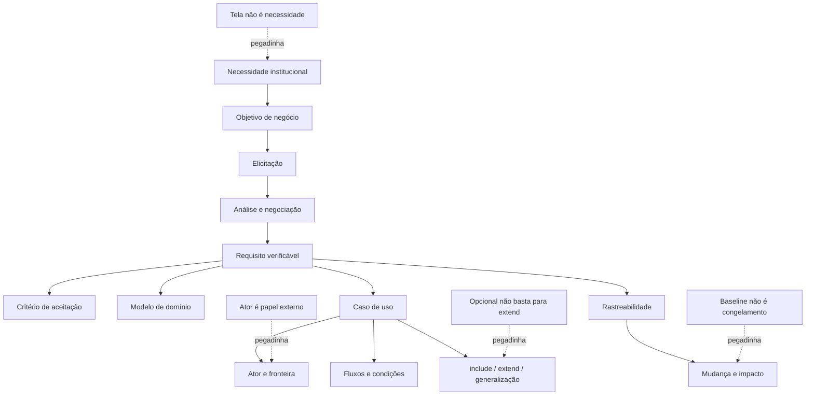
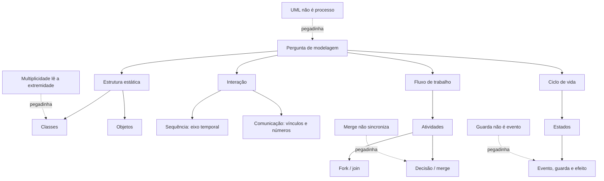
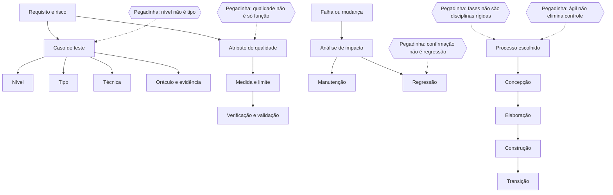
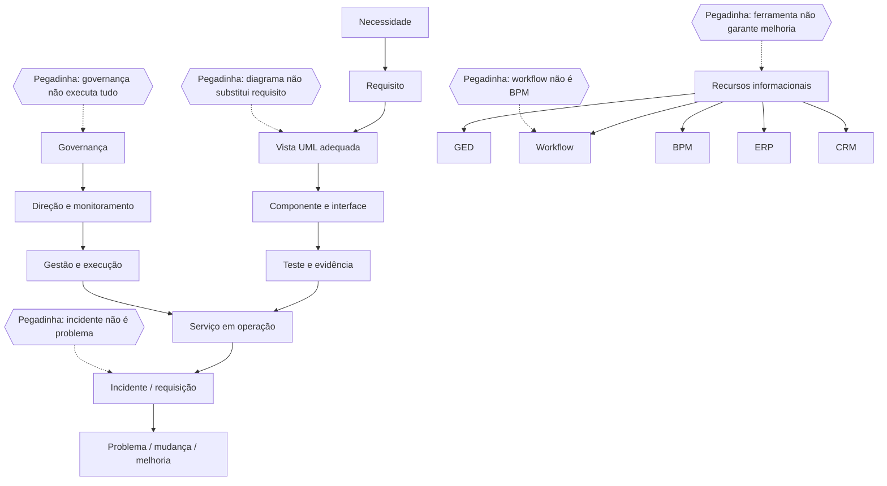

# Apostila de Estudo — Semana 4

> **Execução:** use `semana_04_jornada.md` como cronograma vigente. A apostila ensina antes de cobrar; o banco completo é distribuído entre D0, D+2, D+7, D+21, aprofundamento e simulado.

## CRA-PR 2026 — Analista de Sistemas

- **Período:** 03/08/2026 a 08/08/2026.
- **Foco técnico:** requisitos, análise e projeto orientados a objetos, UML, engenharia de software, testes, qualidade, manutenção, gerenciamento de projetos e gestão de recursos informacionais em primeiro contato.
- **Banca:** Instituto Consulplan.
- **Situação do material:** **Material aprovado para execução**; execução do candidato não presumida.

## Versão do edital e limite da cobertura

O recorte foi conferido no edital consolidado conforme Retificação I, preservado em `../edital/edital_cra_pr_2026_analista_sistemas_retificacao_1.pdf`, especialmente na página 28, itens 13 a 17 de Conhecimentos do Cargo.

Esta semana cobre ou inicia, conforme o Plano Mestre:

- análise e projeto orientados a objetos e casos de uso;
- UML: classes, objetos, estados, comunicação/colaboração, sequência, atividades, componentes e implementação/implantação;
- ferramentas de apoio à análise, ao projeto e à codificação;
- engenharia de software e modelos cascata, espiral, orientado a reuso, prototipação, RAD, evolucionário e incremental;
- fases de concepção, elaboração, construção e transição;
- testes, qualidade e manutenção como desdobramentos operacionais de engenharia de software previstos no cronograma;
- conceitos, planejamento, acompanhamento e controle de projetos, com primeiro contato em escopo, WBS/EAP, tempo, custos, qualidade, recursos humanos, comunicações, riscos, aquisições e integração;
- GED, workflow, BPM, ERP, CRM, ITIL e COBIT em visão inicial, preparando a retomada da Semana 7.

O edital cita `PMBOK`, `ITIL` e `COBIT` sem fixar edição. Por isso, o núcleo desta semana ensina conceitos duráveis e explicita qualquer detalhe dependente de versão; uma edição corrente não é presumida como recorte obrigatório da prova. Do mesmo modo, a teoria de testes, qualidade e manutenção não inventa norma ou versão ausente do edital.

## Fontes técnicas de controle

Para terminologia e atualização, a produção foi contrastada com fontes primárias:

- [especificação oficial UML 2.5.1 — OMG](https://www.omg.org/spec/UML/2.5.1);
- [página oficial do PMBOK — PMI](https://www.pmi.org/standards/pmbok), usada sem impor edição ao edital;
- [estrutura oficial do ITIL — PeopleCert](https://www.peoplecert.org/Frameworks-Professionals/ITIL-framework), usada apenas no nível introdutório previsto;
- [página oficial do COBIT — ISACA](https://www.isaca.org/resources/cobit), usada para distinguir governança e gestão de informação e tecnologia.

Essas fontes controlam precisão, mas não ampliam a cobrança. A aderência à Consulplan aparece no tipo de decisão exigida: comando preciso, alternativas do mesmo domínio, cenários curtos, associação de artefato a finalidade e atenção especial a `EXCETO`, `INCORRETA` e `NÃO`.

## Prioridade na prova

Conhecimentos do Cargo possuem 15 questões e valem 30 pontos, a maior parcela técnica da objetiva. Requisitos, UML e engenharia se encadeiam: uma mesma situação pode pedir a necessidade correta, o diagrama adequado, o modelo de ciclo de vida e o mecanismo de controle. Por isso, o tema principal ocupa os Blocos 1–3, enquanto as revisões acumuladas ficam dentro do Bloco 4, sem criar uma sessão extra.

## Como usar esta apostila

1. abra a jornada e siga apenas as âncoras do dia;
2. conclua Blocos 1–3 e o produto prático antes das questões principais;
3. cumpra Blocos 4–6 somente dentro dos tempos declarados;
4. resolva seis questões principais Essenciais em D0 e avance até dez apenas quando couber correção integral A–D;
5. marque confiança de 0 a 3 antes de consultar o gabarito;
6. registre regra, causa do erro, contraexemplo e datas D+2, D+7 e D+21;
7. deixe Aprofundamento, Revisão e Simulado nas filas próprias: 420 itens não significam 420 itens na primeira passagem;
8. use as questões oficiais somente no caderno original e como substituição de itens da fila Simulado.

## Rotina diária fixa — 6h líquidas

| Etapa | Tempo | Função |
|---|---:|---|
| Sessão A | 170 min | Blocos 1–3: aquisição, contraste, exemplo e produto prático |
| Sessão B | 170 min | Blocos 4–6, seis Essenciais, correção e fechamento |
| Consolidação | 20 min | caderno de erros, confiança e agendamento |
| **Total** | **360 min** | pausas fora da carga líquida |

A ordem física é obrigatória: teoria-base, aprofundamento, aplicação, revisão fixa, Português/discursiva, recuperação ativa, mini revisão, questões, correção e fechamento.

## Mapa da Semana 4

| Dia | Blocos 1–3 | Bloco 4 | Bloco 5 | Bloco 6 |
|---:|---|---|---|---|
| 1 | requisitos, análise orientada a objetos e casos de uso | Legislação CRA/CFA + D+21 da Semana 1 + saldos da Semana 3 | Português e recorte/tese | recuperação do Dia 1 |
| 2 | classes, objetos, sequência, comunicação, atividades e estados | Administração Pública + D+21 da Semana 1 + D+7 da Semana 3 | Português e desenvolvimento 1 | recuperação dos Dias 1–2 |
| 3 | componentes, implementação/implantação e ferramentas de apoio | Legislação CRA/CFA + D+21 da Semana 1 + D+7 da Semana 3 | Português e desenvolvimento 2 | recuperação de requisitos/UML |
| 4 | engenharia, modelos de ciclo de vida e projetos em primeiro contato | Administração Pública/RLM + D+21 da Semana 1 + D+7 da Semana 3 | Português e introdução/conclusão | recuperação dos Dias 3–4 |
| 5 | testes, qualidade, manutenção e fases do processo | Legislação CRA/CFA + D+21 da Semana 1 + D+7 da Semana 3 | Português e plano integral | recuperação de engenharia/testes |
| 6 | integração UML/engenharia e noções de GED, workflow, BPM, ERP, CRM, ITIL e COBIT | D+21 da Semana 1 + D+7 da Semana 3 | Português e texto integral | caderno de erros integrado |

## Matriz de rastreabilidade da cobertura

| Tópico do edital/cronograma | Dia e seção de teoria | Questões principais | Extras | Estado de produção |
|---|---|---|---|---|
| requisitos, OO e casos de uso | Dia 1 | S4D1Q001–S4D1Q050 | revisão fixa do Dia 1 | coberto |
| UML estrutural e comportamental do Dia 2 | Dia 2 | S4D2Q051–S4D2Q100 | revisão fixa do Dia 2 | coberto |
| componentes, implantação e ferramentas | Dia 3 | S4D3Q101–S4D3Q150 | revisão fixa do Dia 3 | coberto |
| engenharia, ciclos de vida e projetos inicial | Dia 4 | S4D4Q151–S4D4Q200 | revisão fixa do Dia 4 | coberto |
| testes, qualidade, manutenção e fases | Dia 5 | S4D5Q201–S4D5Q250 | revisão fixa do Dia 5 | coberto |
| integração e gestão de recursos informacionais inicial | Dia 6 | S4D6Q251–S4D6Q300 | revisão fixa do Dia 6 | coberto |

O estado `coberto` registra que teoria, exemplos, 420 itens e super simulado passaram pelas auditorias; não presume a execução pelo candidato. Programação, APIs, DevOps, contratação de TIC e aprofundamento de governança continuam nas semanas do Plano Mestre.

---

# Dia 1 — Requisitos, análise orientada a objetos e casos de uso

## Objetivo do dia

Transformar uma necessidade institucional em requisitos verificáveis e em um modelo de análise orientado a objetivos dos usuários. Ao final, o estudante deverá distinguir problema, solução, requisito, regra e restrição; conduzir elicitação, análise, especificação, validação e gestão; reconhecer objetos, classes e responsabilidades no domínio; e interpretar casos de uso, atores, fronteira, fluxos e relacionamentos sem atribuir à UML decisões que pertencem ao negócio.

O Dia 1 não ensina diagramas detalhados de classes, sequência, comunicação, atividades ou estados. Esses diagramas entram no Dia 2. Ciclos de vida, testes e qualidade ficam para os Dias 4 e 5.

## Resultados esperados

Ao concluir o dia, você deve conseguir:

- separar necessidade, requisito, regra de negócio, restrição e solução;
- classificar requisitos funcionais, de qualidade, de interface, de dados e restrições;
- reconhecer requisitos claros, necessários, viáveis, consistentes, rastreáveis e verificáveis;
- escolher técnicas de elicitação conforme fonte, incerteza e conflito;
- analisar escopo, dependências, prioridade, risco e critérios de aceitação;
- validar requisitos com os interessados e controlar mudanças por impacto;
- distinguir análise orientada a objetos de projeto orientado a objetos;
- identificar classe, objeto, atributo, operação, responsabilidade e colaboração;
- delimitar ator, objetivo, fronteira e fluxo de um caso de uso;
- empregar inclusão, extensão e generalização pelo significado, não pela aparência;
- recuperar Legislação CRA/CFA e interpretar relações semânticas em Português;
- entregar um caderno de erros sem conteúdo novo.

## Por que esse assunto importa para a prova

O item 13 do conteúdo do cargo prevê análise e projeto orientado a objetos com UML e diagramas de casos de uso. Engenharia de requisitos fornece a ponte entre a necessidade administrativa e esses modelos. Uma questão pode narrar um pedido vago, uma regra institucional, um conflito entre áreas ou uma mudança de escopo e pedir a atividade adequada, o tipo de requisito, a característica ausente ou a relação correta entre casos de uso.

No perfil documentado do Instituto Consulplan, o detalhe discriminador costuma estar no verbo e no efeito: “o sistema deve emitir” descreve comportamento; “em até dois segundos” estabelece qualidade mensurável; “conforme norma vigente” introduz restrição; “sempre autenticar antes de protocolar” pode justificar comportamento comum incluído. Leia o caso antes de procurar a sigla.

## Jornada resumida — 6 horas líquidas

| Sessão | Etapa | Tempo | Entrega |
|---|---|---:|---|
| A | Bloco 1 | 55 min | quadro `necessidade × requisito × regra × restrição` |
| A | Bloco 2 | 55 min | cadeia de elicitação, análise, especificação, validação e mudança |
| A | Bloco 3 | 60 min | modelo de domínio e caso de uso do protocolo digital |
| B | Bloco 4 | 60 min | revisão Legislação CFA/CRA + filas D+21/D+7/D+2 |
| B | Bloco 5 | 30 min | Português: inferência, coesão e reescrita |
| B | Bloco 6 | 15 min | recuperação sem consulta e caderno de erros |
| B | Mini revisão | 10 min | dez respostas orais e conferência |
| B | Seis Essenciais D0 | 25 min | S4D1Q001–S4D1Q006 |
| B | Correção A–D | 25 min | justificativa de todas as alternativas |
| B | Fechamento | 5 min | confiança e agendamento |
| — | Consolidação | 20 min | registro final de erros e datas |
| **Total** |  | **360 min** | **dia encerrado sem esgotar o banco** |

**Ponto de parada da Sessão A:** entregar uma folha com cinco requisitos reescritos, seus critérios de aceitação, quatro elementos do modelo de domínio e um caso de uso com fluxo principal e duas alternativas. Pare a teoria aos **170 minutos** mesmo que sobrem leituras; o restante do banco abre ciclos futuros. Os 60 minutos do Bloco 4 acomodam, nesta ordem, a revisão fixa e as filas vencidas D+21 da Semana 1, D+7 da Semana 3 e D+2 imediatamente aplicável, sem aumentar as seis horas.

## Matriz de rastreabilidade do Dia 1

| Tópico do edital | Teoria anterior à cobrança | Exemplos completos | Principais | Extras | Status |
|---|---|---:|---|---|---|
| requisitos: conceitos, tipos e qualidade | [Bloco 1](#s4-d1-b1) | 4 | S4D1Q001–S4D1Q010 | — | Coberto |
| elicitação, análise, especificação e validação | [Bloco 2](#s4-d1-b2) | 6 | S4D1Q011–S4D1Q030 | — | Coberto |
| análise e projeto orientado a objetos | [Análise OO](#s4-d1-oo) | 2 | S4D1Q031–S4D1Q038 | — | Coberto |
| casos de uso e relacionamentos | [Casos de uso](#s4-d1-casos-uso) | 6 | S4D1Q039–S4D1Q050 | — | Coberto |
| Legislação CFA/CRA | [Bloco 4](#s4-d1-b4) | 2 | — | 1.1–1.10 | Coberto por revisão |
| Português | [Bloco 5](#s4-d1-b5) | 2 | — | 1.11–1.20 | Coberto por revisão |
| recuperação ativa | [Bloco 6](#s4-d1-b6) | entrega prática | — | sem item objetivo | Coberto; sem teoria nova |

## Bloco 1 — Fundamentos, tipos e qualidade dos requisitos

### 1. Necessidade, requisito, regra, restrição e solução

**Necessidade** é o problema ou resultado desejado: reduzir o tempo de resposta ao profissional. **Requisito** expressa uma capacidade, condição ou qualidade que o sistema deve satisfazer: permitir consulta ao andamento pelo número do protocolo. **Regra de negócio** determina ou limita o comportamento do domínio: somente processo com decisão publicada pode aparecer como encerrado. **Restrição** reduz o espaço de solução, por exemplo integração obrigatória com serviço institucional já existente. **Solução** é uma forma concreta de atender aos requisitos; tela, banco e framework não devem aparecer como necessidade quando ainda existem alternativas legítimas.

O requisito deve indicar o efeito observável, o sujeito responsável e o contexto. “Criar uma tela moderna” descreve prematuramente uma interface. “Permitir ao fiscal registrar vistoria em dispositivo móvel, inclusive sem conexão, e sincronizar depois” revela capacidade e condições que podem ser verificadas.

### 2. Tipos e níveis de requisitos

| Categoria | Pergunta central | Exemplo no CRA |
|---|---|---|
| objetivo/negócio | por que o investimento existe? | reduzir retrabalho no protocolo |
| usuário/interessado | o que o papel precisa alcançar? | fiscal consulta processos atribuídos |
| funcional | que comportamento o sistema oferece? | sistema registra despacho e notifica interessado |
| qualidade ou não funcional | quão bem ou sob qual qualidade? | consulta responde em até dois segundos no percentil definido |
| interface externa | com que pessoa ou sistema interage? | consumir identidade institucional |
| dados | que informação, regra e retenção são necessárias? | guardar autor, instante e versão do despacho |
| restrição | que limite obrigatório condiciona a solução? | utilizar infraestrutura homologada |
| derivado | que necessidade nasce de outra? | auditoria é derivada da exigência de responsabilização |

“Não funcional” não significa opcional nem alheio ao usuário. Desempenho, disponibilidade, segurança, acessibilidade e usabilidade afetam o serviço e precisam ser mensuráveis. Uma regra de negócio pode originar vários requisitos funcionais e de dados, mas não se confunde automaticamente com eles.

### 3. Qualidade, critérios de aceitação e verificabilidade

Um requisito útil deve ser, no contexto do projeto:

- **necessário:** sua ausência compromete objetivo ou obrigação;
- **claro e singular:** evita termos vagos e mistura de comportamentos independentes;
- **consistente:** não contradiz outro requisito válido;
- **viável:** pode ser implementado dentro das restrições conhecidas;
- **rastreável:** possui origem e ligações com objetivos, modelos, testes e mudanças;
- **verificável:** permite evidência objetiva de atendimento;
- **priorizado:** tem importância relativa e justificativa;
- **modificável:** pode ser alterado com impacto identificável.

Termos como “rápido”, “intuitivo”, “seguro” e “quando possível” não bastam sem métrica e contexto. Um **critério de aceitação** concretiza a condição observável. Para desempenho, informe operação, carga, ambiente, medida e limiar; para permissão, informe papel, recurso, operação e resultado esperado. Verificabilidade não significa que todo requisito precise ser demonstrado exclusivamente por teste: inspeção, análise, demonstração e teste são formas possíveis de obter evidência objetiva, conforme a natureza do requisito.

### Exemplos resolvidos — fundamentos e tipos

#### Exemplo 1 — desejo de gestão não é requisito de solução

**Situação:** a direção declara: “precisamos diminuir o prazo médio de resposta dos protocolos”.

**Dados relevantes:** há um resultado institucional, mas não foi definida capacidade do sistema nem solução.

**Raciocínio passo a passo:**

1. identificar o verbo “diminuir” e o indicador “prazo médio”;
2. reconhecer um objetivo de negócio;
3. evitar inventar tela, aplicativo ou automação;
4. derivar requisitos somente após entender causas, usuários e fluxo.

**Resposta:** a frase é objetivo/necessidade de negócio; ainda precisa ser decomposta em requisitos verificáveis.

**Por que funciona:** preserva o problema antes de escolher a solução.

**Erro provável:** classificar a frase como requisito funcional apenas porque pode motivar software.

#### Exemplo 2 — regra e requisito trabalham juntos

**Situação:** a área afirma que somente servidores designados podem assinar determinado despacho.

**Dados relevantes:** há condição do domínio, sujeito autorizado e ação protegida.

**Raciocínio passo a passo:**

1. registrar a regra de negócio sobre autorização;
2. derivar o requisito funcional de impedir assinatura por papel não designado;
3. derivar requisito de dados para manter designações vigentes;
4. definir critério de aceitação para autorizado e não autorizado.

**Resposta:** a declaração é regra de negócio que origina requisitos funcionais, de dados e testes de permissão.

**Por que funciona:** separa a política institucional dos mecanismos que a realizam.

**Erro provável:** chamar a própria regra de “tela de login”.

### Exemplos resolvidos — qualidade e aceitação

#### Exemplo 1 — tornar desempenho verificável

**Situação:** o rascunho diz: “a consulta deve ser rápida”.

**Dados relevantes:** não há operação delimitada, carga, estatística nem limite.

**Raciocínio passo a passo:**

1. identificar a consulta crítica;
2. fixar um cenário de carga representativo;
3. escolher métrica, como tempo de resposta no percentil 95;
4. definir limiar e ambiente de medição.

**Resposta possível:** “sob até 200 consultas concorrentes no ambiente de homologação definido, 95% das consultas de protocolo devem responder em até dois segundos”.

**Por que funciona:** produz evidência repetível de aceitação.

**Erro provável:** trocar “rápida” por “muito rápida” sem criar métrica.

#### Exemplo 2 — separar duas obrigações

**Situação:** “o sistema deve receber o pedido, validar anexos, calcular taxa e enviar confirmação”.

**Dados relevantes:** quatro comportamentos podem mudar, falhar ou ser priorizados separadamente.

**Raciocínio passo a passo:**

1. localizar cada verbo;
2. dividir os comportamentos em requisitos singulares;
3. registrar dependências e ordem;
4. criar critérios próprios para sucesso e falha.

**Resposta:** o enunciado deve ser decomposto em requisitos ligados por rastreabilidade.

**Por que funciona:** singularidade facilita análise de impacto e teste.

**Erro provável:** preservar a frase porque ela é gramaticalmente clara, ignorando sua indivisibilidade gerencial.

## Bloco 2 — Elicitação, análise, especificação, validação e gestão

### 4. Elicitação: descobrir, não apenas perguntar

Elicitar é obter e explorar informação de fontes relevantes. O analista prepara objetivo, seleciona participantes, aplica técnica, registra evidência e confirma entendimento. Entrevista aprofunda decisões e exceções; oficina aproxima áreas em conflito; observação revela trabalho real e atalhos; análise documental recupera regras e formulários; questionário amplia alcance; protótipo explora interação e reduz mal-entendidos. Nenhuma técnica garante sozinha requisito completo.

O interessado não é apenas o usuário da tela. Inclui patrocinador, operador, suporte, segurança, jurídico, dono do processo, responsáveis por sistemas externos ou integrações e pessoas afetadas. Um componente técnico, uma norma ou um sistema externo é fonte ou elemento do contexto; não se torna, por si só, parte interessada. A escolha deve considerar poder decisório, conhecimento, impacto e disponibilidade.

### 5. Análise, modelagem e priorização

Analisar significa eliminar duplicidades, descobrir lacunas, resolver conflitos, delimitar escopo, verificar viabilidade, decompor requisitos, modelar relações e avaliar dependências. Priorizar não é obedecer à pessoa mais influente sem critério. Valor, risco, obrigação, custo, dependência e urgência precisam estar explícitos.

Quando duas áreas discordam, registre a fonte e a razão de cada posição, procure regra superior ou objetivo comum, avalie alternativas e obtenha decisão do responsável. Não “valide” o requisito escolhendo silenciosamente uma versão.

Um modelo é representação parcial para responder perguntas. Modelo de contexto esclarece fronteira e interfaces; modelo de domínio organiza conceitos; caso de uso mostra objetivos e interações; protótipo explora interface. O modelo não substitui conversa nem cria automaticamente verdade.

### 6. Especificação e validação

Especificar é registrar requisitos e atributos com precisão adequada ao trabalho: identificador, texto, fonte, justificativa, prioridade, estado, critérios e relações. Validação pergunta se o conjunto representa a necessidade correta; verificação interna examina clareza, consistência e conformidade do artefato. Revisões, inspeções, protótipos e derivação de testes ajudam a encontrar defeitos cedo.

Perguntas de validação:

1. este requisito é necessário e está dentro do escopo?
2. pessoas afetadas e responsáveis concordam com o significado?
3. existe conflito com outra regra?
4. é viável nas restrições conhecidas?
5. existe método adequado — como inspeção, análise, demonstração ou teste — para obter evidência objetiva de atendimento?
6. origem e critérios estão registrados?

### 7. Gestão, baseline, mudança e rastreabilidade

Requisitos mudam. A gestão controla versão, estado, responsável, baseline, solicitação, decisão e impacto. **Baseline** é uma versão acordada usada como referência; não congela eternamente o projeto. Uma mudança deve ser identificada, analisada, aprovada ou rejeitada por autoridade definida, incorporada de forma controlada e comunicada.

A rastreabilidade pode ligar:

- objetivo → requisito;
- fonte → requisito;
- requisito → modelo/caso de uso;
- requisito → componente;
- requisito → teste;
- requisito → solicitação de mudança.

Rastreabilidade bidirecional permite descobrir tanto “por que isto existe?” quanto “o que será afetado?”. Uma matriz cheia de IDs sem relações confiáveis não é rastreabilidade útil.

### Exemplos resolvidos — elicitação

#### Exemplo 1 — procedimento declarado e procedimento real

**Situação:** o manual diz que todo protocolo segue a mesma fila, mas atendentes relatam exceções frequentes.

**Dados relevantes:** documento e prática divergem; a exceção influencia requisitos.

**Raciocínio passo a passo:**

1. analisar o manual para obter regra declarada;
2. observar amostras do trabalho e entrevistar operadores;
3. registrar divergências sem assumir que a prática é correta;
4. levar as exceções ao dono do processo para decisão.

**Resposta:** combinar análise documental, observação e entrevista, seguida de validação institucional.

**Por que funciona:** triangula fontes e separa fato observado de regra autorizada.

**Erro provável:** escolher apenas o manual ou automatizar toda exceção observada.

#### Exemplo 2 — conflito entre unidades

**Situação:** fiscalização quer campos obrigatórios; atendimento quer protocolo mínimo para reduzir fila.

**Dados relevantes:** objetivos legítimos competem e há dependência entre etapas.

**Raciocínio passo a passo:**

1. reunir representantes com poder e conhecimento;
2. mapear objetivo, risco e momento de cada informação;
3. explorar preenchimento progressivo e critérios de completude;
4. registrar decisão, responsável e itens pendentes.

**Resposta:** uma oficina facilitada é adequada para construir entendimento comum e decidir trade-offs.

**Por que funciona:** o conflito é tratado coletivamente com critérios verificáveis.

**Erro provável:** aplicar questionário isolado e considerar vencedora a maioria.

### Exemplos resolvidos — análise e priorização

#### Exemplo 1 — prioridade depende de obrigação e dependência

**Situação:** há três pedidos: tema visual, adequação obrigatória com prazo e relatório que depende dessa adequação.

**Dados relevantes:** valor, obrigação, prazo e dependência não são iguais.

**Raciocínio passo a passo:**

1. identificar a obrigação e seu prazo;
2. mapear o relatório dependente;
3. avaliar valor e custo do tema visual;
4. ordenar com justificativa e capacidade disponível.

**Resposta:** a adequação tende a preceder o relatório dependente; o tema visual não vence apenas por visibilidade.

**Por que funciona:** usa múltiplos critérios e relações técnicas.

**Erro provável:** priorizar por ordem de chegada sem avaliar obrigação.

#### Exemplo 2 — requisito fora da fronteira

**Situação:** o projeto é consulta de protocolo; durante a oficina pedem substituir todo o sistema financeiro.

**Dados relevantes:** o pedido pode ser valioso, mas não decorre do objetivo nem da fronteira aprovada.

**Raciocínio passo a passo:**

1. comparar pedido com objetivo e escopo;
2. registrar a necessidade sem descartá-la informalmente;
3. avaliar interfaces necessárias;
4. encaminhar eventual iniciativa separada à governança.

**Resposta:** manter apenas a integração necessária no escopo e tratar a substituição como demanda distinta.

**Por que funciona:** evita expansão silenciosa e preserva rastreabilidade da decisão.

**Erro provável:** implementar o novo pedido porque surgiu de interessado legítimo.

### Exemplos resolvidos — validação, mudança e rastreabilidade

#### Exemplo 1 — protótipo aprovado não valida tudo

**Situação:** usuários aprovam as telas de consulta; não foram discutidos autorização, carga nem indisponibilidade.

**Dados relevantes:** a aparência foi explorada, mas qualidades e exceções permanecem abertas.

**Raciocínio passo a passo:**

1. delimitar o que o protótipo demonstrou;
2. listar requisitos não exercitados;
3. validar fluxos, regras e qualidades por técnicas adequadas;
4. registrar decisões e lacunas.

**Resposta:** a aprovação valida aspectos da interação, não o conjunto integral de requisitos.

**Por que funciona:** cada evidência sustenta apenas o que realmente examinou.

**Erro provável:** tratar protótipo visual como aceite técnico completo.

#### Exemplo 2 — impacto de mudança

**Situação:** após baseline, muda o prazo de recurso de dez para cinco dias no cenário do projeto.

**Dados relevantes:** a regra afeta validação de data, mensagens, caso de uso, testes e talvez integração.

**Raciocínio passo a passo:**

1. abrir solicitação com fonte e justificativa;
2. seguir ligações do requisito para modelos, componentes e testes;
3. estimar impacto e obter decisão;
4. atualizar versão, artefatos e comunicação.

**Resposta:** a baseline é alterada de modo controlado após análise; não se edita apenas a frase original.

**Por que funciona:** a rastreabilidade reduz omissões e mantém coerência.

**Erro provável:** rejeitar a mudança porque a baseline seria imutável.

## Bloco 3 — Análise orientada a objetos e casos de uso

### 8. Análise e projeto orientado a objetos

Na **análise**, o foco é compreender conceitos, responsabilidades e colaborações do domínio, evitando detalhes desnecessários de tecnologia. No **projeto**, essas abstrações recebem decisões de software: interfaces, classes de controle, persistência, padrões e distribuição de responsabilidades.

**Objeto** é uma ocorrência com identidade, estado e comportamento. **Classe** descreve características e operações compartilhadas por objetos. **Atributo** representa estado relevante; **operação** expressa comportamento. **Abstração** seleciona propriedades úteis; **encapsulamento** protege decisões internas atrás de responsabilidades; **generalização** organiza especialização; **associação** representa vínculo significativo.

Uma classe de análise deve ter responsabilidade coerente. **Alta coesão** mantém responsabilidades relacionadas; **baixo acoplamento** reduz dependências desnecessárias. Substantivo não vira classe automaticamente: “sistema”, “cadastro” e “dados” podem ser vagos; verbos também não viram operações sem examinar quem possui a responsabilidade.

### Exemplos resolvidos — análise orientada a objetos

#### Exemplo 1 — localizar conceitos do domínio

**Situação:** “O profissional envia requerimento; o protocolo registra data e o servidor responsável profere despacho”.

**Dados relevantes:** existem participantes, artefatos com identidade e comportamentos.

**Raciocínio passo a passo:**

1. identificar Profissional, Requerimento, Protocolo, Servidor e Despacho como candidatos;
2. rejeitar “envia” e “registra” como classes;
3. atribuir responsabilidades sem decidir banco ou framework;
4. validar termos com especialistas.

**Resposta:** os substantivos relevantes são candidatos a classes do domínio, sujeitos a validação; verbos sugerem associações e responsabilidades.

**Por que funciona:** a análise modela significado antes de tecnologia.

**Erro provável:** criar uma classe para cada substantivo e um método em uma classe central “Sistema”.

#### Exemplo 2 — mover responsabilidade para o dono da informação

**Situação:** uma classe ControladorGeral calcula prazo, muda situação, gera documento, autentica e envia e-mail.

**Dados relevantes:** responsabilidades pertencem a conceitos e serviços distintos.

**Raciocínio passo a passo:**

1. agrupar cada comportamento por informação necessária;
2. atribuir cálculo de prazo ao conceito/política correspondente;
3. separar autenticação e notificação como colaborações;
4. manter um coordenador apenas para orquestração indispensável.

**Resposta:** redistribuir responsabilidades aumenta coesão e reduz dependência de uma classe central.

**Por que funciona:** cada elemento passa a ter motivo mais claro para mudar.

**Erro provável:** considerar encapsulamento apenas como tornar todos os atributos privados, sem rever responsabilidades.

### 9. Casos de uso: ator, objetivo, fronteira e fluxo

Um **caso de uso** representa um conjunto de comportamentos do sistema que produz resultado de valor para um ator. O nome costuma usar verbo no infinitivo e objeto: “Consultar andamento”. **Ator** é um papel externo que interage com o sistema; não é necessariamente pessoa, cargo nominal nem objeto interno. Um mesmo indivíduo pode desempenhar mais de um papel, e outro sistema pode ser ator.

A **fronteira** mostra o sistema modelado. Atores ficam fora; casos de uso, dentro. Caso de uso não é tela, botão, etapa interna isolada nem organograma. Sua descrição textual pode conter:

- objetivo e escopo;
- ator primário e interessados;
- gatilho;
- precondições;
- fluxo principal;
- fluxos alternativos e de exceção;
- pós-condições de sucesso e garantia mínima;
- regras e requisitos relacionados.

Precondição é estado assumido antes do início, não passo executado pelo caso. Pós-condição descreve estado garantido ao final, não desejo genérico.

### 10. Inclusão, extensão e generalização

**Inclusão — «include»:** o caso base incorpora obrigatoriamente o comportamento reutilizado. A seta de dependência parte do caso base e aponta para o incluído. Use para comportamento comum significativo; não decomponha cada clique.

**Extensão — «extend»:** o caso extensor acrescenta fragmentos de comportamento em um ou mais pontos de extensão de um caso base que permanece significativo sem ele. A seta parte do extensor e aponta para o caso base. A condição é opcional na UML 2.5.1: se existir, deve ser satisfeita quando o primeiro ponto de extensão for alcançado; sem condição associada, a extensão é incondicional nos pontos especificados.

**Generalização:** ator ou caso específico herda relações e comportamento do mais geral e pode especializá-lo. Não equivale a include nem a sequência temporal.

Entre casos de uso, simples ordem “A acontece antes de B” não cria include. Obrigatoriedade, reutilização e autonomia do objetivo precisam ser avaliadas.

### Exemplos resolvidos — casos de uso

#### Exemplo 1 — ator é papel externo

**Situação:** Ana consulta o próprio protocolo e, em outro momento, atua como servidora que analisa requerimentos.

**Dados relevantes:** a mesma pessoa exerce objetivos e permissões distintos.

**Raciocínio passo a passo:**

1. abstrair a pessoa nominal;
2. identificar os papéis “Interessado” e “Analista”;
3. ligar cada papel aos objetivos pertinentes;
4. não modelar o banco como ator se ele pertence ao sistema.

**Resposta:** Ana pode instanciar dois atores/papéis diferentes no modelo.

**Por que funciona:** ator representa relação com o sistema, não identidade civil.

**Erro provável:** criar ator “Ana” ou fundir os papéis por serem exercidos pela mesma pessoa.

#### Exemplo 2 — fronteira correta

**Situação:** o Portal de Serviços consulta um provedor externo de identidade.

**Dados relevantes:** o Portal é o sistema modelado; o provedor está fora e interage com ele.

**Raciocínio passo a passo:**

1. declarar o escopo do Portal;
2. colocar os casos do Portal dentro da fronteira;
3. representar o provedor externo como ator de apoio;
4. evitar desenhar classes internas no diagrama de casos.

**Resposta:** Provedor de Identidade é ator externo; autenticação interna do Portal é comportamento, conforme o recorte.

**Por que funciona:** a fronteira define o que será construído e o que apenas colabora.

**Erro provável:** afirmar que sistema nunca pode ser ator.

### Exemplos resolvidos — fluxos e condições

#### Exemplo 1 — fluxo principal e alternativa

**Situação:** no caso “Protocolar requerimento”, anexos válidos geram número; anexo inválido solicita correção.

**Dados relevantes:** há caminho normal e desvio sob condição verificável.

**Raciocínio passo a passo:**

1. escrever o fluxo principal com submissão, validação, registro e confirmação;
2. localizar a condição “anexo inválido”;
3. registrar fluxo alternativo no passo de validação;
4. definir pós-condição de sucesso e garantia mínima.

**Resposta:** confirmação e número pertencem ao sucesso; rejeição orientada é fluxo alternativo, não novo ator.

**Por que funciona:** o desvio permanece relacionado ao mesmo objetivo.

**Erro provável:** criar um caso de uso para cada mensagem de erro.

#### Exemplo 2 — precondição não é primeiro passo

**Situação:** “o interessado está autenticado” foi escrito como passo 1 de “Consultar dados restritos”.

**Dados relevantes:** autenticação já deve existir quando o caso começa.

**Raciocínio passo a passo:**

1. perguntar se o caso executa ou apenas assume o estado;
2. se assume, registrar como precondição;
3. se autenticar é comportamento obrigatório reutilizável, modelar separadamente conforme escopo;
4. não duplicar a mesma ação em todos os fluxos.

**Resposta:** no enunciado, “estar autenticado” é precondição.

**Por que funciona:** separa estado de entrada de interação realizada pelo caso.

**Erro provável:** tratar toda precondição como include.

### Exemplos resolvidos — include, extend e generalização

#### Exemplo 1 — comportamento obrigatório reutilizado

**Situação:** “Protocolar recurso” e “Atualizar cadastro” sempre precisam “Validar identidade”, que possui fluxo significativo próprio.

**Dados relevantes:** o comportamento é comum e obrigatório nos dois casos.

**Raciocínio passo a passo:**

1. confirmar obrigatoriedade;
2. confirmar reutilização por mais de um caso;
3. preservar resultado compreensível do comportamento;
4. ligar os casos base ao incluído.

**Resposta:** modelar «include» de ambos os casos para “Validar identidade”.

**Por que funciona:** inclusão representa execução obrigatória do comportamento comum.

**Erro provável:** inverter a seta ou usar extend por haver mais de um consumidor.

#### Exemplo 2 — complemento condicional

**Situação:** após “Emitir certidão”, o usuário pode solicitar envio postal mediante escolha e pagamento; emitir certidão continua completo sem isso.

**Dados relevantes:** o comportamento adicional é opcional/condicional e o caso base é autônomo.

**Raciocínio passo a passo:**

1. verificar que a emissão produz valor sem envio postal;
2. identificar condição explícita;
3. modelar “Solicitar envio postal” como extensor;
4. apontar o extensor para “Emitir certidão”.

**Resposta:** usar «extend» condicionado à escolha e às regras aplicáveis.

**Por que funciona:** extensão acrescenta comportamento sem tornar o caso base incompleto.

**Erro provável:** usar include apenas porque o envio ocorre depois da emissão.

### 11. Prática guiada — protocolo digital rastreável

Modele o cenário: profissional envia requerimento; o sistema valida campos e anexos, gera protocolo, encaminha à unidade competente e permite acompanhamento. Determinadas categorias exigem documento adicional. A direção exige trilha de autoria e resposta da consulta em limite mensurável.

**Passo 1 — requisitos:** escreva três funcionais, um de dados, um de qualidade e uma restrição. Cada um recebe ID, fonte e critério.

**Passo 2 — domínio:** proponha Profissional, Requerimento, Documento, Protocolo e Unidade; atribua uma responsabilidade principal a cada conceito.

**Passo 3 — casos:** crie “Protocolar requerimento” e “Consultar andamento”; use extensão apenas se o documento adicional for condicional e estiver modelado como comportamento que realmente justifique caso separado.

**Passo 4 — validação:** simule sucesso, documento inválido, categoria especial, indisponibilidade e acesso sem permissão.

**Produto:** uma folha com requisitos, relações, fluxos e cinco ligações de rastreabilidade. Se alguma decisão depender de regra não fornecida, marque-a como questão aberta; não invente literalidade.

## Bloco 4 — Revisão fixa: Legislação CRA/CFA

Esta é recuperação da base já aprovada na Semana 3, especialmente [fonte, competência e hierarquia](../semana_03/semana_03_estudo.md#s3-d1-revisao-legislacao). Antes das extras, recupere:

| Indício | Regra de decisão |
|---|---|
| orientação e normatização do sistema | verificar competência do CFA e a fonte aplicável |
| registro e fiscalização na jurisdição paranaense | verificar atribuição regional do CRA-PR |
| lei, decreto e resolução | objeto, competência e hierarquia; novidade cronológica não basta |
| organização interna do CRA-PR | consultar o Regimento aprovado pela RN CFA nº 651/2024, vigente na consulta oficial de 19/07/2026 |
| conduta ética | consultar o Código de Ética aprovado pela RN CFA nº 671/2025, vigente na consulta oficial de 19/07/2026 |

Não deduza artigo, prazo ou sanção que não esteja no texto oficial. O bloco treina localização de fonte e competência, não aprofundamento literal reservado à Semana 6.

### Exemplos resolvidos — Legislação CRA/CFA

#### Exemplo 1 — fato regional e orientação nacional

**Situação:** chega notícia de possível exercício irregular no Paraná e surge dúvida interpretativa relevante para todo o sistema.

**Dados relevantes:** execução territorial e orientação sistêmica são planos distintos.

**Raciocínio passo a passo:** localizar o fato; identificar atribuição regional; separar orientação/normatização nacional; consultar as fontes vigentes.

**Resposta:** o CRA-PR atua no âmbito regional de suas atribuições, enquanto o CFA exerce as competências nacionais correspondentes.

**Por que funciona:** distribui papéis sem transformar autonomia em soberania.

**Erro provável:** atribuir toda providência ao CFA ou permitir atuação regional sem jurisdição.

#### Exemplo 2 — ato inferior e lei

**Situação:** uma leitura de resolução parece afastar requisito expresso em lei.

**Dados relevantes:** existe conflito aparente entre atos de níveis diferentes.

**Raciocínio passo a passo:** conferir redação, vigência, objeto e competência; interpretar o ato inferior nos limites da lei; não decidir apenas pela data.

**Resposta:** a resolução não supera automaticamente a lei por ser mais recente.

**Por que funciona:** cronologia não apaga hierarquia e competência.

**Erro provável:** aplicar “norma posterior” sem verificar nível e objeto.

## Bloco 5 — Português: inferência, coesão e reescrita

### 12. Modalidade, referência e preservação de sentido

Palavras de modalidade alteram o alcance: **pode** indica possibilidade ou permissão conforme o contexto; **deve** expressa obrigação ou conclusão forte; **tende a** aponta propensão; **sempre** universaliza. Trocar uma pela outra pode tornar falsa uma reescrita.

Na coesão, pronome e expressão substitutiva precisam ter antecedente identificável. Conectores explicitam relações: porque/pois podem marcar causa ou explicação; portanto/logo, consequência; embora/ainda que, concessão; se/caso, condição; para que/a fim de que, finalidade.

Reescrita correta preserva sentido relevante, relações lógicas, referência, tempo, voz e escopo. Passar da ativa para a passiva exige conservar agente e paciente quando isso importa.

### Exemplos resolvidos — Português

#### Exemplo 1 — possibilidade não vira garantia

**Situação:** “A rastreabilidade pode reduzir omissões na análise de impacto.”

**Dados relevantes:** o verbo modal não promete resultado universal.

**Raciocínio passo a passo:** localizar “pode”; interpretar possibilidade; rejeitar “elimina” e “sempre”; preservar o agente causal provável.

**Resposta:** é válida a paráfrase “a rastreabilidade é capaz de contribuir para a redução de omissões”, sem garantia absoluta.

**Por que funciona:** mantém a modalidade.

**Erro provável:** trocar “pode reduzir” por “impede qualquer omissão”.

#### Exemplo 2 — conector define o vínculo

**Situação:** “Os critérios eram vagos; portanto, não se podia verificar o requisito.”

**Dados relevantes:** a primeira oração apresenta causa; a segunda, consequência.

**Raciocínio passo a passo:** perguntar qual fato explica o outro; manter direção causa → efeito; testar conectores; rejeitar concessão.

**Resposta:** “por isso” preserva o vínculo de consequência; “embora” o alteraria.

**Por que funciona:** o conector substituto mantém a relação lógica.

**Erro provável:** considerar todo conector intercambiável porque une orações.

**Entrega:** reescreva duas frases técnicas: uma preservando modalidade e outra trocando ativa por passiva sem inverter papéis.

## Bloco 6 — Recuperação ativa e caderno de erros

**Tempo:** 15 minutos. **Não há conteúdo novo neste bloco.** Ele recupera apenas os Blocos 1–5 e pontos já estudados.

Sem consulta:

1. dê um exemplo de requisito funcional e outro de qualidade mensurável;
2. diferencie regra, restrição e solução;
3. escolha técnica para conflito entre áreas e justifique;
4. explique por que baseline não significa imutabilidade;
5. trace objetivo → requisito → caso → teste;
6. diferencie classe e objeto;
7. defina ator pela fronteira;
8. compare include e extend;
9. recupere CFA × CRA-PR;
10. explique por que “pode” não equivale a “sempre”.

Confira com outra cor. Cada falha recebe: resposta inicial, regra correta, contraste, exemplo próprio, âncora, confiança de 0 a 3 e datas D+2, D+7 e D+21. A entrega é uma lista de até cinco erros priorizados e duas respostas reescritas.

## Mapa de conexões do Dia 1

## Tabela de revisão rápida do Dia 1

| Se o enunciado mencionar... | Pense primeiro em... |
|---|---|
| resultado institucional | objetivo/necessidade |
| comportamento observável | requisito funcional |
| tempo, segurança ou disponibilidade mensurável | requisito de qualidade |
| política do domínio | regra de negócio |
| tecnologia obrigatória ou limite imposto | restrição |
| divergência entre manual e prática | triangulação e validação |
| versão acordada | baseline controlada |
| origem e impacto | rastreabilidade |
| ocorrência individual | objeto |
| descrição de ocorrências | classe |
| papel fora da fronteira | ator |
| comportamento comum obrigatório | include |
| fragmento adicional inserido em ponto de extensão de base autônoma, com condição quando prevista | extend |

## Pegadinhas do Dia 1

- requisito não é sinônimo de solução;
- não funcional não significa opcional;
- protótipo aprovado não valida qualidades que ele não exercitou;
- entrevista não substitui confirmação e análise;
- prioridade não é apenas vontade do interessado mais influente;
- baseline admite mudança controlada;
- substantivo é candidato a classe, não classe automática;
- ator é papel externo, inclusive outro sistema;
- precondição não é necessariamente primeiro passo;
- sequência temporal não cria include;
- “opcional” ajuda, mas não basta para justificar extend;
- resolução mais recente não supera lei automaticamente;
- reescrita deve preservar modalidade e relação lógica.

## Mini revisão — dez perguntas

1. Como requisito difere de objetivo de negócio?
2. O que torna “rápido” insuficiente?
3. Qual técnica favorece negociação simultânea de conflito?
4. O que a validação pergunta?
5. Para que serve rastreabilidade bidirecional?
6. Qual o foco da análise OO?
7. Por que pessoa e ator não são sinônimos?
8. Quando usar include?
9. Quando usar extend?
10. Que relação “portanto” costuma marcar?

### Respostas da mini revisão

1. O objetivo expressa resultado; o requisito, capacidade, condição ou qualidade necessária.
2. Falta operação, cenário, métrica e limiar verificável.
3. Oficina facilitada, sem excluir análise posterior.
4. Se o conjunto representa a necessidade correta dos interessados.
5. Descobrir origem e impacto nos dois sentidos.
6. Conceitos, responsabilidades e colaborações do domínio.
7. Ator é papel externo; uma pessoa pode exercer vários.
8. Para comportamento comum e obrigatório incorporado pelo caso base.
9. Para acrescentar fragmento modular em ponto de extensão de um caso base autônomo; a condição pode existir, mas sua ausência torna a extensão incondicional.
10. Conclusão ou consequência.

## Checklist de domínio

- [ ] Distingo necessidade, requisito, regra, restrição e solução.
- [ ] Escrevo requisito funcional e qualidade mensurável.
- [ ] Escolho técnica de elicitação pelo problema.
- [ ] Analiso conflito, escopo, dependência e prioridade.
- [ ] Valido requisito com critério objetivo.
- [ ] Explico baseline, mudança e rastreabilidade.
- [ ] Distingo análise de projeto OO.
- [ ] Identifico classes candidatas e responsabilidades.
- [ ] Delimito atores e fronteira.
- [ ] Escrevo fluxo, precondição e pós-condição.
- [ ] Aplico include, extend e generalização sem usar ordem temporal.
- [ ] Recupero competência e hierarquia no bloco CRA/CFA.
- [ ] Preservo modalidade e relação lógica em reescrita.

## Fila de dez Essenciais e correção

| Ordem | ID | Núcleo | Momento |
|---:|---|---|---|
| 1 | S4D1Q001 | necessidade × requisito — [teoria](#s4-d1-conceitos-requisitos) | D0 |
| 2 | S4D1Q002 | requisito funcional — [teoria](#s4-d1-tipos-requisitos) | D0 |
| 3 | S4D1Q003 | qualidade mensurável — [teoria](#s4-d1-qualidade-requisitos) | D0 |
| 4 | S4D1Q004 | regra de negócio — [teoria](#s4-d1-conceitos-requisitos) | D0 |
| 5 | S4D1Q005 | decomposição de requisito composto e rastreável — [exemplo](#s4-d1-exemplos-qualidade) | D0 |
| 6 | S4D1Q006 | restrição de solução — [teoria](#s4-d1-tipos-requisitos) | D0 |
| 7 | S4D1Q007 | critério de aceitação — [teoria](#s4-d1-qualidade-requisitos) | D+2 |
| 8 | S4D1Q008 | qualidades de um bom requisito — comando negativo — [teoria](#s4-d1-qualidade-requisitos) | D+2 |
| 9 | S4D1Q009 | elicitação — [teoria](#s4-d1-elicitacao) | D+2 |
| 10 | S4D1Q010 | diagnóstico integrado de qualidade — [teoria](#s4-d1-qualidade-requisitos) | D+2 |

Resolva seis no D0. Só avance até dez se houver tempo para corrigir A–D e registrar confiança. Os demais itens seguem o uso declarado: Aprofundamento após D+2, Revisão em D+7 e Simulado no ciclo seguinte.

## Fechamento do Dia 1

O dia encerra quando houver:

- produto da Sessão A entregue;
- seis Essenciais corrigidas A–D;
- duas reescritas de Português conferidas;
- recuperação legal respondida sem consulta;
- erros e acertos inseguros registrados;
- S4D1Q007–S4D1Q010 agendadas para D+2;
- confiança por núcleo e datas D+2/D+7/D+21 registradas.

## Fontes do Dia 1

- Edital CRA-PR 2026, item 13 — arquivo local `../edital/edital_cra_pr_2026_analista_sistemas_retificacao_1.pdf`.
- ISO/IEC/IEEE 29148:2018, página oficial, versão confirmada em 2024 e consultada em 19/07/2026: https://www.iso.org/standard/72089.html
- IEEE Computer Society, SWEBOK Guide V4.0a, áreas de requisitos, consultado em 19/07/2026: https://www.computer.org/education/bodies-of-knowledge/software-engineering/topics
- OMG, UML 2.5.1, especificação formal, consultada em 19/07/2026: https://www.omg.org/spec/UML/2.5.1
- Lei nº 4.769/1965: https://www.planalto.gov.br/ccivil_03/leis/l4769.htm
- Decreto nº 61.934/1967: https://www.planalto.gov.br/ccivil_03/decreto/Antigos/D61934.htm
- RN CFA nº 651/2024 — Regimento do CRA-PR: https://documentos.cfa.org.br/?a=show&c=documento&id=955
- RN CFA nº 671/2025 — Código de Ética: https://documentos.cfa.org.br/?a=show&c=documento&id=1038

---

# Dia 2 — UML: classes, objetos, sequência, comunicação, atividades e estados

## Objetivo do dia

Selecionar e interpretar diagramas UML conforme a pergunta de modelagem. Ao final, o estudante deverá representar estrutura estática com classes e objetos; interações ordenadas no tempo com sequência; colaboração estrutural e ordem numerada com comunicação; fluxos, decisões e paralelismo com atividades; e ciclo de vida reativo com máquina de estados. O foco é semântico: a notação deve preservar multiplicidades, condições, responsabilidades e ordem.

Componentes e implementação ficam para o Dia 3. Processos, ciclos de vida, testes e qualidade pertencem aos Dias 4 e 5; não use esses conteúdos para resolver a fila de hoje.

## Resultados esperados

Ao concluir o dia, você deve conseguir:

- explicar UML como linguagem de modelagem, sem chamá-la de método ou processo;
- escolher um diagrama pela pergunta que precisa ser respondida;
- distinguir classe de objeto e especificação de ocorrência;
- interpretar atributos, operações, visibilidade, associações e multiplicidades;
- separar associação, dependência, agregação, composição e generalização;
- ler linhas de vida, mensagens e fragmentos combinados em sequência;
- comparar sequência e comunicação sem atribuir superioridade universal;
- distinguir decisão de merge e fork de join em atividades;
- interpretar fluxo de controle, fluxo de objeto, guardas e raias;
- modelar estado, evento, guarda, efeito e ações internas;
- diferenciar final de atividade, final de fluxo e estado final;
- recuperar Administração Pública e reescrever frases com concordância e pontuação;
- produzir caderno de erros sem conteúdo novo.

## Por que esse assunto importa para a prova

O item 13 do edital enumera explicitamente classes/objetos, estados, colaboração/comunicação, sequência e atividades. A banca pode apresentar descrição textual de um diagrama, multiplicidades, uma sequência de mensagens ou um fluxo com paralelismo e perguntar qual elemento expressa a semântica pretendida. O erro comum é decidir pelo desenho superficial: losango não basta para diferenciar decisão e merge; losango vazio e preenchido não possuem a mesma força; uma seta entre classes não informa sozinha se há associação ou generalização.

Estratégia: identifique primeiro a pergunta — **estrutura**, **fotografia de instâncias**, **tempo da interação**, **topologia da colaboração**, **fluxo de trabalho** ou **reação a eventos**. Depois examine direção, cardinalidade, guarda e efeito.

## Jornada resumida — 6 horas líquidas

| Sessão | Etapa | Tempo | Entrega |
|---|---|---:|---|
| A | Bloco 1 | 55 min | diagrama de classes e fotografia de objetos |
| A | Bloco 2 | 55 min | uma interação em sequência e comunicação |
| A | Bloco 3 | 60 min | atividade com paralelismo e máquina de estados |
| B | Bloco 4 | 60 min | Administração Pública + filas D+21/D+7/D+2 |
| B | Bloco 5 | 30 min | Português: concordância, pontuação e reescrita |
| B | Bloco 6 | 15 min | recuperação sem consulta |
| B | Mini revisão | 10 min | dez respostas orais e conferência |
| B | Seis Essenciais D0 | 25 min | S4D2Q051–S4D2Q056 |
| B | Correção A–D | 25 min | justificativa de todas as alternativas |
| B | Fechamento | 5 min | confiança e agenda |
| — | Consolidação | 20 min | registro final de erros e datas |
| **Total** |  | **360 min** | **dia encerrado com saldo futuro** |

**Ponto de parada da Sessão A:** representar o mesmo caso em quatro perspectivas, concretizadas por seis representações: classes/objetos, sequência/comunicação, atividade e estados. Pare a teoria aos **170 minutos**; não tente resolver as 70 questões no primeiro contato. O Bloco 4 usa seus 60 minutos para a revisão fixa e as filas vencidas D+21 da Semana 1, D+7 da Semana 3 e D+2 da Semana 4, na ordem definida pela jornada semanal.

## Matriz de rastreabilidade do Dia 2

| Tópico do edital | Teoria anterior à cobrança | Exemplos completos | Principais | Extras | Status |
|---|---|---:|---|---|---|
| UML, classes e objetos | [Bloco 1](#s4-d2-b1) | 6 | S4D2Q051–S4D2Q070 | — | Coberto |
| sequência e comunicação | [Bloco 2](#s4-d2-b2) | 4 | S4D2Q071–S4D2Q082 | — | Coberto |
| atividades | [Atividades](#s4-d2-atividades) | 2 | S4D2Q083–S4D2Q090 | — | Coberto |
| estados | [Máquinas de estados](#s4-d2-estados) | 2 | S4D2Q091–S4D2Q100 | — | Coberto |
| Administração Pública | [Bloco 4](#s4-d2-b4) | 2 | — | 2.1–2.10 | Coberto por revisão |
| Português | [Bloco 5](#s4-d2-b5) | 2 | — | 2.11–2.20 | Coberto por revisão |
| recuperação ativa | [Bloco 6](#s4-d2-b6) | entrega prática | — | sem item objetivo | Coberto; sem teoria nova |

## Bloco 1 — UML, diagramas de classes e de objetos

### 1. UML: linguagem, modelo e escolha de perspectiva

A Unified Modeling Language é uma linguagem padronizada de modelagem. Ela fornece conceitos e notação, mas não impõe sozinha um processo de desenvolvimento, uma ordem fixa de diagramas ou uma ferramenta. **Modelo** reúne elementos e relações para determinada finalidade; **diagrama** é uma apresentação parcial desses elementos. O mesmo elemento pode aparecer em mais de um diagrama, e nenhum diagrama isolado precisa mostrar todo o sistema.

| Pergunta | Perspectiva apropriada |
|---|---|
| quais tipos, propriedades e vínculos existem? | classes |
| quais ocorrências e valores existem num instante? | objetos |
| em que ordem participantes trocam mensagens? | sequência |
| quais participantes colaboram e como mensagens são numeradas? | comunicação |
| como o trabalho flui, decide e paraleliza? | atividades |
| como uma entidade reage a eventos conforme seu estado? | máquina de estados |

Escolher diagrama inadequado não torna a informação falsa, mas pode ocultar o aspecto decisivo. Um diagrama de classes não é a melhor ferramenta para expressar a ordem temporal detalhada de mensagens.

### 2. Classes, objetos, atributos, operações e visibilidade

Uma classe pode ser apresentada em compartimentos de nome, atributos e operações. Notação frequente:

- atributo: `-situacao: Situacao`;
- operação: `+protocolar(pedido: Pedido): Protocolo`;
- visibilidade: `+` pública, `-` privada, `#` protegida e `~` de pacote;
- elemento sublinhado: característica estática/de classificador;
- nome em itálico: elemento abstrato, conforme o contexto.

O diagrama de objetos mostra especificações de instâncias e slots, como `p17:Protocolo` com `situacao = EmAnalise`. Ele é uma fotografia possível, não catálogo de todas as instâncias nem substituto do diagrama de classes.

Operação descreve serviço oferecido; método é uma implementação desse comportamento em determinado contexto. Prova conceitual pode explorar essa distinção sem exigir linguagem de programação.

### 3. Associação, papéis, navegabilidade e multiplicidade

Associação representa relação estrutural entre classificadores. Extremidades podem ter nome de papel, multiplicidade e navegabilidade. Multiplicidade indica quantas instâncias podem ocupar a extremidade para uma instância na extremidade oposta:

| Multiplicidade | Leitura |
|---|---|
| `1` | exatamente uma |
| `0..1` | zero ou uma |
| `*` ou `0..*` | zero ou muitas |
| `1..*` | uma ou muitas |
| `2..5` | de duas a cinco |

Leia pela extremidade. Se `Profissional 1 — 0..* Requerimento`, um Profissional pode estar relacionado a zero ou muitos Requerimentos, e cada Requerimento, no recorte, relaciona-se a exatamente um Profissional.

Navegabilidade trata da capacidade modelada de navegar de uma extremidade à outra; não é sinônimo de cardinalidade, propriedade física de banco nem permissão de segurança.

### 4. Generalização, dependência, agregação e composição

**Generalização:** o específico herda características do geral; a seta com triângulo vazio aponta para o geral. Deve representar relação “é um” semanticamente válida.

**Dependência:** um elemento usa ou é afetado por outro de forma menos estrutural; mudança no fornecedor pode afetar o cliente. Parâmetro temporário pode criar dependência sem associação duradoura.

**Agregação compartilhada:** losango vazio na extremidade do todo; relação todo-parte fraca, sem implicar por si só posse exclusiva ou destruição conjunta.

**Composição:** losango preenchido na extremidade do composto; vínculo todo-parte forte. Uma parte não pode pertencer simultaneamente a mais de um composto, e sua existência está ligada ao composto segundo a semântica modelada.

Losango fica no lado do todo. Composição não é usada apenas porque “há objetos dentro de outros” na implementação. A semântica do ciclo de vida decide.

### Exemplos resolvidos — escolha de diagrama e instâncias

#### Exemplo 1 — fotografia de um protocolo

**Situação:** a equipe quer mostrar que, num cenário, `p17:Protocolo` está `EmAnalise` e ligado a `r8:Requerimento`.

**Dados relevantes:** são ocorrências e valores concretos em um instante.

**Raciocínio passo a passo:** identificar instâncias; registrar slots; conectar os objetos; não generalizar para toda ocorrência.

**Resposta:** usar diagrama de objetos, coerente com as classes e associações correspondentes.

**Por que funciona:** o diagrama mostra uma fotografia do estado das instâncias.

**Erro provável:** usar diagrama de classes e escrever valores como se fossem atributos universais.

#### Exemplo 2 — ordem de chamadas

**Situação:** a pergunta é se a validação ocorre antes da persistência e da notificação.

**Dados relevantes:** o aspecto decisivo é a ordem temporal entre participantes.

**Raciocínio passo a passo:** listar participantes; ordenar mensagens; marcar alternativas; evitar sobrecarregar estrutura.

**Resposta:** diagrama de sequência é a perspectiva mais direta.

**Por que funciona:** o eixo vertical evidencia precedência.

**Erro provável:** escolher classes por haver objetos colaborando.

### Exemplos resolvidos — associação e multiplicidade

#### Exemplo 1 — leitura pelas extremidades

**Situação:** `Unidade 1 — 0..* Servidor`.

**Dados relevantes:** cada marca descreve quantos objetos daquela extremidade se relacionam a um da outra.

**Raciocínio passo a passo:** fixar um Servidor e ler `1` em Unidade; fixar uma Unidade e ler `0..*` em Servidor.

**Resposta:** cada Servidor liga-se a uma Unidade; uma Unidade pode ter zero ou muitos Servidores.

**Por que funciona:** evita inverter a leitura visual.

**Erro provável:** dizer que cada Servidor possui muitas Unidades porque `0..*` está próximo dele.

#### Exemplo 2 — intervalo obrigatório

**Situação:** cada comissão deve ter de três a cinco membros, e um servidor pode não integrar comissão.

**Dados relevantes:** há limites mínimo/máximo distintos nos dois lados.

**Raciocínio passo a passo:** na extremidade Membro, usar `3..5` para cada Comissão; na extremidade Comissão, usar `0..*` para cada Servidor; validar se múltiplas comissões são permitidas.

**Resposta:** as multiplicidades registram as duas regras separadamente.

**Por que funciona:** mínimo e máximo são propriedades do vínculo em cada extremidade.

**Erro provável:** usar `1..*` e perder o limite máximo.

### Exemplos resolvidos — relações estruturais

#### Exemplo 1 — composição e ciclo de vida

**Situação:** um Processo possui Peças numeradas que não existem fora dele nem podem migrar para outro Processo.

**Dados relevantes:** exclusividade de pertencimento e ciclo de vida dependente foram definidos.

**Raciocínio passo a passo:** verificar relação todo-parte; confirmar exclusividade; confirmar dependência existencial; posicionar losango no Processo.

**Resposta:** composição pode representar `Processo◆—Peça`.

**Por que funciona:** a semântica forte foi fornecida, não inferida do desenho.

**Erro provável:** colocar o losango na Peça.

#### Exemplo 2 — uso temporário não é associação obrigatória

**Situação:** GeradorDeRelatorio recebe um Formatador como parâmetro apenas durante a operação.

**Dados relevantes:** não foi informado vínculo estrutural mantido.

**Raciocínio passo a passo:** observar uso transitório; reconhecer que mudança no tipo pode afetar o cliente; evitar inventar propriedade duradoura.

**Resposta:** uma dependência pode ser suficiente no modelo.

**Por que funciona:** representa uso sem exagerar a estrutura.

**Erro provável:** modelar composição só porque um objeto chama operação de outro.

## Bloco 2 — Diagramas de sequência e de comunicação

### 5. Sequência: linhas de vida, mensagens e ocorrências

O diagrama de sequência enfatiza a ordem temporal. Participantes aparecem no eixo horizontal; o tempo progride de cima para baixo. A linha de vida representa a existência do participante na interação; a especificação de execução mostra período em que executa comportamento.

Mensagens podem representar chamada síncrona, envio assíncrono, resposta, criação ou destruição. Na síncrona, o emissor normalmente aguarda conclusão; na assíncrona, o envio não pressupõe a mesma espera. Mensagem de retorno pode ser omitida quando o contexto é claro. A ordem vertical continua decisiva.

Criação deve iniciar a linha de vida no ponto correspondente; destruição encerra a linha. Uma mensagem encontrada ou perdida indica extremidade fora do recorte da interação, não “erro de rede” automático.

### 6. Fragmentos combinados, guardas e repetição

| Operador | Semântica principal |
|---|---|
| `alt` | alternativas mutuamente escolhidas por guardas |
| `opt` | trecho condicional único |
| `loop` | repetição segundo condição/limites |
| `par` | operandos com potencial de execução paralela |
| `break` | trecho que, quando executado, abandona o restante da interação envolvente |

Guardas aparecem entre colchetes e precisam ser distinguíveis. `alt` não significa que todos os operandos executam; `par` não obriga ordem total entre operandos, embora preserve ordens internas relevantes.

### 7. Comunicação: vínculos e mensagens numeradas

O diagrama de comunicação modela interação como participantes conectados e mensagens sobre os vínculos. A ordem é indicada por numeração, inclusive níveis como `1`, `1.1` e `1.2`. Ele enfatiza organização estrutural da colaboração; sequência enfatiza o eixo temporal.

Ambos podem representar a mesma interação sob perspectivas diferentes. Comunicação não é o antigo diagrama de componentes; “colaboração” é denominação histórica associada a essa perspectiva. Ao converter:

1. preserve participantes;
2. preserve mensagens e guardas;
3. transforme posição vertical em numeração consistente;
4. preserve aninhamento e ordem.

### Exemplos resolvidos — sequência

#### Exemplo 1 — alternativa de validação

**Situação:** após `validar()`, se os anexos forem válidos o sistema persiste; caso contrário, solicita correção.

**Dados relevantes:** exatamente um de dois caminhos ocorre.

**Raciocínio passo a passo:** localizar ponto de decisão; criar fragmento `alt`; escrever guardas complementares; posicionar mensagens em cada operando.

**Resposta:** `alt [válidos]` contém persistência, e `[inválidos]` contém solicitação de correção.

**Por que funciona:** alternativas condicionais são representadas sem fingir duas execuções.

**Erro provável:** usar `par` e permitir persistir e rejeitar ao mesmo tempo.

#### Exemplo 2 — chamada síncrona e retorno

**Situação:** o controlador solicita cálculo de prazo e precisa do resultado para registrar a data limite.

**Dados relevantes:** a segunda ação depende do valor retornado.

**Raciocínio passo a passo:** enviar chamada ao calculador; representar execução; retornar prazo; só depois registrar data.

**Resposta:** uma chamada síncrona expressa a dependência de conclusão no cenário.

**Por que funciona:** a ordem mostra que o registro usa o resultado.

**Erro provável:** colocar registro acima da chamada ou inferir que todo envio assíncrono devolve valor imediatamente.

### Exemplos resolvidos — comunicação

#### Exemplo 1 — preservar ordem na conversão

**Situação:** na sequência aparecem `consultar()`, depois `validar()` dentro da consulta e, por fim, `responder()`.

**Dados relevantes:** há mensagem externa e chamada aninhada.

**Raciocínio passo a passo:** manter participantes; numerar `1: consultar()`; numerar `1.1: validar()`; numerar a resposta subsequente de forma coerente.

**Resposta:** a comunicação usa numeração hierárquica para preservar aninhamento e ordem.

**Por que funciona:** a posição espacial sozinha não garante temporalidade nesse diagrama.

**Erro provável:** numerar todas as mensagens como `1`.

#### Exemplo 2 — escolher perspectiva

**Situação:** o revisor precisa identificar rapidamente quais objetos possuem vínculos para trocar mensagens; a ordem já é simples.

**Dados relevantes:** topologia da colaboração é a dúvida principal.

**Raciocínio passo a passo:** comparar as duas perspectivas; reconhecer que ambas modelam interação; privilegiar a que destaca ligações.

**Resposta:** comunicação é adequada, sem ser universalmente “melhor” que sequência.

**Por que funciona:** a escolha decorre da pergunta de modelagem.

**Erro provável:** dizer que comunicação não possui ordem.

## Bloco 3 — Diagramas de atividades e máquinas de estados

### 8. Atividades: fluxo, decisão e concorrência

O diagrama de atividades representa comportamento por ações e fluxos. Nó inicial inicia fluxo; final de atividade encerra toda a atividade; final de fluxo encerra apenas o fluxo que o alcança. Raias particionam responsabilidades, mas não alteram automaticamente a ordem.

**Decisão** direciona um fluxo de entrada a uma alternativa conforme guardas. **Merge** reúne caminhos alternativos sem sincronizá-los. **Fork** divide um fluxo em fluxos concorrentes. **Join** sincroniza fluxos concorrentes segundo sua especificação. Confundir merge com join pode permitir avanço antes de todos os trabalhos necessários.

Fluxo de controle transporta habilitação; fluxo de objeto transporta dados/objetos entre ações. Guardas devem ser completas o suficiente para evitar sobreposição ou ausência indesejada.

### Exemplos resolvidos — atividades

#### Exemplo 1 — decisão e merge

**Situação:** se a documentação estiver completa, analisar mérito; senão, solicitar complementação. Depois de qualquer caminho concluído, registrar andamento.

**Dados relevantes:** os caminhos são alternativos, não paralelos.

**Raciocínio passo a passo:** usar decisão com guardas; colocar ações nos ramos; reuni-los em merge; seguir para registro.

**Resposta:** decisão separa e merge reúne alternativas.

**Por que funciona:** merge não espera dois fluxos que nunca coexistem.

**Erro provável:** usar join e bloquear o processo esperando ambos os ramos.

#### Exemplo 2 — fork e join

**Situação:** após protocolar, devem ocorrer em paralelo verificação cadastral e análise documental; decisão final exige ambas.

**Dados relevantes:** duas atividades podem ocorrer concorrentemente e ambas são pré-requisitos.

**Raciocínio passo a passo:** inserir fork após protocolo; criar dois fluxos; executar ações; sincronizar em join; prosseguir.

**Resposta:** fork abre concorrência e join aguarda os dois resultados.

**Por que funciona:** preserva paralelismo e barreira necessária.

**Erro provável:** usar merge e liberar decisão após o primeiro resultado.

### 9. Máquinas de estados: evento, guarda e efeito

Máquina de estados descreve como um objeto muda de estado em resposta a ocorrências. Uma transição pode ser rotulada:

`evento [guarda] / efeito`

- **evento/gatilho:** ocorrência que habilita avaliação;
- **guarda:** condição booleana avaliada quando o evento ocorre;
- **efeito:** comportamento executado pela transição;
- **estado:** condição durante a qual invariantes ou comportamentos são mantidos.

Estados podem ter `entry`, `do` e `exit`. `entry` ocorre ao entrar; `do` representa atividade durante a permanência; `exit` ocorre ao sair. Transição interna trata evento sem sair e reentrar; auto-transição sai e volta, podendo executar exit e entry.

Estado inicial é pseudestado de partida; estado final indica conclusão da região. Estado composto contém subestados. Histórico pode retomar configuração anterior conforme o tipo modelado; não é sinônimo de log de auditoria.

### Exemplos resolvidos — máquinas de estados

#### Exemplo 1 — guarda decide após o evento

**Situação:** Protocolo em `EmAnalise` recebe evento `decidir`. Se aprovado, vai a `Deferido`; se não, a `Indeferido`.

**Dados relevantes:** mesmo evento, condições alternativas e estados-alvo distintos.

**Raciocínio passo a passo:** partir de `EmAnalise`; criar duas transições com `decidir`; usar guardas complementares; validar unicidade.

**Resposta:** `decidir [aprovado]` e `decidir [não aprovado]` levam aos estados correspondentes.

**Por que funciona:** evento e guarda cumprem papéis distintos.

**Erro provável:** tratar a guarda como evento que ocorre depois.

#### Exemplo 2 — interna versus auto-transição

**Situação:** em `Rascunho`, `editar` atualiza conteúdo sem reiniciar a atividade de entrada; `reiniciar` deve executar saída e nova entrada.

**Dados relevantes:** um comportamento preserva o estado sem reentrada; o outro exige reentrada.

**Raciocínio passo a passo:** modelar `editar` como transição interna; modelar `reiniciar` como auto-transição; verificar efeitos de entry/exit.

**Resposta:** as duas formas não são equivalentes apesar do mesmo estado aparente antes e depois.

**Por que funciona:** a semântica de saída e entrada diferencia os casos.

**Erro provável:** considerar toda seta que retorna ao mesmo estado uma transição interna.

### 10. Prática guiada — seis representações em quatro perspectivas

Use o cenário do Dia 1:

1. **Classes:** Profissional, Requerimento, Documento, Protocolo e Unidade; acrescente multiplicidades justificadas.
2. **Objetos:** mostre uma fotografia com um requerimento, dois documentos e um protocolo em análise.
3. **Sequência:** ator solicita protocolo; interface chama controlador; controlador valida; um `alt` separa válido/inválido.
4. **Comunicação:** converta as mesmas mensagens e preserve a numeração.
5. **Atividade:** paralelize consulta cadastral e verificação documental; sincronize antes da decisão.
6. **Estados:** Rascunho → Protocolado → EmAnalise → Deferido/Indeferido, com eventos e guardas.

**Produto:** seis diagramas textuais e uma tabela que mostre qual pergunta cada um responde. Confira se todas as relações vieram do cenário; não invente composição, multiplicidade ou guarda.

## Bloco 4 — Revisão fixa: Administração Pública

Esta é recuperação da base já estudada, especialmente [princípios, organização e atos](../semana_03/semana_03_estudo.md#s3-d2-administracao-publica). Use o seguinte mapa:

| Indício | Distinção a recuperar |
|---|---|
| LIMPE | legalidade, impessoalidade, moralidade, publicidade e eficiência |
| competência, finalidade, forma, motivo e objeto | elementos/requisitos do ato |
| ilegalidade | anulação, com efeitos examinados no caso |
| conveniência e oportunidade | revogação de ato válido quando cabível |
| correção de vício sanável | convalidação, quando juridicamente admitida |
| distribuição interna de competências | desconcentração |
| transferência a outra pessoa | descentralização |

Publicidade não autoriza promoção pessoal nem substitui proteção legítima de dados. Eficiência não permite afastar a legalidade. O bloco não aprofunda exceções reservadas à Semana 6.

### Exemplos resolvidos — Administração Pública

#### Exemplo 1 — ilegalidade e mérito

**Situação:** um ato possui vício insanável de legalidade, mas a autoridade o chama de inconveniente.

**Dados relevantes:** a causa do desfazimento é jurídica, não escolha de mérito.

**Raciocínio passo a passo:** identificar o vício; separar validade de conveniência; escolher instituto compatível; rejeitar rótulo usado pela autoridade.

**Resposta:** o caso aponta para anulação, não revogação.

**Por que funciona:** a natureza do defeito decide o instituto.

**Erro provável:** usar “revogação” para qualquer retirada de ato.

#### Exemplo 2 — órgão e entidade

**Situação:** uma secretaria interna recebe competência, sem criação de nova pessoa jurídica.

**Dados relevantes:** há distribuição dentro da mesma pessoa.

**Raciocínio passo a passo:** verificar personalidade; localizar transferência interna; diferenciar desconcentração de descentralização.

**Resposta:** ocorre desconcentração, com criação/distribuição entre órgãos internos.

**Por que funciona:** órgão não ganha personalidade jurídica própria.

**Erro provável:** chamar toda divisão de trabalho de descentralização.

## Bloco 5 — Português: concordância, pontuação e reescrita

### 11. Concordância e pontuação em períodos técnicos

O verbo concorda com o núcleo do sujeito, não com o termo mais próximo: “A sequência das mensagens **evidencia** a ordem”. Em sujeito composto anteposto, o plural é a regra geral: “Decisão e merge **possuem** funções distintas”.

Vírgula não separa sujeito e predicado apenas por o sujeito ser longo. Ela pode isolar adjunto adverbial deslocado, oração explicativa e enumeração; orações restritivas não recebem vírgulas que alterem o conjunto referido.

Na reescrita, deslocar uma oração pode exigir pontuação sem mudar a relação lógica. Pronome relativo deve retomar termo compatível: `cujo` expressa posse e não admite artigo imediatamente depois; `onde` deve conservar valor locativo.

### Exemplos resolvidos — Português

#### Exemplo 1 — núcleo do sujeito

**Situação:** “A leitura das multiplicidades permitem identificar a regra.”

**Dados relevantes:** o núcleo singular é “leitura”; “das multiplicidades” apenas o especifica.

**Raciocínio passo a passo:** localizar verbo; perguntar quem permite; achar núcleo; ajustar número.

**Resposta:** “A leitura das multiplicidades **permite** identificar a regra.”

**Por que funciona:** a concordância segue o núcleo.

**Erro provável:** concordar com o substantivo plural mais próximo.

#### Exemplo 2 — vírgula muda restrição

**Situação:** compare “Os processos que possuem recurso aguardam análise” e “Os processos, que possuem recurso, aguardam análise”.

**Dados relevantes:** sem vírgulas, seleciona-se subconjunto; com vírgulas, atribui-se a característica ao conjunto contextual.

**Raciocínio passo a passo:** identificar oração relativa; verificar se restringe ou explica; observar mudança de alcance.

**Resposta:** as redações não são equivalentes; a pontuação altera o conjunto referido.

**Por que funciona:** vírgulas podem produzir leitura explicativa.

**Erro provável:** considerar vírgula mero recurso respiratório.

**Entrega:** corrija duas concordâncias, justifique duas vírgulas e reescreva uma oração relativa preservando o alcance.

## Bloco 6 — Recuperação ativa e caderno de erros

**Tempo:** 15 minutos. **Não introduza conceito, símbolo ou regra nova.**

Sem consulta:

1. escolha diagrama para estrutura, tempo, fluxo e ciclo de vida;
2. leia `1 — 0..*` pelas duas extremidades;
3. diferencie composição e agregação;
4. explique dependência versus associação;
5. compare `alt`, `opt`, `loop` e `par`;
6. converta três mensagens de sequência em comunicação;
7. diferencie decisão/merge e fork/join;
8. escreva `evento [guarda] / efeito`;
9. recupere anulação × revogação;
10. corrija “A ordem das mensagens mostram o fluxo”.

Confira com outra cor. Registre regra, causa do erro, contraexemplo, âncora, confiança e datas de revisão. Entrega: cinco cartões de contraste e uma versão corrigida de cada diagrama da prática.

## Mapa de conexões do Dia 2

## Tabela de revisão rápida do Dia 2

| Indício | Elemento a testar |
|---|---|
| tipos e vínculos | classes |
| valores de ocorrências | objetos |
| ordem vertical | sequência |
| mensagens numeradas | comunicação |
| alternativas condicionais de interação | alt/opt |
| repetição | loop |
| fluxo alternativo | decisão + merge |
| concorrência com barreira | fork + join |
| reação de objeto ao longo do tempo | máquina de estados |
| condição avaliada após evento | guarda |
| todo-parte exclusivo e ciclo dependente | composição |
| uso transitório | dependência |

## Pegadinhas do Dia 2

- UML é linguagem, não método de desenvolvimento;
- diagrama é visão parcial do modelo;
- objeto mostra ocorrência, não tipo universal;
- visibilidade não é multiplicidade;
- a marca de multiplicidade é lida na extremidade;
- losango fica no todo;
- agregação compartilhada não implica destruição conjunta;
- retorno pode ser omitido em sequência;
- alt escolhe alternativa; par permite concorrência;
- comunicação preserva ordem por numeração;
- merge reúne alternativas; join sincroniza concorrentes;
- final de fluxo não encerra necessariamente a atividade;
- guarda é condição, não gatilho;
- transição interna e auto-transição podem executar ações diferentes;
- eficiência não afasta legalidade;
- vírgula entre sujeito e verbo exige outra função sintática, não comprimento.

## Mini revisão — dez perguntas

1. UML define obrigatoriamente um processo?
2. Quando usar diagrama de objetos?
3. O que significa `0..1`?
4. Onde fica o losango da composição?
5. Que eixo distingue sequência?
6. Como comunicação expressa ordem?
7. Qual par trata caminhos alternativos?
8. Qual par trata concorrência e sincronização?
9. Quais partes compõem o rótulo completo de transição?
10. Por que “A ordem das mensagens mostram” está inadequado?

### Respostas da mini revisão

1. Não; é linguagem de modelagem.
2. Para mostrar instâncias, valores e vínculos em um cenário.
3. Zero ou uma ocorrência naquela extremidade.
4. Na extremidade do todo/composto.
5. O tempo de cima para baixo.
6. Por numeração de mensagens.
7. Decisão e merge.
8. Fork e join.
9. Evento, guarda e efeito.
10. O núcleo singular “ordem” exige “mostra”.

## Checklist de domínio

- [ ] Explico UML sem tratá-la como processo.
- [ ] Escolho diagrama pela pergunta.
- [ ] Distingo classe de objeto.
- [ ] Leio atributo, operação e visibilidade.
- [ ] Interpreto multiplicidades pelas extremidades.
- [ ] Distingo associação, dependência, agregação, composição e generalização.
- [ ] Leio mensagens e fragmentos de sequência.
- [ ] Converto sequência em comunicação preservando ordem.
- [ ] Distingo decisão/merge de fork/join.
- [ ] Diferencio final de fluxo e final de atividade.
- [ ] Escrevo transição com evento, guarda e efeito.
- [ ] Distingo transição interna de auto-transição.
- [ ] Recupero atos e organização administrativa.
- [ ] Corrijo concordância e pontuação sem mudar o sentido.

## Fila de dez Essenciais e correção

| Ordem | ID | Núcleo | Momento |
|---:|---|---|---|
| 1 | S4D2Q051 | UML e processo — [teoria](#s4-d2-uml) | D0 |
| 2 | S4D2Q052 | escolha de perspectiva — [teoria](#s4-d2-uml) | D0 |
| 3 | S4D2Q053 | classe × objeto — [teoria](#s4-d2-classes-objetos) | D0 |
| 4 | S4D2Q054 | atributo e operação — [teoria](#s4-d2-classes-objetos) | D0 |
| 5 | S4D2Q055 | escolha entre classes, objetos, sequência e estados — [teoria](#s4-d2-uml) | D0 |
| 6 | S4D2Q056 | visibilidade de atributo — [teoria](#s4-d2-classes-objetos) | D0 |
| 7 | S4D2Q057 | multiplicidade opcional — [teoria](#s4-d2-associacoes) | D+2 |
| 8 | S4D2Q058 | leitura por extremidade — [exemplo](#s4-d2-exemplos-multiplicidade) | D+2 |
| 9 | S4D2Q059 | finalidade da associação — [teoria](#s4-d2-associacoes) | D+2 |
| 10 | S4D2Q060 | validação de instâncias contra multiplicidade — [exemplo](#s4-d2-exemplos-multiplicidade) | D+2 |

Resolva seis em D0 e corrija todas as alternativas. A fila 057–060 abre D+2; Aprofundamento, Revisão e Simulado respeitam o roteiro do banco.

## Fechamento do Dia 2

O dia encerra quando houver:

- seis diagramas nas quatro perspectivas do caso entregues;
- seis Essenciais corrigidas A–D;
- diferenças entre relações estruturais recuperadas sem consulta;
- duas justificativas de Administração Pública;
- três reescritas de Português;
- erros e acertos inseguros registrados;
- S4D2Q057–S4D2Q060 agendadas para D+2;
- confiança e datas D+2/D+7/D+21 registradas.

## Fontes do Dia 2

- Edital CRA-PR 2026, item 13 — arquivo local `../edital/edital_cra_pr_2026_analista_sistemas_retificacao_1.pdf`.
- OMG, UML 2.5.1, especificação normativa e metamodelo, consultada em 19/07/2026: https://www.omg.org/spec/UML/2.5.1
- OMG, programa de fundamentos UML 2.5.1, áreas formais cobertas: https://www.omg.org/certification/uml/UML2-Foundation.pdf
- Constituição Federal, art. 37: https://www.planalto.gov.br/ccivil_03/constituicao/constituicao.htm
- Base de revisão aprovada da Semana 3: [Administração Pública — princípios, organização e atos](../semana_03/semana_03_estudo.md#s3-d2-administracao-publica).

# Dia 3 - Componentes, implementação e ferramentas de apoio orientadas a objetos

## Abertura e objetivos

Ao final do dia, você deverá:

- distinguir componente, interface, porta, dependência e artefato sem confundir estrutura lógica com instalação física;
- ler e produzir um diagrama de componentes com interfaces fornecidas e requeridas;
- reconhecer dependência, realização e montagem entre elementos de software;
- ler um diagrama de implementação/deployment com nós, dispositivos, ambientes de execução, caminhos de comunicação e artefatos;
- decidir em qual nó um artefato é implantado e quais relações precisam aparecer para responder a uma pergunta arquitetural;
- escolher ferramentas de apoio para modelagem, codificação, controle de versão, construção, testes e rastreabilidade;
- manter o modelo sincronizado com decisões verificáveis, sem tratar desenho desatualizado como fonte de verdade.

## Jornada executável e ponto de parada

### Sessão A - 170 minutos

- **Bloco 1 (55 min):** componentes, interfaces, portas, dependências e conectores.
- **Bloco 2 (55 min):** implementação/deployment, nós, ambientes de execução e artefatos.
- **Bloco 3 (60 min):** ferramentas de apoio, rastreabilidade e prática integrada em cenário do CRA-PR.

**Ponto de parada:** entregar dois diagramas textuais coerentes: um de componentes que mostre contratos fornecidos/requeridos e outro de deployment que associe artefatos a nós. Para cada relação, escrever a pergunta que ela ajuda a responder e uma limitação do diagrama.

### Sessão B - 170 minutos

- **Bloco 4 (60 min):** D+21 do Dia 3 da Semana 1, D+7 do Dia 3 da Semana 3, D+2 do Dia 1 da Semana 4 e Legislação CRA/CFA.
- **Bloco 5 (30 min):** Português aplicado à precisão de referentes e paralelismo.
- **Bloco 6 (15 min):** recuperação ativa de componentes, interfaces, deployment e ferramentas.
- **Mini revisão (10 min)**, **seis Essenciais (25 min)**, **correção A-D (25 min)** e **fechamento (5 min)**.

**Regra de carga:** pare a teoria nova ao completar os 170 minutos da Sessão A. A Sessão B recupera e aplica conteúdo já ensinado; não use seu tempo para abrir novo capítulo.

### Consolidação final - 20 minutos

- registrar confiança de 0 a 3 nas seis Essenciais;
- lançar no caderno a causa de cada erro, a regra correta e um contraexemplo;
- confirmar as filas D+2, D+7 e D+21 e encerrar ao atingir **360 minutos líquidos** no dia.

## Bloco 1 - Componentes, interfaces e dependências

### 1. Componente como unidade modular substituível

Na UML, um componente representa uma parte modular do sistema que encapsula conteúdo e manifesta comportamento por contratos. Ele pode representar, conforme a pergunta do modelo, um serviço, módulo, biblioteca ou subsistema. O componente é lógico: não é automaticamente um servidor, processo em execução ou arquivo instalado.

Uma boa leitura separa três perguntas:

1. **responsabilidade:** que capacidade o componente concentra;
2. **contrato:** que serviços fornece e de quais serviços necessita;
3. **realização:** quais classificadores ou artefatos concretizam sua implementação.

Coesão favorece componentes com responsabilidade reconhecível; acoplamento desnecessário aumenta o impacto de mudanças. Isso não significa buscar independência absoluta: integração exige dependências, mas elas devem aparecer por contratos explícitos.

#### Exemplo completo 1 - separar Registro de Notificações

**Situação:** um portal do CRA-PR registra solicitações e envia avisos. A equipe quer trocar o provedor de mensagens sem alterar a regra de registro.

**Dados relevantes:** Registro decide quando avisar; Notificações executa o envio; o canal pode mudar.

**Raciocínio passo a passo:** primeiro separam-se as responsabilidades; depois define-se a interface EnvioDeAviso; Notificações fornece a interface; Registro a requer; a regra de registro não conhece detalhes do provedor.

**Resposta final:** modelar Registro e Notificações como componentes ligados pelo contrato EnvioDeAviso.

**Por que funciona:** a dependência permanece, mas aponta para um contrato estável e substituível.

**Erro provável:** desenhar o servidor de e-mail como componente e misturar arquitetura lógica com topologia física.

#### Exemplo completo 2 - componente não é classe isolada

**Situação:** o sistema possui as classes Processo, RepositórioProcesso e ServiçoProcesso. Pede-se uma visão de módulos entregáveis, não de estrutura interna.

**Dados relevantes:** as classes colaboram dentro do mesmo módulo de Processos; o interesse é o contrato externo.

**Raciocínio passo a passo:** identifica-se a granularidade solicitada; agrupam-se as classes sob o componente Processos; expõe-se apenas a interface ConsultaDeProcesso; detalhes de classes ficam no diagrama de classes.

**Resposta final:** um componente Processos com interface externa, sem promover cada classe a componente.

**Por que funciona:** o modelo responde à pergunta modular e evita duplicar outra visão UML.

**Erro provável:** supor correspondência obrigatória de uma classe para um componente.

### 2. Interfaces fornecidas, requeridas e portas

Uma **interface fornecida** descreve serviços que o elemento se compromete a oferecer. Uma **interface requerida** descreve serviços necessários para cumprir sua responsabilidade. A notação popular usa um círculo para a fornecida e um semicírculo para a requerida; a ligação entre contratos compatíveis é frequentemente chamada de montagem.

Uma **porta** é um ponto de interação na fronteira de um classificador. Ela pode agrupar interfaces e explicitar por onde uma comunicação entra ou sai. Porta não é sinônimo de porta TCP/UDP; o significado aqui é de modelagem UML.

Perguntas de prova:

- quem fornece o contrato e quem o consome;
- se o acoplamento está dirigido ao contrato ou à implementação concreta;
- se o diagrama mostra estrutura interna, contrato externo ou apenas instalação;
- se uma porta organiza a interação na fronteira sem revelar o interior.

#### Exemplo completo 3 - direção do contrato

**Situação:** Relatórios consulta dados consolidados produzidos por Cadastro.

**Dados relevantes:** Cadastro sabe responder à consulta; Relatórios precisa dela.

**Raciocínio passo a passo:** nomeia-se o serviço ConsultaCadastral; atribui-se a interface fornecida a Cadastro; atribui-se a requerida a Relatórios; conecta-se a compatibilidade.

**Resposta final:** Cadastro fornece ConsultaCadastral e Relatórios a requer.

**Por que funciona:** fornecedor é quem implementa o contrato; consumidor é quem depende dele.

**Erro provável:** inverter fornecida e requerida porque Relatórios inicia a chamada.

#### Exemplo completo 4 - porta de integração

**Situação:** um componente Atendimento recebe solicitações pela API e também por importação em lote. O modelo precisa mostrar dois pontos de interação, preservando o interior.

**Dados relevantes:** há contratos e protocolos de entrada distintos; a lógica interna não é objeto da visão.

**Raciocínio passo a passo:** criam-se duas portas na fronteira; associa-se a cada uma sua interface requerida/fornecida pertinente; mantém-se a implementação interna encapsulada.

**Resposta final:** portas API e Lote na fronteira de Atendimento, cada qual com seus contratos.

**Por que funciona:** a porta organiza interações sem transformá-las em componentes separados.

**Erro provável:** interpretar a porta UML como número de transporte de rede.

### 3. Dependência, realização e substituição

Uma **dependência** indica que a alteração no fornecedor pode afetar o cliente que o utiliza. A seta tracejada aponta do cliente dependente para o fornecedor. Uma **realização de interface** indica que um classificador cumpre o contrato descrito pela interface. Já uma conexão de montagem une uma interface requerida a uma fornecida compatível.

O desenho não garante por si só compatibilidade semântica, disponibilidade, segurança ou desempenho. Ele declara uma relação arquitetural que precisa ser confirmada por implementação, testes e operação.

#### Exemplo completo 5 - dependência invertida corretamente

**Situação:** Cobrança usa a interface Repositório, realizada por RepositórioSQL. A equipe quer permitir uma implementação em memória para testes.

**Dados relevantes:** a regra de Cobrança não deveria depender diretamente do banco.

**Raciocínio passo a passo:** Cobrança requer Repositório; RepositórioSQL realiza o contrato; RepositórioMemória pode realizar o mesmo contrato; a seleção da implementação é externa à regra.

**Resposta final:** dependência de Cobrança para a interface, com duas realizações possíveis.

**Por que funciona:** substituição ocorre no ponto de implementação do contrato, não na regra consumidora.

**Erro provável:** desenhar dependência obrigatória de Cobrança para cada implementação concreta.

#### Exemplo completo 6 - impacto de mudança

**Situação:** o contrato de Autenticação remove uma operação usada pelo Portal e pelo Aplicativo.

**Dados relevantes:** ambos requerem a interface; Auditoria apenas recebe eventos por outro contrato.

**Raciocínio passo a passo:** seguem-se as dependências requeridas; Portal e Aplicativo são candidatos a impacto; Auditoria não é incluída apenas por estar próxima no desenho.

**Resposta final:** revisar os dois consumidores do contrato alterado e suas integrações.

**Por que funciona:** análise de impacto segue relações modeladas, não posição visual.

**Erro provável:** concluir que todo componente do diagrama é afetado igualmente.

### Síntese e pegadinhas do Bloco 1

| Elemento | Pergunta respondida | Confusão frequente |
|---|---|---|
| componente | que módulo encapsula a capacidade | tratar como servidor ou classe obrigatória |
| interface fornecida | que serviço o elemento oferece | atribuí-la a quem apenas chama |
| interface requerida | de qual serviço o elemento necessita | tratá-la como implementação |
| porta | por onde ocorre a interação na fronteira | confundir com porta de rede |
| dependência | que cliente pode ser afetado pelo fornecedor | inverter a seta |
| realização | quem cumpre o contrato | confundir com simples uso |

## Bloco 2 - Implementação/deployment e artefatos

### 4. Nós, dispositivos, ambientes e caminhos de comunicação

O diagrama de deployment mostra a arquitetura de execução: onde os elementos implantáveis são posicionados e como os nós se comunicam. Um **nó** é um recurso computacional. Ele pode ser especializado como:

- **dispositivo:** recurso físico, como servidor ou terminal;
- **ambiente de execução:** plataforma que hospeda ou executa artefatos, como uma máquina virtual de aplicação ou um SGBD dentro de um dispositivo;
- **caminho de comunicação:** associação entre nós capaz de transportar a interação pertinente.

O diagrama não substitui o diagrama de rede detalhado. Ele pode mostrar comunicação necessária à implantação sem especificar cada roteador, endereço ou regra de firewall.

#### Exemplo completo 7 - três camadas físicas

**Situação:** navegador acessa aplicação, e aplicação consulta banco. O banco não deve receber conexão direta do cliente.

**Dados relevantes:** existem dispositivo do usuário, nó de aplicação e nó de dados; apenas dois caminhos são necessários.

**Raciocínio passo a passo:** posiciona-se o navegador no dispositivo cliente; implanta-se o artefato da aplicação no ambiente de execução do servidor de aplicação; posiciona-se o esquema no SGBD; desenham-se Cliente–Aplicação e Aplicação–Dados, sem Cliente–Dados.

**Resposta final:** topologia em três nós com caminho intermediado pela aplicação.

**Por que funciona:** a visão torna explícita a restrição arquitetural relevante.

**Erro provável:** usar uma dependência de componentes para representar todo vínculo físico de comunicação.

#### Exemplo completo 8 - dispositivo e ambiente de execução

**Situação:** um servidor físico hospeda duas máquinas virtuais, uma para API e outra para tarefas agendadas.

**Dados relevantes:** o hardware é comum, mas os ambientes de execução e artefatos são distintos.

**Raciocínio passo a passo:** modela-se o servidor como dispositivo; aninham-se dois ambientes de execução; implanta-se api.war no primeiro e tarefas.jar no segundo.

**Resposta final:** um dispositivo contendo dois ambientes, cada qual com seu artefato.

**Por que funciona:** separa recurso físico de contexto de execução.

**Erro provável:** desenhar as máquinas virtuais como componentes lógicos do domínio.

### 5. Artefatos, manifestação e implantação

Um **artefato** é uma peça de informação física utilizada ou produzida no desenvolvimento e na implantação, como executável, pacote, biblioteca, script, arquivo de configuração ou documento. A relação de **manifestação** liga o artefato ao elemento de modelo que ele concretiza. A relação de **deployment** associa o artefato ao nó em que é implantado.

As relações respondem a perguntas diferentes:

- manifestação: que elemento lógico este arquivo concretiza;
- deployment: onde este arquivo é colocado/executado;
- dependência: quem usa ou pode ser afetado por quem.

#### Exemplo completo 9 - pacote e componente

**Situação:** cadastro-api.jar implementa o componente Cadastro e é instalado no ambiente JVM do servidor Aplicação-1.

**Dados relevantes:** há elemento lógico, arquivo físico e destino de execução.

**Raciocínio passo a passo:** liga-se o artefato ao componente por manifestação; liga-se o artefato ao ambiente JVM por deployment; não se declara que o servidor realiza a interface de Cadastro.

**Resposta final:** Cadastro ← manifestação por cadastro-api.jar → implantado em JVM/Aplicação-1.

**Por que funciona:** cada relação conserva sua semântica.

**Erro provável:** substituir o componente pelo arquivo em todas as visões.

#### Exemplo completo 10 - configuração por ambiente

**Situação:** o mesmo pacote da aplicação é implantado em homologação e produção, mas cada ambiente usa configuração própria.

**Dados relevantes:** artefato executável é comum; artefatos de configuração diferem; nós também diferem.

**Raciocínio passo a passo:** modela-se o pacote em ambos os deployments; associa-se config-hml ao nó de homologação e config-prd ao de produção; registra-se a restrição de não misturar configurações.

**Resposta final:** dois destinos de implantação com pacote comum e configurações específicas.

**Por que funciona:** torna rastreável o que é reutilizado e o que varia.

**Erro provável:** concluir que configuração é detalhe incapaz de ser representado como artefato.

### Diferenças que a banca pode explorar

| Par | Distinção decisiva |
|---|---|
| componente x nó | módulo lógico x recurso de execução |
| componente x artefato | capacidade encapsulada x peça física de informação |
| dispositivo x ambiente | recurso físico x plataforma de execução |
| manifestação x deployment | concretiza elemento x posiciona artefato |
| dependência x caminho | impacto/uso lógico x comunicação entre nós |

## Bloco 3 - Ferramentas de apoio e prática integrada

### 6. Ferramentas ao longo da análise, projeto e codificação

Ferramenta de apoio não substitui decisão técnica. Ela reduz trabalho mecânico, preserva histórico, automatiza verificações ou conecta artefatos. O critério de escolha deve começar pela necessidade:

| Necessidade | Classe de ferramenta | Evidência esperada |
|---|---|---|
| modelar e revisar UML | modelador/CASE | diagramas versionados e consistentes |
| rastrear requisito até código e teste | repositório de requisitos/ALM | vínculos e matriz de rastreabilidade |
| editar/refatorar código | IDE | navegação, análise e refatoração controlada |
| preservar versões e colaboração | controle de versão | commits, branches e revisão |
| produzir pacote repetível | automação de build | dependências e resultado reproduzível |
| verificar comportamento | framework/gestão de testes | casos, resultados e regressão |
| integrar verificações | integração contínua | execução automática e feedback |

Forward engineering transforma modelos ou definições em esqueletos/artefatos; reverse engineering extrai uma visão a partir da implementação; round-trip tenta manter ambos sincronizados. Nenhuma dessas operações garante que o modelo expresse a intenção correta. Código gerado precisa de revisão, teste e governança.

#### Exemplo completo 11 - ferramenta escolhida pela lacuna

**Situação:** requisitos estão em planilha, commits não indicam demanda e testes não apontam requisito coberto.

**Dados relevantes:** o problema principal é rastreabilidade, não desenho UML.

**Raciocínio passo a passo:** define-se identificador de requisito; liga-se requisito a tarefa, commit e caso de teste; escolhe-se ferramenta que preserve esses vínculos; mede-se cobertura e itens órfãos.

**Resposta final:** priorizar repositório de requisitos/ALM integrado a versão e testes.

**Por que funciona:** trata a perda de vínculo observada em vez de apenas produzir mais diagramas.

**Erro provável:** adquirir modelador sofisticado sem resolver a cadeia requisito–mudança–teste.

#### Exemplo completo 12 - engenharia reversa com limite

**Situação:** sistema legado possui código, mas a documentação de classes está desatualizada.

**Dados relevantes:** a ferramenta consegue ler estruturas, mas não conhece decisões de negócio implícitas.

**Raciocínio passo a passo:** extrai-se um diagrama inicial; validam-se nomes e relações com código e equipe; removem-se detalhes irrelevantes; registram-se decisões e responsabilidades ausentes.

**Resposta final:** usar engenharia reversa como ponto de partida auditável, não como documentação final automática.

**Por que funciona:** a ferramenta recupera estrutura; revisão humana recupera intenção e escopo.

**Erro provável:** declarar que o diagrama extraído prova requisitos e arquitetura planejada.

### Produto obrigatório do Bloco 3

Em cenário fictício do CRA-PR:

1. modele Portal, Cadastro, Cobrança e Notificações como componentes;
2. nomeie duas interfaces fornecidas e duas requeridas;
3. indique uma dependência e uma realização;
4. manifeste dois componentes em artefatos distintos;
5. implante os artefatos em nó de aplicação e nó de dados;
6. indique os caminhos de comunicação necessários;
7. escolha uma ferramenta para modelo, uma para versão e uma para teste;
8. crie três vínculos de rastreabilidade entre requisito, componente, artefato e teste.

**Critério de aceite:** cada seta deve ter origem, destino e significado verbalizados. Se o mesmo elemento representa simultaneamente módulo, arquivo e servidor, refaça a separação.

## Bloco 4 - Revisão programada: Legislação CRA/CFA

### Precedência da fila

1. recuperar o D+21 do Dia 3 da Semana 1, com prioridade aos erros ainda ativos;
2. executar o D+7 do Dia 3 da Semana 3;
3. concluir até quatro Essenciais abertas do Dia 1 da Semana 4, correspondentes ao D+2;
4. preservar a recuperação curta de Legislação abaixo.

### Fonte, âmbito, competência e finalidade - base das Extras 3.1-3.10

- a Lei nº 4.769/1965 ocupa a base legal da profissão e do sistema profissional;
- o Decreto nº 61.934/1967 regulamenta a execução da lei sem poder contrariá-la;
- o CFA atua em âmbito nacional nas competências de orientação e supervisão do sistema;
- o CRA-PR exerce suas atribuições de registro, orientação e fiscalização na respectiva jurisdição;
- o Regimento Interno organiza órgãos, competências e funcionamento interno, sem criar poder contra a lei;
- autonomia administrativa, técnica e financeira não rompe a integração institucional do sistema;
- a análise de um caso deve separar fonte, território, sujeito, conduta e competência antes de concluir.

**Exemplo 1:** fato ocorrido no Paraná não autoriza o CRA-PR a afastar norma federal; o âmbito territorial não altera a hierarquia da fonte.

**Exemplo 2:** uma resolução administrativa pode detalhar execução dentro da competência, mas não revogar disposição legal por incompatibilidade pretendida.

**Pegadinha:** trocar autonomia por soberania normativa ou confundir competência nacional com execução regional.

## Bloco 5 - Português: referente, paralelismo e escopo

### Precisão na descrição técnica - base das Extras 3.11-3.20

- pronome deve possuir referente inequívoco; se dois substantivos puderem ocupar o lugar, repita o nome necessário;
- elementos coordenados devem manter paralelismo: verbos com verbos, nomes com nomes ou orações de estrutura compatível;
- uma oração explicativa acrescenta informação sobre todo o referente; a restritiva delimita o conjunto;
- conectores preservam relações: porque indica causa/explicação, portanto indica conclusão, embora indica concessão e contudo marca contraste;
- o escopo de apenas, não e todos muda a conclusão; reescrever exige conservar esse alcance;
- texto técnico preciso evita salto entre possibilidade, necessidade e garantia.

**Exemplo 1:** “O módulo consulta o serviço quando ele falha” é ambíguo. “Quando o serviço falha, o módulo consulta a réplica” fixa o referente.

**Exemplo 2:** “A solução permite modelar componentes, a geração de código e que testes sejam rastreados” perde paralelismo. Melhor: “modelar componentes, gerar código e rastrear testes”.

**Aplicação:** ao justificar um diagrama, nomeie o elemento, a relação e a consequência sem usar pronome vago.

## Bloco 6 - Recuperação ativa e caderno de erros

Sem consulta:

- defina componente, interface fornecida, interface requerida e porta em uma frase cada;
- desenhe cliente, contrato e duas realizações substituíveis;
- diferencie nó, ambiente de execução e artefato;
- explique manifestação e deployment sem usar a palavra “ligação” como única justificativa;
- escolha a classe de ferramenta para cinco necessidades apresentadas;
- recupere um erro de UML dos Dias 1 ou 2 e conecte-o à visão de componentes.

**Entrega:** tabela com cinco linhas no formato “elemento confundido → distinção correta → consequência no diagrama → questão para D+2”. Nenhum conceito novo entra neste bloco.

## Mini revisão e perguntas de fixação

- componente encapsula capacidade; interface explicita contrato;
- fornecedor realiza/oferece; consumidor requer;
- deployment mostra nós e posicionamento de artefatos;
- manifestação liga peça física ao elemento lógico que ela concretiza;
- ferramenta automatiza ou registra, mas não garante intenção correta.

1. Quem fornece uma interface: quem inicia a chamada ou quem cumpre o contrato?
2. Um componente é necessariamente um arquivo executável?
3. Qual elemento representa uma plataforma dentro de um dispositivo?
4. Que relação responde onde o artefato foi colocado?
5. Engenharia reversa recupera automaticamente decisões de negócio?

**Respostas:** 1. Quem cumpre o contrato. 2. Não; a manifestação pode ligá-lo a um artefato. 3. Ambiente de execução. 4. Deployment. 5. Não.

## Mapa de conexões do Dia 3

~~~mermaid
flowchart LR
  R[Responsabilidade] --> C[Componente]
  C --> F[Interface fornecida]
  C --> Q[Interface requerida]
  Q --> F
  C --> M[Manifestada por artefato]
  M --> N[Implantado em nó]
  N --> P[Caminho de comunicação]
  T[Requisito] --> V[Rastreabilidade]
  V --> C
  V --> X[Teste]
  P1{{Pegadinha: componente não é servidor}}
  P2{{Pegadinha: fornecida não é quem chama}}
  P3{{Pegadinha: manifestação não é deployment}}
  P4{{Pegadinha: ferramenta não prova intenção}}
  C -.-> P1
  F -.-> P2
  M -.-> P3
  V -.-> P4
~~~

## Matriz de rastreabilidade do Dia 3

| Tópico do edital | Seção da teoria | Exemplos/práticas guiadas | Questões principais | Extras | Status |
|---|---|---:|---|---|---|
| componentes e implementação | [Componentes](#s4-d3-componentes) | 1-2 | S4D3Q101-Q112 | — | Coberto |
| interfaces, portas e dependências | [Interfaces](#s4-d3-interfaces) e [Dependências](#s4-d3-dependencias) | 3-6 | S4D3Q113-Q128 | — | Coberto |
| deployment e nós | [Deployment](#s4-d3-deployment) | 7-8 | S4D3Q129-Q139 | — | Coberto |
| artefatos e manifestação | [Artefatos](#s4-d3-artefatos) | 9-10 | S4D3Q138-Q143 | — | Coberto |
| ferramentas de apoio | [Ferramentas](#s4-d3-ferramentas) | 11-12 | S4D3Q144-Q150 | — | Coberto |
| Legislação CRA/CFA | [Bloco 4](#s4-d3-b4-legislacao) | 2 | — | Extras 3.1-3.10 | Coberto |
| Português | [Bloco 5](#s4-d3-b5-portugues) | 2 | — | Extras 3.11-3.20 | Coberto |

## Checklist de domínio

- [ ] separo componente lógico, artefato físico e nó de execução;
- [ ] identifico fornecedor e consumidor de interface;
- [ ] leio portas e dependências sem inverter direção;
- [ ] distingo realização, manifestação e deployment;
- [ ] posiciono artefatos em ambientes coerentes;
- [ ] escolho ferramenta pela necessidade e evidência;
- [ ] construo rastreabilidade requisito–modelo–código–teste;
- [ ] explico limites do diagrama e da automação.

## Fila ordenada de dez Essenciais e fechamento

| Ordem | ID | Título real e retorno | Momento |
|---:|---|---|---|
| 1 | S4D3Q101 | Componente e servidor — [teoria](#s4-d3-componentes) | D0 |
| 2 | S4D3Q102 | Granularidade do componente — [teoria](#s4-d3-componentes) | D0 |
| 3 | S4D3Q103 | Responsabilidade modular — [teoria](#s4-d3-componentes) | D0 |
| 4 | S4D3Q104 | Contrato externo — [teoria](#s4-d3-componentes) | D0 |
| 5 | S4D3Q105 | Coesão e substituição — [teoria](#s4-d3-componentes) | D0 |
| 6 | S4D3Q106 | Visão adequada — [teoria](#s4-d3-componentes) | D0 |
| 7 | S4D3Q107 | Módulo e classes internas — [teoria](#s4-d3-componentes) | D+2 |
| 8 | S4D3Q108 | Responsabilidade observável — [teoria](#s4-d3-componentes) | D+2 |
| 9 | S4D3Q109 | Substituição por contrato — [teoria](#s4-d3-dependencias) | D+2 |
| 10 | S4D3Q110 | Impacto da mudança — [teoria](#s4-d3-dependencias) | D+2 |

Resolva S4D3Q101-S4D3Q106 e avance até S4D3Q110 somente se houver tempo para corrigir A-D. Agende saldo D+2 para 05/08, D+7 para 10/08 e D+21 para 24/08.

## Fontes do Dia 3

- edital consolidado local, página 28, itens de análise e projeto orientados a objetos, componentes, implementação e ferramentas de apoio;
- Object Management Group, [UML 2.5.1](https://www.omg.org/spec/UML/2.5.1/PDF), especificação formal dos elementos de componentes, artefatos e deployment;
- perfil documentado do Instituto Consulplan deste projeto, usado apenas para forma, integração e nível das questões autorais.

---

# Dia 4 - Engenharia de software, ciclos de vida e gerenciamento de projetos

## Abertura e objetivos

Ao final do dia, você deverá:

- explicar engenharia de software como aplicação sistemática de processos, métodos, técnicas e controles;
- comparar cascata, espiral, reuso, prototipação, RAD, evolutivo e incremental por risco, feedback e entrega;
- distinguir iteração de incremento e protótipo exploratório de produto evoluído;
- reconhecer concepção, elaboração, construção e transição pela finalidade, sem tratá-las como etapas rígidas e sem retorno;
- definir projeto e separar planejamento, acompanhamento e controle;
- construir escopo e WBS/estrutura analítica do projeto orientados a entregas;
- integrar tempo, custos, qualidade, pessoas, comunicação, riscos, aquisições e integração em decisões iniciais;
- evitar atribuir ao edital uma edição específica de guia de gerenciamento que ele não declarou.

## Jornada executável e ponto de parada

### Sessão A - 170 minutos

- **Bloco 1 (55 min):** engenharia de software e modelos de ciclo de vida.
- **Bloco 2 (55 min):** fases de concepção, elaboração, construção e transição; comparação aplicada.
- **Bloco 3 (60 min):** gerenciamento de projetos, WBS, planejamento, acompanhamento e controle integrados.

**Ponto de parada:** entregar uma matriz de seleção de ciclo para três projetos públicos e uma WBS de três níveis para um deles, com risco, marco, responsável, comunicação e critério de qualidade associados.

### Sessão B - 170 minutos

- **Bloco 4 (60 min):** D+21 do Dia 4 da Semana 1, D+7 do Dia 4 da Semana 3, D+2 do Dia 2 da Semana 4, Administração Pública e RLM.
- **Bloco 5 (30 min):** Português e progressão discursiva, com reescrita de decisão técnica.
- **Bloco 6 (15 min):** recuperação ativa de ciclos e decisões de projeto.
- **Mini revisão (10 min)**, **seis Essenciais (25 min)**, **correção A-D (25 min)** e **fechamento (5 min)**.

**Regra de carga:** pare a teoria nova ao completar os 170 minutos da Sessão A. A Sessão B recupera conteúdos já ensinados e produz evidências; não prolongue o capítulo técnico.

### Consolidação final - 20 minutos

- registrar confiança de 0 a 3 nas seis Essenciais;
- lançar no caderno um erro de ciclo e um erro de gestão com contraexemplo;
- confirmar as filas D+2, D+7 e D+21 e encerrar ao atingir **360 minutos líquidos** no dia.

## Bloco 1 - Engenharia de software e ciclos de vida

### 1. Processo, método, técnica e produto

Engenharia de software organiza o desenvolvimento e a evolução de software com práticas sistemáticas, medição, verificação e controle. O objetivo não é produzir documentação por si só, mas tornar necessidades, decisões, implementação, qualidade e mudança administráveis.

- **processo:** organiza atividades, papéis, entradas, saídas e controles;
- **método/técnica:** orienta como executar uma atividade, como modelar ou testar;
- **ferramenta:** automatiza ou registra parte do trabalho;
- **produto/artefato:** resultado produzido, como requisito, modelo, código, pacote ou relatório de teste.

Processo adequado ao contexto não é ausência de disciplina. Projetos com alto risco, integração externa ou obrigação de auditoria podem exigir evidências mais fortes, ainda que trabalhem iterativamente.

#### Exemplo completo 1 - evidência proporcional

**Situação:** correção simples de texto e integração crítica de pagamentos usam o mesmo fluxo burocrático.

**Dados relevantes:** impacto, risco e necessidade de prova são diferentes.

**Raciocínio passo a passo:** classifica-se risco e reversibilidade; preservam-se requisitos mínimos de versão e teste; aumenta-se revisão, rastreabilidade e validação na integração crítica.

**Resposta final:** adaptar controles ao risco sem eliminar qualidade nem impor o mesmo peso a toda mudança.

**Por que funciona:** disciplina é proporcional e verificável.

**Erro provável:** confundir adaptação com inexistência de processo.

#### Exemplo completo 2 - atividade e artefato

**Situação:** “validar requisito” aparece na lista de entregas, mas não há resultado definido.

**Dados relevantes:** validar é atividade; aceite registrado é evidência.

**Raciocínio passo a passo:** separa-se ação de saída; define-se critério; registra-se decisão e pendência; liga-se o resultado à versão do requisito.

**Resposta final:** atividade de validação produz registro de aceite, ressalva ou rejeição rastreável.

**Por que funciona:** processo passa a ter saída observável.

**Erro provável:** chamar reunião de produto final sem decisão registrada.

### 2. Cascata, espiral, reuso, prototipação, RAD, evolutivo e incremental

| Abordagem | Ideia central | Quando ajuda | Risco de interpretação |
|---|---|---|---|
| cascata | fases predominantemente sequenciais e marcos definidos | escopo estável e forte necessidade de aprovação | presumir que qualquer retorno é proibido ou barato |
| espiral | ciclos orientados à identificação e redução de riscos | grande incerteza técnica ou de solução | tratá-la como repetição sem análise de risco |
| baseado em reuso | compor/adaptar ativos existentes | componentes adequados reduzem construção | ignorar incompatibilidade e custo de integração |
| prototipação | aprender/validar por representação antecipada | requisito ou interação pouco compreendido | promover protótipo descartável sem saneamento |
| RAD | desenvolvimento rápido com forte participação e ferramentas/componentização | recorte modular e decisões rápidas | confundir rapidez com ausência de arquitetura/teste |
| evolutivo | solução muda e amadurece por versões sucessivas | necessidade emerge com uso e feedback | perder controle de arquitetura e dívida |
| incremental | entrega funcional em partes que ampliam capacidade | priorização por valor e entrega antecipada | chamar toda repetição de incremento |

**Iteração** revisita e aperfeiçoa trabalho. **Incremento** adiciona capacidade utilizável ao produto. Um ciclo pode ser iterativo, incremental ou ambos. Para antecipar valor, uma fatia incremental pode atravessar as camadas técnicas necessárias e terminar em uma capacidade vertical verificável; concluir apenas uma camada isolada não garante incremento utilizável. Prototipação é uma estratégia de aprendizagem; o protótipo pode ser descartável ou evolutivo, desde que a intenção e os critérios estejam explícitos.

#### Exemplo completo 3 - selecionar espiral

**Situação:** biometria para fiscalização depende de tecnologia não testada, integração externa e requisitos ainda incertos.

**Dados relevantes:** risco técnico e de integração domina o projeto.

**Raciocínio passo a passo:** identifica-se o risco prioritário; constrói-se experimento/protótipo para reduzi-lo; avaliam-se resultados com interessados; planeja-se o próximo ciclo segundo o risco residual.

**Resposta final:** abordagem espiral orientada a riscos, com protótipos de redução de incerteza.

**Por que funciona:** cada volta é decidida pelo risco, não apenas pelo calendário.

**Erro provável:** escolher cascata só porque o órgão deseja marcos formais.

#### Exemplo completo 4 - incremento real

**Situação:** a primeira entrega permite consulta; a segunda inclui atualização; a terceira adiciona auditoria.

**Dados relevantes:** cada versão amplia capacidade utilizável e testável.

**Raciocínio passo a passo:** prioriza-se valor; define-se critério de aceite de cada fatia; preserva-se arquitetura para extensões; integra-se feedback.

**Resposta final:** desenvolvimento incremental, possivelmente também iterativo dentro de cada entrega.

**Por que funciona:** há acréscimo funcional, não apenas repetição de análise.

**Erro provável:** chamar correções internas sem nova capacidade de “incremento”.

#### Exemplo completo 5 - reuso com avaliação

**Situação:** existe componente de autenticação pronto, mas ele usa protocolo incompatível e não registra eventos exigidos.

**Dados relevantes:** reuso reduz construção, porém exige adaptação e conformidade.

**Raciocínio passo a passo:** compara-se requisito com capacidade; estima-se adaptação, integração, teste e dependência; confronta-se custo total com construção; registra-se decisão.

**Resposta final:** reutilizar somente se a análise de adequação e custo total for favorável.

**Por que funciona:** reuso é decisão de engenharia, não sinônimo automático de economia.

**Erro provável:** contar apenas o preço de aquisição ou a existência do componente.

#### Exemplo completo 6 - protótipo descartável

**Situação:** tela experimental usa dados fixos e não contém controles de segurança, mas esclarece o fluxo com usuários.

**Dados relevantes:** objetivo é aprender; qualidade interna não atende produção.

**Raciocínio passo a passo:** declara-se protótipo descartável; valida-se navegação e terminologia; registra-se aprendizado; reimplementa-se segundo arquitetura e requisitos não funcionais.

**Resposta final:** descartar o código experimental e preservar decisões validadas.

**Por que funciona:** evita transformar dívida exploratória em produto sem revisão.

**Erro provável:** promover o protótipo porque a interface “já funciona”.

#### Exemplo completo 7 - RAD com limite explícito

**Situação:** módulo administrativo independente tem prazo curto, usuários disponíveis e tecnologia conhecida.

**Dados relevantes:** escopo modular, feedback rápido e baixa incerteza técnica favorecem rapidez controlada.

**Raciocínio passo a passo:** divide-se o módulo; utiliza-se prototipação e componentes; agenda-se validação frequente; mantém-se integração e testes de aceite.

**Resposta final:** RAD pode ser adequado ao módulo, sem eliminar controles de qualidade.

**Por que funciona:** as condições de rapidez estão presentes.

**Erro provável:** aplicar RAD a sistema crítico altamente acoplado apenas pelo prazo.

#### Exemplo completo 8 - cascata com mudança tardia

**Situação:** requisito aprovado muda após construção, e o plano possui marcos sequenciais.

**Dados relevantes:** mudança tardia afeta especificação, código, teste, custo e prazo.

**Raciocínio passo a passo:** analisa-se impacto; decide-se pela governança de mudança; atualizam-se baselines e plano; evita-se fingir que a mudança não existe.

**Resposta final:** controlar o retorno e seus impactos; sequencialidade não torna a alteração impossível nem gratuita.

**Por que funciona:** preserva coerência entre produtos das fases.

**Erro provável:** afirmar que cascata proíbe qualquer realimentação.

## Bloco 2 - Fases de concepção, elaboração, construção e transição

### 3. Finalidade predominante das fases

No recorte do edital, as fases podem ser entendidas pela finalidade predominante:

| Fase | Pergunta principal | Evidências típicas |
|---|---|---|
| concepção | vale realizar e qual é a visão/escopo inicial | visão, atores, riscos iniciais, caso de negócio e limites |
| elaboração | a arquitetura e os riscos centrais estão suficientemente tratados | arquitetura-base, requisitos significativos, protótipos de risco e plano refinado |
| construção | a capacidade planejada está implementada e verificada | incrementos integrados, código, testes e documentação necessária |
| transição | a solução está apta ao uso no ambiente-alvo | implantação, migração, treinamento, correções e aceite operacional |

São fases com ênfases, não caixas que impedem toda atividade das demais. Requisitos podem ser refinados na construção; código exploratório pode aparecer na elaboração; o que muda é a finalidade e o peso.

#### Exemplo completo 9 - saída da elaboração

**Situação:** há longa lista de requisitos, mas integração crítica nunca foi testada e arquitetura continua indefinida.

**Dados relevantes:** quantidade documental não reduziu o principal risco.

**Raciocínio passo a passo:** identifica-se o risco arquitetural; produz-se prova de conceito; estabilizam-se decisões essenciais; revisa-se plano e requisitos significativos.

**Resposta final:** não considerar elaboração encerrada apenas pela lista; tratar arquitetura e riscos centrais.

**Por que funciona:** o marco é aderente à finalidade da fase.

**Erro provável:** medir maturidade somente por volume de documentação.

#### Exemplo completo 10 - transição não é só entrega

**Situação:** pacote foi instalado, porém dados não migraram, usuários não foram orientados e monitoramento não existe.

**Dados relevantes:** instalação técnica não produz aptidão operacional completa.

**Raciocínio passo a passo:** planeja-se migração; valida-se ambiente; treina-se público; monitora-se; corrige-se; registra-se aceite e retorno.

**Resposta final:** concluir transição após evidências operacionais, não apenas cópia do pacote.

**Por que funciona:** uso real é o objetivo da fase.

**Erro provável:** reduzir transição a deploy instantâneo.

## Bloco 3 - Gerenciamento de projetos em noções iniciais

### 4. Projeto, planejamento, acompanhamento e controle

Projeto é esforço temporário orientado à entrega de resultado único dentro de restrições e objetivos. Operação mantém atividades recorrentes; projeto cria ou altera capacidade. Gerenciar integra decisão, execução e evidência.

- **planejar:** definir objetivos, entregas, abordagem, responsáveis, estimativas, riscos e critérios;
- **acompanhar:** coletar e comparar informações reais de progresso, custo, qualidade e risco;
- **controlar:** decidir ações diante de variação, aprovar mudanças e atualizar referências autorizadas;
- **encerrar:** obter aceite, transferir resultados, organizar pendências e registrar aprendizado.

O edital cita áreas tradicionais de gerenciamento. Este material ensina os conceitos sem afirmar que uma edição específica do PMBOK é normativa para a prova.

#### Fases de projeto e leitura correta do PMBOK

Para o item 16.3 do edital, use o mapa operacional **iniciação → planejamento → execução → acompanhamento e controle → encerramento**:

| Fase | Pergunta central | Evidência típica |
|---|---|---|
| iniciação | por que o projeto deve existir e quem o autoriza? | justificativa, objetivo inicial, responsável e autorização |
| planejamento | como o resultado será produzido e medido? | escopo, EAP/WBS, cronograma, orçamento, riscos e critérios |
| execução | como os planos são convertidos em entregas? | trabalho realizado, equipe coordenada e entregas verificáveis |
| acompanhamento e controle | onde há variação e qual decisão será tomada? | medição, análise, ação corretiva/preventiva e mudança controlada |
| encerramento | o resultado foi aceito e transferido? | aceite, transição, pendências tratadas e lições registradas |

As fases orientam a leitura do trabalho, mas não são compartimentos necessariamente isolados: execução e acompanhamento/controle coexistem, e um projeto adaptativo pode repetir planejamento e entrega. Não confunda essas fases de gerenciamento com **concepção, elaboração, construção e transição** do processo de desenvolvimento estudado no Bloco 2.

O **PMBOK** é um corpo/guia de conhecimentos de gerenciamento de projetos, não uma metodologia única que imponha o mesmo ciclo a todo projeto. Em questão, primeiro identifique a função praticada e a evidência produzida; depois associe a fase ou área correspondente. A prova não autorizou presumir uma edição específica.

#### Exemplo completo 11 - acompanhamento sem controle

**Situação:** relatório semanal mostra atraso, mas ninguém decide prioridade, recurso ou mudança.

**Dados relevantes:** informação foi coletada, porém não houve resposta de gestão.

**Raciocínio passo a passo:** compara-se realizado com referência; analisa-se causa e impacto; escolhe-se ação; registra-se responsável e nova previsão quando autorizada.

**Resposta final:** converter acompanhamento em controle por decisão rastreável.

**Por que funciona:** medir não corrige desvio sozinho.

**Erro provável:** chamar painel de controle completo apenas porque exibe indicadores.

#### Exemplo completo 12 - projeto x operação

**Situação:** implantar novo sistema e depois atender chamados mensais.

**Dados relevantes:** implantação tem objetivo e término; suporte é recorrente.

**Raciocínio passo a passo:** separa-se o esforço temporário de transição da rotina permanente; definem-se critérios de passagem e responsabilidades.

**Resposta final:** implantação é projeto; suporte contínuo é operação, embora possa receber melhorias por projetos.

**Por que funciona:** temporalidade e unicidade distinguem os trabalhos.

**Erro provável:** classificar toda atividade de TI como projeto.

### 5. Escopo, WBS/EAP, tempo e custos

Escopo define o trabalho e as entregas incluídas. A WBS/EAP decompõe o escopo total em partes gerenciáveis, preferencialmente orientadas a entregas. Ela não é apenas cronograma, organograma nem lista aleatória de atividades. O nível mais baixo planejado para gestão é o pacote de trabalho.

Tempo organiza atividades, dependências, durações, recursos e marcos. Custos estimam e agregam recursos financeiros, formando uma referência autorizada quando aplicável. Alterar escopo pode afetar tempo, custo, qualidade e risco; a decisão deve ser integrada.

#### Exemplo completo 13 - WBS orientada a entrega

**Situação:** a “WBS” contém reuniões, telefonemas e nomes de servidores, mas não representa o produto.

**Dados relevantes:** tarefas de coordenação não cobrem o escopo do sistema.

**Raciocínio passo a passo:** parte-se da entrega Sistema de Fiscalização; decompõe-se em Cadastro, Inspeção, Relatórios e Implantação; detalham-se pacotes verificáveis; depois derivam-se atividades.

**Resposta final:** estrutura hierárquica de entregas que cubra 100% do escopo acordado.

**Por que funciona:** cada pacote possui resultado verificável e evita lacunas.

**Erro provável:** usar sequência temporal como se fosse decomposição de escopo.

#### Exemplo completo 14 - mudança integrada

**Situação:** solicita-se novo módulo mantendo data, equipe, orçamento e critérios, sem análise.

**Dados relevantes:** capacidade adicional demanda trabalho e pode elevar risco.

**Raciocínio passo a passo:** descreve-se mudança; estima-se impacto em WBS, dependências, duração, custo, testes e risco; decide-se por aprovação, rejeição, troca de prioridade ou ajuste de referências.

**Resposta final:** nenhuma promessa automática; decisão integrada e registrada.

**Por que funciona:** restrições são interdependentes.

**Erro provável:** tratar escopo como área isolada sem consequência.

### 6. Qualidade, pessoas e comunicação

Qualidade combina planejamento de critérios e verificação de conformidade/adequação. Inspeção final não substitui prevenção. Pessoas envolvem papéis, competências, disponibilidade, colaboração e resolução de conflitos; aumentar pessoas tardiamente não garante aceleração automática. Comunicação define interessado, informação, frequência, formato, responsável e retorno esperado.

#### Exemplo completo 15 - qualidade verificável

**Situação:** requisito diz “o portal será rápido”.

**Dados relevantes:** não há medida nem condição.

**Raciocínio passo a passo:** identifica-se operação crítica; define-se carga, ambiente, percentil e limite; cria-se teste; liga-se resultado ao aceite.

**Resposta final:** critério mensurável e procedimento de verificação.

**Por que funciona:** qualidade deixa de depender de opinião vaga.

**Erro provável:** usar apenas ausência de defeitos conhecidos como prova de qualidade total.

#### Exemplo completo 16 - comunicação orientada ao interessado

**Situação:** equipe técnica recebe relatório detalhado; direção e usuários recebem a mesma mensagem, sem decisão clara.

**Dados relevantes:** necessidades e linguagem diferem.

**Raciocínio passo a passo:** mapeiam-se interessados; define-se decisão necessária; ajustam-se conteúdo e frequência; registra-se canal e responsável; colhe-se retorno.

**Resposta final:** plano de comunicação segmentado, sem esconder a mesma situação factual.

**Por que funciona:** comunicação serve à compreensão e decisão.

**Erro provável:** tratar envio massivo como comunicação eficaz.

### 7. Riscos, aquisições e integração

Risco é evento ou condição incerta que, se ocorrer, afeta objetivos. Deve possuir causa, evento, impacto, probabilidade, responsável, resposta e gatilho compatíveis com a profundidade do projeto. Problema já ocorrido não é risco futuro; é questão a tratar.

Aquisições envolvem decidir o que obter externamente, especificar necessidade, selecionar, contratar e acompanhar, respeitando a legislação aplicável — cujo aprofundamento está reservado ao cronograma da Semana 6. Integração coordena decisões e mudanças entre áreas; não é apenas consolidar documentos.

#### Exemplo completo 17 - risco e resposta

**Situação:** “o fornecedor atrasou” aparece no registro de riscos.

**Dados relevantes:** o atraso já aconteceu; há impacto no marco de testes.

**Raciocínio passo a passo:** trata-se o atraso como problema; executa-se ação corretiva; registra-se risco residual, como novo atraso na entrega restante; define-se gatilho e resposta.

**Resposta final:** separar issue atual de risco futuro e gerir ambos.

**Por que funciona:** cada registro recebe tratamento temporal correto.

**Erro provável:** manter evento ocorrido apenas como probabilidade.

#### Exemplo completo 18 - aquisição integrada

**Situação:** contratar serviço externo parece reduzir prazo, mas a interface ainda não está especificada e a equipe não planejou aceite.

**Dados relevantes:** compra depende de escopo, cronograma, qualidade, risco e comunicação.

**Raciocínio passo a passo:** define-se resultado e interface; cria-se critério de aceite; estima-se dependência; atribui-se responsável; registra-se risco e plano de integração.

**Resposta final:** planejar aquisição como parte integrada do projeto antes da seleção.

**Por que funciona:** fornecedor externo não elimina responsabilidade de integração.

**Erro provável:** tratar contratação como transferência integral do risco.

### Produto obrigatório do Bloco 3

Para um projeto fictício de portal de serviços:

1. defina objetivo, resultado e critério de encerramento;
2. escolha ciclo e justifique por estabilidade, risco, feedback e entregas;
3. crie WBS/EAP com três níveis e ao menos seis pacotes verificáveis;
4. associe três marcos e duas dependências;
5. estime um custo por premissa e registre a incerteza;
6. defina dois critérios de qualidade;
7. atribua papéis e uma comunicação por interessado;
8. registre três riscos com resposta e gatilho;
9. identifique uma aquisição possível e seu critério de aceite;
10. analise uma solicitação de mudança sobre todas as áreas afetadas.

## Bloco 4 - Revisão programada: Administração Pública e RLM

### Princípios, organização e controle - base das Extras 4.1-4.10

- legalidade exige atuação conforme competência e ordenamento; eficiência não autoriza ignorar regra aplicável;
- impessoalidade direciona a finalidade pública e veda promoção pessoal;
- publicidade é regra de transparência, convivendo com hipóteses legais de sigilo e proteção de dados;
- descentralização envolve outra pessoa jurídica; desconcentração distribui competências dentro da mesma pessoa;
- autarquia integra a Administração Indireta e possui personalidade jurídica de direito público;
- anulação responde a ilegalidade; revogação incide sobre ato válido por conveniência e oportunidade, dentro dos limites;
- controle mede conformidade e resultado, mas o indicador não substitui decisão corretiva.

**Exemplo 1:** criar nova divisão dentro do CRA-PR é desconcentração, pois não surge outra pessoa jurídica.

**Exemplo 2:** ato ilegal não se torna revogável apenas porque também é inconveniente; a categoria central para retirar o vício é anulação.

### Proposições, percentuais e valor esperado - base das Extras 4.11-4.20

- a implicação “se p, então q” é falsa somente quando p é verdadeira e q é falsa;
- sua contrapositiva “se não q, então não p” é equivalente; a recíproca não é automaticamente equivalente;
- negar “p e q” resulta em “não p ou não q”; negar “p ou q” resulta em “não p e não q”;
- variação percentual usa o valor inicial como base: de 80 para 100, aumento de 20/80 = 25%;
- impacto monetário esperado simples pode ser calculado como probabilidade × impacto, quando o enunciado adotar esse critério;
- comparar riscos apenas pelo impacto ignora probabilidade, e o valor esperado não substitui análise qualitativa ou de dependências.

**Exemplo 1:** risco de 20% e impacto de R$ 50.000 produz exposição simples de R$ 10.000.

**Exemplo 2:** negar “todo incremento foi testado” produz “existe ao menos um incremento que não foi testado”.

### Precedência da fila do Bloco 4

1. recuperar o D+21 do Dia 4 da Semana 1;
2. executar o D+7 do Dia 4 da Semana 3;
3. concluir até quatro Essenciais do Dia 2 da Semana 4, correspondentes ao D+2;
4. resolver a amostra fixa de Administração Pública e RLM sem abrir teoria inédita.

## Bloco 5 - Português e progressão discursiva

### Reescrita de decisão técnica

- a justificativa deve nomear problema, critério, decisão e consequência;
- conectores não são decorativos: “porque” apresenta fundamento, “portanto” introduz conclusão e “embora” limita sem apagar o argumento;
- possibilidade não equivale a garantia; recomendação não equivale a obrigação normativa;
- enumerações de impactos devem preservar paralelismo e o mesmo nível de abstração;
- a conclusão não pode introduzir risco ou requisito que não tenha sido desenvolvido.

**Modelo comentado:** “Embora a entrega incremental antecipe valor, o risco de integração permanece alto; por isso, recomenda-se um experimento técnico antes de comprometer o marco.” A concessão reconhece a vantagem, o segundo eixo delimita o risco e a conclusão deriva dos dois.

**Prática:** reescreva em 90 a 120 palavras a decisão de ciclo do Produto obrigatório. Explicite dois critérios, um risco e uma consequência. Faça a autocorreção por referente, conector, paralelismo e força modal. Esta prática não possui questão extra própria; ela prepara a produção discursiva da semana.

## Bloco 6 - Recuperação ativa e caderno de erros

Sem consulta:

- compare sete modelos em uma frase discriminadora cada;
- dê um exemplo de iteração sem incremento e de incremento com iteração;
- associe concepção, elaboração, construção e transição às perguntas centrais;
- desenhe WBS de dois níveis e explique por que não é cronograma;
- diferencie planejar, acompanhar e controlar;
- escreva um risco no formato causa–evento–impacto–resposta;
- recupere um erro de ciclo ou gestão e defina sua revisão D+2.

**Entrega:** quadro “cenário → modelo escolhido → três critérios → risco dominante → evidência de controle”. Nenhum conceito novo entra neste bloco.

## Mini revisão e perguntas de fixação

- cascata enfatiza sequência; espiral, risco; protótipo, aprendizagem; incremento, capacidade entregue;
- concepção trata viabilidade/visão; elaboração, arquitetura/risco; construção, solução; transição, uso;
- WBS/EAP decompõe escopo, enquanto cronograma ordena trabalho no tempo;
- acompanhamento mede; controle decide e age;
- integração avalia efeito cruzado de mudanças.

1. Toda iteração produz obrigatoriamente nova capacidade utilizável?
2. Reuso é sempre mais barato que construção?
3. Qual fase enfatiza riscos arquiteturais centrais?
4. Um problema já ocorrido permanece apenas como risco futuro?
5. O edital autoriza pressupor uma edição específica do PMBOK?

**Respostas:** 1. Não. 2. Não; adaptação e integração importam. 3. Elaboração. 4. Não; deve ser tratado como problema, sem apagar risco residual. 5. Não.

## Mapa de conexões do Dia 4

~~~mermaid
flowchart TD
  C[Contexto] --> E{Escopo estável?}
  E -->|alto| W[Cascata com marcos]
  E -->|baixo| R{Risco dominante?}
  R -->|alto| S[Espiral]
  R -->|aprendizagem| P[Prototipação/evolutivo]
  R -->|valor fatiável| I[Incremental]
  W --> G[Plano integrado]
  S --> G
  P --> G
  I --> G
  G --> A[Acompanhar]
  A --> K[Controlar mudança]
  K --> G
  P1{{Pegadinha: iteração não é incremento}}
  P2{{Pegadinha: WBS não é cronograma}}
  P3{{Pegadinha: medir não é controlar}}
  P4{{Pegadinha: compra não transfere todo risco}}
  I -.-> P1
  G -.-> P2
  A -.-> P3
  K -.-> P4
~~~

## Matriz de rastreabilidade do Dia 4

| Tópico do edital | Seção da teoria | Exemplos/práticas guiadas | Questões principais | Extras | Status |
|---|---|---:|---|---|---|
| engenharia de software | [Fundamentos](#s4-d4-engenharia) | 1-2 | S4D4Q151-Q156 | — | Coberto |
| modelos de ciclo de vida | [Modelos](#s4-d4-modelos) | 3-8 | S4D4Q157-Q180 | — | Coberto |
| concepção, elaboração, construção e transição | [Fases](#s4-d4-fases) | 9-10 | S4D4Q181-Q190 | — | Coberto |
| conceito, fases de projeto, PMBOK, planejamento, acompanhamento e controle | [Projetos](#s4-d4-projetos) | 11-12 | S4D4Q191-Q192 | — | Coberto |
| escopo, WBS, tempo e custos | [Escopo, tempo e custos](#s4-d4-escopo-tempo-custos) | 13-14 | S4D4Q193-Q195 | — | Coberto |
| qualidade, pessoas, comunicação, riscos, aquisições e integração | [Qualidade](#s4-d4-qualidade-pessoas-comunicacao) e [Riscos](#s4-d4-riscos-aquisicoes-integracao) | 15-18 | S4D4Q196-Q200 | — | Coberto |
| Administração Pública | [Bloco 4](#s4-d4-b4-administracao) | 2 | — | Extras 4.1-4.10 | Coberto |
| RLM | [Bloco 4](#s4-d4-b4-rlm) | 2 | — | Extras 4.11-4.20 | Coberto |
| Português/discursiva | [Bloco 5](#s4-d4-b5-portugues) | 1 modelo + 1 prática | — | — | Coberto |

## Checklist de domínio

- [ ] comparo ciclos pelo contexto, não por slogans;
- [ ] separo iteração, incremento e protótipo;
- [ ] reconheço finalidade predominante das quatro fases;
- [ ] diferencio projeto e operação;
- [ ] separo planejamento, acompanhamento e controle;
- [ ] construo WBS/EAP de entregas;
- [ ] analiso mudança em escopo, tempo, custo, qualidade e risco;
- [ ] defino papéis e comunicação verificável;
- [ ] separo risco futuro de problema ocorrido;
- [ ] integro aquisição ao restante do projeto.

## Fila ordenada de dez Essenciais e fechamento

| Ordem | ID | Título real e retorno | Momento |
|---:|---|---|---|
| 1 | S4D4Q151 | Finalidade da engenharia — [teoria](#s4-d4-engenharia) | D0 |
| 2 | S4D4Q152 | Processo e produto — [teoria](#s4-d4-engenharia) | D0 |
| 3 | S4D4Q153 | Método e ferramenta — [teoria](#s4-d4-engenharia) | D0 |
| 4 | S4D4Q154 | Adaptação proporcional — [teoria](#s4-d4-engenharia) | D0 |
| 5 | S4D4Q155 | Evidência de validação — [teoria](#s4-d4-engenharia) | D0 |
| 6 | S4D4Q156 | Processo em cenário público — [teoria](#s4-d4-engenharia) | D0 |
| 7 | S4D4Q157 | Ênfase da cascata — [teoria](#s4-d4-modelos) | D+2 |
| 8 | S4D4Q158 | Núcleo da espiral — [teoria](#s4-d4-modelos) | D+2 |
| 9 | S4D4Q159 | Reuso avaliado — [teoria](#s4-d4-modelos) | D+2 |
| 10 | S4D4Q160 | Protótipo descartável — [teoria](#s4-d4-modelos) | D+2 |

Resolva S4D4Q151-S4D4Q156 e avance até S4D4Q160 somente com correção A-D. Agende saldo D+2 para 06/08, D+7 para 11/08 e D+21 para 25/08.

## Fontes do Dia 4

- edital consolidado local, página 28, itens de engenharia de software, modelos, fases e gerenciamento de projetos;
- [Project Management Institute — padrões e PMBOK](https://www.pmi.org/standards/pmbok), consultado como fonte primária e sem vincular a prova a uma edição não indicada no edital;
- plano mestre da trilha, que exige introdução de escopo/WBS, tempo, custos, qualidade, pessoas, comunicação, riscos, aquisições e integração sem fixar edição do PMBOK;
- perfil documentado do Instituto Consulplan deste projeto, usado apenas para calibrar comandos, cenários e dificuldade.

---

# Dia 5 — Testes, qualidade, manutenção e processos de desenvolvimento

## Abertura e resultados esperados

O Dia 5 fecha o núcleo de Engenharia de Software da semana. O recorte é deliberado: fundamentos cobrados no edital, relações entre artefatos e decisões e aplicação em cenários de órgão público. Não se pretende esgotar certificações, normas ou métodos completos. A pergunta-guia é: **qual evidência permite afirmar que o produto atende ao que foi pedido, com qualidade sustentável ao longo do ciclo de vida?**

Ao final, você deverá conseguir:

- separar erro humano, defeito no artefato e falha observada;
- distinguir teste estático e dinâmico, nível de teste, tipo de teste e técnica de projeto;
- montar caso de teste com base, condição, dados, resultado esperado e oráculo;
- comparar componente, integração, sistema e aceitação sem confundir nível com ambiente;
- diferenciar confirmação e regressão, caixa-preta e caixa-branca, verificação e validação;
- tratar qualidade como atendimento verificável a requisitos explícitos e necessidades pertinentes;
- distinguir garantia da qualidade, controle da qualidade, teste e auditoria;
- relacionar atributos de qualidade a medidas e critérios de aceite;
- classificar manutenção corretiva, adaptativa, perfectiva e preventiva;
- executar análise de impacto, controle de configuração e teste de regressão antes da liberação;
- comparar cascata, incremental, evolucionário, prototipação, espiral, RAD e desenvolvimento orientado a reúso;
- ordenar concepção, elaboração, construção e transição pela finalidade, sem tratá-las como etapas rígidas e sem iteração;
- justificar um processo conforme risco, estabilidade dos requisitos, necessidade de feedback e restrições do contexto.

## Como a Consulplan tende a transformar o tema em questão

O enunciado costuma apresentar um incidente, uma mudança ou uma entrega e pedir a classificação mais precisa. Distratores trocam **nível** por **tipo**, **correção** por **regressão**, **produto** por **processo**, **fase** por **disciplina** e **modelo iterativo** por ausência de planejamento. Em comandos negativos, marque visualmente `INCORRETA`, `NÃO` ou `EXCETO` antes de ler as alternativas.

## Jornada executável e ponto de parada

### Sessão A — 170 minutos

| Etapa | Tempo | Entrega |
|---|---:|---|
| Bloco 1 | 55 min | matriz `risco × nível × tipo × técnica × oráculo` |
| Bloco 2 | 55 min | quadro `atributo × requisito mensurável × evidência` |
| Bloco 3 | 60 min | fluxo de mudança e comparação dos modelos/fases |

**Ponto de parada:** classificar um caso de teste completo, transformar três desejos vagos em critérios mensuráveis e conduzir uma solicitação de mudança de `registro → impacto → decisão → implementação → regressão → liberação`. Encerrar aos 170 minutos. Certificação avançada, catálogo integral de uma norma e ferramentas específicas ficam fora deste recorte.

### Sessão B — 170 minutos

| Etapa | Tempo | Entrega |
|---|---:|---|
| Bloco 4 | 60 min | recuperação D+2/D+7 e Legislação CRA/CFA |
| Bloco 5 | 30 min | Português: paralelismo, referência e precisão |
| Bloco 6 | 15 min | recuperação ativa e caderno de erros, sem conteúdo novo |
| Mini revisão e checklist | 10 min | respostas sem consulta |
| Seis Essenciais D0 | 25 min | S4D5Q201–S4D5Q206 |
| Correção A–D | 25 min | justificar as quatro alternativas |
| Fechamento | 5 min | confiança e agenda |

### Consolidação — 20 minutos

Registrar item, confiança de 0 a 3, regra recuperada, contraste que elimina o distrator, nova aplicação, âncora e datas D+2/D+7/D+21. Esta etapa não recebe teoria nem questão nova.

## Rastreabilidade do Dia 5

| Conteúdo do dia | Teoria anterior à cobrança | Principais | Extras |
|---|---|---|---|
| fundamentos, níveis, tipos e técnicas de teste | [Bloco 1](#s4-d5-testes) | S4D5Q201–S4D5Q220 | — |
| qualidade, critérios e métricas | [Bloco 2](#s4-d5-qualidade) | S4D5Q221–S4D5Q232 | — |
| manutenção e gestão da mudança | [Bloco 3](#s4-d5-manutencao) | S4D5Q233–S4D5Q240 | — |
| processos e fases | [Bloco 3](#s4-d5-processos) | S4D5Q241–S4D5Q250 | — |
| Legislação CRA/CFA | [Bloco 4](#s4-d5-legislacao) | — | Extra Dia 5.1–5.10 |
| Português | [Bloco 5](#s4-d5-portugues) | — | Extra Dia 5.11–5.20 |

## Bloco 1 — Testes: fundamento, níveis, tipos e técnicas

### 1. Erro, defeito e falha

| Termo | Núcleo | Exemplo |
|---|---|---|
| erro humano | ação ou decisão equivocada | analista interpreta prazo em dias úteis como corridos |
| defeito | problema inserido em requisito, modelo, código ou dado de teste | regra de contagem implementada incorretamente |
| falha | comportamento observável diferente do esperado durante execução | sistema calcula a data final errada |

Um defeito pode existir sem ser executado; uma falha pode decorrer de defeito, configuração ou interação com o ambiente. Teste revela informação sobre risco e qualidade, mas uma campanha bem-sucedida não prova ausência total de defeitos.

### 2. Teste estático e dinâmico

**Teste estático** examina produtos de trabalho sem executar o software: revisão de requisito, inspeção de código, análise estática e conferência de modelo. **Teste dinâmico** executa o item de teste e compara comportamento observado com resultado esperado.

Revisão precoce pode encontrar ambiguidade antes de virar código; execução é necessária para observar tempos, fluxos e falhas em operação. Eles se complementam.

### 3. Níveis de teste

| Nível | Objeto dominante | Risco típico | Não confunda com |
|---|---|---|---|
| componente | unidade isolável de código | lógica local | teste feito apenas pelo programador |
| integração | interfaces e interação entre componentes/sistemas | contrato, formato, ordem, comunicação | “juntar tudo no fim” |
| sistema | sistema completo diante de requisitos | comportamento ponta a ponta e atributos | aceitação automática pelo usuário |
| aceitação | prontidão e atendimento às necessidades do negócio/usuário | solução inadequada ao uso ou ao contrato | mero reteste técnico |

O nível não é definido só pelo ambiente nem pelo cargo de quem executa. Identifique **objeto, objetivo e risco**.

### 4. Tipos de teste e teste de mudança

- **funcional:** avalia o que o sistema faz diante das funções e regras;
- **não funcional:** avalia como o sistema opera, por exemplo desempenho, segurança, confiabilidade e capacidade de interação;
- **confirmação:** verifica se a correção de um defeito específico funcionou;
- **regressão:** procura efeitos adversos da mudança em áreas antes válidas.

Confirmação olha primeiro para a falha corrigida; regressão olha para o entorno que pode ter sido afetado. A mesma execução pode contribuir para ambos, mas os objetivos não são sinônimos.

### 5. Técnicas de caixa-preta, caixa-branca e baseadas em experiência

**Caixa-preta** deriva testes de especificações e comportamento externo. Técnicas recorrentes:

- partição de equivalência: agrupar entradas que se espera tratar do mesmo modo;
- análise de valor-limite: testar fronteiras e vizinhanças;
- tabela de decisão: combinar condições e ações;
- transição de estados: testar eventos permitidos e proibidos em cada estado;
- casos de uso/cenários: percorrer fluxo principal e alternativas.

**Caixa-branca** usa estrutura interna, como cobertura de instruções e decisões. Cobertura de 100% de instruções não implica todas as decisões, combinações, regras ou defeitos cobertos.

**Baseada em experiência** usa conhecimento de riscos e erros prováveis, como ataque de erros e teste exploratório. Experiência orienta, mas não substitui rastreabilidade quando ela é exigida.

### 6. Caso de teste, oráculo e critérios

Um caso de teste completo indica:

1. base e requisito rastreado;
2. precondições e estado inicial;
3. dados e passos relevantes;
4. resultado esperado definido antes da execução;
5. resultado observado e evidência;
6. critério de aprovação;
7. ambiente/versão do item sob teste quando isso altera o resultado.

O **oráculo** é a fonte que permite decidir o resultado esperado: requisito aprovado, regra de negócio, cálculo independente, modelo ou sistema de referência confiável. “Pareceu correto” não é oráculo suficiente.

### 7. Planejamento por risco e independência

Priorizar por risco combina, em essência, probabilidade e impacto. Funcionalidade crítica, mudança extensa e histórico de falhas merecem maior profundidade. Independência pode aumentar a chance de revelar pressupostos diferentes, mas não significa isolamento da equipe nem garante qualidade.

Critérios de entrada e saída precisam ser observáveis: ambiente disponível, dados preparados, defeitos críticos tratados, cobertura acordada e risco residual aceito. “Testar até não achar mais nada” não é critério controlável.

### Exemplos completos — testes

#### Exemplo 1 — faixa de idade para atendimento prioritário

**Situação:** um portal concede prioridade a pessoas com idade igual ou superior a 60 anos.

**Dados relevantes:** domínio inteiro; fronteira em 60; requisito aprovado.

**Passos de raciocínio:** (1) separar classes abaixo e a partir de 60; (2) escolher vizinhos 59, 60 e 61; (3) definir antes da execução que 59 é comum e 60/61 são prioritários; (4) registrar resultado observado; (5) rastrear ao requisito.

**Resposta:** aplicar análise de valor-limite com 59, 60 e 61 e usar o requisito como oráculo.

**Por que funciona:** concentra testes na mudança de comportamento e mantém decisão objetiva.

**Erro comum:** testar apenas 60 e não observar os dois lados da fronteira.

#### Exemplo 2 — correção do cálculo e risco lateral

**Situação:** corrigiu-se a contagem de prazo em um módulo compartilhado por protocolo e cobrança.

**Dados relevantes:** a falha original estava em protocolo; a função comum também atende cobrança.

**Passos de raciocínio:** (1) reproduzir o defeito; (2) aplicar a correção; (3) repetir o caso original para confirmação; (4) mapear consumidores da função; (5) executar regressão em protocolo e cobrança; (6) comparar evidências.

**Resposta:** confirmação no cenário original e regressão nas funcionalidades dependentes.

**Por que funciona:** separa objetivos e cobre o impacto da dependência compartilhada.

**Erro comum:** declarar a mudança segura porque o caso que falhava passou.

#### Exemplo 3 — integração com sistema de pagamentos

**Situação:** o portal envia cobrança a um serviço externo e recebe `aprovada`, `negada` ou `pendente`.

**Dados relevantes:** contrato da interface, estados e repetição possível de mensagem.

**Passos de raciocínio:** (1) validar formato e autenticação; (2) simular cada resposta; (3) testar atraso e repetição; (4) verificar idempotência; (5) executar fluxo ponta a ponta; (6) guardar requisição, resposta e estado final.

**Resposta:** o núcleo é teste de integração; o fluxo completo também fornece evidência no nível de sistema.

**Por que funciona:** o nível acompanha o objeto e o risco, não o local físico do teste.

**Erro comum:** chamar tudo de teste unitário porque há mocks.

## Bloco 2 — Qualidade de produto, processo e evidência

### 8. Qualidade não é apenas “não ter bug”

Qualidade envolve atender necessidades pertinentes sob condições especificadas. Um sistema pode calcular corretamente e ainda ser lento, inseguro, incompatível, difícil de operar ou de manter.

O modelo de qualidade de produto atualmente publicado pela ISO organiza propriedades em nove características: **adequação funcional, eficiência de desempenho, compatibilidade, capacidade de interação, confiabilidade, segurança, manutenibilidade, flexibilidade e segurança contra dano**. Para a prova, mais importante que recitar a lista é associar cada necessidade a um requisito mensurável e a uma evidência.

| Desejo vago | Requisito verificável possível | Evidência |
|---|---|---|
| “ser rápido” | percentil definido de respostas abaixo do limite, sob carga e ambiente declarados | relatório de desempenho |
| “ser seguro” | acesso ao recurso restrito a papel autorizado e eventos relevantes registrados | teste de autorização e log |
| “ser confiável” | recuperação dentro do tempo acordado após falha simulada | teste de recuperação |
| “ser fácil de mudar” | alteração delimitada com módulos e testes impactados identificáveis | análise de impacto e histórico |

### 9. Produto × processo; garantia × controle

| Conceito | Pergunta dominante | Exemplo |
|---|---|---|
| qualidade do produto | quais propriedades o resultado apresenta? | tempo de resposta e correção funcional |
| qualidade do processo | como o trabalho é definido, executado e melhorado? | revisão obrigatória e critério de pronto |
| garantia da qualidade | o processo oferece confiança de que a qualidade será alcançada? | auditoria, padrão, revisão de processo |
| controle da qualidade | o produto atende aos critérios? | inspeção, medição e teste do incremento |

Prevenção e detecção são complementares. Um processo excelente não prova que um produto particular está correto; um lote aprovado em testes não torna o processo automaticamente capaz.

### 10. Verificação, validação, métricas e custo da qualidade

**Verificação** pergunta se o produto de trabalho foi construído conforme especificações e critérios. **Validação** pergunta se a solução atende ao uso e à necessidade pretendida. Uma especificação pode ser verificada e ainda descrever a solução errada.

Métrica sem decisão vira decoração. Defina `objetivo → indicador → fórmula/fonte → periodicidade → limite → ação`. Quantidade bruta de defeitos não compara equipes sem considerar tamanho, complexidade, fase de detecção e exposição.

O custo da qualidade pode ser observado em prevenção, avaliação e falhas internas/externas. A classificação serve para orientar decisão, não para concluir que prevenção elimina todo custo de falha.

### Exemplos completos — qualidade

#### Exemplo 4 — requisito de desempenho mensurável

**Situação:** o gestor pede que a consulta de registro seja “instantânea”.

**Dados relevantes:** carga prevista de 300 usuários; ambiente de homologação equivalente; percentis importam.

**Passos de raciocínio:** (1) substituir adjetivo por tempo; (2) declarar população de requisições e carga; (3) escolher percentil; (4) indicar ambiente e janela; (5) definir ação se o limite falhar.

**Resposta:** por exemplo, “sob 300 usuários concorrentes no ambiente definido, 95% das consultas válidas devem responder em até dois segundos”.

**Por que funciona:** condição, população, medida e limite tornam o requisito testável.

**Erro comum:** usar somente a média, ocultando cauda lenta.

#### Exemplo 5 — produto correto, uso inadequado

**Situação:** o sistema implementa exatamente um formulário aprovado, mas usuários não conseguem concluir a tarefa sem ajuda.

**Dados relevantes:** regras funcionais passam; taxa de conclusão e erros de interação são ruins.

**Passos de raciocínio:** (1) reconhecer evidência de verificação funcional; (2) confrontar necessidade real; (3) medir conclusão, erros e satisfação no contexto; (4) revisar requisito e desenho; (5) repetir validação.

**Resposta:** a conformidade com a especificação não encerra a validação; há problema de capacidade de interação/adequação ao uso.

**Por que funciona:** separa “construído como descrito” de “solução útil”.

**Erro comum:** culpar automaticamente o usuário porque o código atende ao documento.

## Bloco 3 — Manutenção, mudança, modelos e fases

### 11. Manutenção e suas categorias

Manutenção modifica software depois da entrega para sustentar sua utilidade. A classificação depende do **motivo dominante**:

| Categoria | Motivo dominante | Exemplo público |
|---|---|---|
| corretiva | corrigir defeito manifestado | cálculo de taxa incorreto |
| adaptativa | responder a ambiente ou regra externa alterada | nova interface obrigatória de serviço externo |
| perfectiva | melhorar desempenho, manutenibilidade ou funcionalidade solicitada | reduzir tempo de consulta ou acrescentar filtro |
| preventiva | reduzir probabilidade/impacto de problema futuro | refatorar módulo frágil antes de nova demanda |

Uma mudança pode produzir vários efeitos; classifique pelo objetivo que a originou. “Atualização” não é categoria suficiente.

### 12. Fluxo seguro de mudança

1. registrar solicitação, motivo e urgência;
2. reproduzir ou esclarecer a necessidade;
3. analisar impacto em requisito, código, dados, interfaces, segurança, testes, operação e documentação;
4. estimar risco, custo e prioridade;
5. decidir e autorizar segundo governança;
6. versionar artefatos e implementar em ramificação/controlado;
7. revisar, testar confirmação quando aplicável e regressão pelo impacto;
8. preparar reversão, implantação e comunicação;
9. liberar, monitorar e atualizar documentação/rastreabilidade.

Controle de configuração identifica itens, versões, baselines e mudanças. Ele não é apenas ferramenta de repositório. **Baseline** é referência aprovada sujeita a controle formal de mudança; não significa artefato eternamente imutável.

### 13. Processos e modelos de desenvolvimento

| Modelo/abordagem | Ideia central | Adequação típica | Pegadinha |
|---|---|---|---|
| cascata/sequencial | fases com forte precedência e baselines | escopo estável e dependências reguladas | feedback não deixa de existir, mas tende a chegar mais tarde |
| incremental | entrega o produto em partes funcionais | priorização de valor e redução de tempo até uso | incremento não é protótipo descartável por definição |
| iterativo/evolucionário | revisa e refina a solução em ciclos | incerteza e aprendizado | iterar não significa improvisar sem arquitetura |
| prototipação | aprende/valida por representação parcial | requisito ou interação incerta | protótipo descartável não deve virar produção sem avaliação |
| espiral | ciclos guiados explicitamente por riscos | alto risco e alternativas técnicas | não é simples sequência de quatro caixas repetidas |
| RAD | desenvolvimento rápido com forte participação, prototipação e timeboxing | módulos delimitáveis e prazo curto | velocidade não elimina qualidade ou integração |
| orientado a reúso | compõe/adapta componentes existentes | ativos adequados e contratos conhecidos | reúso transfere riscos de dependência, licença e integração |

Processo deve ser adaptado ao contexto. Nenhum rótulo garante sucesso. Compare risco, estabilidade, criticidade, feedback, arquitetura, integração, conformidade, competência da equipe e frequência de entrega.

### 14. Concepção, elaboração, construção e transição

Estas quatro fases pertencem à família de processo unificado e são **iterativas**; requisitos, projeto, implementação e teste podem aparecer em todas, com ênfases distintas.

| Fase | Pergunta dominante | Resultado esperado | Erro recorrente |
|---|---|---|---|
| concepção | vale a pena e qual é o escopo? | visão, caso de negócio, atores/casos críticos, riscos iniciais | tentar detalhar todo o sistema |
| elaboração | a arquitetura e o plano enfrentam os maiores riscos? | arquitetura-base executável, requisitos críticos refinados, plano realista | confundir com escrever toda documentação |
| construção | como completar e estabilizar incrementos? | capacidade funcional integrada e testada | supor que só aqui existe teste |
| transição | a solução está pronta para a comunidade usuária? | implantação, migração, treinamento, correções e aceite | reduzir a fase a copiar arquivos |

Fase não é disciplina. “Teste” atravessa fases; “elaboração” não é sinônimo de design completo; “transição” inclui prontidão operacional e feedback.

### Exemplos completos — manutenção e processos

#### Exemplo 6 — mudança de integração obrigatória

**Situação:** um serviço externo descontinua um formato e exige novo contrato em data definida.

**Dados relevantes:** o sistema funcionava; a causa é mudança do ambiente; três módulos consomem a interface.

**Passos de raciocínio:** (1) classificar motivo como adaptativo; (2) mapear consumidores e dados; (3) versionar contrato; (4) criar testes de integração e regressão; (5) planejar coexistência/reversão; (6) monitorar depois da troca.

**Resposta:** manutenção adaptativa conduzida por análise de impacto e controle de configuração.

**Por que funciona:** a categoria decorre da alteração externa, enquanto controles tratam o risco.

**Erro comum:** chamar de corretiva porque a versão antiga falhará no futuro.

#### Exemplo 7 — refatoração antes da demanda

**Situação:** módulo sem falha conhecida possui duplicação e alto acoplamento; nova obrigação deve chegar em dois meses.

**Dados relevantes:** objetivo imediato é reduzir risco futuro, sem ampliar função ao usuário.

**Passos de raciocínio:** (1) registrar dívida e evidência; (2) classificar como preventiva; (3) delimitar comportamento preservado; (4) preparar testes caracterizadores; (5) refatorar em passos; (6) rodar regressão e medir complexidade.

**Resposta:** manutenção preventiva, apoiada por testes que preservem comportamento.

**Por que funciona:** atua antes da falha para tornar a mudança futura mais segura.

**Erro comum:** classificá-la como perfectiva apenas porque “melhora o código”.

#### Exemplo 8 — processo para portal de alto risco

**Situação:** novo portal possui regra pública parcialmente conhecida, integração inédita e prazo legal.

**Dados relevantes:** risco técnico alto, necessidade de feedback, data fixa e módulos priorizáveis.

**Passos de raciocínio:** (1) fixar visão/prazo na concepção; (2) atacar integração e arquitetura na elaboração; (3) construir incrementos priorizados; (4) testar continuamente; (5) preparar migração, treinamento e aceite na transição; (6) manter controle das baselines.

**Resposta:** abordagem iterativa e incremental, guiada por risco, com as quatro fases como marcos de ênfase.

**Por que funciona:** combina feedback e redução de risco sem abandonar governança.

**Erro comum:** escolher cascata só porque existe prazo ou escolher “ágil” como ausência de documentação.

#### Exemplo 9 — protótipo de atendimento

**Situação:** servidores não concordam sobre a sequência de triagem; cria-se interface navegável sem integração real.

**Dados relevantes:** objetivo é aprender; dados são fictícios; arquitetura de produção não foi validada.

**Passos de raciocínio:** (1) declarar hipótese e critérios; (2) observar usuários; (3) registrar decisões; (4) descartar ou reengenheirar conscientemente; (5) converter descobertas em requisitos; (6) planejar solução real.

**Resposta:** prototipação reduz incerteza de requisito, mas o protótipo não prova prontidão produtiva.

**Por que funciona:** separa artefato de aprendizado de incremento operacional.

**Erro comum:** publicar o protótipo porque “já funciona na tela”.

### Produto obrigatório da Sessão A

Preencha uma linha para cada cenário:

| Cenário | Risco | Teste: nível/tipo/técnica | Atributo e medida | Manutenção | Processo/fase | Evidência de saída |
|---|---|---|---|---|---|---|
| correção de cálculo compartilhado |  |  |  |  |  |  |
| nova integração obrigatória |  |  |  |  |  |  |
| consulta lenta sem erro funcional |  |  |  |  |  |  |
| requisito de interação incerto |  |  |  |  |  |  |

## Bloco 4 — D+2, D+7 e Legislação CRA/CFA

**Tempo:** 60 minutos. Use primeiro 20 minutos para pendências D+2 de UML, 15 minutos para D+7 de banco de dados e 25 minutos para a revisão institucional e suas aplicações.

### Recuperação curta

Sem consulta, reconstrua `requisito → caso de uso → sequência → classe → componente → teste`. Depois compare uma mudança de regra em modelo, código, teste e documentação. Não reabra teoria nova.

### Legislação CRA/CFA — revisão segura para as Extras 5.1–5.10

Este bloco recupera o mapa de fontes já estudado; não cria artigo, prazo ou sanção novo.

| Pergunta do caso | Primeiro filtro | Limite que elimina distrator |
|---|---|---|
| qual fonte disciplina a profissão? | lei de regência | ato inferior não afasta lei por mera novidade |
| qual ato regulamenta a lei? | decreto regulamentador | decreto não é regimento interno |
| quem orienta normativamente o sistema em âmbito nacional? | CFA dentro de sua competência | direção nacional não executa toda atividade regional |
| quem registra/fiscaliza na jurisdição paranaense? | CRA-PR dentro de sua competência territorial | autonomia não rompe a unidade do sistema |
| o caso envolve dever ou conduta ética? | código/regra ética vigente aplicável | identificar sujeito, conduta e contexto antes da consequência |
| há publicidade e dado protegido? | finalidade, competência e limite de divulgação | transparência não elimina sigilo; sigilo não elimina toda prestação de contas |

Roteiro de prova: `objeto → fonte → sujeito → território → verbo de competência → limite`. Se o enunciado não fornece artigo ou detalhe normativo, não invente.

## Bloco 5 — Português: precisão lógica em texto técnico

### Paralelismo, referência, conectores e escopo

- enumerações devem manter forma equivalente: `planejar, executar e avaliar`, não `planejar, execução e que se avalie`;
- pronome deve ter referente único; repita o núcleo quando houver dois antecedentes possíveis;
- `portanto` conclui, `porque` causa/explica, `embora` concede e `contudo` contrapõe;
- vírgula não separa sujeito de verbo sem elemento intercalado;
- termo negativo e quantificador mudam escopo: `nem todos passaram` não significa `ninguém passou`;
- absolutos como `sempre`, `nunca`, `qualquer` e `elimina` exigem sustentação forte;
- reescrita correta preserva sentido, relação lógica, regência e concordância.

#### Exemplo completo — referente ambíguo

**Situação:** “A equipe enviou o relatório à direção depois de revisá-la.”

**Dados relevantes:** `-la` pode sugerir direção, mas o sentido pretendido é revisar o relatório.

**Passos de raciocínio:** (1) localizar antecedentes; (2) testar gênero e sentido; (3) explicitar o objeto; (4) preservar a ordem temporal.

**Resposta:** “Depois de revisar o relatório, a equipe o enviou à direção.”

**Por que funciona:** o objeto da revisão torna-se inequívoco.

**Erro comum:** trocar o pronome sem remover a dupla leitura.

#### Exemplo completo — paralelismo

**Situação:** “O plano prevê revisar requisitos, a execução dos testes e que os resultados sejam medidos.”

**Dados relevantes:** três itens exercem a mesma função, mas têm formas distintas.

**Passos de raciocínio:** escolher uma forma; converter todos os itens; conferir sentido e regência.

**Resposta:** “O plano prevê revisar requisitos, executar testes e medir resultados.”

**Por que funciona:** três verbos no infinitivo formam série paralela.

**Erro comum:** manter artigo apenas no item central e chamar a série de equivalente.

## Bloco 6 — Recuperação ativa e caderno de erros

**Não há conteúdo novo neste bloco.** Sem consulta:

1. diferencie erro, defeito e falha;
2. classifique quatro níveis e quatro tipos de teste;
3. explique confirmação × regressão e verificação × validação;
4. monte um caso de teste com oráculo;
5. transforme dois atributos vagos em medidas;
6. classifique quatro manutenções pelo motivo;
7. recite o fluxo de mudança;
8. compare sete modelos por risco e feedback;
9. explique a ênfase de cada uma das quatro fases;
10. registre três erros em `resposta inicial → confusão → regra → contraexemplo → âncora → nova tentativa`.

## Mini revisão — perguntas e respostas

1. Teste sem executar software é necessariamente “não teste”?
2. Quem executa define o nível?
3. Retestar a falha corrigida é regressão?
4. Cobertura total de instruções prova ausência de defeitos?
5. Verificação e validação são equivalentes?
6. Mudança externa que exige adaptação é qual manutenção?
7. Baseline jamais pode mudar?
8. Espiral organiza ciclos em torno de quê?
9. Em qual fase se atacam prioritariamente riscos arquiteturais?
10. Transição se limita à instalação?

### Respostas

1. Não; revisão e análise estática são testes estáticos.
2. Não; objeto, objetivo e risco definem o nível.
3. É confirmação; regressão busca efeitos laterais.
4. Não.
5. Não; conformidade com especificação e adequação à necessidade são perguntas distintas.
6. Adaptativa.
7. Pode mudar, mas sob controle.
8. Riscos.
9. Elaboração.
10. Não; inclui implantação, migração, treinamento, correções e aceite.

## Mapa de conexões do Dia 5

## Checklist de domínio

- [ ] Distingo erro, defeito e falha.
- [ ] Separo estático de dinâmico.
- [ ] Classifico nível, tipo e técnica por critérios distintos.
- [ ] Construo caso de teste com resultado esperado e oráculo.
- [ ] Diferencio confirmação e regressão.
- [ ] Não tomo cobertura como prova de ausência de defeito.
- [ ] Converto atributo de qualidade em requisito mensurável.
- [ ] Separo produto, processo, garantia e controle.
- [ ] Diferencio verificação e validação.
- [ ] Classifico manutenção pelo motivo dominante.
- [ ] Executo análise de impacto e controle de configuração.
- [ ] Comparo modelos pelo contexto.
- [ ] Explico concepção, elaboração, construção e transição.
- [ ] Corrigi seis Essenciais analisando A–D.

## Fila ordenada de dez Essenciais

| Ordem | ID | Núcleo | Momento |
|---:|---|---|---|
| 1 | S4D5Q201 | erro, defeito e falha | D0 |
| 2 | S4D5Q202 | estático × dinâmico | D0 |
| 3 | S4D5Q203 | nível de componente | D0 |
| 4 | S4D5Q204 | integração | D0 |
| 5 | S4D5Q205 | sistema e aceitação | D0 |
| 6 | S4D5Q206 | confirmação × regressão | D0 |
| 7 | S4D5Q207 | funcional × não funcional | D+2 |
| 8 | S4D5Q208 | valor-limite | D+2 |
| 9 | S4D5Q209 | cobertura | D+2 |
| 10 | S4D5Q210 | oráculo | D+2 |

Resolva S4D5Q201–S4D5Q206 e avance somente com correção A–D integral. Agende o saldo conforme o calendário consolidado da semana.

## Fechamento do Dia 5

O dia termina com matriz de testes, três requisitos mensuráveis, fluxo de mudança, comparação de processo, seis Essenciais corrigidas e três erros convertidos em nova tentativa. A frase de saída é: **“qual risco estou testando, por qual evidência e em qual ponto do ciclo?”**

## Fontes primárias e recorte

- IEEE Computer Society, [SWEBOK — áreas de Testes, Qualidade, Manutenção e Processo](https://www.computer.org/education/bodies-of-knowledge/software-engineering);
- ISTQB, [Certified Tester Foundation Level Syllabus](https://istqb.org/wp-content/uploads/2024/11/ISTQB_CTFL_Syllabus_v4.0.1.pdf), usado para terminologia fundamental de testes;
- ISO, [modelo de qualidade de produto ISO/IEC 25010:2023](https://www.iso.org/standard/78176.html), versão verificada em 19/07/2026;
- IBM, [fases e iterações do Rational Unified Process](https://www.ibm.com/docs/en/rational-clearquest/10.0.9?topic=settings-project-planning);
- [Manifesto Ágil e seus princípios](https://agilemanifesto.org/iso/ptbr/principles.html).

As fontes delimitam fundamentos. A cobrança autoral não pressupõe certificação nem detalhe de ferramenta.

---

# Dia 6 — Integração de Engenharia/UML, ITIL, COBIT e recursos informacionais

## Abertura e resultados esperados

O Dia 6 conecta decisões estudadas nos Dias 1–5. Requisito sem rastreabilidade, diagrama sem pergunta, teste sem oráculo e mudança sem impacto são artefatos soltos. O objetivo é percorrer uma cadeia única: **necessidade → requisito → modelo → arquitetura/componente → teste → operação → melhoria e governança**.

Ao final, você deverá:

- escolher o diagrama UML conforme a pergunta do caso;
- manter consistência entre requisito, caso de uso, classe, interação, estado, atividade, componente e implantação;
- derivar testes e impacto de mudança a partir da rastreabilidade;
- distinguir serviço, valor, resultado e saída em gestão de serviços;
- classificar incidente, problema, requisição de serviço e mudança sem transformar práticas em departamentos;
- separar governança e gestão no COBIT;
- comparar ITIL e COBIT como referenciais complementares, sem os tratar como software, norma certificadora da organização ou garantia automática;
- dar uma definição literal e funcional de GED, workflow, BPM, ERP e CRM;
- escolher cada recurso pelo problema e reconhecer integração entre eles;
- revisar Português e converter erros acumulados em regras recuperáveis.

## Como a banca pode integrar os assuntos

A Consulplan favorece cenário administrativo curto com artefatos plausíveis. A alternativa correta costuma preservar simultaneamente três fronteiras: diagrama certo, responsabilidade certa e evidência certa. Nos referenciais de gestão, os distratores reduzem ITIL a central de atendimento, COBIT a auditoria, GED a pasta digital, workflow a BPM, ERP a banco único e CRM a lista de contatos.

## Jornada executável e ponto de parada

### Sessão A — 170 minutos

| Etapa | Tempo | Entrega |
|---|---:|---|
| Bloco 1 | 55 min | cadeia rastreável requisito–UML–teste–mudança |
| Bloco 2 | 55 min | matriz ITIL × COBIT × decisão × evidência |
| Bloco 3 | 60 min | quadro GED/workflow/BPM/ERP/CRM e caso integrado |

**Ponto de parada:** explicar um cenário público com pelo menos cinco elos rastreáveis, classificar quatro ocorrências operacionais e selecionar recurso informacional sem trocar finalidade. Encerrar aos 170 minutos; certificações, níveis de capacidade, domínios completos e configuração de produtos ficam fora do recorte.

### Sessão B — 170 minutos

| Etapa | Tempo | Entrega |
|---|---:|---|
| Bloco 4 | 55 min | ciclos acumulados D+2/D+7 e Português |
| Bloco 5 | 40 min | dissertação integral de tema geral, manuscrita |
| Bloco 6 | 10 min | caderno de erros e recuperação, sem conteúdo novo |
| Mini revisão e checklist | 10 min | respostas sem consulta |
| Seis Essenciais D0 | 25 min | S4D6Q251–S4D6Q256 |
| Correção A–D | 25 min | justificativa integral |
| Fechamento | 5 min | agenda |

### Consolidação — 20 minutos

Registrar três erros prioritários, regra correta, evidência ignorada, nova aplicação, âncora e revisão espaçada. Não abrir seção inédita.

## Rastreabilidade do Dia 6

| Conteúdo | Teoria anterior à cobrança | Principais | Extras |
|---|---|---|---|
| requisitos, UML, testes e mudança integrados | [Bloco 1](#s4-d6-integracao) | S4D6Q251–S4D6Q270 e S4D6Q291–S4D6Q300 | — |
| fundamentos de ITIL e COBIT | [Bloco 2](#s4-d6-itil-cobit) | S4D6Q271–S4D6Q285 | — |
| GED, workflow, BPM, ERP e CRM | [Bloco 3](#s4-d6-recursos) | S4D6Q286–S4D6Q290 | — |
| Português | [Blocos 4–5](#s4-d6-portugues) | — | Extra 6.1–6.20 |
| caderno de erros | [Bloco 6](#s4-d6-caderno) | — | sem banco próprio; somente registro e nova tentativa |

## Bloco 1 — Integração de requisitos, UML, testes e mudança

### 1. Comece pela pergunta, não pelo diagrama

| Pergunta do caso | Artefato/diagrama útil | Evidência que deve permanecer |
|---|---|---|
| quem interage e com qual objetivo? | caso de uso | ator, objetivo, fronteira e fluxos |
| quais conceitos, atributos e relações existem? | classes/objetos | responsabilidades e multiplicidades justificadas |
| em que ordem participantes trocam mensagens? | sequência ou comunicação | participantes, mensagens e ordem/ligação |
| como o fluxo ramifica e paraleliza? | atividade | decisão, junção, concorrência e término |
| como um objeto reage a eventos ao longo da vida? | máquina de estados | estados, eventos, guardas e transições |
| quais unidades substituíveis fornecem interfaces? | componentes | dependências e interfaces |
| onde artefatos executam fisicamente/logicamente? | implantação | nós, artefatos e comunicação |

Diagrama é uma vista, não a realidade inteira. Duas vistas podem ser corretas e ainda se contradizer; a integração exige consistência sem obrigar duplicação de todo detalhe.

### 2. Cadeia mínima de rastreabilidade

Use identificadores e relações justificadas:

`necessidade N → requisito R → caso de uso UC → cenário/mensagem → responsabilidade/classe → componente/interface → caso de teste CT → defeito/mudança M → versão/liberação`.

Rastreabilidade **para frente** verifica implementação e teste; **para trás** verifica origem e evita função sem justificativa. Matriz não substitui análise: cada elo precisa representar dependência real.

### 3. Consistência entre vistas

- mensagem de sequência deve encontrar operação/responsabilidade plausível;
- estado deve pertencer a objeto com ciclo de vida relevante;
- regra de multiplicidade deve refletir requisito, não preferência gráfica;
- decisão em atividade precisa de condições que cubram caminhos pertinentes;
- caso alternativo de uso deve gerar cenário e teste correspondente;
- interface exigida por componente deve ter fornecedor ou decisão explícita;
- implantação precisa comportar requisitos de capacidade, segurança e disponibilidade quando pertinentes.

### 4. Mudança e análise de impacto pela cadeia

Quando um requisito muda, percorra elos de entrada e saída. Pergunte:

1. qual necessidade e regra foram alteradas?
2. quais fluxos e atores mudam?
3. quais classes, mensagens, estados e interfaces dependem disso?
4. quais componentes e dados são afetados?
5. quais testes confirmam a mudança e quais protegem regressão?
6. quais documentos, treinamento, operação e controle precisam de nova versão?

### Exemplos completos — integração

#### Exemplo 1 — protocolo com exigência documental

**Situação:** pedido só pode seguir para análise quando todos os documentos obrigatórios estiverem válidos.

**Dados relevantes:** cidadão inicia o pedido; regra de completude; estados `rascunho`, `pendente`, `em análise`.

**Passos de raciocínio:** (1) registrar requisito; (2) modelar objetivo no caso de uso; (3) usar atividade para validações/decisão; (4) usar estados para ciclo do pedido; (5) colocar validação em responsabilidade/componente; (6) derivar testes de documento ausente, inválido e completo; (7) rastrear evidências.

**Resposta:** atividade explica fluxo; estados explicam ciclo; sequência pode detalhar colaboração; os testes derivam das guardas e alternativas.

**Por que funciona:** cada diagrama responde a pergunta diferente e compartilha a mesma regra.

**Erro comum:** usar apenas classes e supor que estrutura prova comportamento.

#### Exemplo 2 — mudança do prazo

**Situação:** prazo passa de dez dias corridos para dez dias úteis, com calendário corporativo.

**Dados relevantes:** requisito, serviço de calendário, mensagens de cálculo, testes de fronteira e comunicação ao usuário.

**Passos de raciocínio:** (1) atualizar regra e fonte; (2) localizar casos de uso e telas; (3) verificar classe/serviço responsável; (4) revisar sequência e interface do calendário; (5) testar fins de semana, feriados e virada de ano; (6) executar regressão nos consumidores; (7) versionar manual e liberação.

**Resposta:** a mudança não se encerra no código; a matriz aponta artefatos e testes afetados.

**Por que funciona:** combina origem, dependência, confirmação, regressão e operação.

**Erro comum:** alterar texto da tela sem revisar cálculo e testes.

## Bloco 2 — Fundamentos de ITIL e COBIT

### 5. ITIL: gestão orientada a serviço, valor e resultado

Neste recorte, ITIL é um referencial de boas práticas para gestão de produtos e serviços digitais. **Serviço** facilita resultados que o consumidor deseja alcançar; **valor** é percebido em contexto e depende de benefícios, custos e riscos. **Saída** é o que uma atividade produz; **resultado** é o efeito obtido pelo interessado. Entregar relatório é saída; reduzir tempo de decisão com informação confiável é resultado.

Práticas iniciais úteis em prova:

| Situação | Classificação dominante | Objetivo imediato |
|---|---|---|
| interrupção ou degradação não planejada | incidente | restaurar serviço normal e reduzir impacto |
| causa ou possível causa de incidentes | problema | reduzir probabilidade/impacto, investigar causa e gerir contorno/erro conhecido |
| pedido predefinido do usuário | requisição de serviço | atender demanda normal de modo acordado |
| acréscimo, modificação ou remoção com efeito em serviço | mudança | aumentar mudanças bem-sucedidas com avaliação de risco e autorização adequada |
| ponto de contato e comunicação | service desk | captar demanda, comunicar e apoiar usuários |

Restaurar rapidamente um incidente não exige conhecer a causa definitiva; investigar problema não deve impedir ação emergencial. Mudança não é sinônimo de incidente e não precisa ser burocracia idêntica para todo risco.

Na priorização operacional, **impacto** mede a extensão do efeito e **urgência** indica quanto tempo se pode esperar antes de agravar o dano. A ordem de chegada pode ser um desempate, mas não deve prevalecer automaticamente sobre impacto, urgência, acordos de serviço e contexto. Assim, uma interrupção nacional pode anteceder um relatório adiado mesmo que tenha sido registrada depois.

Melhoria contínua usa estado atual, estado desejado, prioridade, ação, medida e aprendizado. “Comprar ferramenta” não define valor nem melhora sozinho.

### 6. COBIT: governança e gestão de informação e tecnologia

COBIT é um referencial para governança e gestão da informação e tecnologia da organização. Seu escopo não se limita ao departamento de TI.

| Disciplina | Responsabilidade dominante |
|---|---|
| governança | avaliar necessidades/opções, direcionar prioridades e monitorar desempenho e conformidade |
| gestão | planejar, construir/adquirir, executar e monitorar atividades alinhadas à direção |

Governança não executa todo trabalho; gestão não define sozinha o apetite e as prioridades institucionais. Objetivos, papéis, informação, processos, estruturas, competências, cultura, políticas e infraestrutura formam um sistema coerente. Adaptação ao contexto é necessária; implementar tudo do mesmo modo não é sinal automático de maturidade.

### 7. ITIL × COBIT

| Pergunta | ITIL | COBIT |
|---|---|---|
| foco introdutório | criação, entrega, suporte e melhoria de produtos/serviços | governança e gestão da informação e tecnologia empresarial |
| unidade frequente do caso | serviço, fluxo de valor, prática operacional | objetivo, decisão, responsabilidade, controle e alinhamento |
| relação | pode orientar como gerir serviços | pode orientar por que, por quem e sob quais objetivos/controles a I&T é governada e gerida |

São complementares e adaptáveis. Nenhum deles é software, lei, norma que “certifica automaticamente” a organização ou receita que elimina julgamento.

### Exemplos completos — ITIL e COBIT

#### Exemplo 3 — indisponibilidade e causa recorrente

**Situação:** portal fica fora do ar; reiniciar restaura o acesso, mas a falha volta toda semana.

**Dados relevantes:** impacto atual alto; causa ainda desconhecida; contorno conhecido.

**Passos de raciocínio:** (1) registrar e priorizar incidente; (2) restaurar com contorno seguro; (3) comunicar; (4) abrir investigação de problema; (5) propor mudança quando houver solução; (6) medir recorrência e resultado.

**Resposta:** incidente restaura; problema investiga e reduz recorrência; mudança implementa solução avaliada.

**Por que funciona:** separa objetivos ligados, sem fundi-los.

**Erro comum:** manter o portal indisponível até descobrir causa raiz.

#### Exemplo 4 — prioridade institucional e execução

**Situação:** conselho precisa decidir investimento entre disponibilidade, novo canal e redução de custo.

**Dados relevantes:** interesses concorrentes, risco e obrigação de monitorar benefícios.

**Passos de raciocínio:** (1) governança avalia necessidades/opções; (2) direciona prioridade e limites; (3) gestão planeja e executa portfólio/serviços; (4) indicadores retornam; (5) governança monitora valor, risco e conformidade; (6) ajustes são decididos.

**Resposta:** COBIT ajuda a separar direção e execução; práticas de serviço podem apoiar a operação da prioridade escolhida.

**Por que funciona:** preserva papéis e complementaridade.

**Erro comum:** atribuir ao framework a decisão concreta sem participação da organização.

## Bloco 3 — GED, workflow, BPM, ERP e CRM

### 8. Visão literal compacta do item 17

| Recurso | Finalidade nuclear | Exemplo público | Não é apenas |
|---|---|---|---|
| GED | gerir ciclo de documentos digitais: captura, classificação, indexação, versão, acesso, retenção e recuperação | processo eletrônico com versão e permissão | pasta compartilhada ou backup |
| workflow | encaminhar trabalho/documento por tarefas, estados, regras e papéis | pedido passa por triagem, análise e decisão | disciplina completa de melhoria |
| BPM | gerir processos ponta a ponta: descobrir, modelar, analisar, redesenhar, executar, monitorar e melhorar | reduzir tempo total de registro | fluxograma, BPMN ou software isolado |
| ERP | integrar processos transacionais e dados de múltiplas áreas em módulos coordenados | compras, patrimônio, orçamento e pessoas | banco único que elimina toda integração |
| CRM | gerir relacionamento e interações com públicos ao longo do tempo | histórico multicanal de cidadão/registrado e demandas | agenda de contatos ou campanha comercial |

As fronteiras se combinam: um CRM registra a interação; workflow encaminha a demanda; GED guarda documentos; ERP processa efeito administrativo; BPM governa o fluxo ponta a ponta. A integração exige identidade, semântica, autorização, qualidade de dados, rastreabilidade e responsabilidade.

Quando a integração liga uma interação a uma transação — por exemplo, atendimento no CRM que cria parcelamento no ERP — acrescente controles operacionais. Uma **chave idempotente** impede que nova tentativa produza cobrança duplicada; o tratamento de falhas define repetição segura, compensação e estado visível; a **reconciliação** compara origem e destino e encaminha divergências a um responsável. Nome de campo ou aparência de tela iguais não provam identidade, semântica nem consistência entre os sistemas.

### 9. Critério de escolha

Use `problema → objeto principal → fluxo → dado/documento → ator → resultado → controle`:

- perda de versão e busca documental aponta para GED;
- fila e roteamento de tarefas aponta para workflow;
- desperdício entre áreas e resultado ponta a ponta aponta para BPM;
- transações administrativas fragmentadas aponta para ERP;
- histórico e continuidade do relacionamento aponta para CRM.

Nenhuma aquisição corrige processo mal compreendido. Primeiro delimite necessidade, depois processo/dados, integração, governança, segurança, migração, teste e indicadores.

### Exemplos completos — recursos informacionais

#### Exemplo 5 — atendimento com documento e efeito financeiro

**Situação:** cidadão solicita serviço, envia comprovante, acompanha análise e recebe cobrança quando deferido.

**Dados relevantes:** interação, documento versionado, tarefas, efeito financeiro e tempo ponta a ponta.

**Passos de raciocínio:** (1) CRM mantém histórico de contato; (2) GED controla comprovante; (3) workflow encaminha análise; (4) ERP registra cobrança; (5) BPM mede e melhora processo completo; (6) integrações preservam identidade e autorização.

**Resposta:** recursos são complementares; nenhum substitui todos os demais.

**Por que funciona:** cada recurso é associado ao seu objeto e finalidade.

**Erro comum:** chamar o conjunto inteiro de ERP apenas porque há dado central.

#### Exemplo 6 — compra de ferramenta antes do processo

**Situação:** órgão compra uma suíte e automatiza três aprovações redundantes; o tempo total aumenta.

**Dados relevantes:** fluxo não foi observado; não há dono nem indicador de resultado.

**Passos de raciocínio:** (1) levantar AS-IS real; (2) identificar valor, espera e regra; (3) desenhar TO-BE; (4) definir dono/indicadores; (5) escolher automação e integração; (6) monitorar e melhorar.

**Resposta:** aplicar BPM como disciplina; workflow/software somente apoia a execução do fluxo redesenhado.

**Por que funciona:** melhoria antecede automatização cega.

**Erro comum:** trocar ferramenta mantendo a causa organizacional.

### Produto obrigatório da Sessão A

Entregue uma única tabela:

| Necessidade | Requisito | UML/vista | Teste | Serviço/prática | Governança/gestão | Recurso informacional | Métrica |
|---|---|---|---|---|---|---|---|
| pedido documental com cobrança |  |  |  |  |  |  |  |
| indisponibilidade recorrente |  |  |  |  |  |  |  |

## Bloco 4 — Recuperação D+2/D+7 e Português

**Tempo:** 55 minutos. Use 25 minutos para recuperar testes/qualidade do Dia 5, 15 minutos para requisitos/UML e 15 minutos para Português. Sem consulta, escreva:

- `defeito → confirmação → impacto → regressão`;
- `necessidade → requisito → diagrama → teste`;
- uma frase causal, uma concessiva e uma conclusiva sobre melhoria de serviço.

### Português — base das Extras 6.1–6.20

- preserve referente, paralelismo, regência, concordância e relação do conector;
- evite vírgula entre sujeito e verbo;
- diferencie restrição de explicação em oração relativa conforme pontuação e contexto;
- `há` impessoal no sentido de existir permanece no singular;
- em reescrita, conferir se negação, quantificador e modalização mantiveram o sentido;
- prefira precisão: “pode reduzir” não equivale a “elimina”.
- preserve correlação verbal e sequência temporal;
- mantenha o agente das ações e evite gerúndio com referente ou efeito ambíguo;
- elimine redundância sem retirar condição necessária do argumento;
- em paralelismo, confira não só a forma gramatical, mas também a função semântica dos itens.

Na regência aplicada, `apresentar algo a alguém` deixa o objeto apresentado sem preposição (`a análise`) e exige `a` diante do destinatário (`à diretoria`, se houver artigo). No sentido de dar resposta, `responder a algo` permite `respondeu às manifestações`. Não há crase antes de artigo indefinido, como em `a uma diretoria`, nem na construção `a todas as manifestações`; sempre confirme primeiro a preposição exigida e depois a presença de artigo feminino definido.

## Bloco 5 — Português e dissertação integral de tema geral

**Tempo:** 40 minutos. Use o roteiro e a proposta consolidados em [Discursiva do Dia 6](semana_04_dissertacoes.md#s4-disc-d6).

Tema geral: **Escuta do cidadão e melhoria dos serviços públicos**.

Produza um texto integral manuscrito de **20 a 30 linhas**, com planejamento, redação e revisão dentro dos 40 minutos. O texto precisa ser compreensível sem siglas. Depois:

1. sublinhe sujeito e verbo de cada período;
2. circule conectores e nomeie a relação;
3. identifique referentes pronominais;
4. troque uma afirmação absoluta por formulação proporcional à evidência;
5. reescreva o período mais genérico com causa, critério e consequência.

#### Exemplo completo — precisão sem jargão

**Situação:** “Uma plataforma sempre transforma a escuta do cidadão em melhoria perfeita do serviço.”

**Dados relevantes:** absolutos indevidos; tecnologia pode apoiar a escuta, mas resposta institucional e avaliação continuam necessárias.

**Passos de raciocínio:** retirar garantia; explicitar condição; indicar resultado observável.

**Resposta:** “Canais de escuta podem apoiar a melhoria dos serviços quando as manifestações são analisadas, respondidas e convertidas em ações avaliáveis.”

**Por que funciona:** preserva possibilidade, condição e evidência.

**Erro comum:** substituir “sempre” por “geralmente” sem explicar mecanismo.

## Bloco 6 — Caderno de erros e recuperação integrada

**Tempo:** 10 minutos. **Este bloco não apresenta conceito, diagrama, prática, ferramenta nem lista objetiva nova.** Use somente âncoras e questões já estudadas; as 20 Extras do dia pertencem ao Português dos Blocos 4/5, e os erros nelas encontrados apenas fornecem insumos para este registro.

1. escolha cinco erros da Semana 4;
2. rotule: requisito, vista UML, teste, qualidade, manutenção, processo, serviço, governança ou recurso;
3. escreva regra correta em até 20 palavras;
4. crie contraexemplo público;
5. resolva novamente sem olhar a resposta;
6. agende D+2/D+7/D+21.

Formato: `item → resposta inicial → evidência ignorada → regra → contraexemplo → nova resposta → âncora → data`.

## Mini revisão — perguntas e respostas

1. Qual diagrama destaca ordem temporal de mensagens?
2. Rastreabilidade para trás serve para quê?
3. Incidente exige descobrir causa antes de restaurar?
4. Problema e incidente são sinônimos?
5. Quem avalia, direciona e monitora: governança ou gestão?
6. ITIL e COBIT são mutuamente exclusivos?
7. GED é backup?
8. Workflow e BPM são equivalentes?
9. ERP elimina toda integração?
10. CRM é apenas cadastro de contatos?

### Respostas

1. Sequência.
2. Confirmar a origem/justificativa e evitar elemento sem requisito.
3. Não; restaurar é prioridade do incidente.
4. Não.
5. Governança.
6. Não; podem ser complementares.
7. Não.
8. Não; workflow roteia trabalho, BPM governa o processo ponta a ponta.
9. Não.
10. Não; organiza relacionamento e histórico de interações.

## Mapa de conexões do Dia 6

## Checklist de domínio

- [ ] Escolho diagrama pela pergunta.
- [ ] Verifico consistência entre vistas.
- [ ] Percorro rastreabilidade para frente e para trás.
- [ ] Derivo confirmação e regressão do impacto.
- [ ] Separo saída, resultado e valor.
- [ ] Classifico incidente, problema, requisição e mudança.
- [ ] Distingo governança e gestão.
- [ ] Comparo ITIL e COBIT sem exclusividade.
- [ ] Defino GED, workflow, BPM, ERP e CRM.
- [ ] Associo recurso a problema e objeto.
- [ ] Não atribuo melhoria automática à ferramenta.
- [ ] Produzi o texto integral de 20 a 30 linhas e corrigi Português.
- [ ] Transformei cinco erros em regras e novas tentativas.
- [ ] Corrigi seis Essenciais com análise A–D.

## Fila ordenada de dez Essenciais

| Ordem | ID | Núcleo | Momento |
|---:|---|---|---|
| 1 | S4D6Q251 | diagrama pela pergunta | D0 |
| 2 | S4D6Q252 | sequência | D0 |
| 3 | S4D6Q253 | estados | D0 |
| 4 | S4D6Q254 | atividade | D0 |
| 5 | S4D6Q255 | componente | D0 |
| 6 | S4D6Q256 | rastreabilidade | D0 |
| 7 | S4D6Q257 | consistência de vistas | D+2 |
| 8 | S4D6Q258 | impacto de mudança | D+2 |
| 9 | S4D6Q259 | teste derivado | D+2 |
| 10 | S4D6Q260 | implantação | D+2 |

Resolva S4D6Q251–S4D6Q256 e avance somente com correção A–D integral.

## Fechamento do Dia 6

O dia encerra com cadeia rastreável, matriz de serviço/governança, caso integrado dos cinco recursos, dissertação integral corrigida, seis Essenciais e cinco erros recuperados. A frase de saída é: **“qual necessidade justifica este artefato, quem decide, quem executa e qual evidência fecha o ciclo?”**

## Fontes primárias e recorte

- IEEE Computer Society, [SWEBOK](https://www.computer.org/education/bodies-of-knowledge/software-engineering);
- PeopleCert, [visão oficial de ITIL para gestão de produtos e serviços](https://www.peoplecert.org/Frameworks-Professionals/ITIL-framework);
- ISACA, [visão oficial do COBIT](https://www.isaca.org/en/resources/cobit);
- OMG, [especificações UML](https://www.omg.org/spec/UML/);
- ISO, [modelo de qualidade de produto](https://www.iso.org/standard/78176.html).

Na conferência de 19/07/2026, a PeopleCert já apresenta o **ITIL (Version 5)** e informa que as 34 práticas permanecem em grande parte as mesmas durante a transição. Como o edital pede apenas ITIL e não fixa edição, este dia usa fundamentos estáveis entre versões — serviço, saída/resultado, incidente, problema, requisição, mudança, service desk e melhoria — e não cobra módulos, contagens ou estrutura de certificação. COBIT também permanece em fundamentos, sem exigir memorização de versão, domínio ou contagem de objetivos. GED, workflow, BPM, ERP e CRM recebem cobertura literal compacta, sem pretensão de esgotamento.
