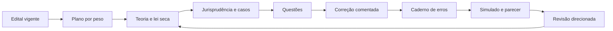

# Método de Preparação para Direito - CRA-PR 2026

## Finalidade

Este documento transforma o ciclo descrito em `../../Método de Preparação para Concursos.pdf` em uma rotina executável para Advogado e Analista Jurídico.

O conteúdo muda em relação a Analista de Sistemas, mas o princípio permanece: o candidato não recebe apenas textos. Ele recebe uma sequência de estudo, aplicação, correção, diagnóstico e revisão.

## Ciclo central

O ciclo só avança quando o erro foi compreendido. Marcar uma alternativa e olhar o gabarito não conta como correção.

## Rotina diária de 6h líquidas

| Bloco | Tempo | Atividade | Produto do bloco |
|---|---:|---|---|
| 1 | 1h20 | Teoria estruturada da disciplina principal | conceitos, requisitos, efeitos e contrastes |
| 2 | 1h00 | Lei seca e jurisprudência vinculada ao tema | marcações, dispositivos e precedentes conferidos |
| 3 | 1h30 | Casos, exemplos e questões principais | respostas, correção e dúvidas identificadas |
| 4 | 40min | Revisão fixa de CRA/CFA ou de uma disciplina de 8 questões | recuperação ativa e questões extras |
| 5A | 30min | Língua Portuguesa | interpretação, sintaxe, reescrita ou revisão textual |
| 5B | 40min | Parecer jurídico | tese, estrutura, parágrafo ou peça completa |
| 6 | 20min | Caderno de erros | registro, flashcard e agendamento da revisão |
| **Total** | **6h** | | |

Em dois dias da semana, o bloco de parecer aumenta para 60 minutos e o conjunto dos Blocos 1 a 3 diminui 20 minutos. No sábado de fechamento, o parecer completo ou o simulado pode ocupar parte do bloco principal.

Pausas não entram nas 6h líquidas. Sugestão: 10 minutos a cada 80 ou 90 minutos e uma pausa maior entre o bloco principal e as revisões.

## Execução dos Blocos 1 a 3

### Bloco 1 - compreender

Para cada instituto, responder:

1. qual é o conceito;
2. qual é a finalidade;
3. quais são os elementos ou requisitos;
4. quais são os efeitos;
5. quais são as exceções;
6. com qual instituto ele costuma ser confundido.

O estudo começa com explicação didática, não com uma sequência solta de artigos.

### Bloco 2 - confirmar a fonte

Usar a seguinte ordem:

1. texto constitucional ou legal consolidado;
2. norma específica do CFA/CRA, quando aplicável;
3. precedente, súmula, tema ou informativo de tribunal superior;
4. doutrina apenas para organizar conceitos ou controvérsias.

Toda anotação deve receber uma etiqueta:

- `[EDITAL]`: formulação ou limite expressamente cobrado;
- `[LEI]`: texto normativo confirmado;
- `[JURIS]`: entendimento de tribunal, com identificação e data;
- `[DOUTRINA]`: construção doutrinária;
- `[CASO]`: aplicação criada para treino.

As etiquetas impedem que uma explicação doutrinária seja memorizada como literalidade da lei ou que um caso hipotético seja confundido com precedente.

### Bloco 3 - aplicar e corrigir

1. resolver o item sem consultar;
2. marcar resposta, nível de confiança e tempo;
3. conferir a alternativa correta;
4. explicar por que A, B, C e D estão certas ou erradas;
5. voltar à seção exata da teoria;
6. registrar erro ou dúvida relevante;
7. refazer o item sem olhar o comentário.

O erro deve ser classificado antes de entrar no caderno:

- falta de conhecimento;
- confusão entre institutos;
- norma ou precedente desatualizado;
- interpretação do enunciado;
- desatenção ao comando positivo ou negativo;
- dificuldade de aplicar a regra ao caso;
- falha de memorização;
- gestão de tempo.

## Volume de questões

Para manter compatibilidade com o projeto de Analista de Sistemas, cada caderno semanal poderá conter:

- 300 questões principais, 50 por dia;
- 120 questões extras de revisão fixa, 20 por dia;
- 420 comentários completos;
- 1 super simulado suplementar com 60 itens inéditos.

Esse é o tamanho do **banco produzido**, não uma ordem para consumir mecanicamente todos os itens em detrimento da correção. Na rotina de 6h:

1. resolver primeiro o conjunto indicado como núcleo do dia;
2. corrigir integralmente erros e acertos inseguros;
3. usar as demais questões como banco adaptativo nas revisões e simulados;
4. interromper volume adicional quando a correção estiver ficando superficial.

O relatório semanal registra quantas questões foram resolvidas, corrigidas e refeitas. Apenas a primeira contagem não mede domínio.

## Revisão espaçada

Cada conteúdo novo segue quatro contatos mínimos:

| Momento | Ação |
|---|---|
| D0 - fim do estudo | resumo oral de 2 minutos, checklist e caderno de erros |
| D1 - dia seguinte | recuperação sem consulta e 5 a 10 itens curtos |
| D7 - semana seguinte | questões mistas, lei seca marcada e revisão dos erros |
| D21 - três semanas depois | mini simulado cumulativo e comparação do índice de acerto |

Erros graves ou repetidos também recebem revisão em 72 horas. O calendário é contado a partir do dia em que o tema foi estudado, não da semana em que a apostila foi criada.

## Caderno de erros jurídico

Cada registro deve conter:

| Campo | Conteúdo |
|---|---|
| Disciplina e assunto | classificação precisa do tema |
| Questão ou caso | número e comando resumido |
| Minha resposta | alternativa ou tese escolhida |
| Causa do erro | uma das categorias do método |
| Regra correta | explicação curta, sem copiar páginas inteiras |
| Fonte | norma/artigo ou precedente oficial |
| Contraste | instituto ou alternativa que gerou a confusão |
| Frase de recuperação | pergunta curta para revisão ativa |
| Revisões | D1, D7, D21 e resultado de cada retorno |

Não registrar apenas `errei por desatenção`. É necessário dizer qual palavra, requisito, competência, prazo ou exceção foi ignorado.

## Método do parecer jurídico

### Critérios do edital

- 30 a 60 linhas;
- 20 pontos no total;
- 15 pontos para conteúdo e abordagem;
- 5 pontos para aspectos linguísticos;
- mínimo de 12 pontos;
- sem consulta;
- tema ligado aos conhecimentos específicos.

### Estrutura funcional

Em razão do limite de linhas, usar uma estrutura enxuta:

1. **identificação da consulta e do problema jurídico**;
2. **relatório breve dos fatos relevantes**, sem inventar dados;
3. **fundamentação**, com premissa normativa, aplicação ao caso e enfrentamento dos pontos controvertidos;
4. **conclusão objetiva**, respondendo exatamente à consulta e indicando consequência ou providência cabível.

Elementos formais só entram se o comando exigir. Não gastar linhas com fórmulas de tratamento, identificação fictícia ou ementa ornamental.

### Progressão semanal do treino

| Dia | Treino |
|---|---|
| Segunda | identificar fatos, consulta, questões jurídicas e normas possíveis |
| Terça | formular tese principal e duas premissas de fundamentação |
| Quarta | escrever um parágrafo de aplicação da norma ao caso |
| Quinta | enfrentar argumento contrário, exceção ou risco |
| Sexta | redigir conclusão e revisar precisão vocabular |
| Sábado | produzir parecer completo ou esqueleto cronometrado e aplicar a rubrica |

Já na Semana 1 deve haver um parecer completo, manuscrito e cronometrado, usado como diagnóstico. Da Semana 2 à Semana 7, deve haver pelo menos um parecer completo por semana. Na Semana 8, os dois simulados reproduzem a prova com objetiva e parecer dentro de 4h30. Na Semana 9, o treino é leve e voltado à correção de padrões recorrentes.

### Autocorreção em 20 pontos

| Critério | Pontos | Pergunta de controle |
|---|---:|---|
| Resposta ao problema e seleção das questões | 3 | o texto respondeu ao que foi perguntado? |
| Base normativa e jurisprudencial pertinente | 4 | a fonte é válida e foi usada corretamente? |
| Aplicação da regra aos fatos | 4 | houve raciocínio, e não mera cópia de artigo? |
| Coerência, completude e conclusão | 4 | a conclusão decorre da fundamentação? |
| Língua, coesão e precisão | 5 | o texto está claro, técnico e dentro do limite? |
| **Total** | **20** | **meta mínima editalícia: 12** |

A rubrica de treino reproduz a divisão 15 + 5 do edital. O espelho específico de cada caso deve detalhar quais fundamentos compõem os 15 pontos de conteúdo.

## Leitura de lei seca

Não usar marca-texto como atividade passiva. Para cada dispositivo:

1. identificar sujeito competente;
2. localizar verbo de comando;
3. separar regra, requisito, exceção e consequência;
4. transformar o artigo em pergunta;
5. comparar com artigo ou instituto semelhante;
6. resolver ao menos um caso de aplicação.

Prazos, competências, hipóteses de cabimento e efeitos recebem tabelas próprias quando houver risco real de confusão.

## Jurisprudência

O edital determina que atos normativos mencionados no conteúdo podem ser cobrados com alterações que tenham entrado em vigor até a publicação do Edital de Abertura; retificações posteriores da própria banca também precisam ser observadas. Para súmulas, jurisprudência e precedentes dos tribunais superiores, admite publicações até 30 dias antes da prova. Considerando a data provável de 13/09/2026, a data operacional de corte jurisprudencial é **14/08/2026**, sujeita a confirmação em comunicado da banca.

Cada registro jurisprudencial deve trazer:

- tribunal;
- classe ou tipo do precedente;
- número do tema, súmula, processo ou informativo, quando houver;
- tese em paráfrase fiel;
- data de publicação considerada;
- situação fática mínima;
- disciplina e tópico do edital;
- link oficial.

Julgado isolado não deve ser apresentado como entendimento consolidado. Mudança, distinção ou controvérsia precisa ser declarada.

## Diagnóstico semanal

Ao fim de cada sábado, registrar:

| Indicador | Resultado |
|---|---|
| Horas líquidas planejadas/realizadas | X/36h |
| Questões resolvidas/corrigidas/refeitas | X/X/X |
| Acerto por disciplina | percentual e amostra |
| Acertos com baixa confiança | quantidade |
| Erros repetidos | lista curta |
| Revisões D1 e D7 vencidas | quantidade |
| Nota do parecer | X/20 |
| Principal lacuna para a próxima semana | uma prioridade concreta |

O percentual só é interpretado junto com o tamanho e a dificuldade da amostra.

## Regra de avanço

Antes de iniciar novo bloco pesado:

1. concluir a correção das questões nucleares;
2. atualizar o caderno de erros;
3. cumprir a revisão D1 do tema anterior;
4. conferir se todas as afirmações normativas possuem fonte;
5. reprogramar, e não esconder, o conteúdo pendente.

Uma semana incompleta não é apagada do plano. Ela fica com status `Em andamento` ou `Pendente`, com motivo e nova data.
