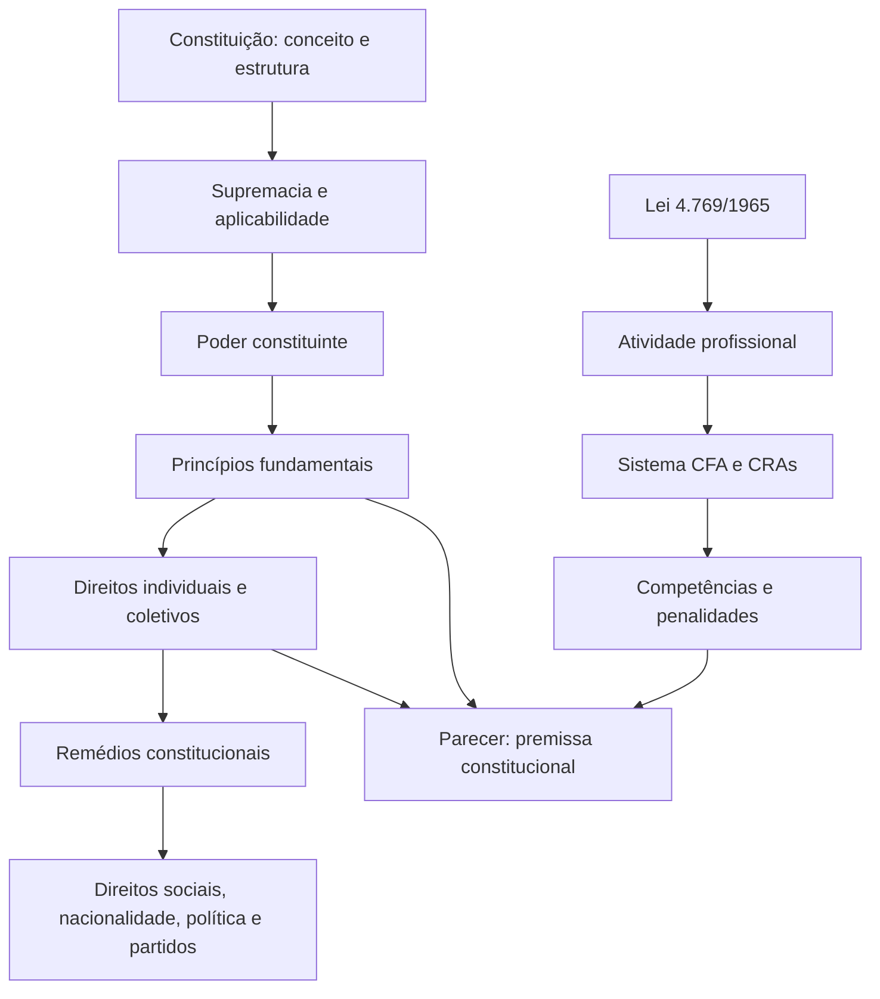

# Apostila de Estudo - Semana 1

## CRA-PR 2026 - Advogado e Analista Jurídico

**Período planejado:** 13/07/2026 a 18/07/2026  
**Foco principal:** Direito Constitucional I  
**Revisão fixa:** Lei nº 4.769/1965 e alterações  
**Carga:** 6 horas líquidas por dia, durante 6 dias  
**Situação:** material produzido; desempenho do candidato ainda não aferido

## Base documental

- edital: Concurso Público CRA-PR nº 1/2026, consolidado conforme Retificação I;
- arquivo local: `../edital/edital_cra_pr_2026_advogado_analista_juridico_retificacao_1.pdf`;
- SHA-256: `10B3B012F3B68149B4E4EA8A0CD6489B934D65C5D3E8F5FE12565FE91CAA168E`;
- data da conferência inicial das fontes: 13/07/2026;
- Constituição utilizada: texto compilado do Planalto;
- legislação profissional: Lei nº 4.769/1965, considerada com as alterações posteriores, especialmente as Leis nº 7.321/1985 e nº 8.873/1994.

O PDF antigo existente na área de Analista de Sistemas não serve para controlar o conteúdo jurídico. Toda atualização deve seguir `../fontes/matriz_edital_fontes.md`.

## O que a Semana 1 cobre

| Item literal do edital | Conteúdo | Dia principal | Revisões |
|---|---|---:|---|
| 1.1 | Constituição: conceito, objeto, elementos e classificações | 1 | D1, D7 e D21 |
| 1.2 | Supremacia da Constituição | 2 | D1, D7 e D21 |
| 1.3 | Aplicabilidade das normas constitucionais | 2 | D1, D7 e D21 |
| 1.4 | Interpretação das normas constitucionais | 2 | D1, D7 e D21 |
| 2, 2.1, 2.2 e 2.3 | Poder constituinte: características, originário e derivado | 3 | D1, D7 e D21 |
| 3 | Princípios fundamentais | 3 | D1, D7 e D21 |
| 4.1 | Direitos e deveres individuais e coletivos | 4 | D1, D7 e D21 |
| 4.2 | Habeas corpus, mandado de segurança, mandado de injunção e habeas data | 5 | D1, D7 e D21 |
| 4.3 a 4.6 | Direitos sociais, nacionalidade, direitos políticos e partidos políticos | 6 | D7 e D21 |
| CRA/CFA | Lei nº 4.769/1965 e alterações | 1 a 6 | diária, D7 e D21 |

Os itens 5 a 14 de Constitucional ficam para a Semana 2. Eles podem aparecer apenas em conexão indispensável, sem serem tratados como conteúdo já vencido.

## Por que esta semana é prioritária

Constitucional vale 8 questões e 16 pontos. A legislação CRA/CFA também vale 8 questões e 16 pontos. Esta semana, portanto, combina a abertura de uma disciplina de alto peso com a primeira volta sobre uma segunda disciplina de alto peso.

O objetivo não é decorar 420 respostas. O banco de questões é adaptativo: primeiro resolva o núcleo indicado, corrija integralmente erros e acertos inseguros e preserve o restante para D1, D7, D21 e reparo dirigido.

## Etiquetas de fonte

- `[EDITAL]`: limite expresso da banca;
- `[CF]`: Constituição Federal;
- `[LEI]`: lei ou ato normativo vigente ou historicamente identificado;
- `[JURIS]`: precedente, tema ou súmula oficial;
- `[DOUTRINA]`: construção usada para organizar o estudo;
- `[CASO]`: hipótese criada para aplicação.

Não memorize classificação doutrinária como se fosse artigo constitucional. Também não trate exemplo desta apostila como decisão judicial real.

## Rotina diária

| Bloco | Tempo | Produto |
|---|---:|---|
| Teoria constitucional | 1h20 | conceitos, requisitos, efeitos e contrastes |
| Constituição, leis e jurisprudência | 1h00 | marcações e fontes confirmadas |
| Casos e questões principais | 1h30 | respostas, correções e dúvidas |
| Lei nº 4.769/1965 | 40min | recuperação ativa e questões extras |
| Língua Portuguesa | 30min | aplicação ao texto jurídico |
| Parecer jurídico | 40min | etapa diária do parecer diagnóstico |
| Caderno de erros | 20min | regra correta e revisões agendadas |
| **Total** | **6h** | |

No sábado, o parecer completo pode ocupar parte do bloco principal. Pausas não entram nas seis horas líquidas.

## Mapa da semana

## Revisão espaçada já agendada

| Conteúdo | D1 | D7 | D21 |
|---|---|---|---|
| Dia 1 | 14/07 | 20/07 | 03/08 |
| Dia 2 | 15/07 | 21/07 | 04/08 |
| Dia 3 | 16/07 | 22/07 | 05/08 |
| Dia 4 | 17/07 | 23/07 | 06/08 |
| Dia 5 | 18/07 | 24/07 | 07/08 |
| Dia 6 | recuperação no fechamento | 25/07 | 08/08 |

---

# Dia 1 - Constituição: conceito, objeto, elementos e classificações

## Resultado verificável do dia

Ao terminar, você deve conseguir:

1. distinguir Constituição em sentido material e formal;
2. explicar os cinco grupos de elementos constitucionais;
3. classificar a Constituição de 1988 pelos critérios mais cobrados;
4. identificar o objeto do Direito Constitucional;
5. explicar a finalidade geral da Lei nº 4.769/1965 e a mudança de nomenclatura promovida em 1985;
6. separar fato, consulta e questão jurídica em um caso de parecer.

## Por que importa e como a Consulplan pode cobrar

Este dia fornece o vocabulário usado em toda a disciplina: sem distinguir conteúdo, forma, estrutura e critério de classificação, o candidato erra mesmo quando reconhece o tema. A Consulplan pode inverter os critérios classificatórios, pedir a natureza de uma norma situada no ADCT, apresentar uma característica da CF/1988 para identificação ou exigir a separação entre fatos e questão jurídica em situação ligada ao exercício profissional.

## Roteiro de 6 horas

| Bloco | Atividade |
|---|---|
| 1h20 | conceito, sentidos, objeto e elementos da Constituição |
| 1h00 | classificações e leitura da estrutura da CF/1988 |
| 1h30 | casos e núcleo de questões Q001-Q020 |
| 40min | Lei nº 4.769/1965: objeto, âmbito e nomenclatura |
| 30min | Português: interpretação e delimitação semântica |
| 40min | parecer: fatos, consulta e questões jurídicas |
| 20min | caderno de erros e resumo oral D0 |

## 1. O que é Constituição

### 1.1 Conceito funcional

`[DOUTRINA]` Constituição é o conjunto de normas fundamentais que estrutura o Estado, organiza o exercício do poder, define competências, reconhece direitos e estabelece fins básicos da ordem política e social.

Esse conceito possui duas ideias centrais:

- organização do poder;
- limitação do poder por direitos, competências e procedimentos.

Uma Constituição não se reduz a uma lista de direitos. Ela também responde quem decide, por qual procedimento, dentro de quais limites e com que controles.

### 1.2 Sentido material e sentido formal

`[DOUTRINA]` Em sentido **material**, a identificação depende do conteúdo. São materialmente constitucionais as normas sobre estrutura do Estado, organização do poder e direitos fundamentais, estejam ou não no documento constitucional.

Em sentido **formal**, importa o modo de produção e a posição da norma. É formalmente constitucional aquilo que integra o texto elaborado pelo poder constituinte e só pode ser alterado pelo procedimento constitucionalmente previsto.

Uma norma pode ser:

- material e formalmente constitucional, como a separação dos Poderes;
- apenas formalmente constitucional, quando está no texto, mas seu assunto poderia ser tratado em lei comum;
- material e formalmente constitucional fora do corpo permanente, como as normas do ADCT, que integram o documento constitucional embora tenham função frequentemente transitória.

Não use a expressão `apenas material` para rebaixar a importância de uma norma. O critério descreve conteúdo; não decide sozinho a posição hierárquica no sistema brasileiro.

### 1.3 Outros sentidos úteis

| Sentido | Ideia central | Cuidado de prova |
|---|---|---|
| sociológico | Constituição real corresponde aos fatores efetivos de poder | não confundir descrição social com texto jurídico |
| político | Constituição é decisão política fundamental | leis constitucionais periféricas não se confundem com a decisão básica |
| jurídico | Constituição é norma superior do sistema | a validade das normas inferiores é aferida a partir dela |
| cultural | Constituição resulta e participa da realidade histórica e cultural | evita reduzir o fenômeno a uma única dimensão |

Esses sentidos são construções doutrinárias. A Consulplan pode pedir a associação entre autor, sentido e ideia, mas o edital não nomeou autores. Priorize a compreensão das diferenças.

## 2. Objeto do Direito Constitucional

`[DOUTRINA]` O Direito Constitucional estuda as normas e instituições fundamentais do Estado. Seu objeto inclui:

- estrutura e forma do Estado;
- forma e sistema de governo;
- organização, funções e controles dos Poderes;
- repartição de competências;
- direitos e garantias fundamentais;
- mecanismos de defesa da Constituição;
- processo de alteração constitucional;
- fins constitucionais e bases das ordens econômica e social.

O objeto é mais amplo que o texto dos artigos 1º a 17. O recorte desta semana, porém, termina no item 4.6 do edital.

## 3. Elementos da Constituição

Uma classificação didática recorrente divide as normas constitucionais em cinco grupos.

### 3.1 Elementos orgânicos

Organizam o Estado e o poder: Federação, Poderes, competências e instituições. A palavra-chave é **estrutura**.

### 3.2 Elementos limitativos

Limitam a atuação estatal e protegem posições individuais e coletivas. Os direitos e garantias fundamentais são o exemplo central. A palavra-chave é **limite**.

### 3.3 Elementos socioideológicos

Expressam compromissos sociais e econômicos e a convivência entre liberdade e atuação social do Estado. A palavra-chave é **compromisso social**.

### 3.4 Elementos de estabilização constitucional

Protegem a ordem constitucional e oferecem respostas a crises e conflitos: controle de constitucionalidade, intervenção e mecanismos de defesa institucional. A palavra-chave é **estabilidade**.

### 3.5 Elementos formais de aplicabilidade

Orientam a aplicação e a transição constitucional, como preâmbulo, disposições transitórias e regras sobre vigência e reforma. A palavra-chave é **aplicação**.

Não associe `formal de aplicabilidade` a norma necessariamente sem eficácia. O nome do grupo descreve sua função no documento.

## 4. Classificações das Constituições

### 4.1 Quanto à origem

| Tipo | Formação |
|---|---|
| promulgada ou democrática | elaborada com participação de representantes do povo |
| outorgada | imposta unilateralmente pelo detentor do poder |
| cesarista | texto submetido à ratificação popular sem processo democrático genuíno de elaboração |
| pactuada | resulta de compromisso entre centros políticos de poder |

A CF/1988 é **promulgada**.

### 4.2 Quanto à forma

- **escrita:** reunida em documento ou conjunto documental formalizado;
- **não escrita ou costumeira:** formada predominantemente por costumes, precedentes e textos esparsos.

Entre as escritas, a doutrina ainda distingue a Constituição **codificada**, concentrada sistematicamente em um documento, da **legal ou variada**, formada por mais de um texto constitucional escrito. Não confunda `codificada` com Constituição curta: concentração documental e extensão são critérios independentes.

A CF/1988 é **escrita**.

### 4.3 Quanto ao modo de elaboração

- **dogmática:** produzida deliberadamente em certo momento, com ideias sistematizadas;
- **histórica:** formada gradualmente ao longo do tempo.

A CF/1988 é **dogmática**.

### 4.4 Quanto à extensão

- **sintética:** concentra normas fundamentais;
- **analítica:** disciplina numerosos temas e políticas com maior detalhamento.

A CF/1988 é **analítica**.

### 4.5 Quanto à alterabilidade

- **imutável:** não admite alteração;
- **rígida:** alteração constitucional é mais difícil que a lei comum;
- **flexível:** alteração segue procedimento equivalente ao legislativo ordinário;
- **semirrígida:** parte rígida e parte flexível;
- **super-rígida:** expressão doutrinária para Constituição rígida que contém núcleo material não abolível.

A classificação segura da CF/1988 é **rígida**. Parte da doutrina a chama de super-rígida por causa das cláusulas pétreas. Em questão sem indicação da corrente, não transforme essa variante doutrinária em única resposta possível.

### 4.6 Quanto ao conteúdo

- **material:** reúne normas reconhecidas como fundamentais pelo conteúdo;
- **formal:** considera constitucionais as normas inseridas no documento por procedimento próprio.

A CF/1988 é **formal**.

### 4.7 Quanto à finalidade

- **garantia:** limita o poder e protege liberdades;
- **dirigente:** estabelece programas, fins e tarefas para o Estado;
- **balanço:** registra certo estágio político e social, com pretensão de adaptação por etapas.

A CF/1988 é usualmente classificada como **dirigente**.

### 4.8 Quanto à ideologia

- **ortodoxa:** fundada em uma orientação ideológica predominante;
- **eclética ou compromissória:** combina correntes e interesses distintos.

A CF/1988 é **eclética**.

### 4.9 Quanto à correspondência com a realidade

`[DOUTRINA]` A classificação ontológica distingue Constituição:

- normativa, quando dirige efetivamente o processo político;
- nominal, quando pretende dirigir, mas a realidade ainda não corresponde integralmente;
- semântica, quando serve principalmente para legitimar o poder existente.

Esse critério avalia relação entre texto e realidade, não origem nem rigidez.

### 4.10 Retrato da Constituição de 1988

Memorize o núcleo: **promulgada, escrita, dogmática, analítica, formal, rígida, dirigente e eclética**.

### 4.11 Classificações complementares de menor prioridade

Estas categorias são doutrinárias. Use-as quando o enunciado indicar expressamente o critério:

| Critério | Categorias | Distinção |
|---|---|---|
| predominância normativa | principiológica x preceitual | a primeira contém maior abertura e peso de princípios; a segunda, maior densidade de regras específicas; predominância não significa exclusividade |
| adaptação interpretativa | plástica | texto aberto à concretização e à evolução interpretativa, sem perder supremacia nem limites semânticos |
| centro de produção | autônoma x heterônoma | produzida pelo poder do próprio Estado destinatário x imposta ou produzida por poder externo |

A CF/1988 combina regras e princípios, é produzida por poder constituinte interno e admite concretização interpretativa. Nenhuma dessas afirmações permite alterá-la por ato administrativo, dispensar o art. 60 ou contrariar seu texto.

`[DOUTRINA]` A expressão `Constituição plástica` não é unívoca: parte da doutrina a emprega para abertura adaptativa e parte a aproxima de Constituição flexível. Por isso, uma questão tecnicamente segura deve indicar o autor ou a acepção adotada. Neste material, quando houver referência à plasticidade **adaptativa**, ela significará abertura à concretização interpretativa, não flexibilidade do rito formal.

## 5. Estrutura formal da CF/1988

`[CF]` A leitura deve reconhecer:

- preâmbulo;
- parte permanente, organizada em títulos;
- Ato das Disposições Constitucionais Transitórias;
- emendas constitucionais, que alteram ou acrescem normas sem formar uma Constituição paralela.

`[JURIS]` O preâmbulo auxilia a compreensão histórica e valorativa, mas não funciona como parâmetro autônomo de controle nem constitui norma central de reprodução obrigatória pelos estados. É a orientação da [ADI 2.076/AC](https://portal.stf.jus.br/constituicao-supremo/artigo.asp?item=2), rel. min. Carlos Velloso, Plenário, julgada em 15/08/2002, DJ de 08/08/2003. Não memorize essa conclusão como se fosse texto de artigo.

## 6. Casos resolvidos

### Caso 1 - Norma constitucional pelo lugar ou pelo assunto

`[CASO]` Um candidato afirma que toda norma sobre direitos fundamentais é constitucional apenas por seu conteúdo, ainda que aprovada como lei ordinária.

**Pergunta:** a afirmação está correta?

**Norma:** distinção doutrinária entre Constituição em sentido material e formal; art. 5º, § 3º, da CF como hipótese específica de equivalência de tratado de direitos humanos a emenda constitucional.

**Raciocínio:** direitos fundamentais são matéria constitucional em sentido material. Isso não transforma automaticamente qualquer lei ordinária sobre o tema em norma formalmente constitucional. A posição hierárquica depende da fonte e do procedimento.

**Solução:** a afirmação é incompleta e, como regra de hierarquia, errada.

**Consequência prática:** a lei ordinária continua subordinada à Constituição e pode ser controlada por incompatibilidade com ela; não recebe hierarquia constitucional apenas pelo assunto.

**Erro provável:** confundir matéria constitucional com forma constitucional.

**Variação:** tratado de direitos humanos aprovado pelo rito do art. 5º, § 3º, recebe equivalência às emendas; nesse caso há fundamento constitucional específico.

### Caso 2 - Classificação pela dificuldade de reforma

`[CASO]` Uma Constituição exige três quintos dos votos, em dois turnos, em cada Casa, para emenda, enquanto leis ordinárias seguem rito menos exigente.

**Pergunta:** qual classificação está em jogo?

**Norma:** classificação doutrinária quanto à estabilidade e, para a CF/1988, procedimento de emenda do art. 60, § 2º.

**Raciocínio:** o critério compara o procedimento de reforma constitucional com o legislativo comum.

**Solução:** Constituição rígida.

**Consequência prática:** a alteração constitucional exige o rito agravado; lei ordinária não pode substituir emenda para modificar a Constituição.

**Erro provável:** responder `analítica`, que diz respeito à extensão.

**Variação:** se parte do texto pudesse ser alterada como lei comum, seria semirrígida.

### Caso 3 - Elemento constitucional

`[CASO]` Uma regra cria mecanismo para preservar a ordem constitucional em situação de grave crise.

**Pergunta:** a qual grupo funcional ela pertence?

**Norma:** classificação doutrinária dos elementos constitucionais; mecanismos constitucionais de defesa e crise, como os disciplinados nos arts. 34 a 36 e 136 a 141 da CF.

**Raciocínio:** a função é conservar a estabilidade e responder a ruptura ou conflito.

**Solução:** elemento de estabilização constitucional.

**Consequência prática:** a regra deve ser estudada como instrumento de preservação da ordem constitucional, e não apenas como norma de organização de órgão.

**Erro provável:** classificá-la como orgânica apenas porque envolve órgão estatal.

**Variação:** se a regra apenas definisse a composição do órgão, o elemento seria orgânico.

## 7. Revisão fixa - Lei nº 4.769/1965: finalidade e âmbito

### 7.1 O que a lei disciplina

`[LEI]` A Lei nº 4.769/1965 regulamenta o exercício profissional no campo da Administração e institui o sistema formado pelo conselho federal e pelos conselhos regionais.

O texto original usa `Técnico de Administração`. A Lei nº 7.321/1985 alterou:

- a categoria para **Administrador**;
- o Conselho Federal de Técnicos de Administração para **Conselho Federal de Administração**;
- os conselhos regionais para **Conselhos Regionais de Administração**.

Questão que usa a denominação histórica precisa deixar claro se cobra a redação original. No estudo atual, use Administrador, CFA e CRA, sem apagar o histórico da lei.

O art. 1º incluiu a antiga categoria de `Técnico de Administração` no quadro das profissões liberais anexo à CLT; a Lei nº 7.321/1985 substituiu a denominação profissional por `Administrador`. A profissão abrange exercício liberal ou não e é definida principalmente pelas atividades e qualificações legais, não apenas pelo nome do cargo.

### 7.2 Primeira visão dos blocos da lei

| Bloco | Artigos centrais | Pergunta de controle |
|---|---|---|
| atividade e habilitação | 1º a 5º | quem exerce e quais atividades são profissionais? |
| sistema profissional | 6º a 13 | como se estruturam CFA e CRAs? |
| registro e fiscalização | 14 e 15 | quem precisa de registro e qual seu efeito? |
| penalidades | 16 | quais respostas a lei prevê e com quais garantias? |
| transição e execução | 17 a 22 | como o sistema foi instalado e onde incide? |

Hoje basta enxergar a arquitetura. Os dias seguintes aprofundam cada bloco.

Para resolver as questões extras deste primeiro contato, retenha ainda:

- CFA e CRAs formam, em conjunto, autarquia com personalidade de direito público e autonomia técnica, administrativa e financeira;
- o CFA tem sede em Brasília e atua na orientação, disciplina geral e racionalização administrativa nacional;
- os CRAs têm sede nas capitais dos Estados e no Distrito Federal e executam diretrizes, fiscalizam, registram e expedem carteiras em sua jurisdição;
- a carteira comprova o registro e também serve como identidade profissional, com fé em todo o território nacional;
- sindicatos e associações profissionais cooperarão com o CFA para a divulgação das modernas técnicas de Administração no exercício da profissão, nos termos do art. 17;
- o art. 20 é regra histórica condicionada: sua incidência sobre serviços municipais, empresas privadas, autarquias e sociedades de economia mista estaduais e municipais dependia da comprovação, pelos Conselhos, de número suficiente de profissionais habilitados no município.

Esse último dispositivo não deve ser convertido, isoladamente, em diagnóstico contemporâneo sobre todo vínculo ou entidade: responda à literalidade quando ela for pedida e registre o caráter histórico da regra.

### 7.3 Caso profissional

`[CASO]` Um documento interno cita o `Conselho Regional de Técnicos de Administração` como nome atual do CRA-PR.

**Solução:** a denominação está historicamente ligada à lei de 1965, mas foi alterada pela Lei nº 7.321/1985. O texto deve usar Conselho Regional de Administração.

**Pegadinha:** concluir que a Lei nº 4.769 deixou de existir. Ela continua sendo a lei-base, com alterações.

## 8. Português aplicado - interpretação e delimitação

Em textos jurídicos, separe:

- **tema:** assunto geral;
- **tese:** afirmação defendida;
- **condição:** fato do qual depende a consequência;
- **exceção:** hipótese que afasta a regra;
- **conclusão:** resposta produzida pelas premissas.

Exercício: na frase `a casa é inviolável, salvo nas hipóteses constitucionais`, `inviolável` expressa a regra e `salvo` abre exceções. Nunca elimine a exceção ao resumir.

## 9. Parecer - identificar a consulta

Leia a hipótese do caderno de pareceres e preencha, sem redigir a peça:

| Campo | Resposta do candidato |
|---|---|
| fatos juridicamente relevantes | |
| fatos meramente narrativos | |
| órgão consulente | |
| decisão que precisa ser tomada | |
| questões constitucionais | |
| questões da Lei nº 4.769/1965 | |
| informação que não pode ser inventada | |

## 10. Pegadinhas do Dia 1

- material não significa automaticamente superior na hierarquia;
- analítica trata da extensão; rígida trata do procedimento de alteração;
- promulgada trata da origem; dogmática, do modo de elaboração;
- `formal de aplicabilidade` é grupo de elementos, não grau de eficácia;
- a classificação `super-rígida` é doutrinária e não elimina a resposta segura `rígida`;
- o nome atual da profissão é Administrador, embora o texto histórico ainda contenha Técnico de Administração.

## 11. O que memorizar

1. conceito funcional de Constituição;
2. formal x material;
3. cinco grupos: orgânico, limitativo, socioideológico, estabilização e formal de aplicabilidade;
4. retrato da CF/1988;
5. Lei nº 7.321/1985 mudou as denominações profissionais e institucionais.

## 12. Checklist de domínio

- [ ] Explico formal x material com exemplo.
- [ ] Identifico os cinco grupos de elementos.
- [ ] Classifico a CF/1988 sem misturar critérios.
- [ ] Sei por que `rígida` é a resposta segura.
- [ ] Reconheço os blocos da Lei nº 4.769/1965.
- [ ] Distingo a denominação histórica da atual.
- [ ] Separei fatos, consulta e questões jurídicas do parecer.

## 13. Recuperação ativa

1. Qual é a diferença entre Constituição material e formal?
2. Que elemento constitucional tem função de estabilizar a ordem?
3. O que distingue uma Constituição rígida de uma analítica?
4. Qual é o retrato classificatório básico da CF/1988?
5. Que lei alterou a denominação da categoria para Administrador?

## 14. Caderno de erros

Registre um contraste que você confundiu. A frase de recuperação deve assumir a forma: `qual critério distingue X de Y?`. Agende D1, D7 e D21.

## Assuntos cobrados no banco do Dia 1

- Q001-Q050: conceito, objeto, elementos e classificações da Constituição;
- Q051-Q070: finalidade, âmbito e primeira arquitetura da Lei nº 4.769/1965.

Roteiro e comentários: `semana_01_questoes.md`.

## 15. Mapa de conexões do dia

`classificação -> procedimento de reforma -> supremacia formal -> controle de constitucionalidade`

`Constituição -> liberdade profissional -> Lei nº 4.769/1965 -> registro e fiscalização`

## 16. Fontes do dia

- edital consolidado, Anexo I, Direito Constitucional, itens 1 e 1.1;
- Constituição Federal de 1988, estrutura geral;
- Lei nº 4.769/1965;
- Lei nº 7.321/1985;
- matriz oficial de fontes do projeto.

---

# Dia 2 - Supremacia, aplicabilidade e interpretação constitucional

## Resultado verificável do dia

Ao terminar, você deve conseguir:

1. explicar supremacia material e formal;
2. classificar normas em eficácia plena, contida e limitada;
3. distinguir aplicação imediata de efeito absolutamente ilimitado;
4. aplicar métodos e princípios de interpretação constitucional;
5. identificar atividades profissionais descritas nos arts. 2º e 3º da Lei nº 4.769/1965;
6. formular uma questão jurídica objetiva para o parecer.

## Por que importa e como a Consulplan pode cobrar

Supremacia, eficácia e interpretação transformam texto constitucional em solução concreta e aparecem tanto em itens conceituais quanto em pequenos casos. A Consulplan pode pedir o efeito imediato de norma plena, contida ou limitada, explorar a falsa equivalência entre aplicação imediata e direito absoluto, exigir o método interpretativo adequado ou relacionar a liberdade profissional às qualificações previstas em lei.

## Roteiro de 6 horas

| Bloco | Atividade |
|---|---|
| 1h20 | supremacia e posição da Constituição |
| 1h00 | eficácia e interpretação constitucional |
| 1h30 | casos e núcleo de questões Q071-Q090 |
| 40min | Lei nº 4.769/1965: atividades e habilitação |
| 30min | Português: sujeito, predicado, oração e escopo da negação |
| 40min | parecer: questão jurídica e subquestões |
| 20min | D1 do Dia 1 e caderno de erros |

## 1. Supremacia da Constituição

### 1.1 Ideia central

`[DOUTRINA]` A Constituição ocupa o fundamento superior de validade do ordenamento. Atos legislativos, administrativos e jurisdicionais devem ser compatíveis com ela tanto no conteúdo quanto no modo de produção.

Supremacia produz consequências práticas:

- a lei incompatível pode ser afastada ou invalidada pelos mecanismos competentes;
- competências públicas só existem nos limites constitucionais;
- procedimentos legislativos precisam respeitar a Constituição;
- direitos e garantias vinculam o poder público e irradiam efeitos sobre relações privadas;
- a interpretação das normas inferiores deve buscar compatibilidade constitucional.

### 1.2 Supremacia material e formal

| Dimensão | Fundamento | Exemplo de violação |
|---|---|---|
| material | importância do conteúdo constitucional | lei elimina garantia protegida pela Constituição |
| formal | rigidez e procedimento superior de produção | emenda aprovada sem o quórum constitucional |

Em uma Constituição rígida, as duas dimensões sustentam o controle. Não basta que a lei tenha boa finalidade; ela precisa respeitar competência, procedimento e limites materiais.

### 1.3 Constituição originária e emendas

Normas constitucionais originárias formam o parâmetro inicial do sistema. Não há hierarquia abstrata entre artigos originários da Constituição. Conflitos aparentes são resolvidos por interpretação sistemática e harmonização.

Emendas ingressam no nível constitucional, mas são produzidas pelo poder constituinte derivado e permanecem sujeitas aos limites do art. 60. Por isso, podem ser objeto de controle de constitucionalidade.

### 1.4 Bloco de constitucionalidade

`[DOUTRINA]` A expressão designa o conjunto de normas que podem funcionar como parâmetro constitucional. No Brasil, deve ser empregada com cuidado e conforme a questão. Tratados de direitos humanos aprovados pelo rito do art. 5º, § 3º, equivalem a emendas constitucionais.

`[JURIS]` Tratados de direitos humanos incorporados sem esse rito qualificado possuem posição supralegal — acima das leis e abaixo da Constituição —, conforme orientação firmada pelo STF no [RE 466.343/SP](https://portal.stf.jus.br/publicacaotematica/vertema.asp?lei=5235), rel. min. Cezar Peluso, Plenário, julgado em 03/12/2008, DJe de 05/06/2009. Eles não equivalem automaticamente a emenda.

Pegadinha: `supralegal` significa acima das leis e abaixo da Constituição; não significa constitucional.

## 2. Aplicabilidade das normas constitucionais

### 2.1 Eficácia plena

`[DOUTRINA]` Produz seus efeitos essenciais desde a entrada em vigor, sem depender de complementação legislativa para incidir. É direta, imediata e integral.

Isso não impede que lei organize aspectos operacionais compatíveis. O ponto é que a ausência da lei não bloqueia o núcleo da norma.

### 2.2 Eficácia contida

É direta e imediatamente aplicável, mas admite restrição constitucionalmente autorizada. Enquanto a restrição válida não ocorrer, o direito incide com maior amplitude.

Exemplo clássico: art. 5º, XIII, que assegura exercício profissional, atendidas as qualificações que a lei estabelecer. A liberdade existe desde já; lei válida pode exigir qualificações proporcionais.

Não diga que norma contida depende de lei para começar a valer. Essa é a armadilha mais comum.

### 2.3 Eficácia limitada

Necessita de integração normativa para produzir plenamente os efeitos principais pretendidos. Possui aplicabilidade indireta e mediata quanto a esse resultado completo.

Mesmo antes da integração, ela não é juridicamente vazia. Pode:

- vincular o legislador;
- impedir legislação incompatível;
- orientar interpretação;
- fundamentar controle de omissão;
- revogar normas anteriores incompatíveis.

Subtipos doutrinários frequentes:

- **institutiva ou organizativa:** prevê instituição, órgão ou estrutura a ser detalhada;
- **programática:** estabelece objetivos, programas e tarefas estatais.

### 2.4 Quadro comparativo

| Critério | Plena | Contida | Limitada |
|---|---|---|---|
| aplicação inicial | direta | direta | indireta quanto ao efeito principal |
| imediatidade | sim | sim | depende de integração para plenitude |
| amplitude | integral | restringível | incompleta |
| lei posterior | pode organizar | pode restringir nos limites constitucionais | integra e concretiza |

### 2.5 Art. 5º, § 1º

`[CF]` Normas definidoras de direitos e garantias fundamentais têm aplicação imediata. A regra exige máxima realização possível e impede tratar esses direitos como promessas indiferentes.

Aplicação imediata não significa:

- ausência de qualquer ponderação;
- impossibilidade de regulamentação;
- identidade de eficácia entre todos os direitos;
- acolhimento automático de qualquer pretensão individual.

O examinador pode opor `imediata` a `absoluta`. A primeira é regra constitucional; a segunda é conclusão errada.

## 3. Interpretação constitucional

### 3.1 Por que há técnica própria

A Constituição combina regras, princípios, competências, direitos e programas. Sua linguagem frequentemente é aberta e sua posição exige coerência do sistema. Os métodos clássicos continuam úteis, mas não bastam isoladamente.

### 3.2 Métodos clássicos

| Método | Pergunta central | Risco se usado sozinho |
|---|---|---|
| gramatical | o que o texto diz? | ignorar sistema e finalidade |
| histórico | em que contexto surgiu? | congelar o sentido no passado |
| sistemático | como se relaciona com outras normas? | criar harmonia artificial contra texto claro |
| teleológico | que finalidade constitucional busca? | substituir norma por preferência do intérprete |

### 3.3 Métodos constitucionais doutrinários

- **tópico-problemático:** parte do problema concreto e considera argumentos relevantes;
- **hermenêutico-concretizador:** parte do texto e da pré-compreensão, concretizando a norma no caso;
- **científico-espiritual:** considera valores, integração política e realidade constitucional;
- **normativo-estruturante:** distingue texto normativo e norma construída na interação com a realidade;
- **comparativo:** examina experiências constitucionais de outros sistemas com cautela.

Esses nomes são doutrinários. Em questão, procure a característica, não apenas a palavra parecida.

### 3.4 Princípios de interpretação

#### Unidade da Constituição

Interprete o texto como sistema coerente, evitando hierarquia abstrata entre normas originárias.

#### Concordância prática ou harmonização

Quando bens constitucionais colidem, preserve cada um na maior medida possível, sem eliminar antecipadamente um deles.

#### Máxima efetividade

Prefira o sentido que dê maior eficácia às normas constitucionais, especialmente a direitos fundamentais, sem ultrapassar limites textuais e institucionais.

#### Força normativa da Constituição

Não trate a Constituição como conselho político. A interpretação deve favorecer sua realização concreta.

#### Efeito integrador

Entre soluções possíveis, valorize a que favoreça integração política e social constitucionalmente legítima.

#### Justeza ou conformidade funcional

O intérprete não deve alterar a repartição constitucional de funções e competências.

#### Interpretação conforme a Constituição

Quando um texto infraconstitucional admite mais de um sentido, deve-se preferir o compatível com a Constituição, desde que o intérprete não crie texto novo contra o enunciado legal.

### 3.5 Proporcionalidade e razoabilidade

Em análise de restrições, a proporcionalidade costuma ser organizada em:

1. adequação: o meio contribui para o fim legítimo?
2. necessidade: existe meio igualmente eficaz e menos restritivo?
3. proporcionalidade em sentido estrito: os benefícios justificam o custo imposto ao direito?

Não use proporcionalidade como palavra ornamental. Identifique fim, meio, alternativas e impacto.

### 3.6 Mutação constitucional

Mutação constitucional é mudança do sentido atribuído ao texto sem alteração formal de suas palavras. Pode decorrer da interpretação e de transformações institucionais, mas não é um poder livre de reescrever a Constituição.

Limites de controle:

- preservar as possibilidades semânticas do texto;
- respeitar a identidade e os compromissos estruturais da Constituição;
- não substituir o procedimento formal de reforma quando a mudança exigir novo texto;
- justificar a interpretação por argumentos constitucionais controláveis.

Logo, `mudar a compreensão` não equivale a `aprovar emenda`, e mutação não legitima resultado frontalmente incompatível com a redação constitucional.

## 4. Casos resolvidos

### Caso 1 - Liberdade profissional

`[CASO]` Lei exige qualificação técnica pertinente para uma atividade capaz de gerar risco relevante a terceiros. Um candidato afirma que o art. 5º, XIII, impede qualquer requisito legal.

**Pergunta:** a exigência legal é incompatível com a liberdade profissional?

**Norma:** art. 5º, XIII.

**Raciocínio:** a liberdade profissional é imediatamente aplicável, mas o próprio texto admite qualificações legais. A restrição precisa guardar relação com a atividade e respeitar proporcionalidade.

**Solução:** a afirmação do candidato é errada; trata-se de exemplo de eficácia contida.

**Consequência prática:** a qualificação pertinente pode ser exigida para o exercício da atividade, sem afastar o controle de proporcionalidade da restrição.

**Erro provável:** confundir aplicação imediata com impossibilidade de restrição.

**Variação:** requisito sem relação com risco ou capacidade profissional pode ser constitucionalmente questionável.

### Caso 2 - Norma programática

`[CASO]` Uma norma fixa objetivo de política pública e exige desenvolvimento legislativo. O órgão sustenta que ela não produz efeito jurídico algum antes da lei.

**Pergunta:** a ausência de regulamentação elimina todos os efeitos da norma constitucional?

**Norma:** art. 5º, § 1º, da CF e classificação doutrinária das normas constitucionais de eficácia limitada, especialmente as programáticas.

**Raciocínio:** norma limitada não é inexistente. Vincula, orienta interpretação e impede atuação frontalmente contrária.

**Solução:** o argumento do órgão é excessivo.

**Consequência prática:** mesmo antes da integração legislativa, o poder público fica vinculado ao programa constitucional e não pode adotar conduta que o contradiga frontalmente.

**Erro provável:** equiparar eficácia limitada a eficácia zero.

**Variação:** se o texto já concede posição plenamente exercitável, a classificação pode ser plena ou contida.

### Caso 3 - Interpretação conforme

`[CASO]` Uma lei admite duas leituras linguisticamente possíveis: uma viola igualdade; a outra preserva o programa legal e é constitucional.

**Pergunta:** qual técnica interpretativa deve ser usada e qual é o seu limite?

**Norma:** princípio da supremacia constitucional e técnica de interpretação conforme à Constituição, limitada pelos sentidos linguisticamente possíveis do texto legal.

**Raciocínio:** deve-se preferir o sentido constitucional, sem reescrever a lei.

**Solução:** aplicar interpretação conforme.

**Consequência prática:** preserva-se a lei com exclusão da leitura inconstitucional, sem criar texto novo nem substituir o legislador.

**Erro provável:** declarar que o Judiciário pode substituir qualquer texto por solução considerada melhor.

**Variação:** se o único sentido possível for incompatível, interpretação conforme não salva o texto.

## 5. Revisão fixa - atividades e campo profissional

### 5.1 Atividades do art. 2º

`[LEI]` A Lei nº 4.769/1965 descreve atividade profissional, liberal ou não, por dois grandes grupos:

1. produtos e funções técnicas, como pareceres, relatórios, planos, projetos, arbitragens, laudos, assessoria, chefia intermediária e direção superior;
2. processos de pesquisa, estudo, análise, interpretação, planejamento, implantação, coordenação e controle nos campos da Administração.

Entre os campos enumerados aparecem pessoal, organização e métodos, orçamentos, material, finanças, relações públicas, mercado, produção e relações industriais, além de desdobramentos e áreas conexas.

Pegadinha: a lista não se resume a cargo com o nome `Administrador`. A lei descreve atividades.

### 5.2 Habilitação do art. 3º

O texto trata como privativo o exercício profissional pelos grupos legalmente previstos. Há regras para:

- bacharéis formados no Brasil;
- diplomados no exterior após revalidação;
- situações históricas de profissionais não diplomados que já preenchiam tempo de atividade quando a lei entrou em vigor.

Na leitura literal:

- a alínea `a` alcança bacharel em Administração Pública ou de Empresas diplomado no Brasil em curso superior regular oficial, oficializado ou reconhecido;
- a alínea `b` exige revalidação, no Brasil, do diploma regular obtido no exterior;
- a alínea `c` preserva quem já exercia, por cinco anos ou mais na data de vigência da lei, atividades próprias do campo profissional;
- o parágrafo único resguardou direitos e prerrogativas de quem, até a publicação da lei, já ocupava cargo de Técnico de Administração.

A hipótese histórica não é uma porta atual permanente para dispensar formação. Sempre observe o marco temporal do texto.

### 5.3 Administração Pública e concurso

O art. 4º trata de cargos técnicos de Administração na administração pública e autárquica, ressalvadas as situações históricas dos ocupantes então existentes, e exige diploma de bacharel para o provimento e exercício. A apresentação do diploma não dispensa concurso quando a lei o exige.

**Conexão constitucional:** qualificação profissional e acesso a cargo público são temas diferentes. Diploma não substitui seleção pública.

### 5.3.1 Magistério - art. 5º

`[LEI]` Aos bacharéis em Administração é facultada a inscrição em concursos para prover cadeiras de Administração existentes em qualquer ramo do ensino técnico ou superior e nos cursos de Administração. A regra não se limita ao ensino superior nem somente a cursos denominados Administração, mas também não autoriza o bacharel a concorrer, por esse dispositivo, a qualquer disciplina sem vínculo com Administração.

Pegadinha: o art. 5º trata da possibilidade de inscrição no concurso para as cadeiras indicadas; não dispensa os demais requisitos válidos do certame nem transforma toda disciplina de gestão em cadeira abrangida pela lei.

### 5.4 Casos profissionais

`[CASO]` Uma empresa sustenta que elaborar laudo técnico de Administração não está no campo profissional porque a pessoa não ocupa cargo denominado Administrador.

**Solução:** o art. 2º descreve a atividade de elaboração de laudos e outros trabalhos; o nome do cargo não resolve sozinho o enquadramento.

`[CASO]` Pessoa iniciou atividades administrativas em 2025 e invoca a regra histórica dos cinco anos para exercer a profissão sem diploma.

**Solução:** a regra preservava situação existente na data de vigência da lei; não cria habilitação por cinco anos adquiridos décadas depois.

## 6. Português aplicado - estrutura e escopo

Em comandos de prova, identifique:

- núcleo do sujeito;
- verbo que estabelece a regra;
- complemento que delimita o objeto;
- expressão que restringe ou excepciona;
- alcance de `não`, `somente`, `salvo`, `desde que` e `ainda que`.

Compare:

- `a norma não depende de lei para incidir`;
- `a norma depende de lei para não incidir`.

A posição da negação muda o sentido. Antes de responder questão negativa, reescreva o comando de forma afirmativa.

## 7. Parecer - formular a questão jurídica

Uma questão jurídica deve juntar fato relevante e critério normativo sem antecipar toda a conclusão.

Modelo ruim: `o ato é ilegal?`

Modelo melhor: `a suspensão imediata do registro profissional, sem prévia oportunidade de defesa, é compatível com os arts. 5º, XIII, LIV e LV, da Constituição e com o art. 16 da Lei nº 4.769/1965?`

Tarefa: escreva uma questão principal e três subquestões:

1. competência do CRA;
2. procedimento e defesa;
3. consequência jurídica do vício.

## 8. Pegadinhas do Dia 2

- norma contida incide imediatamente;
- norma limitada possui efeitos jurídicos antes da integração completa;
- aplicação imediata não torna direito absoluto;
- tratado de direitos humanos pelo rito comum não equivale automaticamente a emenda;
- interpretação conforme não permite contrariar texto inequívoco;
- diploma e concurso público cumprem funções jurídicas distintas.

## 9. O que memorizar

1. plena = direta, imediata e integral;
2. contida = direta, imediata e restringível;
3. limitada = integração necessária para efeitos principais completos;
4. unidade, harmonização, máxima efetividade, força normativa, efeito integrador e justeza;
5. art. 2º da Lei nº 4.769 descreve produtos, funções e processos profissionais.

## 10. Checklist de domínio

- [ ] Explico supremacia formal e material.
- [ ] Classifico exemplos de eficácia sem depender de palavra isolada.
- [ ] Não chamo norma limitada de inútil.
- [ ] Aplico harmonização e máxima efetividade corretamente.
- [ ] Sei o limite da interpretação conforme.
- [ ] Reconheço atividades e situações históricas da Lei nº 4.769.
- [ ] Formulei questão jurídica completa para o parecer.

## 11. Recuperação ativa

1. Por que emenda pode ser controlada constitucionalmente?
2. Qual é a diferença operacional entre norma contida e limitada?
3. Que efeitos uma norma limitada já produz?
4. O que a justeza protege?
5. Por que o nome do cargo não resolve sozinho o campo profissional?

## 12. Caderno de erros

Classifique cada erro como `hierarquia`, `eficácia`, `interpretação`, `Lei nº 4.769` ou `leitura do comando`. Refaça sem consulta Q071-Q075 no final do dia.

## Assuntos cobrados no banco do Dia 2

- Q071-Q120: supremacia, aplicabilidade e interpretação constitucional;
- Q121-Q140: atividades, campos e habilitação na Lei nº 4.769/1965.

Roteiro e comentários: `semana_01_questoes.md`.

## 13. Mapa de conexões do dia

`rigidez -> supremacia formal -> parâmetro de validade -> controle`

`art. 5º, XIII -> norma contida -> qualificação legal -> Lei nº 4.769/1965`

`texto -> interpretação sistemática -> norma aplicada -> limite institucional`

## 14. Fontes do dia

- Constituição Federal, arts. 5º, XIII e § 1º, e art. 60;
- Lei nº 4.769/1965, arts. 2º a 5º;
- edital consolidado, Constitucional, itens 1.2 a 1.4;
- [STF, RE 466.343/SP](https://portal.stf.jus.br/publicacaotematica/vertema.asp?lei=5235), rel. min. Cezar Peluso, Plenário, j. 03/12/2008, DJe 05/06/2009;
- matriz oficial de fontes do projeto.

---

# Dia 3 - Poder constituinte e princípios fundamentais

## Resultado verificável do dia

Ao terminar, você deve conseguir:

1. distinguir poder originário, derivado reformador, revisor e decorrente;
2. identificar limitações ao poder de emenda;
3. separar fundamentos, objetivos e princípios internacionais da República;
4. explicar soberania popular e separação dos Poderes;
5. descrever a natureza do Sistema CFA/CRAs;
6. formular tese e premissas para o parecer.

## Por que importa e como a Consulplan pode cobrar

O poder constituinte explica quem pode produzir ou alterar normas constitucionais, enquanto os arts. 1º a 4º concentram categorias frequentemente trocadas em prova. A Consulplan pode montar caso sobre limite circunstancial ou cláusula pétrea, confundir poder originário com derivado, trocar fundamento por objetivo ou princípio internacional e cobrar a natureza autárquica e a autonomia do Sistema CFA/CRAs.

## Roteiro de 6 horas

| Bloco | Atividade |
|---|---|
| 1h20 | poder constituinte: espécies e características |
| 1h00 | art. 60 e arts. 1º a 4º da Constituição |
| 1h30 | casos e núcleo de questões Q141-Q160 |
| 40min | Lei nº 4.769/1965: Sistema CFA/CRAs |
| 30min | Português: pontuação de premissas e conclusões |
| 40min | parecer: tese, premissa maior e premissa menor |
| 20min | D1 do Dia 2, reparo do Dia 1 e caderno de erros |

## 1. Poder constituinte

### 1.1 Conceito

`[DOUTRINA]` Poder constituinte é a capacidade de criar uma Constituição ou de produzir normas constitucionais nos limites por ela definidos.

A pergunta de prova é sempre: o poder está criando uma nova ordem ou atuando dentro da ordem existente?

### 1.2 Poder constituinte originário

Cria nova ordem constitucional. É descrito, juridicamente, como:

- **inicial:** inaugura o fundamento de validade da nova ordem;
- **autônomo:** escolhe a estrutura fundamental da Constituição;
- **incondicionado juridicamente:** não segue o procedimento de reforma da ordem anterior;
- **permanente:** permanece como possibilidade política, mesmo após editada a Constituição;
- **juridicamente ilimitado em relação à ordem anterior:** não recebe desta seus limites de validade.

Cuidado: dizer `juridicamente ilimitado` não significa negar condicionamentos históricos, políticos, sociais ou éticos. Também não autoriza concluir que violações de direitos sejam irrelevantes fora da descrição formal.

### 1.3 Poder constituinte derivado

Atua com fundamento na própria Constituição. Por isso é:

- subordinado;
- condicionado;
- limitado.

Ele não pode agir como se fosse originário.

#### Reformador

Produz emendas constitucionais conforme o art. 60.

#### Revisor

Foi previsto pelo art. 3º do ADCT para revisão realizada **após cinco anos, contados da promulgação da Constituição**, pelo voto da **maioria absoluta dos membros do Congresso Nacional, em sessão unicameral**. A competência foi exercida e se exauriu; não é uma via permanente nem quinquenal de reforma.

#### Decorrente

Permite aos estados elaborarem suas Constituições, observados os princípios da Constituição Federal. Municípios elaboram leis orgânicas; a doutrina discute a nomenclatura, mas a resposta segura é que a manifestação típica do poder constituinte decorrente está nas Constituições estaduais.

O Distrito Federal rege-se por Lei Orgânica, com regime constitucional próprio. Não trate sua posição como idêntica à de município.

## 2. Limites ao poder de reforma

### 2.1 Limites formais

`[CF]` O art. 60 define:

- legitimados para propor;
- votação em cada Casa do Congresso;
- dois turnos em cada Casa;
- aprovação por três quintos dos respectivos membros;
- promulgação pelas Mesas da Câmara e do Senado;
- vedação à reapresentação, na mesma sessão legislativa, de matéria de proposta rejeitada ou prejudicada.

Emenda não é sancionada pelo Presidente da República.

### 2.2 Limites circunstanciais

A Constituição não pode ser emendada durante:

- intervenção federal;
- estado de defesa;
- estado de sítio.

A proibição recai sobre a emenda durante a circunstância. Não transforme o limite em proibição geral de discutir temas relacionados a crises.

### 2.3 Limites materiais

Não será objeto de deliberação proposta **tendente a abolir**:

- forma federativa de Estado;
- voto direto, secreto, universal e periódico;
- separação dos Poderes;
- direitos e garantias individuais.

`Tendente a abolir` alcança ataque indireto ou esvaziamento substancial, não apenas revogação literal.

Cláusula pétrea não significa intocabilidade de qualquer redação. Alterações protetivas ou ajustes que preservem o núcleo podem ser admissíveis. A análise depende do efeito real da proposta.

### 2.4 Limites implícitos

`[DOUTRINA]` A doutrina reconhece limites ligados à própria identidade do poder reformador, como a impossibilidade de eliminar o titular do poder constituinte ou transformar o poder derivado em originário. Não memorize lista doutrinária como texto do art. 60.

### 2.5 Controle de emenda e de proposta

Emenda promulgada pode ser controlada por violação formal, circunstancial ou material. `[JURIS]` O controle jurisdicional preventivo é excepcional: o STF admite que parlamentar, e somente parlamentar, use mandado de segurança para coibir ato do processo de aprovação de lei ou emenda incompatível com as disposições constitucionais que regem o processo legislativo. Referência: [MS 24.667 AgR/DF](https://portal.stf.jus.br/constituicao-supremo/artigo.asp?abrirArtigo=59&abrirBase=CF), rel. min. Carlos Velloso, Plenário, julgado em 04/12/2003, DJ de 23/04/2004. O aprofundamento fica para a Semana 2.

## 3. Princípios fundamentais: arts. 1º a 4º

### 3.1 Forma de Estado, forma de governo e regime

`[CF]` O art. 1º estabelece a República Federativa do Brasil, formada pela união indissolúvel dos estados, municípios e Distrito Federal, como Estado Democrático de Direito.

Não misture:

- **Federação:** forma de Estado;
- **República:** forma de governo;
- **democracia:** regime político;
- **presidencialismo:** sistema de governo, estudado depois.

### 3.2 Fundamentos - art. 1º

Use a recuperação `SO-CI-DI-VA-PLU` apenas depois de compreender:

- soberania;
- cidadania;
- dignidade da pessoa humana;
- valores sociais do trabalho e da livre iniciativa;
- pluralismo político.

Fundamento descreve a base do Estado. Não se confunde com objetivo a ser perseguido.

### 3.3 Soberania popular

Todo poder emana do povo, exercido por representantes eleitos ou diretamente, nos termos da Constituição. Democracia brasileira combina representação e instrumentos de participação direta.

### 3.4 Separação dos Poderes - art. 2º

Legislativo, Executivo e Judiciário são independentes e harmônicos. Independência não significa isolamento. Controles recíprocos constitucionalmente previstos preservam equilíbrio e responsabilidade.

### 3.5 Objetivos fundamentais - art. 3º

São tarefas constitucionais:

1. construir sociedade livre, justa e solidária;
2. garantir o desenvolvimento nacional;
3. erradicar pobreza e marginalização e reduzir desigualdades sociais e regionais;
4. promover o bem de todos sem as discriminações enumeradas e outras formas de discriminação.

Palavras como `construir`, `garantir`, `erradicar`, `reduzir` e `promover` ajudam a reconhecer objetivos.

### 3.6 Relações internacionais - art. 4º

| Grupo | Princípios |
|---|---|
| autonomia e igualdade | independência nacional, autodeterminação dos povos, não intervenção e igualdade entre os Estados |
| proteção e paz | prevalência dos direitos humanos, defesa da paz, solução pacífica dos conflitos, repúdio ao terrorismo e ao racismo |
| cooperação | cooperação entre os povos para o progresso da humanidade e concessão de asilo político |

O parágrafo único orienta a busca de integração econômica, política, social e cultural dos povos da América Latina, visando a uma comunidade latino-americana de nações.

## 4. Distinções de alta incidência

| Pergunta | Resposta |
|---|---|
| soberania é fundamento ou princípio internacional? | fundamento no art. 1º; independência nacional aparece no art. 4º |
| redução de desigualdades é fundamento? | não, objetivo fundamental |
| pluralismo político é pluralidade partidária apenas? | não; é fundamento mais amplo |
| poderes são soberanos entre si? | não; são independentes e harmônicos, dentro da soberania estatal |
| federação pode ser abolida por emenda? | não; é cláusula pétrea |

## 5. Casos resolvidos

### Caso 1 - Emenda durante intervenção

`[CASO]` O Congresso conclui votação e promulga emenda durante intervenção federal.

**Pergunta:** a emenda pode ser validamente promulgada enquanto perdura a intervenção?

**Norma:** art. 60, § 1º.

**Raciocínio:** a limitação é circunstancial e impede emenda durante a intervenção.

**Solução:** há vício constitucional no exercício do poder reformador.

**Consequência prática:** a emenda promulgada no período fica sujeita a controle de constitucionalidade por violação da limitação circunstancial.

**Erro provável:** analisar somente o quórum.

**Variação:** encerrada a intervenção, a matéria pode seguir, desde que respeitados os demais limites.

### Caso 2 - Ataque indireto à cláusula pétrea

`[CASO]` Proposta mantém formalmente eleições periódicas, mas cria mecanismo que torna o voto público e controlável pelo governo.

**Pergunta:** a manutenção formal das eleições impede o reconhecimento de ofensa a cláusula pétrea?

**Norma:** art. 60, § 4º, II, da CF, que impede deliberação de proposta tendente a abolir o voto direto, secreto, universal e periódico.

**Raciocínio:** o art. 60 protege o voto direto, secreto, universal e periódico. A manutenção do nome `eleição` não salva esvaziamento do sigilo.

**Solução:** proposta tende a abolir cláusula pétrea.

**Consequência prática:** a proposta não deve sequer ser deliberada, pois a vedação alcança ataques indiretos ao núcleo protegido.

**Erro provável:** procurar apenas revogação textual.

**Variação:** aperfeiçoar segurança e auditoria preservando sigilo não é abolição.

### Caso 3 - Fundamento ou objetivo

`[CASO]` Um parecer chama `erradicação da pobreza` de fundamento da República.

**Pergunta:** a expressão foi enquadrada na categoria constitucional correta?

**Norma:** arts. 1º e 3º, III, da CF.

**Raciocínio:** a expressão está no art. 3º, com linguagem de tarefa.

**Solução:** é objetivo fundamental, não fundamento.

**Consequência prática:** o parecer deve corrigir a base normativa e tratar a erradicação da pobreza como finalidade constitucional a ser perseguida pelo Estado.

**Erro provável:** tratar todos os arts. 1º a 4º como lista única.

**Variação:** se a expressão fosse `dignidade da pessoa humana`, o enquadramento correto seria fundamento da República, nos termos do art. 1º, III.

## 6. Revisão fixa - Sistema CFA/CRAs

### 6.1 Natureza jurídica

`[LEI]` O art. 6º da Lei nº 4.769/1965 criou o conselho federal e os regionais, que constituem em conjunto autarquia com personalidade jurídica de direito público e autonomia técnica, administrativa e financeira.

A redação histórica ainda exibida no art. 6º indica vinculação ao **Ministério do Trabalho e Previdência Social**. Essa fórmula literal não deve ser confundida com subordinação hierárquica nem atualizada por memória para o nome de outro ministério. A Lei nº 7.321/1985 alterou as denominações para CFA, CRAs e Administrador. Em questões, diferencie o texto histórico da nomenclatura institucional atual.

### 6.2 Função federal e função regional

`[LEI]` No art. 7º, cabe ao CFA:

- propugnar pela adequada compreensão dos problemas administrativos e por sua solução racional;
- orientar e disciplinar o exercício da profissão;
- elaborar o próprio regimento interno;
- dirimir dúvidas suscitadas pelos CRAs;
- examinar, modificar e aprovar os regimentos internos dos CRAs;
- julgar, em última instância, recursos de penalidades impostas pelos CRAs;
- votar e alterar o Código de Deontologia Administrativa e zelar por sua fiel execução, ouvidos os CRAs;
- aprovar anualmente o orçamento e as contas da autarquia;
- promover estudos e campanhas em prol da racionalização administrativa do País.

`[LEI]` No art. 8º, cabe aos CRAs:

- executar as diretrizes formuladas pelo CFA;
- fiscalizar o exercício profissional na respectiva jurisdição;
- organizar e manter o registro profissional;
- julgar infrações e impor as penalidades legais em primeira instância administrativa;
- expedir carteiras profissionais;
- elaborar o próprio regimento para exame e aprovação do CFA;
- eleger delegado e suplente para a assembleia de eleição federal, conforme a alteração legal.

Recuperação estrutural: o CFA orienta, uniformiza, aprova e julga o recurso final; os CRAs executam, fiscalizam, registram, documentam e sancionam inicialmente. O Dia 4 reforça essas competências por casos.

### 6.3 Composição e mandatos

A Lei nº 8.873/1994 alterou pontos relevantes:

- composição do CFA vinculada ao número de conselhos regionais, com efetivos e suplentes;
- disciplina da composição dos regionais conforme número de inscritos;
- mandatos de quatro anos, permitida uma reeleição;
- renovação alternada de um terço e dois terços a cada biênio.

Não responda com a redação antiga de três anos quando o comando cobra a lei com alterações.

Quadro literal de apoio:

| Ponto | Regra vigente indicada na Lei nº 4.769/1965 |
|---|---|
| sede do CFA | Brasília, Distrito Federal |
| sede dos CRAs | capitais dos Estados e Distrito Federal |
| CFA, art. 9º | tantos membros efetivos e respectivos suplentes quantos forem os CRAs, eleitos nas regiões por escrutínio secreto e maioria simples |
| CRA com até 12 mil inscritos em gozo dos direitos profissionais | nove membros efetivos e respectivos suplentes |
| CRA acima de 12 mil inscritos | o Plenário, por maioria absoluta e em sessão específica, pode criar uma vaga de efetivo e suplente por contingente excedente de três mil, até o limite de 24 mil inscritos |
| duração | quatro anos, permitida uma reeleição |
| renovação | um terço e dois terços, alternadamente, a cada biênio |

### 6.4 Receitas essenciais

Na repartição cobrada pela lei, o CFA recebe 20% da renda bruta dos CRAs, ressalvados legados, doações e subvenções. A renda regional inclui 80% da anuidade estabelecida pelo CFA, além das demais fontes previstas, como rendimentos patrimoniais e multas aplicadas. Não transforme 20/80 em divisão automática de toda e qualquer receita sem ler as exceções.

### 6.5 Casos profissionais

`[CASO]` Recurso contra penalidade aplicada por CRA é apresentado ao próprio regional como instância final.

**Solução:** a Lei nº 4.769 atribui ao CFA o julgamento, em última instância, dos recursos de penalidades impostas pelos regionais.

`[CASO]` Questão afirma que CFA e CRAs são associações privadas independentes.

**Solução:** a lei os estrutura em conjunto como autarquia de direito público, com autonomia técnica, administrativa e financeira.

## 7. Português aplicado - pontuação lógica

Use pontuação para tornar visível a estrutura do argumento:

- dois-pontos introduzem explicação ou enumeração;
- ponto e vírgula separa itens complexos coordenados;
- vírgula não deve separar sujeito e verbo sem elemento intercalado;
- oração subordinada deslocada pode exigir vírgula;
- conclusão deve iniciar novo período quando a premissa já ficou longa.

Exemplo claro: `A suspensão restringe o exercício profissional. Por isso, exige competência, processo regular e ampla defesa.`

Exemplo ruim: `A suspensão, restringe o exercício profissional, por isso exige, ampla defesa.`

## 8. Parecer - tese e premissas

Preencha:

- **tese:** resposta direta à consulta;
- **premissa maior constitucional:** regra dos arts. 5º, XIII, LIV e LV;
- **premissa maior legal:** regra pertinente da Lei nº 4.769/1965;
- **premissa menor:** fatos comprovados do procedimento;
- **conclusão preliminar:** consequência da comparação.

Tese provisória sugerida para treino: `é inválida a suspensão profissional aplicada imediatamente, sem processo que assegure contraditório e ampla defesa`.

Não copie a tese sem verificar o enunciado completo no caderno de pareceres.

## 9. Pegadinhas do Dia 3

- originário é juridicamente incondicionado em relação à ordem anterior; derivado não é;
- poder revisor não é via permanente;
- emenda não recebe sanção presidencial;
- circunstância excepcional impede emenda mesmo com quórum correto;
- cláusula pétrea protege contra medida tendente à abolição;
- objetivos do art. 3º não são fundamentos do art. 1º;
- mandato atual dos conselheiros, segundo alteração de 1994, é de quatro anos.

## 10. O que memorizar

1. originário: inicial, autônomo, juridicamente incondicionado e permanente;
2. derivado: subordinado, condicionado e limitado;
3. limites formal, circunstancial e material;
4. fundamentos, objetivos e princípios internacionais em listas separadas;
5. CFA orienta e uniformiza; CRA executa e fiscaliza regionalmente.

## 11. Checklist de domínio

- [ ] Distingo todas as espécies de poder constituinte.
- [ ] Reproduzo o quórum e o procedimento básico de emenda.
- [ ] Identifico as quatro cláusulas pétreas expressas.
- [ ] Classifico exemplos nos arts. 1º, 3º e 4º.
- [ ] Explico a natureza do Sistema CFA/CRAs.
- [ ] Não uso mandato antigo de três anos.
- [ ] Tenho tese, premissas e conclusão provisória do parecer.

## 12. Recuperação ativa

1. Por que o poder derivado pode ser controlado?
2. Quais circunstâncias impedem emenda?
3. Que expressão amplia a proteção das cláusulas pétreas contra ataques indiretos?
4. Qual a diferença entre fundamento e objetivo?
5. Qual é a natureza jurídica atribuída pela lei ao conjunto CFA/CRAs?

## 13. Caderno de erros

Crie três cartões: `limite formal`, `limite circunstancial` e `limite material`. No verso, registre um exemplo e uma falsa associação que você cometeu.

## Assuntos cobrados no banco do Dia 3

- Q141-Q190: poder constituinte e princípios fundamentais;
- Q191-Q210: natureza, composição, mandatos e receitas do Sistema CFA/CRAs.

Roteiro e comentários: `semana_01_questoes.md`.

## 14. Mapa de conexões do dia

`povo -> poder originário -> Constituição -> poder derivado -> emenda limitada`

`art. 1º fundamentos -> art. 3º objetivos -> art. 4º relações internacionais`

`Constituição -> liberdade profissional -> lei federal -> Sistema CFA/CRAs`

## 15. Fontes do dia

- Constituição Federal, arts. 1º a 4º, art. 25, art. 60 e art. 3º do ADCT;
- Lei nº 4.769/1965, arts. 6º a 13;
- Lei nº 7.321/1985;
- Lei nº 8.873/1994;
- [STF, MS 24.667 AgR/DF](https://portal.stf.jus.br/constituicao-supremo/artigo.asp?abrirArtigo=59&abrirBase=CF), rel. min. Carlos Velloso, Plenário, j. 04/12/2003, DJ 23/04/2004;
- edital consolidado, Constitucional, itens 2 a 3.

---

# Dia 4 - Direitos e deveres individuais e coletivos

## Resultado verificável do dia

Ao terminar, você deve conseguir:

1. explicar características e dimensões dos direitos fundamentais sem absolutizá-las;
2. resolver casos de igualdade, liberdade, privacidade, associação, propriedade e devido processo;
3. reconhecer as principais garantias do art. 5º;
4. diferenciar representação associativa de substituição no mandado de segurança coletivo;
5. separar competências do CFA e dos CRAs;
6. escrever parágrafo de aplicação normativa aos fatos.

## Por que importa e como a Consulplan pode cobrar

O art. 5º combina alta incidência com muitas condições, exceções e garantias processuais, inclusive em fiscalização profissional. A Consulplan pode apresentar restrição estatal e perguntar se ela respeita o texto, comparar reunião e associação, distinguir representação de substituição processual, cobrar a literalidade de uma garantia ou exigir a aplicação de contraditório, ampla defesa e devido processo em sanção do CRA.

## Roteiro de 6 horas

| Bloco | Atividade |
|---|---|
| 1h20 | teoria geral e grupos de direitos do art. 5º |
| 1h00 | leitura dirigida do art. 5º e jurisprudência selecionada |
| 1h30 | casos e núcleo de questões Q211-Q230 |
| 40min | Lei nº 4.769/1965: competências do CFA e dos CRAs |
| 30min | Português: concordância e referência pronominal |
| 40min | parecer: aplicação das premissas aos fatos |
| 20min | D1 do Dia 3 e caderno de erros |

## 1. Teoria geral dos direitos fundamentais

### 1.1 Direitos e garantias

`[DOUTRINA]` Direito fundamental reconhece uma posição, liberdade, prestação ou proteção. Garantia oferece instrumento ou mecanismo para proteger o direito.

Exemplo: liberdade de locomoção é direito; habeas corpus é garantia destinada a protegê-la.

A distinção ajuda, mas o texto constitucional usa categorias com sobreposição. Não conclua que toda garantia é ação judicial.

### 1.2 Características com cautela

- **historicidade:** os direitos se desenvolvem em contextos históricos;
- **universalidade:** destinam-se à proteção da pessoa, com titularidade e exercício ajustados à natureza de cada direito;
- **relatividade:** convivem com outros direitos e valores; não são, em regra, absolutos;
- **indivisibilidade e interdependência:** direitos civis, políticos, sociais, econômicos e culturais se conectam;
- **efetividade:** o sistema deve buscar realização concreta;
- **proibição de renúncia total e genérica:** não se confunde com impossibilidade de qualquer disposição pontual legítima.

Evite afirmar indiscriminadamente que todo direito é imprescritível, inalienável ou indisponível em qualquer circunstância. O regime depende do direito e da pretensão discutida.

### 1.3 Dimensões

| Dimensão | Ênfase didática | Exemplos |
|---|---|---|
| primeira | liberdade e resistência ao poder | expressão, propriedade, devido processo |
| segunda | igualdade material e prestações | saúde, educação, trabalho |
| terceira | solidariedade e interesses transindividuais | meio ambiente, desenvolvimento, paz |

A doutrina menciona outras dimensões sem consenso uniforme. A ordem histórica não revoga a dimensão anterior; há acumulação e interação.

### 1.4 Eficácia vertical e horizontal

- **vertical:** direitos vinculam o Estado perante o indivíduo;
- **horizontal:** direitos irradiam efeitos nas relações entre particulares;
- **diagonal:** expressão usada para relações privadas marcadas por desigualdade estrutural.

Em relação privada, aplicação exige considerar autonomia e particularidades do vínculo. Não basta transportar mecanicamente toda regra de direito público.

### 1.5 Titulares

O caput do art. 5º menciona brasileiros e estrangeiros residentes. A proteção constitucional compatível alcança também outras pessoas sob jurisdição brasileira. Pessoas jurídicas podem titularizar direitos compatíveis com sua natureza, como propriedade, honra objetiva e devido processo.

Nem todo direito é exercitável por qualquer sujeito. Habeas corpus protege liberdade de locomoção humana; pessoa jurídica pode impetrar em favor de pessoa natural, mas não ser paciente dessa coação física.

## 2. Igualdade, legalidade e proteção da pessoa

### 2.1 Igualdade

`[CF]` Homens e mulheres são iguais em direitos e obrigações nos termos da Constituição. Igualdade formal proíbe diferenciação arbitrária; igualdade material admite e, às vezes, exige tratamento diferenciado para enfrentar desigualdade relevante.

Teste de diferenciação:

1. qual é o critério usado?
2. existe diferença real relacionada ao objetivo?
3. a medida é adequada e necessária?
4. o benefício e o ônus são proporcionais?

### 2.2 Legalidade

Ninguém é obrigado a fazer ou deixar de fazer algo senão em virtude de lei. Para particulares, a liberdade é a regra. A Administração, estudada depois, atua segundo competência e juridicidade.

Legalidade não autoriza lei a violar a própria Constituição.

### 2.3 Integridade e dignidade

São vedados tortura e tratamento desumano ou degradante. Presos mantêm integridade física e moral. A pena não pode passar da pessoa do condenado, embora reparação e perdimento possam alcançar sucessores até o limite do patrimônio transferido, nos termos da lei.

## 3. Liberdades comunicativas, religiosas e profissionais

### 3.1 Manifestação e expressão

A manifestação do pensamento é livre, vedado o anonimato. A expressão intelectual, artística, científica e comunicacional independe de censura ou licença. Há direito de resposta proporcional e possibilidade de reparação posterior por dano.

Liberdade de expressão não significa imunidade para ameaça, fraude, discriminação ilícita ou lesão a outros direitos. A resposta constitucional típica rejeita censura prévia e admite responsabilização posterior conforme o caso.

### 3.2 Consciência, crença e escusa

São protegidos consciência, crença, cultos e locais de culto. Convicção religiosa, filosófica ou política não pode, sozinha, retirar direitos. A exceção ocorre quando alguém a invoca para fugir de obrigação legal geral e também recusa prestação alternativa fixada em lei.

### 3.3 Liberdade profissional

O art. 5º, XIII, protege trabalho, ofício e profissão, atendidas as qualificações que a lei estabelecer. A restrição precisa ser legal e constitucionalmente justificada pela natureza da atividade.

Conexão: a Lei nº 4.769/1965 define campo profissional, habilitação e fiscalização. O conselho não pode inventar restrição sem base normativa nem ignorar qualificações previstas em lei.

### 3.4 Informação e fonte

Todos têm acesso à informação, com proteção ao sigilo da fonte quando necessário ao exercício profissional. O art. 5º, XXXIII, disciplina informações em poder de órgãos públicos e ressalva sigilo imprescindível à segurança da sociedade e do Estado.

Direito de acesso não equivale a direito de divulgar dado pessoal protegido ou informação legalmente sigilosa.

## 4. Privacidade, domicílio e comunicações

### 4.1 Intimidade, vida privada, honra e imagem

A violação pode gerar reparação material ou moral. Desde a EC nº 115/2022, a proteção de dados pessoais, inclusive digitais, é direito fundamental expresso no inciso LXXIX.

### 4.2 Inviolabilidade da casa

Entrada sem consentimento é admitida:

- a qualquer hora em flagrante delito, desastre ou para prestar socorro;
- durante o dia por determinação judicial.

Mandado judicial, sozinho, não autoriza entrada noturna. `Casa` recebe proteção funcional e pode abranger compartimento privado não aberto ao público onde alguém exerce profissão.

### 4.3 Comunicações

O texto protege correspondência, comunicações telegráficas, dados e telefonia, admitindo, no último caso, ordem judicial nas hipóteses e forma legais para investigação criminal ou instrução processual penal.

Não confunda interceptação do fluxo comunicacional com acesso a dado já armazenado. A disciplina jurídica e as reservas de jurisdição podem variar.

## 5. Locomoção, reunião e associação

### 5.1 Locomoção

Em tempo de paz, qualquer pessoa pode entrar, permanecer e sair do território nacional com seus bens, nos termos da lei. Coação ilegal à liberdade de ir, vir e permanecer é protegida por habeas corpus.

### 5.2 Reunião

Requisitos constitucionais:

- pacífica;
- sem armas;
- em local aberto ao público;
- não frustrar reunião anterior convocada para o mesmo local;
- prévio aviso à autoridade;
- independe de autorização.

Trocar `prévio aviso` por `licença` torna a alternativa errada.

### 5.3 Associação

- criação de associação e, na forma da lei, de cooperativa independe de autorização;
- interferência estatal no funcionamento é vedada;
- associação só é dissolvida compulsoriamente por decisão judicial transitada em julgado;
- suspensão de atividades exige decisão judicial, mas não trânsito em julgado no texto constitucional;
- ninguém é obrigado a associar-se ou permanecer associado;
- associação pode representar filiados judicial ou extrajudicialmente quando expressamente autorizada.

`[JURIS]` No [Tema 82, RE 573.232/SC](https://portal.stf.jus.br/jurisprudenciaRepercussao/tema.asp?num=82), red. p/ acórdão min. Marco Aurélio, Plenário, julgado em 14/05/2014, DJe de 19/09/2014, o STF firmou que previsão estatutária genérica não basta para a representação associativa do art. 5º, XXI; exige-se autorização expressa. Isso é diferente do mandado de segurança coletivo, em que a entidade atua por substituição processual e independe de autorização especial, conforme [Súmula 629 do STF](https://portal.stf.jus.br/jurisprudencia/sumariosumulas.asp?base=30&sumula=2826).

## 6. Propriedade e posições patrimoniais

O art. 5º protege propriedade e exige função social. Desapropriação, como regra geral do inciso XXIV, depende de procedimento legal e justa e prévia indenização em dinheiro, ressalvadas hipóteses constitucionais.

Requisição administrativa ocorre diante de iminente perigo público e assegura indenização posterior se houver dano.

Pequena propriedade rural definida em lei, trabalhada pela família, é impenhorável para débitos decorrentes de sua atividade produtiva.

Também são protegidos herança, direitos autorais, inventos, marcas e outros signos, cada qual com regime constitucional próprio.

### 6.1 Sucessão, autoria e propriedade industrial

- a sucessão de bens de estrangeiro situados no Brasil é regulada pela lei brasileira em benefício do cônjuge ou dos filhos brasileiros, sempre que não lhes for mais favorável a lei pessoal do falecido;
- autores têm direito exclusivo de utilização, publicação ou reprodução de suas obras, transmissível aos herdeiros pelo tempo fixado em lei;
- a Constituição protege participações individuais em obras coletivas e a fiscalização do aproveitamento econômico;
- inventos industriais recebem privilégio temporário; criações industriais, marcas, nomes de empresas e outros signos distintivos recebem proteção legal, considerado o interesse social e o desenvolvimento tecnológico e econômico.

### 6.2 Outras garantias literais de alta incidência

| Tema | Regra de recuperação |
|---|---|
| direito de resposta | proporcional ao agravo, sem excluir indenização material, moral ou à imagem |
| assistência religiosa | assegurada, nos termos da lei, em entidades civis e militares de internação coletiva |
| escusa de consciência | crença não priva direitos, salvo se invocada para fugir de obrigação legal a todos imposta e houver recusa da prestação alternativa |
| informação pública | todos podem receber informações de interesse particular, coletivo ou geral, ressalvado sigilo imprescindível à segurança da sociedade e do Estado |
| consumidor | o Estado promove sua defesa na forma da lei |
| tribunal do júri | plenitude de defesa, sigilo das votações, soberania dos veredictos e competência para crimes dolosos contra a vida |
| extradição | brasileiro nato não é extraditado; naturalizado só nas hipóteses constitucionais; não há extradição de estrangeiro por crime político ou de opinião |

Essas garantias são cobradas por troca de qualificadores. `Ampla defesa` não substitui a **plenitude** de defesa do júri; `publicidade` não elimina o **sigilo das votações**; e a proteção da fonte existe quando necessária ao exercício profissional.

## 7. Acesso ao Estado e segurança jurídica

### 7.1 Petição e certidão

Independentemente de taxas:

- petição aos Poderes Públicos em defesa de direitos ou contra ilegalidade ou abuso;
- certidões em repartições públicas para defesa de direitos e esclarecimento de situação pessoal.

Não exija advogado como condição constitucional do direito de petição.

### 7.2 Inafastabilidade

A lei não excluirá da apreciação judicial lesão ou ameaça a direito. Isso não impede requisitos processuais legítimos nem significa vitória do autor.

### 7.3 Direito adquirido, ato jurídico perfeito e coisa julgada

A lei não os prejudicará. A proteção não transforma todo regime jurídico em imutável nem impede alteração prospectiva válida.

### 7.4 Juiz natural e devido processo

- não há juízo ou tribunal de exceção;
- ninguém é processado ou sentenciado senão por autoridade competente;
- privação de liberdade ou bens exige devido processo legal;
- litigantes em processos judicial e administrativo e acusados em geral têm contraditório e ampla defesa;
- provas ilícitas são inadmissíveis;
- processo deve ter duração razoável.

Contraditório inclui ciência e possibilidade real de influência. Ampla defesa abrange meios e recursos admitidos. Não se satisfaz com comunicação posterior à sanção quando a lei exige defesa prévia.

## 8. Garantias penais e processuais mais cobradas

- reserva legal e anterioridade penal;
- retroatividade da lei penal benéfica;
- pessoalidade e individualização da pena;
- vedação de morte, salvo guerra declarada, caráter perpétuo, trabalhos forçados, banimento e penas cruéis;
- presunção de inocência até trânsito em julgado;
- prisão por flagrante ou ordem judicial escrita e fundamentada, ressalvas militares;
- comunicação da prisão, direito ao silêncio e assistência;
- relaxamento de prisão ilegal;
- liberdade provisória quando admitida;
- ação privada subsidiária se ação pública não for proposta no prazo.

Racismo e ação de grupos armados contra a ordem constitucional são inafiançáveis e imprescritíveis. Tortura, tráfico, terrorismo e crimes hediondos são inafiançáveis e insuscetíveis de graça ou anistia, mas o texto não os chama de imprescritíveis.

### Prisão civil por dívida

O art. 5º, LXVII, ainda menciona alimentos e depositário infiel. `[JURIS]` A Súmula Vinculante 25 do STF estabelece ser ilícita a prisão civil do depositário infiel, qualquer que seja a modalidade. Na prática atual, subsiste a prisão civil ligada ao inadimplemento voluntário e inescusável de obrigação alimentícia.

## 9. Tratados e abertura dos direitos

- o catálogo não exclui direitos decorrentes do regime, dos princípios e de tratados de que o Brasil seja parte;
- tratado de direitos humanos aprovado em cada Casa, em dois turnos, por três quintos, equivale a emenda;
- o Brasil se submete à jurisdição do Tribunal Penal Internacional a cuja criação aderiu;
- normas definidoras de direitos e garantias têm aplicação imediata.

## 10. Casos resolvidos

### Caso 1 - Reunião condicionada a licença

`[CASO]` Autoridade municipal exige autorização discricionária para reunião pacífica, sem armas, em praça, embora tenha recebido aviso e não haja conflito com evento anterior.

**Pergunta:** a autoridade pode condicionar essa reunião a licença prévia?

**Norma:** art. 5º, XVI.

**Raciocínio:** a Constituição exige aviso, não autorização.

**Solução:** a condição é incompatível com o direito de reunião.

**Consequência prática:** a reunião não pode ser impedida por falta de autorização, embora a Administração possa adotar medidas proporcionais de organização e segurança.

**Erro provável:** tratar poder de organização como licença prévia.

**Variação:** conflito com reunião previamente convocada permite solução para preservar o primeiro evento.

### Caso 2 - Dissolução e suspensão

`[CASO]` Decisão administrativa determina dissolução compulsória de associação por suposta irregularidade.

**Pergunta:** a dissolução compulsória pode resultar apenas de decisão administrativa?

**Norma:** art. 5º, XIX.

**Raciocínio:** dissolução e suspensão compulsórias dependem de decisão judicial; dissolução exige trânsito em julgado.

**Solução:** ato administrativo não basta.

**Consequência prática:** a associação permanece juridicamente protegida contra a dissolução compulsória até decisão judicial transitada em julgado.

**Erro provável:** exigir trânsito também para suspensão ou dispensá-lo para dissolução.

**Variação:** associação pode deliberar voluntariamente sua extinção segundo seu regime.

### Caso 3 - Processo disciplinar no CRA

`[CASO]` Administrador recebe suspensão profissional baseada em relatório técnico, sem ter conhecido a acusação nem apresentado defesa.

**Pergunta:** a suspensão pode subsistir sem ciência da acusação e oportunidade de defesa?

**Norma:** art. 5º, LIV e LV, e Lei nº 4.769/1965.

**Raciocínio:** o exercício profissional pode ser disciplinado, mas sanção administrativa exige processo regular, contraditório e ampla defesa; a própria lei assegura defesa em hipótese de incapacidade técnica.

**Solução:** a sanção imediata apresenta vício grave e deve ser revista, sem impedir apuração regular.

**Consequência prática:** os efeitos da sanção devem ser sustados pela autoridade competente e a apuração pode ser refeita em procedimento regular, com contraditório e ampla defesa.

**Erro provável:** escolher entre fiscalização e defesa, como se fossem incompatíveis.

**Variação:** medida cautelar expressamente autorizada exigiria pressupostos, motivação e controle próprios; não pode ser presumida.

## 11. Revisão fixa - competências do CFA e dos CRAs

### 11.1 CFA - art. 7º

O conselho federal deve:

- promover compreensão e solução racional de problemas administrativos;
- orientar e disciplinar o exercício profissional;
- elaborar seu regimento;
- dirimir dúvidas dos regionais;
- examinar, modificar e aprovar regimentos dos regionais;
- julgar, em última instância, recursos de penalidades dos CRAs;
- votar, alterar e zelar pelo código ético, ouvidos os regionais;
- aprovar orçamento e contas da autarquia;
- promover estudos e campanhas de racionalização administrativa.

### 11.2 CRAs - art. 8º

Os regionais devem:

- executar diretrizes do CFA;
- fiscalizar o exercício profissional em sua jurisdição;
- organizar e manter registro;
- julgar infrações e impor penalidades;
- expedir carteiras profissionais;
- elaborar regimento para exame e aprovação do CFA;
- eleger delegado e suplente para a assembleia eleitoral federal, conforme alteração legal.

### 11.3 Matriz de decisão

| Situação | Órgão predominante |
|---|---|
| fiscalização no Paraná | CRA-PR |
| registro e carteira na região | CRA-PR |
| julgamento inicial de infração | CRA competente |
| recurso final de penalidade regional | CFA |
| aprovação de regimento regional | CFA |
| diretriz geral do sistema | CFA |

### 11.4 Caso profissional

`[CASO]` O CFA pretende emitir diretamente todas as carteiras profissionais locais, retirando dos CRAs a tarefa prevista em lei.

**Solução:** o art. 8º atribui a expedição aos regionais. Coordenação federal não apaga competência regional expressa.

## 12. Português aplicado - concordância e referência

Pontos de revisão:

- verbo concorda com o núcleo do sujeito, não com termo próximo;
- pronome deve ter antecedente inequívoco;
- enumeração longa precisa manter paralelismo;
- sujeito composto antes do verbo normalmente leva plural;
- expressões partitivas e porcentagens exigem leitura do núcleo e do complemento.

Reescreva para retirar ambiguidade:

`O CRA informou ao profissional que seu recurso seria revisto quando ele concluísse a análise.`

Quem concluiria? Prefira: `O CRA informou que revisaria o recurso depois de concluir a análise.`

## 13. Parecer - aplicar norma aos fatos

Use o formato:

1. fato comprovado;
2. norma aplicável;
3. correspondência entre fato e requisito;
4. consequência.

Exemplo: `A suspensão foi aplicada antes de qualquer intimação. Como o art. 5º, LV, assegura contraditório e ampla defesa também no processo administrativo, a ciência posterior não supre a oportunidade prévia de influenciar a decisão sancionadora.`

Evite: `houve afronta a vários princípios`, sem identificar fato, norma e efeito.

## 14. Pegadinhas do Dia 4

- direitos fundamentais não são, em regra, absolutos;
- prévio aviso não é autorização para reunião;
- dissolução exige trânsito; suspensão exige decisão judicial, mas não trânsito no texto;
- associação do art. 5º, XXI, representa; no MS coletivo, substitui;
- ordem judicial para entrar em casa vale durante o dia;
- crimes hediondos não são descritos no art. 5º como imprescritíveis;
- prisão do depositário infiel é ilícita segundo SV 25;
- CFA julga recurso final; CRA fiscaliza e sanciona inicialmente.

## 15. O que memorizar

1. grupos de direitos e exceções literais;
2. requisitos de reunião e associação;
3. casa: flagrante, desastre, socorro ou ordem judicial diurna;
4. devido processo, contraditório e ampla defesa também administrativos;
5. representação associativa x substituição no MS coletivo;
6. competências federais x regionais.

## 16. Checklist de domínio

- [ ] Resolvo casos de igualdade material.
- [ ] Sei todas as hipóteses de entrada na casa.
- [ ] Distingo reunião de associação.
- [ ] Não confundo dissolução com suspensão.
- [ ] Aplico contraditório a sanção administrativa.
- [ ] Sei a orientação da SV 25.
- [ ] Distribuo competências entre CFA e CRA.
- [ ] Escrevi parágrafo de subsunção completo.

## 17. Recuperação ativa

1. Quando a entrada domiciliar por ordem judicial é permitida?
2. Qual diferença entre dissolução e suspensão de associação?
3. Por que reunião não depende de autorização?
4. O que distingue racismo de crime hediondo no regime do art. 5º?
5. Quem julga recurso final de penalidade aplicada por CRA?

## 18. Caderno de erros

Para cada erro, copie somente a palavra que mudou o resultado: `dia`, `trânsito`, `aviso`, `expressamente`, `administrativo`, `última instância`. Depois escreva a regra completa sem consultar.

## Assuntos cobrados no banco do Dia 4

- Q211-Q260: direitos e deveres individuais e coletivos;
- Q261-Q280: competências do CFA e dos CRAs.

Roteiro e comentários: `semana_01_questoes.md`.

## 19. Mapa de conexões do dia

`dignidade -> direitos -> garantias -> devido processo -> controle da sanção`

`liberdade profissional -> qualificação legal -> fiscalização do CRA -> defesa -> recurso ao CFA`

`associação -> representação autorizada / MS coletivo -> substituição sem autorização especial`

## 20. Fontes do dia

- Constituição Federal, art. 5º;
- Lei nº 4.769/1965, arts. 7º e 8º;
- STF, Súmula Vinculante 25;
- [STF, Súmula 629](https://portal.stf.jus.br/jurisprudencia/sumariosumulas.asp?base=30&sumula=2826) e [Tema 82, RE 573.232/SC](https://portal.stf.jus.br/jurisprudenciaRepercussao/tema.asp?num=82), DJe 19/09/2014;
- edital consolidado, Constitucional, item 4.1.

---

# Dia 5 - Remédios constitucionais

## Resultado verificável do dia

Ao terminar, você deve conseguir:

1. escolher entre habeas corpus, mandado de segurança, mandado de injunção e habeas data;
2. identificar legitimidade, objeto, prova e requisitos de cada ação;
3. não confundir acesso a informação pública com acesso a dado pessoal;
4. aplicar a exigência de direito líquido e certo no mandado de segurança;
5. explicar registro, exercício ilegal e penalidades da Lei nº 4.769/1965;
6. enfrentar argumento contrário no parecer.

## Por que importa e como a Consulplan pode cobrar

Nos remédios constitucionais, a resposta depende dos fatos, do direito protegido, da prova disponível e da espécie de ilegalidade. A Consulplan pode exigir a escolha da ação adequada, trocar dado pessoal por informação geral, omissão normativa por ato ilegal, discutir legitimidade ou prazo e integrar a tutela constitucional a um problema de registro ou sanção profissional.

## Roteiro de 6 horas

| Bloco | Atividade |
|---|---|
| 1h20 | quadro geral e habeas corpus/mandado de segurança |
| 1h00 | mandado de injunção, habeas data e jurisprudência |
| 1h30 | casos e núcleo de questões Q281-Q300 |
| 40min | Lei nº 4.769/1965: registro, infrações e penalidades |
| 30min | Português: regência e crase no texto jurídico |
| 40min | parecer: argumento contrário e resposta |
| 20min | D1 do Dia 4 e caderno de erros |

## 1. Quadro de escolha rápida

| Instrumento | Protege | Gatilho | Prova/condição central |
|---|---|---|---|
| habeas corpus | liberdade de locomoção | violência ou coação ilegal, atual ou ameaçada | demonstração da coação; procedimento informal |
| mandado de segurança | direito líquido e certo residual | ilegalidade ou abuso por autoridade | prova pré-constituída e prazo legal |
| mandado de injunção | exercício de direito/liberdade/prerrogativa constitucional | falta total ou parcial de norma regulamentadora | omissão que inviabiliza o exercício |
| habeas data | dado pessoal do impetrante em banco público ou de caráter público | negativa de conhecer, retificar ou anotar explicação | pretensão pessoal e resistência administrativa |

Pergunta inicial: **qual bem jurídico está impedido e por qual causa?**

## 2. Habeas corpus

### 2.1 Hipótese constitucional

`[CF]` Cabe quando alguém sofre ou se acha ameaçado de sofrer violência ou coação em sua liberdade de locomoção, por ilegalidade ou abuso de poder.

- **preventivo:** existe ameaça concreta; a proteção pode resultar em salvo-conduto;
- **repressivo ou liberatório:** a coação já ocorre; busca cessá-la.

### 2.2 Legitimidade e forma

Qualquer pessoa pode impetrar em favor próprio ou alheio. Não se exige capacidade postulatória de advogado para a impetração. A ação é gratuita.

Distinga:

- impetrante: quem apresenta o pedido;
- paciente: pessoa natural cuja locomoção está ameaçada ou restringida;
- autoridade coatora: responsável pela coação.

Pessoa jurídica pode impetrar em favor de pessoa natural, mas não é paciente de liberdade física.

### 2.3 Limites

Não é via adequada quando o resultado não repercute na liberdade de locomoção, como mera discussão de multa sem risco de prisão. Pela literalidade do art. 142, § 2º, não cabe habeas corpus em relação a punições disciplinares militares. Eventual discussão jurisprudencial sobre controle de legalidade exige precedente específico e não altera a resposta textual pedida nesta semana.

Não confunda liberdade de locomoção com qualquer liberdade constitucional.

### 2.4 Hipóteses legais de coação ilegal

`[LEI]` Para complementar o comando constitucional, o art. 648 do Código de Processo Penal considera ilegal a coação quando:

1. não houver justa causa;
2. alguém estiver preso por mais tempo do que determina a lei;
3. quem ordenar a coação não tiver competência para fazê-lo;
4. houver cessado o motivo que autorizou a coação;
5. não for admitida a prestação de fiança nos casos em que a lei a autoriza;
6. o processo for manifestamente nulo;
7. estiver extinta a punibilidade.

Essas hipóteses não transformam o habeas corpus em recurso universal. O vício precisa repercutir, direta ou potencialmente, na liberdade de locomoção.

### 2.5 Concessão de ofício, sujeitos e desfecho

`[LEI]` O art. 647-A do CPP, incluído pela Lei nº 14.836/2024, autoriza qualquer autoridade judicial, no âmbito de sua competência jurisdicional, a expedir de ofício ordem individual ou coletiva quando, no curso de processo judicial, constatar violência ou coação ilegal, atual ou ameaçada, à liberdade de locomoção. A ordem pode ser concedida em processo originário ou recursal, mesmo que a ação ou o recurso que veicule o pedido não seja conhecido.

O art. 654 permite impetração por qualquer pessoa, em favor próprio ou alheio, e pelo Ministério Público. A petição deve individualizar paciente e coator, descrever a espécie de constrangimento e, quando possível, indicar as razões da ameaça ou coação e ser assinada. Se a violência ou coação já tiver cessado, o pedido será julgado prejudicado; se houver ameaça concreta, a ordem preventiva pode resultar em salvo-conduto.

## 3. Mandado de segurança

### 3.1 Objeto residual

`[CF]` Protege direito líquido e certo não amparado por habeas corpus ou habeas data diante de ilegalidade ou abuso de poder praticado por autoridade pública ou agente de pessoa jurídica no exercício de atribuição pública.

`Direito líquido e certo` não significa direito simples ou indiscutível em tese. Significa situação demonstrável de plano por prova pré-constituída, sem dilação probatória incompatível com o rito.

### 3.2 Modalidades

- **preventivo:** ameaça concreta de ato;
- **repressivo:** ato já praticado;
- **individual:** titular defende posição própria;
- **coletivo:** legitimados constitucionais defendem direitos do grupo.

### 3.3 Prazo

`[LEI]` A Lei nº 12.016/2009 prevê 120 dias, contados da ciência do ato impugnado, para impetração repressiva. É prazo decadencial da via mandamental; sua perda não torna automaticamente inexistente o direito material nem reabre o prazo por pedido administrativo sem efeito legal.

No preventivo, ainda não houve ato lesivo consumado que inicie a mesma contagem, mas a ameaça precisa ser concreta.

### 3.4 Situações legais de não cabimento

A lei afasta mandado de segurança, entre outras hipóteses, contra:

- ato do qual caiba recurso administrativo com efeito suspensivo, independentemente de caução;
- decisão judicial da qual caiba recurso com efeito suspensivo;
- decisão judicial transitada em julgado.

Também não cabe contra lei em tese, conforme Súmula 266 do STF. É necessário ato ou ameaça concreta de aplicação que afete posição jurídica.

### 3.5 Liminar

A medida liminar depende de fundamento relevante e risco de ineficácia da medida ao final, conforme a lei. Liminar não antecipa automaticamente vitória nem dispensa a decisão de mérito.

### 3.6 Mandado de segurança coletivo

Legitimados constitucionais:

- partido político com representação no Congresso Nacional;
- organização sindical;
- entidade de classe;
- associação legalmente constituída e em funcionamento há pelo menos um ano, em defesa de seus membros ou associados.

A exigência de um ano, no texto constitucional, recai sobre a associação. `[JURIS]` A Súmula 629 do STF dispensa autorização especial dos associados para a entidade de classe impetrar mandado de segurança coletivo.

### 3.7 Autoridade coatora e impetração urgente

`[LEI]` Autoridade coatora é aquela que praticou o ato impugnado ou da qual emanou a ordem para a sua prática. Para fins de mandado de segurança, equiparam-se às autoridades os representantes ou órgãos de partidos políticos e os administradores de entidades autárquicas, bem como os dirigentes de pessoas jurídicas ou pessoas naturais no exercício de atribuições do poder público, somente quanto a essas atribuições.

Não escolha automaticamente a autoridade de maior hierarquia nem o mero executor material: localize quem tem competência decisória sobre o ato. Se houver erro na indicação, não presuma correção automática sem examinar as regras processuais aplicáveis.

Em caso de urgência, a Lei nº 12.016/2009 admite impetração por meio eletrônico de autenticidade comprovada e também por telegrama, radiograma ou fax, observados os requisitos legais. Quando empregado um dos meios previstos na lei, o original deve ser apresentado nos cinco dias úteis seguintes.

### 3.8 Procedimento, sentença e recursos

Ao despachar a inicial, o juiz notifica a autoridade coatora para prestar informações em dez dias e dá ciência ao órgão de representação judicial da pessoa jurídica interessada. Encerrado o prazo das informações, o Ministério Público é ouvido por dez dias improrrogáveis; com ou sem parecer, os autos seguem para decisão, que deve ser proferida em trinta dias.

Da sentença que concede ou denega a segurança cabe apelação. A autoridade coatora também possui direito de recorrer, e a pessoa jurídica interessada pode recorrer nos termos legais. A sentença concessiva fica sujeita ao duplo grau obrigatório, sem impedir a execução provisória, ressalvadas as hipóteses em que a própria lei veda liminar.

### 3.9 Coisa julgada coletiva, prioridade e honorários

No mandado de segurança coletivo, a sentença faz coisa julgada limitadamente aos membros do grupo ou da categoria substituídos. A impetração coletiva não induz litispendência para ações individuais; para aproveitar a coisa julgada coletiva, porém, o impetrante individual deve desistir de sua ação em trinta dias da ciência comprovada da impetração coletiva.

Os processos de mandado de segurança e seus recursos têm prioridade sobre os atos judiciais, exceto habeas corpus. Não cabe condenação em honorários advocatícios no processo mandamental, sem prejuízo das sanções por litigância de má-fé.

## 4. Mandado de injunção

### 4.1 Hipótese

`[CF]` Cabe quando falta norma regulamentadora e a omissão torna inviável o exercício:

- de direitos e liberdades constitucionais;
- de prerrogativas inerentes à nacionalidade, soberania e cidadania.

`[LEI]` A Lei nº 13.300/2016 admite omissão total ou parcial. A omissão parcial é regulamentação insuficiente para viabilizar o direito.

Não cabe apenas porque a norma existente desagrada ao autor. É necessária falta normativa constitucionalmente relevante e inviabilização concreta.

### 4.2 Efeito da decisão

A lei adota resposta concretizadora: reconhecida a mora, o órgão competente pode receber prazo para editar a norma e a decisão pode estabelecer condições para o exercício do direito ou para promover ação própria enquanto persistir a omissão.

Se já houve descumprimento de prazo em injunção anterior, a lei permite dispensar nova fixação. Em regra, a decisão produz efeitos entre as partes até a norma superveniente, mas pode receber eficácia mais ampla quando indispensável ao exercício do direito.

### 4.3 Coletivo

A Lei nº 13.300 disciplina mandado de injunção coletivo por legitimados como Ministério Público, partido com representação no Congresso, organização sindical, entidade de classe, associação que cumpra requisitos legais e Defensoria Pública, dentro de suas finalidades.

### 4.4 Partes, eficácia e extensão

Pode impetrar mandado de injunção a pessoa natural ou jurídica titular do direito, liberdade ou prerrogativa inviabilizada. A impetração é dirigida ao Poder, órgão ou autoridade com atribuição para editar a norma regulamentadora.

Em regra, a decisão tem eficácia subjetiva limitada às partes e produz efeitos até a norma regulamentadora. O órgão julgador pode conferir eficácia `ultra partes` ou `erga omnes` quando isso for inerente ou indispensável ao exercício do direito. Depois do trânsito em julgado, o relator pode estender os efeitos a casos análogos; indeferimento por insuficiência de prova não impede nova impetração baseada em outros elementos.

No mandado de injunção coletivo, a coisa julgada limita-se à coletividade, ao grupo, à classe ou à categoria substituídos, sem prejuízo de eficácia mais ampla quando preenchido o requisito legal. Não há litispendência com ações individuais, mas o impetrante individual que queira beneficiar-se da coisa julgada coletiva deve desistir em trinta dias da ciência comprovada da impetração coletiva.

### 4.5 Norma superveniente e revisão

Norma regulamentadora editada **antes da decisão** prejudica a impetração e leva à extinção sem resolução do mérito. Se editada **depois do trânsito em julgado**, produz, em regra, efeitos `ex nunc` para os beneficiados, preservados os efeitos já produzidos, salvo se a norma nova lhes for mais favorável.

A decisão pode ser revista, a pedido de qualquer interessado, diante de relevante mudança posterior das circunstâncias de fato ou de direito. Aplicam-se subsidiariamente ao mandado de injunção, no que couber, as normas do mandado de segurança e do Código de Processo Civil.

## 5. Habeas data

### 5.1 Finalidades

`[CF]` Serve para:

- conhecer informações relativas à pessoa do impetrante em registros ou bancos de dados governamentais ou de caráter público;
- retificar esses dados quando não se prefira via sigilosa judicial ou administrativa.

`[LEI]` A Lei nº 9.507/1997 também prevê anotação de contestação ou explicação sobre dado verdadeiro, mas justificável e sob pendência.

Não serve para obter dados de terceiros nem informação pública geral desvinculada da pessoa do impetrante.

### 5.2 Banco de caráter público

É o banco cujas informações são ou podem ser transmitidas a terceiros ou não são de uso exclusivamente interno do depositário. A natureza privada da entidade não exclui automaticamente o caráter público do banco.

### 5.3 Resistência administrativa

`[JURIS]` Segundo a [Súmula 2 do STJ](https://arquivocidadao.stj.jus.br/index.php/sum2), não cabe habeas data para conhecer informações sem recusa administrativa. A Lei nº 9.507 exige prova da recusa ou do decurso de seus prazos para as pretensões previstas.

Isso demonstra interesse de agir; não é autorização genérica para a Administração negar dados.

### 5.4 Gratuidade

A Constituição torna gratuitas as ações de habeas corpus e habeas data. Não estenda automaticamente essa gratuidade constitucional ao mandado de segurança.

### 5.5 Fase administrativa, prova da resistência e prazos

No pedido administrativo de acesso, o responsável pelo banco deve decidir em 48 horas e comunicar a decisão ao requerente em 24 horas. Se o interessado apresentar prova da inexatidão, a retificação deve ser realizada no prazo máximo de dez dias. Para a anotação de contestação ou explicação, aplica-se a finalidade específica prevista na lei.

A petição judicial deve provar:

- para **acesso**, a recusa ou mais de dez dias sem decisão;
- para **retificação**, a recusa ou mais de quinze dias sem decisão;
- para **anotação**, a recusa ou mais de quinze dias sem decisão.

Associe cada número ao ato correspondente: `48 decide`, `24 comunica`, `10 retifica`, `10/15 demonstram resistência judicial`.

### 5.6 Sentença, recurso e prioridade

Da sentença que concede ou nega habeas data cabe apelação. Quando a sentença concede a ordem, o recurso tem efeito meramente devolutivo. O habeas data tem prioridade sobre os demais atos judiciais, exceto habeas corpus e mandado de segurança. O procedimento administrativo para acesso, retificação ou anotação e a ação de habeas data são gratuitos.

## 6. Instrumentos próximos

| Situação | Via provável |
|---|---|
| informação pessoal do próprio requerente em banco público | habeas data |
| informação pública de interesse geral | pedido administrativo/LAI e, se houver direito líquido e certo violado, possível MS |
| certidão para defesa de direito pessoal | direito de certidão; possível MS diante de recusa ilegal |
| omissão legislativa que inviabiliza prerrogativa constitucional | mandado de injunção |
| ato lesivo ao patrimônio público e moralidade por cidadão | ação popular |
| prisão ilegal | habeas corpus |

A ação popular não aparece nominalmente no item 4.2, mas está no art. 5º, LXXIII, dentro do item 4.1. Cidadão é o legitimado, e a finalidade é anular ato lesivo aos bens constitucionais enumerados.

## 7. Casos resolvidos

### Caso 1 - Dado próprio ou informação geral

`[CASO]` Administrador pede ao CRA a lista de todos os profissionais punidos no estado e impetra habeas data após negativa.

**Pergunta:** o habeas data é adequado para obter essa lista sobre terceiros?

**Norma:** art. 5º, LXXII, da CF e arts. 7º e 8º da Lei nº 9.507/1997.

**Raciocínio:** o pedido busca informação geral sobre terceiros, não dado relativo à pessoa do impetrante.

**Solução:** habeas data não é a via adequada.

**Consequência prática:** o pedido não deve prosseguir por habeas data; eventual acesso a informação pública deve ser buscado pelo regime e pela via próprios, respeitada a proteção de dados pessoais.

**Erro provável:** escolher a ação apenas porque há palavra `dados`.

**Variação:** para conhecer ou corrigir dado pessoal próprio em cadastro de caráter público, habeas data pode ser adequado após resistência.

### Caso 2 - MS sem prova pré-constituída

`[CASO]` Profissional sustenta perseguição, mas precisa ouvir testemunhas e produzir perícia para comprovar os fatos.

**Pergunta:** cabe mandado de segurança quando a alegada ilegalidade depende dessas provas?

**Norma:** art. 5º, LXIX, da CF e art. 1º da Lei nº 12.016/2009, que exigem direito líquido e certo demonstrável por prova pré-constituída.

**Raciocínio:** o rito do mandado de segurança exige prova documental pré-constituída do suporte fático do direito líquido e certo.

**Solução:** a necessidade de ampla dilação probatória afasta a adequação do MS, sem decidir o mérito do direito por outra via.

**Consequência prática:** a pretensão deve ser levada a via processual compatível com produção de prova, observados os respectivos prazos e requisitos.

**Erro provável:** achar que `líquido e certo` depende apenas de artigo claro.

**Variação:** documentos já existentes comprovam integralmente fatos e ilegalidade; o MS pode ser examinado.

### Caso 3 - Omissão regulamentar

`[CASO]` A Constituição assegura prerrogativa cujo exercício depende de norma. Décadas depois, a norma inexiste e o titular não consegue exercer o direito.

**Pergunta:** qual remédio constitucional enfrenta a omissão que inviabiliza o exercício da prerrogativa?

**Norma:** art. 5º, LXXI, da CF e arts. 2º e 8º da Lei nº 13.300/2016.

**Raciocínio:** há omissão normativa e inviabilização concreta.

**Solução:** hipótese típica de mandado de injunção.

**Consequência prática:** reconhecida a mora, o Judiciário pode fixar condições para o exercício do direito ou prazo razoável para a edição da norma, conforme o caso e os limites legais.

**Erro provável:** usar ADI por omissão como ação individual do titular; os legitimados e a função são diferentes.

**Variação:** existe regulamentação completa, mas um ato administrativo a descumpre; a controvérsia não é de injunção.

### Caso 4 - Coação indireta à locomoção

`[CASO]` Processo ameaça aplicar somente multa administrativa, sem possibilidade jurídica de prisão.

**Pergunta:** a ameaça de multa, isoladamente, autoriza habeas corpus?

**Norma:** art. 5º, LXVIII, da CF e arts. 647 e 648 do CPP.

**Raciocínio:** não há repercussão sobre ir, vir e permanecer.

**Solução:** habeas corpus é inadequado.

**Consequência prática:** eventual ilegalidade da multa deve ser discutida por instrumento adequado, pois o habeas corpus não será conhecido como tutela genérica contra sanção administrativa.

**Erro provável:** tratar HC como remédio universal contra ilegalidade.

**Variação:** ordem ilegal de prisão iminente cria ameaça concreta e admite HC preventivo.

## 8. Revisão fixa - registro e penalidades da Lei nº 4.769/1965

### 8.1 Registro profissional

`[LEI]` O art. 14 condiciona o exercício profissional ao registro no conselho regional e à carteira profissional. A falta de registro torna ilegal e punível o exercício.

A carteira serve como prova para exercício profissional e como identidade, com fé em todo o território nacional, segundo o texto legal.

### 8.2 Registro de organizações

O art. 15 exige registro das empresas, entidades e escritórios técnicos que explorem atividades profissionais descritas pela lei.

Não confunda registro da pessoa natural com registro da organização que explora atividade técnica.

### 8.3 Penalidades do art. 16

O texto legal prevê:

- multa para infração aos dispositivos;
- suspensão de seis meses a um ano por incapacidade técnica, assegurada ampla defesa;
- suspensão de um a cinco anos por responsabilidade técnica por falsidade documental ou dolo em parecer ou documento assinado;
- na reincidência da mesma infração dentro de cinco anos, multa em dobro e cancelamento do registro, conforme § 2º.

A fórmula monetária histórica do inciso `a` usa referência ao maior salário-mínimo. Não a converta em valor atual nem afirme sua execução contemporânea sem conferir a legislação específica aplicável. Para a prova literal da Lei nº 4.769, reconheça a redação; para parecer real, faça controle de vigência e recepção.

### 8.4 Garantias

A lei menciona expressamente ampla defesa na incapacidade técnica. A Constituição estende contraditório e ampla defesa aos litigantes em processo administrativo e aos acusados em geral. Logo, nenhuma penalidade deve ser estudada como automática e imune a processo.

### 8.5 Casos profissionais

`[CASO]` Profissional assina parecer com erro técnico culposo e a autarquia aplica diretamente a suspensão de um a cinco anos prevista para falsidade ou dolo.

**Solução:** a hipótese legal específica exige falsidade documental ou dolo no parecer/documento. Erro culposo não pode ser convertido em dolo sem base fática, embora possa demandar apuração sob outra hipótese.

`[CASO]` A mesma infração é repetida seis anos após a primeira e a decisão aplica automaticamente a regra de reincidência quinquenal.

**Solução:** o § 2º vincula a consequência agravada à repetição dentro de cinco anos; o marco deve ser comprovado.

## 9. Português aplicado - regência e crase

Regência define a relação entre termo e complemento. Crase ocorre quando há encontro da preposição `a` com artigo feminino `a/as` ou com determinados pronomes iniciados por `a`.

Teste prático:

1. o termo anterior exige preposição `a`?
2. o termo seguinte admite artigo feminino?
3. no masculino equivalente apareceria `ao`?

Exemplos:

- `recorrer **à** autoridade competente` -> recorrer a + a autoridade;
- `apresentar defesa **a** qualquer órgão` -> `qualquer` não recebe artigo definido nesse uso;
- `a decisão foi contrária **à** lei`;
- `o processo ficou **a** cargo do regional` -> locução sem artigo feminino.

Evite crase antes de verbo, palavra masculina e, em regra, pronome pessoal.

## 10. Parecer - argumento contrário

Argumento contrário plausível: `a urgência de proteger usuários permitiria suspender o profissional imediatamente`.

Resposta estruturada:

1. reconhecer a finalidade legítima de proteção;
2. exigir base legal para medida cautelar específica;
3. verificar pressupostos, motivação, necessidade e duração;
4. preservar defesa em momento compatível;
5. concluir que urgência abstrata não substitui competência e procedimento.

Não crie no caso uma autorização cautelar que o enunciado não forneceu.

## 11. Pegadinhas do Dia 5

- HC protege locomoção, não toda ilegalidade;
- direito líquido e certo exige prova pré-constituída;
- prazo repressivo do MS é de 120 dias;
- MS coletivo de entidade de classe independe de autorização especial;
- MI exige omissão que inviabilize direito constitucional;
- HD protege dado do próprio impetrante, não informação geral;
- HC e HD são gratuitos; não generalize;
- suspensão por falsidade ou dolo não é sinônimo de qualquer erro;
- reincidência agravada do art. 16 possui janela de cinco anos.

## 12. O que memorizar

1. bem protegido por cada remédio;
2. MS: residual, prova pré-constituída e 120 dias;
3. MI: omissão total/parcial e inviabilização;
4. HD: dado pessoal, banco público/caracterizado e resistência;
5. art. 16: hipóteses, intervalos e garantia de defesa.

## 13. Checklist de domínio

- [ ] Escolho o remédio a partir do bem jurídico.
- [ ] Diferencio MS individual e coletivo.
- [ ] Sei quando a prova afasta o MS.
- [ ] Não uso HD para dados de terceiros.
- [ ] Explico o efeito concretizador do MI.
- [ ] Distingo registro pessoal e de organização.
- [ ] Aplico corretamente as hipóteses de suspensão.
- [ ] Respondi ao argumento contrário do parecer.

## 14. Recuperação ativa

1. Qual elemento torna o direito `líquido e certo` no rito do MS?
2. Quando começa o prazo de 120 dias?
3. Que omissão autoriza MI?
4. Por que é necessária resistência administrativa no HD?
5. Que elemento subjetivo aparece na suspensão de um a cinco anos da Lei nº 4.769?

## 15. Caderno de erros

Monte tabela com quatro linhas, uma por remédio, e colunas `bem`, `causa`, `prova`, `prazo/requisito` e `erro que cometi`. Refaça o caso correspondente sem olhar.

## Assuntos cobrados no banco do Dia 5

- Q281-Q330: habeas corpus, mandado de segurança, mandado de injunção e habeas data;
- Q331-Q350: registro e penalidades da Lei nº 4.769/1965.

Roteiro e comentários: `semana_01_questoes.md`.

## 16. Mapa de conexões do dia

`locomoção -> HC | direito líquido e certo -> MS | omissão normativa -> MI | dado pessoal -> HD`

`registro -> fiscalização -> processo -> defesa -> penalidade -> recurso`

## 17. Fontes do dia

- Constituição Federal, art. 5º, LXVIII a LXXIII e LXXVII;
- Lei nº 12.016/2009;
- Lei nº 13.300/2016;
- Lei nº 9.507/1997;
- Código de Processo Penal, arts. 647, 647-A, 648 e 654 a 660;
- Lei nº 14.836/2024, que incluiu o art. 647-A no CPP;
- Lei nº 4.769/1965, arts. 14 a 16;
- STF, Súmulas 266 e 629;
- [STJ, Súmula 2](https://arquivocidadao.stj.jus.br/index.php/sum2), Primeira Seção, decisão de 08/05/1990, DJ 18/05/1990;
- edital consolidado, Constitucional, item 4.2.

---

# Dia 6 - Direitos sociais, nacionalidade, direitos políticos e partidos

## Resultado verificável do dia

Ao terminar, você deve conseguir:

1. organizar os direitos sociais dos arts. 6º a 11;
2. resolver casos de nacionalidade com a redação da EC nº 131/2023;
3. diferenciar alistabilidade, elegibilidade e inelegibilidade;
4. aplicar as regras constitucionais básicas dos partidos políticos;
5. revisar integralmente a Lei nº 4.769/1965 por blocos;
6. redigir parecer diagnóstico de 30 a 60 linhas, sem consulta e com tempo controlado.

## Por que importa e como a Consulplan pode cobrar

Este dia reúne temas de forte literalidade e alterações constitucionais recentes, nos quais redações antigas produzem erros previsíveis. A Consulplan pode combinar nacionalidade e EC nº 131/2023, distinguir alistabilidade de elegibilidade, explorar vigência e aplicação da lei eleitoral, cobrar regras partidárias e sua transição ou integrar direitos sociais e a Lei nº 4.769/1965 em questão e parecer.

## Roteiro de 6 horas

| Bloco | Atividade |
|---|---|
| 1h20 | direitos sociais e nacionalidade |
| 1h00 | direitos políticos e partidos |
| 1h10 | casos e núcleo de questões Q351-Q370 |
| 40min | revisão integral da Lei nº 4.769/1965 |
| 30min | Português: revisão textual do parecer |
| 1h00 | parecer diagnóstico manuscrito, 30 a 60 linhas |
| 20min | fechamento do caderno de erros e plano D7 |

## 1. Direitos sociais

### 1.1 Art. 6º

`[CF]` São direitos sociais:

- educação;
- saúde;
- alimentação;
- trabalho;
- moradia;
- transporte;
- lazer;
- segurança;
- previdência social;
- proteção à maternidade e à infância;
- assistência aos desamparados.

O parágrafo único assegura renda básica familiar a brasileiro em situação de vulnerabilidade social, em programa permanente cujas normas e requisitos são definidos em lei, observada a legislação fiscal e orçamentária.

Não transforme o art. 6º em promessa sem efeito nem em prestação individual ilimitada e independente de toda disciplina constitucional. Casos concretos exigem examinar núcleo protegido, legislação, disponibilidade, igualdade, planejamento e controle.

### 1.2 Direitos dos trabalhadores - art. 7º

O edital de Trabalho retomará o artigo em profundidade. Nesta semana, organize-o por grupos:

| Grupo | Exemplos constitucionais |
|---|---|
| proteção do vínculo | proteção contra dispensa arbitrária, seguro-desemprego, FGTS, aviso prévio |
| remuneração | salário mínimo, piso, irredutibilidade, 13º, adicional noturno e extraordinário |
| tempo e descanso | limites de jornada, turnos, repouso, férias acrescidas de um terço |
| família e igualdade | licenças, proteção à maternidade, creche, não discriminação |
| saúde e riscos | redução dos riscos e adicionais previstos |
| proteção coletiva | reconhecimento de convenções e acordos |
| tutela judicial | prescrição trabalhista constitucional |

Trabalhadores urbanos e rurais compartilham o catálogo. O parágrafo único estende aos domésticos os direitos ali enumerados, alguns diretamente e outros conforme condições legais e sistema simplificado.

Números e contrastes indispensáveis nesta semana:

| Tema | Regra constitucional |
|---|---|
| salário mínimo | fixado em lei, nacionalmente unificado, com reajustes periódicos e vedação de vinculação; não confundir com piso proporcional à extensão e complexidade do trabalho |
| irredutibilidade salarial | regra geral, com exceção por convenção ou acordo coletivo |
| jornada normal | até oito horas diárias e 44 semanais, admitidas compensação e redução por acordo ou convenção coletiva |
| turnos ininterruptos de revezamento | seis horas, salvo negociação coletiva |
| hora extraordinária | remuneração pelo menos 50% superior à normal |
| prescrição | cinco anos quanto aos créditos, limitada a ação a dois anos após a extinção do contrato |
| trabalho do menor | vedado trabalho noturno, perigoso ou insalubre a menor de 18; qualquer trabalho a menor de 16, salvo aprendiz a partir de 14 |
| trabalhador avulso | igualdade de direitos com o trabalhador com vínculo empregatício permanente |

### 1.3 Liberdade sindical - art. 8º

- fundação de sindicato independe de autorização estatal, ressalvado registro no órgão competente;
- é vedada interferência ou intervenção do poder público;
- não pode haver mais de uma organização representativa da mesma categoria na mesma base territorial, que não pode ser inferior a município;
- sindicato defende direitos e interesses coletivos ou individuais da categoria;
- ninguém é obrigado a filiar-se ou permanecer filiado;
- participação sindical é obrigatória em negociações coletivas;
- aposentado filiado vota e pode ser votado;
- dirigente possui proteção constitucional nos limites do inciso VIII.

Em Direito do Trabalho, o edital menciona a Convenção nº 87 da OIT. Ela não foi ratificada pelo Brasil. Não use sua disciplina para apagar a literalidade atual do art. 8º.

### 1.4 Greve, participação e representação - arts. 9º a 11

Trabalhadores decidem oportunidade e interesses da greve. Lei define serviços essenciais e necessidades inadiáveis; abusos geram responsabilização.

Trabalhadores e empregadores participam de colegiados públicos em que interesses profissionais ou previdenciários sejam discutidos. Empresas com mais de duzentos empregados asseguram eleição de representante para entendimento direto com empregador.

Pegadinha: o art. 11 usa `mais de duzentos`, não `duzentos ou mais`.

## 2. Nacionalidade

### 2.1 Brasileiro nato - art. 12, I

É nato:

1. nascido no Brasil, ainda que de pais estrangeiros, salvo se estes estiverem a serviço de seu país;
2. nascido no exterior, de pai brasileiro ou mãe brasileira, se qualquer deles estiver a serviço do Brasil;
3. nascido no exterior, de pai brasileiro ou mãe brasileira, se registrado em repartição brasileira competente **ou** se vier a residir no Brasil e optar, após a maioridade, em qualquer tempo, pela nacionalidade brasileira.

No critério territorial, ambos os pais estrangeiros não excluem a nacionalidade; a exceção exige serviço ao país estrangeiro.

### 2.2 Brasileiro naturalizado - art. 12, II

- originários de países de língua portuguesa: requisitos legais, residência por um ano ininterrupto e idoneidade moral;
- estrangeiro de qualquer nacionalidade: residência no Brasil por mais de quinze anos ininterruptos, sem condenação penal, desde que requeira.

Naturalização depende de requerimento nas hipóteses constitucionais; não é imposta automaticamente pelo tempo.

### 2.3 Portugueses equiparados

Português com residência permanente pode receber direitos inerentes ao brasileiro se houver reciprocidade em favor de brasileiros, ressalvadas hipóteses constitucionais. Equiparação não transforma automaticamente o português em brasileiro naturalizado.

### 2.4 Distinções e cargos privativos de nato

A lei não pode distinguir nato e naturalizado, salvo casos constitucionais. São privativos de nato:

- Presidente e Vice-Presidente da República;
- Presidente da Câmara;
- Presidente do Senado;
- Ministro do STF;
- carreira diplomática;
- oficial das Forças Armadas;
- Ministro de Estado da Defesa.

Não inclua todos os deputados, senadores ou ministros de Estado. A lista é específica.

### 2.5 Perda da nacionalidade após a EC nº 131/2023

Será declarada perda quando:

- naturalização for cancelada por sentença judicial em razão de fraude no processo ou atentado contra a ordem constitucional e o Estado Democrático;
- houver pedido expresso de perda perante autoridade brasileira competente, ressalvada situação que gere apatridia.

A aquisição de outra nacionalidade, por si só, deixou de ser hipótese constitucional automática de perda. A renúncia não impede readquirir a nacionalidade brasileira originária nos termos da lei.

### 2.6 Idioma e símbolos - art. 13

Português é o idioma oficial. Bandeira, hino, armas e selo são símbolos nacionais. Estados, DF e municípios podem possuir símbolos próprios.

## 3. Direitos políticos

### 3.1 Soberania popular

É exercida por sufrágio universal, voto direto e secreto com valor igual e, nos termos da lei, plebiscito, referendo e iniciativa popular.

- plebiscito: consulta anterior à decisão política;
- referendo: consulta posterior para confirmar ou rejeitar decisão;
- iniciativa popular: apresentação popular de proposta nos termos constitucionais e legais.

### 3.2 Alistamento e voto

| Grupo | Regra |
|---|---|
| maiores de 18 | obrigatório, salvo hipótese facultativa |
| analfabetos | facultativo |
| maiores de 70 | facultativo |
| maiores de 16 e menores de 18 | facultativo |
| estrangeiros | inalistáveis |
| conscritos durante serviço militar obrigatório | inalistáveis |

Alistabilidade não é elegibilidade. Analfabeto pode votar facultativamente, mas é inelegível.

### 3.3 Condições de elegibilidade

- nacionalidade brasileira;
- pleno exercício dos direitos políticos;
- alistamento eleitoral;
- domicílio eleitoral na circunscrição;
- filiação partidária;
- idade mínima.

Idades:

- 35: Presidente, Vice-Presidente e Senador;
- 30: Governador e Vice de estado e DF;
- 21: Deputado federal, estadual ou distrital, Prefeito, Vice-Prefeito e juiz de paz;
- 18: Vereador.

### 3.4 Inelegibilidades e desincompatibilização

Inalistáveis e analfabetos são inelegíveis. Presidente da República, Governadores, Prefeitos e quem os houver sucedido ou substituído no curso dos mandatos podem ser reeleitos para um único período subsequente. Para concorrer a outro cargo, Presidente, Governadores e Prefeitos devem renunciar até seis meses antes do pleito.

A inelegibilidade reflexa alcança, no território de jurisdição do titular, cônjuge e parentes consanguíneos ou afins até segundo grau ou por adoção do Presidente da República, Governador, Prefeito ou de quem os haja substituído nos seis meses anteriores ao pleito, ressalvada a candidatura à reeleição de quem já é titular de mandato eletivo.

Militar alistável:

- menos de dez anos: afasta-se da atividade;
- mais de dez anos: é agregado e, se eleito, passa à inatividade na diplomação.

### 3.5 Impugnação do mandato

Mandato pode ser impugnado na Justiça Eleitoral em quinze dias da diplomação, com prova de abuso de poder econômico, corrupção ou fraude. A ação tramita em segredo de justiça, e o autor responde se agir temerariamente ou com manifesta má-fé.

### 3.6 Perda e suspensão - art. 15

A cassação de direitos políticos é vedada. Perda ou suspensão só ocorre nas hipóteses constitucionais:

- cancelamento da naturalização por sentença transitada em julgado;
- incapacidade civil absoluta;
- condenação criminal transitada em julgado, enquanto durarem seus efeitos;
- recusa de obrigação geral e de prestação alternativa;
- improbidade administrativa, nos termos constitucionais.

O art. 15 não rotula no próprio texto quais incisos são perda e quais são suspensão. Se a questão exigir essa classificação, identifique que ela decorre de interpretação doutrinária/jurisprudencial, não de palavras expressas do caput.

### 3.7 Anualidade eleitoral - art. 16

Lei que altera processo eleitoral entra em vigor na publicação, mas não se aplica à eleição que ocorra até um ano de sua vigência. Vigência imediata e aplicabilidade eleitoral diferida convivem.

## 4. Partidos políticos - art. 17

### 4.1 Liberdade e limites

É livre criar, fundir, incorporar e extinguir partidos, preservados:

- soberania nacional;
- regime democrático;
- pluripartidarismo;
- direitos fundamentais.

Preceitos:

- caráter nacional;
- proibição de recursos de entidade ou governo estrangeiro e de subordinação;
- prestação de contas à Justiça Eleitoral;
- funcionamento parlamentar conforme a lei.

### 4.2 Autonomia e coligações

Partidos têm autonomia para estrutura, órgãos, organização e funcionamento. Podem definir coligações nas eleições majoritárias; coligação proporcional é vedada. Não há obrigatoriedade de vinculação entre candidaturas nacionais, estaduais, distritais e municipais.

### 4.3 Personalidade e registro

O partido adquire personalidade jurídica na forma civil e depois registra estatuto no TSE. Não inverta as etapas.

### 4.4 Desempenho e recursos

O § 3º condiciona fundo partidário e acesso gratuito a rádio e televisão ao cumprimento alternativo dos requisitos constitucionais de votos ou deputados federais distribuídos nacionalmente. É indispensável separar a **regra permanente** da **transição da EC nº 97/2017**.

| Momento de referência | Via dos votos válidos para a Câmara | Via dos deputados federais |
|---|---|---|
| legislatura seguinte às eleições de 2022 — regra em curso em 13/07/2026 | 2%, em pelo menos 1/3 das unidades, com mínimo de 1% em cada | 11, distribuídos em pelo menos 1/3 das unidades |
| legislatura seguinte às eleições de 2026 | 2,5%, em pelo menos 1/3 das unidades, com mínimo de 1,5% em cada | 13, distribuídos em pelo menos 1/3 das unidades |
| regra permanente do art. 17, § 3º, aplicável a partir das eleições de 2030 | 3%, em pelo menos 1/3 das unidades, com mínimo de 2% em cada | 15, distribuídos em pelo menos 1/3 das unidades |

Assim, em uma questão datada, identifique primeiro **qual eleição formou a legislatura**. Em julho de 2026 ainda vigora o patamar da legislatura seguinte às eleições de 2022; a eleição de 2026 formará a legislatura sujeita ao patamar intermediário seguinte. Se o enunciado pedir apenas a redação permanente do § 3º, use 3%/15, mas não a antecipe à transição.

### 4.5 Organização paramilitar e fidelidade

Partido não pode usar organização paramilitar. Deputados federais, estaduais, distritais e vereadores que se desligam do partido perdem o mandato, salvo anuência partidária ou justa causa legal, conforme § 6º.

### 4.6 Participação política de mulheres e pessoas pretas e pardas

O texto atual determina:

- mínimo de 5% do fundo partidário para programas de promoção da participação política das mulheres;
- mínimo de 30% dos recursos de campanha e do tempo de propaganda para candidatas, proporcional ao número de candidaturas;
- 30% dos recursos de campanha referidos no § 9º para candidaturas de pessoas pretas e pardas, conforme a redação da EC nº 133/2024.

Este é ponto sensível a alteração constitucional. Revalide o texto compilado antes da semana de revisão final.

## 5. Casos resolvidos

### Caso 1 - Nascido no Brasil

`[CASO]` Criança nasce em Curitiba, filha de estrangeiros que estudam no Brasil e não estão a serviço de país estrangeiro.

**Pergunta:** a criança é brasileira nata?

**Norma:** art. 12, I, `a`, da CF.

**Raciocínio:** aplica-se territorialidade; a exceção exige pais estrangeiros a serviço do país deles.

**Solução:** brasileira nata.

**Consequência prática:** a criança pode ser registrada e tratada juridicamente como brasileira nata, sem depender da nacionalidade dos pais nesse cenário.

**Erro provável:** exigir pai ou mãe brasileiro.

**Variação:** pais estrangeiros estão oficialmente a serviço de seu país; a exceção afasta a nacionalidade nata pelo critério territorial.

### Caso 2 - Outra nacionalidade

`[CASO]` Brasileiro adquire voluntariamente outra nacionalidade em 2025. Autoridade declara perda automática apenas por essa aquisição.

**Pergunta:** a aquisição voluntária de outra nacionalidade ainda provoca perda automática da nacionalidade brasileira?

**Norma:** art. 12, § 4º, após EC nº 131/2023.

**Raciocínio:** a redação atual não inclui a mera aquisição de outra nacionalidade entre as hipóteses de perda; exige cancelamento judicial da naturalização por fraude ou atentado contra a ordem constitucional e o Estado Democrático, ou pedido expresso do interessado, ressalvada a apatridia.

**Solução:** aquisição de outra nacionalidade não é mais, por si só, hipótese automática de perda; é preciso enquadramento constitucional atual.

**Consequência prática:** a declaração fundada somente na aquisição voluntária deve ser afastada, preservando-se a nacionalidade brasileira enquanto não ocorrer hipótese constitucional de perda.

**Erro provável:** usar redação anterior à EC nº 131.

**Variação:** pedido expresso de perda pode produzir o efeito, ressalvada apatridia.

### Caso 3 - Voto e elegibilidade

`[CASO]` Pessoa analfabeta de 45 anos está alistada e pretende candidatura a vereadora.

**Pergunta:** ela pode votar e também concorrer ao cargo de vereadora?

**Norma:** art. 14, § 1º, II, `a`, e § 4º, da CF.

**Raciocínio:** voto é facultativo para analfabetos, mas eles são inelegíveis.

**Solução:** pode votar, mas não é elegível enquanto presente a condição.

**Consequência prática:** o alistamento e o exercício facultativo do voto permanecem válidos, mas o pedido de registro de candidatura não pode ser deferido nessa condição.

**Erro provável:** equiparar inobrigatoriedade do voto a inalistabilidade.

**Variação:** pessoa alfabetizada de 18 anos que preencha as demais condições pode ser elegível a vereadora, pois alcança a idade mínima constitucional do cargo.

### Caso 4 - Lei eleitoral nova

`[CASO]` Lei altera processo eleitoral oito meses antes da eleição. Afirma-se que ela não entrou em vigor.

**Pergunta:** a lei fica sem vigência ou apenas não se aplica à eleição realizada dentro de um ano?

**Norma:** art. 16 da CF.

**Raciocínio:** art. 16 separa vigência e aplicação à eleição próxima.

**Solução:** entra em vigor na publicação, mas não se aplica à eleição dentro de um ano.

**Consequência prática:** o pleito situado no período de um ano segue o regime anterior, embora a lei nova já integre o ordenamento e possa alcançar eleições posteriores.

**Erro provável:** chamar a lei de inválida ou sem vigência.

**Variação:** se a eleição ocorrer mais de um ano depois da vigência, a anterioridade eleitoral não impede a aplicação da lei nova.

### Caso 5 - Coligação proporcional

`[CASO]` Partidos celebram coligação para eleição proporcional, invocando autonomia partidária.

**Pergunta:** a autonomia partidária autoriza coligação em eleição proporcional?

**Norma:** art. 17, § 1º, da CF.

**Raciocínio:** a autonomia existe dentro do texto, que veda coligação proporcional.

**Solução:** a autonomia não supera a vedação constitucional.

**Consequência prática:** a coligação proporcional não pode ser registrada; cada partido ou federação regularmente constituída deve disputar segundo o regime constitucional e eleitoral aplicável.

**Erro provável:** tratar autonomia como poder absoluto.

**Variação:** nas eleições majoritárias, a Constituição assegura liberdade para adoção do regime de coligações, observada a legislação eleitoral.

## 6. Revisão integral - Lei nº 4.769/1965

### 6.1 Mapa de uma página

| Tema | Dispositivo | Regra de recuperação |
|---|---|---|
| categoria e atividades | arts. 1º e 2º | profissão + produtos + processos + campos |
| habilitação | arts. 3º a 5º | formação, situações históricas e concurso |
| criação do sistema | art. 6º | autarquia, personalidade pública e autonomia |
| CFA | art. 7º | orienta, uniformiza, aprova e julga recurso final |
| CRAs | art. 8º | executam, fiscalizam, registram e sancionam |
| composição e renda | arts. 9º a 13 | usar alterações de 1979 e 1994 |
| registro | arts. 14 e 15 | profissional e organização técnica |
| penalidades | art. 16 | multa, suspensões, defesa e reincidência |
| cooperação e implantação | arts. 17 a 19 | sindicatos/associações e Junta Executiva histórica |
| alcance transitório | art. 20 | regra contextual de aplicação inicial |
| vigência | arts. 21 e 22 | entrada em vigor e revogação geral |

### 6.2 Artigos 17 a 22

Os arts. 18 e 19 disciplinaram Junta Executiva e primeiras medidas de implantação do sistema. São normas de transição histórica; não descreva a Junta como órgão atual permanente do CFA.

O art. 20 contém regra histórica de expansão da aplicação a serviços municipais, empresas privadas, autarquias e sociedades de economia mista estaduais e municipais após comprovação de profissionais habilitados suficientes no município. Leia sua literalidade, mas não a use isoladamente para afirmar situação contemporânea sem considerar evolução normativa.

### 6.3 Dez contrastes finais

1. Técnico de Administração no texto original -> Administrador após Lei nº 7.321/1985.
2. CFA -> direção e última instância; CRA -> execução regional.
3. atividade profissional -> não depende somente do nome do cargo.
4. diploma -> não dispensa concurso quando exigido.
5. profissional -> registro pessoal; empresa técnica -> registro organizacional.
6. incapacidade técnica -> suspensão de 6 meses a 1 ano e ampla defesa.
7. falsidade ou dolo -> suspensão de 1 a 5 anos.
8. reincidência da mesma infração dentro de 5 anos -> consequência agravada legal.
9. mandato antigo de 3 anos -> redação posterior de 4 anos, uma reeleição.
10. Junta Executiva -> transição histórica, não estrutura atual.

## 7. Português aplicado - revisão do parecer

Reserve os últimos cinco minutos para quatro passagens:

1. **conteúdo:** respondi todas as perguntas?
2. **coesão:** cada parágrafo decorre do anterior?
3. **sintaxe:** há frase sem verbo, sujeito separado ou período longo demais?
4. **superfície:** acentuação, concordância, regência, crase e pontuação.

Marcas úteis de progressão: `inicialmente`, `além disso`, `no caso`, `por outro lado`, `portanto`. Não repita o mesmo conector em todos os parágrafos.

## 8. Parecer diagnóstico completo

Use `semana_01_pareceres.md`.

Regras:

- manuscrito;
- sem consulta;
- 30 a 60 linhas;
- 60 minutos máximos nesta primeira linha de base;
- sem nome fictício, jurisprudência inventada ou fatos novos;
- aplicar a rubrica de 15 pontos de conteúdo e 5 de linguagem;
- reescrever apenas depois de registrar os erros.

A nota diagnóstica não altera o status do conteúdo. Ela define o treino da Semana 2.

## 9. Fechamento semanal

### Métricas

| Indicador | Resultado |
|---|---|
| questões resolvidas | |
| questões corrigidas integralmente | |
| acertos seguros | |
| acertos inseguros | |
| erros de conteúdo | |
| erros de leitura | |
| erros repetidos | |
| nota do parecer /20 | |
| tempo do parecer | |
| linhas do parecer | |

### Decisão de revisão

- abaixo de 70% em tema: voltar à teoria e resolver núcleo adicional;
- 70% a 79%: revisão de lei seca e erros em 72 horas;
- 80% ou mais com confiança: manter D7 e D21;
- acerto por chute: contar como inseguro, não como domínio;
- erro de fonte ou vigência: corrigir imediatamente a matriz.

## 10. Pegadinhas do Dia 6

- analfabeto é alistável com voto facultativo, mas inelegível;
- estrangeiro e conscrito são inalistáveis;
- aquisição de outra nacionalidade não causa perda automática após EC nº 131;
- cargo privativo de nato não inclui todo parlamentar ou ministro;
- renúncia para outro cargo ocorre até seis meses antes;
- anualidade impede aplicação à eleição, não vigência da lei;
- partido adquire personalidade civil antes de registrar estatuto no TSE;
- coligação proporcional é vedada;
- art. 11 usa empresa com mais de duzentos empregados;
- Junta Executiva da Lei nº 4.769 é histórica.

## 11. O que memorizar

1. lista do art. 6º e organização dos arts. 7º a 11;
2. três hipóteses de brasileiro nato;
3. naturalização, cargos privativos e perda atual;
4. voto obrigatório/facultativo e idades de elegibilidade;
5. reeleição, renúncia, inelegibilidade reflexa e AIME;
6. preceitos, registro, desempenho e vedações partidárias;
7. mapa integral da Lei nº 4.769.

## 12. Checklist de domínio

- [ ] Reproduzo os direitos do art. 6º.
- [ ] Resolvo cada hipótese de nacionalidade nata.
- [ ] Uso a redação posterior à EC nº 131.
- [ ] Distingo voto, alistamento e elegibilidade.
- [ ] Sei as quatro idades mínimas.
- [ ] Aplico anualidade eleitoral.
- [ ] Identifico etapas e limites partidários.
- [ ] Reviso a Lei nº 4.769 sem usar redações antigas como atuais.
- [ ] Produzi e corrigi o parecer diagnóstico.

## 13. Recuperação ativa

1. Quais são as três hipóteses de brasileiro nato?
2. Que cargos são privativos de nato?
3. Quem possui voto facultativo?
4. Qual a diferença entre vigência e aplicação no art. 16?
5. Qual é a ordem de formação jurídica do partido?
6. Que artigos da Lei nº 4.769 tratam de registro e penalidades?

## 14. Caderno de erros

Selecione os cinco erros de maior impacto da semana. Para cada um, registre:

- regra correta em até três linhas;
- fonte e dispositivo;
- alternativa que o induziu;
- pergunta de recuperação;
- data D7 e D21;
- questão diferente que comprova a correção.

## Assuntos cobrados no banco do Dia 6

- Q351-Q400: direitos sociais, nacionalidade, direitos políticos e partidos;
- Q401-Q420: revisão integral da Lei nº 4.769/1965.

Roteiro e comentários: `semana_01_questoes.md`.

## 15. Mapa de conexões do dia

`cidadania -> alistamento -> voto -> elegibilidade -> mandato -> partido`

`nacionalidade -> titularidade política -> cargos privativos -> perda/readquisição`

`liberdade profissional -> habilitação -> registro -> fiscalização -> penalidade com defesa`

## 16. Fontes do dia

- Constituição Federal, arts. 6º a 17, com ECs nº 131/2023 e nº 133/2024;
- [EC nº 97/2017](https://www.planalto.gov.br/ccivil_03/constituicao/emendas/emc/emc97.htm), especialmente art. 3º, sobre a transição da cláusula de desempenho;
- [EC nº 131/2023](https://www.planalto.gov.br/ccivil_03/constituicao/emendas/emc/emc131.htm), sobre perda e reaquisição da nacionalidade;
- [EC nº 133/2024](https://www.planalto.gov.br/ccivil_03/constituicao/emendas/emc/emc133.htm), especialmente a inclusão do art. 17, § 9º;
- Lei nº 4.769/1965 e alterações;
- Leis nº 7.321/1985 e nº 8.873/1994;
- [OIT/NORMLEX, Convenção nº 87](https://normlex.ilo.org/dyn/nrmlx_en/f?p=NORMLEXPUB:12100:0::NO::P12100_INSTRUMENT_ID:312232), consultada apenas para registrar que o Brasil não a ratificou;
- edital consolidado, Constitucional, itens 4.3 a 4.6;
- matriz oficial de fontes do projeto.

---

# Síntese da Semana 1

## Matriz final de rastreabilidade

| Tópico | Seção da teoria | Fonte primária | Casos | Questões principais | Extras CRA | Status de produção |
|---|---|---|---:|---|---|---|
| conceito, objeto, elementos e classificações | Dia 1, itens 1 a 5 | edital e estrutura da CF | 3 | Q001-Q050 | Q051-Q070 | Coberto |
| supremacia, aplicabilidade e interpretação | Dia 2, itens 1 a 4 | CF, arts. 5º e 60 | 3 | Q071-Q120 | Q121-Q140 | Coberto |
| poder constituinte e princípios | Dia 3, itens 1 a 5 | CF, arts. 1º a 4º e 60 | 3 | Q141-Q190 | Q191-Q210 | Coberto |
| direitos e deveres individuais/coletivos | Dia 4, itens 1 a 10 | CF, art. 5º | 3 | Q211-Q260 | Q261-Q280 | Coberto |
| remédios constitucionais | Dia 5, itens 1 a 7 | CF e Leis nº 9.507, 12.016 e 13.300 | 4 | Q281-Q330 | Q331-Q350 | Coberto |
| sociais, nacionalidade, política e partidos | Dia 6, itens 1 a 5 | CF, arts. 6º a 17 | 5 | Q351-Q400 | Q401-Q420 | Coberto |
| Lei nº 4.769/1965 | revisões fixas dos Dias 1 a 6 | Lei nº 4.769 e alterações | 10 | integrada | Q051-Q070, Q121-Q140, Q191-Q210, Q261-Q280, Q331-Q350 e Q401-Q420 | Coberto |

`Coberto` indica que há teoria e itens produzidos; não significa domínio do candidato nem aprovação da semana.

## Revisão D7

1. recuperar sem consulta o retrato da CF/1988;
2. montar quadro plena/contida/limitada;
3. reproduzir limites do art. 60;
4. classificar arts. 1º, 3º e 4º;
5. resolver 20 questões erradas ou inseguras do art. 5º;
6. montar quadro dos quatro remédios;
7. refazer nacionalidade e elegibilidade;
8. revisar os dez contrastes da Lei nº 4.769;
9. reescrever o pior parágrafo do parecer;
10. atualizar o caderno de erros.

## Revisão D21

- mini simulado misto, sem consulta;
- conferência da lei seca marcada;
- repetição apenas dos erros ainda ativos;
- comparação de acerto, confiança e tempo com a linha de base;
- novo parágrafo de parecer sobre o mesmo problema com fatos alterados.

## Fontes oficiais consolidadas da semana

- [Edital consolidado conforme Retificação I](https://cdnsite.institutoconsulplan.org.br/concursos/1330/b2c07c473c9749fea22728da3c964c06.pdf)
- [Constituição Federal compilada](https://www.planalto.gov.br/ccivil_03/constituicao/constituicaocompilado.htm)
- [Emenda Constitucional nº 97/2017 - transição partidária](https://www.planalto.gov.br/ccivil_03/constituicao/emendas/emc/emc97.htm)
- [Emenda Constitucional nº 131/2023 - nacionalidade](https://www.planalto.gov.br/ccivil_03/constituicao/emendas/emc/emc131.htm)
- [Emenda Constitucional nº 133/2024 - recursos para candidaturas de pessoas pretas e pardas](https://www.planalto.gov.br/ccivil_03/constituicao/emendas/emc/emc133.htm)
- [Lei nº 4.769/1965](https://www.planalto.gov.br/ccivil_03/leis/l4769.htm)
- [Lei nº 7.321/1985](https://www.planalto.gov.br/ccivil_03/leis/l7321.htm)
- [Lei nº 8.873/1994](https://www.planalto.gov.br/ccivil_03/leis/l8873.htm)
- [Código de Processo Penal compilado - habeas corpus](https://www.planalto.gov.br/ccivil_03/decreto-lei/del3689compilado.htm)
- [Lei nº 9.507/1997 - habeas data](https://www.planalto.gov.br/ccivil_03/leis/l9507.htm)
- [Lei nº 12.016/2009 - mandado de segurança](https://www.planalto.gov.br/ccivil_03/_ato2007-2010/2009/lei/l12016.htm)
- [Lei nº 13.300/2016 - mandado de injunção](https://www.planalto.gov.br/ccivil_03/_ato2015-2018/2016/lei/l13300.htm)
- [Lei nº 14.836/2024 - habeas corpus de ofício](https://www.planalto.gov.br/ccivil_03/_ato2023-2026/2024/lei/l14836.htm)
- [STF - ADI 2.076/AC, preâmbulo](https://portal.stf.jus.br/constituicao-supremo/artigo.asp?item=2)
- [STF - RE 466.343/SP, supralegalidade](https://portal.stf.jus.br/publicacaotematica/vertema.asp?lei=5235)
- [STF - MS 24.667 AgR/DF, processo legislativo](https://portal.stf.jus.br/constituicao-supremo/artigo.asp?abrirArtigo=59&abrirBase=CF)
- [STF - Tema 82, RE 573.232/SC, representação associativa](https://portal.stf.jus.br/jurisprudenciaRepercussao/tema.asp?num=82)
- [STF - Súmula Vinculante 25](https://portal.stf.jus.br/jurisprudencia/sumariosumulas.asp?base=26&sumula=1268)
- [STF - Súmula 629](https://portal.stf.jus.br/jurisprudencia/sumariosumulas.asp?base=30&sumula=2826)
- [STJ - Súmula 2, habeas data](https://arquivocidadao.stj.jus.br/index.php/sum2)
- [OIT/NORMLEX - Convenção nº 87](https://normlex.ilo.org/dyn/nrmlx_en/f?p=NORMLEXPUB:12100:0::NO::P12100_INSTRUMENT_ID:312232)

Antes do D7, verificar se a banca publicou nova retificação e registrar qualquer mudança em `../fontes/matriz_edital_fontes.md`.
