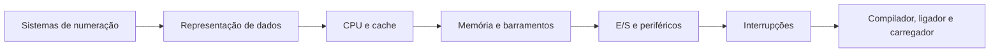
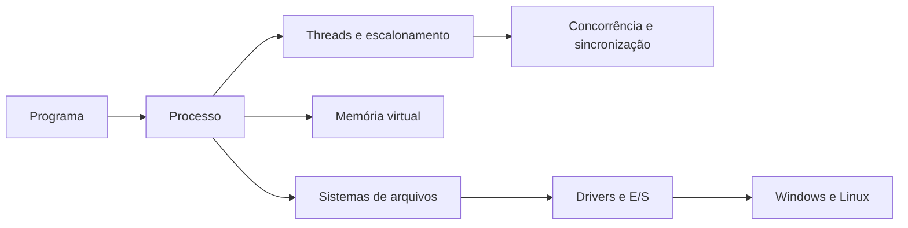
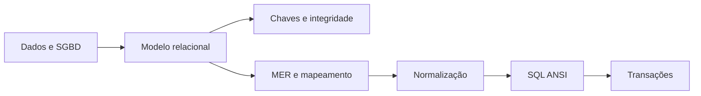
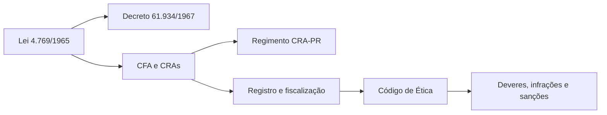
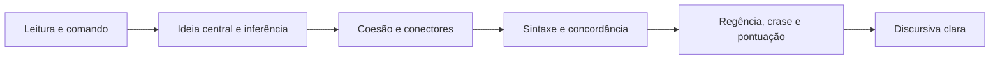
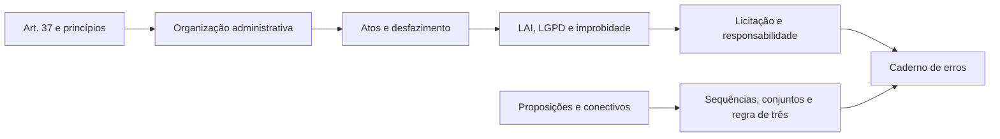

# Apostila de Estudo - Semana 1

## CRA-PR 2026 - Analista de Sistemas

**Versão 1.2**

Material de estudo direcionado para a primeira semana de preparação, com foco em construção de base forte, revisão diária de matérias de alto peso e aderência ao edital oficial vigente.

---

## Versão do edital utilizada

- **Nome do concurso:** Concurso Público do Conselho Regional de Administração do Paraná - CRA-PR.
- **Cargo:** Analista de Sistemas.
- **Banca:** Instituto Consulplan.
- **Versão do edital:** Edital de Concurso Público nº 1/2026, consolidado no arquivo oficial identificado como **conforme Retificação I**.
- **Data da retificação:** **Ponto pendente de confirmação.** O PDF oficial consolidado usado como base informa "conforme Retificação I", mas a data do ato isolado de retificação não foi localizada no próprio PDF consolidado consultado.
- **Arquivo oficial usado:** `../edital/edital_cra_pr_2026_analista_sistemas_retificacao_1.pdf`.
- **Link oficial consultado:** https://cdnsite.institutoconsulplan.org.br/concursos/1330/b2c07c473c9749fea22728da3c964c06.pdf
- **Observação sobre o Código de Ética:** o edital oficial consolidado conforme Retificação I cita a **Resolução Normativa CFA nº 671/2025** como Código de Ética dos profissionais da Administração. A página oficial do CFA da RN CFA nº 671/2025 informa expressamente que ela revogou a RN CFA nº 640/2024. Portanto, nesta apostila a RN CFA nº 671/2025 será usada apenas porque está indicada no edital vigente e há fonte oficial do CFA comprovando a revogação da RN CFA nº 640/2024.
- **Observação sobre o Regimento Interno do CRA-PR:** a RN CFA nº 651/2024 será citada apenas como norma oficial que aprova o Regimento do Conselho Regional de Administração do Paraná, conforme fonte oficial do CFA.

---

## Mapa de Pontuação e Prioridade

A prova objetiva para Analista de Sistemas tem 50 questões, todas com valor de 2 pontos, totalizando 100 pontos. A distribuição por disciplina define a estratégia de estudo: primeiro entram as matérias que concentram mais pontos e que têm maior impacto direto na classificação.

| Disciplina | Questões | Pontos | Prioridade |
|---|---:|---:|---|
| Conhecimentos do Cargo | 15 | 30 | Muito alta |
| Legislação CRA-PR/CFA | 10 | 20 | Muito alta |
| Língua Portuguesa | 10 | 20 | Muito alta |
| Administração Pública e Legislação Correlata | 5 | 10 | Média |
| Raciocínio Lógico-Matemático | 5 | 10 | Média |
| Informática | 5 | 10 | Baixa nesta primeira etapa |

Conhecimentos do Cargo, Legislação CRA-PR/CFA e Língua Portuguesa somam **35 questões**, ou seja, **70 pontos da objetiva**. Por isso, a Semana 1 prioriza base técnica, legislação específica e Português, mantendo revisões curtas diárias de Administração Pública, interpretação e discursiva.

O objetivo prático é evitar dois erros comuns de preparação: estudar apenas TI e perder pontos previsíveis em legislação/Português, ou estudar apenas teoria geral e deixar fraca a matéria de maior peso, que é Conhecimentos do Cargo.

---

## Como usar esta apostila

Esta apostila é a parte de estudo teórico da Semana 1. A apostila de questões será separada e seguirá exatamente a mesma divisão por dias.

Use o material assim:

1. Leia o objetivo e o motivo de cobrança do dia.
2. Estude a teoria com atenção ativa.
3. Refaça os exemplos resolvidos sem olhar a resolução.
4. Marque as pegadinhas e os erros comuns.
5. Preencha o checklist.
6. Registre no caderno de erros tudo que você errou, confundiu ou demorou para responder.

### Rotina diária fixa de 6h líquidas

Cada dia terá um tema principal, mas todos os dias também terão revisão curta de matérias de alto peso.

| Bloco | Tempo líquido | Atividade |
|---|---:|---|
| Bloco 1 | 2h | Tema principal do dia |
| Bloco 2 | 1h30 | Tema principal do dia |
| Bloco 3 | 1h | Tema principal do dia com exemplos e prática guiada |
| Bloco 4 | 40min | Revisão rápida de Legislação CRA/CFA, Administração Pública, Raciocínio Lógico-Matemático ou Informática |
| Bloco 5 | 30min | Português, interpretação ou discursiva |
| Bloco 6 | 20min | Caderno de erros e revisão ativa |

Pausas sugeridas, fora das 6h líquidas: 10min após o Bloco 1, 15min após o Bloco 2, 10min após o Bloco 3 e 5min antes do caderno de erros.

---

## Mapa da Semana 1

| Dia | Tema principal | Revisão curta | Foco de prova |
|---|---|---|---|
| Dia 1 | Arquitetura e organização de computadores | Legislação CRA/CFA | Conhecimentos do Cargo |
| Dia 2 | Sistemas operacionais | Administração Pública | Conhecimentos do Cargo |
| Dia 3 | Banco de dados base e SQL | Legislação CRA/CFA | Conhecimentos do Cargo |
| Dia 4 | Legislação CRA-PR/CFA | Administração Pública | Legislação específica |
| Dia 5 | Português e discursiva | Legislação CRA/CFA | Português e discursiva |
| Dia 6 | Administração Pública, RLM e revisão | Legislação CRA/CFA | Revisão e consolidação |

---

# Dia 1 - Arquitetura e Organização de Computadores

## Objetivo do dia

Construir base sólida em arquitetura e organização de computadores, especialmente sistemas de numeração, representação de dados, aritmética computacional, organização de CPU/memória, interrupções, endereçamento e tradução de programas.

Ao final do dia, você deve conseguir:

- converter números entre decimal, binário e hexadecimal;
- entender como dados são representados internamente;
- diferenciar CPU, memória, barramentos, registradores, cache e dispositivos de entrada/saída;
- explicar interrupções e endereçamento;
- diferenciar compilador, ligador e interpretador.

## Por que esse assunto importa para a prova

O edital de Analista de Sistemas abre Conhecimentos do Cargo com arquitetura e organização de computadores. Isso indica que a banca considera o tema base para os demais assuntos técnicos. Mesmo quando a questão parece de sistemas operacionais, redes ou banco de dados, ela frequentemente depende de noções de memória, processamento, representação de dados e execução de instruções.

Esse tema também é bom para ganhar pontos porque muitas questões têm resposta objetiva: conversões, conceitos e diferenças entre componentes. A dificuldade está nas pegadinhas de nomenclatura.

## Como a Consulplan costuma cobrar esse conteúdo

A Consulplan costuma cobrar esse tema de quatro formas:

- conversão simples entre bases numéricas, principalmente hexadecimal e decimal;
- identificação de componentes de arquitetura, como CPU, memória, cache e barramentos;
- distinção entre conceitos próximos, por exemplo compilador, interpretador e ligador;
- aplicação em cenário prático, como escolha de memória, análise de desempenho ou funcionamento de periféricos.

A banca gosta de alternativas com afirmações quase corretas, trocando uma palavra essencial: volátil por permanente, compilação por interpretação, memória principal por memória secundária, endereço físico por endereço lógico.

## Cronograma de 6h líquidas com pausas sugeridas

| Bloco | Tempo | Atividade |
|---|---:|---|
| 1 | 2h | Sistemas de numeração, representação de dados e aritmética computacional |
| Pausa | 10min | Descanso |
| 2 | 1h30 | CPU, memória, barramentos, cache, periféricos e interrupções |
| Pausa | 15min | Descanso |
| 3 | 1h | Endereçamento, compiladores, ligadores e interpretadores + exemplos |
| Pausa | 10min | Descanso |
| 4 | 40min | Revisão rápida de Legislação CRA/CFA: Lei 4.769/1965, finalidade do Sistema CFA/CRA |
| Pausa | 5min | Descanso |
| 5 | 30min | Português: interpretação de enunciados técnicos e identificação de comando da questão |
| 6 | 20min | Caderno de erros: conversões, siglas e conceitos confundidos |

## Teoria explicada de forma didática

### 1. Sistemas de numeração

Computadores trabalham internamente com sinais binários. Por isso, a base 2 é central em computação. Em provas, você precisa dominar principalmente:

- **Decimal:** base 10, usa os dígitos 0 a 9.
- **Binário:** base 2, usa os dígitos 0 e 1.
- **Hexadecimal:** base 16, usa 0 a 9 e A a F.

Cada posição de um número tem peso. No decimal, os pesos são potências de 10. No binário, potências de 2. No hexadecimal, potências de 16.

Exemplo: o número binário `1011` vale:

`1 x 2^3 + 0 x 2^2 + 1 x 2^1 + 1 x 2^0 = 8 + 0 + 2 + 1 = 11`.

No hexadecimal, `1F` vale:

`1 x 16^1 + F x 16^0 = 16 + 15 = 31`.

### Como funciona na prática

Hexadecimal é muito usado porque representa binários longos de forma curta. Cada dígito hexadecimal corresponde exatamente a 4 bits.

Exemplo:

- `1111` em binário = `F` em hexadecimal.
- `1010` em binário = `A` em hexadecimal.
- `1111 0000` em binário = `F0` em hexadecimal.

Isso aparece em endereços de memória, máscaras, dumps, cores em HTML/CSS, identificadores e configurações de baixo nível.

### Exemplos resolvidos - sistemas de numeração

**Exemplo 1:** converter `101101` de binário para decimal.

Pesos:

- `1 x 2^5 = 32`
- `0 x 2^4 = 0`
- `1 x 2^3 = 8`
- `1 x 2^2 = 4`
- `0 x 2^1 = 0`
- `1 x 2^0 = 1`

Resultado: `32 + 8 + 4 + 1 = 45`.

**Exemplo 2:** converter `2A` de hexadecimal para decimal.

`A` vale 10.

`2A = 2 x 16^1 + 10 x 16^0 = 32 + 10 = 42`.

**Exemplo 3:** converter `1110 0111` para hexadecimal.

Separe em grupos de 4 bits:

- `1110 = E`
- `0111 = 7`

Resultado: `E7`.

### Conversão hexadecimal para decimal

Para converter hexadecimal para decimal, multiplique cada dígito pela potência de 16 correspondente à sua posição. A leitura é da direita para a esquerda:

- posição mais à direita: `16^0`;
- segunda posição da direita para a esquerda: `16^1`;
- terceira posição: `16^2`;
- e assim por diante.

Lembre a tabela básica:

| Hexadecimal | Decimal |
|---|---:|
| A | 10 |
| B | 11 |
| C | 12 |
| D | 13 |
| E | 14 |
| F | 15 |

**Exemplo 4:** converter `B7` para decimal.

`B` vale 11 e `7` vale 7.

`B7 = 11 x 16^1 + 7 x 16^0 = 176 + 7 = 183`.

**Exemplo 5:** converter `3F` para decimal.

`F` vale 15.

`3F = 3 x 16^1 + 15 x 16^0 = 48 + 15 = 63`.

### 2. Representação de dados

Dados precisam ser codificados para serem processados. Os principais conceitos:

- **Bit:** menor unidade de informação, valor 0 ou 1.
- **Byte:** conjunto de 8 bits.
- **Word/palavra:** unidade natural de processamento de uma arquitetura, como 32 ou 64 bits.
- **Inteiros:** podem ser sem sinal ou com sinal.
- **Caracteres:** representados por códigos, como ASCII ou Unicode.
- **Ponto flutuante:** usado para números reais aproximados.

Uma pegadinha comum é achar que todo número real é representado exatamente. Em computação, ponto flutuante é aproximação. Isso pode gerar pequenos erros de arredondamento.

### Como funciona na prática

Quando um sistema grava a letra `A`, ele não guarda "a letra" como objeto abstrato. Ele guarda um código numérico. Em ASCII, `A` corresponde a 65 em decimal, que é `01000001` em binário.

Quando um sistema trabalha com inteiros com sinal, precisa reservar uma forma de indicar valores negativos. A técnica mais comum é o complemento de dois.

### Exemplos resolvidos - representação de dados

**Exemplo 1:** quantos valores distintos podem ser representados com 8 bits?

Cada bit tem 2 possibilidades. Com 8 bits:

`2^8 = 256`.

Se for inteiro sem sinal, o intervalo costuma ser de 0 a 255.

**Exemplo 2:** por que 1 byte pode representar 256 valores, e não 255?

Porque a contagem inclui o zero. Com 8 bits, temos 256 combinações possíveis. Se a menor combinação é 0, a maior é 255.

**Exemplo 3:** qual é a diferença entre ASCII e Unicode?

ASCII é uma codificação menor, historicamente voltada a caracteres básicos. Unicode é um padrão mais amplo para representar caracteres de vários idiomas, símbolos e acentos.

### 3. CPU, memória, barramentos e cache

A CPU executa instruções. Para isso, usa registradores, unidade de controle, unidade lógica e aritmética e comunicação com memória.

Componentes essenciais:

- **Unidade de controle:** coordena a busca, decodificação e execução das instruções.
- **ULA/ALU:** realiza operações aritméticas e lógicas.
- **Registradores:** pequenas áreas de armazenamento dentro da CPU, extremamente rápidas.
- **Memória RAM:** memória principal, volátil, usada durante a execução dos programas.
- **Memória ROM:** memória não volátil, usada para armazenar instruções permanentes ou de inicialização.
- **Firmware:** software gravado em memória não volátil, próximo ao hardware, usado para inicializar ou controlar dispositivos.
- **Cache:** memória muito rápida entre CPU e RAM.
- **Barramentos:** caminhos de comunicação para dados, endereços e controle.
- **Armazenamento secundário:** SSD, HD e mídias persistentes.

#### ROM vs RAM

RAM e ROM aparecem em questões porque ambas são "memórias", mas têm funções diferentes.

| Memória | Característica | Uso típico | Pegadinha |
|---|---|---|---|
| RAM | Volátil, leitura e escrita, rápida | Programas e dados em execução | Achar que guarda arquivos permanentemente |
| ROM | Não volátil, tende a preservar conteúdo | Rotinas de inicialização e firmware | Achar que funciona como memória principal comum |

A **RAM** perde seu conteúdo quando falta energia. Ela serve como área de trabalho do sistema em execução. A **ROM** tende a preservar o conteúdo e costuma armazenar instruções de inicialização ou componentes de firmware.

#### Registradores

Registradores são as áreas de armazenamento mais rápidas usadas diretamente pela CPU. Eles ficam dentro do processador e armazenam temporariamente operandos, endereços e resultados usados diretamente pela CPU.

Exemplos comuns de registradores:

- **contador de programa/PC:** indica a próxima instrução a ser buscada;
- **registrador de instrução/IR:** guarda a instrução em execução;
- **acumulador ou registradores gerais:** guardam operandos e resultados intermediários;
- **registradores de endereço:** ajudam a localizar dados na memória;
- **registradores de estado/flags:** indicam resultados de operações, como zero, sinal, carry ou overflow.

A pegadinha é comparar registrador com RAM ou SSD. Registrador é muito menor, muito mais rápido e fica dentro da CPU. RAM é memória principal. SSD/HD são armazenamento persistente.

#### Pipeline de CPU

Pipeline é uma técnica em que a CPU sobrepõe etapas de execução de instruções. Em vez de esperar uma instrução passar por todas as etapas para só então iniciar a próxima, a CPU pode buscar uma instrução enquanto decodifica outra e executa uma terceira.

Modelo simplificado:

1. **Busca:** obter a instrução na memória.
2. **Decodificação:** identificar qual operação será feita.
3. **Execução:** realizar a operação.
4. **Acesso à memória:** ler ou escrever dados, se necessário.
5. **Escrita de resultado:** gravar o resultado no registrador ou destino.

Pipeline melhora a **vazão** do processador, isto é, a quantidade de instruções concluídas por unidade de tempo. Ele não significa, necessariamente, que uma instrução individual terá menor latência.

#### Throughput vs latência

| Conceito | Ideia | Exemplo |
|---|---|---|
| Latência | Tempo para uma operação individual terminar | Tempo de uma instrução específica do início ao fim |
| Throughput/vazão | Quantidade de operações concluídas por unidade de tempo | Instruções concluídas por ciclo ou por segundo |

Na prova, a frase "pipeline sempre reduz o tempo de cada instrução" deve acender alerta. Pipeline tende a aumentar o throughput, mas uma instrução individual ainda passa por etapas e pode sofrer atrasos por dependências, desvios e conflitos de recursos.

#### Cache, localidade e políticas de escrita

Cache melhora desempenho porque explora o princípio da localidade:

- **Localidade temporal:** se um dado foi acessado agora, há boa chance de ser acessado novamente em breve.
- **Localidade espacial:** se um endereço foi acessado, endereços próximos tendem a ser acessados em breve.

Exemplo de localidade temporal: repetir várias vezes uma variável dentro de um laço.  
Exemplo de localidade espacial: percorrer um vetor sequencialmente.

Políticas de escrita mais cobradas:

| Política | Como funciona | Vantagem | Risco/atenção |
|---|---|---|---|
| Write-through | Escreve no cache e na memória principal imediatamente | Memória principal fica mais atualizada | Pode gerar mais tráfego de memória |
| Write-back | Escreve primeiro no cache e atualiza a memória depois | Reduz escritas na memória principal | Exige controle de consistência, como bit de sujeira/dirty bit |

Cache não substitui ULA, registradores, RAM ou SSD. Ela reduz tempo médio de acesso, mas quem executa operações aritméticas e lógicas é a ULA.

### Como funciona na prática

Quando você abre um programa:

1. O programa está armazenado no SSD/HD.
2. O sistema operacional carrega partes do programa para a RAM.
3. A CPU busca instruções na memória.
4. A CPU decodifica e executa essas instruções.
5. Dados frequentemente usados podem ficar em cache.

Quanto mais próximo da CPU, mais rápida e cara tende a ser a memória. A hierarquia típica é:

registradores > cache > RAM > SSD > HD.

### Exemplos resolvidos - CPU e memória

**Exemplo 1:** se uma questão afirma que a RAM armazena permanentemente os arquivos do usuário, a afirmação está correta?

Não. A RAM é volátil. Ela mantém dados em uso enquanto há energia e execução. Armazenamento permanente é função de SSD, HD ou outro meio persistente.

**Exemplo 2:** por que cache melhora desempenho?

Porque reduz o tempo médio de acesso a dados e instruções frequentemente usados. A CPU é muito mais rápida que a RAM; se toda busca dependesse diretamente da RAM, a CPU ficaria esperando com mais frequência.

**Exemplo 3:** barramento de endereços e barramento de dados são iguais?

Não. O barramento de endereços indica onde acessar. O barramento de dados transporta o conteúdo lido ou escrito.

**Exemplo 4:** pipeline sempre diminui a latência de cada instrução?

Não. Pipeline tende a melhorar a vazão, permitindo que várias instruções estejam em etapas diferentes. A latência de uma instrução individual não necessariamente diminui.

**Exemplo 5:** qual é a diferença entre write-through e write-back?

No write-through, a escrita vai para cache e memória principal imediatamente. No write-back, a escrita fica inicialmente no cache e a memória é atualizada depois, reduzindo tráfego, mas exigindo controle de consistência.

### 4. Interrupções, periféricos e entrada/saída

Interrupção é um mecanismo pelo qual um evento sinaliza à CPU que precisa de atenção. Pode vir de hardware ou software.

Exemplos:

- teclado pressionado;
- chegada de pacote de rede;
- conclusão de operação de disco;
- erro de divisão por zero;
- chamada de sistema.

Sem interrupções, a CPU teria que consultar repetidamente cada dispositivo para saber se algo aconteceu. Isso desperdiçaria processamento.

#### Polling vs interrupções

No **polling**, a CPU pergunta repetidamente ao dispositivo se ele precisa de atendimento. É simples, mas pode desperdiçar processamento quando nada acontece.

Na **interrupção**, o dispositivo ou controlador sinaliza quando precisa de atenção. A CPU não precisa ficar perguntando continuamente; ela pode executar outras tarefas e ser avisada quando houver evento.

| Técnica | Como funciona | Ponto forte | Pegadinha |
|---|---|---|---|
| Polling | CPU consulta repetidamente o dispositivo | Simples de implementar | Pode desperdiçar CPU |
| Interrupção | Dispositivo avisa a CPU quando precisa | Resposta eficiente a eventos | Não significa erro; pode ser evento normal |

#### DMA

DMA significa **Direct Memory Access**, ou acesso direto à memória. É uma técnica em que um controlador transfere dados entre dispositivo de E/S e memória principal com menor intervenção da CPU.

Sem DMA, a CPU teria que participar mais ativamente da transferência de cada bloco de dados. Com DMA, a CPU configura a operação, o controlador realiza a transferência e a CPU é avisada ao final, normalmente por interrupção.

Isso é importante em operações de disco, rede e outros dispositivos que movimentam grande volume de dados.

### Como funciona na prática

Quando uma tecla é pressionada, o teclado gera um evento. O controlador de interrupção avisa a CPU. A CPU pausa temporariamente o fluxo atual, salva o contexto necessário, executa uma rotina de tratamento da interrupção e depois retorna ao que estava fazendo.

### Exemplos resolvidos - interrupções e E/S

**Exemplo 1:** interrupção sempre indica erro?

Não. Pode indicar eventos normais, como entrada de dados, término de E/S ou temporizador do sistema.

**Exemplo 2:** por que interrupções são importantes para sistemas operacionais multitarefa?

Porque permitem alternância de execução, resposta a eventos e gerenciamento eficiente de dispositivos. O temporizador, por exemplo, ajuda o SO a interromper um processo e dar tempo de CPU a outro.

**Exemplo 3:** polling e interrupção resolvem o mesmo problema do mesmo jeito?

Não. Ambos lidam com eventos de dispositivos, mas polling consulta repetidamente; interrupção sinaliza quando há evento.

**Exemplo 4:** DMA elimina a CPU do sistema?

Não. DMA reduz a intervenção da CPU na transferência de dados, mas a CPU ainda configura a operação, coordena o sistema e trata a conclusão quando necessário.

### 5. Endereçamento

Endereçamento é o modo como a arquitetura localiza dados e instruções. Em termos simples, a CPU precisa saber onde buscar operandos e onde gravar resultados.

Conceitos importantes:

- **Endereço de memória:** posição usada para localizar dado ou instrução.
- **Endereço lógico/virtual:** endereço visto pelo programa.
- **Endereço físico:** endereço real na memória principal.
- **Modos de endereçamento:** formas de indicar operandos, como imediato, direto, indireto, por registrador.

| Modo        | Onde está o valor?                         | Exemplo               | Ideia                    |
| ----------- | ------------------------------------------ | --------------------- | ------------------------ |
| Imediato    | Na própria instrução                       | `MOV R1, 10`          | Use o valor 10           |
| Direto      | Em um endereço de memória                  | `LOAD R1, [1000]`     | Busque na gaveta 1000    |
| Indireto    | Em um endereço apontado por outro endereço | `LOAD R1, [[1000]]`   | Vá onde o bilhete mandar |
| Registrador | Dentro da CPU                              | `ADD R1, R2`          | Use valores já na CPU    |
| Indexado    | Base + deslocamento                        | `LOAD R1, [BASE + i]` | Acessar arrays/listas    |


### Como funciona na prática

Em sistemas com memória virtual, o programa trabalha com endereços virtuais. O sistema operacional e a unidade de gerenciamento de memória fazem a tradução para endereços físicos. Isso permite isolamento entre processos e melhor gestão da memória.

### Exemplos resolvidos - endereçamento

**Exemplo 1:** no modo imediato, o operando está onde?

Está na própria instrução. Exemplo conceitual: `MOV A, 5` move o valor imediato 5 para o registrador A.

**Exemplo 2:** por que endereço virtual não é a mesma coisa que endereço físico?

Porque o endereço virtual é a visão do processo; o físico corresponde à posição real na RAM. A tradução permite proteção, paginação e isolamento.

### 6. Compiladores, montadores, ligadores e carregadores

Esses conceitos aparecem muito em provas porque são parecidos.

- **Compilador:** traduz código-fonte de alto nível para código de máquina, código objeto ou código intermediário antes da execução.
- **Interpretador:** lê e executa comandos durante a execução.
- **Assembler/montador:** traduz linguagem de montagem para código de máquina.
- **Linker/ligador:** combina módulos compilados e bibliotecas, resolvendo referências externas para gerar o executável.
- **Loader/carregador:** coloca o executável na memória, prepara o ambiente de execução e inicia o programa.

### Como funciona na prática

Em C, é comum haver compilação de vários arquivos `.c` para arquivos objeto. O linker junta esses objetos e bibliotecas para gerar um executável. Depois, quando o usuário ou o sistema operacional inicia o programa, o loader carrega esse executável na memória.

Em Python, normalmente há interpretação/execução por uma máquina virtual, embora existam etapas internas de bytecode. Para concurso, o contraste clássico é: compilador traduz previamente; interpretador executa instrução a instrução ou unidade a unidade.

Fluxo simplificado:

1. Código-fonte em linguagem de alto nível é compilado.
2. Código assembly, quando houver, pode ser traduzido pelo assembler.
3. Arquivos objeto e bibliotecas são combinados pelo linker.
4. O executável é carregado na memória pelo loader.
5. A CPU executa instruções usando registradores, cache, RAM e barramentos.

### Exemplos resolvidos - tradução de programas

**Exemplo 1:** se um programa tem dois módulos compilados separadamente e um chama função do outro, quem resolve essa ligação?

O ligador/linker. Ele resolve referências externas entre módulos e bibliotecas.

**Exemplo 2:** qual é a diferença central entre compilador e interpretador?

O compilador traduz o programa antes da execução; o interpretador executa o código durante a execução, realizando a tradução/execução de forma incremental.

**Exemplo 3:** quem coloca o executável na memória para execução?

O loader/carregador. O linker gera o executável; o loader carrega esse executável na memória e prepara sua execução.

**Exemplo 4:** assembler e linker fazem a mesma coisa?

Não. O assembler traduz linguagem de montagem para código de máquina. O linker liga módulos e bibliotecas, resolvendo referências para formar o executável.

## Pegadinhas comuns da banca

- Dizer que RAM é memória permanente.
- Confundir ROM com RAM ou firmware com aplicativo comum.
- Confundir cache com memória secundária.
- Dizer que cache substitui a ULA.
- Dizer que pipeline sempre reduz a latência de cada instrução.
- Confundir throughput com latência.
- Afirmar que todo número real é representado exatamente.
- Trocar compilador por ligador.
- Trocar linker por loader.
- Dizer que interrupção é sempre erro.
- Confundir polling com interrupção.
- Achar que DMA elimina a CPU, quando na verdade reduz sua intervenção em transferências de E/S.
- Confundir endereço lógico com endereço físico.
- Esquecer que hexadecimal usa A=10, B=11, C=12, D=13, E=14, F=15.

## O que memorizar

| Conceito | Memorização objetiva |
|---|---|
| 1 byte | 8 bits |
| 8 bits | 256 combinações |
| Hexadecimal | 1 dígito = 4 bits |
| B7 hexadecimal | 11 x 16 + 7 = 183 |
| RAM | memória principal, volátil |
| ROM | memória não volátil, usada em rotinas permanentes/firmware |
| Firmware | software gravado próximo ao hardware |
| Cache | memória rápida entre CPU e RAM |
| Localidade temporal | reutilização de dado acessado recentemente |
| Localidade espacial | acesso provável a endereços próximos |
| Write-through | escreve no cache e na memória principal |
| Write-back | escreve no cache e atualiza a memória depois |
| ULA | operações aritméticas e lógicas |
| Unidade de controle | coordena execução de instruções |
| Registradores | armazenam temporariamente operandos, endereços e resultados usados diretamente pela CPU |
| Pipeline | sobrepõe etapas para melhorar vazão |
| DMA | transferência de E/S com menor intervenção da CPU |
| Polling | CPU consulta repetidamente o dispositivo |
| Linker | liga módulos e bibliotecas |
| Loader | carrega programa na memória |
| Assembler | traduz linguagem de montagem para código de máquina |
| Interrupção | mecanismo de atenção da CPU a evento |

## Erros comuns

| Erro | Correção |
|---|---|
| Achar que 8 bits representam 255 valores | Representam 256 valores; 0 a 255 sem sinal |
| Dizer que HD/SSD é memória principal | É armazenamento secundário |
| Tratar Unicode como sinônimo de ASCII | Unicode é mais amplo |
| Confundir barramento de dados com barramento de endereços | Um transporta conteúdo; outro indica localização |
| Dizer que compilador executa o programa | Compilador traduz; execução é outro processo |
| Usar "registrador" como sinônimo de memória RAM | Registrador fica dentro da CPU e é muito mais rápido |
| Achar que pipeline sempre acelera uma instrução isolada | Pipeline melhora principalmente throughput |
| Dizer que polling é mais eficiente em qualquer cenário | Polling pode desperdiçar CPU perguntando repetidamente |
| Dizer que write-back e write-through são iguais | Uma política atualiza memória imediatamente; a outra posterga |

## Mini revisão do dia

Arquitetura de computadores é a base física e lógica que permite a execução de programas. A CPU executa instruções usando registradores, ULA e unidade de controle. A memória segue uma hierarquia de velocidade e custo: registradores, cache, RAM e armazenamento secundário. RAM é volátil; ROM tende a preservar conteúdo e pode armazenar firmware. Cache explora localidade temporal e espacial. Pipeline melhora vazão, mas não garante menor latência individual. Interrupções evitam que a CPU precise ficar consultando dispositivos a todo momento; polling faz essa consulta repetida; DMA reduz intervenção da CPU em transferências de E/S. Compiladores, assemblers, linkers, loaders e interpretadores atuam em etapas diferentes da transformação do código em execução.

## Checklist de domínio

- [ ] Sei converter binário para decimal.
- [ ] Sei converter hexadecimal para decimal.
- [ ] Sei converter `B7` hexadecimal para decimal: `11 x 16 + 7 = 183`.
- [ ] Sei agrupar binário em quartetos para obter hexadecimal.
- [ ] Diferencio bit, byte, palavra e caractere.
- [ ] Sei explicar CPU, ULA, registradores, RAM, ROM, firmware, cache e barramentos.
- [ ] Diferencio latência e throughput.
- [ ] Sei explicar localidade temporal e localidade espacial.
- [ ] Diferencio write-back e write-through.
- [ ] Sei o que é interrupção e por que ela existe.
- [ ] Diferencio polling, interrupção e DMA.
- [ ] Diferencio endereço lógico/virtual e físico.
- [ ] Diferencio compilador, interpretador, assembler, linker e loader.

## Tarefa para o caderno de erros

Crie uma página chamada **Arquitetura - Erros e Confusões** e registre:

- bases numéricas que você confundiu;
- conceitos trocados, como RAM/ROM, RAM/SSD, cache/RAM, cache/ULA, compilador/linker, linker/loader;
- fórmulas simples: `2^n`, 1 byte = 8 bits, 1 hexadecimal = 4 bits;
- uma tabela com A=10, B=11, C=12, D=13, E=14, F=15.

## 5 perguntas de fixação

1. Por que o hexadecimal é útil para representar dados binários?
2. Qual é a diferença entre RAM, cache e armazenamento secundário?
3. O que acontece, em linhas gerais, quando uma interrupção é gerada?
4. Qual é a diferença entre endereço lógico/virtual e endereço físico?
5. Qual é o papel do assembler, do linker e do loader?

## Assuntos que serão cobrados na Apostila de Questões

Sistemas de numeração, conversão hexadecimal para decimal, representação de dados, CPU, registradores, RAM, ROM, firmware, cache, localidade temporal e espacial, políticas write-back/write-through, barramentos, pipeline, throughput, latência, polling, interrupções, DMA, dispositivos de E/S, endereçamento, assembler, linker, loader, compiladores e interpretadores.

## Tabela de revisão rápida do Dia 1

| Conceito | Definição curta | Pegadinha comum | Exemplo |
|---|---|---|---|
| RAM | Memória principal volátil usada por programas em execução | Dizer que guarda arquivos permanentemente | Dados de um programa aberto ficam na RAM durante a execução |
| ROM | Memória não volátil, voltada a conteúdo permanente ou inicialização | Tratar como RAM comum de trabalho | Rotina básica de inicialização |
| Firmware | Software gravado próximo ao hardware | Confundir com aplicativo do usuário | Código de controle de dispositivo |
| Registradores | Armazenam temporariamente operandos, endereços e resultados usados diretamente pela CPU | Confundir com RAM ou cache | PC indica próxima instrução |
| ULA | Executa operações aritméticas e lógicas | Dizer que cache executa operações | Soma, comparação, AND lógico |
| Cache | Memória rápida entre CPU e RAM | Dizer que substitui ULA ou SSD | Dado acessado repetidamente fica em cache |
| Localidade temporal | Reuso provável de dado acessado recentemente | Confundir com proximidade de endereço | Variável usada várias vezes em um laço |
| Localidade espacial | Acesso provável a endereços próximos | Confundir com reuso do mesmo dado | Percorrer vetor posição por posição |
| Write-through | Escrita no cache e na memória principal | Achar que posterga atualização da memória | Alteração refletida imediatamente na RAM |
| Write-back | Escrita no cache e atualização posterior da memória | Achar que memória principal fica atualizada imediatamente | Linha de cache marcada como dirty |
| Pipeline | Sobreposição de etapas da CPU | Dizer que sempre reduz latência individual | Buscar uma instrução enquanto outra executa |
| Throughput | Quantidade concluída por unidade de tempo | Confundir com tempo individual | Mais instruções concluídas por ciclo |
| Latência | Tempo de uma operação individual | Confundir com vazão total | Tempo de uma instrução do início ao fim |
| Polling | CPU consulta repetidamente o dispositivo | Dizer que sempre é mais eficiente | Perguntar ao dispositivo se há dado disponível |
| Interrupção | Evento sinaliza à CPU que precisa de atenção | Dizer que sempre é erro | Teclado, timer, pacote de rede |
| DMA | Transferência entre dispositivo e memória com menor intervenção da CPU | Dizer que elimina a CPU | Controlador move bloco de disco para RAM |
| Assembler | Traduz assembly para código de máquina | Confundir com linker | Montar instruções assembly |
| Linker | Liga módulos e bibliotecas | Confundir com loader | Resolver função externa entre arquivos objeto |
| Loader | Carrega executável na memória | Confundir com linker | Iniciar execução de um programa |
| Hexadecimal | Base 16, A=10 até F=15 | Esquecer valor de B ou F | `B7 = 11 x 16 + 7 = 183` |

## Pegadinhas do Dia 1

- Cache não substitui ULA: cache acelera acesso a dados; ULA executa operações aritméticas e lógicas.
- Pipeline melhora vazão, não necessariamente a latência individual de cada instrução.
- Linker liga módulos e bibliotecas; loader carrega o executável em memória.
- DMA reduz intervenção da CPU em transferências de E/S, mas não elimina a CPU do sistema.
- Polling desperdiça CPU quando fica perguntando repetidamente se o dispositivo tem evento.
- RAM é volátil; ROM tende a preservar conteúdo e pode armazenar rotinas permanentes ou firmware.
- `B7` hexadecimal = `11 x 16 + 7 = 183`.

---


## Revisão fixa do Dia 1

**Foco:** Legislação CRA/CFA e Português. Recupere Lei nº 4.769/1965, Decreto nº 61.934/1967, distinção CFA × CRA, registro e deveres; em Português, leitura de comando, conectores e inferência. **Base:** teoria do Dia 4 e Dia 5. **Pegadinha:** tratar diploma como registro ou trocar conclusão por causa.


## Mapa de conexões do Dia 1



**Leitura ativa:** dado precisa ser representado antes de ser processado; cache não é memória secundária; interrupção não é polling. **Pegadinhas:** bit × byte; cache × RAM; compilador × interpretador.

# Dia 2 - Sistemas Operacionais

## Objetivo do dia

Entender o papel do sistema operacional como gerenciador de recursos, com foco em processos, memória, memória virtual, paginação, segmentação, sistema de arquivos, dispositivos, concorrência, sincronização, deadlock e aspectos práticos de Windows/Linux.

## Por que esse assunto importa para a prova

Sistemas operacionais aparecem no edital como um bloco próprio dentro de Conhecimentos do Cargo. É um tema de alta probabilidade porque se relaciona diretamente às atribuições do Analista de Sistemas no CRA-PR: suporte a usuários, servidores de aplicação e banco de dados, backup, rede, estações de trabalho, segurança e sistemas de terceiros.

Além disso, a Consulplan costuma cobrar tanto conceito puro quanto aplicação prática, como comandos, comportamento de processos, memória virtual e administração básica de Windows/Linux.

## Como a Consulplan costuma cobrar esse conteúdo

O padrão mais comum é:

- "assinale a afirmativa correta" sobre funções do SO;
- V/F sobre memória, processos ou arquivos;
- cenário prático com falha de desempenho, deadlock ou consumo de memória;
- comparação entre Windows e Linux;
- alternativas que confundem processo, programa e thread.

## Cronograma de 6h líquidas com pausas sugeridas

| Bloco | Tempo | Atividade |
|---|---:|---|
| 1 | 2h | Conceitos de SO, processos, threads e escalonamento |
| Pausa | 10min | Descanso |
| 2 | 1h30 | Memória, memória virtual, paginação e segmentação |
| Pausa | 15min | Descanso |
| 3 | 1h | Arquivos, dispositivos, concorrência, sincronização e deadlock |
| Pausa | 10min | Descanso |
| 4 | 40min | Revisão rápida de Administração Pública: administração direta, indireta e autarquia |
| Pausa | 5min | Descanso |
| 5 | 30min | Português: leitura de enunciados com "exceto", "incorreta" e "não se aplica" |
| 6 | 20min | Caderno de erros: mapa processo x thread x programa |

## Teoria explicada de forma didática

### 1. Conceito e funções do sistema operacional

Sistema operacional é o software básico que intermedeia usuário, aplicações e hardware.

Principais funções:

- gerenciar processos;
- gerenciar memória;
- gerenciar arquivos;
- controlar dispositivos de entrada e saída;
- prover interface de usuário;
- controlar segurança, usuários e permissões;
- oferecer chamadas de sistema para programas.

Sem sistema operacional, cada programa teria que lidar diretamente com hardware, disco, teclado, vídeo, memória, rede e permissões. Isso seria inseguro, ineficiente e impraticável.

### Como funciona na prática

Quando você salva um arquivo em uma pasta, não é o editor de texto que grava diretamente no hardware. Ele pede ao sistema operacional, por meio de serviços do sistema, que realize a operação. O SO verifica permissões, localiza o sistema de arquivos e aciona drivers de dispositivo.

### Exemplos resolvidos - conceito de SO

**Exemplo 1:** navegador, editor de texto e antivírus são sistemas operacionais?

Não. São aplicativos ou utilitários. Sistema operacional é a camada que permite sua execução e gerencia recursos.

**Exemplo 2:** o SO gerencia apenas hardware?

Não. Ele gerencia hardware e recursos lógicos, como processos, memória, arquivos, permissões, usuários e comunicação entre processos.

### 2. Processos, threads e escalonamento

Um **programa** é um conjunto de instruções armazenado. Um **processo** é um programa em execução, com contexto próprio: código, dados, pilha, registradores, espaço de endereçamento e recursos associados.

Uma **thread** é uma linha de execução dentro de um processo. Várias threads podem compartilhar recursos do mesmo processo.

O **escalonador** decide qual processo ou thread usará a CPU em determinado momento.

Conceitos importantes:

- **pronto:** processo apto a executar, aguardando CPU;
- **executando:** processo usando CPU;
- **bloqueado/esperando:** processo aguarda evento, como E/S;
- **preemptivo:** o SO pode interromper um processo;
- **não preemptivo:** o processo executa até terminar ou bloquear voluntariamente.

### Como funciona na prática

Em um computador com vários programas abertos, a CPU alterna rapidamente entre tarefas. Parece que tudo roda ao mesmo tempo. Essa impressão é criada por escalonamento, interrupções de temporizador e gerenciamento de processos.

### Exemplos resolvidos - processos

**Exemplo 1:** um processo bloqueado está usando CPU?

Em regra, não. Ele aguarda algum evento, como leitura de disco, pacote de rede ou liberação de recurso.

**Exemplo 2:** escalonamento preemptivo permite que o SO retire a CPU de um processo antes de ele terminar?

Sim. Esse é o ponto central da preempção. O SO pode interromper a execução e passar a CPU para outro processo.

**Exemplo 3:** processo e programa são sinônimos?

Não. Programa é passivo, armazenado. Processo é ativo, em execução.

### 3. Gerenciamento de memória, memória virtual, paginação e segmentação

A memória principal é limitada. O sistema operacional precisa dividir, proteger e controlar a memória usada pelos processos.

**Memória virtual** é uma técnica que dá a cada processo a impressão de ter um espaço de memória próprio e contínuo. Ela permite:

- isolamento entre processos;
- execução de programas maiores que a RAM disponível;
- uso de disco como apoio;
- proteção de áreas de memória.

**Paginação** divide a memória em blocos de tamanho fixo:

- páginas: blocos do espaço virtual;
- molduras/frames: blocos da memória física.

**Segmentação** divide a memória em segmentos lógicos de tamanho variável, como código, dados e pilha.

### Como funciona na prática

Se há pouca RAM, o SO pode mover páginas menos usadas para disco. Isso permite continuar executando, mas se o uso de disco for intenso, o sistema fica lento. Esse fenômeno pode aparecer como degradação de desempenho por paginação excessiva.

### Exemplos resolvidos - memória

**Exemplo 1:** memória virtual é a mesma coisa que memória RAM?

Não. Memória virtual é uma abstração criada pelo sistema operacional. RAM é memória física principal.

**Exemplo 2:** paginação usa blocos de tamanho fixo ou variável?

Fixo. Essa é uma diferença clássica em relação à segmentação, que usa segmentos de tamanho variável.

**Exemplo 3:** por que a memória virtual melhora segurança?

Porque cada processo trabalha em seu próprio espaço de endereçamento. Um processo não deve acessar livremente a memória de outro.

### 4. Sistemas de arquivos

Sistema de arquivos organiza dados em unidades como arquivos e diretórios. Ele controla nomes, permissões, metadados, localização física e estrutura de armazenamento.

Conceitos cobrados:

- arquivo;
- diretório/pasta;
- caminho absoluto e relativo;
- permissões;
- metadados;
- journaling;
- fragmentação;
- sistemas como NTFS, ext4, FAT32.

### Como funciona na prática

Quando você salva um relatório, o SO registra nome, localização, tamanho, datas, permissões e blocos ocupados no disco. Sistemas com journaling mantêm registros auxiliares para ajudar na recuperação em caso de falha.

### Exemplos resolvidos - arquivos

**Exemplo 1:** caminho absoluto e caminho relativo são iguais?

Não. Caminho absoluto parte da raiz ou unidade, como `C:\Dados\relatorio.pdf` ou `/home/user/relatorio.pdf`. Caminho relativo depende do diretório atual.

**Exemplo 2:** journaling substitui backup?

Não. Journaling ajuda na consistência do sistema de arquivos após falha. Backup permite recuperar dados perdidos, corrompidos ou apagados.

### 5. Dispositivos e drivers

Dispositivos de entrada e saída são controlados por drivers. Driver é software que permite ao sistema operacional se comunicar com hardware específico.

Exemplos:

- impressora;
- placa de rede;
- disco;
- teclado;
- webcam.

### Como funciona na prática

Quando um usuário imprime documento, o aplicativo envia a solicitação ao SO. O SO usa o subsistema de impressão e o driver da impressora para transformar dados em comandos compatíveis com o dispositivo.

### Exemplos resolvidos - dispositivos

**Exemplo 1:** um driver é hardware?

Não. Driver é software de controle de hardware.

**Exemplo 2:** se uma placa de rede não funciona por falta de driver, o problema é necessariamente físico?

Não. Pode ser problema de software, configuração, compatibilidade ou driver ausente/incorreto.

### 6. Concorrência, sincronização e deadlock

Concorrência ocorre quando múltiplos processos ou threads disputam recursos ou executam de forma intercalada.

Problemas típicos:

- condição de corrida;
- acesso simultâneo a recurso compartilhado;
- inconsistência de dados;
- deadlock.

**Sincronização** usa mecanismos para coordenar acesso:

- semáforos;
- mutex;
- monitores;
- locks.

**Deadlock** ocorre quando processos ficam presos esperando recursos uns dos outros.

Condições clássicas de deadlock:

1. exclusão mútua;
2. posse e espera;
3. não preempção;
4. espera circular.

### Como funciona na prática

Imagine dois processos:

- Processo A segura o arquivo 1 e espera o arquivo 2.
- Processo B segura o arquivo 2 e espera o arquivo 1.

Se nenhum liberar o recurso, ambos ficam bloqueados. Isso é espera circular.

### Exemplos resolvidos - concorrência

**Exemplo 1:** condição de corrida ocorre quando o resultado depende da ordem de execução?

Sim. Se duas threads alteram o mesmo dado sem sincronização, a ordem pode gerar resultado incorreto.

**Exemplo 2:** deadlock é apenas lentidão?

Não. É bloqueio permanente ou indefinido por dependência circular de recursos.

**Exemplo 3:** mutex serve para quê?

Serve para garantir exclusão mútua no acesso a recurso compartilhado.

### 7. Windows e Linux

O edital exige aspectos práticos e teóricos de Windows/Linux.

Pontos essenciais:

- Windows usa tradicionalmente unidades como `C:\`.
- Linux organiza tudo a partir da raiz `/`.
- Linux é fortemente orientado a permissões por usuário, grupo e outros.
- Windows usa NTFS como sistema comum moderno.
- Linux usa ext4, XFS, Btrfs e outros.
- Ambos suportam multitarefa, usuários, rede, serviços, logs e permissões.

Comandos úteis para prova:

- Linux: `ls`, `cd`, `pwd`, `cp`, `mv`, `rm`, `chmod`, `chown`, `ps`, `top`, `kill`, `grep`, `systemctl`.
- Windows: Gerenciador de Tarefas, PowerShell, Serviços, Event Viewer, permissões NTFS.

### Exemplos resolvidos - Windows/Linux

**Exemplo 1:** em Linux, `/home/ana/documentos` é caminho absoluto?

Sim, porque começa na raiz `/`.

**Exemplo 2:** `chmod` altera proprietário do arquivo?

Não. `chmod` altera permissões. Para proprietário, usa-se `chown`.

## Pegadinhas comuns da banca

- Confundir programa com processo.
- Afirmar que processo bloqueado está usando CPU.
- Dizer que paginação usa blocos variáveis.
- Dizer que segmentação usa blocos fixos.
- Confundir deadlock com simples lentidão.
- Afirmar que driver é componente físico.
- Tratar journaling como backup.
- Confundir permissões Linux: usuário, grupo e outros.

## O que memorizar

| Conceito | Memorização objetiva |
|---|---|
| Processo | programa em execução |
| Thread | linha de execução dentro do processo |
| Preempção | SO pode retirar CPU do processo |
| Paginação | blocos fixos |
| Segmentação | blocos lógicos variáveis |
| Deadlock | espera circular por recursos |
| Mutex | exclusão mútua |
| Driver | software de controle de hardware |
| Journaling | consistência do sistema de arquivos |

## Erros comuns

| Erro | Correção |
|---|---|
| Processo = programa | Processo é programa em execução |
| Memória virtual = RAM | Memória virtual é abstração; RAM é física |
| Deadlock = qualquer travamento | Deadlock exige espera por recursos |
| `chmod` troca dono | `chmod` muda permissões; `chown` muda dono |
| Journaling recupera qualquer arquivo apagado | Backup é que recupera dados perdidos |

## Mini revisão do dia

O sistema operacional é o gerenciador central de recursos. Ele controla processos, memória, arquivos, dispositivos e segurança. Processos competem por CPU e recursos; memória virtual abstrai e protege a memória; sistemas de arquivos organizam dados; drivers permitem comunicação com hardware; concorrência exige sincronização; deadlocks ocorrem quando há espera circular.

## Checklist de domínio

- [ ] Sei explicar o que é sistema operacional.
- [ ] Diferencio programa, processo e thread.
- [ ] Entendo estados de processo.
- [ ] Sei o que é escalonamento preemptivo.
- [ ] Diferencio paginação e segmentação.
- [ ] Entendo memória virtual.
- [ ] Sei explicar sistema de arquivos e journaling.
- [ ] Sei reconhecer deadlock.
- [ ] Diferencio `chmod` e `chown`.

## Tarefa para o caderno de erros

Crie três quadros:

1. **Processos:** programa, processo, thread, escalonamento.
2. **Memória:** RAM, memória virtual, paginação, segmentação.
3. **Concorrência:** mutex, semáforo, condição de corrida, deadlock.

Em cada quadro, escreva um exemplo com suas palavras.

## 5 perguntas de fixação

1. Qual é a diferença entre programa, processo e thread?
2. Por que a memória virtual melhora isolamento entre processos?
3. Como paginação e segmentação se diferenciam?
4. Quais são as quatro condições clássicas para ocorrência de deadlock?
5. Por que journaling não substitui uma política de backup?

## Assuntos que serão cobrados na Apostila de Questões

Conceitos de SO, processos, threads, escalonamento, memória, memória virtual, paginação, segmentação, sistema de arquivos, dispositivos, concorrência, sincronização, deadlock, Windows e Linux.

## Reforço de alinhamento com as questões - Dia 2

As questões do Dia 2 cobram bastante diferença fina entre conceitos parecidos. Para responder com segurança, não basta decorar nomes: é preciso entender o papel prático de cada mecanismo do sistema operacional.

### Kernel, chamadas de sistema e isolamento

O **kernel** é o núcleo do sistema operacional. Ele controla acesso à CPU, memória, disco, rede, dispositivos e permissões. Programas comuns não devem acessar hardware diretamente; eles pedem serviços ao kernel por meio de **chamadas de sistema**.

Exemplo simples: quando um editor salva um arquivo, ele não grava diretamente no disco. Ele solicita ao SO uma operação de escrita. O SO verifica permissões, sistema de arquivos, buffers e dispositivo.

A pegadinha é achar que chamada de sistema é uma função comum de biblioteca. Bibliotecas podem facilitar a chamada, mas a operação protegida passa pelo kernel.

### CPU-bound, I/O-bound, quantum e starvation

Processos **CPU-bound** usam intensamente processamento. Processos **I/O-bound** passam muito tempo esperando entrada/saída, como disco, rede ou teclado.

| Tipo de processo | Característica | Exemplo |
|---|---|---|
| CPU-bound | consome muito tempo de CPU | compressão, cálculo, criptografia |
| I/O-bound | espera muito por E/S | leitura de arquivos, requisições de rede |

No escalonamento **Round Robin**, cada processo recebe uma fatia de tempo, chamada **quantum**. Se o quantum é muito curto, há muitas trocas de contexto. Se é muito longo, a resposta do sistema pode piorar.

**Starvation** ocorre quando um processo fica esperando indefinidamente por CPU ou recurso, geralmente por política de prioridade mal ajustada.

### Memória virtual, page fault, swap e thrashing

Memória virtual é uma abstração: cada processo enxerga um espaço próprio de endereçamento. A paginação divide esse espaço em páginas e mapeia páginas para molduras na RAM.

**Page fault** ocorre quando o processo acessa uma página que não está carregada na memória física naquele momento. Isso não é necessariamente erro fatal; pode ser parte normal da memória virtual. O problema é quando page faults ficam excessivos.

**Swap** é área em disco usada como apoio quando a RAM está pressionada. Como disco/SSD é mais lento que RAM, uso excessivo de swap degrada desempenho. Quando o sistema passa mais tempo trocando páginas do que executando trabalho útil, fala-se em **thrashing**.

### Sistemas de arquivos, journaling, caminhos e backup

Sistema de arquivos organiza nomes, diretórios, permissões, metadados e blocos no armazenamento.

- **Caminho absoluto:** começa na raiz ou unidade, como `/var/log/syslog` ou `C:\Users\Ana\arquivo.txt`.
- **Caminho relativo:** depende do diretório atual, como `docs/edital.pdf`.
- **Journaling:** registra operações para recuperar consistência estrutural após falha.
- **Backup:** cópia de segurança para recuperar dados perdidos, corrompidos ou apagados.

Journaling não substitui backup. Ele ajuda o sistema de arquivos a voltar a um estado consistente, mas não garante recuperação de um documento excluído pelo usuário.

### Permissões, autenticação, autorização e serviços

**Autenticação** responde: "quem é você?".  
**Autorização** responde: "o que você pode fazer?".

No Linux, permissões costumam ser lidas como usuário, grupo e outros. Exemplo: `chmod 640 arquivo` significa:

- dono: leitura e escrita;
- grupo: leitura;
- outros: sem permissão.

No Windows, permissões NTFS podem ser aplicadas a usuários e grupos com regras como leitura, gravação, modificação e controle total.

Serviços em segundo plano são programas que executam sem interação direta contínua do usuário. No Linux moderno, `systemd` é comum para iniciar, parar e verificar serviços, por exemplo com `systemctl status nome-do-servico`.

### Concorrência, região crítica, locks e deadlock

Concorrência ocorre quando múltiplos fluxos de execução disputam recursos. **Região crítica** é o trecho que acessa dado compartilhado. Para proteger esse trecho, usam-se mecanismos como mutex, semáforo e locks.

Deadlock exige quatro condições clássicas:

1. exclusão mútua;
2. posse e espera;
3. não preempção;
4. espera circular.

Se uma questão descreve apenas lentidão, fila grande ou erro de programa, não conclua automaticamente deadlock. Procure a espera circular por recursos.

## Tabela de revisão rápida do Dia 2

| Conceito | Definição curta | Pegadinha comum | Exemplo |
|---|---|---|---|
| Kernel | núcleo do SO, controla recursos protegidos | Confundir com aplicativo comum | Gerencia memória e chamadas de sistema |
| Chamada de sistema | pedido de serviço ao kernel | Tratar como função comum sem privilégio | `open`, `read`, `write` conceituais |
| Processo | programa em execução com contexto próprio | Confundir com arquivo executável parado | Navegador aberto em execução |
| Thread | fluxo de execução dentro de processo | Achar que tem sempre memória isolada total | Aba ou tarefa interna do programa |
| CPU-bound | usa muita CPU | Confundir com espera de disco | Criptografia pesada |
| I/O-bound | espera E/S com frequência | Confundir com alto uso de CPU | Leitura de rede |
| Quantum | fatia de tempo no escalonamento | Achar que é prioridade fixa | Round Robin |
| Starvation | espera indefinida por recurso/CPU | Confundir com deadlock sempre | Baixa prioridade nunca executa |
| Page fault | página acessada não está na RAM | Tratar sempre como falha fatal | SO carrega página do disco |
| Swap | área em disco usada como apoio à RAM | Achar que é tão rápida quanto cache | Sistema lento por excesso de swap |
| Thrashing | troca excessiva de páginas | Confundir com uso normal de memória virtual | Disco ativo e pouca execução útil |
| Journaling | registro para consistência do sistema de arquivos | Confundir com backup | Recuperar estrutura após queda |
| Backup | cópia para recuperação de dados | Achar que journaling resolve perda de arquivo | Restaurar arquivo apagado |
| Driver | software que permite comunicação com dispositivo | Confundir com firmware ou aplicativo | Driver de impressora |
| Spooling | fila intermediária de E/S | Confundir com driver | Fila de impressão |
| Autenticação | verifica identidade | Confundir com autorização | Login e senha |
| Autorização | verifica permissão | Confundir com autenticação | Acesso negado a pasta |
| `chmod` | altera permissões Linux | Confundir com `chown` | `chmod 640 arquivo` |
| `chown` | altera dono/grupo | Confundir com permissões numéricas | `chown usuario arquivo` |
| Deadlock | espera circular por recursos | Chamar qualquer travamento de deadlock | Processo A espera B; B espera A |

## Pegadinhas do Dia 2

- Processo não é só o arquivo do programa; processo é programa em execução.
- Thread compartilha recursos do processo, mas tem fluxo de execução próprio.
- Page fault pode ser evento normal da memória virtual; não é sempre erro fatal.
- Swap ajuda quando falta RAM, mas é muito mais lento que RAM e cache.
- Journaling melhora consistência do sistema de arquivos, mas não substitui backup.
- `chmod` muda permissões; `chown` muda proprietário.
- Autenticação identifica o usuário; autorização define o que ele pode acessar.
- Deadlock exige espera circular; lentidão ou fila grande não bastam.
- Starvation é espera indefinida, mas não necessariamente espera circular.
- Driver permite comunicação com hardware; spooling organiza fila de E/S.

---


## Revisão fixa do Dia 2

**Foco:** Administração Pública e Português. Recupere princípios do art. 37, organização administrativa, atos, LAI/LGPD e leitura de quantificadores. **Base:** teoria do Dia 6 e Dia 5. **Pegadinha:** eficiência não afasta legalidade; “pode” não equivale a “deve”.


## Mapa de conexões do Dia 2



**Leitura ativa:** processo reúne recursos e thread executa; pronto aguarda CPU, bloqueado aguarda evento. **Pegadinhas:** concorrência × paralelismo; paginação × segmentação; journaling × backup.

# Dia 3 - Banco de Dados Base e SQL

## Objetivo do dia

Construir uma base forte em banco de dados, modelo relacional, modelagem, normalização, SQL ANSI e noções iniciais de SGBD, preparando terreno para temas avançados que serão aprofundados nas semanas seguintes.

## Por que esse assunto importa para a prova

Banco de dados é um dos temas mais relevantes para Analista de Sistemas. O edital inclui conceitos, princípios, administração de dados, independência de dados, arquitetura, modelo relacional, álgebra relacional, modelagem, normalização, MER, mapeamento MER-relacional, SQL ANSI, Transact-SQL, SGBD, transações, segurança, procedures, views, triggers e índices.

Na prática do cargo, o edital de atribuições menciona relatórios gerenciais, dados qualificados, integração entre sistemas, banco de dados do tipo de/para, servidores de aplicação e banco de dados. Ou seja, o conteúdo não é decorativo: tem relação direta com o trabalho.

## Como a Consulplan costuma cobrar esse conteúdo

A Consulplan costuma usar:

- comandos SQL curtos;
- tabelas com campos simples;
- identificação de DDL, DML, DQL e DCL;
- chaves primárias e estrangeiras;
- normalização até 3FN;
- relacionamento 1:1, 1:N e N:N;
- cenários de órgão público com cadastro, processo, servidor, pagamento, contrato ou usuário.

Pegadinhas frequentes: usar `WHERE` depois de `GROUP BY` no lugar errado, confundir `DELETE` com `DROP`, achar que chave estrangeira precisa ser única, trocar entidade por atributo.

## Cronograma de 6h líquidas com pausas sugeridas

| Bloco | Tempo | Atividade |
|---|---:|---|
| 1 | 2h | Conceitos, arquitetura, modelo relacional e chaves |
| Pausa | 10min | Descanso |
| 2 | 1h30 | MER, mapeamento para relacional e normalização |
| Pausa | 15min | Descanso |
| 3 | 1h | SQL ANSI: SELECT, INSERT, UPDATE, DELETE, DDL e filtros |
| Pausa | 10min | Descanso |
| 4 | 40min | Revisão rápida de Legislação CRA/CFA: competências do CRA-PR e fiscalização |
| Pausa | 5min | Descanso |
| 5 | 30min | Português: interpretação de tabelas e enunciados com comandos SQL |
| 6 | 20min | Caderno de erros: comandos SQL confundidos |

## Teoria explicada de forma didática

### 1. Conceitos e arquitetura de banco de dados

Banco de dados é uma coleção organizada de dados relacionados, mantida para atender necessidades de informação.

SGBD é o software que gerencia o banco de dados. Exemplos:

- PostgreSQL;
- MySQL;
- SQL Server;
- Oracle.

Funções do SGBD:

- armazenar dados;
- consultar dados;
- controlar concorrência;
- garantir integridade;
- controlar segurança;
- recuperar dados após falhas;
- gerenciar transações.

A arquitetura de banco costuma ser explicada em níveis:

- **nível externo:** visão dos usuários e aplicações;
- **nível conceitual:** estrutura lógica global dos dados;
- **nível interno:** forma física de armazenamento.

**Independência de dados** é a capacidade de alterar um nível sem afetar diretamente os demais. Por exemplo, alterar a forma física de armazenamento sem mudar a aplicação.

### Como funciona na prática

Um sistema do CRA-PR pode ter tabelas de profissionais, pessoas jurídicas, pagamentos, processos e fiscalizações. Usuários diferentes veem partes diferentes desses dados. O setor financeiro pode ver pagamentos; fiscalização pode ver autos; atendimento pode ver cadastro. O SGBD controla essas visões, acessos e consistência.

### Exemplos resolvidos - conceitos

**Exemplo 1:** banco de dados e SGBD são a mesma coisa?

Não. Banco de dados é o conjunto de dados. SGBD é o sistema que gerencia esses dados.

**Exemplo 2:** independência física de dados significa o quê?

Significa poder alterar aspectos físicos de armazenamento, como índices ou organização em disco, sem alterar a visão lógica usada pela aplicação.

### 2. Modelo relacional, tabelas e chaves

O modelo relacional organiza dados em relações, normalmente implementadas como tabelas.

Conceitos essenciais:

- **relação/tabela:** conjunto de linhas e colunas;
- **tupla/linha/registro:** ocorrência de dados;
- **atributo/coluna/campo:** característica armazenada;
- **domínio:** conjunto de valores válidos para um atributo;
- **chave primária:** identifica unicamente uma linha;
- **chave estrangeira:** referência à chave de outra tabela;
- **integridade de entidade:** chave primária não deve ser nula;
- **integridade referencial:** chave estrangeira deve apontar para registro existente ou aceitar nulo, conforme regra.

### Como funciona na prática

Tabela `Profissional`:

| id_profissional | nome | registro_cra |
|---:|---|---|
| 1 | Ana Lima | PR-100 |
| 2 | Bruno Souza | PR-101 |

Tabela `Anuidade`:

| id_anuidade | id_profissional | ano | valor |
|---:|---:|---:|---:|
| 10 | 1 | 2026 | 500 |
| 11 | 2 | 2026 | 500 |

`id_profissional` é chave primária em `Profissional` e chave estrangeira em `Anuidade`.

### Exemplos resolvidos - modelo relacional

**Exemplo 1:** uma chave estrangeira precisa ser única?

Não necessariamente. Em relacionamento 1:N, vários registros da tabela filha podem apontar para o mesmo registro da tabela pai.

**Exemplo 2:** uma chave primária pode ser nula?

Não. Pela integridade de entidade, chave primária identifica unicamente cada registro e não deve ser nula.

### 3. Modelo Entidade-Relacionamento e mapeamento relacional

O MER representa entidades, atributos e relacionamentos.

- **Entidade:** algo relevante para o sistema. Ex.: Profissional, Empresa, Processo.
- **Atributo:** característica da entidade. Ex.: nome, CPF, registro.
- **Relacionamento:** associação entre entidades. Ex.: Profissional paga Anuidade.

Cardinalidades comuns:

- **1:1:** uma ocorrência se relaciona com uma ocorrência.
- **1:N:** uma ocorrência se relaciona com várias.
- **N:N:** várias ocorrências se relacionam com várias.

No mapeamento para o modelo relacional:

- entidade vira tabela;
- atributo vira coluna;
- relacionamento 1:N normalmente vira chave estrangeira no lado N;
- relacionamento N:N vira tabela associativa.

### Como funciona na prática

Se um profissional pode participar de vários cursos e um curso pode ter vários profissionais, temos N:N. O mapeamento cria:

- `Profissional`;
- `Curso`;
- `InscricaoCurso`, com chaves estrangeiras para as duas tabelas.

### Exemplos resolvidos - MER

**Exemplo 1:** `Profissional` e `Anuidade`, em que um profissional tem várias anuidades. Onde fica a chave estrangeira?

Na tabela `Anuidade`, que é o lado N do relacionamento. Ela guarda `id_profissional`.

**Exemplo 2:** relacionamento N:N entre `Usuario` e `Perfil`. Como mapear?

Criando tabela associativa, por exemplo `UsuarioPerfil(id_usuario, id_perfil)`. Essa tabela pode ter chave primária composta.

### 4. Normalização

Normalização organiza tabelas para reduzir redundância e evitar anomalias.

Principais formas normais:

- **1FN:** atributos atômicos, sem grupos repetidos.
- **2FN:** está em 1FN e atributos não chave dependem da chave inteira, especialmente quando a chave é composta.
- **3FN:** está em 2FN e não há dependência transitiva de atributo não chave para outro atributo não chave.

Anomalias:

- **inserção:** não consigo inserir dado sem outro dado desnecessário;
- **atualização:** preciso alterar o mesmo dado em vários lugares;
- **exclusão:** ao excluir uma linha, perco informação que deveria permanecer.

### Como funciona na prática

Tabela ruim:

| id_pedido | id_cliente | nome_cliente | cidade_cliente | produto |
|---:|---:|---|---|---|
| 1 | 10 | Ana | Curitiba | Teclado |
| 2 | 10 | Ana | Curitiba | Mouse |

O nome e a cidade da cliente se repetem. Se Ana mudar de cidade, será preciso atualizar várias linhas. Melhor separar `Cliente` e `Pedido`.

### Exemplos resolvidos - normalização

**Exemplo 1:** uma tabela com coluna `telefones` contendo "9999-1111, 9999-2222" viola qual ideia?

Viola a 1FN, porque o atributo não é atômico. Há múltiplos valores no mesmo campo.

**Exemplo 2:** em uma tabela `Matricula(id_aluno, id_disciplina, nome_aluno, nome_disciplina)`, com chave composta `(id_aluno, id_disciplina)`, há problema de 2FN?

Sim. `nome_aluno` depende só de `id_aluno`; `nome_disciplina` depende só de `id_disciplina`. Atributos não chave dependem de parte da chave composta.

**Exemplo 3:** tabela `Funcionario(id_func, id_departamento, nome_departamento)` tem dependência transitiva?

Sim, se `nome_departamento` depende de `id_departamento`, e `id_departamento` depende do funcionário. Melhor separar tabela `Departamento`.

### 5. SQL ANSI básico

SQL é linguagem declarativa para definir, consultar e manipular dados.

Grupos principais:

- **DDL:** define estrutura. Ex.: `CREATE`, `ALTER`, `DROP`.
- **DML:** manipula dados. Ex.: `INSERT`, `UPDATE`, `DELETE`.
- **DQL:** consulta dados. Ex.: `SELECT`.
- **DCL:** controle de acesso. Ex.: `GRANT`, `REVOKE`.
- **TCL:** transações. Ex.: `COMMIT`, `ROLLBACK`.

Comandos essenciais:

```sql
SELECT nome FROM profissional WHERE uf = 'PR';
```

```sql
INSERT INTO profissional (nome, uf) VALUES ('Ana', 'PR');
```

```sql
UPDATE profissional SET uf = 'SC' WHERE id_profissional = 1;
```

```sql
DELETE FROM profissional WHERE id_profissional = 1;
```

### Como funciona na prática

SQL deve ser lido como uma solicitação ao SGBD. Você declara o que quer, e o SGBD decide como executar.

Ordem lógica simplificada do `SELECT`:

1. `FROM`
2. `WHERE`
3. `GROUP BY`
4. `HAVING`
5. `SELECT`
6. `ORDER BY`

Isso ajuda a evitar pegadinhas.

### Exemplos resolvidos - SQL

**Exemplo 1:** selecionar nomes de profissionais ativos.

Tabela `profissional(id, nome, situacao)`.

```sql
SELECT nome
FROM profissional
WHERE situacao = 'ATIVO';
```

**Exemplo 2:** contar profissionais por situação.

```sql
SELECT situacao, COUNT(*) AS total
FROM profissional
GROUP BY situacao;
```

**Exemplo 3:** diferença entre `DELETE` e `DROP`.

`DELETE` remove linhas de uma tabela. `DROP` remove o objeto tabela. Logo:

```sql
DELETE FROM profissional WHERE id = 10;
```

remove um registro.

```sql
DROP TABLE profissional;
```

remove a tabela inteira.

### 6. Noções iniciais de transação e integridade

Transação é uma unidade lógica de trabalho. Em banco de dados, é comum estudar ACID:

- **Atomicidade:** tudo ocorre ou nada ocorre.
- **Consistência:** banco sai de um estado válido para outro.
- **Isolamento:** transações concorrentes não devem interferir indevidamente.
- **Durabilidade:** após commit, alterações persistem.

### Como funciona na prática

Em um pagamento:

1. registrar pagamento;
2. baixar dívida;
3. atualizar saldo.

Se a etapa 2 falhar, não faz sentido manter só a etapa 1. A transação deve ser confirmada integralmente ou desfeita.

### Exemplos resolvidos - transações

**Exemplo 1:** `ROLLBACK` serve para quê?

Desfaz alterações de uma transação ainda não confirmada.

**Exemplo 2:** `COMMIT` garante o quê?

Confirma a transação, tornando as alterações persistentes conforme regras do SGBD.

## Pegadinhas comuns da banca

- Confundir banco de dados com SGBD.
- Achar que chave estrangeira sempre é única.
- Dizer que chave primária pode ser nula.
- Confundir `DELETE`, `TRUNCATE` e `DROP`.
- Usar `WHERE` para filtrar grupos agregados, quando o correto é `HAVING`.
- Achar que normalização sempre melhora desempenho. Ela melhora organização e integridade, mas pode exigir joins.
- Dizer que SQL é linguagem procedural. SQL é predominantemente declarativa.

## O que memorizar

| Conceito | Memorização objetiva |
|---|---|
| SGBD | software que gerencia banco |
| Chave primária | identifica unicamente linha |
| Chave estrangeira | referencia outra tabela |
| 1FN | atributos atômicos |
| 2FN | depende da chave inteira |
| 3FN | sem dependência transitiva |
| DDL | `CREATE`, `ALTER`, `DROP` |
| DML | `INSERT`, `UPDATE`, `DELETE` |
| DQL | `SELECT` |
| DCL | `GRANT`, `REVOKE` |
| TCL | `COMMIT`, `ROLLBACK` |

## Erros comuns

| Erro | Correção |
|---|---|
| `DROP` apaga registros específicos | `DROP` remove objeto; `DELETE` remove linhas |
| `HAVING` filtra linhas antes de agrupar | `WHERE` filtra linhas; `HAVING` filtra grupos |
| N:N vira chave estrangeira simples | N:N vira tabela associativa |
| 1FN é sobre chave primária | 1FN é sobre atomicidade dos atributos |
| Normalização é só dividir tabelas | É aplicar dependências para reduzir redundância |

## Mini revisão do dia

Banco de dados organiza informação persistente. O SGBD gerencia armazenamento, consulta, segurança, concorrência e recuperação. O modelo relacional usa tabelas, linhas, colunas e chaves. O MER ajuda a projetar o banco antes da implementação. Normalização reduz redundância e anomalias. SQL permite definir, consultar, manipular e controlar dados.

## Checklist de domínio

- [ ] Diferencio banco de dados e SGBD.
- [ ] Sei explicar os níveis externo, conceitual e interno.
- [ ] Diferencio tabela, linha e coluna.
- [ ] Sei o que é chave primária e estrangeira.
- [ ] Mapeio 1:N e N:N para tabelas.
- [ ] Reconheço violações de 1FN, 2FN e 3FN.
- [ ] Diferencio DDL, DML, DQL, DCL e TCL.
- [ ] Sei escrever `SELECT` com `WHERE`, `GROUP BY` e `ORDER BY`.
- [ ] Sei diferenciar `DELETE` e `DROP`.

## Tarefa para o caderno de erros

Crie uma folha chamada **SQL que a banca tenta confundir**:

- `WHERE` x `HAVING`;
- `DELETE` x `DROP`;
- `PRIMARY KEY` x `FOREIGN KEY`;
- `GROUP BY` x `ORDER BY`;
- DDL x DML x DQL x DCL x TCL.

Escreva um exemplo próprio para cada diferença.

## 5 perguntas de fixação

1. Qual é a diferença entre banco de dados e SGBD?
2. Como uma relação N:N deve ser mapeada para o modelo relacional?
3. O que caracteriza uma violação da 1FN, da 2FN e da 3FN?
4. Qual é a diferença prática entre `DELETE`, `TRUNCATE` e `DROP`?
5. Quando se usa `WHERE` e quando se usa `HAVING`?

## Assuntos que serão cobrados na Apostila de Questões

Conceitos de BD, SGBD, arquitetura, independência de dados, modelo relacional, chaves, integridade, MER, mapeamento relacional, normalização, SQL ANSI, DDL, DML, DQL, filtros, agrupamentos, transações e comandos básicos.

## Reforço de alinhamento com as questões - Dia 3

As questões do Dia 3 exigem leitura de comandos SQL reais. A principal estratégia é separar quatro perguntas: qual tabela está sendo consultada, quais linhas passam pelo filtro, como os grupos são formados e qual comando altera estrutura ou dados.

### SELECT, WHERE, ORDER BY, DISTINCT e LIMIT

`SELECT` escolhe colunas. `FROM` indica a tabela. `WHERE` filtra linhas antes de agrupamento. `ORDER BY` ordena o resultado. `DISTINCT` remove duplicidades da projeção.

Exemplo:

```sql
SELECT DISTINCT uf
FROM profissional
WHERE situacao = 'ATIVO'
ORDER BY uf;
```

Esse comando lista UFs distintas de profissionais ativos, em ordem. A pegadinha é achar que `ORDER BY` filtra. Ele apenas ordena o que já foi selecionado.

### GROUP BY, HAVING e agregações

`GROUP BY` agrupa linhas. Funções como `COUNT`, `SUM`, `AVG`, `MIN` e `MAX` calculam valores por grupo. `HAVING` filtra grupos depois da agregação.

Exemplo:

```sql
SELECT setor, COUNT(*) AS total
FROM servidor
GROUP BY setor
HAVING COUNT(*) >= 5
ORDER BY total DESC;
```

Interpretação:

1. agrupa servidores por setor;
2. conta servidores de cada setor;
3. mantém apenas setores com 5 ou mais servidores;
4. ordena do maior total para o menor.

Pegadinha recorrente: coluna não agregada no `SELECT` deve estar, em regra, no `GROUP BY`.

### JOIN, LEFT JOIN, NULL e IS NULL

`INNER JOIN` retorna linhas com correspondência entre as tabelas. `LEFT JOIN` preserva as linhas da tabela à esquerda, mesmo sem correspondência à direita.

Exemplo:

```sql
SELECT p.nome, r.numero_registro
FROM profissional p
LEFT JOIN registro r ON r.id_profissional = p.id;
```

Se um profissional não tiver registro correspondente, o nome ainda aparece, mas os campos de `registro` vêm como `NULL`.

`NULL` significa ausência, desconhecimento ou inexistência de valor. Não se filtra `NULL` com `= NULL`; usa-se `IS NULL` ou `IS NOT NULL`.

```sql
SELECT nome
FROM profissional
WHERE email IS NULL;
```

### UPDATE, DELETE, TRUNCATE e DROP

Esses comandos geram muita pegadinha.

| Comando | O que faz | Atenção |
|---|---|---|
| `UPDATE` | altera valores em linhas | sem `WHERE`, pode alterar todas as linhas |
| `DELETE` | remove linhas | com `WHERE`, remove linhas específicas |
| `TRUNCATE` | remove todas as linhas de forma mais estrutural/rápida, conforme SGBD | não é filtro linha a linha |
| `DROP` | remove objeto do banco, como tabela | não é para apagar apenas registros específicos |

Exemplo perigoso:

```sql
UPDATE profissional
SET situacao = 'INATIVO';
```

Sem `WHERE`, todos os profissionais podem ser alterados.

### Restrições, chaves e normalização

- **PRIMARY KEY:** identifica unicamente a linha e não deve aceitar `NULL`.
- **FOREIGN KEY:** referencia chave de outra tabela e protege integridade referencial.
- **UNIQUE:** impede repetição, mas não é necessariamente chave primária.
- **NOT NULL:** exige preenchimento.
- **CHECK:** limita valores permitidos por regra.

Normalização:

- **1FN:** atributos atômicos, sem lista repetida no mesmo campo.
- **2FN:** em chave composta, atributo não chave depende da chave inteira.
- **3FN:** evita dependência transitiva entre atributos não chave.

Exemplo de violação da 3FN: tabela `servidor(id, id_setor, nome_setor)`. Se `nome_setor` depende de `id_setor`, e não diretamente do servidor, há dependência transitiva.

### Transações, ACID, views, procedures e triggers

Transação é unidade lógica de trabalho. ACID resume:

- **Atomicidade:** tudo ou nada;
- **Consistência:** preserva regras válidas;
- **Isolamento:** transações concorrentes não devem interferir indevidamente;
- **Durabilidade:** após commit, o resultado deve persistir.

`VIEW` é uma consulta armazenada apresentada como tabela lógica. `PROCEDURE` agrupa comandos executáveis no banco. `TRIGGER` executa automaticamente diante de evento, como `INSERT` ou `UPDATE`, e pode ser usado para auditoria.

## Tabela de revisão rápida do Dia 3

| Conceito | Definição curta | Pegadinha comum | Exemplo |
|---|---|---|---|
| SGBD | software que gerencia banco de dados | Confundir com o próprio conjunto de dados | PostgreSQL, SQL Server |
| Metadados | dados sobre os dados | Confundir com registro do usuário | dicionário de dados |
| Independência física | mudar armazenamento sem afetar visão lógica | Confundir com backup | alterar índice sem mudar consulta |
| PRIMARY KEY | identifica linha de forma única | Aceitar repetição ou `NULL` | `id_profissional` |
| FOREIGN KEY | referencia outra tabela | Confundir com chave primária | `id_setor` em servidor |
| UNIQUE | impede duplicidade | Achar que sempre é PK | CPF único |
| NOT NULL | exige valor preenchido | Confundir com string vazia | email obrigatório |
| 1FN | atributos atômicos | Guardar lista em uma coluna | telefones separados em outra tabela |
| 2FN | sem dependência parcial | Ignorar chave composta | item de pedido |
| 3FN | sem dependência transitiva | Guardar nome do setor no servidor | setor em tabela própria |
| `WHERE` | filtra linhas | Usar para filtrar agregados | `WHERE uf = 'PR'` |
| `HAVING` | filtra grupos | Usar antes do agrupamento | `HAVING COUNT(*) > 10` |
| `GROUP BY` | forma grupos | Achar que ordena | contar por setor |
| `ORDER BY` | ordena resultado | Achar que filtra | `ORDER BY nome` |
| `INNER JOIN` | retorna correspondências | Achar que preserva todas da esquerda | profissional com registro |
| `LEFT JOIN` | preserva tabela da esquerda | Achar que elimina sem correspondência | listar todos os profissionais |
| `NULL` | ausência/desconhecimento de valor | Comparar com `= NULL` | `email IS NULL` |
| `UPDATE` | altera linhas | Esquecer `WHERE` | alterar situação por id |
| `DELETE` | remove linhas | Confundir com `DROP` | apagar registro específico |
| `DROP` | remove objeto | Usar para excluir linhas filtradas | apagar tabela |
| Trigger | rotina automática por evento | Confundir com view | auditoria após alteração |
| View | consulta armazenada lógica | Achar que sempre guarda dados físicos | relatório de ativos |
| Commit | confirma transação | Confundir com consulta | gravar alterações |
| Rollback | desfaz transação não confirmada | Achar que recupera qualquer backup | desfazer erro antes do commit |

## Pegadinhas do Dia 3

- `WHERE` filtra linhas; `HAVING` filtra grupos.
- `GROUP BY` agrupa; `ORDER BY` ordena.
- `NULL` não é zero, string vazia nem texto "NULL"; use `IS NULL`.
- `UPDATE` sem `WHERE` pode alterar todas as linhas.
- `DELETE` remove linhas; `DROP` remove objeto.
- `LEFT JOIN` preserva a tabela da esquerda; `INNER JOIN` exige correspondência.
- Coluna não agregada no `SELECT` deve estar no `GROUP BY`, em regra.
- `UNIQUE` e `PRIMARY KEY` são parecidos, mas não são sinônimos.
- Trigger executa por evento; view representa consulta.
- Normalização não é "dividir por dividir"; é reduzir redundância e anomalias com base em dependências.

---


## Revisão fixa do Dia 3

**Foco:** Legislação CRA/CFA e Português. Revise competências do Sistema, registro, fiscalização, ética, coesão e reescrita. **Base:** teoria do Dia 4 e Dia 5. **Pegadinha:** confundir competência nacional do CFA com execução regional do CRA.


## Mapa de conexões do Dia 3



**Leitura ativa:** a modelagem define entidades e relacionamentos; o mapeamento cria tabelas; normalização reduz anomalias; SQL opera o modelo. **Pegadinhas:** chave primária × estrangeira; entidade × atributo; `WHERE` × `HAVING`.

# Dia 4 - Legislação CRA-PR/CFA

## Objetivo do dia

Estudar a legislação específica do Sistema CFA/CRA indicada no edital vigente, com foco em estrutura, finalidade, competências, fiscalização, registro, ética profissional, infrações e penalidades.

## Por que esse assunto importa para a prova

Legislação CRA-PR/CFA vale 10 questões na prova objetiva, o mesmo número de Língua Portuguesa e o dobro de RLM, Informática e Administração Pública. É uma matéria de alta prioridade porque tem conteúdo finito e pode gerar pontos consistentes.

Além disso, como o concurso é para um conselho profissional, a banca tende a valorizar regras institucionais, finalidades, competências e ética.

## Como a Consulplan costuma cobrar esse conteúdo

Em legislação específica, a Consulplan costuma cobrar:

- literalidade moderada da norma;
- competências do órgão;
- composição e organização;
- direitos, deveres e infrações;
- trocas entre competência do CFA e do CRA;
- alternativa incorreta com uma palavra trocada;
- situação prática de fiscalização, registro ou conduta ética.

## Cronograma de 6h líquidas com pausas sugeridas

| Bloco | Tempo | Atividade |
|---|---:|---|
| 1 | 2h | Lei 4.769/1965 e Decreto 61.934/1967 |
| Pausa | 10min | Descanso |
| 2 | 1h30 | Regimento Interno do CRA-PR e RN CFA 651/2024 como norma de aprovação |
| Pausa | 15min | Descanso |
| 3 | 1h | Código de Ética - RN CFA 671/2025 + leitura dirigida das demais normas citadas no edital |
| Pausa | 10min | Descanso |
| 4 | 40min | Revisão rápida de Administração Pública: princípios do art. 37 da CF |
| Pausa | 5min | Descanso |
| 5 | 30min | Português/discursiva: parágrafo argumentativo sobre ética no serviço público |
| 6 | 20min | Caderno de erros: competências CFA x CRA |

## Teoria explicada de forma didática

### 1. Lei Federal nº 4.769/1965

A Lei nº 4.769/1965 dispõe sobre o exercício da profissão de Administrador e cria a estrutura básica de fiscalização profissional por meio do Conselho Federal de Administração e dos Conselhos Regionais.

Ideias centrais:

- regulamenta o exercício profissional;
- estrutura o sistema de conselhos;
- define atribuições de fiscalização;
- estabelece base para registro profissional;
- dá fundamento à atuação do CFA e dos CRAs.

Para prova, mais importante do que decorar todos os artigos é compreender a lógica:

- o CFA tem papel normativo, orientador e superior;
- os CRAs atuam na jurisdição regional, com registro, fiscalização e execução das diretrizes;
- a profissão tem reserva de atuação nos campos definidos em lei e regulamento.

### Como funciona na prática

Se uma pessoa física ou jurídica exerce atividades abrangidas pelo campo da Administração, pode estar sujeita a registro e fiscalização pelo CRA competente. O CRA-PR atua no Paraná; o CFA formula normas gerais e exerce papel de instância superior dentro do sistema.

### Exemplos resolvidos - Lei 4.769/1965

**Exemplo 1:** se uma questão disser que o CRA-PR formula normas gerais nacionais para todos os CRAs, está correto?

Não. A competência nacional normativa é do CFA. O CRA atua regionalmente, executando e fiscalizando em sua jurisdição.

**Exemplo 2:** o CRA-PR é uma associação privada de administradores?

Não. O Regimento aprovado pelo CFA caracteriza o CRA-PR como autarquia dotada de personalidade jurídica de direito público, com autonomia técnica, administrativa e financeira.

### 2. Decreto Federal nº 61.934/1967

O Decreto nº 61.934/1967 regulamenta a Lei nº 4.769/1965. Em prova, regulamento costuma detalhar o que a lei estruturou.

Pontos de atenção:

- regulamentação do exercício profissional;
- constituição do Conselho Federal e dos Conselhos Regionais;
- atribuições e funcionamento;
- registro profissional;
- fiscalização.

### Como funciona na prática

A lei cria e define linhas gerais. O decreto regulamenta a execução. Em questões, a banca pode misturar atribuições da lei e do decreto; o foco deve ser compreender o sistema CFA/CRA como mecanismo de fiscalização profissional.

### Exemplos resolvidos - Decreto 61.934/1967

**Exemplo 1:** decreto pode contrariar a lei que regulamenta?

Não. Decreto regulamentar detalha a execução da lei, mas não pode inovar contra ela.

**Exemplo 2:** se o decreto trata da constituição dos conselhos, isso significa que ele substitui a Lei 4.769/1965?

Não. Ele regulamenta a lei. Ambos devem ser lidos em conjunto.

### 3. Regimento Interno do CRA-PR e RN CFA nº 651/2024

O edital cita o Regimento Interno do CRA-PR. A fonte oficial do CFA informa que a **Resolução Normativa CFA nº 651/2024 aprova o Regimento do Conselho Regional de Administração do Paraná**. Por isso, nesta apostila a RN CFA nº 651/2024 é usada apenas como a norma de aprovação/organização do Regimento.

Pontos centrais do Regimento aprovado:

- o CRA-PR é autarquia com personalidade jurídica de direito público;
- tem autonomia técnica, administrativa e financeira;
- tem sede na capital do Paraná;
- tem jurisdição em todo o Estado do Paraná;
- sua finalidade envolve executar diretrizes do CFA, fiscalizar o exercício profissional, organizar e manter registros, julgar infrações e impor penalidades.

Órgãos indicados no Regimento:

- Plenário;
- Diretoria Executiva;
- Ouvidoria;
- Comissões Permanentes, Especiais e Grupos de Trabalho;
- Órgãos de Representação.

### Como funciona na prática

O Regimento é a "constituição interna" do CRA-PR. Ele organiza quem decide, quem executa, quais órgãos existem, quais competências pertencem ao Plenário e à Diretoria Executiva, como a instituição atua e como se relaciona com o CFA.

### Exemplos resolvidos - Regimento

**Exemplo 1:** se a questão afirmar que o CRA-PR tem jurisdição nacional, está correta?

Não. O CRA-PR tem jurisdição no Estado do Paraná. A atuação nacional pertence ao sistema como um todo, especialmente ao CFA no plano normativo.

**Exemplo 2:** o Plenário é órgão meramente consultivo?

Não. O Plenário é órgão colegiado de deliberação superior do CRA-PR e decide assuntos relacionados às competências do Conselho.

**Exemplo 3:** a RN CFA 651/2024 está sendo estudada como conteúdo autônomo principal?

Não. Ela está sendo citada porque aprova o Regimento do CRA-PR, que é conteúdo indicado no edital.

### 4. Código de Ética - RN CFA nº 671/2025

O edital consolidado conforme Retificação I cita a RN CFA nº 671/2025. A página oficial do CFA informa que essa norma aprova o Código de Ética e Disciplina dos Profissionais de Administração e das Pessoas Jurídicas e revoga a RN CFA nº 640/2024.

Estrutura do Código:

- disposições gerais;
- regras fundamentais;
- infrações;
- direitos;
- honorários profissionais;
- deveres especiais;
- fixação e gradação das penas;
- disposições finais.

Ideias centrais:

- ética envolve conduta voltada ao bem comum e à realização individual;
- o exercício profissional implica compromisso moral com pessoa física ou jurídica, administração pública, organizações e sociedade;
- o código regula deveres do profissional de Administração e das pessoas jurídicas que exercem atividades nas áreas de Administração;
- aplica-se a pessoas físicas e jurídicas registradas no CRA competente, observadas as especificidades.

### Deveres que merecem atenção

O Código traz deveres como:

- exercer a profissão com zelo, dedicação, comprometimento, responsabilidade e honestidade;
- defender direitos e interesses de quem recebe os serviços;
- guardar sigilo sobre o que souber em razão do exercício profissional lícito;
- manter independência técnica;
- buscar aperfeiçoamento;
- zelar pela reputação pessoal, profissional e institucional;
- comunicar mudança de domicílio ou endereço ao CRA.

### Infrações que merecem atenção

Exemplos de infrações:

- tratar outros profissionais sem urbanidade;
- manter sociedade profissional que explore atividades de Administração sem registro no CRA;
- assinar documento elaborado por terceiros sem orientação ou supervisão;
- violar sigilo profissional sem justa causa;
- obstar ou dificultar fiscalização do CRA;
- permitir uso de nome ou registro onde não exerça atividade;
- facilitar exercício profissional a terceiros não habilitados;
- praticar assédio moral ou sexual no exercício da atividade;
- demonstrar incapacidade técnica comprovada;
- usar artifícios enganosos para vantagem indevida.

### Penalidades

O Código prevê sanções como:

- advertência escrita e reservada;
- censura pública;
- suspensão do exercício profissional;
- cancelamento do registro profissional.

Também há previsão de multas conforme a sanção e regras de gradação.

### Como funciona na prática

Se um profissional de Administração assina estudo técnico feito por terceiro sem orientação ou supervisão, pode haver infração ética. Se uma pessoa jurídica explora atividade de Administração sem registro, também pode haver infração. Se o profissional dificulta fiscalização do CRA, a situação também é relevante para o código.

### Exemplos resolvidos - Código de Ética

**Exemplo 1:** sigilo profissional é absoluto?

O dever de sigilo é regra, mas a própria formulação do Código fala em violação sem justa causa como infração. Em prova, cuidado com alternativas absolutas como "sempre", "nunca", "em nenhuma hipótese".

**Exemplo 2:** pessoa jurídica também pode ser alcançada pelo Código?

Sim. A RN CFA 671/2025 aprova Código de Ética e Disciplina dos Profissionais de Administração e das Pessoas Jurídicas, observadas as especificidades relativas às pessoas jurídicas.

**Exemplo 3:** cancelamento do registro se aplica à pessoa jurídica?

Segundo o texto da RN CFA 671/2025, as sanções de suspensão e cancelamento não se aplicam à pessoa jurídica. Esse tipo de detalhe é típico de prova.

### 5. Leitura dirigida das demais normas do edital

O edital oficial consolidado conforme Retificação I também cita a Lei nº 12.514/2011 e as Resoluções Normativas CFA nº 649/2024, 670/2025, 546/2018, 626/2023, 589/2020, 651/2024 e 680/2025. Nesta Semana 1, a leitura será dirigida, sem aprofundar todos os artigos. O objetivo é entender o assunto de cada norma e por que ela pode cair.

Antes da apostila de questões, as fontes oficiais de cada norma serão novamente conferidas. Quando uma descrição abaixo estiver baseada no título/ementa oficial já localizada, ela será tratada como orientação de estudo; se o texto integral ainda não tiver sido consolidado no material, o aprofundamento ficará marcado para revisão posterior.

| Norma | O que trata | Por que pode cair |
|---|---|---|
| Lei nº 12.514/2011 | Regras gerais sobre contribuições devidas aos conselhos profissionais, incluindo anuidades, taxas e execução de débitos | Conselhos profissionais dependem de registro, anuidades e cobrança; a banca pode cobrar natureza das contribuições e consequências da inadimplência |
| RN CFA nº 649/2024 | Regulamento de Registro do Sistema CFA/CRAs | Registro é atividade central do CRA; pode cair em questões sobre inscrição, regularidade, pessoas físicas/jurídicas e competência fiscalizatória |
| RN CFA nº 670/2025 | Altera o Regulamento de Registro do Sistema CFA/CRAs aprovado pela RN CFA nº 649/2024 | Pode cair como atualização do regulamento de registro; atenção a mudanças de requisitos, procedimentos ou enquadramentos |
| RN CFA nº 546/2018 | Norma do Sistema CFA/CRAs citada expressamente no edital vigente | Ponto pendente de confirmação para resumo completo antes da apostila de questões; por estar no edital, deve entrar no checklist de leitura normativa |
| RN CFA nº 626/2023 | Norma do Sistema CFA/CRAs citada expressamente no edital vigente | Ponto pendente de confirmação para resumo completo antes da apostila de questões; pode ser usada em questão literal ou de competência institucional |
| RN CFA nº 589/2020 | Norma do Sistema CFA/CRAs citada expressamente no edital vigente | Ponto pendente de confirmação para resumo completo antes da apostila de questões; manter atenção a ementa, sujeitos alcançados e obrigações |
| RN CFA nº 651/2024 | Aprova o Regimento do Conselho Regional de Administração do Paraná | Pode cair diretamente porque o edital cobra Regimento Interno do CRA-PR; estudar organização, órgãos, competências e jurisdição |
| RN CFA nº 680/2025 | Norma do Sistema CFA/CRAs citada expressamente no edital vigente | Ponto pendente de confirmação para resumo completo antes da apostila de questões; por ser norma recente no edital, merece leitura literal dirigida |

#### Como estudar essa leitura dirigida

1. Leia primeiro a ementa da norma para saber o assunto.
2. Identifique quem é alcançado: profissional, pessoa jurídica, CRA, CFA, registrado ou candidato a registro.
3. Marque verbos de obrigação: deverá, compete, fica obrigado, é vedado, poderá.
4. Separe regras de competência do CFA e do CRA.
5. Registre prazos, penalidades e requisitos objetivos.

#### Exemplos de cobrança provável

**Exemplo 1:** uma questão pode afirmar que a RN CFA nº 651/2024 criou o Código de Ética. A afirmação estaria errada, porque essa norma aprova o Regimento do CRA-PR. O Código de Ética indicado no edital vigente é a RN CFA nº 671/2025.

**Exemplo 2:** uma questão pode apresentar caso de pessoa jurídica atuando em área de Administração sem regularidade registral. O caminho de resolução envolve Lei 4.769/1965, Decreto 61.934/1967 e regulamento de registro do Sistema CFA/CRAs.

**Exemplo 3:** uma questão pode misturar anuidade, taxa e multa. A Lei nº 12.514/2011 é relevante porque trata de contribuições devidas aos conselhos profissionais.

## Pegadinhas comuns da banca

- Trocar competência do CFA por competência do CRA.
- Dizer que o CRA-PR tem jurisdição nacional.
- Ignorar que o CRA-PR é autarquia de direito público.
- Usar a RN 640/2024 como se estivesse vigente no edital retificado, apesar da indicação oficial da RN 671/2025.
- Dizer que a RN 651/2024 é Código de Ética. Não é; ela aprova o Regimento do CRA-PR.
- Afirmar que toda sanção se aplica igualmente a pessoa física e pessoa jurídica.
- Usar palavras absolutas: sempre, nunca, exclusivamente, em qualquer hipótese.

## O que memorizar

| Item | Memorização objetiva |
|---|---|
| Lei 4.769/1965 | base legal da profissão e do Sistema CFA/CRA |
| Decreto 61.934/1967 | regulamenta a Lei 4.769/1965 |
| CRA-PR | autarquia, sede na capital do PR, jurisdição estadual |
| CFA | formula diretrizes e normas gerais do sistema |
| RN CFA 651/2024 | aprova o Regimento do CRA-PR |
| RN CFA 671/2025 | Código de Ética conforme edital vigente |
| Plenário | órgão colegiado de deliberação superior |
| Código de Ética | deveres, direitos, infrações e sanções |

## Erros comuns

| Erro | Correção |
|---|---|
| CRA-PR tem competência nacional | CRA-PR atua no Paraná |
| RN 651/2024 é Código de Ética | RN 651/2024 aprova Regimento |
| RN 640/2024 é a base do edital retificado | Edital consolidado indica RN 671/2025 |
| Regimento é norma sem relevância | Regimento organiza estrutura e competências |
| Ética é apenas conduta individual | Código também alcança pessoas jurídicas registradas |

## Mini revisão do dia

A legislação específica deve ser estudada com foco em estrutura institucional, competências e ética. A Lei 4.769/1965 e o Decreto 61.934/1967 sustentam a profissão e o sistema de conselhos. O Regimento Interno organiza o CRA-PR e é aprovado pela RN CFA 651/2024. O Código de Ética indicado no edital vigente é a RN CFA 671/2025, que fonte oficial do CFA informa ter revogado a RN 640/2024.

## Checklist de domínio

- [ ] Sei explicar a função da Lei 4.769/1965.
- [ ] Sei explicar a função do Decreto 61.934/1967.
- [ ] Sei diferenciar CFA e CRA.
- [ ] Sei que o CRA-PR tem jurisdição no Paraná.
- [ ] Sei que o CRA-PR é autarquia de direito público.
- [ ] Sei que a RN CFA 651/2024 aprova o Regimento do CRA-PR.
- [ ] Sei que a RN CFA 671/2025 é o Código de Ética citado no edital vigente.
- [ ] Sei listar deveres, infrações e sanções em linhas gerais.

## Tarefa para o caderno de erros

Crie uma tabela **CFA x CRA-PR** com três colunas:

- competência;
- pertence ao CFA ou ao CRA-PR;
- exemplo prático.

Depois, crie uma tabela **Ética profissional** com:

- dever;
- infração relacionada;
- sanção possível;
- pegadinha provável.

## 5 perguntas de fixação

1. Qual é a diferença central entre a atuação do CFA e a atuação do CRA-PR?
2. Por que a RN CFA nº 651/2024 aparece no estudo do Regimento Interno do CRA-PR?
3. Segundo o edital vigente, qual norma deve orientar o estudo do Código de Ética?
4. Que tipos de conduta podem configurar infração ética no exercício profissional?
5. Por que a banca pode explorar diferenças entre pessoa física e pessoa jurídica no Código de Ética?

## Assuntos que serão cobrados na Apostila de Questões

Lei 4.769/1965, Decreto 61.934/1967, Regimento Interno do CRA-PR, RN CFA 651/2024 como norma de aprovação do Regimento, RN CFA 671/2025, deveres, direitos, infrações, sanções, competências do CFA/CRA e situações práticas de fiscalização/registro/ética.

## Reforço de alinhamento com as questões - Dia 4

As questões do Dia 4 usam muitos casos práticos. O caminho para acertar é identificar o sujeito da situação: profissional, pessoa jurídica, CRA regional, CFA, fiscal ou terceiro que usa indevidamente registro/nome profissional.

### Registro, fiscalização e exercício irregular

O Sistema CFA/CRAs existe para orientar, disciplinar e fiscalizar o exercício profissional no campo da Administração, conforme a legislação indicada no edital. Em prova, aparecem cenários como:

- profissional atuando sem registro regular;
- pessoa jurídica oferecendo serviços típicos da área de Administração;
- uso indevido de número de registro;
- assinatura de documento sem participação técnica real;
- tentativa de dificultar fiscalização.

Regra de raciocínio: se a atividade está ligada ao campo profissional fiscalizado, o CRA pode exigir regularidade de registro e apurar responsabilidade, respeitando processo e normas aplicáveis.

### Competência do CFA x competência do CRA

| Entidade | Papel central | Exemplo de prova |
|---|---|---|
| CFA | atuação nacional, normativa e orientadora do sistema | editar normas gerais, aprovar resoluções |
| CRA | atuação regional, registro, fiscalização e aplicação prática na jurisdição | fiscalizar profissional ou empresa no Paraná |

A pegadinha é atribuir ao CRA-PR uma competência nacional ou tratar o CFA como órgão regional de fiscalização direta cotidiana no Paraná.

### Pessoa física, pessoa jurídica e responsabilidade técnica

A legislação e as normas do Sistema CFA/CRAs podem envolver tanto profissionais quanto pessoas jurídicas. Uma empresa que presta serviços enquadráveis na área de Administração pode estar sujeita a registro/fiscalização. A pessoa jurídica não "substitui" automaticamente a responsabilidade técnica do profissional habilitado.

Exemplo prático: uma consultoria empresarial anuncia serviços de organização e métodos, planejamento e gestão administrativa. A banca pode perguntar se o simples fato de ser pessoa jurídica afasta fiscalização. A resposta tende a ser não: a natureza da atividade é relevante.

### Código de Ética: sigilo, zelo, independência e uso do registro

Na RN CFA 671/2025, o foco de prova não deve ser decorar artigo isolado sem necessidade, mas entender deveres e condutas vedadas.

Pontos que aparecem em caso prático:

- **sigilo profissional:** proteger informações conhecidas no exercício profissional, salvo hipótese legal ou justa causa;
- **zelo e diligência:** atuar com cuidado técnico;
- **independência técnica:** não ceder a pressão para falsear informação ou assinar sem base;
- **uso correto do nome e registro:** não emprestar registro, não assinar trabalho de terceiro sem participação, não facilitar exercício irregular;
- **urbanidade com fiscalização:** colaborar com a atuação fiscalizatória.

### Sanções: como estudar sem inventar prazo ou penalidade

As questões desta semana evitam cobrar prazo, artigo ou penalidade específica não consolidada na apostila. Para acertar, memorize a lógica:

1. há dever profissional;
2. a conduta viola esse dever;
3. há processo/averiguação conforme norma aplicável;
4. pode haver sanção ética/disciplinar, conforme enquadramento.

Não conclua automaticamente penalidade específica se o enunciado não trouxer base suficiente. Em legislação, a Consulplan costuma usar palavras absolutas como "sempre", "nunca", "dispensa qualquer registro" e "sem possibilidade de fiscalização" para induzir erro.

### Normas do edital: função de cada uma

| Norma | Função no estudo |
|---|---|
| Lei 4.769/1965 | base legal da profissão e do Sistema CFA/CRAs |
| Decreto 61.934/1967 | regulamenta a lei |
| Lei 12.514/2011 | trata de contribuições dos conselhos profissionais em linhas gerais |
| RN CFA 649/2024 | regulamento de registro |
| RN CFA 670/2025 | altera pontos do regulamento de registro |
| RN CFA 651/2024 | aprova o Regimento Interno do CRA-PR |
| RN CFA 671/2025 | Código de Ética indicado no edital vigente |
| RN CFA 680/2025 | regulamento eleitoral do Sistema CFA/CRAs |

## Tabela de revisão rápida do Dia 4

| Conceito | Definição curta | Pegadinha comum | Exemplo |
|---|---|---|---|
| CFA | órgão nacional/normativo do sistema | Atribuir função regional cotidiana | editar resolução normativa |
| CRA-PR | conselho regional com jurisdição no Paraná | Atribuir competência nacional | fiscalizar atuação no PR |
| Registro profissional | regularidade para exercício fiscalizado | Achar que diploma sempre basta | profissional atuando sem registro |
| Pessoa jurídica | empresa sujeita a registro/fiscalização conforme atividade | Achar que CNPJ dispensa controle | consultoria administrativa |
| Responsabilidade técnica | vínculo entre atuação técnica e profissional habilitado | Assinar sem participar do trabalho | laudo/documento técnico |
| Sigilo profissional | proteção de informação obtida no exercício | Usar para encobrir irregularidade | dados de cliente/processo |
| Independência técnica | autonomia responsável dentro das normas | Ceder a pressão do contratante | alterar relatório sem base |
| Uso indevido de registro | uso irregular de nome/número profissional | Emprestar registro a terceiro | assinar trabalho alheio |
| Fiscalização | atuação do CRA para verificar regularidade | Dificultar ou impedir fiscal | não apresentar documentos |
| RN 649/2024 | regulamento de registro | Confundir com Código de Ética | regras de registro |
| RN 670/2025 | norma alteradora do registro | Estudar isolada sem RN 649 | alteração normativa |
| RN 651/2024 | aprova Regimento do CRA-PR | Confundir com ética | estrutura do CRA-PR |
| RN 671/2025 | Código de Ética vigente no edital | Usar RN antiga sem edital | deveres e infrações |
| Lei 4.769/1965 | base legal da profissão | Ignorar por ser antiga | campos de atuação |
| Decreto 61.934/1967 | regulamenta a lei | Tratar como lei autônoma sem relação | detalhamento regulamentar |

## Pegadinhas do Dia 4

- CFA atua em plano nacional/normativo; CRA-PR atua regionalmente no Paraná.
- CNPJ não dispensa registro/fiscalização se a atividade estiver no campo fiscalizado.
- Diploma não substitui automaticamente registro profissional regular.
- Sigilo profissional não serve para acobertar irregularidade ou impedir dever legal.
- Emprestar nome ou registro a terceiro pode caracterizar problema ético.
- Assinar trabalho sem participação técnica real é conduta de risco.
- RN 651/2024 aprova Regimento; RN 671/2025 é Código de Ética.
- RN 670/2025 deve ser lida como alteração do regulamento de registro da RN 649/2024.
- Evite decorar penalidade específica sem fonte; priorize dever, infração e lógica do processo.
- Palavras como "sempre", "nunca" e "dispensa qualquer fiscalização" costumam indicar exagero.

---


## Revisão fixa do Dia 4

**Foco:** Administração Pública, Português e RLM. Recupere atos e seus vícios, responsabilidade estatal, LAI/LGPD, proposições e conectivos. **Base:** teoria do Dia 6. **Pegadinha:** motivo não é motivação; anulação não é revogação.

### Bloco recorrente do Dia 4 — Administração Pública

As Extras 4.1–4.10 exigem esta síntese. **Legalidade** vincula a Administração à norma; **impessoalidade** impede favorecimento e promoção pessoal; **moralidade** exige conduta proba; **publicidade** admite transparência com restrições legais; **eficiência** busca resultado sem afastar a legalidade. Órgão não tem personalidade; autarquia é pessoa jurídica de direito público da Administração Indireta. Em ato administrativo, **motivo** é o pressuposto fático-jurídico e **motivação** é sua exposição.

Anulação afasta ato ilegal; revogação retira ato válido por mérito administrativo; convalidação só alcança vício sanável sem lesão ao interesse público ou prejuízo a terceiro. Na responsabilidade estatal, procure conduta, dano e nexo causal; culpa exclusiva da vítima e força maior podem romper ou reduzir o nexo conforme o caso. Na contratação, concurso seleciona trabalho técnico, científico ou artístico; leilão serve à alienação; dispensa e inexigibilidade dependem de hipótese legal e motivação.

### Bloco recorrente do Dia 4 — Português e RLM

As Extras 4.11–4.15 recuperam comando, inferência, conectores, concordância, regência, crase e pontuação: “embora” introduz concessão; “portanto”, conclusão; não se separa sujeito de verbo por vírgula; `haver` existencial é impessoal; `existir` concorda com o sujeito; crase não ocorre antes de verbo. As Extras 4.16–4.20 usam proposições, negação, conectivos, conjuntos, sequência e proporcionalidade. Para negar “todos”, basta encontrar “algum não”; para negar “nenhum”, use “algum”.

| Extras | Núcleo decisivo | Erro recorrente |
|---|---|---|
| 4.1–4.5 | modalidades, responsabilidade e excludentes | tratar eficiência como permissão para ilegalidade |
| 4.6–4.10 | polícia, moralidade, motivação e licitação | confundir motivo com motivação ou modalidade com objeto |
| 4.11–4.15 | leitura e norma-padrão | transformar possibilidade em certeza |
| 4.16–4.20 | lógica e cálculo | negar universal com outro universal |


## Mapa de conexões do Dia 4



**Leitura ativa:** Lei estrutura, Decreto regulamenta, Regimento organiza e Código disciplina condutas. **Pegadinhas:** CFA × CRA; diploma × registro; dever × direito.

# Dia 5 - Língua Portuguesa e Discursiva

## Objetivo do dia

Fortalecer a base de Língua Portuguesa para a prova objetiva e iniciar treino de discursiva dissertativa, com foco em interpretação, semântica, sintaxe, concordância, regência, crase, pontuação e organização textual.

## Por que esse assunto importa para a prova

Língua Portuguesa vale 10 questões na objetiva. Além disso, a prova discursiva de Analista de Sistemas será uma dissertação de 20 pontos sobre tema de conhecimento geral. Ou seja, Português impacta duas etapas: objetiva e discursiva.

Interpretação também ajuda nas matérias técnicas, porque muitas questões da Consulplan exigem atenção ao comando: correta, incorreta, exceto, de acordo com o texto, infere-se, não se pode afirmar.

## Como a Consulplan costuma cobrar esse conteúdo

A Consulplan usa textos relativamente longos e cobra:

- ideia central;
- inferência;
- sentido de palavra no contexto;
- coesão e referência;
- pontuação;
- concordância;
- regência e crase;
- reescrita sem alteração de sentido;
- classificação sintática básica.

Na discursiva, a banca tende a avaliar abordagem do tema, organização, progressão, coesão, clareza e correção gramatical.

## Cronograma de 6h líquidas com pausas sugeridas

| Bloco | Tempo | Atividade |
|---|---:|---|
| 1 | 2h | Interpretação, semântica, coesão e reescrita |
| Pausa | 10min | Descanso |
| 2 | 1h30 | Sintaxe, concordância, regência, crase e pontuação |
| Pausa | 15min | Descanso |
| 3 | 1h | Discursiva: estrutura, tese, argumentos e parágrafo |
| Pausa | 10min | Descanso |
| 4 | 40min | Revisão rápida de Legislação CRA/CFA: Código de Ética e deveres |
| Pausa | 5min | Descanso |
| 5 | 30min | Português/discursiva: escrever introdução e um desenvolvimento |
| 6 | 20min | Caderno de erros: vírgula, crase, concordância e conectivos |

## Teoria explicada de forma didática

### 1. Interpretação de texto

Interpretação é identificar o que o texto diz, sugere ou permite concluir. Em concurso, você deve evitar respostas baseadas em opinião pessoal.

Tipos de cobrança:

- **ideia central:** assunto principal + posicionamento;
- **inferência:** conclusão autorizada pelo texto;
- **pressuposto:** informação assumida pelo enunciado;
- **sentido contextual:** significado da palavra no trecho;
- **coesão:** ligação entre partes do texto.

Regra prática: primeiro descubra o comando da questão; depois volte ao texto.

### Como funciona na prática

Se o texto diz "a tecnologia pode ampliar a eficiência, desde que acompanhada de governança", a ideia central não é "tecnologia sempre melhora tudo". A frase condiciona o benefício à governança. A banca costuma colocar alternativas absolutas para induzir erro.

### Exemplos resolvidos - interpretação

**Exemplo 1:** frase: "A digitalização de serviços públicos amplia o acesso, mas exige proteção de dados."

Ideia central: digitalização pode ampliar acesso, desde que acompanhada de cuidado com dados.

Alternativa errada típica: "A digitalização impede riscos relacionados a dados." Errada, porque o texto diz que exige proteção.

**Exemplo 2:** frase: "Nem toda inovação tecnológica representa melhoria administrativa."

Inferência correta: algumas inovações podem não gerar melhoria administrativa.

Pegadinha: transformar "nem toda" em "nenhuma".

### 2. Semântica e coesão

Semântica trata do sentido das palavras e expressões. Coesão trata da ligação textual.

Elementos frequentes:

- pronomes retomando termos anteriores;
- conjunções indicando oposição, causa, conclusão, condição;
- sinônimos contextuais;
- conectores argumentativos.

Conectores importantes:

- oposição: mas, porém, contudo, entretanto;
- causa: porque, pois, uma vez que;
- conclusão: portanto, logo, assim;
- condição: se, caso, desde que;
- concessão: embora, ainda que.

### Como funciona na prática

Em "O sistema é eficiente; contudo, exige manutenção constante", o conector "contudo" introduz oposição/ressalva. Se a alternativa disser conclusão, está errada.

### Exemplos resolvidos - semântica e coesão

**Exemplo 1:** "Portanto" indica causa ou conclusão?

Conclusão. Ex.: "Os dados estão inconsistentes; portanto, o relatório deve ser revisado."

**Exemplo 2:** em "A lei foi publicada, mas ainda depende de regulamentação", "mas" indica quê?

Oposição ou ressalva. A segunda parte limita a expectativa criada pela primeira.

### 3. Sintaxe, concordância e regência

Sintaxe estuda as relações entre termos da oração.

Termos essenciais:

- sujeito;
- predicado.

Termos integrantes:

- complemento verbal;
- complemento nominal;
- agente da passiva.

Termos acessórios:

- adjunto adnominal;
- adjunto adverbial;
- aposto.

Concordância verbal: verbo concorda com o sujeito.

Concordância nominal: nomes concordam em gênero e número conforme a estrutura.

Regência: relação de dependência entre verbo/nome e complemento, muitas vezes com preposição.

### Como funciona na prática

Em "Os relatórios foram enviados", o sujeito é "Os relatórios"; o verbo fica no plural.

Em "Assiste ao servidor o direito de defesa", o verbo "assistir" no sentido de caber/pertencer pede preposição, e o sujeito é "o direito de defesa".

### Exemplos resolvidos - sintaxe

**Exemplo 1:** "Faltam documentos no processo."

Sujeito: "documentos". Como está no plural, o verbo fica no plural: faltam.

**Exemplo 2:** "Havia muitos candidatos na sala."

O verbo haver no sentido de existir é impessoal e fica no singular. Não se escreve "haviam muitos candidatos" nesse sentido.

### 4. Crase

Crase é a fusão da preposição `a` com o artigo `a` ou com pronomes iniciados por `a`.

Regra prática:

- se há termo anterior exigindo preposição `a`;
- e termo posterior aceitando artigo feminino `a`;
- ocorre crase.

Exemplo: "Refiro-me à norma."

Quem se refere, refere-se **a** algo. "Norma" aceita artigo: a norma. Logo: à norma.

Não ocorre crase antes de verbo, palavra masculina ou pronomes pessoais.

### Como funciona na prática

No texto administrativo, crase aparece muito em expressões como:

- à Administração Pública;
- à norma;
- às informações;
- à medida que.

Mas não ocorre em:

- a partir de;
- a prazo;
- a ele;
- a cumprir.

### Exemplos resolvidos - crase

**Exemplo 1:** "O servidor encaminhou o relatório à diretoria."

Há crase. Quem encaminha, encaminha algo a alguém. Diretoria aceita artigo feminino.

**Exemplo 2:** "O candidato começou a estudar."

Não há crase antes de verbo. "Estudar" é verbo.

### 5. Pontuação

Pontuação organiza sentido. Em prova, a vírgula é a mais cobrada.

Usos importantes da vírgula:

- separar adjunto adverbial deslocado;
- isolar aposto;
- separar orações coordenadas;
- isolar oração explicativa;
- separar itens de enumeração.

Não se deve separar por vírgula:

- sujeito e verbo;
- verbo e complemento direto;
- nome e complemento nominal.

### Como funciona na prática

Errado: "Os candidatos, estudaram o edital."

Não se separa sujeito de verbo.

Certo: "Os candidatos estudaram o edital."

Com adjunto deslocado:

"Na primeira semana, os candidatos estudaram arquitetura."

### Exemplos resolvidos - pontuação

**Exemplo 1:** "O CRA-PR, autarquia profissional, fiscaliza o exercício da profissão."

As vírgulas isolam aposto explicativo.

**Exemplo 2:** "Embora o conteúdo seja extenso, a revisão diária reduz o esquecimento."

Vírgula separa oração subordinada adverbial deslocada.

### 6. Discursiva dissertativa

A prova discursiva para Analista de Sistemas será uma dissertação. O edital informa 20 pontos e tema de conhecimento geral.

Estrutura segura:

- **Introdução:** apresentação do tema + tese.
- **Desenvolvimento 1:** argumento 1 com explicação e exemplo.
- **Desenvolvimento 2:** argumento 2 com explicação e consequência.
- **Conclusão:** retomada da tese + proposta ou fechamento coerente.

Para 20 a 30 linhas, uma estrutura funcional é:

- introdução: 4 a 5 linhas;
- desenvolvimento 1: 7 a 8 linhas;
- desenvolvimento 2: 7 a 8 linhas;
- conclusão: 4 a 5 linhas.

### Rubrica de correção da discursiva

Esta tabela deve guiar seu treino. O edital informa que a dissertação vale 20 pontos e que há avaliação de aspectos macroestruturais e microestruturais. Como o padrão detalhado de resposta será publicado oportunamente pela banca, a rubrica abaixo funciona como guia de preparação, sem substituir o espelho oficial.

| Critério | O que a resposta precisa demonstrar | Como perder ponto |
|---|---|---|
| Abordagem do tema | Responder exatamente ao tema proposto, sem fugir do recorte | Fugir do tema, tratar só assunto lateral ou escrever texto genérico |
| Tese | Apresentar posição clara sobre o problema | Fazer introdução neutra, vaga ou apenas repetir o tema |
| Desenvolvimento argumentativo | Explicar argumentos com causa, consequência, exemplo ou contraste | Listar ideias sem explicar, usar frases soltas ou repetir a mesma ideia |
| Coesão | Usar conectores adequados e retomar ideias sem confusão | Saltar de uma ideia para outra sem ligação lógica |
| Estrutura textual | Ter introdução, desenvolvimento e conclusão proporcionais | Fazer parágrafo único, conclusão ausente ou desenvolvimento desorganizado |
| Gramática | Manter concordância, regência, crase e grafia adequadas | Acumular erros que prejudiquem clareza e formalidade |
| Pontuação | Usar vírgula, ponto e conectores para organizar o raciocínio | Separar sujeito e verbo, criar períodos longos demais ou pontuação ambígua |
| Conclusão | Retomar a tese e fechar o raciocínio com coerência | Apresentar ideia nova sem desenvolver ou terminar abruptamente |
| Erros que reduzem muito a nota | Demonstrar domínio mínimo do tema e da norma padrão | Fuga total ao tema, texto ilegível, desrespeito aos direitos humanos, cópia do enunciado, rasura excessiva, linguagem informal extrema |

### Como funciona na prática

Tema hipotético: "Os desafios da proteção de dados na prestação de serviços públicos digitais."

Tese possível: a proteção de dados é indispensável para que a digitalização gere eficiência sem comprometer direitos fundamentais.

Argumento 1: digitalização amplia acesso e agilidade.

Argumento 2: sem governança, pode haver exposição indevida, discriminação e perda de confiança.

Conclusão: o poder público deve combinar tecnologia, transparência, segurança e capacitação.

### Exemplos resolvidos - discursiva

**Exemplo 1:** introdução ruim e correção.

Ruim: "Hoje em dia todo mundo usa internet e isso é muito importante."

Problema: genérica e sem tese.

Melhor: "A expansão dos serviços públicos digitais pode ampliar o acesso do cidadão ao Estado, mas exige políticas efetivas de proteção de dados para preservar direitos e manter a confiança social."

**Exemplo 2:** argumento sem desenvolvimento e correção.

Fraco: "A tecnologia melhora o atendimento porque é mais rápida."

Melhor: "A tecnologia pode melhorar o atendimento público ao reduzir deslocamentos, filas e etapas manuais. Entretanto, esse ganho só se concretiza quando os sistemas são acessíveis, estáveis e integrados, evitando que a digitalização apenas transfira a burocracia do balcão físico para o ambiente virtual."

## Pegadinhas comuns da banca

- Alternativa que extrapola o texto.
- Troca de "alguns" por "todos".
- "Nem todo" interpretado como "nenhum".
- Separar sujeito e verbo por vírgula.
- Usar crase antes de verbo.
- Confundir "há" com "a" em indicação de tempo.
- Trocar relação de oposição por conclusão.
- Na discursiva, escrever texto expositivo sem tese.

## O que memorizar

| Tema | Memorização objetiva |
|---|---|
| Inferência | conclusão autorizada pelo texto |
| Ideia central | tema + posição principal |
| "Mas", "porém" | oposição/ressalva |
| "Portanto", "logo" | conclusão |
| Haver = existir | singular |
| Crase | preposição `a` + artigo `a` |
| Vírgula | não separa sujeito e verbo |
| Dissertação | tese + argumentos + conclusão |

## Erros comuns

| Erro | Correção |
|---|---|
| Responder por opinião pessoal | Responder pelo texto |
| Ignorar o comando "incorreta" | Circular o comando antes de ler alternativas |
| Usar crase antes de verbo | Não há crase antes de verbo |
| Separar sujeito e predicado | Não se separa sujeito e verbo por vírgula |
| Fazer redação sem tese | A introdução deve assumir posição clara |

## Mini revisão do dia

Português na Consulplan exige leitura atenta e domínio de relações de sentido. Interpretação depende do texto, não da opinião do candidato. Gramática deve ser estudada pela aplicação: concordância, regência, crase e pontuação. A discursiva exige tese clara, argumentos desenvolvidos e linguagem objetiva.

## Checklist de domínio

- [ ] Identifico ideia central.
- [ ] Diferencio inferência de extrapolação.
- [ ] Reconheço conectores de oposição, causa, conclusão e condição.
- [ ] Sei regra básica de crase.
- [ ] Não separo sujeito e verbo por vírgula.
- [ ] Sei usar estrutura de dissertação.
- [ ] Consigo escrever uma tese clara.
- [ ] Consigo desenvolver argumento com exemplo e consequência.

## Tarefa para o caderno de erros

Crie quatro listas:

- conectores que indicam oposição;
- conectores que indicam conclusão;
- casos em que há crase;
- casos em que não há crase.

Depois, escreva uma introdução para o tema: **"A importância da ética no uso de tecnologias pelo poder público."**

## 5 perguntas de fixação

1. Qual é a diferença entre ideia central, inferência e extrapolação?
2. Como identificar a relação de sentido expressa por conectores como "mas", "portanto" e "embora"?
3. Em quais situações a crase costuma aparecer em textos administrativos?
4. Por que não se deve separar sujeito e verbo por vírgula?
5. O que uma boa tese precisa deixar claro na introdução da discursiva?

## Assuntos que serão cobrados na Apostila de Questões

Interpretação de texto, inferência, semântica, coesão, classes de palavras, sintaxe, concordância, regência, crase, pontuação, reescrita e estrutura de dissertação.

## Reforço de alinhamento com as questões - Dia 5

As questões do Dia 5 cobram Português aplicado: pequenos textos, reescrita, conectores, pontuação, concordância, regência, crase e estratégia de leitura. O erro mais comum é resolver pela "frase bonita", e não pelo sentido exigido pelo texto.

### Ideia central, inferência e extrapolação

- **Ideia central:** o núcleo do texto; responde "sobre o que o texto fala e qual ponto principal defende".
- **Inferência:** conclusão autorizada pelo texto, mesmo que não esteja escrita literalmente.
- **Extrapolação:** conclusão que vai além do texto.

Exemplo: se o texto diz que a digitalização melhora o atendimento, mas exige segurança, é inferência dizer que eficiência e proteção de dados devem caminhar juntas. É extrapolação dizer que todo serviço presencial deve acabar imediatamente.

### Conectores e relações semânticas

| Relação | Conectores frequentes | Ideia |
|---|---|---|
| Oposição/adversidade | mas, porém, contudo, entretanto | quebra expectativa |
| Concessão | embora, ainda que, mesmo que | admite obstáculo sem impedir conclusão |
| Conclusão | portanto, logo, assim, por isso | resultado lógico |
| Causa | porque, visto que, uma vez que | motivo |
| Condição | se, caso, desde que | requisito |
| Adição | além disso, também, bem como | soma de ideias |

Pegadinha: "embora" não é conclusão; é concessão. "Portanto" não é oposição; é conclusão.

### Reescrita sem alteração de sentido

Para aceitar uma reescrita, confira:

1. o tempo verbal foi mantido?
2. o sujeito continua o mesmo?
3. a relação lógica entre as ideias foi preservada?
4. não entrou generalização como "sempre", "todos", "nunca"?
5. a regência e a concordância continuam corretas?

Exemplo:

Original: "Embora o sistema seja eficiente, ainda exige ajustes."  
Reescrita equivalente: "Ainda que o sistema seja eficiente, ainda exige ajustes."  
Reescrita não equivalente: "Como o sistema é eficiente, ainda exige ajustes." Aqui a concessão virou causa.

### Concordância, regência, crase e pontuação

Concordância: o verbo concorda com o sujeito. Cuidado com sujeito distante.

Exemplo correto: "Os relatórios do setor de fiscalização foram enviados."  
Núcleo do sujeito: "relatórios"; verbo no plural.

Regência: alguns nomes e verbos exigem preposição.

- obedecer **a** normas;
- visar **a** um objetivo, no sentido de pretender;
- acesso **a** informações;
- apto **a** exercer função.

Crase: ocorre quando há preposição `a` + artigo `a`. Não há crase antes de verbo, antes de masculino comum ou quando só há preposição sem artigo.

Pontuação: não se separa sujeito do verbo por vírgula. A vírgula pode isolar adjunto adverbial deslocado, aposto explicativo e oração subordinada deslocada.

### Discursiva: tese, desenvolvimento e conclusão

Na discursiva, a banca quer resposta organizada. Uma estrutura segura:

1. **Introdução:** apresenta tema e tese.
2. **Desenvolvimento 1:** primeiro argumento com explicação.
3. **Desenvolvimento 2:** segundo argumento com exemplo ou consequência.
4. **Conclusão:** retoma tese e fecha com proposta/encaminhamento coerente.

Evite texto meramente expositivo sem posição. Exemplo de tese: "A transformação digital no serviço público é positiva quando acompanhada de segurança da informação, capacitação e proteção de dados."

## Tabela de revisão rápida do Dia 5

| Conceito | Definição curta | Pegadinha comum | Exemplo |
|---|---|---|---|
| Ideia central | ponto principal do texto | Confundir detalhe com tese | texto defende segurança digital |
| Inferência | conclusão autorizada pelo texto | Extrapolar para além do texto | eficiência exige governança |
| Extrapolação | afirmação sem base textual | Marcar opinião pessoal | "todo atendimento presencial acabará" |
| Coesão referencial | retomada de termos | Perder referente de pronome | "isso", "tal medida" |
| Adversidade | oposição entre ideias | Confundir com conclusão | "mas", "porém" |
| Concessão | obstáculo que não impede fato | Confundir com causa | "embora" |
| Conclusão | resultado lógico | Confundir com oposição | "portanto" |
| Condição | requisito para ocorrência | Confundir com causa | "se", "caso" |
| Concordância verbal | verbo concorda com sujeito | Concordar com termo próximo | "Os dados foram enviados" |
| Regência verbal | verbo exige complemento/preposição | Omitir preposição exigida | "visar a um objetivo" |
| Regência nominal | nome exige preposição | Usar preposição inadequada | "acesso a dados" |
| Crase | preposição `a` + artigo `a` | Usar antes de verbo | "à fiscalização", mas "a fiscalizar" |
| Vírgula | organiza termos e orações | Separar sujeito e verbo | errado: "Os candidatos, estudaram" |
| Reescrita | preserva sentido e correção | Trocar relação lógica | concessão virar causa |
| Tese | posição central da discursiva | Fazer introdução sem ponto de vista | "é necessário equilibrar..." |
| Conclusão | fechamento coerente | Trazer argumento novo no fim | retomar tese e propor caminho |

## Pegadinhas do Dia 5

- Inferência precisa estar autorizada pelo texto; opinião pessoal não basta.
- "Embora" indica concessão, não causa nem conclusão.
- "Mas" e "porém" indicam oposição; "portanto" indica conclusão.
- Reescrita correta deve preservar sentido, tempo verbal e relação lógica.
- Não se separa sujeito e verbo por vírgula.
- Não há crase antes de verbo.
- "Há" indica tempo passado ou existência; "a" pode indicar tempo futuro/distância.
- "Onde" deve retomar lugar físico ou espaço concebido como lugar, não qualquer ideia abstrata.
- Concordância deve seguir o núcleo do sujeito, não o termo mais próximo.
- Na discursiva, introdução sem tese reduz força argumentativa.

---


## Revisão fixa do Dia 5

**Foco:** Legislação CRA/CFA e Administração Pública. Retome Código de Ética, registro, fiscalização, princípios, licitação e responsabilidade civil. **Base:** teoria do Dia 4 e Dia 6. **Pegadinha:** aplicar sanção ou competência fora do sujeito e da norma adequados.

### Bloco recorrente do Dia 5 — Legislação CRA/CFA

As Extras 5.1–5.15 usam a legislação como ferramenta de caso. A Lei nº 4.769/1965 estrutura profissão, CFA e CRAs; o Decreto nº 61.934/1967 regulamenta o exercício; o Regimento aprovado pela RN nº 651/2024 trata da estrutura e do funcionamento do CRA-PR; a RN nº 671/2025 disciplina ética e infrações. O CFA atua em âmbito nacional; o CRA fiscaliza, registra e aplica suas competências na jurisdição regional. Diploma não substitui registro quando ele é exigido; pessoa jurídica pode ser alcançada se explorar atividade enquadrada; responsabilidade técnica exige atuação real, não assinatura de fachada.

Deveres éticos incluem zelo, sigilo nos limites legais, independência técnica e colaboração com fiscalização. Para resolver caso, identifique **sujeito**, **conduta**, **competência territorial** e **norma-base** antes de cogitar consequência. Sanção não é automática: exige previsão e processo regular.

### Bloco recorrente do Dia 5 — Administração Pública

As Extras 5.16–5.20 retomam princípios, atos, controle, LAI/LGPD, licitação e responsabilidade. Publicidade não elimina proteção de dados; transparência deve ser compatibilizada com finalidade, necessidade e restrição legal. Anulação responde a ilegalidade; revogação, a conveniência e oportunidade; contratação direta não é liberdade do gestor, mas hipótese prevista em lei.

| Extras | Núcleo decisivo | Erro recorrente |
|---|---|---|
| 5.1–5.5 | sistema normativo, registro e fiscalização | trocar CFA por CRA ou tratar PJ como sempre dispensada |
| 5.6–5.10 | responsabilidade técnica, ética e Regimento | confundir RN 651 com Código de Ética |
| 5.11–5.15 | lei, decreto, jurisdição e processo | aplicar sanção sem sujeito ou processo |
| 5.16–5.20 | princípios, atos e transparência | confundir anulação com revogação |


## Mapa de conexões do Dia 5



**Leitura ativa:** primeiro localize comando e tese; depois preserve relação lógica e norma. **Pegadinhas:** inferência × extrapolação; causa × concessão; vírgula entre sujeito e verbo.

# Dia 6 - Administração Pública, Raciocínio Lógico-Matemático e Revisão

## Objetivo do dia

Consolidar a primeira semana com Administração Pública, Raciocínio Lógico-Matemático e revisão ativa dos temas técnicos estudados nos dias 1 a 5.

## Por que esse assunto importa para a prova

Administração Pública e RLM valem 5 questões cada. Embora tenham menor peso individual que Conhecimentos do Cargo e Legislação, são matérias importantes para alcançar nota competitiva. Administração Pública também ajuda na discursiva e na compreensão institucional do CRA-PR. RLM melhora raciocínio e velocidade em questões de lógica, conjuntos, sequências e problemas matemáticos.

## Como a Consulplan costuma cobrar esse conteúdo

Em Administração Pública, a banca cobra conceitos do art. 37 da Constituição, organização administrativa, autarquias, atos administrativos, agentes públicos, licitação, improbidade, LAI e LGPD.

Em RLM, usa:

- sequências;
- proposições;
- negações;
- argumentos;
- conjuntos;
- regra de três;
- porcentagem;
- probabilidade simples;
- PA e PG.

## Cronograma de 6h líquidas com pausas sugeridas

| Bloco | Tempo | Atividade |
|---|---:|---|
| 1 | 2h | Administração Pública: princípios, organização administrativa e atos |
| Pausa | 10min | Descanso |
| 2 | 1h30 | RLM: proposições, sequências, conjuntos e regra de três |
| Pausa | 15min | Descanso |
| 3 | 1h | Revisão técnica: arquitetura, SO e banco de dados |
| Pausa | 10min | Descanso |
| 4 | 40min | Revisão rápida de Legislação CRA/CFA: Regimento e Código de Ética |
| Pausa | 5min | Descanso |
| 5 | 30min | Português/discursiva: plano de redação em 4 parágrafos |
| 6 | 20min | Caderno de erros: top 10 erros da semana |

## Teoria explicada de forma didática

### 1. Princípios da Administração Pública

O art. 37 da Constituição Federal traz os princípios expressos:

- legalidade;
- impessoalidade;
- moralidade;
- publicidade;
- eficiência.

Macete: LIMPE.

**Legalidade:** a Administração só pode agir conforme a lei.

**Impessoalidade:** atuação voltada ao interesse público, sem favorecimento pessoal.

**Moralidade:** conduta ética, honesta, proba.

**Publicidade:** transparência dos atos, salvo sigilo legal.

**Eficiência:** busca de melhores resultados com qualidade e uso adequado de recursos.

### Como funciona na prática

Se um gestor público contrata sem observar regra legal, pode violar legalidade. Se direciona ato para favorecer amigo, viola impessoalidade e moralidade. Se oculta informação pública sem fundamento legal, viola publicidade. Se mantém processo desnecessariamente lento e mal organizado, pode violar eficiência.

### Exemplos resolvidos - princípios

**Exemplo 1:** nomear parente para cargo por favorecimento pessoal viola qual princípio?

Viola impessoalidade e moralidade. A depender do caso, pode também contrariar regras específicas de nepotismo.

**Exemplo 2:** negar informação pública sem hipótese legal de sigilo afronta qual princípio?

Publicidade, além de poder envolver a Lei de Acesso à Informação.

### 2. Organização administrativa e autarquias

A Administração Pública se divide em:

- **Administração Direta:** União, Estados, Distrito Federal e Municípios, com seus órgãos.
- **Administração Indireta:** entidades com personalidade jurídica própria, como autarquias, fundações públicas, empresas públicas e sociedades de economia mista.

Autarquias:

- pessoas jurídicas de direito público;
- criadas por lei;
- desempenham atividades típicas de Estado;
- têm autonomia administrativa e financeira;
- sujeitam-se a controle finalístico.

Conselhos profissionais, em regra, são tratados como autarquias corporativas ou especiais, com função de fiscalização profissional.

### Como funciona na prática

O CRA-PR é entidade que fiscaliza o exercício profissional no Paraná. Não é sindicato, associação privada ou empresa estatal. Atua em função pública de fiscalização profissional.

### Exemplos resolvidos - organização administrativa

**Exemplo 1:** autarquia integra Administração Direta?

Não. Autarquia integra Administração Indireta.

**Exemplo 2:** autarquia tem personalidade jurídica própria?

Sim. Esse é um ponto central da descentralização administrativa.

### 3. Atos administrativos

Atos administrativos são manifestações unilaterais da Administração Pública que produzem efeitos jurídicos.

Elementos clássicos:

- competência;
- finalidade;
- forma;
- motivo;
- objeto.

Atributos:

- presunção de legitimidade;
- autoexecutoriedade, quando cabível;
- imperatividade;
- tipicidade.

### Como funciona na prática

Quando uma autoridade aplica penalidade administrativa seguindo competência, finalidade pública, forma prevista, motivo existente e objeto lícito, pratica ato administrativo. Se falta competência, o ato pode ser inválido.

### Exemplos resolvidos - atos

**Exemplo 1:** competência pode ser presumida livremente?

Não. Competência decorre da lei ou norma aplicável. Agente público não escolhe livremente suas competências.

**Exemplo 2:** finalidade do ato administrativo pode ser interesse pessoal da autoridade?

Não. A finalidade deve ser pública.

### 4. LAI e LGPD

**LAI - Lei de Acesso à Informação:** concretiza publicidade e transparência. A regra é o acesso à informação pública; o sigilo é exceção e precisa ter fundamento legal.

**LGPD - Lei Geral de Proteção de Dados:** regula o tratamento de dados pessoais, inclusive pelo poder público. Exige finalidade, adequação, necessidade, segurança, transparência e responsabilização.

Publicidade e proteção de dados não são ideias incompatíveis. A Administração deve ser transparente, mas não pode divulgar dados pessoais sem base legal ou sem necessidade.

### Como funciona na prática

Um conselho profissional lida com dados pessoais de registrados, processos, pagamentos e fiscalização. Precisa dar transparência a atos públicos quando cabível, mas também proteger dados pessoais de profissionais, empresas e usuários.

### Exemplos resolvidos - LAI/LGPD

**Exemplo 1:** publicidade significa divulgar qualquer dado pessoal sem limite?

Não. Publicidade deve respeitar hipóteses legais de sigilo e proteção de dados pessoais.

**Exemplo 2:** LGPD impede todo tratamento de dados pelo poder público?

Não. Ela regula o tratamento, exigindo base legal, finalidade, necessidade e segurança.

### 5. Improbidade administrativa

Improbidade administrativa envolve condutas ilícitas praticadas contra a Administração Pública que violam deveres de honestidade, legalidade e lealdade institucional, conforme a legislação própria. Para fins de prova, o ponto central é reconhecer que improbidade não é qualquer erro administrativo: exige enquadramento legal e, nos termos atuais da Lei de Improbidade, atenção ao elemento subjetivo exigido.

Categorias clássicas de atos de improbidade:

- enriquecimento ilícito;
- lesão ao erário;
- violação aos princípios da Administração Pública.

Sanções possíveis, conforme o caso:

- perda dos bens ou valores acrescidos ilicitamente;
- ressarcimento ao erário;
- perda da função pública;
- suspensão dos direitos políticos;
- multa civil;
- proibição de contratar com o poder público ou receber benefícios.

### Como funciona na prática

Se um agente público usa o cargo para obter vantagem patrimonial indevida, o problema não é apenas disciplinar: pode configurar improbidade por enriquecimento ilícito. Se causa dano ao erário em conduta enquadrada na lei, pode haver improbidade por lesão ao erário. Se frustra a legalidade, impessoalidade ou publicidade com gravidade juridicamente relevante, pode haver violação a princípios.

### Exemplos resolvidos - improbidade

**Exemplo 1:** todo ato ilegal é automaticamente improbidade?

Não. A ilegalidade pode existir sem improbidade. Para improbidade, é necessário enquadramento na lei e presença dos requisitos exigidos, especialmente quanto ao elemento subjetivo.

**Exemplo 2:** favorecer empresa amiga em procedimento público pode envolver quais princípios?

Pode envolver impessoalidade, moralidade, legalidade e isonomia, além de possível repercussão em licitação e improbidade, conforme o caso.

### 6. Licitação pública

Licitação é o procedimento usado pela Administração para selecionar proposta apta à contratação, preservando isonomia, competitividade, planejamento, julgamento objetivo, transparência e interesse público.

#### Princípios

Além dos princípios gerais da Administração Pública, a Lei nº 14.133/2021 trabalha com princípios como:

- planejamento;
- transparência;
- segregação de funções;
- competitividade;
- julgamento objetivo;
- vinculação ao edital;
- desenvolvimento nacional sustentável;
- eficiência;
- economicidade.

#### Contratação direta

Contratação direta ocorre quando a Administração contrata sem licitação, nas hipóteses legais. As duas categorias mais cobradas são:

- **dispensa:** a competição seria possível em tese, mas a lei autoriza dispensar a licitação em situações específicas;
- **inexigibilidade:** a competição é inviável, por exemplo por exclusividade ou singularidade conforme hipóteses legais.

A pegadinha central é: dispensa não é sinônimo de inexigibilidade.

#### Modalidades

Modalidades da Lei nº 14.133/2021:

- pregão;
- concorrência;
- concurso;
- leilão;
- diálogo competitivo.

O pregão é usado para bens e serviços comuns. A concorrência é usada para contratações de maior complexidade, conforme o objeto e a lei. Concurso seleciona trabalho técnico, científico ou artístico. Leilão aliena bens. Diálogo competitivo é modalidade para contratações complexas em que a Administração dialoga com licitantes previamente selecionados para desenvolver alternativas.

#### Tipos ou critérios de julgamento

Critérios de julgamento incluem:

- menor preço;
- maior desconto;
- melhor técnica ou conteúdo artístico;
- técnica e preço;
- maior lance, no caso de leilão;
- maior retorno econômico.

#### Procedimento

Uma sequência geral do procedimento licitatório envolve:

1. fase preparatória;
2. divulgação do edital;
3. apresentação de propostas e lances, quando aplicável;
4. julgamento;
5. habilitação;
6. fase recursal;
7. homologação.

A ordem pode variar conforme a modalidade e o procedimento adotado, mas a lógica de planejamento, publicidade, julgamento e contratação deve ser preservada.

### Como funciona na prática

Se o CRA-PR precisa contratar solução de tecnologia, deve planejar a contratação, definir necessidade, estimar custos, avaliar riscos, elaborar documentos adequados e escolher o procedimento compatível com o objeto. Se o objeto for serviço comum, o pregão pode ser cabível. Se houver inviabilidade de competição comprovada, pode haver inexigibilidade. Se a hipótese legal autorizar contratação direta apesar de competição possível, pode haver dispensa.

### Exemplos resolvidos - licitação

**Exemplo 1:** dispensa e inexigibilidade são a mesma coisa?

Não. Na dispensa, a competição pode existir, mas a lei autoriza não licitar. Na inexigibilidade, a competição é inviável.

**Exemplo 2:** o edital vincula a Administração e os licitantes?

Sim. Pelo princípio da vinculação ao edital, as regras definidas no instrumento convocatório devem ser observadas, desde que compatíveis com a lei.

**Exemplo 3:** menor preço é sempre o único critério de julgamento?

Não. A lei prevê outros critérios, como técnica e preço, maior desconto, melhor técnica ou conteúdo artístico, maior lance e maior retorno econômico.

### 7. Responsabilidade civil do Estado

Responsabilidade civil do Estado é o dever de indenizar danos causados a terceiros por atuação estatal, quando presentes os requisitos jurídicos.

Pontos essenciais:

- **ato comissivo:** conduta positiva do Estado, uma ação. Em regra, aplica-se responsabilidade objetiva, com base no risco administrativo.
- **omissão:** ausência de atuação quando havia dever de agir. A depender do caso, a prova pode exigir análise de culpa do serviço, falha do serviço ou dever específico de proteção.
- **requisitos gerais:** conduta estatal, dano e nexo causal.
- **excludentes ou atenuantes:** culpa exclusiva da vítima, caso fortuito/força maior, fato exclusivo de terceiro, culpa concorrente da vítima.

Na responsabilidade objetiva, a vítima não precisa provar culpa do agente, mas precisa demonstrar dano e nexo causal entre a atuação estatal e o dano.

### Como funciona na prática

Se veículo oficial causa acidente durante serviço, há ato comissivo. A discussão costuma envolver dano e nexo causal, com possível responsabilidade objetiva do Estado. Se a alegação é falta de fiscalização ou ausência de serviço, a análise pode envolver omissão e falha do serviço.

### Exemplos resolvidos - responsabilidade civil

**Exemplo 1:** responsabilidade objetiva significa indenização automática?

Não. Ainda é necessário provar dano e nexo causal. Além disso, podem existir excludentes, como culpa exclusiva da vítima.

**Exemplo 2:** se a vítima contribuiu para o dano, o Estado fica sempre totalmente isento?

Não necessariamente. Culpa concorrente pode atenuar o valor da indenização, enquanto culpa exclusiva da vítima pode excluir a responsabilidade.

**Exemplo 3:** ato comissivo e omissão têm a mesma análise?

Nem sempre. Atos comissivos tendem a ser cobrados pela lógica objetiva do risco administrativo. Omissões podem exigir análise mais cuidadosa sobre dever de agir, falha do serviço e nexo causal.

### 8. Raciocínio lógico: proposições e conectivos

Proposição é uma frase declarativa que pode ser verdadeira ou falsa.

Conectivos:

- `e`: conjunção;
- `ou`: disjunção;
- `se... então`: condicional;
- `se e somente se`: bicondicional;
- `não`: negação.

Condicional `p -> q` só é falsa quando p é verdadeira e q é falsa.

### Como funciona na prática

Frase: "Se estudo legislação, aumento minha pontuação."

Ela não afirma que você estudou legislação. Afirma uma relação condicional entre estudar e aumentar pontuação.

### Exemplos resolvidos - lógica

**Exemplo 1:** negação de "Todos os candidatos estudam SQL".

Negação correta: "Algum candidato não estuda SQL."

Não é "Nenhum candidato estuda SQL".

**Exemplo 2:** condicional "Se é autarquia, integra a Administração Indireta." Quando é falsa?

Só quando a primeira parte é verdadeira e a segunda é falsa: é autarquia e não integra a Administração Indireta.

### 9. Sequências, conjuntos e regra de três

Sequências podem seguir soma, multiplicação, alternância, quadrados, cubos ou padrões mistos.

Conjuntos usam operações:

- união: elementos de A ou B;
- interseção: elementos comuns;
- diferença: elementos de A que não estão em B.

Regra de três resolve proporcionalidade.

### Como funciona na prática

Em prova, sequências exigem testar padrões. Não tente apenas uma fórmula; observe diferenças, razões e alternâncias.

Conjuntos aparecem em problemas com candidatos que estudam matérias diferentes.

Regra de três aparece em tempo, produtividade e porcentagem.

### Exemplos resolvidos - sequências e conjuntos

**Exemplo 1:** sequência `3, 6, 12, 24, ?`

Multiplica por 2. Próximo: 48.

**Exemplo 2:** sequência `2, 5, 10, 17, 26, ?`

Diferenças: 3, 5, 7, 9. Próxima diferença: 11. Próximo termo: 37.

**Exemplo 3:** Em uma turma, 30 estudam Português, 20 estudam SQL e 10 estudam ambos. Quantos estudam pelo menos uma das duas?

União: `30 + 20 - 10 = 40`.

**Exemplo 4:** Se 4 servidores analisam 80 processos em 5 dias, mantendo a produtividade, quantos processos 8 servidores analisam em 5 dias?

Dobrou o número de servidores e o tempo é igual. Processos dobram: 160.

## Pegadinhas comuns da banca

- Negar "todo" como "nenhum", quando o correto é "algum não".
- Achar que condicional só é verdadeira quando as duas partes são verdadeiras.
- Ignorar interseção em problema de conjuntos.
- Confundir Administração Direta e Indireta.
- Dizer que autarquia é pessoa jurídica de direito privado.
- Tratar publicidade como divulgação irrestrita.
- Confundir finalidade pública com vontade da autoridade.
- Tratar dispensa e inexigibilidade como sinônimos.
- Achar que responsabilidade objetiva dispensa prova de dano e nexo causal.
- Confundir culpa exclusiva da vítima com culpa concorrente.

## O que memorizar

| Tema | Memorização objetiva |
|---|---|
| LIMPE | legalidade, impessoalidade, moralidade, publicidade, eficiência |
| Autarquia | direito público, criada por lei, Administração Indireta |
| Ato administrativo | competência, finalidade, forma, motivo, objeto |
| LAI | acesso é regra; sigilo é exceção |
| LGPD | finalidade, necessidade, segurança, transparência |
| Improbidade | ilícito grave contra a Administração, conforme enquadramento legal |
| Dispensa | competição possível, mas lei autoriza contratar direto |
| Inexigibilidade | competição inviável |
| Responsabilidade objetiva | exige dano e nexo causal; não exige prova de culpa |
| Negação de todo | algum não |
| `p -> q` falsa | p verdadeira e q falsa |
| União de conjuntos | A + B - interseção |

## Erros comuns

| Erro | Correção |
|---|---|
| Autarquia pertence à Administração Direta | Pertence à Administração Indireta |
| Publicidade é absoluta | Pode haver sigilo legal e proteção de dados |
| Competência é escolha do agente | Competência decorre da norma |
| Dispensa = inexigibilidade | Dispensa tem competição possível; inexigibilidade tem competição inviável |
| Responsabilidade objetiva = indenização automática | Ainda exige dano e nexo causal |
| Negar "todos" com "nenhum" | Negação é "algum não" |
| Somar conjuntos sem tirar interseção | Use A + B - ambos |

## Mini revisão do dia

Administração Pública exige domínio de princípios, organização administrativa, autarquias, atos administrativos, transparência, proteção de dados, improbidade, licitação e responsabilidade civil do Estado. Em licitação, diferencie dispensa, inexigibilidade, modalidades e critérios de julgamento. Em responsabilidade civil, lembre que responsabilidade objetiva não elimina a necessidade de dano e nexo causal. RLM exige precisão lógica: proposições, negações, condicionais, conjuntos e padrões. A revisão da semana deve transformar erros em lista objetiva de pontos de memorização.

## Checklist de domínio

- [ ] Sei os princípios LIMPE.
- [ ] Diferencio Administração Direta e Indireta.
- [ ] Sei caracterizar autarquia.
- [ ] Sei os elementos do ato administrativo.
- [ ] Entendo a lógica geral da LAI e da LGPD.
- [ ] Diferencio ilegalidade comum e improbidade administrativa.
- [ ] Diferencio dispensa e inexigibilidade.
- [ ] Sei as modalidades gerais da Lei nº 14.133/2021.
- [ ] Sei os requisitos da responsabilidade civil do Estado.
- [ ] Diferencio ato comissivo e omissão.
- [ ] Sei negar proposições com "todo", "algum" e "nenhum".
- [ ] Sei quando a condicional é falsa.
- [ ] Resolvo união de conjuntos.
- [ ] Identifico padrões simples em sequências.
- [ ] Sei montar regra de três simples.

## Tarefa para o caderno de erros

Monte o **Top 10 erros da Semana 1**. Para cada erro, escreva:

- assunto;
- qual foi a confusão;
- explicação correta em até 3 linhas;
- um exemplo próprio;
- uma frase de memorização.

Depois, escolha os 3 erros mais graves e programe revisão para o início da Semana 2.

## 5 perguntas de fixação

1. Quais são os princípios expressos do art. 37 da Constituição Federal?
2. Por que uma autarquia integra a Administração Indireta?
3. Quais são os elementos do ato administrativo?
4. Qual é a negação correta de uma proposição iniciada por "todos"?
5. Em problemas de conjuntos, por que é preciso subtrair a interseção?

## Assuntos que serão cobrados na Apostila de Questões

Princípios da Administração Pública, Administração Direta e Indireta, autarquias, atos administrativos, LAI, LGPD, improbidade, licitações em noção inicial, proposições, conectivos, negações, argumentos, sequências, conjuntos, regra de três, porcentagem, PA/PG e revisão mista da Semana 1.

## Reforço de alinhamento com as questões - Dia 6

As questões do Dia 6 misturam Administração Pública e RLM. A dificuldade está em alternar raciocínio jurídico e cálculo sem perder precisão no comando da questão.

### Art. 37, Administração Indireta e conselhos profissionais

Os princípios do art. 37 devem ser aplicados em situações práticas:

- restrição indevida em edital pode violar impessoalidade, isonomia e competitividade;
- publicidade é regra, mas não autoriza expor dados pessoais sem finalidade;
- eficiência não autoriza descumprir legalidade;
- moralidade não é opinião pessoal: é padrão jurídico de conduta administrativa.

Administração Direta é formada por órgãos sem personalidade jurídica própria, como ministérios e secretarias. Administração Indireta é formada por entidades com personalidade própria, como autarquias, fundações públicas, empresas públicas e sociedades de economia mista.

Conselhos profissionais costumam aparecer como autarquias corporativas ou entidades de fiscalização profissional, pois exercem poder de polícia profissional, registro e fiscalização.

### Atos administrativos: elementos, atributos e desfazimento

Elementos clássicos:

| Elemento | Pergunta que responde |
|---|---|
| Competência | quem pode praticar o ato? |
| Finalidade | para qual interesse público? |
| Forma | como o ato deve ser exteriorizado? |
| Motivo | quais fatos e fundamentos justificam? |
| Objeto | qual efeito jurídico o ato produz? |

Pegadinha central: competência não é escolha pessoal do agente; decorre da lei. Finalidade pública não pode ser usada como fachada para punição pessoal ou favorecimento.

Diferenças importantes:

- **anulação:** desfaz ato ilegal;
- **revogação:** desfaz ato válido por conveniência e oportunidade;
- **ato vinculado:** lei reduz margem de escolha;
- **ato discricionário:** há escolha dentro da lei, nunca contra a lei.

### Licitação: modalidade, critério, contratação direta e procedimento

Em licitação, identifique primeiro o objeto.

- **Pregão:** bens e serviços comuns.
- **Concorrência:** contratações comuns de maior complexidade ou hipóteses legais.
- **Concurso:** trabalho técnico, científico ou artístico.
- **Leilão:** alienação de bens.
- **Diálogo competitivo:** contratações complexas em que a solução precisa ser construída por diálogo.

Critérios de julgamento:

- menor preço;
- maior desconto;
- melhor técnica ou conteúdo artístico;
- técnica e preço;
- maior lance, em leilão;
- maior retorno econômico, quando cabível.

Contratação direta:

- **Dispensa:** competição seria possível, mas a lei autoriza contratar diretamente.
- **Inexigibilidade:** competição é inviável.

Mesmo quando há contratação direta, deve existir processo, motivação, justificativa e controle. A banca costuma sugerir que contratação direta permite escolha livre sem formalidade; isso é erro.

### Improbidade e responsabilidade civil do Estado

Improbidade administrativa não é qualquer erro. Para prova, memorize: exige enquadramento legal, gravidade e elemento subjetivo quando exigido pela lei. Erro formal ou divergência técnica razoável não vira improbidade automaticamente.

Responsabilidade civil do Estado:

- em ato comissivo, regra geral cobrada: responsabilidade objetiva;
- requisitos: conduta estatal, dano e nexo causal;
- não exige prova de culpa do Estado perante a vítima, mas exige dano e nexo;
- em ação regressiva contra agente, apuram-se dolo ou culpa;
- culpa exclusiva da vítima pode excluir responsabilidade;
- culpa concorrente pode atenuar indenização;
- caso fortuito/força maior podem romper o nexo, conforme o caso.

Em omissão, procure dever específico de agir, possibilidade de atuação e nexo com o dano. Não trate toda omissão como indenização automática.

### RLM: lógica, conjuntos e cálculo

Negações essenciais:

| Proposição | Negação |
|---|---|
| Todo A é B | Algum A não é B |
| Algum A é B | Nenhum A é B |
| P e Q | não P ou não Q |
| P ou Q | não P e não Q |
| Se P, então Q | P e não Q |

Condicional `P -> Q` só é falsa quando P é verdadeira e Q é falsa.

Conjuntos:

`n(A união B) = n(A) + n(B) - n(A interseção B)`.

Se houver pessoas fora dos conjuntos, some esse grupo depois.

Porcentagem:

- aumento de 12%: multiplique por `1,12`;
- desconto de 15%: multiplique por `0,85`;
- para descobrir valor original após desconto, divida pelo fator final.

Regra de três composta: quando houver pessoas e tempo, calcule produtividade por pessoa-tempo para evitar inversão.

PA e PG:

- PA: `an = a1 + (n - 1)r`;
- soma da PA: `Sn = (a1 + an)n / 2`;
- PG: termos multiplicam pela razão;
- soma da PG finita: `Sn = a1(q^n - 1)/(q - 1)`, se `q` diferente de 1.

Probabilidade:

- com reposição: eventos tendem a manter denominador;
- sem reposição: denominador e numerador mudam após retirada;
- complemento: `P(não A) = 1 - P(A)`.

## Tabela de revisão rápida do Dia 6

| Conceito | Definição curta | Pegadinha comum | Exemplo |
|---|---|---|---|
| Legalidade | Administração age conforme a lei | Eficiência superar lei | edital precisa base legal |
| Impessoalidade | vedação a favorecimento pessoal | marca direcionada sem justificativa | especificação neutra |
| Publicidade | transparência como regra | divulgar dado pessoal sem limite | LAI com sigilo legal |
| Autarquia | entidade da Administração Indireta de direito público | chamar de órgão da Direta | conselho profissional |
| Órgão público | centro de competência sem personalidade própria | confundir com entidade | secretaria |
| Competência | poder legal para agir | transferir por acordo informal | autoridade competente |
| Finalidade | interesse público do ato | usar ato para perseguição | desvio de finalidade |
| Anulação | desfaz ato ilegal | confundir com conveniência | ato sem competência |
| Revogação | desfaz ato válido por mérito | usar para corrigir ilegalidade | ato inconveniente |
| Dispensa | competição possível, lei autoriza não licitar | tratar como inexigibilidade | hipótese legal de dispensa |
| Inexigibilidade | competição inviável | presumir em toda tecnologia | fornecedor exclusivo comprovado |
| Pregão | bens e serviços comuns | usar para trabalho artístico | suporte técnico comum |
| Diálogo competitivo | solução complexa definida por diálogo | confundir com credenciamento | contratação tecnológica complexa |
| Improbidade | ilícito qualificado contra Administração | qualquer erro vira improbidade | enriquecimento ilícito/dano/princípios |
| Responsabilidade objetiva | dano e nexo sem prova de culpa | indenização automática sem dano | colisão de veículo oficial |
| Culpa exclusiva | rompe nexo causal | confundir com concorrente | vítima causa sozinha o dano |
| Condicional | `P -> Q` | negar como `não P -> não Q` | negação: P e não Q |
| De Morgan | negação de conectivos | negar mantendo o mesmo conectivo | não(P e Q)=não P ou não Q |
| Inclusão-exclusão | união desconta interseção | somar duas vezes quem está em ambos | 18 + 12 - 7 |
| Porcentagem reversa | recupera valor original | somar taxa ao valor final | 3400/0,85 |
| PA | soma constante | usar n em vez de n-1 | 7, 11, 15... |
| PG | razão multiplicativa | confundir termo com soma | 3, 6, 12... |
| Probabilidade sem reposição | retirada altera total | manter denominador igual | 5/8 x 4/7 |

## Pegadinhas do Dia 6

- Eficiência não autoriza violar legalidade.
- Publicidade não é absoluta; dados pessoais e sigilo legal limitam divulgação.
- Autarquia é entidade da Administração Indireta; órgão público não tem personalidade própria.
- Competência decorre da norma, não de acordo informal entre servidores.
- Desvio de finalidade ocorre quando o ato aparenta legalidade, mas busca fim indevido.
- Dispensa e inexigibilidade não são sinônimos.
- Contratação direta não elimina processo, motivação e controle.
- Improbidade não é qualquer ilegalidade ou erro formal.
- Responsabilidade objetiva dispensa culpa, mas não dispensa dano e nexo causal.
- Na condicional, a negação de "se P então Q" é "P e não Q".
- A negação de "todo" é "algum não", não "nenhum".
- Em conjuntos, subtraia a interseção para não contar duas vezes.
- Em porcentagem reversa, divida pelo fator final; não some a taxa ao valor com desconto.
- Em PA, até o termo `n` há `n - 1` saltos.
- Em probabilidade sem reposição, o total muda depois da primeira retirada.

---

# Revisão Final da Semana 1

## Objetivo da revisão

Fechar a semana com clareza sobre o que já foi construído e o que ainda precisa de reforço. A Semana 1 não pretende esgotar todo o edital, mas criar uma base que sustentará as próximas semanas.

## Roteiro de revisão de 60 minutos, se houver tempo extra

| Tempo | Atividade |
|---:|---|
| 10min | Refaça 5 conversões de base numérica |
| 10min | Explique processo, thread, paginação e deadlock |
| 10min | Escreva 5 comandos SQL básicos |
| 10min | Revise CFA x CRA-PR e RN 671/2025 |
| 10min | Leia uma questão de Português e sublinhe o comando |
| 10min | Resolva 2 itens de lógica e atualize o caderno de erros |


## Revisão fixa do Dia 6

**Foco:** Legislação CRA/CFA e caderno de erros. Refaça erros dos Dias 1–5, identificando norma, conceito técnico e motivo do erro antes de consultar o gabarito. **Base:** síntese dos Dias 1–5. **Pegadinha:** decorar resposta sem registrar a regra que a torna correta.

### Bloco recorrente do Dia 6 — Legislação CRA/CFA

As Extras 6.1–6.10 consolidam o núcleo legal. Registro e regularidade remetem à Lei nº 4.769/1965, ao Decreto nº 61.934/1967 e ao regulamento de registro; a RN nº 670/2025 deve ser lida como alteração da RN nº 649/2024. Ética, sigilo, deveres e infrações pertencem à RN nº 671/2025; estrutura e competência interna do CRA-PR pertencem ao Regimento aprovado pela RN nº 651/2024. Não trate essas normas como se tivessem o mesmo objeto.

Na fiscalização, colaboração não significa renúncia à defesa: o profissional ou entidade deve fornecer informações dentro da competência do Conselho e usar os meios regulares quando discordar. A jurisdição regional, o objeto da atividade e a participação técnica efetiva são dados decisivos.

### Bloco recorrente do Dia 6 — Revisão dos erros da Semana 1

As Extras 6.11–6.20 exigem recuperar erros reais sem reler toda a semana. Use o protocolo: **(1)** indique o dia de origem; **(2)** escreva a regra em uma frase; **(3)** produza exemplo contrário; **(4)** resolva novo caso. Arquitetura: bit/byte, cache, interrupção e tradução de programas. SO: processo/thread, paginação, sincronização, deadlock, journaling e permissões. Banco: chave, `JOIN`, `NULL`, normalização e ACID. Português: comando, conectores, crase e pontuação. Administração/RLM: ato, princípio, negação e proporcionalidade.

| Extras | Recuperação ativa | Pergunta de controle |
|---|---|---|
| 6.1–6.5 | ética, fiscalização, registro e jurisdição | qual norma trata do objeto do caso? |
| 6.6–6.10 | Lei, Decreto, Regimento e Código | quem atua e em qual território? |
| 6.11–6.15 | arquitetura, SO e banco | qual conceito foi confundido com seu vizinho? |
| 6.16–6.20 | Português, Administração e RLM | qual palavra do comando decide a resposta? |

## Pontos pendentes de confirmação

- Data oficial do ato isolado de Retificação I no site da banca, além da marcação existente no PDF consolidado "conforme Retificação I".
- Texto oficial consolidado de todas as Resoluções Normativas CFA adicionais citadas no edital vigente, especialmente RN CFA nº 649/2024, 670/2025, 546/2018, 626/2023, 589/2020 e 680/2025, antes da elaboração da apostila de questões de Legislação CRA/CFA.


## Mapa de conexões do Dia 6



**Leitura ativa:** legalidade limita eficiência; motivo não é motivação; regra lógica decide a conclusão. **Pegadinhas:** anulação × revogação; publicidade × promoção pessoal; negação de quantificadores.

## Entrega final da semana

Ao final da Semana 1, você deve ter:

- resumo de arquitetura;
- mapa de sistemas operacionais;
- quadro de SQL;
- tabela CFA x CRA-PR;
- introdução de redação;
- top 10 erros da semana;
- lista de tópicos fracos para revisar na Semana 2.

---

# Fontes utilizadas

## Edital oficial e retificação usada

- Instituto Consulplan. **Edital de Concurso Público CRA-PR nº 1/2026 - conforme Retificação I.** Arquivo local usado: `../edital/edital_cra_pr_2026_analista_sistemas_retificacao_1.pdf`.
- Link oficial do PDF consolidado: https://cdnsite.institutoconsulplan.org.br/concursos/1330/b2c07c473c9749fea22728da3c964c06.pdf
- Página divulgada pelo CRA-PR sobre o concurso: https://cra-pr.org.br/cra-pr-divulga-edital-de-concurso-publico/
- **Data do ato isolado de Retificação I:** Ponto pendente de confirmação no arquivo oficial consolidado consultado.

## Normas oficiais consultadas

- Lei Federal nº 4.769/1965 - exercício da profissão de Administrador e Sistema CFA/CRA: https://www.planalto.gov.br/ccivil_03/leis/l4769.htm
- Decreto Federal nº 61.934/1967 - regulamenta a Lei nº 4.769/1965: https://www.planalto.gov.br/ccivil_03/decreto/Antigos/D61934.htm
- Lei Federal nº 12.514/2011 - contribuições devidas aos conselhos profissionais: https://www.planalto.gov.br/ccivil_03/_ato2011-2014/2011/lei/l12514.htm
- Resolução Normativa CFA nº 671/2025 - Código de Ética e Disciplina dos Profissionais de Administração e das Pessoas Jurídicas: https://documentos.cfa.org.br/?a=show&c=documento&id=1038
- Resolução Normativa CFA nº 651/2024 - aprova o Regimento do Conselho Regional de Administração do Paraná: https://documentos.cfa.org.br/?a=show&c=documento&id=955
- Constituição Federal de 1988, art. 37 e demais dispositivos de Administração Pública: https://www.planalto.gov.br/ccivil_03/constituicao/constituicao.htm
- Lei nº 12.527/2011 - Lei de Acesso à Informação: https://www.planalto.gov.br/ccivil_03/_ato2011-2014/2011/lei/l12527.htm
- Lei nº 13.709/2018 - Lei Geral de Proteção de Dados Pessoais: https://www.planalto.gov.br/ccivil_03/_ato2015-2018/2018/lei/l13709.htm
- Lei nº 14.133/2021 - Lei de Licitações e Contratos Administrativos: https://www.planalto.gov.br/ccivil_03/_ato2019-2022/2021/lei/l14133.htm

## Provas Consulplan usadas como referência de estilo

Estas provas foram usadas apenas como referência de estilo de cobrança da banca. Questões reais não foram reproduzidas nesta apostila de estudo.

- Instituto Consulplan - TJRO - Analista Judiciário / Analista de Sistemas - 2025: https://arquivos.qconcursos.com/prova/arquivo_prova/127268/instituto-consulplan-2025-tj-ro-analista-judiciario-analista-de-sistemas-prova.pdf
- Instituto Consulplan - TJMA - Analista Judiciário / Analista de Sistemas - Desenvolvimento - 2024: https://arquivos.qconcursos.com/prova/arquivo_prova/113729/instituto-consulplan-2024-tj-ma-analista-judiciario-analista-de-sistemas-desenvolvimento-prova.pdf
- Instituto Consulplan - Câmara Municipal de Belo Horizonte - Analista de Tecnologia da Informação / Desenvolvimento de Sistema - 2024: https://arquivos.qconcursos.com/prova/arquivo_prova/108319/instituto-consulplan-2024-camara-de-belo-horizonte-mg-analista-de-tecnologia-da-informacao-area-de-desenvolvimento-de-sistema-prova.pdf
- PCI Concursos - lista de provas Consulplan para localização de provas correlatas: https://www.pciconcursos.com.br/provas/consulplan/16
